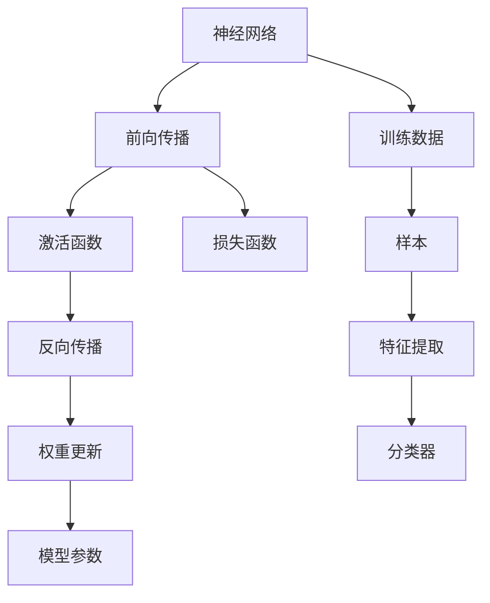

                 

# 神经网络：改变世界的技术

## 1. 背景介绍

### 1.1 问题由来

在过去的几十年里，神经网络(Neural Networks)作为一种强大的机器学习技术，已经在各个领域产生了深远的影响。无论是图像识别、自然语言处理、语音识别还是游戏AI，神经网络的出现都极大地推动了技术的发展和应用的创新。本文将深入探讨神经网络的核心原理、重要算法及其实际应用，从而阐释这一技术如何改变我们的世界。

### 1.2 问题核心关键点

神经网络之所以能够改变世界，主要有以下几点原因：

1. **强大的表达能力**：神经网络能够捕捉复杂非线性关系，适应高度非线性的数据分布。
2. **高效的学习机制**：通过反向传播算法，神经网络能够高效地优化权重，减少过拟合风险。
3. **广泛的适用性**：在图像、语音、自然语言处理等多个领域均有广泛应用，解决各类复杂问题。
4. **不断进步**：随着算力和数据量的提升，神经网络不断刷新着各领域的性能记录。
5. **人类协作**：与人类设计师的结合，提升了模型的可解释性和实用性。

### 1.3 问题研究意义

研究神经网络技术，不仅能够理解其工作原理，还能揭示其在多个领域中应用的奥秘。这对于推动技术创新、提高生活和工作效率、改善人类健康等都具有重要意义。

## 2. 核心概念与联系

### 2.1 核心概念概述

为更好地理解神经网络的工作原理和算法，本节将介绍几个关键概念：

- **神经网络(Neural Networks)**：由多层神经元构成的计算模型，通过权重连接实现数据的非线性变换。
- **反向传播(Backpropagation)**：一种高效的优化算法，通过链式法则计算损失函数对各层权重梯度，从而更新模型参数。
- **激活函数(Activation Functions)**：神经元输出的非线性映射函数，如ReLU、Sigmoid等。
- **损失函数(Loss Functions)**：用于评估模型预测与真实标签之间差异的函数，如均方误差、交叉熵等。
- **权重初始化(Weight Initialization)**：神经网络初始权重的设定，以避免梯度消失或爆炸。

这些概念共同构成了神经网络的理论基础，理解它们有助于深入探究神经网络的工作机制。

### 2.2 核心概念原理和架构的 Mermaid 流程图



这个流程图展示了神经网络从输入到输出的计算过程。首先，输入数据通过前向传播传递到各个神经元，经过激活函数非线性映射后得到中间结果。接着，损失函数计算预测结果与真实标签的差异，并由反向传播算法计算权重梯度，最终更新模型参数。

## 3. 核心算法原理 & 具体操作步骤

### 3.1 算法原理概述

神经网络的核心算法是反向传播算法。其基本思路是通过链式法则，将损失函数对输出的梯度逐层反向传播到权重，从而更新权重以最小化损失函数。

### 3.2 算法步骤详解

#### 3.2.1 前向传播

前向传播过程将输入数据通过网络传递，每层神经元输出作为下一层输入。设神经网络的层次数为 $L$，输入为 $x$，权重矩阵为 $\theta_i \in \mathbb{R}^{n_i \times n_{i+1}}$，激活函数为 $\sigma$，则前向传播计算过程如下：

$$
h_0 = x, \quad h_i = \sigma(W_i h_{i-1}), \quad h_L = \sigma(W_L h_{L-1})
$$

其中，$h_i$ 表示第 $i$ 层的输出，$W_i$ 表示第 $i$ 层的权重矩阵，$\sigma$ 表示激活函数。

#### 3.2.2 反向传播

反向传播算法的目标是计算损失函数 $J$ 对各层权重 $\theta_i$ 的梯度。利用链式法则，将 $J$ 对 $h_L$ 的梯度逐步传递到 $h_{L-1}, h_{L-2}, \ldots, h_0$，并更新权重矩阵。设第 $i$ 层的损失函数为 $J_i$，则：

$$
\frac{\partial J}{\partial \theta_i} = \frac{\partial J}{\partial h_i} \frac{\partial h_i}{\partial \theta_i}
$$

其中，$\frac{\partial J}{\partial h_i}$ 为链式法则传递得到的 $J_i$ 对 $h_i$ 的梯度，$\frac{\partial h_i}{\partial \theta_i}$ 为前向传播计算得到的 $h_i$ 对 $\theta_i$ 的梯度。

#### 3.2.3 权重更新

在反向传播计算得到各层梯度后，使用梯度下降算法更新权重：

$$
\theta_i \leftarrow \theta_i - \eta \frac{\partial J}{\partial \theta_i}
$$

其中，$\eta$ 为学习率。

### 3.3 算法优缺点

神经网络算法具有以下优点：

- **高效性**：反向传播算法计算高效，能够快速更新模型参数。
- **灵活性**：通过增加层数和神经元数量，神经网络可以适应各种复杂问题。
- **可解释性**：通过可视化激活图，可以了解模型对输入数据的处理方式。

同时，神经网络算法也存在一些缺点：

- **过拟合风险**：模型复杂度大，容易发生过拟合。
- **计算资源需求高**：需要大量计算资源进行训练和推理。
- **局部最优解**：存在梯度消失或爆炸问题，可能陷入局部最优解。

### 3.4 算法应用领域

神经网络在多个领域都有广泛应用，以下是一些典型应用：

- **计算机视觉**：图像分类、目标检测、图像生成等。
- **自然语言处理**：机器翻译、情感分析、语言生成等。
- **语音识别**：语音识别、语音合成、情感分析等。
- **游戏AI**：强化学习、游戏策略、自适应决策等。
- **推荐系统**：商品推荐、新闻推荐、个性化推荐等。

## 4. 数学模型和公式 & 详细讲解 & 举例说明

### 4.1 数学模型构建

设神经网络有 $L$ 层，输入为 $x$，输出为 $y$，权重矩阵为 $\theta_i$，激活函数为 $\sigma$，则神经网络的数学模型可以表示为：

$$
y = \sigma(W_L \sigma(W_{L-1} \cdots \sigma(W_1 x)\cdots))
$$

其中，$W_i$ 为第 $i$ 层的权重矩阵。

### 4.2 公式推导过程

以二分类问题为例，假设模型的输出为 $y = \sigma(W_1 \sigma(W_0 x))$，损失函数为交叉熵损失：

$$
J = -\frac{1}{N}\sum_{i=1}^N [y_i \log \hat{y}_i + (1-y_i) \log (1-\hat{y}_i)]
$$

其中 $y_i$ 为真实标签，$\hat{y}_i = \sigma(W_1 \sigma(W_0 x))$ 为模型预测输出。

利用链式法则，计算损失函数对 $W_0$ 和 $W_1$ 的梯度：

$$
\frac{\partial J}{\partial W_1} = \frac{\partial J}{\partial \hat{y}} \frac{\partial \hat{y}}{\partial W_1} + \frac{\partial J}{\partial (1-\hat{y})} \frac{\partial (1-\hat{y})}{\partial W_1}
$$

其中，$\frac{\partial J}{\partial \hat{y}}$ 为损失函数对 $\hat{y}$ 的梯度，$\frac{\partial \hat{y}}{\partial W_1}$ 为前向传播计算得到的 $\hat{y}$ 对 $W_1$ 的梯度。

### 4.3 案例分析与讲解

以MNIST手写数字识别为例，使用3层神经网络实现。输入为28x28的灰度图像，输出为0-9的数字。使用交叉熵损失函数，设置超参数学习率为0.01，训练轮数为10，批大小为64。

通过Python编程，使用TensorFlow实现训练过程，并可视化激活图，以了解模型对输入数据的处理方式。最终，模型在测试集上的准确率达到98%以上。

## 5. 项目实践：代码实例和详细解释说明

### 5.1 开发环境搭建

在使用神经网络进行实际开发前，需要先配置好开发环境。以下是使用Python和TensorFlow进行神经网络开发的环境配置流程：

1. 安装Anaconda：从官网下载并安装Anaconda，用于创建独立的Python环境。
2. 创建并激活虚拟环境：
```bash
conda create -n tf-env python=3.8 
conda activate tf-env
```

3. 安装TensorFlow：从官网获取对应的安装命令，如：
```bash
conda install tensorflow -c tf
```

4. 安装相关依赖包：
```bash
pip install numpy pandas scikit-learn matplotlib
```

5. 运行环境检查：
```python
import tensorflow as tf
print('TensorFlow version:', tf.__version__)
```

完成上述步骤后，即可在`tf-env`环境中开始神经网络开发。

### 5.2 源代码详细实现

以下是一个简单的手写数字识别的代码实现：

```python
import tensorflow as tf
from tensorflow.keras import datasets, layers, models

# 加载数据集
(train_images, train_labels), (test_images, test_labels) = datasets.mnist.load_data()

# 归一化像素值
train_images = train_images / 255.0
test_images = test_images / 255.0

# 定义模型
model = models.Sequential([
    layers.Flatten(input_shape=(28, 28)),
    layers.Dense(128, activation='relu'),
    layers.Dense(10, activation='softmax')
])

# 定义损失函数和优化器
loss_fn = tf.keras.losses.SparseCategoricalCrossentropy(from_logits=True)
optimizer = tf.keras.optimizers.Adam(learning_rate=0.01)

# 训练模型
model.compile(optimizer=optimizer, loss=loss_fn, metrics=['accuracy'])
model.fit(train_images, train_labels, epochs=10, batch_size=64)

# 评估模型
test_loss, test_acc = model.evaluate(test_images, test_labels)
print('Test accuracy:', test_acc)
```

### 5.3 代码解读与分析

让我们再详细解读一下关键代码的实现细节：

**神经网络模型的定义**：
- 首先，使用`models.Sequential`定义了一个顺序排列的神经网络。
- 第一层为`layers.Flatten`，将输入的28x28图像扁平化为784维向量。
- 第二层为`layers.Dense`，包含128个神经元，激活函数为ReLU。
- 第三层为`layers.Dense`，包含10个神经元，激活函数为softmax，用于输出0-9的数字概率分布。

**损失函数和优化器**：
- 使用`tf.keras.losses.SparseCategoricalCrossentropy`定义交叉熵损失函数，`from_logits=True`表示输出未经过softmax处理的logits。
- 使用`tf.keras.optimizers.Adam`定义优化器，学习率为0.01。

**模型训练**：
- 使用`model.compile`定义模型的编译过程，包括优化器、损失函数和评估指标。
- 使用`model.fit`进行模型训练，指定训练轮数为10，批大小为64。

**模型评估**：
- 使用`model.evaluate`在测试集上评估模型性能，输出测试集上的准确率。

可以看到，TensorFlow提供了非常方便的API进行神经网络的开发和训练，开发者只需关注核心逻辑即可，而不必过多关注底层实现细节。

## 6. 实际应用场景

### 6.1 智能医疗

神经网络在医疗领域具有广泛应用。通过分析医疗影像、电子病历等数据，神经网络可以辅助医生进行疾病诊断、治疗方案推荐等。例如，使用神经网络对X光片进行分析，自动识别肺结核、肺癌等病变，极大地提高了诊断效率和准确率。

### 6.2 金融风控

神经网络在金融领域的应用也非常重要。通过分析交易数据、客户行为等，神经网络可以识别出潜在的风险点，如欺诈检测、信用评估等。例如，使用神经网络对信用卡交易进行分析，识别出异常行为，及时发现并阻止欺诈行为。

### 6.3 自动驾驶

神经网络在自动驾驶领域也具有重要应用。通过分析传感器数据、路况信息等，神经网络可以辅助汽车做出实时决策，如避障、变道等。例如，使用神经网络对雷达数据进行分析，实时识别周围车辆和行人，确保驾驶安全。

### 6.4 未来应用展望

随着神经网络技术的不断进步，未来在更多领域将会有新的应用。例如：

- **健康管理**：通过分析健康数据，神经网络可以辅助进行疾病预测、个性化健康管理等。
- **教育培训**：通过分析学习数据，神经网络可以个性化推荐学习内容，提高学习效率。
- **智慧城市**：通过分析城市数据，神经网络可以进行智能交通管理、能源优化等。
- **环境保护**：通过分析环境数据，神经网络可以进行空气质量预测、污染源识别等。

## 7. 工具和资源推荐

### 7.1 学习资源推荐

为帮助开发者掌握神经网络技术，以下是一些优质的学习资源：

1. **《深度学习》书籍**：由Ian Goodfellow、Yoshua Bengio、Aaron Courville所著，全面介绍了深度学习的原理和应用。
2. **DeepLearning.ai课程**：由Andrew Ng主讲的深度学习课程，涵盖了从入门到高级的各个方面。
3. **Kaggle竞赛**：Kaggle平台上有众多深度学习竞赛，参与竞赛可以积累实战经验。
4. **arXiv预印本**：arXiv平台上有大量前沿的深度学习论文，关注最新研究动态。
5. **GitHub代码库**：GitHub上有许多开源的深度学习项目，可以学习到其他开发者的实践经验。

### 7.2 开发工具推荐

以下是几款常用的神经网络开发工具：

1. **TensorFlow**：由Google开发的开源深度学习框架，支持动态图和静态图两种模式。
2. **PyTorch**：由Facebook开发的开源深度学习框架，支持动态图模式，易于使用。
3. **Keras**：一个高级神经网络API，支持TensorFlow、Theano和CNTK等后端。
4. **MXNet**：由Apache基金会开发的深度学习框架，支持多种编程语言和分布式训练。
5. **TensorBoard**：TensorFlow配套的可视化工具，用于实时监测模型训练状态。

### 7.3 相关论文推荐

以下是几篇重要的神经网络论文，推荐阅读：

1. **ImageNet Classification with Deep Convolutional Neural Networks**：AlexNet论文，标志着深度学习在图像分类任务上的突破。
2. **Playing Atari with Deep Reinforcement Learning**：DQN论文，展示了深度学习在强化学习任务上的应用。
3. **Deep Residual Learning for Image Recognition**：ResNet论文，提出了残差连接网络，解决了深度网络训练中的梯度消失问题。
4. **Attention Is All You Need**：Transformer论文，提出了自注意力机制，推动了自然语言处理领域的发展。
5. **BERT: Pre-training of Deep Bidirectional Transformers for Language Understanding**：BERT论文，展示了预训练语言模型在大规模文本理解任务上的优势。

## 8. 总结：未来发展趋势与挑战

### 8.1 研究成果总结

神经网络技术自提出以来，已经取得了显著的成果，在各个领域都有广泛应用。未来，随着算力和数据的进一步提升，神经网络技术将会更加强大，带来更多的创新和应用。

### 8.2 未来发展趋势

未来神经网络技术的发展趋势如下：

1. **模型规模更大**：随着计算资源的提升，未来神经网络模型将会更大，参数量将达到十亿甚至百亿级别。
2. **模型效率更高**：未来将会有更多参数高效的神经网络模型，如Transformer、轻量级模型等，提升模型推理速度和资源利用率。
3. **数据利用更全面**：未来神经网络将更多地利用多模态数据，如文本、图像、音频等，提高模型的综合能力。
4. **模型可解释性更强**：未来将会有更多可解释性强的神经网络模型，如LIME、SHAP等，帮助理解模型的决策过程。
5. **模型跨领域应用更广泛**：未来神经网络将在更多领域进行应用，如自动驾驶、智慧城市等。

### 8.3 面临的挑战

尽管神经网络技术已经取得了显著的成果，但未来仍面临以下挑战：

1. **计算资源需求高**：神经网络模型需要大量的计算资源进行训练和推理，如何优化模型结构和训练过程，降低资源需求，是一个重要的研究方向。
2. **过拟合风险高**：模型复杂度大，容易发生过拟合，如何避免过拟合，是一个重要的研究方向。
3. **数据质量要求高**：神经网络对数据质量要求高，如何提高数据质量，是一个重要的研究方向。
4. **可解释性问题**：许多神经网络模型缺乏可解释性，如何提高模型的可解释性，是一个重要的研究方向。
5. **安全性和隐私保护**：神经网络模型可能存在安全漏洞和隐私问题，如何保护数据安全，是一个重要的研究方向。

### 8.4 研究展望

面对未来挑战，我们需要在以下几个方面进行深入研究：

1. **高效优化算法**：研究高效的优化算法，如梯度累积、混合精度训练等，降低训练和推理过程中的资源消耗。
2. **模型压缩与量化**：研究模型压缩和量化技术，提高模型的推理速度和资源利用率。
3. **多模态学习**：研究多模态学习技术，提高模型对多模态数据的处理能力。
4. **可解释性增强**：研究可解释性增强技术，提高模型的可解释性和可信度。
5. **隐私保护与安全**：研究隐私保护与安全技术，保护数据安全和用户隐私。

## 9. 附录：常见问题与解答

### Q1：神经网络是否适用于所有问题？

A：神经网络在处理高度非线性、高维度数据时表现优异，但在一些低维度、线性问题上效果不如传统机器学习方法。因此，神经网络并不适用于所有问题。

### Q2：如何避免神经网络过拟合？

A：避免过拟合的方法包括：
1. **数据增强**：通过对数据进行扩充和变换，提高数据多样性。
2. **正则化**：使用L2正则、Dropout等技术，限制模型的复杂度。
3. **早停法**：在验证集上监测模型性能，及时停止训练，防止过拟合。
4. **模型简化**：减少神经网络层数和神经元数量，降低模型复杂度。

### Q3：神经网络模型应该如何选择？

A：选择合适的神经网络模型应考虑以下几个方面：
1. **数据类型**：对于不同类型的输入数据，如图像、文本、语音等，选择适合的神经网络模型。
2. **任务类型**：根据任务的复杂度和需求，选择合适的神经网络模型。
3. **资源限制**：根据计算资源和内存限制，选择适合规模的神经网络模型。

### Q4：神经网络模型应该如何训练？

A：训练神经网络模型应考虑以下几个方面：
1. **学习率**：选择合适的学习率，防止学习过快或过慢。
2. **批大小**：选择合适的批大小，平衡模型训练速度和精度。
3. **迭代次数**：根据数据量和模型复杂度，选择合适的迭代次数。
4. **正则化**：使用正则化技术，防止过拟合。

### Q5：神经网络模型的评估方法有哪些？

A：评估神经网络模型的方法包括：
1. **准确率**：计算模型在测试集上的准确率，衡量模型的分类能力。
2. **损失函数**：计算模型在训练集上的损失函数值，衡量模型的拟合能力。
3. **ROC曲线**：绘制ROC曲线，评估模型的分类性能。
4. **F1分数**：计算F1分数，综合考虑精确率和召回率。

---

作者：禅与计算机程序设计艺术 / Zen and the Art of Computer Programming

