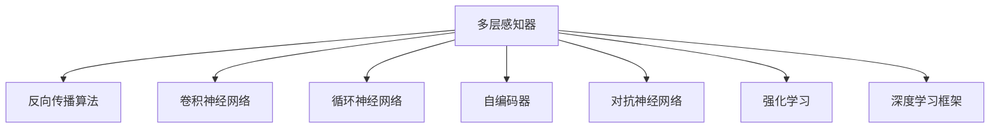

                 

# 神经网络：机器学习的新范式

> 关键词：神经网络,深度学习,反向传播算法,多层感知器,卷积神经网络,循环神经网络,卷积神经网络,自编码器,对抗神经网络,强化学习,深度学习框架,PyTorch,TensorFlow,ANN(人工神经网络)

## 1. 背景介绍

### 1.1 问题由来

在机器学习领域，传统的统计学方法在数据量和特征工程上有较大限制，难以处理复杂的数据结构和模式识别任务。而神经网络（Neural Network, NN）的兴起，提供了一种强大的模型和学习框架，逐渐成为了现代机器学习的主流范式。

神经网络通过模拟人类神经元之间的连接和传递机制，实现从输入数据到输出结果的映射。这一思想最早由生物学家们提出，并在1980年代由Rumelhart等人推广。随后，随着计算资源的提升和算法的改进，神经网络逐步从科学实验室走向工业应用，推动了机器学习技术的跨越式发展。

### 1.2 问题核心关键点

神经网络的核心关键点包括：

1. **多层感知器**：由多个全连接层组成的前馈神经网络。
2. **反向传播算法**：用于计算损失函数关于模型参数的梯度，是神经网络训练的核心。
3. **卷积神经网络（CNN）**：适用于图像识别、语音处理等具有平移不变性的任务。
4. **循环神经网络（RNN）**：用于序列数据处理，如自然语言处理、时间序列预测等。
5. **自编码器**：用于特征学习和数据压缩的生成模型。
6. **对抗神经网络（GAN）**：用于生成新数据，如图片生成、语音合成等。
7. **强化学习**：通过与环境的交互，逐步优化模型行为，如游戏AI、机器人控制等。
8. **深度学习框架**：如PyTorch、TensorFlow等，提供了高效易用的工具和接口。

### 1.3 问题研究意义

研究神经网络，对于推动机器学习技术的发展，解决复杂的数据建模和智能交互问题，具有重要意义：

1. **提升模型能力**：神经网络能够自动学习特征，处理高维度、非线性的数据结构。
2. **扩展应用场景**：从图像处理到自然语言处理，再到机器人控制，神经网络的应用几乎无所不包。
3. **优化决策过程**：通过深度学习，神经网络能够对复杂决策做出高效和准确的判断。
4. **加速科研进程**：神经网络使得数据驱动的科学研究变得更加可能和高效。
5. **推动产业发展**：神经网络技术在医疗、金融、教育等多个领域得到广泛应用，推动了相关产业的数字化转型。

## 2. 核心概念与联系

### 2.1 核心概念概述

为更好地理解神经网络的工作原理和优化方向，本节将介绍几个密切相关的核心概念：

- **多层感知器（MLP）**：最简单的前馈神经网络结构，由多个线性变换和激活函数组成。
- **反向传播算法（Backpropagation）**：用于计算模型参数的梯度，通过链式法则反向传播计算损失函数的导数。
- **卷积神经网络（CNN）**：通过卷积和池化操作提取图像的局部特征。
- **循环神经网络（RNN）**：通过循环连接，捕捉序列数据的时间依赖性。
- **自编码器（Autoencoder）**：通过重构输入数据，学习数据的潜在表示。
- **对抗神经网络（GAN）**：通过对抗训练，生成逼真的新数据。
- **强化学习（Reinforcement Learning）**：通过与环境的互动，优化智能体的行为策略。
- **深度学习框架（Deep Learning Framework）**：如PyTorch、TensorFlow等，提供神经网络建模和训练的基础设施。

这些核心概念之间的逻辑关系可以通过以下Mermaid流程图来展示：



这个流程图展示了大模型模型的核心概念及其之间的关系：

1. 多层感知器是神经网络的基础结构。
2. 反向传播算法是神经网络训练的核心方法。
3. 卷积神经网络、循环神经网络和自编码器分别针对不同类型的数据结构设计了特化模块。
4. 对抗神经网络、强化学习等用于解决生成数据和优化决策的问题。
5. 深度学习框架为模型开发和训练提供了丰富的工具和接口。

这些概念共同构成了神经网络的学习框架，使其能够在各种场景下发挥强大的数据建模和智能决策能力。通过理解这些核心概念，我们可以更好地把握神经网络的工作原理和优化方向。

## 3. 核心算法原理 & 具体操作步骤
### 3.1 算法原理概述

神经网络的核心思想是通过多层非线性变换，将输入数据映射到输出结果。其核心算法包括：

1. **多层感知器（MLP）**：由多个全连接层组成的前馈神经网络。
2. **反向传播算法（Backpropagation）**：用于计算损失函数关于模型参数的梯度，通过链式法则反向传播计算损失函数的导数。

具体来说，假设输入为 $x$，模型输出为 $y$，损失函数为 $L$，模型参数为 $\theta$。反向传播算法通过链式法则计算损失函数对每个参数的梯度，然后利用梯度下降等优化算法更新模型参数，使得损失函数最小化。

### 3.2 算法步骤详解

神经网络的核心训练过程包括：

1. **前向传播**：将输入数据 $x$ 输入神经网络，计算每个神经元的输出。
2. **计算损失**：将模型输出 $y$ 与真实标签 $y^{*}$ 比较，计算损失函数 $L$。
3. **反向传播**：利用链式法则计算每个参数的梯度，将梯度反向传播回每个层。
4. **参数更新**：根据梯度下降等优化算法，更新模型参数 $\theta$。
5. **重复训练**：重复以上步骤，直至损失函数收敛。

具体步骤如下：

**Step 1: 定义模型结构和参数**
- 选择适合任务的神经网络结构，如多层感知器、卷积神经网络、循环神经网络等。
- 定义每个层的神经元数量、激活函数和权重。

**Step 2: 定义损失函数**
- 根据任务类型，选择合适的损失函数，如均方误差、交叉熵等。
- 定义模型的输入 $x$ 和输出 $y$。

**Step 3: 前向传播计算输出**
- 将输入数据 $x$ 输入神经网络，计算每个神经元的输出 $y$。
- 使用激活函数对每个神经元的输出进行非线性变换。

**Step 4: 计算损失函数**
- 将模型输出 $y$ 与真实标签 $y^{*}$ 比较，计算损失函数 $L$。
- 将损失函数 $L$ 作为优化目标。

**Step 5: 反向传播计算梯度**
- 利用链式法则计算损失函数 $L$ 对每个参数的梯度。
- 将梯度反向传播回每个神经元。

**Step 6: 更新模型参数**
- 使用梯度下降等优化算法，更新模型参数 $\theta$。
- 设置合适的学习率和动量参数，确保模型稳定收敛。

**Step 7: 重复训练**
- 重复以上步骤，直至损失函数 $L$ 收敛。

### 3.3 算法优缺点

神经网络具有以下优点：

1. **强大的表达能力**：能够自动学习复杂的数据结构，适应非线性、高维度的输入数据。
2. **高效的特征提取**：通过多层非线性变换，自动提取输入数据的高级特征。
3. **灵活的架构设计**：不同的神经网络结构适用于不同类型的任务。
4. **大规模并行训练**：利用GPU、TPU等硬件加速，支持大规模模型的训练。
5. **端到端的学习**：从数据到模型输出，整个学习过程可以无缝连接，提高模型性能。

同时，神经网络也存在一些缺点：

1. **训练复杂度高**：需要大量的标注数据和计算资源进行训练，时间成本较高。
2. **过拟合风险大**：模型容易过拟合，特别是在数据量不足的情况下。
3. **黑盒性质**：神经网络的学习过程难以解释，难以理解模型的内部机制。
4. **计算资源消耗大**：模型参数和计算复杂度高，对硬件资源要求较高。
5. **模型可解释性差**：神经网络模型难以解释其决策过程，缺乏可解释性。

尽管存在这些局限性，但就目前而言，神经网络作为机器学习的主流范式，仍在广泛应用中不断发展和完善。

### 3.4 算法应用领域

神经网络在众多领域中得到了广泛应用，以下是几个典型的应用场景：

1. **图像识别**：如手写数字识别、人脸识别等。
2. **语音识别**：如语音转文本、语音生成等。
3. **自然语言处理**：如机器翻译、情感分析、文本分类等。
4. **推荐系统**：如电商推荐、内容推荐等。
5. **游戏AI**：如AlphaGo、星际争霸等。
6. **机器人控制**：如机器人导航、机器人操控等。
7. **医疗影像分析**：如CT、MRI图像分类、病变检测等。
8. **金融预测**：如股票价格预测、信用评估等。

除了上述这些经典应用外，神经网络还在很多新兴领域中展现出其强大的潜力，如自动驾驶、智能制造、智慧城市等，为各行各业带来全新的变革和机遇。

## 4. 数学模型和公式 & 详细讲解 & 举例说明
### 4.1 数学模型构建

在神经网络中，我们通常使用以下数学模型来描述模型的学习过程：

- **多层感知器模型**：
  $$
  y_i = f(\sum_{j=1}^n w_{ij} x_j + b_i)
  $$
  其中 $y_i$ 为第 $i$ 个神经元的输出，$w_{ij}$ 为连接第 $j$ 个输入到第 $i$ 个神经元的权重，$x_j$ 为输入数据，$b_i$ 为偏置项，$f$ 为激活函数。

- **反向传播算法**：
  $$
  \frac{\partial L}{\partial w_{ij}} = \frac{\partial L}{\partial y_i} \cdot \frac{\partial y_i}{\partial w_{ij}}
  $$
  其中 $\frac{\partial L}{\partial y_i}$ 为损失函数对输出 $y_i$ 的梯度，$\frac{\partial y_i}{\partial w_{ij}}$ 为输出 $y_i$ 对权重 $w_{ij}$ 的梯度。

### 4.2 公式推导过程

以多层感知器为例，其训练过程可以通过以下公式推导：

- **前向传播**：
  $$
  y^{(l)} = f(\sum_{i=1}^n w^{(l)}_{ij} y^{(l-1)} + b^{(l)})
  $$
  其中 $y^{(l)}$ 为第 $l$ 层的输出，$w^{(l)}_{ij}$ 为第 $l$ 层的权重，$y^{(l-1)}$ 为第 $l-1$ 层的输出，$b^{(l)}$ 为第 $l$ 层的偏置项。

- **计算损失函数**：
  $$
  L = \frac{1}{N} \sum_{i=1}^N L(y_i, y_i^{*})
  $$
  其中 $N$ 为样本数量，$y_i^{*}$ 为第 $i$ 个样本的真实标签。

- **反向传播计算梯度**：
  $$
  \frac{\partial L}{\partial w_{ij}} = \frac{\partial L}{\partial y_i} \cdot \frac{\partial y_i}{\partial w_{ij}}
  $$
  其中 $\frac{\partial L}{\partial y_i}$ 为损失函数对输出 $y_i$ 的梯度，$\frac{\partial y_i}{\partial w_{ij}}$ 为输出 $y_i$ 对权重 $w_{ij}$ 的梯度。

### 4.3 案例分析与讲解

以手写数字识别为例，我们定义一个简单的多层感知器模型，并使用MNIST数据集进行训练和测试。

```python
import torch
import torch.nn as nn
import torch.optim as optim
from torchvision import datasets, transforms

# 定义模型
class Net(nn.Module):
    def __init__(self):
        super(Net, self).__init__()
        self.fc1 = nn.Linear(784, 128)
        self.fc2 = nn.Linear(128, 64)
        self.fc3 = nn.Linear(64, 10)
        self.relu = nn.ReLU()

    def forward(self, x):
        x = x.view(-1, 784)
        x = self.fc1(x)
        x = self.relu(x)
        x = self.fc2(x)
        x = self.relu(x)
        x = self.fc3(x)
        return x

# 定义数据集
train_dataset = datasets.MNIST(root='./data', train=True, transform=transforms.ToTensor(), download=True)
test_dataset = datasets.MNIST(root='./data', train=False, transform=transforms.ToTensor(), download=True)

# 定义训练函数
def train(model, device, train_loader, optimizer, epoch):
    model.train()
    for batch_idx, (data, target) in enumerate(train_loader):
        data, target = data.to(device), target.to(device)
        optimizer.zero_grad()
        output = model(data)
        loss = nn.CrossEntropyLoss()(output, target)
        loss.backward()
        optimizer.step()

# 定义测试函数
def test(model, device, test_loader):
    model.eval()
    correct = 0
    total = 0
    with torch.no_grad():
        for data, target in test_loader:
            data, target = data.to(device), target.to(device)
            output = model(data)
            _, predicted = torch.max(output.data, 1)
            total += target.size(0)
            correct += (predicted == target).sum().item()
    return correct / total

# 设置训练参数
model = Net().to('cuda')
optimizer = optim.SGD(model.parameters(), lr=0.01, momentum=0.5)
device = torch.device('cuda' if torch.cuda.is_available() else 'cpu')

# 训练模型
for epoch in range(10):
    train(model, device, train_loader, optimizer, epoch)
    test_acc = test(model, device, test_loader)
    print('Epoch {}, Test Accuracy: {}'.format(epoch+1, test_acc))
```

在上述代码中，我们定义了一个简单的多层感知器模型，并使用MNIST数据集进行训练和测试。训练过程中，我们使用了交叉熵损失函数和随机梯度下降优化器，并在GPU上加速计算。

通过这个简单的案例，可以看到神经网络的训练过程是如何通过前向传播、反向传播和参数更新实现的。这种训练过程不仅适用于图像识别任务，也适用于其他各种类型的任务，如自然语言处理、语音识别等。

## 5. 项目实践：代码实例和详细解释说明
### 5.1 开发环境搭建

在进行神经网络开发之前，我们需要准备好开发环境。以下是使用Python进行PyTorch开发的环境配置流程：

1. 安装Anaconda：从官网下载并安装Anaconda，用于创建独立的Python环境。

2. 创建并激活虚拟环境：
```bash
conda create -n pytorch-env python=3.8 
conda activate pytorch-env
```

3. 安装PyTorch：根据CUDA版本，从官网获取对应的安装命令。例如：
```bash
conda install pytorch torchvision torchaudio cudatoolkit=11.1 -c pytorch -c conda-forge
```

4. 安装TensorFlow：
```bash
pip install tensorflow
```

5. 安装各类工具包：
```bash
pip install numpy pandas scikit-learn matplotlib tqdm jupyter notebook ipython
```

完成上述步骤后，即可在`pytorch-env`环境中开始神经网络开发。

### 5.2 源代码详细实现

下面我们以卷积神经网络（CNN）图像识别为例，给出使用PyTorch进行CNN模型开发的PyTorch代码实现。

首先，定义CNN模型的类：

```python
import torch.nn as nn
import torch.nn.functional as F

class CNN(nn.Module):
    def __init__(self):
        super(CNN, self).__init__()
        self.conv1 = nn.Conv2d(3, 6, 5)
        self.pool = nn.MaxPool2d(2, 2)
        self.conv2 = nn.Conv2d(6, 16, 5)
        self.fc1 = nn.Linear(16*5*5, 120)
        self.fc2 = nn.Linear(120, 84)
        self.fc3 = nn.Linear(84, 10)

    def forward(self, x):
        x = self.pool(F.relu(self.conv1(x)))
        x = self.pool(F.relu(self.conv2(x)))
        x = x.view(-1, 16*5*5)
        x = F.relu(self.fc1(x))
        x = F.relu(self.fc2(x))
        x = self.fc3(x)
        return x
```

然后，定义训练和评估函数：

```python
from torch.utils.data import DataLoader
from torchvision import datasets
from torchvision.transforms import transforms

def train(model, device, train_loader, optimizer, epoch):
    model.train()
    for batch_idx, (data, target) in enumerate(train_loader):
        data, target = data.to(device), target.to(device)
        optimizer.zero_grad()
        output = model(data)
        loss = F.cross_entropy(output, target)
        loss.backward()
        optimizer.step()

def evaluate(model, device, test_loader):
    model.eval()
    correct = 0
    total = 0
    with torch.no_grad():
        for data, target in test_loader:
            data, target = data.to(device), target.to(device)
            output = model(data)
            _, predicted = torch.max(output.data, 1)
            total += target.size(0)
            correct += (predicted == target).sum().item()
    print('Test Accuracy: {:.2f}%'.format(100 * correct / total))
```

接着，启动训练流程并在测试集上评估：

```python
from torch.optim import SGD

device = torch.device('cuda' if torch.cuda.is_available() else 'cpu')

model = CNN().to(device)
optimizer = SGD(model.parameters(), lr=0.001, momentum=0.9)
train_loader = torch.utils.data.DataLoader(train_dataset, batch_size=64, shuffle=True)
test_loader = torch.utils.data.DataLoader(test_dataset, batch_size=64, shuffle=False)

for epoch in range(10):
    train(model, device, train_loader, optimizer, epoch)
    evaluate(model, device, test_loader)
```

以上就是使用PyTorch进行卷积神经网络图像识别任务开发的完整代码实现。可以看到，得益于PyTorch的强大封装，我们可以用相对简洁的代码完成CNN模型的加载和训练。

### 5.3 代码解读与分析

让我们再详细解读一下关键代码的实现细节：

**CNN类**：
- `__init__`方法：初始化卷积层、池化层和全连接层。
- `forward`方法：定义前向传播计算过程。

**train函数**：
- 将训练数据和标签加载到GPU上，并进行前向传播计算损失函数。
- 反向传播计算梯度并更新模型参数。

**evaluate函数**：
- 将测试数据和标签加载到GPU上，并进行前向传播计算预测结果。
- 计算分类准确率并输出结果。

**训练流程**：
- 定义训练集和测试集的数据加载器。
- 在GPU上初始化模型和优化器。
- 循环迭代训练模型，并在每个epoch结束时评估模型性能。

可以看到，PyTorch使得神经网络的开发变得简洁高效。开发者可以将更多精力放在模型设计、数据处理等高层逻辑上，而不必过多关注底层实现细节。

当然，工业级的系统实现还需考虑更多因素，如模型的保存和部署、超参数的自动搜索、更灵活的训练策略等。但核心的训练流程基本与此类似。

## 6. 实际应用场景
### 6.1 图像识别

卷积神经网络在图像识别领域取得了显著成效，广泛应用于人脸识别、物体检测、医学影像分析等任务中。

以图像分类为例，通过卷积神经网络可以自动学习图像特征，并将图像映射到类别标签。常见的图像分类任务包括MNIST、CIFAR-10、ImageNet等，通过训练模型，可以达到非常高的识别精度。

### 6.2 自然语言处理

神经网络在自然语言处理中也有广泛应用，如机器翻译、情感分析、文本分类等。通过嵌入层、循环神经网络等结构，神经网络可以自动学习语言模型，捕捉语言的语义和结构信息。

以情感分析为例，通过训练情感分析模型，可以将文本映射到情感类别（如正面、负面、中性）。常见的情感分析任务包括IMDb影评分类、亚马逊产品评论分类等。

### 6.3 语音识别

神经网络在语音识别中同样表现出色，通过卷积神经网络、循环神经网络等结构，可以自动学习语音信号的特征，并将语音信号映射到文本。

以语音识别为例，通过训练语音识别模型，可以将语音信号转化为文本，广泛应用于语音助手、电话客服等领域。

### 6.4 强化学习

强化学习是神经网络在智能控制领域的重要应用，通过与环境的交互，神经网络可以逐步优化智能体的行为策略，实现自动驾驶、机器人控制等复杂任务。

以自动驾驶为例，通过训练强化学习模型，可以使无人驾驶汽车在复杂交通环境中做出正确的决策，保障行车安全。

## 7. 工具和资源推荐
### 7.1 学习资源推荐

为了帮助开发者系统掌握神经网络的理论基础和实践技巧，这里推荐一些优质的学习资源：

1. 《深度学习》课程：斯坦福大学Andrew Ng教授开设的在线课程，介绍了深度学习的核心概念和基本算法。
2. 《动手学深度学习》书籍：由李沐等专家编写，提供详细的代码实现和实例，帮助读者深入理解深度学习的数学原理和实践技巧。
3. PyTorch官方文档：PyTorch官方提供的详细文档和教程，涵盖模型的搭建、训练、优化等各个环节。
4. TensorFlow官方文档：TensorFlow官方提供的详细文档和教程，提供高效的深度学习框架，支持分布式训练和模型优化。
5. DeepLearning.ai在线课程：由Andrew Ng等人开设的深度学习专业课程，涵盖了深度学习的各个方面，包括神经网络、卷积神经网络、循环神经网络、深度学习框架等。

通过对这些资源的学习实践，相信你一定能够快速掌握神经网络的学习原理和实践技巧，并用于解决实际的机器学习问题。

### 7.2 开发工具推荐

高效的开发离不开优秀的工具支持。以下是几款用于神经网络开发的常用工具：

1. PyTorch：基于Python的开源深度学习框架，支持动态计算图，适合快速迭代研究。
2. TensorFlow：由Google主导开发的开源深度学习框架，支持分布式训练和模型优化，适用于大规模工程应用。
3. Keras：基于TensorFlow的高级API，提供简单易用的接口，适合快速原型开发。
4. Caffe：由Berkeley Vision and Learning Center开发的深度学习框架，支持卷积神经网络和循环神经网络等。
5. MXNet：由亚马逊开发的深度学习框架，支持多种编程语言和分布式训练，适用于大规模数据处理。

合理利用这些工具，可以显著提升神经网络的开发效率，加快创新迭代的步伐。

### 7.3 相关论文推荐

神经网络的研究源于学界的持续研究。以下是几篇奠基性的相关论文，推荐阅读：

1. A Few Useful Things to Know About Neural Network Optimization：Ruder等人对神经网络优化算法的全面综述，涵盖了各种优化方法的比较和应用。
2. AlexNet：Hinton等人提出的卷积神经网络架构，成功应用于ImageNet图像识别任务，标志着深度学习时代的到来。
3. LSTM：Hochreiter等人提出的长短期记忆网络，能够捕捉序列数据的时间依赖性，广泛应用于自然语言处理、时间序列预测等领域。
4. ResNet：He等人提出的残差网络，通过残差连接解决了深度神经网络训练过程中的梯度消失问题，大大提高了模型的深度和精度。
5. Generative Adversarial Nets（GANs）：Goodfellow等人提出的生成对抗网络，通过对抗训练生成逼真的新数据，广泛应用于图像生成、语音合成等领域。
6. Reinforcement Learning：Sutton和Barto等人提出的强化学习算法，通过与环境的交互，优化智能体的行为策略，广泛应用于机器人控制、自动驾驶等领域。

这些论文代表了大模型模型的发展脉络。通过学习这些前沿成果，可以帮助研究者把握学科前进方向，激发更多的创新灵感。

## 8. 总结：未来发展趋势与挑战
### 8.1 总结

本文对神经网络的学习原理和应用实践进行了全面系统的介绍。首先阐述了神经网络作为机器学习主流范式的背景和意义，明确了神经网络在复杂数据建模和智能决策中的核心地位。其次，从原理到实践，详细讲解了神经网络的数学模型和核心算法，给出了具体的代码实现和详细解读。同时，本文还广泛探讨了神经网络在图像识别、自然语言处理、语音识别、强化学习等多个领域的应用前景，展示了神经网络技术的发展潜力和应用价值。

通过本文的系统梳理，可以看到，神经网络作为机器学习的主流范式，仍在不断演进和完善。未来，伴随着计算资源和算法技术的不断进步，神经网络将迎来新的突破，广泛应用于更多领域，推动人类社会的进步。

### 8.2 未来发展趋势

展望未来，神经网络技术将呈现以下几个发展趋势：

1. **模型规模不断增大**：随着计算资源的提升和数据量的增加，神经网络模型的规模将不断扩大，具备更加丰富的特征表示和建模能力。
2. **模型架构更加灵活**：神经网络的架构将更加多样，如卷积神经网络、循环神经网络、自编码器、生成对抗网络等，适用于不同类型的数据结构和任务。
3. **模型训练效率提升**：新的优化算法和加速技术将进一步提升神经网络模型的训练效率，缩短模型开发时间。
4. **模型应用范围扩大**：神经网络将在更多领域得到应用，如医疗、金融、教育、交通等，为各行各业带来全新的变革和机遇。
5. **模型可解释性增强**：神经网络的内部机制将更加透明，能够提供更好的可解释性和可控性。
6. **模型安全性提升**：通过引入安全约束和鲁棒性训练，神经网络模型的安全性将得到进一步提升。
7. **模型跨领域迁移能力增强**：通过迁移学习和多模态融合，神经网络模型将具备更强的跨领域迁移能力，适应更多样化的应用场景。

以上趋势凸显了神经网络技术的广阔前景。这些方向的探索发展，必将进一步提升神经网络系统的性能和应用范围，为人类社会的智能化进程带来新的推动力。

### 8.3 面临的挑战

尽管神经网络技术已经取得了显著成就，但在迈向更加智能化、普适化应用的过程中，它仍面临诸多挑战：

1. **训练成本高**：神经网络模型通常需要大量的标注数据和计算资源进行训练，时间成本较高。
2. **过拟合风险大**：模型容易过拟合，特别是在数据量不足的情况下。
3. **可解释性差**：神经网络模型的决策过程难以解释，缺乏可解释性。
4. **计算资源消耗大**：模型参数和计算复杂度高，对硬件资源要求较高。
5. **模型安全性不足**：神经网络模型可能学习到有害信息，存在安全漏洞。

尽管存在这些挑战，但通过不断的技术革新和理论探索，神经网络技术仍有很大的提升空间。未来，我们需要在模型架构、优化算法、可解释性、安全性等方面进一步突破，推动神经网络技术的不断发展。

### 8.4 研究展望

未来的研究需要在以下几个方面寻求新的突破：

1. **无监督学习与自监督学习**：开发更多的无监督和自监督学习方法，减少对标注数据的依赖，提高模型的泛化能力。
2. **参数高效优化**：开发更加高效的优化算法和模型压缩技术，降低模型训练和推理的资源消耗。
3. **可解释性增强**：开发可解释性模型和工具，提供更好的模型理解和调试手段。
4. **安全性保障**：引入安全约束和鲁棒性训练，提高神经网络模型的安全性。
5. **跨领域迁移**：探索多模态数据融合和跨领域迁移技术，提升模型的通用性和适应性。

这些研究方向的探索，必将引领神经网络技术的进一步发展，为构建安全、可靠、可解释、可控的智能系统铺平道路。面向未来，神经网络技术还需要与其他人工智能技术进行更深入的融合，如知识表示、因果推理、强化学习等，多路径协同发力，共同推动人工智能技术的进步。只有勇于创新、敢于突破，才能不断拓展神经网络技术的边界，让人工智能技术更好地服务于人类社会。

## 9. 附录：常见问题与解答

**Q1：神经网络为什么需要反向传播算法？**

A: 神经网络中的参数需要优化，以使得模型输出与真实标签之间的误差最小化。反向传播算法是一种高效的优化方法，通过链式法则计算每个参数的梯度，进而更新参数。这是神经网络训练的核心步骤，决定了模型能否学习到有效的特征表示。

**Q2：神经网络模型的训练过程中，哪些参数需要更新？**

A: 神经网络模型的训练过程中，除了输入数据和输出标签，其他所有参数（包括权重和偏置）都需要更新。更新参数的过程称为反向传播，通过计算损失函数对每个参数的梯度，使用梯度下降等优化算法更新参数，以使得损失函数最小化。

**Q3：神经网络模型的训练过程中，如何设置学习率？**

A: 学习率是神经网络训练过程中一个重要的超参数，决定了每次参数更新的步长。通常情况下，学习率的设置需要考虑模型的复杂度和训练数据的特征，一般建议从0.001开始，然后根据实验结果进行调整。此外，还可以使用学习率衰减策略，如学习率逐渐降低，以帮助模型更好地收敛。

**Q4：神经网络模型的训练过程中，如何防止过拟合？**

A: 过拟合是指模型在训练集上表现很好，但在测试集上表现较差的现象。防止过拟合的方法包括：
1. 增加数据量：使用更多的训练数据，可以降低模型过拟合的风险。
2. 正则化：如L2正则、Dropout等，可以限制模型参数的大小，避免过拟合。
3. 早停法：在训练过程中，如果模型在验证集上的性能不再提升，则停止训练，以防止过拟合。
4. 模型简化：减少模型的复杂度，如减少层数和神经元数量，可以降低过拟合的风险。

这些方法需要根据具体任务和数据特点进行灵活组合，以确保模型在训练和测试集上都能取得良好的性能。

**Q5：神经网络模型在实际部署中需要注意哪些问题？**

A: 将神经网络模型转化为实际应用，还需要考虑以下因素：
1. 模型裁剪：去除不必要的层和参数，减小模型尺寸，加快推理速度。
2. 量化加速：将浮点模型转为定点模型，压缩存储空间，提高计算效率。
3. 服务化封装：将模型封装为标准化服务接口，便于集成调用。
4. 弹性伸缩：根据请求流量动态调整资源配置，平衡服务质量和成本。
5. 监控告警：实时采集系统指标，设置异常告警阈值，确保服务稳定性。
6. 安全防护：采用访问鉴权、数据脱敏等措施，保障数据和模型安全。

合理利用这些技术，可以显著提升神经网络模型的性能和可靠性，保障其在实际应用中的稳定性和安全性。

---

作者：禅与计算机程序设计艺术 / Zen and the Art of Computer Programming

