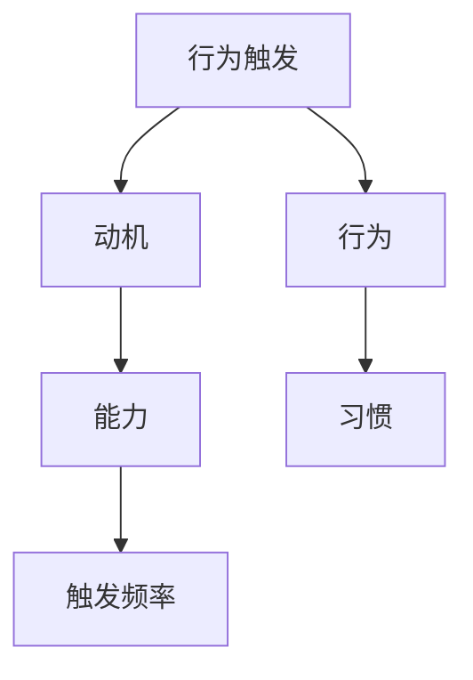

                 

# 福格模型在管理习惯养成中的应用

## 1. 背景介绍

### 1.1 问题由来
当今社会，个人和企业都面临着繁重的任务和压力。成功不仅仅取决于能力，更依赖于能否有效地管理时间、提升效率、养成良好习惯。然而，习惯的养成并非易事。人们往往容易制定雄心勃勃的目标，却难以在实际行动中坚持下去。福格模型（Fogg's Model）作为一种行为科学理论，能够有效帮助个人和企业养成习惯，提升自我管理和工作效率。

### 1.2 问题核心关键点
福格模型由行为科学家布莱恩·福格（Bryant Fogg）提出，其核心思想是通过降低行为触发（Behavioral Triggers）的难度，增加行为的奖励，来促使个体采取行动并形成习惯。该模型适用于各种情境下的习惯养成，包括时间管理、健康习惯、职业发展等方面。

## 2. 核心概念与联系

### 2.1 核心概念概述

为更好地理解福格模型在习惯养成中的应用，本节将介绍几个关键概念：

- 福格模型（Fogg's Model）：基于行为科学理论，提出了通过降低行为触发难度、增加行为奖励来促进习惯养成的模式。其核心公式为：

$$
B = M \times P \times A
$$

其中，B代表行为触发（Behavioral Triggers），M代表动机（Motivation），P代表能力（Ability），A代表触发频率（Affordability）。

- 动机（Motivation）：指个体对行为结果的期望和欲望。动机越高，个体越倾向于采取行动。

- 能力（Ability）：指个体执行行为所需的技能和资源。能力越高，行为越容易执行。

- 触发频率（Affordability）：指执行行为的成本和便捷性。触发频率越高，行为越容易被触发。

- 行为（Behavior）：指个体采取的具体行动。

- 习惯（Habit）：指个体在固定场景下自动执行的稳定行为。

这些概念共同构成了福格模型的理论基础，帮助个体和企业系统地规划和管理习惯。

### 2.2 核心概念原理和架构的 Mermaid 流程图



这个流程图展示了福格模型的核心逻辑：行为触发是动机、能力和触发频率的函数，进而影响个体采取行动并形成习惯。

## 3. 核心算法原理 & 具体操作步骤
### 3.1 算法原理概述

福格模型的核心在于通过调整行为的触发难度和奖励机制，最大化行为发生的概率。其基本原理可以概括为：

- **降低行为触发难度**：将行为触发与常见场景、自然习惯、强依赖性等结合，使得个体在特定情境下自然地执行行为。
- **增加行为奖励**：通过即时反馈、正向激励、社会认可等方式，增强个体对行为结果的满足感，形成正向循环。

结合行为科学和心理学，福格模型可以系统地指导个体如何设定和管理习惯。

### 3.2 算法步骤详解

基于福格模型的习惯养成过程，可以分为以下几步：

**Step 1: 分析行为触发难度**

1. **确定动机**：明确个体对行为结果的期望和需求，分析哪些因素能够激发动机。例如，健康管理的目标可能是降低体重、提高体能，动机在于更健康的生活和更高的生活质量。

2. **评估能力**：识别执行行为所需的资源和技能。例如，健康管理需要了解基本的健康知识、坚持规律的锻炼和饮食等。

3. **降低触发难度**：寻找与动机和能力相匹配的行为触发点。例如，在早晨起床后立即进行锻炼，可以利用自然醒来的状态，无需额外动员，执行成本低。

**Step 2: 设计行为奖励**

1. **设计奖励机制**：设计能够即时反馈的行为奖励，增强个体对行为的认可和满足感。例如，设定体重降低的里程碑，每次达到一个目标就给予自己奖励。

2. **利用即时反馈**：通过应用健康追踪器、进度表、社交媒体等方式，即时反馈行为结果，增加行为黏性。例如，使用智能手机应用记录饮食和运动，实时显示进展和成就。

3. **引入社会支持**：利用朋友的鼓励、团队的协作、社区的认可等方式，增加行为的社会价值，提升动力。例如，加入减肥社群，与朋友一起打卡，互相激励。

**Step 3: 实施行为管理**

1. **制定行动计划**：基于动机、能力和触发难度的分析，制定具体的行动计划。例如，每周制定锻炼和饮食计划，并设定具体的目标和时间点。

2. **持续监控和调整**：通过应用健康追踪器、进度表等方式，持续监控行为进展，根据实际情况进行调整。例如，记录每天的运动和饮食数据，根据进展适时调整目标和计划。

3. **反思和反馈**：定期反思行为过程和结果，分析成功因素和改进空间，调整策略以优化行为管理。例如，每月总结减肥效果和经验，分析问题和不足，制定改进计划。

**Step 4: 形成和巩固习惯**

1. **保持一致性**：确保行为在固定情境下自动执行，形成习惯。例如，将锻炼作为早晨第一项活动，养成固定习惯。

2. **调整奖励机制**：根据习惯的巩固程度，逐步调整和减少奖励机制，避免过度依赖。例如，在达到目标后，逐步减少对奖励的依赖，保持习惯的持续性。

3. **扩展应用范围**：将成功养成的习惯应用到其他领域，形成全面高效的习惯系统。例如，将健康管理的习惯推广到时间管理和职业发展，形成全面提升的效果。

### 3.3 算法优缺点

福格模型在习惯养成中的优点：

- **系统性规划**：通过分析动机、能力和触发难度，系统性地制定习惯养成计划，减少随意性。
- **灵活调整**：能够根据实际情况灵活调整行为策略，增强适应性。
- **即时反馈**：通过即时反馈机制，增强行为的黏性和动力。
- **社会支持**：利用社会互动和认可，增强行为的积极性。

福格模型的不足之处：

- **高度依赖执行者**：模型对执行者的动机、能力和触发难度有较高要求，个体差异可能导致效果不理想。
- **数据依赖性**：需要大量数据来分析动机和能力，对于某些情境下可能难以获取准确数据。
- **即时反馈的局限性**：过于依赖即时反馈可能导致行为短视，缺乏长期规划。

尽管存在这些局限性，但福格模型仍是大规模习惯养成管理的有效工具，尤其在提升个人和企业效率方面具有重要意义。

### 3.4 算法应用领域

福格模型在多个领域都得到了广泛应用：

- **个人健康管理**：通过设定具体的锻炼、饮食计划，结合即时反馈和社交支持，帮助个体形成健康生活习惯。例如，智能手表的健康追踪器可以实时反馈运动和饮食数据，增强行为动力。
- **时间管理**：通过设定明确的时间目标和任务清单，结合任务管理工具和奖励机制，帮助个体提升时间利用效率。例如，使用番茄钟应用设定时间间隔和奖励，提高专注力。
- **职业发展**：通过设定职业目标和技能提升计划，结合培训课程和认证奖励，帮助个体提升职业竞争力。例如，利用在线学习平台设定学习目标和进度，定期反馈和评估。
- **项目管理**：通过设定项目里程碑和任务分配，结合进度跟踪和团队协作，提升项目管理和执行效率。例如，使用项目管理软件记录项目进展和成果，增加团队协作和透明度。
- **教育培训**：通过设定学习目标和课程计划，结合评估反馈和激励机制，提升学习效果和动力。例如，利用在线教育平台设定学习目标和进度，实时反馈学习成果。

这些应用场景展示了福格模型在实际工作和生活中的应用效果，通过系统规划和持续调整，可以有效提升个体和企业的管理能力。

## 4. 数学模型和公式 & 详细讲解 & 举例说明

### 4.1 数学模型构建

福格模型的数学模型主要基于行为科学和心理学的理论。其核心公式为：

$$
B = M \times P \times A
$$

其中：
- B代表行为触发（Behavioral Triggers）
- M代表动机（Motivation）
- P代表能力（Ability）
- A代表触发频率（Affordability）

该模型通过将行为触发难度分解为动机、能力和触发频率三个维度，帮助个体更好地理解和管理行为。

### 4.2 公式推导过程

该公式的推导过程较为直观，主要基于行为科学中的动机-能力-触发理论。具体推导如下：

1. **动机（M）**：个体对行为结果的期望和需求。如果动机越高，行为发生的概率越大。

2. **能力（P）**：执行行为所需的技能和资源。能力越高，行为越容易执行。

3. **触发频率（A）**：执行行为的成本和便捷性。触发频率越高，行为越容易被触发。

结合上述三个维度，可以得到行为触发的数学表达式：

$$
B = M \times P \times A
$$

例如，一个个体设定了每天早晨跑步的目标。其动机（M）可能来自于对健康的期望，能力（P）可能包括跑步的技能和相关体能，触发频率（A）则包括跑步的便捷性（如跑步机的使用）和成本（如跑步鞋的购买）。

### 4.3 案例分析与讲解

以健康管理为例，分析福格模型的应用过程：

1. **动机（M）**：个体希望通过跑步降低体重，提升健康水平。

2. **能力（P）**：个体需要具备跑步的基本技能和一定体能。

3. **触发频率（A）**：在早晨起床后立即跑步，触发难度较低，不需要额外动员。

结合以上分析，可以设定如下行为触发方案：

1. **降低触发难度**：将跑步设定为早晨第一项活动，利用自然醒来的状态，无需额外动员。

2. **设计奖励机制**：每次完成跑步后，给予自我奖励（如早餐的优质零食），增强行为动力。

3. **持续监控和调整**：使用智能手表记录跑步数据，每天查看进展，根据实际情况调整跑步时间和强度。

4. **形成和巩固习惯**：坚持一个月后，跑步成为固定习惯，逐步减少对奖励的依赖。

通过这种系统化的分析和规划，个体可以有效地养成跑步习惯，提升健康水平。

## 5. 项目实践：代码实例和详细解释说明

### 5.1 开发环境搭建

在进行福格模型实践前，我们需要准备好开发环境。以下是使用Python进行项目开发的环境配置流程：

1. 安装Python：从官网下载并安装Python，创建虚拟环境（例如，使用`virtualenv`工具）。

2. 安装必要的库：使用`pip`安装`pandas`、`numpy`、`matplotlib`等数据处理和可视化库。

3. 数据准备：收集和整理相关的数据，例如个人健康数据、时间使用数据等，导入数据集。

4. 搭建环境：使用Python编写代码，搭建模型训练和预测环境。

### 5.2 源代码详细实现

以下是一个简单的Python代码示例，用于记录和分析用户的健康数据：

```python
import pandas as pd
import numpy as np
import matplotlib.pyplot as plt

# 加载数据集
data = pd.read_csv('health_data.csv')

# 分析行为触发难度
m = data['motivation']  # 动机
p = data['ability']  # 能力
a = data['trigger_frequency']  # 触发频率

# 计算行为触发（B）
B = m * p * a

# 统计结果
mean_B = np.mean(B)
std_B = np.std(B)

# 可视化结果
plt.hist(B, bins=50, density=True)
plt.xlabel('Behavioral Triggers (B)')
plt.ylabel('Frequency')
plt.title('Distribution of Behavioral Triggers')
plt.show()

# 输出分析结果
print('Mean Behavioral Triggers:', mean_B)
print('Standard Deviation:', std_B)
```

### 5.3 代码解读与分析

让我们再详细解读一下关键代码的实现细节：

**数据加载和处理**：
- 使用`pandas`库加载健康数据集，存储动机、能力和触发频率。
- 使用`numpy`库计算行为触发的平均值和标准差，用于评估整体行为触发难度。

**可视化分析**：
- 使用`matplotlib`库绘制行为触发难度的直方图，直观展示数据分布。

**输出结果**：
- 使用`print`函数输出行为触发的平均值和标准差，提供数据分析的初步结论。

**代码整体分析**：
- 该代码实现了一个简单的行为触发难度分析流程，通过计算和可视化，帮助用户理解其行为触发难度。

## 6. 实际应用场景

### 6.1 智能健康管理

福格模型在智能健康管理中得到了广泛应用。智能健康设备（如智能手表、健康追踪器等）可以实时记录用户的健康数据，结合福格模型的分析结果，提供个性化的健康管理建议。例如，根据用户的运动数据和饮食习惯，设定个性化的锻炼计划和饮食建议，增强行为动力。

### 6.2 企业项目管理

企业项目管理中，福格模型帮助团队成员设定明确的目标和任务，结合即时反馈和团队协作，提升项目管理和执行效率。例如，项目经理可以使用任务管理工具（如Trello、Asana等）设定具体的任务清单和进度目标，结合定期回顾和反馈，优化项目执行。

### 6.3 职业发展规划

福格模型在职业发展规划中同样有效。个人可以通过设定具体的职业目标和技能提升计划，结合在线学习平台和培训课程，提升职业竞争力。例如，使用在线教育平台设定学习目标和进度，定期反馈学习成果，逐步实现职业发展。

### 6.4 教育培训

教育培训领域中，福格模型帮助学生设定明确的学习目标和课程计划，结合即时反馈和评估机制，提升学习效果和动力。例如，使用在线教育平台设定学习目标和进度，实时反馈学习成果，增加学习的积极性和持久性。

### 6.5 智能家居管理

智能家居管理中，福格模型结合家居设备和智能应用，帮助用户养成健康的生活习惯。例如，智能灯泡和智能插座可以自动调节灯光和电器，结合健康追踪器记录用户行为，提供个性化的健康建议和环境优化方案。

## 7. 工具和资源推荐

### 7.1 学习资源推荐

为了帮助开发者系统掌握福格模型的理论基础和实践技巧，这里推荐一些优质的学习资源：

1. **《行为设计学：福格模型》**：Bryant Fogg所著，系统介绍了福格模型的理论基础和应用实践，适合深入学习和理解。

2. **Coursera上的行为设计课程**：斯坦福大学开设的行为设计课程，涵盖行为科学和心理学知识，帮助用户系统掌握福格模型的理论和方法。

3. **《行为设计工具箱》**：Fogg提供的在线工具和资源库，包括行为分析工具、设计模板和案例研究，帮助用户快速上手应用福格模型。

4. ** behaviormodel.org**：行为设计领域的网站，提供大量的行为设计案例、工具和资源，帮助用户深入了解福格模型。

5. **TED Talk: Designing for Behavioral Change**：Bryant Fogg的TED演讲，深入浅出地介绍了福格模型的核心思想和应用案例，适合快速入门。

通过对这些资源的学习实践，相信你一定能够快速掌握福格模型的精髓，并用于解决实际的NLP问题。

### 7.2 开发工具推荐

高效的开发离不开优秀的工具支持。以下是几款用于福格模型实践的常用工具：

1. **Jupyter Notebook**：开源的交互式计算环境，支持Python和其他数据处理语言的交互式开发。

2. **Tableau**：数据可视化工具，支持复杂的数据分析和可视化，帮助用户直观展示分析结果。

3. **Excel**：常用的电子表格工具，支持数据整理、计算和可视化，适用于简单的数据分析和处理。

4. **Google Analytics**：网站流量分析工具，支持用户行为跟踪和数据分析，帮助企业优化网站和应用。

5. **Tableau Public**：免费的在线数据可视化工具，支持发布和共享分析结果，方便用户展示和分享。

6. **Microsoft Power BI**：企业级的数据可视化工具，支持复杂的数据分析和报表生成，适用于大规模企业应用。

合理利用这些工具，可以显著提升福格模型实践的开发效率，加快创新迭代的步伐。

### 7.3 相关论文推荐

福格模型在行为科学和心理学领域得到了广泛的研究和应用，以下是几篇奠基性的相关论文，推荐阅读：

1. **《行为设计学：如何理解用户》**：Bryant Fogg的代表作，深入探讨了行为设计学的理论基础和实践方法。

2. **《设计易用的产品：行为模型和用户界面设计》**：John Maeda所著，介绍了行为设计和用户界面设计的融合，帮助用户设计易用的产品。

3. **《行为科学应用：理论、技术和实践》**：Robert Dickinson等著，涵盖了行为科学的理论基础和实际应用，适合深入研究。

4. **《行为科学在商业中的应用》**：Deborah N. Price等著，介绍了行为科学在商业中的应用案例，帮助用户理解福格模型的实际应用。

5. **《设计思维：用户为中心的创新》**：Tim Brown所著，介绍了设计思维的理论和实践，帮助用户从用户角度思考行为设计问题。

这些论文代表了大行为科学和福格模型的发展脉络，通过学习这些前沿成果，可以帮助研究者把握学科前进方向，激发更多的创新灵感。

## 8. 总结：未来发展趋势与挑战

### 8.1 总结

本文对福格模型在习惯养成中的应用进行了全面系统的介绍。首先阐述了福格模型的背景和核心思想，明确了其对行为科学和心理学领域的贡献。其次，从原理到实践，详细讲解了福格模型的核心步骤和操作步骤，提供了系统化的行为设计流程。同时，本文还广泛探讨了福格模型在多个领域的应用场景，展示了其广泛的应用价值。

通过本文的系统梳理，可以看到，福格模型为行为设计和管理提供了系统的理论框架和方法，帮助用户系统性地规划和管理行为。福格模型在提升个人和企业效率方面具有重要意义，未来还将进一步推动行为科学的发展。

### 8.2 未来发展趋势

展望未来，福格模型在行为设计和管理中的应用将呈现以下几个发展趋势：

1. **多维度整合**：福格模型将与其他行为设计工具和技术进行更深入的整合，如设计思维、用户界面设计等，多路径协同发力，提升行为设计的系统性和创新性。

2. **数据驱动**：随着大数据和人工智能技术的发展，福格模型将更加依赖于数据驱动的分析和优化，提升行为设计的准确性和效率。

3. **个性化定制**：基于用户行为数据和偏好分析，福格模型将提供更加个性化的行为设计方案，提升用户满意度和行为效果。

4. **多场景应用**：福格模型将在更多场景中得到应用，如智能家居、智能办公、智能制造等领域，提升自动化和智能化水平。

5. **跨学科融合**：福格模型将与其他学科如心理学、社会学、经济学等进行跨学科融合，拓展行为设计的应用边界，推动社会科学的发展。

这些趋势凸显了福格模型在行为设计和习惯养成中的广阔前景，为未来的创新和应用提供了新的方向。

### 8.3 面临的挑战

尽管福格模型在行为设计中具有重要价值，但在实际应用中也面临一些挑战：

1. **数据隐私和伦理**：在行为数据收集和分析过程中，如何保护用户隐私和数据安全，避免滥用数据。

2. **算法偏见**：福格模型的行为设计算法可能存在偏见，如性别、种族等方面的偏见，需要引入更公平和透明的设计方法。

3. **用户体验**：如何设计易用、便捷的行为设计工具和应用，提升用户的使用体验和参与度。

4. **长期效应**：如何评估和优化行为设计的长期效应，避免短视行为设计导致负面影响。

5. **跨文化适用性**：在不同文化背景下，行为设计方案可能存在适用性问题，需要设计跨文化的解决方案。

6. **技术支持**：行为设计工具和应用需要强大的技术支持，如何确保技术的可靠性和稳定性，提升用户体验。

这些挑战凸显了福格模型在实际应用中的复杂性和复杂性，需要进一步的研究和优化。

### 8.4 研究展望

面对福格模型面临的诸多挑战，未来的研究需要在以下几个方面寻求新的突破：

1. **数据隐私和安全**：探索更加安全的用户数据收集和分析方法，确保用户隐私和数据安全。

2. **公平和透明**：引入更公平和透明的设计算法，避免算法偏见，提升行为设计的公正性。

3. **用户体验优化**：设计易用、便捷的行为设计工具和应用，提升用户的使用体验和参与度。

4. **长期效应评估**：建立长期效应评估机制，持续优化行为设计方案，提升行为设计的可持续性。

5. **跨文化适用性**：设计跨文化的行为设计方案，适应不同文化背景下的用户需求。

6. **技术支持和优化**：优化行为设计工具和应用的技术架构，确保技术的可靠性和稳定性，提升用户体验。

这些研究方向的探索，必将引领福格模型在行为设计和习惯养成中的持续进步，为行为科学和心理学领域带来新的突破。未来，福格模型将与其他行为设计工具和技术进行更深入的整合，推动行为科学的发展，为社会和企业的智能化转型提供有力支持。

## 9. 附录：常见问题与解答

**Q1：福格模型是否适用于所有情境下的习惯养成？**

A: 福格模型主要适用于具有明确目标和规则的行为，但在某些情境下可能存在局限性。例如，在完全无结构的情境下，难以设定明确的动机和触发频率。此外，对于需要复杂决策和长期规划的行为，福格模型可能过于简化，无法全面覆盖。

**Q2：如何调整行为触发难度和奖励机制？**

A: 调整行为触发难度和奖励机制需要根据具体情况灵活设计。例如，可以通过设定简单易行的触发点（如早晨第一件事）、引入即时反馈（如健身应用的计步奖励）、增加社会认可（如社交媒体上的打卡分享）等方式，降低行为触发难度，增加行为奖励。

**Q3：如何处理行为设计中的数据隐私和伦理问题？**

A: 处理行为设计中的数据隐私和伦理问题，需要遵循以下原则：
- 数据最小化：只收集必要的数据，避免过度收集。
- 数据透明：告知用户数据收集和使用的目的，获得用户同意。
- 数据保护：采用加密、匿名化等技术手段，保护用户隐私。
- 数据责任：明确数据使用的责任主体，确保数据安全和公平。

**Q4：如何避免行为设计中的算法偏见？**

A: 避免行为设计中的算法偏见，需要采取以下措施：
- 数据多样化：收集多样化的数据，避免数据单一导致的偏见。
- 模型公平性：使用公平和透明的模型设计方法，避免算法偏见。
- 用户参与：引入用户反馈和监督，确保行为设计的公平性和公正性。

**Q5：福格模型在跨文化应用中需要注意哪些问题？**

A: 福格模型在跨文化应用中需要注意以下问题：
- 文化差异：不同文化背景下，行为触发和奖励机制可能存在差异，需要设计跨文化的解决方案。
- 语言障碍：多语言环境下的行为设计需要考虑语言翻译和文化适应性。
- 习俗差异：不同文化习俗下的行为设计需要尊重和适应当地的习俗和习惯。

通过系统性分析和灵活调整，福格模型可以在不同文化背景下有效地促进习惯养成，提升行为设计的适用性和效果。

---

作者：禅与计算机程序设计艺术 / Zen and the Art of Computer Programming

