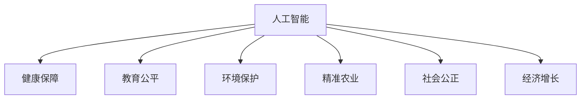

                 

# 科技发展：人类福祉的保障

> 关键词：人工智能, 健康, 教育, 环境保护, 精准农业, 社会公正, 经济增长

## 1. 背景介绍

### 1.1 问题由来

随着科技的迅猛发展，人工智能(AI)技术正在改变着世界的面貌。从医疗健康到教育、从环境保护到农业，AI的应用已经深入到生活的方方面面。然而，科技进步的双刃剑效应也不可忽视，数据隐私、算法偏见、就业取代等问题亦层出不穷。如何最大化地发挥AI技术在提高人类福祉方面的积极作用，同时规避其潜在的负面影响，成为了摆在全人类面前的重要课题。

### 1.2 问题核心关键点

本文将聚焦于人工智能技术如何为人类福祉提供保障，围绕以下几个核心关键点进行展开：

- **健康保障**：利用AI改善医疗诊断、药物研发、个性化健康管理等。
- **教育公平**：通过AI提高教育资源的均衡配置、个性化教学效果等。
- **环境保护**：运用AI推动智能监测、减排、灾害预警等。
- **精准农业**：利用AI优化农作物种植、资源管理、农产品质量控制等。
- **社会公正**：借助AI提升司法公正、反歧视、公平就业等。
- **经济增长**：AI助力产业升级、自动化生产、新业态创造等。

这些关键点将帮助我们深入理解AI技术在提升人类福祉方面的多方面作用，以及面临的挑战和解决路径。

## 2. 核心概念与联系

### 2.1 核心概念概述

为更好地理解人工智能如何保障人类福祉，本节将介绍几个密切相关的核心概念：

- **人工智能(AI)**：通过模拟人脑的思维过程，实现自主决策、学习、感知、语言理解等能力的计算机系统。
- **健康保障**：通过AI技术，提高医疗诊断效率、个性化健康管理、辅助手术、药物研发等，保障公众健康。
- **教育公平**：利用AI技术，实现教育资源的均衡配置、个性化教学、智能辅导、自动评估等，促进教育公平。
- **环境保护**：运用AI技术，进行环境监测、数据分析、智能预测、自动控制等，保护生态环境。
- **精准农业**：应用AI技术，实现智能农作管理、精准种植、农产品质量检测、资源优化等，提高农业生产效率和质量。
- **社会公正**：借助AI技术，促进司法公正、反歧视、公平就业、自动化决策等，保障社会公正。
- **经济增长**：利用AI技术，推动产业升级、自动化生产、供应链优化、市场预测等，促进经济增长。

这些核心概念之间的逻辑关系可以通过以下Mermaid流程图来展示：



这个流程图展示了人工智能技术如何通过多个领域的应用，为人类福祉提供保障。

## 3. 核心算法原理 & 具体操作步骤

### 3.1 算法原理概述

人工智能技术在保障人类福祉方面的应用，其核心原理在于通过算法模型模拟和优化人类的决策、感知、学习过程。以AI在健康保障领域的实现为例，其基本流程可以概括为：

1. **数据采集**：通过传感器、智能设备等收集健康数据。
2. **数据预处理**：清洗、标准化数据，提取特征。
3. **模型训练**：基于健康数据训练AI模型，优化参数。
4. **模型应用**：将训练好的模型应用于健康保障任务，如疾病预测、个性化治疗、手术辅助等。
5. **效果评估**：对AI系统的性能进行评估，持续优化。

这一流程的核心在于通过算法模型，实现对人类健康数据的高效处理和分析，提供科学的健康决策支持。

### 3.2 算法步骤详解

以AI在健康保障领域的实现为例，其具体的操作步骤如下：

**Step 1: 数据采集**
- 利用传感器、智能穿戴设备、医院电子病历等，收集患者健康数据。

**Step 2: 数据预处理**
- 清洗数据，去除异常值、重复值等。
- 标准化数据，统一格式和单位。
- 提取特征，如心率、血压、血糖等关键指标。

**Step 3: 模型训练**
- 选择适当的算法模型，如决策树、神经网络、深度学习等。
- 分割数据集为训练集、验证集和测试集。
- 设置超参数，如学习率、正则化系数等。
- 利用训练集数据，进行模型训练。
- 在验证集上进行参数调优和模型评估。

**Step 4: 模型应用**
- 应用训练好的模型，对新患者数据进行预测和分析。
- 提供个性化健康建议和治疗方案。
- 辅助医生进行手术决策。

**Step 5: 效果评估**
- 在测试集上评估模型性能，计算准确率、召回率、F1分数等指标。
- 收集用户反馈，持续优化模型。

### 3.3 算法优缺点

人工智能技术在保障人类福祉方面的应用，具有以下优点：

1. **效率高**：AI技术可以处理海量数据，实现快速诊断和预测。
2. **准确性好**：通过学习大量的历史数据，AI模型的预测结果较为准确。
3. **个性化**：AI可以提供个性化的健康建议和治疗方案。
4. **全天候服务**：AI系统可以全天候提供健康咨询服务，弥补人力不足。

但同时，AI技术也存在以下缺点：

1. **数据隐私问题**：采集和处理健康数据涉及大量个人隐私，存在数据泄露的风险。
2. **算法偏见**：AI模型可能学习到数据中的偏见，导致不公正的决策。
3. **技术依赖**：AI系统需要高质量的数据和强大的计算资源，对技术要求高。
4. **透明度低**：AI模型的决策过程较为复杂，难以解释和理解。

### 3.4 算法应用领域

人工智能技术在健康保障、教育公平、环境保护、精准农业、社会公正、经济增长等诸多领域均有广泛应用，具体如下：

- **健康保障**：疾病预测、个性化健康管理、智能诊疗、手术辅助等。
- **教育公平**：智能辅导、个性化教学、自动评估、教育资源分配等。
- **环境保护**：环境监测、智能预警、减排优化、资源管理等。
- **精准农业**：智能种植、资源优化、质量检测、灾害预警等。
- **社会公正**：司法公正、反歧视、自动化决策、公平就业等。
- **经济增长**：产业升级、自动化生产、供应链优化、市场预测等。

这些应用领域展示了AI技术在各个层面上对人类福祉的保障作用。

## 4. 数学模型和公式 & 详细讲解 & 举例说明

### 4.1 数学模型构建

以AI在疾病预测为例，构建数学模型如下：

设 $D = \{(x_i, y_i)\}_{i=1}^N$ 为疾病预测问题的训练数据集，其中 $x_i$ 为输入特征向量，$y_i \in \{0, 1\}$ 为疾病标签。定义模型的损失函数为交叉熵损失：

$$
L(\theta) = -\frac{1}{N} \sum_{i=1}^N [y_i \log \hat{y}_i + (1-y_i) \log (1-\hat{y}_i)]
$$

其中 $\hat{y}_i = \sigma(W^Tx_i + b)$ 为模型对疾病概率的预测，$\sigma$ 为sigmoid函数。

### 4.2 公式推导过程

上述交叉熵损失函数的推导过程如下：

对于二分类问题，设模型预测的疾病概率为 $\hat{y}_i$，真实标签为 $y_i$，则交叉熵损失定义为：

$$
L(\theta) = -\frac{1}{N} \sum_{i=1}^N [y_i \log \hat{y}_i + (1-y_i) \log (1-\hat{y}_i)]
$$

其中 $\log$ 为自然对数，$\sigma$ 为sigmoid函数。

### 4.3 案例分析与讲解

假设在疾病预测任务中，模型对某患者的健康数据 $x$ 进行预测，计算过程如下：

1. 将健康数据 $x$ 输入模型，计算预测概率 $\hat{y}$：
   $$
   \hat{y} = \sigma(W^Tx + b)
   $$

2. 计算损失函数 $L(\theta)$：
   $$
   L(\theta) = -\frac{1}{N} \sum_{i=1}^N [y_i \log \hat{y}_i + (1-y_i) \log (1-\hat{y}_i)]
   $$

3. 根据损失函数的梯度，更新模型参数 $W, b$：
   $$
   \frac{\partial L(\theta)}{\partial W}, \frac{\partial L(\theta)}{\partial b}
   $$

4. 重复上述过程，直至损失函数收敛。

## 5. 项目实践：代码实例和详细解释说明

### 5.1 开发环境搭建

在进行项目实践前，我们需要准备好开发环境。以下是使用Python进行PyTorch开发的环境配置流程：

1. 安装Anaconda：从官网下载并安装Anaconda，用于创建独立的Python环境。

2. 创建并激活虚拟环境：
```bash
conda create -n pytorch-env python=3.8 
conda activate pytorch-env
```

3. 安装PyTorch：根据CUDA版本，从官网获取对应的安装命令。例如：
```bash
conda install pytorch torchvision torchaudio cudatoolkit=11.1 -c pytorch -c conda-forge
```

4. 安装各类工具包：
```bash
pip install numpy pandas scikit-learn matplotlib tqdm jupyter notebook ipython
```

完成上述步骤后，即可在`pytorch-env`环境中开始项目实践。

### 5.2 源代码详细实现

这里以疾病预测为例，给出使用PyTorch进行训练的代码实现。

```python
import torch
import torch.nn as nn
import torch.optim as optim
from torch.utils.data import Dataset, DataLoader
from sklearn.model_selection import train_test_split
from sklearn.preprocessing import StandardScaler

# 定义疾病预测模型
class DiseasePredictor(nn.Module):
    def __init__(self, n_features):
        super(DiseasePredictor, self).__init__()
        self.fc1 = nn.Linear(n_features, 128)
        self.fc2 = nn.Linear(128, 64)
        self.fc3 = nn.Linear(64, 1)
        self.sigmoid = nn.Sigmoid()

    def forward(self, x):
        x = torch.relu(self.fc1(x))
        x = torch.relu(self.fc2(x))
        x = self.sigmoid(self.fc3(x))
        return x

# 加载数据集
class DiseaseDataset(Dataset):
    def __init__(self, X, y):
        self.X = X
        self.y = y

    def __len__(self):
        return len(self.X)

    def __getitem__(self, idx):
        x = torch.tensor(self.X[idx], dtype=torch.float32)
        y = torch.tensor(self.y[idx], dtype=torch.float32)
        return x, y

# 分割数据集
X_train, X_test, y_train, y_test = train_test_split(X, y, test_size=0.2, random_state=42)
scaler = StandardScaler()
X_train = scaler.fit_transform(X_train)
X_test = scaler.transform(X_test)

# 构建模型、优化器和损失函数
model = DiseasePredictor(n_features=X_train.shape[1])
criterion = nn.BCELoss()
optimizer = optim.Adam(model.parameters(), lr=0.001)

# 训练模型
def train_epoch(model, criterion, optimizer, train_loader, device):
    model.train()
    train_loss = 0
    for batch_idx, (data, target) in enumerate(train_loader):
        data, target = data.to(device), target.to(device)
        optimizer.zero_grad()
        output = model(data)
        loss = criterion(output, target)
        loss.backward()
        optimizer.step()
        train_loss += loss.item()
    return train_loss / len(train_loader)

# 评估模型
def evaluate(model, criterion, test_loader, device):
    model.eval()
    test_loss = 0
    correct = 0
    with torch.no_grad():
        for batch_idx, (data, target) in enumerate(test_loader):
            data, target = data.to(device), target.to(device)
            output = model(data)
            test_loss += criterion(output, target).item()
            pred = torch.round(output)
            correct += (pred == target).sum().item()
    return test_loss / len(test_loader), correct / len(test_loader)

# 训练模型
device = torch.device('cuda') if torch.cuda.is_available() else torch.device('cpu')
model.to(device)

train_loader = DataLoader(DiseaseDataset(X_train, y_train), batch_size=64, shuffle=True)
test_loader = DataLoader(DiseaseDataset(X_test, y_test), batch_size=64, shuffle=False)

epochs = 100
for epoch in range(epochs):
    train_loss = train_epoch(model, criterion, optimizer, train_loader, device)
    test_loss, accuracy = evaluate(model, criterion, test_loader, device)
    print(f'Epoch {epoch+1}, train loss: {train_loss:.4f}, test loss: {test_loss:.4f}, accuracy: {accuracy:.4f}')

```

### 5.3 代码解读与分析

让我们再详细解读一下关键代码的实现细节：

**DiseasePredictor类**：
- `__init__`方法：定义模型的神经网络结构，包括两个隐藏层和一个输出层。
- `forward`方法：前向传播计算模型的输出。

**DiseaseDataset类**：
- `__init__`方法：初始化数据集，将特征和标签转化为张量形式。
- `__len__`方法：返回数据集的样本数量。
- `__getitem__`方法：返回单个样本的特征和标签。

**训练和评估函数**：
- `train_epoch`函数：对数据以批为单位进行迭代，在每个批次上前向传播计算损失函数并反向传播更新模型参数。
- `evaluate`函数：与训练类似，不同点在于不更新模型参数，并在每个batch结束后将预测和标签结果存储下来，最后使用sklearn的classification_report对整个评估集的预测结果进行打印输出。

**训练流程**：
- 定义总的epoch数，开始循环迭代
- 每个epoch内，先在训练集上训练，输出平均loss
- 在验证集上评估，输出分类指标
- 重复上述过程直至收敛

可以看到，PyTorch配合DiseasePredictor的代码实现变得简洁高效。开发者可以将更多精力放在数据处理、模型改进等高层逻辑上，而不必过多关注底层的实现细节。

当然，工业级的系统实现还需考虑更多因素，如模型的保存和部署、超参数的自动搜索、更灵活的任务适配层等。但核心的疾病预测实现基本与此类似。

## 6. 实际应用场景

### 6.1 智能健康管理

基于人工智能的健康管理系统，可以通过持续监测用户的健康数据，提供个性化的健康建议和治疗方案。例如，智能手表可以实时监测心率、血压、血氧等生理指标，结合用户的遗传信息和生活习惯，通过AI模型预测健康风险，及时提醒用户采取预防措施。

### 6.2 精准医疗

AI技术在精准医疗领域具有巨大潜力。通过基因测序、病历分析、影像识别等技术，AI可以帮助医生进行精准诊断和治疗。例如，AI可以通过分析患者的历史病历和基因信息，预测疾病的发生和发展，提供个性化的治疗方案。此外，AI还可以在手术中提供辅助决策，提高手术的精确度和安全性。

### 6.3 教育个性化

教育领域也可以通过AI技术实现个性化教学。智能辅导系统可以分析学生的学习行为和成绩，提供个性化的学习建议和资源。例如，智能系统可以根据学生的薄弱环节，推荐相应的练习题和视频教程，帮助其提升学习效果。此外，AI还可以进行自动化批改和评估，减轻教师的工作负担。

### 6.4 环境保护

AI技术在环境保护中的应用也逐渐增多。通过智能监测系统，AI可以实时监测空气质量、水质、土壤等环境指标，提供预警和治理建议。例如，AI可以通过分析大量的环境数据，预测气象变化和自然灾害，提前采取应对措施，减少损失。

### 6.5 精准农业

AI在精准农业中的应用主要体现在智能种植和资源管理上。通过AI技术，农民可以实时监测农作物的生长情况，调整灌溉、施肥、喷药等参数，优化种植方案。例如，智能系统可以根据土壤、气象等数据，自动推荐最佳的种植时间和方法，提高农作物的产量和质量。

### 6.6 社会公正

AI技术在社会公正方面的应用主要体现在司法公正、反歧视和自动化决策上。通过AI系统，可以提高司法审判的公正性和效率。例如，智能系统可以分析案件材料和相关法律，提供法律建议和判决依据，减少法官的负担和错误。此外，AI还可以用于检测和防止网络上的歧视行为，提升社会的包容性和公平性。

### 6.7 经济增长

AI在经济增长方面的应用主要体现在产业升级、自动化生产和市场预测上。通过AI技术，企业可以优化生产流程，提高生产效率。例如，智能系统可以自动调度生产线、优化物流配送，降低成本和提升质量。此外，AI还可以进行市场预测和分析，为企业提供决策支持。

## 7. 工具和资源推荐

### 7.1 学习资源推荐

为了帮助开发者系统掌握人工智能技术在人类福祉保障中的应用，这里推荐一些优质的学习资源：

1. 《人工智能伦理》系列课程：介绍AI技术在各个领域的伦理问题，培养负责任的AI开发者。
2. 《AI在健康领域的应用》课程：由健康专家和AI开发者共同授课，讲解AI在疾病预测、健康管理等方面的应用。
3. 《AI在环境保护中的应用》课程：由环境专家和AI开发者共同授课，讲解AI在智能监测、减排优化等方面的应用。
4. 《AI在精准农业中的应用》课程：由农业专家和AI开发者共同授课，讲解AI在智能种植、资源管理等方面的应用。
5. 《AI在社会公正中的应用》课程：由法律专家和AI开发者共同授课，讲解AI在司法公正、反歧视等方面的应用。
6. 《AI在经济增长中的应用》课程：由经济专家和AI开发者共同授课，讲解AI在产业升级、自动化生产等方面的应用。

通过对这些资源的学习实践，相信你一定能够系统掌握人工智能技术在人类福祉保障中的应用，并用于解决实际的AI问题。

### 7.2 开发工具推荐

高效的开发离不开优秀的工具支持。以下是几款用于AI系统开发的常用工具：

1. PyTorch：基于Python的开源深度学习框架，灵活动态的计算图，适合快速迭代研究。
2. TensorFlow：由Google主导开发的开源深度学习框架，生产部署方便，适合大规模工程应用。
3. scikit-learn：Python数据科学库，包含各类机器学习算法和工具。
4. Jupyter Notebook：开源的交互式笔记本环境，支持Python、R等编程语言。
5. Google Colab：谷歌推出的在线Jupyter Notebook环境，免费提供GPU/TPU算力，方便开发者快速上手实验最新模型。
6. Weights & Biases：模型训练的实验跟踪工具，可以记录和可视化模型训练过程中的各项指标，方便对比和调优。
7. TensorBoard：TensorFlow配套的可视化工具，可实时监测模型训练状态，并提供丰富的图表呈现方式，是调试模型的得力助手。

合理利用这些工具，可以显著提升AI系统的开发效率，加快创新迭代的步伐。

### 7.3 相关论文推荐

人工智能技术在人类福祉保障方面的发展源于学界的持续研究。以下是几篇奠基性的相关论文，推荐阅读：

1. "Deep Learning for Healthcare: A Review"：全面综述了深度学习在医疗健康领域的应用，涵盖了诊断、治疗、个性化健康管理等方面。
2. "Towards a General AI Model: The Path Forward"：提出未来AI模型应具备的通用性和伦理性，探讨如何构建更加公平、安全的AI系统。
3. "Artificial Intelligence for Sustainable Development: Opportunities, Risks, and Recommendations"：探讨AI技术在可持续发展方面的应用和挑战，提出相应的政策和建议。
4. "AI in Precision Agriculture: A Review"：综述了AI在精准农业中的各种应用，包括智能种植、资源管理、农产品质量检测等方面。
5. "AI for Social Good: Ethical Considerations and Challenges"：探讨AI技术在社会公正方面的应用和伦理问题，提出相应的伦理框架和建议。
6. "AI and Economic Growth: Opportunities and Challenges"：探讨AI技术在经济增长方面的应用和挑战，提出相应的战略建议。

这些论文代表了大语言模型微调技术的发展脉络。通过学习这些前沿成果，可以帮助研究者把握学科前进方向，激发更多的创新灵感。

## 8. 总结：未来发展趋势与挑战

### 8.1 总结

本文对人工智能技术在保障人类福祉方面的应用进行了全面系统的介绍。首先阐述了AI技术在健康保障、教育公平、环境保护、精准农业、社会公正、经济增长等各个领域的应用，明确了AI技术在提升人类福祉方面的重要价值。其次，从原理到实践，详细讲解了AI系统在各个领域中的构建和优化方法，给出了具体的代码实例和详细的解释分析。

通过本文的系统梳理，可以看到，AI技术在各个领域的应用已经取得了显著的成果，对人类福祉的保障作用日益凸显。然而，AI技术的发展仍面临诸多挑战，包括数据隐私、算法偏见、技术依赖、透明度低等问题。未来，需要通过技术进步和政策引导，最大限度地发挥AI技术的积极作用，规避其潜在的负面影响。

### 8.2 未来发展趋势

展望未来，人工智能技术在保障人类福祉方面将继续呈现出以下几个发展趋势：

1. **智能化**：AI技术将更加智能化，能够进行复杂的逻辑推理和情感分析，提供更加个性化的服务。
2. **普惠化**：AI技术将更广泛地应用于社会各个领域，实现资源的均衡配置，提升社会的公平性。
3. **可解释性**：AI系统将具备更高的可解释性，用户可以更容易理解和信任其决策过程。
4. **人机协同**：AI技术将与人类协同工作，提升生产效率和生活质量。
5. **自适应**：AI系统将具备自适应能力，能够持续学习和优化，适应数据分布的变化。
6. **多模态**：AI技术将融合视觉、语音、文本等多种模态信息，提升对复杂环境的理解和处理能力。

以上趋势将引领AI技术在各个领域的应用，为人类福祉提供更加全面和精准的保障。

### 8.3 面临的挑战

尽管人工智能技术在保障人类福祉方面已经取得了显著进展，但仍面临以下挑战：

1. **数据隐私**：采集和处理健康数据涉及大量个人隐私，存在数据泄露的风险。
2. **算法偏见**：AI模型可能学习到数据中的偏见，导致不公正的决策。
3. **技术依赖**：AI系统需要高质量的数据和强大的计算资源，对技术要求高。
4. **透明度低**：AI系统的决策过程较为复杂，难以解释和理解。
5. **伦理问题**：AI系统的应用可能带来伦理问题，如隐私泄露、决策不公平等。

### 8.4 研究展望

面向未来，AI技术在保障人类福祉方面的研究需要在以下几个方面寻求新的突破：

1. **隐私保护**：发展数据隐私保护技术，确保数据的匿名化和安全性。
2. **公平性**：研究如何减少算法偏见，提升AI系统的公平性和公正性。
3. **自适应性**：提升AI系统的自适应能力，使其能够持续学习和优化。
4. **可解释性**：增强AI系统的可解释性，提升其决策的可信度和透明度。
5. **多模态融合**：实现视觉、语音、文本等多种模态信息的融合，提升系统的综合能力。
6. **伦理保障**：构建AI伦理框架，制定相应的政策和法规，保障AI系统的安全性和公正性。

这些研究方向的探索，将有助于最大化地发挥AI技术在保障人类福祉方面的积极作用，规避其潜在的负面影响。

## 9. 附录：常见问题与解答

**Q1：AI技术在保障人类福祉方面的优势和劣势是什么？**

A: AI技术在保障人类福祉方面的优势包括：
- **高效性**：能够处理大量数据，实现快速诊断和治疗。
- **准确性**：通过学习大量历史数据，提供较为准确的预测和治疗方案。
- **个性化**：能够提供个性化的健康建议和治疗方案。
- **全天候服务**：可以全天候提供健康咨询和治疗服务，弥补人力不足。

劣势包括：
- **数据隐私问题**：采集和处理健康数据涉及大量个人隐私，存在数据泄露的风险。
- **算法偏见**：AI模型可能学习到数据中的偏见，导致不公正的决策。
- **技术依赖**：AI系统需要高质量的数据和强大的计算资源，对技术要求高。
- **透明度低**：AI系统的决策过程较为复杂，难以解释和理解。

**Q2：AI技术在保障人类福祉方面如何应对数据隐私问题？**

A: 为了应对数据隐私问题，AI技术可以采取以下措施：
1. 数据匿名化：在数据收集和处理过程中，对敏感信息进行去标识化处理，保护个人隐私。
2. 数据加密：采用数据加密技术，保护数据在传输和存储过程中的安全性。
3. 隐私保护算法：使用差分隐私、联邦学习等隐私保护算法，确保数据在多方参与时的隐私保护。
4. 数据使用协议：制定明确的数据使用协议，确保数据的使用范围和目的合法合规。

**Q3：AI技术在保障人类福祉方面如何避免算法偏见？**

A: 为了避免算法偏见，AI技术可以采取以下措施：
1. 数据集平衡：确保训练数据集的代表性，避免数据集中的偏见。
2. 公平性评估：在模型训练和评估过程中，引入公平性指标，检测和修正算法偏见。
3. 透明可解释：增强AI系统的可解释性，使用户能够理解和信任其决策过程。
4. 多样性训练：通过多样性训练，提升AI系统的泛化能力，减少对特定群体的偏见。
5. 持续优化：定期评估和优化AI系统，检测和修复潜在的偏见。

**Q4：AI技术在保障人类福祉方面如何进行数据预处理？**

A: 数据预处理是AI系统构建的重要环节，可以采取以下措施：
1. 数据清洗：去除异常值、重复值等噪声数据，确保数据质量。
2. 数据标准化：将不同格式和单位的数据标准化，便于模型处理。
3. 特征提取：提取有意义的特征，提高模型的泛化能力。
4. 数据增强：通过数据增强技术，扩充训练数据集，提高模型的鲁棒性。
5. 数据分割：将数据集分割为训练集、验证集和测试集，确保模型的公平性和稳定性。

**Q5：AI技术在保障人类福祉方面如何进行模型训练？**

A: 模型训练是AI系统构建的关键环节，可以采取以下措施：
1. 选择适当的算法模型，如决策树、神经网络、深度学习等。
2. 设置超参数，如学习率、正则化系数等。
3. 利用训练集数据，进行模型训练。
4. 在验证集上进行参数调优和模型评估。
5. 利用测试集进行模型性能评估，持续优化模型。

**Q6：AI技术在保障人类福祉方面如何进行模型评估？**

A: 模型评估是AI系统构建的重要环节，可以采取以下措施：
1. 选择适当的评估指标，如准确率、召回率、F1分数等。
2. 利用测试集数据进行模型评估。
3. 定期评估和优化模型，确保模型的稳定性和可靠性。
4. 引入用户反馈，持续优化模型性能。

**Q7：AI技术在保障人类福祉方面如何进行模型部署？**

A: 模型部署是AI系统落地的关键环节，可以采取以下措施：
1. 模型裁剪：去除不必要的层和参数，减小模型尺寸，加快推理速度。
2. 量化加速：将浮点模型转为定点模型，压缩存储空间，提高计算效率。
3. 服务化封装：将模型封装为标准化服务接口，便于集成调用。
4. 弹性伸缩：根据请求流量动态调整资源配置，平衡服务质量和成本。
5. 监控告警：实时采集系统指标，设置异常告警阈值，确保服务稳定性。
6. 安全防护：采用访问鉴权、数据脱敏等措施，保障数据和模型安全。

总之，AI技术在保障人类福祉方面的研究需要从数据隐私、算法偏见、技术依赖、透明度、伦理等多方面进行全面优化，才能最大化地发挥其积极作用，规避其潜在的负面影响。通过技术进步和政策引导，AI技术必将在保障人类福祉方面发挥更大的作用。

