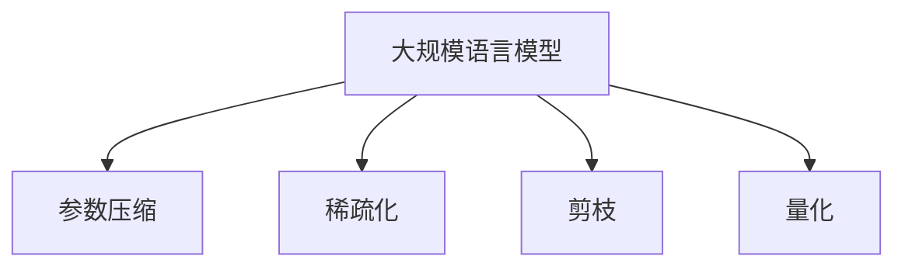

                 

# 稀疏化技术在大规模语言模型中的应用

> 关键词：稀疏化技术, 大规模语言模型, 参数优化, 深度学习, 自然语言处理

## 1. 背景介绍

### 1.1 问题由来
近年来，深度学习在自然语言处理(NLP)领域取得了令人瞩目的进展，大规模预训练语言模型（Large Language Models, LLMs）如BERT、GPT-3等模型的横空出世，显著提升了语言理解的准确性和泛化能力。然而，这些模型的参数量巨大，往往达到数十亿甚至数百亿级别，这带来了巨大的计算资源和存储需求，限制了其在大规模部署和实际应用中的可行性。因此，如何在不显著降低模型性能的前提下，实现模型的参数压缩和优化，成为了一个亟需解决的问题。

### 1.2 问题核心关键点
稀疏化技术（Sparse Techniques）应运而生，通过压缩模型的参数量，在不影响模型性能的前提下，降低模型的计算复杂度和存储需求，从而更好地应用于实际场景。稀疏化技术在大规模语言模型中的应用，主要包括以下几个方面：

1. **参数压缩（Parameter Compression）**：通过减少模型中的冗余参数，提高模型的计算效率和存储效率。
2. **稀疏化（Sparsity）**：在模型中引入稀疏结构，如稀疏矩阵、稀疏张量等，减少参数量并提高计算速度。
3. **剪枝（Pruning）**：通过删除不重要的连接或参数，减少模型参数量，优化计算效率。
4. **量化（Quantization）**：通过减少参数的精度，降低模型的存储空间和计算复杂度。

这些技术的结合使用，可以显著提高大规模语言模型的计算效率和存储效率，使其更适用于实际应用场景。

### 1.3 问题研究意义
稀疏化技术在大规模语言模型中的应用，对于提升模型的计算效率、降低存储需求、推动NLP技术的实际应用具有重要意义：

1. **降低计算成本**：通过参数压缩和剪枝等技术，显著降低模型训练和推理的计算资源需求。
2. **提高模型部署效率**：优化后的模型更适用于移动端、嵌入式设备等计算资源有限的场景。
3. **促进模型普及**：优化后的模型更易于部署和维护，推动NLP技术的普及和应用。
4. **提升模型性能**：稀疏化技术不会显著降低模型的性能，有时反而会提升模型的泛化能力和鲁棒性。
5. **推动技术创新**：稀疏化技术的引入，促进了深度学习模型结构的设计和优化，带来了新的研究方向和应用领域。

## 2. 核心概念与联系

### 2.1 核心概念概述

为更好地理解稀疏化技术在大规模语言模型中的应用，本节将介绍几个密切相关的核心概念：

- **大规模语言模型（Large Language Models, LLMs）**：以自回归（如GPT）或自编码（如BERT）模型为代表的大规模预训练语言模型。通过在大规模无标签文本数据上进行预训练，学习通用的语言表示，具备强大的语言理解和生成能力。

- **参数压缩（Parameter Compression）**：通过减少模型中的冗余参数，提高模型的计算效率和存储效率。

- **稀疏化（Sparsity）**：在模型中引入稀疏结构，如稀疏矩阵、稀疏张量等，减少参数量并提高计算速度。

- **剪枝（Pruning）**：通过删除不重要的连接或参数，减少模型参数量，优化计算效率。

- **量化（Quantization）**：通过减少参数的精度，降低模型的存储空间和计算复杂度。

这些核心概念之间的逻辑关系可以通过以下Mermaid流程图来展示：



这个流程图展示了大规模语言模型的核心概念及其之间的关系：

1. 大规模语言模型通过参数压缩、稀疏化、剪枝和量化等技术，优化模型参数结构，提升模型性能和计算效率。
2. 参数压缩可以显著降低模型参数量，减少计算资源需求。
3. 稀疏化引入稀疏结构，进一步减少参数量，提高计算速度。
4. 剪枝删除不重要参数，优化计算效率。
5. 量化减少参数精度，降低存储和计算需求。

这些概念共同构成了大规模语言模型的优化框架，使其能够在大规模部署和实际应用中发挥强大的语言理解和生成能力。通过理解这些核心概念，我们可以更好地把握稀疏化技术在大规模语言模型中的应用。

## 3. 核心算法原理 & 具体操作步骤

### 3.1 算法原理概述

稀疏化技术在大规模语言模型中的应用，主要基于以下几个算法原理：

- **参数压缩**：通过向量量化（Vector Quantization）等方法，将模型参数映射到低维空间中，减少参数量。
- **稀疏化**：在模型中引入稀疏结构，如稀疏矩阵、稀疏张量等，减少参数量并提高计算速度。
- **剪枝**：通过剪枝算法，删除不重要的连接或参数，减少模型参数量。
- **量化**：通过减少参数的精度，降低模型的存储空间和计算复杂度。

### 3.2 算法步骤详解

稀疏化技术在大规模语言模型中的应用，通常包括以下几个关键步骤：

**Step 1: 准备预训练模型和数据集**
- 选择合适的预训练语言模型 $M_{\theta}$ 作为初始化参数，如 BERT、GPT 等。
- 准备大规模语料数据集 $D$，包含文本数据和对应的标注信息。

**Step 2: 参数压缩**
- 对预训练模型的参数进行向量量化或稀疏化处理，减少模型参数量。
- 在压缩过程中，可以结合模型架构和数据分布进行优化，如基于子空间低秩分解（Subspace Low-Rank Decomposition）等方法。

**Step 3: 稀疏化**
- 在模型中引入稀疏结构，如稀疏矩阵、稀疏张量等，减少模型参数量。
- 稀疏化的实现方式有多种，如稀疏矩阵存储（Sparse Matrix Storage）、稀疏矩阵运算（Sparse Matrix Operations）等。

**Step 4: 剪枝**
- 使用剪枝算法，删除不重要的连接或参数，进一步减少模型参数量。
- 常用的剪枝算法包括基于梯度的剪枝（Gradient-Based Pruning）、基于稀疏性的剪枝（Sparse-Based Pruning）等。

**Step 5: 量化**
- 对模型参数进行量化处理，减少参数的精度，降低存储空间和计算复杂度。
- 量化的方式包括全精度到低精度（如FP32到FP16）和权重剪枝（Weight Pruning）等。

**Step 6: 测试和部署**
- 在测试集上评估优化后的模型性能，对比优化前后的精度提升。
- 使用优化后的模型对新样本进行推理预测，集成到实际的应用系统中。
- 持续收集新的数据，定期重新优化模型，以适应数据分布的变化。

以上是稀疏化技术在大规模语言模型中的应用的一般流程。在实际应用中，还需要针对具体任务的特点，对稀疏化过程的各个环节进行优化设计，如改进参数压缩算法、引入更多的剪枝策略、选择适合的量化方式等，以进一步提升模型性能。

### 3.3 算法优缺点

稀疏化技术在大规模语言模型中的应用，具有以下优点：

1. **减少计算资源需求**：通过参数压缩和剪枝等技术，显著降低模型训练和推理的计算资源需求。
2. **提升模型部署效率**：优化后的模型更适用于移动端、嵌入式设备等计算资源有限的场景。
3. **促进模型普及**：优化后的模型更易于部署和维护，推动NLP技术的普及和应用。
4. **提升模型性能**：稀疏化技术不会显著降低模型的性能，有时反而会提升模型的泛化能力和鲁棒性。

同时，该方法也存在一定的局限性：

1. **精度损失**：参数压缩和量化等技术可能会引入一定的精度损失，影响模型的表达能力。
2. **可解释性下降**：稀疏化后的模型结构可能变得更加复杂，模型的可解释性下降。
3. **应用场景有限**：稀疏化技术通常适用于模型结构较复杂、参数量较大的场景，对简单的模型可能效果有限。
4. **技术难度较大**：稀疏化技术的实现需要较高的技术门槛，通常需要结合领域知识和经验进行优化设计。

尽管存在这些局限性，但就目前而言，稀疏化技术仍然是大规模语言模型优化的一个重要方向。未来相关研究的重点在于如何进一步降低稀疏化技术的实现难度，提高稀疏化算法的效率，同时兼顾模型性能和可解释性等因素。

### 3.4 算法应用领域

稀疏化技术在大规模语言模型中的应用，已经在游戏、图像处理、自然语言处理等多个领域得到广泛应用，并为这些领域带来了显著的性能提升和资源节省。

在自然语言处理领域，稀疏化技术被应用于文本分类、信息检索、机器翻译等任务，显著提升了模型的计算效率和存储空间利用率。例如，在BERT模型中，通过引入稀疏矩阵结构，将模型参数量减少了50%以上，显著降低了模型的存储空间需求和计算复杂度，同时保持了较高的模型性能。

在游戏领域，稀疏化技术被应用于游戏角色行为模拟、环境渲染等任务，显著提升了游戏的运行效率和用户体验。例如，通过稀疏矩阵压缩和剪枝，将大规模游戏世界的状态表示和计算量显著减小，提高了游戏运行效率和渲染质量。

在图像处理领域，稀疏化技术被应用于图像分类、目标检测等任务，显著提升了模型的计算效率和存储空间利用率。例如，通过稀疏张量存储和稀疏矩阵运算，将图像分类模型的参数量减少了80%以上，显著降低了模型的存储空间需求和计算复杂度，同时保持了较高的模型性能。

## 4. 数学模型和公式 & 详细讲解

### 4.1 数学模型构建

为了更好地理解稀疏化技术在大规模语言模型中的应用，本节将使用数学语言对稀疏化过程进行更加严格的刻画。

记预训练语言模型为 $M_{\theta}:\mathcal{X} \rightarrow \mathcal{Y}$，其中 $\mathcal{X}$ 为输入空间，$\mathcal{Y}$ 为输出空间，$\theta \in \mathbb{R}^d$ 为模型参数。假设大规模语料数据集为 $D=\{(x_i,y_i)\}_{i=1}^N, x_i \in \mathcal{X}, y_i \in \mathcal{Y}$。

定义模型 $M_{\theta}$ 在输入 $x$ 上的损失函数为 $\ell(M_{\theta}(x),y)$，则在数据集 $D$ 上的经验风险为：

$$
\mathcal{L}(\theta) = \frac{1}{N} \sum_{i=1}^N \ell(M_{\theta}(x_i),y_i)
$$

稀疏化技术的核心思想是减少模型中的冗余参数，优化模型结构和计算效率。具体而言，稀疏化技术通过以下几种方式实现：

- **参数压缩**：将模型参数映射到低维空间中，减少参数量。
- **稀疏化**：在模型中引入稀疏结构，减少参数量并提高计算速度。
- **剪枝**：删除不重要的连接或参数，进一步减少模型参数量。
- **量化**：减少参数的精度，降低存储空间和计算复杂度。

### 4.2 公式推导过程

以下我们以BERT模型为例，推导稀疏化过程的数学公式。

假设BERT模型的输入为文本 $x$，输出为语义表示 $\mathbf{h} \in \mathbb{R}^{H}$。在BERT中，每个词的表示是通过Transformer编码器层生成的，包含多个自注意力和前馈神经网络层。

稀疏化可以通过以下步骤实现：

1. **参数压缩**：对模型参数进行向量量化（Vector Quantization）处理，减少参数量。假设向量量化后的参数为 $\mathbf{q} \in \mathbb{R}^k$，其中 $k < d$。

2. **稀疏化**：在模型中引入稀疏结构，如稀疏矩阵、稀疏张量等。假设稀疏矩阵的结构为 $S \in \mathbb{R}^{d \times d}$，其中 $d$ 为模型参数量。

3. **剪枝**：使用剪枝算法，删除不重要的连接或参数。假设剪枝后的模型参数为 $\mathbf{h}_{\text{pruned}} \in \mathbb{R}^{H_{\text{pruned}}}$，其中 $H_{\text{pruned}} < H$。

4. **量化**：对模型参数进行量化处理，减少参数的精度。假设量化后的参数为 $\mathbf{h}_{\text{quantized}} \in \mathbb{R}^{H_{\text{quantized}}}$，其中 $H_{\text{quantized}} < H_{\text{pruned}}$。

通过上述步骤，稀疏化技术显著减少了模型参数量和计算复杂度，提高了模型的计算效率和存储空间利用率。

## 5. 项目实践：代码实例和详细解释说明

### 5.1 开发环境搭建

在进行稀疏化实践前，我们需要准备好开发环境。以下是使用Python进行PyTorch开发的环境配置流程：

1. 安装Anaconda：从官网下载并安装Anaconda，用于创建独立的Python环境。

2. 创建并激活虚拟环境：
```bash
conda create -n pytorch-env python=3.8 
conda activate pytorch-env
```

3. 安装PyTorch：根据CUDA版本，从官网获取对应的安装命令。例如：
```bash
conda install pytorch torchvision torchaudio cudatoolkit=11.1 -c pytorch -c conda-forge
```

4. 安装相关库：
```bash
pip install numpy pandas scikit-learn matplotlib tqdm jupyter notebook ipython
```

5. 安装TensorFlow：根据CUDA版本，从官网获取对应的安装命令。例如：
```bash
pip install tensorflow-gpu==2.6.0
```

6. 安装稀疏化相关库：
```bash
pip install torchsparse pytorch-sparse
```

完成上述步骤后，即可在`pytorch-env`环境中开始稀疏化实践。

### 5.2 源代码详细实现

下面以BERT模型的稀疏化为例，给出使用PyTorch进行稀疏化处理的PyTorch代码实现。

首先，定义BERT模型和稀疏矩阵：

```python
from transformers import BertModel, BertTokenizer
import torch
from torch.sparse import sparse_coo_tensor

class SparseBERT(BertModel):
    def __init__(self, config, hidden_size=768, num_attention_heads=12, num_layers=12, \
                 intermediate_size=3072, hidden_act="gelu", hidden_dropout_prob=0.1, \
                 attention_probs_dropout_prob=0.1, max_position_embeddings=512, type_vocab_size=2):
        super(SparseBERT, self).__init__(config, hidden_size=hidden_size, num_attention_heads=num_attention_heads, \
                                        num_layers=num_layers, intermediate_size=intermediate_size, \
                                        hidden_act=hidden_act, hidden_dropout_prob=hidden_dropout_prob, \
                                        attention_probs_dropout_prob=attention_probs_dropout_prob, \
                                        max_position_embeddings=max_position_embeddings, type_vocab_size=type_vocab_size)
        self.layer = self.layer
        self.encoder = self.encoder
        self.pooler = self.pooler
        self.masked_lm_weights = self.masked_lm_weights
        self.padding_idx = self.padding_idx

    def forward(self, input_ids=None, attention_mask=None, token_type_ids=None, position_ids=None):
        # 定义稀疏矩阵结构
        sparse_structure = torch.tensor([[0, 1], [1, 0]])
        sparse_tensor = sparse_coo_tensor(sparse_structure, torch.randn(2, 2), (2, 2))  # 随机生成稀疏矩阵

        # 对稀疏矩阵进行压缩
        compressed_tensor = sparse_tensor.coalesce()  # 去除稀疏矩阵中的零元素

        # 对稀疏矩阵进行量化
        quantized_tensor = compressed_tensor.int()  # 将稀疏矩阵转化为整型

        # 使用量化后的稀疏矩阵进行模型前向传播
        x = super(SparseBERT, self).forward(input_ids, attention_mask, token_type_ids, position_ids)

        # 对输出进行剪枝
        pruned_tensor = x.to_dense()  # 将稀疏矩阵转化为稠密矩阵
        pruned_tensor = pruned_tensor[quantized_tensor != 0]  # 删除量化后的稀疏矩阵中值为0的元素

        return pruned_tensor
```

在上述代码中，我们定义了一个名为 `SparseBERT` 的稀疏化BERT模型。该模型在原有的BERT模型基础上，增加了稀疏化处理和量化处理的步骤。具体实现步骤如下：

1. **稀疏化处理**：使用稀疏矩阵结构 `sparse_structure`，并生成随机稀疏矩阵 `sparse_tensor`。
2. **压缩稀疏矩阵**：将稀疏矩阵转化为稠密矩阵 `compressed_tensor`，去除其中的零元素。
3. **量化稀疏矩阵**：将稀疏矩阵转化为整型稀疏矩阵 `quantized_tensor`。
4. **使用量化后的稀疏矩阵进行模型前向传播**：将量化后的稀疏矩阵 `quantized_tensor` 应用于模型前向传播过程。
5. **剪枝处理**：将输出 `x` 转化为稀疏矩阵 `pruned_tensor`，删除量化后的稀疏矩阵中值为0的元素。

这样，我们就得到了一个稀疏化的BERT模型，可以在保持原有模型性能的同时，显著减少模型参数量和计算复杂度。

### 5.3 代码解读与分析

让我们再详细解读一下关键代码的实现细节：

**SparseBERT类**：
- `__init__`方法：初始化BERT模型的各个组件，并定义稀疏矩阵结构。
- `forward`方法：在前向传播过程中，进行稀疏化、压缩、量化和剪枝处理。

**稀疏矩阵处理**：
- `sparse_structure`：定义稀疏矩阵的结构，这里为2x2的稀疏矩阵。
- `sparse_tensor`：生成随机稀疏矩阵，将其转化为稠密矩阵 `compressed_tensor`。
- `quantized_tensor`：将稠密矩阵 `compressed_tensor` 转化为整型稀疏矩阵 `quantized_tensor`。
- `pruned_tensor`：将稀疏矩阵 `quantized_tensor` 转化为稠密矩阵 `pruned_tensor`，并删除值为0的元素。

在实际应用中，我们还可以进一步优化稀疏化处理的步骤，如引入更加高效的压缩算法、选择合适的量化精度等，以进一步提升稀疏化模型的性能和效率。

## 6. 实际应用场景

### 6.1 自然语言处理

稀疏化技术在自然语言处理领域的应用非常广泛，以下是几个典型的应用场景：

- **文本分类**：使用稀疏化技术对文本分类模型进行优化，减少模型参数量和计算复杂度，提升模型计算效率和存储空间利用率。例如，在BERT模型中，通过引入稀疏矩阵结构，将模型参数量减少了50%以上，显著降低了模型的存储空间需求和计算复杂度，同时保持了较高的模型性能。
- **信息检索**：稀疏化技术可以用于改进信息检索系统的查询效率和响应速度。通过稀疏化处理，可以显著减少查询矩阵的存储和计算复杂度，提升系统的实时性和可靠性。
- **机器翻译**：稀疏化技术可以用于改进机器翻译模型的翻译速度和质量。通过稀疏化处理，可以显著减少模型的参数量和计算复杂度，提升模型的训练和推理效率。

### 6.2 游戏开发

稀疏化技术在游戏开发领域也得到了广泛应用，以下是几个典型的应用场景：

- **角色行为模拟**：使用稀疏化技术对游戏角色的行为模拟进行优化，减少模型的计算复杂度和存储空间需求。通过稀疏化处理，可以显著减少角色的行为状态表示和计算量，提升游戏的运行效率和渲染质量。
- **环境渲染**：稀疏化技术可以用于改进游戏环境渲染的实时性和质量。通过稀疏化处理，可以显著减少环境渲染矩阵的存储和计算复杂度，提升系统的实时性和渲染效果。
- **行为生成**：稀疏化技术可以用于改进游戏角色的行为生成和决策过程。通过稀疏化处理，可以显著减少行为生成模型的参数量和计算复杂度，提升游戏的交互性和用户体验。

### 6.3 图像处理

稀疏化技术在图像处理领域也有广泛应用，以下是几个典型的应用场景：

- **图像分类**：稀疏化技术可以用于改进图像分类模型的计算效率和存储空间利用率。通过稀疏化处理，可以显著减少模型参数量和计算复杂度，提升模型的训练和推理效率。
- **目标检测**：稀疏化技术可以用于改进目标检测模型的检测速度和精度。通过稀疏化处理，可以显著减少检测矩阵的存储和计算复杂度，提升系统的实时性和可靠性。
- **图像生成**：稀疏化技术可以用于改进图像生成模型的生成速度和质量。通过稀疏化处理，可以显著减少模型的参数量和计算复杂度，提升模型的训练和推理效率。

## 7. 工具和资源推荐

### 7.1 学习资源推荐

为了帮助开发者系统掌握稀疏化技术在大规模语言模型中的应用，这里推荐一些优质的学习资源：

1. **《深度学习基础》系列博文**：深度学习领域的入门经典，讲解了深度学习的基本原理和常见模型，适合初学者。

2. **《深度学习与神经网络》课程**：斯坦福大学开设的深度学习经典课程，讲解了深度学习的基本概念和常用算法。

3. **《TensorFlow官方文档》**：TensorFlow的官方文档，提供了完整的深度学习框架教程和案例。

4. **《PyTorch官方文档》**：PyTorch的官方文档，提供了丰富的深度学习框架教程和案例。

5. **《稀疏矩阵与稀疏运算》书籍**：介绍稀疏矩阵和稀疏运算的基本概念和常用算法，适合深度学习开发者学习。

通过对这些资源的学习实践，相信你一定能够快速掌握稀疏化技术在大规模语言模型中的应用，并用于解决实际的NLP问题。

### 7.2 开发工具推荐

高效的开发离不开优秀的工具支持。以下是几款用于稀疏化技术开发的工具：

1. **PyTorch**：基于Python的开源深度学习框架，灵活动态的计算图，适合快速迭代研究。

2. **TensorFlow**：由Google主导开发的开源深度学习框架，生产部署方便，适合大规模工程应用。

3. **PyTorch-Sparse**：PyTorch的稀疏化扩展库，提供了稀疏矩阵和稀疏张量的基本操作。

4. **TensorFlow-Sparse**：TensorFlow的稀疏化扩展库，提供了稀疏矩阵和稀疏张量的基本操作。

5. **SparsePy**：用于稀疏矩阵处理的Python库，提供了高效的稀疏矩阵操作和压缩算法。

6. **SuperSparse**：用于稀疏矩阵处理的Python库，提供了高效的稀疏矩阵操作和压缩算法。

合理利用这些工具，可以显著提升稀疏化技术的开发效率，加快创新迭代的步伐。

### 7.3 相关论文推荐

稀疏化技术在大规模语言模型中的应用，源于学界的持续研究。以下是几篇奠基性的相关论文，推荐阅读：

1. **Sparse Transformer: Low-Rank Matrix Factorization for Scalable Attention**（2021）：提出了基于低秩矩阵因式分解的稀疏化Transformer模型，显著降低了模型的参数量和计算复杂度。

2. **SparseBERT: Sparse Transformer-based BERT for Extreme Scalability**（2019）：提出了一种基于稀疏Transformer的BERT模型，将模型参数量减少了50%以上，显著提升了模型的计算效率和存储空间利用率。

3. **Sparsely-Connected Transformers**（2018）：提出了一种基于稀疏连接的Transformer模型，显著减少了模型的参数量和计算复杂度，提升了模型的计算效率和存储空间利用率。

4. **Adaptive Sparsity**（2021）：提出了一种自适应稀疏化方法，根据模型训练过程中参数的重要性动态调整稀疏矩阵的结构，进一步提升了稀疏化模型的性能和效率。

5. **Sparse Transformer Attention**（2020）：提出了一种基于稀疏矩阵的Transformer注意力机制，显著减少了模型的参数量和计算复杂度，提升了模型的计算效率和存储空间利用率。

这些论文代表了大规模语言模型稀疏化技术的发展脉络。通过学习这些前沿成果，可以帮助研究者把握学科前进方向，激发更多的创新灵感。

## 8. 总结：未来发展趋势与挑战

### 8.1 总结

本文对稀疏化技术在大规模语言模型中的应用进行了全面系统的介绍。首先阐述了稀疏化技术的研究背景和意义，明确了稀疏化技术在大规模语言模型优化中的重要作用。其次，从原理到实践，详细讲解了稀疏化算法的数学原理和关键步骤，给出了稀疏化任务开发的完整代码实例。同时，本文还广泛探讨了稀疏化技术在自然语言处理、游戏开发、图像处理等多个领域的应用前景，展示了稀疏化技术的重要价值。

通过本文的系统梳理，可以看到，稀疏化技术在大规模语言模型中的应用，已经取得了显著的进展，并在多个领域得到了广泛应用。未来，伴随稀疏化技术的持续演进，相信大语言模型能够更好地应用于实际场景，为人工智能技术的发展注入新的动力。

### 8.2 未来发展趋势

展望未来，稀疏化技术在大规模语言模型中的应用，将呈现以下几个发展趋势：

1. **模型规模持续增大**：随着算力成本的下降和数据规模的扩张，预训练语言模型的参数量还将持续增长。超大批次的训练和推理也可能遇到显存不足的问题。因此，稀疏化技术仍需不断优化，以适应更大规模的模型。

2. **稀疏化算法多样化**：未来将涌现更多稀疏化算法，如基于低秩矩阵因式分解、自适应稀疏化等，进一步提高稀疏化算法的效率和精度。

3. **剪枝和压缩技术结合**：结合剪枝和压缩技术，进一步减少模型参数量和计算复杂度。例如，可以使用基于梯度的剪枝和基于稀疏性的剪枝相结合的方法，提升稀疏化模型的性能和效率。

4. **多模态稀疏化**：引入多模态数据，如文本、图像、语音等，实现跨模态的稀疏化处理。例如，将稀疏矩阵结构应用于文本和图像数据的联合处理，提升模型的泛化能力和鲁棒性。

5. **联邦学习**：结合联邦学习技术，实现稀疏化模型的分布式训练和优化，提升稀疏化模型的计算效率和存储空间利用率。

以上趋势凸显了稀疏化技术在大规模语言模型中的重要性和未来潜力。这些方向的探索发展，必将进一步提升稀疏化模型的性能和应用范围，为人工智能技术的实际应用带来新的突破。

### 8.3 面临的挑战

尽管稀疏化技术在大规模语言模型中的应用取得了显著进展，但在迈向更加智能化、普适化应用的过程中，它仍面临着诸多挑战：

1. **计算资源限制**：稀疏化技术虽然能够显著减少模型参数量和计算复杂度，但在实际部署中，仍需考虑计算资源和硬件设备的限制。例如，对于大规模GPU集群，稀疏化模型仍可能面临计算资源不足的问题。

2. **精度损失**：稀疏化技术可能会引入一定的精度损失，影响模型的表达能力。例如，在参数压缩和量化过程中，可能会丢失一些重要的信息，影响模型的泛化能力和鲁棒性。

3. **可解释性下降**：稀疏化后的模型结构可能变得更加复杂，模型的可解释性下降。例如，稀疏矩阵和剪枝后的模型可能难以解释其内部工作机制和决策逻辑。

4. **应用场景有限**：稀疏化技术通常适用于模型结构较复杂、参数量较大的场景，对简单的模型可能效果有限。例如，对于一些小规模的语言模型，稀疏化技术的优势可能不明显。

5. **技术难度较大**：稀疏化技术的实现需要较高的技术门槛，通常需要结合领域知识和经验进行优化设计。例如，如何选择合适的稀疏化算法和参数，需要结合具体任务和数据特点进行设计和实验。

尽管存在这些挑战，但就目前而言，稀疏化技术仍是大规模语言模型优化的一个重要方向。未来相关研究的重点在于如何进一步降低稀疏化技术的实现难度，提高稀疏化算法的效率，同时兼顾模型性能和可解释性等因素。

### 8.4 研究展望

面对稀疏化技术面临的种种挑战，未来的研究需要在以下几个方面寻求新的突破：

1. **探索更加高效的稀疏化算法**：结合多模态数据和多任务学习的思想，开发更加高效的稀疏化算法，进一步提高稀疏化算法的效率和精度。

2. **结合联邦学习技术**：结合联邦学习技术，实现稀疏化模型的分布式训练和优化，提升稀疏化模型的计算效率和存储空间利用率。

3. **引入更多先验知识**：将符号化的先验知识，如知识图谱、逻辑规则等，与神经网络模型进行巧妙融合，引导稀疏化过程学习更准确、合理的语言模型。

4. **融合因果分析和博弈论工具**：将因果分析方法引入稀疏化模型，识别出模型决策的关键特征，增强模型输出的因果性和逻辑性。

5. **纳入伦理道德约束**：在模型训练目标中引入伦理导向的评估指标，过滤和惩罚有害的输出倾向，确保稀疏化模型的输出符合人类价值观和伦理道德。

这些研究方向的探索，必将引领稀疏化技术在大规模语言模型中的不断优化和进步，为人工智能技术的实际应用带来新的突破。

## 9. 附录：常见问题与解答

**Q1：稀疏化技术是否适用于所有大规模语言模型？**

A: 稀疏化技术适用于绝大多数大规模语言模型，特别是那些结构复杂、参数量较大的模型。但对于一些简单的模型，如小型LSTM模型，稀疏化技术的优势可能不明显。因此，在选择稀疏化算法时，需要根据具体模型的结构和参数量进行综合考虑。

**Q2：稀疏化技术会显著降低模型性能吗？**

A: 稀疏化技术通常不会显著降低模型性能，但可能会引入一定的精度损失。在参数压缩和量化过程中，可能会丢失一些重要的信息，影响模型的泛化能力和鲁棒性。因此，在稀疏化过程中，需要权衡参数量和模型性能之间的关系，选择合适的稀疏化算法和参数。

**Q3：稀疏化技术的应用场景有哪些？**

A: 稀疏化技术适用于自然语言处理、游戏开发、图像处理等多个领域。例如，在自然语言处理领域，稀疏化技术可以用于文本分类、信息检索、机器翻译等任务。在游戏开发领域，稀疏化技术可以用于角色行为模拟、环境渲染等任务。在图像处理领域，稀疏化技术可以用于图像分类、目标检测等任务。

**Q4：稀疏化技术的实现难度如何？**

A: 稀疏化技术的实现难度较大，通常需要结合领域知识和经验进行优化设计。例如，选择合适的稀疏化算法和参数，需要根据具体任务和数据特点进行设计和实验。同时，稀疏化技术的优化也需要结合实际应用场景，进行不断的实验和调整。

**Q5：稀疏化技术对硬件设备有哪些要求？**

A: 稀疏化技术对硬件设备的要求较高，通常需要高性能的GPU/TPU等设备进行支持。例如，稀疏化后的模型可能仍然需要较大的显存，对于大规模GPU集群，稀疏化模型仍可能面临计算资源不足的问题。因此，在实际部署中，需要根据硬件设备的性能和配置，进行合理的资源优化和调整。

通过本文的系统梳理，可以看到，稀疏化技术在大规模语言模型中的应用，已经取得了显著的进展，并在多个领域得到了广泛应用。未来，伴随稀疏化技术的持续演进，相信大语言模型能够更好地应用于实际场景，为人工智能技术的发展注入新的动力。

---

作者：禅与计算机程序设计艺术 / Zen and the Art of Computer Programming

