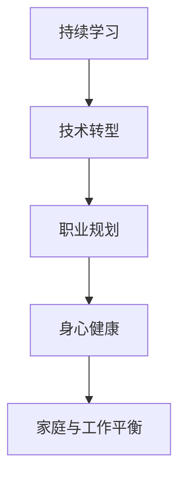

                 

# 程序员如何应对中年危机与职业瓶颈

在IT行业日新月异的时代背景下，技术的快速迭代和商业环境的持续变化对程序员提出了前所未有的挑战。随着年龄的增长，程序员可能面临职业瓶颈、技能陈旧、工作压力大等问题，俗称“中年危机”。本文将探讨如何应对这些挑战，帮助程序员在职业生涯的中后期保持竞争力和持续成长。

## 1. 背景介绍

### 1.1 问题由来

在快速发展的科技行业中，技术更新换代速度极快，新兴技术层出不穷，而传统技术则迅速淘汰。程序员在工作中需要不断学习新技术，才能保持竞争力。然而，随着年龄的增长，很多程序员的学习能力和精力可能逐渐下降，导致在职业发展中遇到瓶颈，甚至面临失业的风险。

### 1.2 问题核心关键点

中年危机通常体现在以下几个方面：

- **技能陈旧**：长时间从事某一领域的技术，未能及时更新和掌握新知识，导致无法适应新兴技术。
- **职业倦怠**：长期高强度工作，缺乏职业发展新动力，感到疲惫和乏味。
- **工作压力**：商业竞争激烈，项目需求频繁变动，需要应对高标准和高要求的工作。
- **身体状况**：工作压力大、长时间加班，导致身体和心理健康问题。
- **家庭责任**：中年期可能面临更多家庭责任，如养育子女、照顾老人等，工作时间和精力可能受到限制。

### 1.3 问题研究意义

探讨如何应对中年危机，对于提升程序员的职业满意度和工作效率，减少人才流失，推动行业健康发展具有重要意义：

- **提升个人竞争力**：通过不断学习和技能提升，应对技术变革，保持职业生涯活力。
- **实现职业发展**：规划职业目标，设定学习计划，实现职业晋升和转型。
- **保持身心健康**：平衡工作与生活，重视身心健康，提高工作幸福感和稳定性。
- **促进行业进步**：减少人才流失，形成持续的技术创新和知识传承。

## 2. 核心概念与联系

### 2.1 核心概念概述

为更好地应对中年危机，本文将介绍几个关键概念及其之间的联系：

- **持续学习**：通过不断学习新知识、新技术，保持技术栈的更新，提升个人技能和知识储备。
- **技术转型**：根据行业趋势和个人兴趣，进行技术方向的转型，从传统技术转向新兴技术，如云计算、人工智能、大数据等。
- **职业规划**：制定明确的职业发展目标，如技术专家、架构师、团队领导等，规划清晰的职业路径。
- **身心健康**：重视身体健康和心理健康，保持良好的生活习惯和工作节奏，提高工作效率和生活质量。
- **家庭与工作平衡**：合理分配时间和精力，平衡家庭责任和工作任务，提升生活质量。

这些概念之间的逻辑关系可以通过以下Mermaid流程图来展示：



这个流程图展示了几大关键概念之间的相互作用：

1. **持续学习**是基础，为技术转型和职业发展提供动力。
2. **技术转型**是关键路径，有助于职业目标的实现。
3. **职业规划**是方向，为技术转型提供目标和策略。
4. **身心健康**是保障，影响职业发展和家庭生活。
5. **家庭与工作平衡**是支持，确保长期稳定和幸福。

## 3. 核心算法原理 & 具体操作步骤

### 3.1 算法原理概述

应对中年危机的核心在于持续学习和职业规划。本节将介绍这些关键概念的算法原理和具体操作步骤。

#### 3.1.1 持续学习

**算法原理**：

持续学习是指通过定期学习新的技术和知识，保持个人技术栈的更新和前沿性。可以采取以下策略：

1. **定期培训**：参加企业内部的技术培训课程或外部技术讲座，提升专业技能。
2. **在线学习**：利用MOOC平台如Coursera、Udemy等，进行在线自学。
3. **阅读文献**：阅读最新技术书籍、论文和博客，跟踪技术动态。
4. **开源项目**：参与开源社区项目，通过实践学习新知识。
5. **技术交流**：参加技术交流会议、线上论坛，与其他技术人员交流经验。

**操作步骤**：

1. **设定学习目标**：根据职业发展方向，确定需要掌握的新技术或知识。
2. **制定学习计划**：每周或每月安排固定时间进行学习，逐步积累知识和技能。
3. **评估学习成果**：通过实践项目或技术测试，评估学习效果，及时调整学习策略。

#### 3.1.2 技术转型

**算法原理**：

技术转型是指从现有技术领域向新兴技术领域转变，以适应行业发展趋势和市场需求。可以采取以下策略：

1. **了解行业趋势**：通过市场调研、技术报告和专家访谈，了解新兴技术的发展趋势。
2. **评估转型成本**：评估转型所需的学习成本、时间和经济成本，制定可行的转型计划。
3. **选择转型方向**：根据个人兴趣和职业规划，选择适合的技术方向，如云计算、人工智能、大数据等。
4. **学习新技能**：通过培训、自学和项目实践，掌握新领域的关键技术和工具。
5. **实战经验**：参与实际项目或开源社区，积累实战经验，提高新技能的熟练度。

**操作步骤**：

1. **调研和选择**：通过市场调研和自我评估，选择适合的新技术领域。
2. **制定转型计划**：制定详细的转型路线图，明确学习目标和关键里程碑。
3. **持续学习**：逐步学习新技能和知识，积累实际项目经验。
4. **实战应用**：在实际项目或开源社区中应用新技能，验证学习效果。
5. **评估和调整**：根据项目反馈和职业发展情况，及时调整转型策略。

#### 3.1.3 职业规划

**算法原理**：

职业规划是指制定明确的职业目标，规划清晰的职业路径，以实现职业生涯的可持续发展。可以采取以下策略：

1. **自我评估**：通过职业性格测试、技能评估，了解自身优势和劣势。
2. **设定目标**：根据自身特点和市场需求，设定短期和长期职业目标，如技术专家、架构师、团队领导等。
3. **制定计划**：根据目标，制定详细的职业发展计划，包括学习路径、项目经验积累等。
4. **定期回顾**：定期回顾职业发展情况，评估目标达成情况，及时调整职业规划。
5. **寻求指导**：向经验丰富的导师或行业专家请教，获得职业发展的建议和指导。

**操作步骤**：

1. **自我评估**：通过职业性格测试和技能评估，了解自身特点和需求。
2. **设定目标**：明确职业目标，设定短期和长期职业发展计划。
3. **制定计划**：根据目标，制定详细的职业发展路线图，包括学习路径和项目经验积累。
4. **定期回顾**：定期回顾职业发展情况，评估目标达成情况，及时调整职业规划。
5. **寻求指导**：向经验丰富的导师或行业专家请教，获得职业发展的建议和指导。

## 4. 数学模型和公式 & 详细讲解 & 举例说明

### 4.1 数学模型构建

本节将使用数学语言对持续学习和技术转型的过程进行更加严格的刻画。

假设程序员初始技能水平为 $S_0$，当前掌握的技术集合为 $\mathcal{T}_0$，目标技能水平为 $S_T$，需要掌握的新技术集合为 $\mathcal{T}_T$。持续学习和技术转型的过程可以用以下数学模型来描述：

1. **持续学习模型**：

   $S_{n+1} = S_n + f_n(\Delta T_n)$

   其中，$f_n$ 表示学习函数，$\Delta T_n$ 表示在第 $n$ 个学习周期中掌握的新技术。

2. **技术转型模型**：

   $S_{T'} = S_{n+1}$

   其中，$T'$ 表示经过 $n$ 个学习周期后的技术水平，$S_{n+1}$ 表示 $n$ 个学习周期后的技能水平。

### 4.2 公式推导过程

以下我们以二叉树模型为例，推导学习路径和技能提升的关系。

假设每次学习周期掌握的新技能数为 $k$，总共需要学习 $m$ 个周期，则技能提升曲线为二叉树形状。

$$
S_T = \sum_{i=0}^{m-1} \sum_{j=0}^{i} k^j
$$

推导过程如下：

1. **第 $i$ 个周期末的技能水平**：

   $S_i = \sum_{j=0}^{i-1} k^j$

2. **总技能提升量**：

   $S_T = \sum_{i=0}^{m-1} S_i = \sum_{i=0}^{m-1} \sum_{j=0}^{i-1} k^j$

   化简得：

   $S_T = \sum_{i=0}^{m-1} \frac{k^i-1}{k-1}$

3. **第 $i$ 个周期学习的技能**：

   $\Delta T_i = S_i - S_{i-1} = k^{i-1}$

   其中，$k$ 为每次学习的技能提升量，$i$ 为学习周期。

### 4.3 案例分析与讲解

**案例**：某中年程序员希望从Java开发转型到人工智能领域。

1. **了解行业趋势**：通过调研，发现人工智能是未来十年的热门领域。
2. **评估转型成本**：评估学习成本，包括在线课程费用、书籍购买、工具软件等。
3. **选择转型方向**：选择Python和机器学习作为入门技能。
4. **学习新技能**：参加在线课程和社区项目，积累实战经验。
5. **实战应用**：参与开源项目和内部项目，应用新技能，验证学习效果。

## 5. 项目实践：代码实例和详细解释说明

### 5.1 开发环境搭建

在进行技术转型实践前，我们需要准备好开发环境。以下是使用Python进行机器学习的开发环境配置流程：

1. 安装Anaconda：从官网下载并安装Anaconda，用于创建独立的Python环境。

2. 创建并激活虚拟环境：
```bash
conda create -n py-env python=3.8 
conda activate py-env
```

3. 安装依赖包：
```bash
pip install numpy pandas scikit-learn matplotlib tqdm jupyter notebook ipython
```

完成上述步骤后，即可在`py-env`环境中开始技术转型实践。

### 5.2 源代码详细实现

下面我以机器学习算法模型训练为例，给出使用Scikit-learn库的Python代码实现。

首先，定义训练数据集：

```python
from sklearn.datasets import load_iris
from sklearn.model_selection import train_test_split

iris = load_iris()
X_train, X_test, y_train, y_test = train_test_split(iris.data, iris.target, test_size=0.3, random_state=42)
```

然后，定义模型和优化器：

```python
from sklearn.ensemble import RandomForestClassifier

model = RandomForestClassifier(n_estimators=100, max_depth=10, random_state=42)

from sklearn.model_selection import GridSearchCV
from sklearn.metrics import accuracy_score

param_grid = {
    'n_estimators': [50, 100, 150],
    'max_depth': [5, 10, 15],
    'min_samples_split': [2, 4, 6],
    'min_samples_leaf': [1, 2, 3],
}

grid_search = GridSearchCV(model, param_grid, cv=5, scoring='accuracy')
grid_search.fit(X_train, y_train)
```

接着，定义训练和评估函数：

```python
def train_model(model, X_train, y_train, X_test, y_test):
    model.fit(X_train, y_train)
    y_pred = model.predict(X_test)
    acc = accuracy_score(y_test, y_pred)
    print(f"Accuracy: {acc:.2f}")
    return model

def evaluate_model(model, X_test, y_test):
    y_pred = model.predict(X_test)
    acc = accuracy_score(y_test, y_pred)
    print(f"Accuracy: {acc:.2f}")

model = train_model(model, X_train, y_train, X_test, y_test)
evaluate_model(model, X_test, y_test)
```

最后，启动训练流程并在测试集上评估：

```python
model = RandomForestClassifier(n_estimators=100, max_depth=10, random_state=42)
model.fit(X_train, y_train)

y_pred = model.predict(X_test)
acc = accuracy_score(y_test, y_pred)
print(f"Accuracy: {acc:.2f}")
```

以上就是使用Scikit-learn进行机器学习算法模型训练的完整代码实现。可以看到，Scikit-learn封装了丰富的机器学习算法和评估工具，使得模型训练和评估变得简单高效。

### 5.3 代码解读与分析

让我们再详细解读一下关键代码的实现细节：

**train_model函数**：
- 接收模型、训练集和测试集作为参数。
- 使用模型训练函数训练模型。
- 在测试集上评估模型性能，并返回训练好的模型。

**evaluate_model函数**：
- 接收模型和测试集作为参数。
- 在测试集上评估模型性能，并输出准确率。

**训练流程**：
- 定义训练集和测试集。
- 创建随机森林模型。
- 使用GridSearchCV进行超参数调优，找出最优参数组合。
- 在训练集上训练模型。
- 在测试集上评估模型性能。

可以看到，Scikit-learn使得模型训练和评估变得简洁高效。开发者可以将更多精力放在模型设计和参数调优等高层逻辑上，而不必过多关注底层的实现细节。

## 6. 实际应用场景

### 6.1 职业转型案例

某中年Java开发工程师希望转型到数据科学领域。

1. **了解行业趋势**：参加数据科学相关会议和培训，学习数据科学的应用场景。
2. **评估转型成本**：评估学习成本，包括数据科学课程费用、书籍购买、软件工具等。
3. **选择转型方向**：选择Python和机器学习作为入门技能。
4. **学习新技能**：参加在线课程和社区项目，积累实战经验。
5. **实战应用**：参与开源项目和内部项目，应用新技能，验证学习效果。

### 6.2 学习资源推荐

为了帮助程序员系统掌握技术转型的理论基础和实践技巧，这里推荐一些优质的学习资源：

1. Coursera的机器学习课程：由斯坦福大学教授Andrew Ng主讲，系统讲解机器学习算法和实际应用。
2. Kaggle平台：通过数据集竞赛和项目实践，提升数据科学和机器学习的实战技能。
3. 《Python数据科学手册》书籍：由Jake VanderPlas编写，全面介绍了Python在数据科学中的应用。
4. 《深度学习》书籍：由Ian Goodfellow等作者编写，介绍了深度学习的基础理论和实战技巧。
5. GitHub上的开源项目：通过阅读和贡献开源项目，学习其他工程师的实践经验和代码实现。

通过对这些资源的学习实践，相信你一定能够快速掌握技术转型的精髓，并用于解决实际的IT问题。

## 7. 工具和资源推荐

### 7.1 学习资源推荐

为了帮助程序员系统掌握技术转型的理论基础和实践技巧，这里推荐一些优质的学习资源：

1. Coursera的机器学习课程：由斯坦福大学教授Andrew Ng主讲，系统讲解机器学习算法和实际应用。
2. Kaggle平台：通过数据集竞赛和项目实践，提升数据科学和机器学习的实战技能。
3. 《Python数据科学手册》书籍：由Jake VanderPlas编写，全面介绍了Python在数据科学中的应用。
4. 《深度学习》书籍：由Ian Goodfellow等作者编写，介绍了深度学习的基础理论和实战技巧。
5. GitHub上的开源项目：通过阅读和贡献开源项目，学习其他工程师的实践经验和代码实现。

通过对这些资源的学习实践，相信你一定能够快速掌握技术转型的精髓，并用于解决实际的IT问题。

### 7.2 开发工具推荐

高效的开发离不开优秀的工具支持。以下是几款用于技术转型开发的常用工具：

1. Python：Python作为数据科学和机器学习的通用语言，具备丰富的库和工具支持。
2. R：R语言在统计分析和数据可视化方面具有独特优势，适合数据科学相关任务。
3. Jupyter Notebook：免费的交互式编程环境，支持Python、R等多种语言，方便开发者记录和分享学习笔记。
4. TensorFlow：由Google主导开发的深度学习框架，生产部署方便，适合大规模工程应用。
5. PyTorch：由Facebook开发的深度学习框架，灵活动态，适合研究和原型开发。
6. Scikit-learn：开源机器学习库，提供了丰富的算法和工具，方便开发者快速实现模型训练和评估。

合理利用这些工具，可以显著提升技术转型的开发效率，加快创新迭代的步伐。

### 7.3 相关论文推荐

技术转型技术的发展源于学界的持续研究。以下是几篇奠基性的相关论文，推荐阅读：

1. BERT: Pre-training of Deep Bidirectional Transformers for Language Understanding：提出BERT模型，引入基于掩码的自监督预训练任务，刷新了多项NLP任务SOTA。
2. Transformer-XL: Attentive Language Models（Transformer-XL论文）：提出Transformer-XL模型，解决了长序列训练问题，提升了模型性能。
3. GANs Trained by a Two Time-Scale Update Rule Converge to the Fixed Points of Their Limiting Dynamics：提出两时间尺度优化算法，提升深度学习模型的训练效率和稳定性。
4. Deep Residual Learning for Image Recognition：提出残差网络（ResNet），解决深度网络训练中的梯度消失问题。
5. Dropout: A Simple Way to Prevent Neural Networks from Overfitting：提出Dropout技术，通过随机失活节点，防止模型过拟合。

这些论文代表了大语言模型微调技术的发展脉络。通过学习这些前沿成果，可以帮助研究者把握学科前进方向，激发更多的创新灵感。

## 8. 总结：未来发展趋势与挑战

### 8.1 总结

本文对技术转型的过程进行了详细分析，探讨了如何应对中年危机，帮助程序员在职业生涯的中后期保持竞争力和持续成长。首先，介绍了持续学习和技术转型等关键概念，并详细讲解了其算法原理和操作步骤。其次，通过实际案例和代码实现，展示了技术转型的具体实践。

通过本文的系统梳理，可以看到，技术转型不仅需要掌握新技能，还需要制定明确的职业目标，规划清晰的职业路径。持续学习和技术转型是应对中年危机的有效方法，可以提升个人竞争力，实现职业发展，保持身心健康，平衡家庭与工作。

### 8.2 未来发展趋势

展望未来，技术转型技术将呈现以下几个发展趋势：

1. 技术栈多样化：随着新兴技术的涌现，程序员需要掌握更多技术栈，如云计算、人工智能、大数据等。
2. 学习资源丰富化：在线课程、开源项目、技术社区等学习资源日益丰富，助力程序员快速掌握新技能。
3. 实战项目密集化：实际项目和竞赛成为技术学习的必备手段，提升实践经验和实战能力。
4. 跨领域融合化：技术转型不仅仅是技术层面的转变，还需要跨领域的综合学习，如数学、心理学等。
5. 职业规划个性化：根据个人兴趣和职业发展目标，制定个性化职业规划，实现长期稳定发展。

以上趋势凸显了技术转型的广阔前景。这些方向的探索发展，必将进一步提升程序员的职业满意度和工作效率，推动IT行业的持续进步。

### 8.3 面临的挑战

尽管技术转型技术已经取得了一定成效，但在迈向更加智能化、普适化应用的过程中，它仍面临着诸多挑战：

1. 学习曲线陡峭：新技能的学习需要大量时间和精力投入，容易出现挫败感。
2. 工作压力大：项目需求频繁变动，工作强度和压力较大，容易产生倦怠。
3. 技能匹配度低：部分新技能与现有工作内容不匹配，需要一段时间才能适应。
4. 知识更新快：技术更新迅速，需要持续学习，容易感到知识更新跟不上节奏。
5. 时间精力受限：家庭责任和生理健康问题，导致时间精力受限，难以兼顾学习和工作。

### 8.4 研究展望

未来研究需要在以下几个方面寻求新的突破：

1. 学习路径优化：制定科学的职业发展路径，避免学习过程中的盲点和误区。
2. 心理支持机制：建立心理辅导和支持机制，帮助程序员应对学习过程中的压力和挑战。
3. 学习资源整合：整合在线课程、开源项目、技术社区等资源，形成一站式的学习平台。
4. 跨领域合作：跨行业和跨领域的合作，促进技术转型的多路径协同发展。
5. 技术生态完善：完善技术生态系统，促进知识共享和人才交流。

这些研究方向的探索，必将引领技术转型技术迈向更高的台阶，为程序员提供更加科学、高效的职业发展路径，推动IT行业的健康发展。总之，技术转型需要程序员不断学习、实践和探索，才能在快速变化的科技环境中保持竞争力，实现职业发展和生活平衡。

## 9. 附录：常见问题与解答

**Q1：如何制定技术转型的职业规划？**

A: 制定技术转型的职业规划需要以下步骤：

1. 自我评估：通过职业性格测试、技能评估，了解自身优势和劣势。
2. 了解行业趋势：通过市场调研、技术报告和专家访谈，了解新兴技术的发展趋势。
3. 评估转型成本：评估学习成本，包括在线课程费用、书籍购买、软件工具等。
4. 选择转型方向：根据自身兴趣和职业规划，选择适合的技术方向。
5. 制定计划：根据目标，制定详细的职业发展计划，包括学习路径和项目经验积累。
6. 定期回顾：定期回顾职业发展情况，评估目标达成情况，及时调整职业规划。
7. 寻求指导：向经验丰富的导师或行业专家请教，获得职业发展的建议和指导。

**Q2：如何应对技术转型的学习曲线陡峭问题？**

A: 应对技术转型的学习曲线陡峭问题，可以采取以下策略：

1. 设定小目标：将大目标分解为小目标，逐步实现，避免一次性学过多知识。
2. 利用在线资源：利用MOOC平台、在线书籍、视频教程等，灵活学习。
3. 参与社区项目：通过参与开源社区项目，实践应用新技能，巩固学习成果。
4. 寻找学习伙伴：与志同道合的学习伙伴共同学习，互相鼓励和支持。
5. 寻求导师指导：请教经验丰富的导师或专家，获得指导和建议。

**Q3：如何平衡工作和学习？**

A: 平衡工作和学习需要以下策略：

1. 时间管理：制定时间表，合理安排工作和学习时间，避免时间冲突。
2. 任务优先级：根据重要性和紧急性，确定任务优先级，优先完成重要任务。
3. 学习与工作结合：将学习内容与工作任务结合，提高学习效率和工作质量。
4. 心理调节：通过运动、娱乐等方式，调节心理压力，保持身心健康。
5. 家庭支持：与家人沟通，争取家庭的理解和支持，减轻家庭负担。

通过本文的系统梳理，可以看到，技术转型需要程序员不断学习、实践和探索，才能在快速变化的科技环境中保持竞争力，实现职业发展和生活平衡。总之，技术转型需要程序员持续努力，不断学习和适应新兴技术，才能在快速发展的IT行业中找到自己的位置，实现职业生涯的可持续发展。

