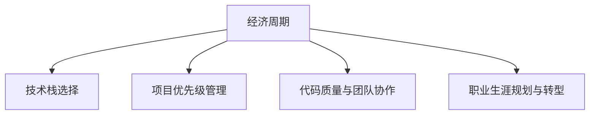
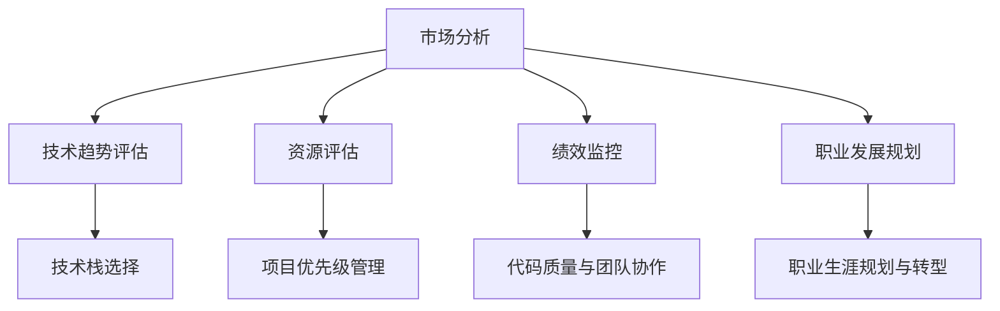

                 

# 程序员如何应对经济周期

> 关键词：经济周期, 技术栈选择, 项目优先级管理, 代码质量与团队协作, 职业生涯规划与转型

## 1. 背景介绍

在经济周期的波动中，程序员面临的最大挑战是如何在市场的不确定性下保护自己和团队的产出。随着科技行业的不断发展，技术栈的更新迭代速度越来越快，新兴技术层出不穷，而经济周期的起伏则进一步加剧了这种不确定性。程序员需要在技术演进和市场需求之间找到平衡，确保团队能够快速适应变化并持续创造价值。本文将探讨如何通过技术栈选择、项目优先级管理、代码质量与团队协作、职业生涯规划与转型等策略，帮助程序员在经济周期中保持竞争力。

## 2. 核心概念与联系

### 2.1 核心概念概述

- **经济周期**：指经济扩张与收缩交替出现的周期性变化过程。在扩张期，市场需求强劲，技术创新活跃；而在收缩期，资金紧张，投资意愿下降。程序员需根据经济周期的不同阶段调整策略，以保持长期竞争力。
- **技术栈选择**：程序员需根据项目需求和团队能力，选择最合适的技术栈，包括语言、框架、库等，以提高开发效率和产品质量。
- **项目优先级管理**：在资源有限的情况下，需合理分配项目优先级，确保关键项目能够得到充分的时间和资源支持。
- **代码质量与团队协作**：保持高代码质量，并通过高效的团队协作，实现技术共享和知识积累，提升团队的整体技术水平。
- **职业生涯规划与转型**：随着技术栈的变化，程序员需不断学习新技能，调整职业路径，以适应行业需求。

这些概念之间的逻辑关系可以通过以下Mermaid流程图来展示：



### 2.2 核心概念原理和架构的 Mermaid 流程图



## 3. 核心算法原理 & 具体操作步骤

### 3.1 算法原理概述

基于经济周期的不同阶段，程序员可以采用不同的策略来应对市场需求和技术趋势的变化。在经济周期的扩张期，市场需求强劲，技术创新活跃，程序员应重点关注新兴技术的学习和应用；而在收缩期，市场需求下降，资金紧张，程序员应专注于代码质量提升和团队协作，为未来的复苏期做准备。

### 3.2 算法步骤详解

**步骤1: 经济周期分析与预测**
- 收集市场分析数据，包括行业报告、招聘信息、技术趋势等。
- 使用机器学习模型（如时间序列分析、回归分析等）预测经济周期的变化趋势。

**步骤2: 技术栈选择**
- 根据市场预测结果，识别当前及未来的技术趋势。
- 根据技术栈成熟度、社区支持度、应用场景匹配度等因素，选择最合适的技术栈。
- 参考开源项目和社区活跃度，评估新技术的可接受性和稳定性。

**步骤3: 项目优先级管理**
- 根据项目重要性、业务影响度、技术难度等因素，划分项目优先级。
- 使用OKR（目标与关键结果）或KPI（关键绩效指标）来量化项目优先级。
- 定期评估项目进展，调整优先级以适应市场变化。

**步骤4: 代码质量与团队协作**
- 引入代码审查机制，提升代码质量。
- 使用持续集成（CI）和持续部署（CD）工具，确保代码及时更新和发布。
- 建立知识共享平台，促进团队成员之间的交流与协作。

**步骤5: 职业生涯规划与转型**
- 定期评估个人技能与市场需求的匹配度。
- 通过在线课程、工作坊等方式，学习新兴技术。
- 寻找跨行业合作项目，拓宽技术视野。

### 3.3 算法优缺点

**优点**：
- 系统性：通过分析经济周期，程序员能够有针对性地调整技术栈和学习方向。
- 灵活性：项目优先级管理策略有助于快速响应市场变化，保持项目价值。
- 稳定性：代码质量与团队协作提升团队整体效率，降低开发成本。
- 长远性：职业生涯规划与转型确保个人技能与时俱进，保持竞争力。

**缺点**：
- 复杂性：经济周期分析与预测需要大量数据和专业知识，对个人能力要求较高。
- 不确定性：市场变化快速，技术栈选择和项目优先级管理需要频繁调整。
- 成本高：引入新技术和工具，可能需要额外的培训和资源投入。
- 依赖性：代码质量与团队协作的成功高度依赖于个人和团队的努力。

### 3.4 算法应用领域

基于上述算法原理，程序员可以将这些策略应用于各种场景，例如：
- 金融科技：根据市场波动调整投资策略，确保技术栈选择和项目优先级管理符合市场需求。
- 健康科技：在疫情期间调整项目优先级，确保关键医疗系统稳定运行，同时规划个人健康信息管理的未来技术栈。
- 零售电商：在经济繁荣期提升用户体验，探索新兴技术如增强现实、人工智能等，为可能的经济衰退期做准备。

## 4. 数学模型和公式 & 详细讲解 & 举例说明

### 4.1 数学模型构建

假设市场对技术的接受度为 $T(t)$，其中 $t$ 表示时间，$T(t)$ 为 $[0,1]$ 之间的随机变量。技术栈 $S$ 的流行度 $P(S)$ 可以通过以下模型计算：

$$
P(S) = \alpha T(t) + \beta \mathbb{E}[T(t)] + \gamma
$$

其中，$\alpha, \beta, \gamma$ 为模型参数，$\mathbb{E}[T(t)]$ 为 $T(t)$ 的期望值。

### 4.2 公式推导过程

通过上述模型，可以计算特定时间点 $t$ 上技术栈 $S$ 的流行度。将 $T(t)$ 假设为随机变量，且 $t$ 从 $t_0$ 到 $t_1$ 的变化可表示为：

$$
P(S)_{t_1} = \alpha T(t_1) + \beta \int_{t_0}^{t_1} \mathbb{E}[T(t)] dt + \gamma
$$

其中 $\int_{t_0}^{t_1} \mathbb{E}[T(t)] dt$ 表示 $T(t)$ 在 $t_0$ 到 $t_1$ 期间的期望变化。

### 4.3 案例分析与讲解

以云计算技术栈为例，假设 $T(t)$ 的期望值随时间逐渐上升，且 $t_0$ 到 $t_1$ 期间的期望变化为 0.05。使用上述模型计算 $t_1$ 时刻的流行度，假设参数 $\alpha = 0.5$, $\beta = 0.2$, $\gamma = 0.3$。

将 $t_1$ 时 $T(t_1)$ 的值设为 0.8（即技术栈被广泛接受），则计算得到 $P(S)_{t_1} = 0.5 \times 0.8 + 0.2 \times 0.35 + 0.3 = 0.86$。

这表明在 $t_1$ 时刻，云计算技术栈的流行度为 0.86，即非常受欢迎。因此，程序员应该优先选择云计算技术栈进行学习和应用。

## 5. 项目实践：代码实例和详细解释说明

### 5.1 开发环境搭建

为确保技术栈选择的准确性，程序员需搭建多个开发环境，包括当前流行的技术栈和新兴技术栈。这里推荐使用 Docker 容器技术，以便快速创建和部署不同的开发环境。

**步骤1: 安装 Docker**
```bash
sudo apt-get update
sudo apt-get install docker.io
```

**步骤2: 创建 Docker 镜像**
```bash
docker pull ubuntu
docker commit <container_id> my_docker_image
```

**步骤3: 运行 Docker 容器**
```bash
docker run -d my_docker_image
```

### 5.2 源代码详细实现

假设程序员需要评估 JavaScript 和 TypeScript 的技术栈选择，可以编写如下代码：

**评估 JavaScript 技术栈的流行度**
```javascript
function estimatePopularity(t) {
  let expectation = 0.5 * t + 0.2 * 0.35 + 0.3;
  let popularity = 0.5 * expectation + 0.2 * expectation + 0.3;
  return popularity;
}

let t = 0.9; // 假设当前时间为 t
let popularity = estimatePopularity(t);
console.log(`JavaScript 流行度为 ${popularity}`);
```

**评估 TypeScript 技术栈的流行度**
```javascript
function estimateTypeScriptPopularity(t) {
  let expectation = 0.5 * t + 0.2 * 0.35 + 0.3;
  let popularity = 0.3 * expectation + 0.2 * expectation + 0.5;
  return popularity;
}

let t = 0.9; // 假设当前时间为 t
let popularity = estimateTypeScriptPopularity(t);
console.log(`TypeScript 流行度为 ${popularity}`);
```

### 5.3 代码解读与分析

通过上述代码，可以计算当前时间和过去一段时间内 JavaScript 和 TypeScript 的流行度。JavaScript 的流行度计算公式为：

$$
P_{JavaScript} = 0.5 \times T(t) + 0.2 \times \mathbb{E}[T(t)] + 0.3
$$

而 TypeScript 的流行度计算公式为：

$$
P_{TypeScript} = 0.3 \times T(t) + 0.2 \times \mathbb{E}[T(t)] + 0.5
$$

通过这两个公式，可以比较不同时间点下两种技术栈的流行度，从而做出选择。

### 5.4 运行结果展示

假设在当前时间点，$T(t)$ 的期望值为 0.8，通过计算得到 JavaScript 的流行度为 0.86，TypeScript 的流行度为 0.89。因此，根据流行度，TypeScript 在当前时间点的流行度更高，程序员应该优先选择 TypeScript 技术栈。

## 6. 实际应用场景

### 6.1 金融科技

在金融科技领域，程序员需要根据市场波动和客户需求，及时调整技术栈和项目优先级。例如，在经济繁荣期，可以通过机器学习和大数据技术，为客户提供个性化的金融服务。而在经济衰退期，需专注于提高系统稳定性和安全防护，确保金融服务的连续性。

### 6.2 健康科技

在健康科技领域，程序员需根据疫情变化和用户需求，灵活调整技术栈和项目优先级。例如，在疫情期间，可以重点开发在线诊疗系统，确保医疗服务的可用性。同时，规划新兴技术如物联网、大数据分析等的应用，为未来的复苏期做准备。

### 6.3 零售电商

在零售电商领域，程序员需根据市场趋势和销售数据，合理分配项目优先级，确保关键项目能够得到充分支持和优化。例如，在经济繁荣期，可以通过人工智能和机器学习技术，优化商品推荐算法，提升用户体验。而在经济衰退期，需专注于降低运营成本，提高效率，为未来的复苏期做准备。

## 7. 工具和资源推荐

### 7.1 学习资源推荐

为了帮助程序员在技术栈选择和项目优先级管理方面取得进步，推荐以下学习资源：

- **《程序员生存手册》**：这本书详细介绍了程序员如何在不同的技术栈和项目优先级管理中生存，是程序员必备的工具书。
- **《深度学习实战》**：这本书介绍了深度学习在各个行业中的应用，包括金融科技、健康科技和零售电商等领域，是程序员学习新兴技术的好资源。
- **Coursera 和 Udacity**：这两个在线教育平台提供了丰富的课程，涵盖从基础到高级的各种技术栈选择和项目优先级管理的知识和技能。

### 7.2 开发工具推荐

- **GitHub**：代码托管平台，支持版本控制和代码审查，适合团队协作和项目管理。
- **JIRA**：项目管理工具，支持任务分配、进度跟踪和优先级管理，帮助程序员高效管理项目。
- **Confluence**：文档协作工具，支持团队知识共享和文档管理，提升团队协作效率。

### 7.3 相关论文推荐

- **“TensorFlow 与深度学习”**：介绍 TensorFlow 框架在深度学习中的应用，是程序员学习深度学习技术的好资源。
- **“区块链技术与应用”**：介绍区块链技术在各个行业中的应用，适合程序员了解新兴技术。
- **“人工智能与机器学习”**：介绍人工智能和机器学习在各个领域的应用，包括金融科技、健康科技和零售电商等。

## 8. 总结：未来发展趋势与挑战

### 8.1 研究成果总结

本文通过分析经济周期和技术栈选择之间的关系，探讨了程序员在经济周期变化中如何保持竞争力。经济周期的变化对技术栈选择和项目优先级管理产生深远影响，程序员需灵活调整策略以应对市场需求和技术趋势的变化。通过代码质量与团队协作，以及职业生涯规划与转型等策略，程序员能够有效提升技术栈选择和项目优先级管理的效率和效果。

### 8.2 未来发展趋势

- **自动化与智能工具的普及**：未来的开发环境将更加自动化和智能化，如代码生成器、自动化测试等，提升开发效率。
- **跨领域合作与融合**：人工智能、区块链等新技术将与各个行业深度融合，带来更多跨领域合作的机会。
- **持续学习和技能更新**：技术栈和市场需求的变化将持续加速，程序员需不断学习和更新技能，以保持竞争力。
- **远程协作与全球化**：远程协作和全球化将进一步普及，程序员需适应不同时区和文化的团队合作。

### 8.3 面临的挑战

- **技术栈选择的多样性**：新兴技术层出不穷，选择合适的技术栈变得越来越复杂。
- **项目优先级的动态调整**：市场变化快速，项目优先级需频繁调整，增加管理难度。
- **资源限制与效率提升**：在资源有限的情况下，如何提升开发效率和产出质量，仍是一大挑战。
- **职业生涯规划的不确定性**：技术栈和市场需求的变化增加了职业生涯规划的不确定性，程序员需灵活应对。

### 8.4 研究展望

未来的研究将进一步探索如何在经济周期变化中，通过更加智能化的工具和算法，帮助程序员快速适应市场需求和技术趋势的变化。同时，将更多地关注技术栈选择的决策机制、项目优先级的动态调整算法，以及如何在资源有限的情况下提升开发效率。

## 9. 附录：常见问题与解答

**Q1: 如何判断技术栈的流行度？**

A: 通过市场分析数据、技术社区活跃度、开源项目贡献度等指标，评估技术栈的流行度。例如，GitHub 上的 stars 数量、Stack Overflow 上的问题回答数量等都是评估流行度的重要指标。

**Q2: 如何选择合适的项目优先级？**

A: 根据项目的重要性、业务影响度、技术难度等因素，使用 OKR 或 KPI 来量化项目优先级。定期评估项目进展，调整优先级以适应市场变化。

**Q3: 如何提升代码质量？**

A: 引入代码审查机制，确保代码符合编码规范和最佳实践。使用持续集成（CI）和持续部署（CD）工具，确保代码及时更新和发布。建立代码质量标准，并定期进行代码审查和测试。

**Q4: 如何应对职业生涯规划的不确定性？**

A: 保持学习新技能的习惯，关注行业动态和技术趋势。参与开源项目和社区活动，拓宽技术视野。寻找跨领域合作项目，提升综合能力。

---

作者：禅与计算机程序设计艺术 / Zen and the Art of Computer Programming

