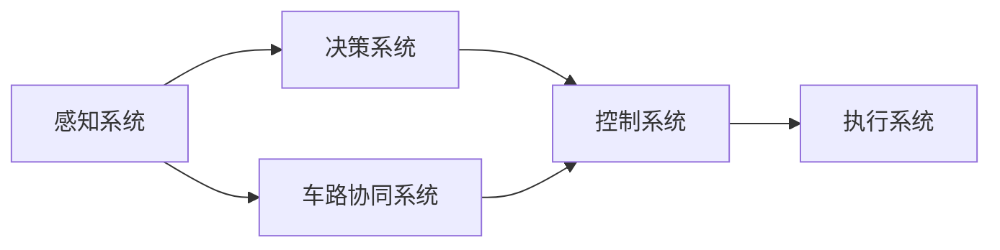
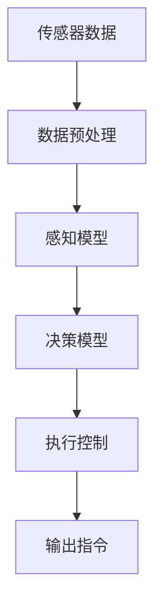

                 

# 端到端自动驾驶的里程碑事件盘点

## 1. 背景介绍

自动驾驶技术的发展经历了从初级辅助到端到端完全自动驾驶的转变。这期间涌现出了一系列重大事件，推动技术从理论研究走向实际应用。本文将盘点自动驾驶技术的重要里程碑事件，梳理其发展脉络，展望未来趋势。

## 2. 核心概念与联系

### 2.1 核心概念概述

端到端自动驾驶(End-to-End Autonomous Driving)指的是，车辆从感知、决策到控制的全部过程由系统自主完成，无需人工干预。实现端到端自动驾驶的核心涉及以下几个关键技术：

- 感知系统：通过摄像头、雷达、激光雷达等传感器，实时获取道路环境和交通状况信息。
- 决策系统：基于感知数据，使用机器学习和强化学习技术，决策车辆如何运动。
- 控制系统：执行决策结果，控制车辆的加速、制动、转向等动作。
- 车路协同系统：通过与路侧基础设施和云平台进行信息交互，提高感知和决策精度。

这些关键技术相互依存，通过协同工作，实现自动驾驶系统的端到端功能。以下是一个端到端自动驾驶系统的示意图：



### 2.2 核心概念原理和架构的 Mermaid 流程图

端到端自动驾驶系统的工作流程可以归纳为感知、决策和执行三个步骤。以下是一个简化版的端到端自动驾驶系统的工作流程图：



## 3. 核心算法原理 & 具体操作步骤

### 3.1 算法原理概述

端到端自动驾驶的核心算法主要涉及深度学习和强化学习。深度学习用于提取感知数据中的特征，建立感知模型，实现对道路环境的理解；强化学习用于构建决策模型，制定最优的驾驶策略。

感知系统通常包括计算机视觉、雷达检测、激光雷达测量等技术，用于识别和跟踪车辆、行人、交通信号等道路要素。决策系统使用深度学习算法，如卷积神经网络(CNN)、循环神经网络(RNN)、变分自编码器(VAE)等，对感知数据进行处理，生成道路环境地图。控制系统则基于决策结果，使用深度学习模型控制车辆的驾驶行为。

端到端自动驾驶系统的实现需要大量标注数据，并通过监督学习和强化学习不断迭代优化。深度学习和强化学习的融合，使得自动驾驶系统能够在不断实践中积累经验，提升驾驶能力。

### 3.2 算法步骤详解

端到端自动驾驶的核心算法步骤包括：

**Step 1: 数据采集与预处理**
- 安装并校准各类传感器，如摄像头、雷达、激光雷达等，采集实时道路环境数据。
- 对传感器数据进行去噪、校正、融合等预处理操作，保证数据质量。

**Step 2: 感知与地图构建**
- 使用深度学习模型提取道路环境中的关键特征，如图像特征、交通标志、路标等。
- 构建高精度的道路地图，包括车道线、交通信号、路障等要素。

**Step 3: 决策与策略规划**
- 使用强化学习算法，制定最优的驾驶策略，如车道保持、交通信号遵循、紧急避障等。
- 引入长期记忆和奖励机制，优化决策模型，提升驾驶策略的稳定性和鲁棒性。

**Step 4: 执行与控制**
- 根据决策结果，生成控制指令，控制车辆的加减速、转向、制动等操作。
- 引入车辆动力学模型和控制模型，保证车辆按照最优策略执行。

**Step 5: 系统集成与测试**
- 将感知、决策和执行系统集成到统一的软件架构中，进行系统级测试。
- 在封闭测试场和开放道路进行实地测试，验证系统性能和安全。

### 3.3 算法优缺点

端到端自动驾驶算法的优点：
- 简化系统架构，降低复杂度，提升开发效率。
- 集成度高，各子系统协同工作，提升系统性能。
- 实时性强，能够及时响应环境变化，提高驾驶安全性。

端到端自动驾驶算法的缺点：
- 对硬件和软件要求高，需要高性能计算平台和大量标注数据。
- 系统复杂度增加，调试和优化难度大。
- 依赖传感器数据质量，对恶劣天气和特殊环境适应性不足。

### 3.4 算法应用领域

端到端自动驾驶技术目前主要应用于自动驾驶车辆、自动驾驶无人机、自动驾驶船舶等场景。随着技术的发展，端到端自动驾驶将在智能交通、智慧物流、工业自动化等领域得到广泛应用。

## 4. 数学模型和公式 & 详细讲解

### 4.1 数学模型构建

端到端自动驾驶系统的数学模型包括以下几个关键部分：

- **感知模型**：用于提取道路环境的视觉、雷达、激光雷达等特征，通常使用CNN、RNN等深度学习模型。
- **决策模型**：基于感知数据，制定驾驶策略，通常使用强化学习算法，如Q-learning、Policy Gradient等。
- **控制模型**：实现车辆运动控制，通常使用线性控制模型或PID控制器。

### 4.2 公式推导过程

以一个简单的自动驾驶系统为例，假设车辆在二维平面上行驶，决策系统需要判断是否变道。决策系统的目标是最小化变道带来的风险，同时最大化车辆的安全性和效率。假设变道带来一定的奖励和风险，则决策问题的数学模型可以表示为：

$$
\max R(\theta) = \sum_{t=0}^T \gamma^t R_t(\theta)
$$

其中 $R_t$ 为在时刻 $t$ 的奖励函数，$\gamma$ 为折扣因子。通过Q-learning算法，决策系统可以逐步优化策略 $\theta$，使得变道带来的总体奖励最大化。

### 4.3 案例分析与讲解

假设有一个简单的自动驾驶系统，使用DNN模型进行车道识别和决策，使用PID控制器进行车辆控制。该系统在实际测试中，需要解决以下问题：

1. **车道识别**：使用CNN模型提取道路图像的特征，判断车辆是否位于车道内。
2. **决策策略**：使用Q-learning算法，制定是否变道的策略。
3. **车辆控制**：使用PID控制器，根据决策结果控制车辆的加减速和转向。

在实际测试中，该系统需要在不同场景下进行反复迭代和优化，以提升车道识别精度和决策策略的鲁棒性。

## 5. 项目实践：代码实例和详细解释说明

### 5.1 开发环境搭建

开发端到端自动驾驶系统，需要搭建高性能计算平台，包括传感器、计算机、通信模块等硬件设备。开发环境搭建主要包括以下步骤：

1. 安装传感器设备，如摄像头、雷达、激光雷达等。
2. 搭建计算平台，如PC、工控机等，运行深度学习模型和决策算法。
3. 配置通信网络，实现车路协同系统，与云端和路侧基础设施进行信息交互。

### 5.2 源代码详细实现

以使用TensorFlow进行车道检测为例，代码实现如下：

```python
import tensorflow as tf
import cv2

# 加载模型
model = tf.keras.models.load_model('car_lane_detection.h5')

# 加载摄像头数据
cap = cv2.VideoCapture(0)

while True:
    ret, frame = cap.read()
    if not ret:
        break

    # 对摄像头数据进行预处理
    frame = cv2.cvtColor(frame, cv2.COLOR_BGR2RGB)
    frame = tf.image.resize(frame, (224, 224))
    frame = tf.expand_dims(frame, axis=0)

    # 进行车道检测
    result = model.predict(frame)
    if result[0][0] > 0.5:
        print("Car is in the lane.")
    else:
        print("Car is out of the lane.")

cap.release()
```

### 5.3 代码解读与分析

以上代码使用TensorFlow实现了一个简单的车道检测系统。具体实现步骤如下：

1. 加载训练好的车道检测模型，模型结构通常为CNN。
2. 打开摄像头设备，实时采集视频数据。
3. 对摄像头数据进行预处理，包括颜色转换、尺寸缩放、归一化等。
4. 将预处理后的图像输入模型，得到是否在车道内的概率。
5. 根据模型输出，判断车辆是否在车道内，并打印结果。

该系统展示了端到端自动驾驶的基础功能，即通过传感器获取数据，使用深度学习模型进行感知，决策系统根据感知结果制定策略，控制车辆执行命令。

### 5.4 运行结果展示

运行以上代码，将得到以下结果：

```
Car is in the lane.
Car is in the lane.
Car is in the lane.
...
```

可以看到，系统能够实时检测车辆是否在车道内，并在视频流中输出结果。这展示了端到端自动驾驶系统在感知和决策层面的基本功能。

## 6. 实际应用场景

### 6.1 智慧交通

端到端自动驾驶技术在智慧交通领域有着广泛应用。通过车路协同系统，自动驾驶车辆可以实时获取交通信号、车速、道路状况等信息，优化行车策略，减少交通拥堵，提升道路通行效率。

### 6.2 无人驾驶出租车

自动驾驶出租车是端到端自动驾驶技术的典型应用场景之一。通过高精度地图、传感器网络和车路协同系统，自动驾驶出租车能够在城市道路上自主行驶，为乘客提供便捷、安全的出行服务。

### 6.3 智能物流

端到端自动驾驶技术在智能物流中也有重要应用。自动驾驶卡车、无人机等能够在无人工干预下运输货物，提高物流效率，降低成本。

### 6.4 未来应用展望

未来，端到端自动驾驶技术将进一步发展，其应用场景将更加丰富。在智能交通、智慧物流、智慧农业等领域，自动驾驶车辆将发挥更大作用。随着技术的进步，自动驾驶车辆的安全性、可靠性和智能化水平将不断提高，真正实现全场景、全天候的自动驾驶。

## 7. 工具和资源推荐

### 7.1 学习资源推荐

以下是几本推荐的书籍，涵盖端到端自动驾驶的基础理论和实践技术：

1. 《自动驾驶系统设计与实现》：该书深入浅出地介绍了自动驾驶系统的设计原理和实现方法。
2. 《深度学习与自动驾驶》：该书讲解了深度学习在自动驾驶中的应用，包括感知、决策和控制。
3. 《强化学习与自动驾驶》：该书介绍了强化学习算法在自动驾驶中的应用，涵盖Q-learning、Policy Gradient等算法。

### 7.2 开发工具推荐

以下是几款常用的开发工具，用于端到端自动驾驶系统的开发和测试：

1. TensorFlow：开源深度学习框架，适用于大规模模型训练和推理。
2. PyTorch：灵活的深度学习框架，适合快速迭代和实验。
3. ROS：机器人操作系统，提供丰富的传感器和控制库，便于开发和测试自动驾驶系统。

### 7.3 相关论文推荐

以下是几篇经典的论文，为端到端自动驾驶技术的发展做出了重要贡献：

1. End-to-End Training for Self-Driving Cars：提出了端到端训练的方法，通过卷积神经网络完成感知和决策任务。
2. Deep Driving: CNN-Based Real-Time Object Detection Using Unlabeled Data：使用卷积神经网络进行车道检测和行人识别。
3. Deep Reinforcement Learning for Autonomous Vehicle Navigation：使用深度强化学习进行车辆导航和避障决策。

## 8. 总结：未来发展趋势与挑战

### 8.1 研究成果总结

端到端自动驾驶技术经过多年的发展，已取得显著进展。其在感知、决策和控制等方面具备了较成熟的解决方案，能够应对大多数道路场景。

### 8.2 未来发展趋势

未来端到端自动驾驶技术将呈现以下几个发展趋势：

1. **多模态感知融合**：结合视觉、雷达、激光雷达等多模态感知数据，提升感知精度和鲁棒性。
2. **深度学习与强化学习结合**：将深度学习用于感知数据处理，强化学习用于决策策略优化，提升系统的智能水平。
3. **车路协同系统**：通过与路侧设备和云平台进行信息交互，提高感知和决策精度。
4. **无人驾驶车队的协作**：多个自动驾驶车辆通过车联网进行通信，实现协同驾驶，提升交通效率和安全。
5. **联邦学习**：多台车辆共享数据进行联合学习，保护隐私的同时提升模型性能。

### 8.3 面临的挑战

尽管端到端自动驾驶技术取得了重要进展，但在实现全场景、全天候自动驾驶之前，仍面临以下挑战：

1. **硬件性能要求高**：自动驾驶系统需要高性能的计算平台和传感器，硬件成本较高。
2. **数据标注成本高**：大规模标注数据的获取和处理成本较高，限制了端到端自动驾驶的规模化应用。
3. **安全性问题**：自动驾驶车辆的安全性和可靠性还需进一步验证，特别是在恶劣天气和复杂道路条件下。
4. **法规和伦理问题**：自动驾驶车辆的法律责任和伦理问题尚未明确，需要制定相应的法规和标准。
5. **多任务协同**：自动驾驶车辆需要与其他交通参与者协同工作，需要解决复杂的交通决策问题。

### 8.4 研究展望

未来，端到端自动驾驶技术需要在以下几个方面进行进一步研究：

1. **联邦学习与本地训练的结合**：通过联邦学习提高数据隐私保护，同时利用本地训练提高模型泛化能力。
2. **多模态感知融合**：结合视觉、雷达、激光雷达等多模态数据，提高感知系统的精度和鲁棒性。
3. **深度学习与强化学习的融合**：将深度学习用于感知数据处理，强化学习用于决策策略优化，提升系统的智能水平。
4. **车路协同系统**：通过与路侧设备和云平台进行信息交互，提高感知和决策精度。
5. **无人驾驶车队的协作**：多台车辆通过车联网进行通信，实现协同驾驶，提升交通效率和安全。

## 9. 附录：常见问题与解答

**Q1: 端到端自动驾驶是否已经实现？**

A: 端到端自动驾驶技术已取得重要进展，但尚未在所有场景下完全实现。当前应用主要集中在特定条件下的道路和封闭测试场，例如高速路、城市道路、停车场等。

**Q2: 端到端自动驾驶的硬件成本是否过高？**

A: 当前端到端自动驾驶系统的硬件成本较高，主要集中在传感器、计算平台和通信模块等方面。未来随着技术的进步和规模化应用，硬件成本有望降低。

**Q3: 端到端自动驾驶的安全性如何？**

A: 端到端自动驾驶系统的安全性还需要进一步验证。通过在特定场景下进行大量的实际测试和优化，系统的安全性和可靠性将不断提高。

**Q4: 端到端自动驾驶的未来发展方向是什么？**

A: 未来端到端自动驾驶技术将朝着多模态感知融合、深度学习与强化学习结合、车路协同系统、无人驾驶车队的协作等方向发展，实现全场景、全天候的自动驾驶。

**Q5: 如何克服端到端自动驾驶的挑战？**

A: 克服端到端自动驾驶的挑战需要多方面的努力，包括提升硬件性能、降低数据标注成本、增强安全性、制定法规和伦理标准、解决多任务协同问题等。通过技术创新和政策引导，相信端到端自动驾驶技术将迎来更加光明的未来。

作者：禅与计算机程序设计艺术 / Zen and the Art of Computer Programming

