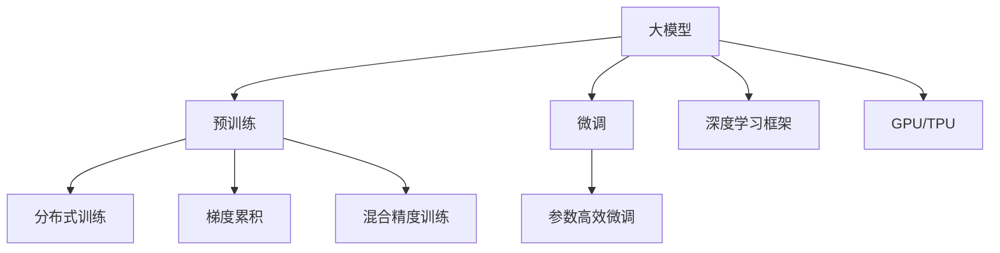

                 

## 1. 背景介绍

### 1.1 问题由来

近年来，人工智能领域进入了一场由大规模计算资源驱动的变革。基于深度学习的大模型（Large Models），以其庞大的参数规模和复杂的计算需求，对硬件设施提出了极高的要求。算力的提升，特别是在高性能计算平台（如GPU、TPU）的普及下，使得大模型的训练和推理成为可能。

### 1.2 问题核心关键点

算力的提升，尤其是GPU和TPU等专用计算平台的问世，直接推动了大模型的发展。以下是几个关键点：

- **模型规模增长**：随着计算资源的增长，大模型的参数量不断增加，如GPT-3的参数量达到1750亿，比最初的BERT模型大了数百倍。
- **计算速度提升**：专用硬件使得大模型的训练速度大幅提高，如GPT-3训练所需的计算时间比BERT模型减少了近百倍。
- **可扩展性增强**：算力的增强使得分布式训练成为可能，多个GPU或TPU同时参与训练，进一步加速了模型的收敛。
- **数据需求扩大**：大模型需要海量数据进行预训练，算力的提升使得数据量不再成为瓶颈。

### 1.3 问题研究意义

算力的提升对大模型的发展具有深远意义：

1. **性能提升**：算力的增强使得大模型的训练更加稳定，收敛更快，输出结果更加准确。
2. **应用拓展**：更多的计算资源使得大模型可以应用于更复杂、更广泛的场景，如医疗、金融、教育等。
3. **技术创新**：大模型的发展推动了新算法、新架构的探索，加速了人工智能技术的创新。
4. **产业落地**：算力的增强使得大模型的商业化应用成为可能，推动了人工智能技术的产业化进程。

## 2. 核心概念与联系

### 2.1 核心概念概述

在进行大模型相关的技术探讨前，首先需要理解几个关键概念：

- **大模型（Large Models）**：指具有数千亿甚至数万亿参数量的深度神经网络，如GPT-3、BERT等。这些模型通常需要进行大规模的预训练，以获取丰富的语言表示能力。
- **预训练（Pre-training）**：指在大规模无标签数据上对模型进行自监督学习，学习通用语言知识。预训练是大模型获取语言表示的关键步骤。
- **微调（Fine-tuning）**：在预训练模型基础上，利用少量标注数据进行特定任务的适配。微调是大模型应用于具体任务的重要手段。
- **分布式训练（Distributed Training）**：利用多个计算节点并行计算，加速大模型训练。
- **梯度累积（Gradient Accumulation）**：将多个小批量的梯度进行累积，以模拟大批量计算，减小内存需求。
- **混合精度训练（Mixed Precision Training）**：使用更少的内存存储和计算精度进行训练，提高效率。

这些概念紧密相连，共同构成了大模型训练和应用的基础框架。

### 2.2 核心概念原理和架构的 Mermaid 流程图



## 3. 核心算法原理 & 具体操作步骤

### 3.1 算法原理概述

大模型的训练和微调通常基于深度学习框架（如TensorFlow、PyTorch）和专用计算平台（如GPU、TPU）。其核心算法包括：

- **前向传播（Forward Propagation）**：将输入数据输入模型，计算每个层的前向传播输出。
- **损失函数（Loss Function）**：定义模型的预测结果与实际标签之间的误差。
- **反向传播（Backward Propagation）**：根据损失函数计算每个层的梯度，更新模型参数。
- **优化器（Optimizer）**：选择优化算法（如Adam、SGD）并设置超参数（如学习率），更新模型参数。
- **分布式训练（Distributed Training）**：利用多个计算节点并行计算，加速大模型训练。

### 3.2 算法步骤详解

大模型的训练过程通常包括以下几个关键步骤：

**Step 1: 准备数据和模型**

- 收集预训练数据（如维基百科、新闻文章、书籍等），并进行预处理和分批次。
- 选择合适的深度学习框架和专用计算平台，如PyTorch、TensorFlow、TPU等。
- 构建模型架构，包括输入层、隐藏层、输出层等。

**Step 2: 执行前向传播和损失计算**

- 将数据分批次输入模型，计算前向传播输出。
- 计算损失函数，衡量模型预测与实际标签的差异。
- 将损失值传递给优化器，更新模型参数。

**Step 3: 执行反向传播和参数更新**

- 根据损失函数的梯度计算反向传播梯度。
- 使用优化器更新模型参数，最小化损失函数。

**Step 4: 评估模型性能**

- 在验证集上评估模型性能，如精度、召回率、F1值等。
- 根据评估结果调整超参数，如学习率、批次大小等。

**Step 5: 微调模型**

- 在特定任务的数据集上执行微调，更新模型参数。
- 采用参数高效微调、对抗训练、正则化等方法提升模型性能。

**Step 6: 部署和应用**

- 将训练好的模型部署到实际应用环境中。
- 集成到业务系统中，提供各种智能服务。

### 3.3 算法优缺点

大模型的训练和微调具有以下优点：

- **性能优越**：大模型的参数量越大，其表达能力越强，输出结果越准确。
- **应用广泛**：大模型可以应用于各种复杂任务，如自然语言处理、计算机视觉、语音识别等。
- **计算效率高**：专用硬件（如GPU、TPU）大幅提升了计算速度，缩短了训练时间。

然而，大模型的训练和微调也存在一些局限：

- **计算资源需求高**：大模型的训练需要大量的计算资源，一般需要数百个GPU或TPU参与计算。
- **数据需求量大**：大模型的预训练和微调需要海量数据，数据收集和预处理工作量大。
- **模型复杂度高**：大模型的结构复杂，调试和优化难度大。
- **应用成本高**：大模型的训练和应用需要高性能计算资源，成本较高。

### 3.4 算法应用领域

大模型的训练和微调已经在多个领域得到广泛应用，例如：

- **自然语言处理（NLP）**：包括文本分类、情感分析、机器翻译等任务。
- **计算机视觉（CV）**：包括图像识别、目标检测、图像生成等任务。
- **语音识别（ASR）**：包括语音转文本、语音合成等任务。
- **推荐系统**：基于用户行为数据进行商品推荐、内容推荐等任务。
- **金融风控**：利用大模型进行信用评估、风险预测等任务。
- **医疗健康**：利用大模型进行疾病预测、医疗影像分析等任务。

## 4. 数学模型和公式 & 详细讲解 & 举例说明

### 4.1 数学模型构建

大模型的训练和微调涉及多个数学模型和公式。这里以BERT为例，构建数学模型：

1. **输入表示**：将输入序列 $x_1, x_2, ..., x_n$ 转换为模型可接受的向量表示。
2. **隐藏层表示**：通过多个隐藏层，计算出模型对输入的表示。
3. **输出表示**：将隐藏层的表示输出为模型预测结果。

### 4.2 公式推导过程

BERT模型的训练过程主要包括以下几个步骤：

1. **输入表示**：将输入序列 $x_i$ 转换为BERT的输入表示 $h_i$。
2. **隐藏层表示**：通过Transformer网络计算出模型对输入的表示 $h_i^l$。
3. **输出表示**：将隐藏层的表示 $h_i^l$ 输出为模型预测结果 $\hat{y_i}$。

### 4.3 案例分析与讲解

以BERT模型在情感分析任务上的微调为例：

1. **数据预处理**：收集情感分析的数据集，将其分为训练集、验证集和测试集。
2. **模型构建**：构建BERT模型，并设定好相关超参数。
3. **微调过程**：在训练集上执行微调，使用梯度下降等优化算法更新模型参数。
4. **评估与部署**：在验证集上评估模型性能，在测试集上进行最终测试，并部署到实际应用中。

## 5. 项目实践：代码实例和详细解释说明

### 5.1 开发环境搭建

**Step 1: 安装必要的依赖**

- 安装Python和pip
- 安装TensorFlow或PyTorch
- 安装GPU驱动和CUDA工具包
- 安装必要的NLP库（如NLTK、spaCy等）

**Step 2: 构建计算环境**

- 搭建多节点分布式计算环境
- 安装必要的GPU和TPU设备

### 5.2 源代码详细实现

以下是一个简单的TensorFlow代码实例，用于训练和微调BERT模型：

```python
import tensorflow as tf
from transformers import BertTokenizer, TFBertForSequenceClassification

# 初始化BERT Tokenizer
tokenizer = BertTokenizer.from_pretrained('bert-base-uncased')

# 构建模型
model = TFBertForSequenceClassification.from_pretrained('bert-base-uncased', num_labels=2)

# 定义优化器
optimizer = tf.keras.optimizers.Adam(learning_rate=2e-5)

# 定义损失函数
loss_fn = tf.keras.losses.BinaryCrossentropy()

# 定义训练过程
@tf.function
def train_step(input_ids, labels):
    with tf.GradientTape() as tape:
        outputs = model(input_ids)
        loss = loss_fn(labels, outputs)
    grads = tape.gradient(loss, model.trainable_variables)
    optimizer.apply_gradients(zip(grads, model.trainable_variables))
    return loss

# 定义验证过程
@tf.function
def evaluate_step(input_ids, labels):
    outputs = model(input_ids)
    loss = loss_fn(labels, outputs)
    return loss

# 训练模型
for epoch in range(10):
    total_loss = 0
    for batch in train_dataset:
        input_ids, labels = batch
        loss = train_step(input_ids, labels)
        total_loss += loss
    print('Epoch {} Loss: {}'.format(epoch+1, total_loss/n))

# 评估模型
total_loss = 0
for batch in evaluate_dataset:
    input_ids, labels = batch
    loss = evaluate_step(input_ids, labels)
    total_loss += loss
print('Evaluate Loss: {}'.format(total_loss/n))
```

### 5.3 代码解读与分析

以上代码实现了一个简单的BERT模型训练和微调过程。以下是关键代码的解释：

- `BertTokenizer`：用于将输入文本转换为BERT模型可接受的向量表示。
- `TFBertForSequenceClassification`：构建BERT模型，用于分类任务。
- `Adam`：优化器，用于更新模型参数。
- `BinaryCrossentropy`：损失函数，用于衡量模型预测结果与实际标签的差异。
- `train_step`：定义训练过程，包括前向传播、损失计算、梯度计算和参数更新。
- `evaluate_step`：定义验证过程，只进行前向传播和损失计算。

## 6. 实际应用场景

### 6.1 智能客服系统

智能客服系统是算力提升推动大模型发展的典型应用之一。传统的客服系统依赖于人工客服，无法处理大量并发请求，且难以保证响应速度和一致性。利用大模型进行微调，可以构建智能客服系统，实现24/7在线服务，提升客户体验。

**应用流程**：

1. **数据收集**：收集历史客服对话数据。
2. **模型训练**：使用大模型对历史对话数据进行微调，学习客服响应策略。
3. **部署应用**：将微调后的模型部署到客服系统中，实时回答客户问题。

### 6.2 金融舆情监测

金融舆情监测是另一个大模型应用的典型场景。金融市场瞬息万变，及时获取市场动态对风险管理和投资决策至关重要。利用大模型进行情感分析和主题分类，可以实时监测市场舆情，预测市场走势。

**应用流程**：

1. **数据收集**：收集金融新闻、评论、社交媒体等数据。
2. **模型训练**：使用大模型对金融数据进行微调，学习情感和主题表示。
3. **实时监测**：将微调后的模型应用到实时数据流中，实时监测市场舆情。

### 6.3 个性化推荐系统

个性化推荐系统是算力提升推动大模型发展的另一重要应用领域。传统的推荐系统依赖于用户历史行为数据，难以捕捉用户兴趣的细微变化。利用大模型进行微调，可以捕捉用户行为的语义信息，提升推荐效果。

**应用流程**：

1. **数据收集**：收集用户浏览、点击、评分等行为数据。
2. **模型训练**：使用大模型对行为数据进行微调，学习用户兴趣表示。
3. **推荐生成**：将微调后的模型应用于推荐系统，生成个性化推荐结果。

### 6.4 未来应用展望

未来，算力的提升将进一步推动大模型的发展，带来更广阔的应用前景：

1. **多模态应用**：结合视觉、语音、文本等多模态数据，提升模型的综合表现能力。
2. **边缘计算**：利用边缘计算设备，提高模型的实时性和可扩展性。
3. **联邦学习**：通过分布式计算和数据联邦，提高模型的隐私保护和计算效率。
4. **跨领域应用**：将大模型应用于更多领域，如医疗、教育、安全等，实现跨领域知识融合。
5. **伦理和道德约束**：构建可解释、可控、可审的AI系统，保障数据和模型的安全性。

## 7. 工具和资源推荐

### 7.1 学习资源推荐

1. **TensorFlow和PyTorch官方文档**：详细介绍了深度学习框架的使用方法和最佳实践。
2. **Transformers官方文档**：提供了多种预训练模型的代码实现和微调方法。
3. **Coursera和Udacity课程**：提供深度学习和NLP相关的在线课程，适合初学者入门。
4. **Google AI博客和论文**：分享最新的研究进展和应用案例，深入了解大模型的最新动态。
5. **NLP社区论坛和博客**：如arXiv、GitHub等平台，了解最新的NLP研究和应用进展。

### 7.2 开发工具推荐

1. **TensorFlow和PyTorch**：适用于深度学习和NLP模型的开发。
2. **HuggingFace Transformers**：提供了多种预训练模型的实现，支持微调和大模型训练。
3. **TensorBoard和Weights & Biases**：用于模型训练过程的监控和可视化。
4. **Jupyter Notebook**：交互式开发环境，便于编写和调试代码。
5. **Google Colab**：提供免费GPU资源，方便进行大模型实验和研究。

### 7.3 相关论文推荐

1. **"Attention is All You Need"**：Transformer模型的经典论文，奠定了大模型的基础。
2. **"BERT: Pre-training of Deep Bidirectional Transformers for Language Understanding"**：BERT模型的创新论文，展示了自监督学习的潜力。
3. **"Towards AI-Generated Creative Content with Large Language Models"**：Google关于大模型在生成内容中的应用研究。
4. **"AdaLoRA: Adaptive Low-Rank Adaptation for Parameter-Efficient Fine-Tuning"**：参数高效微调方法的研究论文，提升了微调效率。
5. **"Language Models are Unsupervised Multitask Learners"**：展示了大模型的零样本学习能力，推动了通用人工智能的发展。

## 8. 总结：未来发展趋势与挑战

### 8.1 研究成果总结

算力提升推动了大模型的发展，带来了更强的表达能力和更广泛的应用场景。算力的增强使得大模型的训练和微调更加稳定和高效，提升了模型的输出精度和实时性。大模型的成功应用也促进了更多研究领域的技术进步。

### 8.2 未来发展趋势

未来，算力的提升将继续推动大模型的发展：

1. **更大规模模型**：更多大模型的参数量将突破百亿甚至千亿，带来更强的语言表示能力。
2. **更高效的计算平台**：未来的计算平台将更加高效，支持更多种类的计算任务，提高模型的训练速度。
3. **更丰富的应用场景**：大模型将应用于更多领域，如医疗、教育、安全等，带来新的业务机会。
4. **更多跨领域知识融合**：大模型将与其他技术（如知识图谱、逻辑推理）结合，提升模型的综合表现能力。
5. **更高的可解释性和可控性**：大模型将更加注重可解释性和可控性，提高模型的可信度和安全性。

### 8.3 面临的挑战

尽管算力的提升推动了大模型的发展，但仍然面临以下挑战：

1. **数据获取和预处理**：大模型需要大量高质量数据，数据收集和预处理工作量大。
2. **计算资源需求高**：大模型的训练和微调需要高性能计算资源，一般需要数百个GPU或TPU参与计算。
3. **模型复杂度高**：大模型的结构复杂，调试和优化难度大。
4. **应用成本高**：大模型的训练和应用需要高性能计算资源，成本较高。
5. **模型安全性**：大模型需要构建安全、可控、可解释的AI系统，保障数据和模型的安全性。

### 8.4 研究展望

未来，针对大模型的研究还需要在以下几个方面寻求突破：

1. **高效计算**：开发更高效的计算平台和算法，提高大模型的训练和推理效率。
2. **数据管理和隐私保护**：构建高效的数据管理和隐私保护机制，保障数据安全。
3. **模型可解释性**：研究大模型的可解释性，提高模型的透明度和可信度。
4. **跨领域知识融合**：将大模型与其他技术结合，提升模型的综合表现能力。
5. **伦理和道德约束**：构建可解释、可控、可审的AI系统，保障数据和模型的安全性。

## 9. 附录：常见问题与解答

**Q1: 大模型在训练过程中如何进行分布式训练？**

A: 分布式训练通常采用多节点并行计算的方式，将大规模数据集分割成多个小批次，每个节点负责处理一个批次，最后汇总结果进行模型更新。常见的分布式训练框架包括Horovod和TensorFlow的分布式版本。

**Q2: 大模型在训练过程中如何进行混合精度训练？**

A: 混合精度训练是指在训练过程中，使用更少的内存和精度进行计算，提高计算效率。常见的混合精度训练方法包括FP16和Mixed Precision Training，使用更少的内存和精度进行计算，提高计算效率。

**Q3: 大模型在训练过程中如何进行梯度累积？**

A: 梯度累积是指将多个小批量的梯度进行累积，以模拟大批量计算，减小内存需求。常见的梯度累积方法包括梯度累积和批处理梯度累积，可以减小内存需求，提高训练效率。

**Q4: 大模型在训练过程中如何进行参数高效微调？**

A: 参数高效微调是指在微调过程中，只更新少量的模型参数，而固定大部分预训练权重不变，以提高微调效率，避免过拟合。常见的参数高效微调方法包括Adapter、Prefix-Tuning等。

**Q5: 大模型在训练过程中如何进行模型裁剪和压缩？**

A: 模型裁剪是指去除不必要的层和参数，减小模型尺寸，加快推理速度。常见的模型裁剪方法包括剪枝和权重共享。模型压缩是指使用更少的内存存储和计算精度进行训练，提高效率。常见的模型压缩方法包括量化和知识蒸馏。

