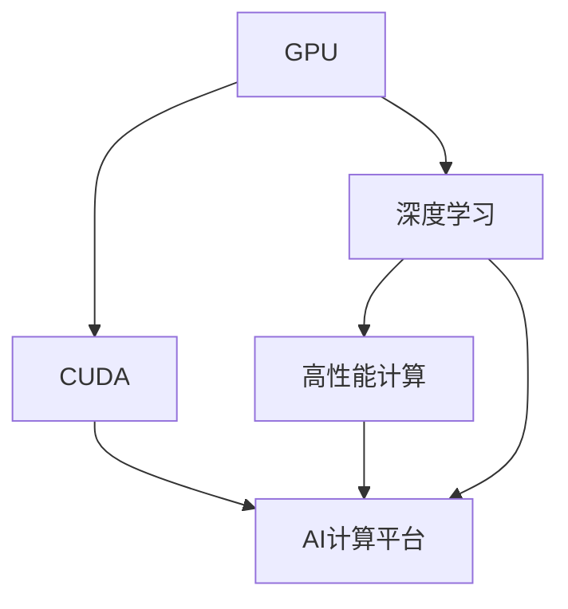

                 

# 算力革命：NVIDIA的角色

> 关键词：NVIDIA, 算力革命, GPU, AI, 深度学习, 高性能计算

## 1. 背景介绍

### 1.1 问题由来

随着人工智能（AI）技术的蓬勃发展，尤其是深度学习（DL）和机器学习（ML）的广泛应用，算力成为了制约AI应用性能提升的关键因素。算力不仅影响到模型的训练速度、推理效率，还关系到AI系统的可扩展性和实用性。近年来，NVIDIA作为高性能计算和人工智能计算的领军企业，通过不断创新，推动了算力革命的进程，为AI技术的突破提供了坚实的基础。

### 1.2 问题核心关键点

NVIDIA在算力革命中的角色可以归结为以下几个核心关键点：

- **GPU的主导地位**：NVIDIA的图形处理器（GPU）通过其强大的并行计算能力，成为深度学习领域的主导硬件平台。
- **CUDA生态系统**：NVIDIA开发的计算统一设备架构（CUDA），为开发者提供了高效的编程工具和优化资源。
- **AI相关的研发投入**：NVIDIA持续投入于AI和深度学习技术的研究和产品开发，推出了多个领先的AI计算平台和工具。
- **合作伙伴生态**：通过与学术机构、企业和技术社区的紧密合作，NVIDIA加速了AI技术的落地应用和产业化进程。

这些关键点共同构成了NVIDIA在算力革命中的核心贡献，推动了AI技术的不断进步。

## 2. 核心概念与联系

### 2.1 核心概念概述

为更好地理解NVIDIA在算力革命中的作用，本节将介绍几个关键概念：

- **GPU（图形处理器）**：由NVIDIA等公司推出的高性能计算芯片，通过并行处理能力，显著提升了计算效率。
- **CUDA**：NVIDIA开发的编程模型和开发工具，支持GPU编程，提供了高效的内存管理、并发编程等功能。
- **深度学习（DL）**：利用神经网络结构对数据进行深度处理，实现图像识别、语音识别、自然语言处理等任务。
- **高性能计算（HPC）**：涉及大规模数据处理和高性能计算硬件的领域，如超算中心、云计算平台等。
- **AI计算平台**：包括GPU、CUDA、软件库和工具，为AI模型训练和推理提供完整的解决方案。

这些概念之间的逻辑关系可以通过以下Mermaid流程图来展示：



这个流程图展示了一些关键概念之间的相互关系：

1. GPU通过其强大的并行计算能力，支撑了深度学习和高性能计算的需求。
2. CUDA为GPU编程提供了高效的工具，加速了深度学习模型的开发和优化。
3. 深度学习技术在AI计算平台上得以实现和优化，推动了AI技术的广泛应用。
4. 高性能计算提供了必要的计算资源，支撑了AI计算平台的大规模数据处理能力。

## 3. 核心算法原理 & 具体操作步骤

### 3.1 算法原理概述

NVIDIA在算力革命中的核心贡献，不仅体现在硬件的创新，更体现在算法和软件的全面优化。NVIDIA通过以下几个关键算法和技术，推动了算力革命的进程：

- **GPU加速的深度学习算法**：通过优化矩阵乘法和卷积等计算密集型操作，大幅提升了深度学习模型的训练速度和推理效率。
- **CUDA并行编程模型**：提供高效的内存管理和并发编程支持，帮助开发者更高效地利用GPU资源。
- **AI计算平台优化**：包括TensorRT等工具，对深度学习模型进行优化，提升计算效率和资源利用率。

### 3.2 算法步骤详解

以下是NVIDIA在算力革命中的具体步骤和操作：

1. **硬件创新**：推出多代GPU，包括GeForce、Quadro、Tesla等系列，提供从消费级到专业级的广泛解决方案。
2. **软件生态建设**：开发CUDA和cuDNN等软件工具，支持GPU编程和深度学习加速。
3. **AI平台优化**：推出TensorRT、NVIDIA Deep Learning SDK等工具，简化模型部署和优化过程。
4. **合作伙伴合作**：与学术界、企业界和开源社区紧密合作，推动AI技术的广泛应用。

### 3.3 算法优缺点

NVIDIA在算力革命中的优势和挑战如下：

- **优势**：
  - 高性能GPU提供了强大的计算能力，加速了深度学习模型的训练和推理。
  - CUDA生态系统提供了高效的软件工具和优化支持，简化了深度学习的开发和部署。
  - AI计算平台的优化，提升了计算效率和资源利用率。

- **挑战**：
  - 对深度学习算法的依赖性较强，技术变化快，需要持续跟进最新的算法和模型。
  - GPU功耗和成本较高，增加了硬件投入和维护成本。
  - 硬件和软件生态的复杂性，需要开发者具备较高的技术水平和工具使用能力。

### 3.4 算法应用领域

NVIDIA在算力革命中的成果，广泛应用于以下几个领域：

- **数据中心和云服务**：提供高性能GPU，支撑大数据处理和深度学习模型的训练。
- **AI研究与开发**：为学术机构和企业提供先进的AI计算平台和工具，推动AI技术的研究和创新。
- **智能应用**：通过NVIDIA AI计算平台，实现图像识别、语音识别、自然语言处理等智能应用。

## 4. 数学模型和公式 & 详细讲解 & 举例说明

### 4.1 数学模型构建

在NVIDIA的算力革命中，GPU作为硬件支撑，通过CUDA软件生态提供了高效的计算和编程工具。深度学习模型在GPU上的训练和推理，可以表示为以下数学模型：

$$
y = \text{Model}(x, \theta)
$$

其中 $x$ 为输入数据，$\theta$ 为模型参数，$y$ 为输出结果。深度学习模型通过反向传播算法对 $\theta$ 进行优化，从而提升模型的预测准确性。

### 4.2 公式推导过程

以一个简单的卷积神经网络（CNN）为例，其卷积层的计算过程可以表示为：

$$
y_{i,j} = \sum_k w_{i,k} x_{j-k} + b_i
$$

其中 $w_{i,k}$ 为卷积核，$x_{j-k}$ 为输入数据的卷积窗口，$b_i$ 为偏置项。通过GPU的高效并行计算能力，可以显著提升卷积操作的计算效率。

### 4.3 案例分析与讲解

以TensorRT为例，NVIDIA开发的一套深度学习推理优化工具，通过量化、剪枝、融合等技术，显著提升了深度学习模型的推理速度和资源利用率。

以一个目标检测任务为例，通过TensorRT对模型的推理过程进行优化：

1. **量化**：将模型的浮点运算转换为定点运算，减少存储空间和计算资源。
2. **剪枝**：移除模型中不必要的计算节点，减少推理过程中的计算量。
3. **融合**：将多个计算节点合并为一个高效计算单元，减少内存交换和上下文切换开销。

## 5. 项目实践：代码实例和详细解释说明

### 5.1 开发环境搭建

在进行GPU加速深度学习项目的开发前，我们需要准备好开发环境。以下是使用NVIDIA CUDA进行深度学习项目开发的环境配置流程：

1. 安装Anaconda：从官网下载并安装Anaconda，用于创建独立的Python环境。
2. 创建并激活虚拟环境：
```bash
conda create -n pytorch-env python=3.8 
conda activate pytorch-env
```

3. 安装PyTorch：根据CUDA版本，从官网获取对应的安装命令。例如：
```bash
conda install pytorch torchvision torchaudio cudatoolkit=11.1 -c pytorch -c conda-forge
```

4. 安装NVIDIA库：
```bash
conda install cudatoolkit=11.1
```

5. 安装TensorRT：
```bash
pip install tensorrt
```

6. 安装NVIDIA Deep Learning SDK：
```bash
pip install deep-learning-sdk
```

完成上述步骤后，即可在`pytorch-env`环境中开始深度学习项目的开发。

### 5.2 源代码详细实现

以下是一个使用NVIDIA CUDA进行深度学习模型训练的代码实现，以卷积神经网络（CNN）为例：

```python
import torch
import torch.nn as nn
import torch.optim as optim

class CNN(nn.Module):
    def __init__(self):
        super(CNN, self).__init__()
        self.conv1 = nn.Conv2d(3, 64, kernel_size=3, stride=1, padding=1)
        self.relu = nn.ReLU()
        self.maxpool = nn.MaxPool2d(kernel_size=2, stride=2)
        self.fc1 = nn.Linear(64 * 28 * 28, 128)
        self.fc2 = nn.Linear(128, 10)
    
    def forward(self, x):
        x = self.conv1(x)
        x = self.relu(x)
        x = self.maxpool(x)
        x = x.view(-1, 64 * 28 * 28)
        x = self.fc1(x)
        x = self.relu(x)
        x = self.fc2(x)
        return x

model = CNN().to('cuda')

criterion = nn.CrossEntropyLoss()
optimizer = optim.SGD(model.parameters(), lr=0.01)

# 训练数据
train_data = ...
train_loader = DataLoader(train_data, batch_size=64, shuffle=True)

# 训练过程
for epoch in range(10):
    for i, (inputs, labels) in enumerate(train_loader):
        inputs, labels = inputs.to('cuda'), labels.to('cuda')
        optimizer.zero_grad()
        outputs = model(inputs)
        loss = criterion(outputs, labels)
        loss.backward()
        optimizer.step()
```

### 5.3 代码解读与分析

让我们再详细解读一下关键代码的实现细节：

**CNN类**：
- `__init__`方法：初始化卷积层、ReLU激活函数、池化层、全连接层等组件。
- `forward`方法：定义前向传播过程，包括卷积、激活、池化、全连接等操作。

**模型训练**：
- `model`：定义卷积神经网络模型，并使用`.to('cuda')`将模型移到GPU上进行计算。
- `criterion`：定义交叉熵损失函数。
- `optimizer`：定义优化器，这里是随机梯度下降（SGD）。
- `train_data`：定义训练数据集。
- `train_loader`：使用`DataLoader`对训练数据进行批处理，方便模型训练。
- `for`循环：定义训练过程，遍历训练集，更新模型参数。
- `inputs`和`labels`：输入数据和标签数据，使用`.to('cuda')`将数据移到GPU上。
- `optimizer.zero_grad()`：在每个epoch开始前清空梯度。
- `outputs`：前向传播计算输出结果。
- `loss`：计算损失函数。
- `loss.backward()`：反向传播计算梯度。
- `optimizer.step()`：更新模型参数。

以上代码展示了如何使用NVIDIA CUDA进行深度学习模型的训练，体现了NVIDIA在GPU加速深度学习方面的核心竞争力。

## 6. 实际应用场景

### 6.1 数据中心和云服务

NVIDIA通过其高性能GPU和软件生态，提供了强大的计算能力，支持数据中心和云服务中的深度学习模型训练和推理。例如，AWS、Google Cloud和Azure等云服务提供商，都采用了NVIDIA的GPU作为核心计算资源。

### 6.2 AI研究与开发

NVIDIA通过其AI计算平台和工具，如TensorRT、NVIDIA Deep Learning SDK等，大大降低了AI研究和开发的门槛，加速了AI技术的创新和应用。

### 6.3 智能应用

NVIDIA通过其GPU和软件生态，推动了智能应用在多个领域的应用。例如，自动驾驶、医疗影像分析、语音识别等领域的智能应用，都基于NVIDIA的AI计算平台进行训练和推理。

## 7. 工具和资源推荐

### 7.1 学习资源推荐

为了帮助开发者系统掌握NVIDIA在算力革命中的技术，这里推荐一些优质的学习资源：

1. **《NVIDIA CUDA编程指南》**：官方文档，详细介绍了如何使用CUDA进行GPU编程。
2. **《NVIDIA深度学习最佳实践》**：官方文档，提供了深度学习模型在GPU上的优化建议。
3. **《NVIDIA TensorRT用户手册》**：官方文档，介绍了TensorRT的功能和使用方法。
4. **《NVIDIA AI计算平台》**：官方教程，介绍了NVIDIA AI计算平台的构建和使用。

通过这些资源的学习实践，相信你一定能够快速掌握NVIDIA在算力革命中的核心技术和应用方法。

### 7.2 开发工具推荐

NVIDIA提供的工具和库，大大简化了深度学习模型的开发和优化过程。以下是几款常用的工具：

1. **PyTorch**：NVIDIA支持的深度学习框架，提供了强大的GPU加速和自动微分功能。
2. **TensorRT**：NVIDIA开发的深度学习推理优化工具，可以显著提升模型的推理速度和资源利用率。
3. **NVIDIA Deep Learning SDK**：NVIDIA提供的一套深度学习开发工具，支持GPU编程和模型优化。

合理利用这些工具，可以显著提升深度学习项目的开发效率和优化效果。

### 7.3 相关论文推荐

NVIDIA在算力革命中的技术和应用，源于学界的持续研究。以下是几篇奠基性的相关论文，推荐阅读：

1. **《NVIDIA CUDA并行编程模型》**：NVIDIA开发的CUDA并行编程模型，详细介绍了GPU编程的技术和优化方法。
2. **《NVIDIA深度学习最佳实践》**：NVIDIA发表的深度学习优化建议，涵盖了GPU编程、模型优化和推理加速等方面。
3. **《NVIDIA TensorRT：加速深度学习推理》**：NVIDIA关于TensorRT的论文，介绍了TensorRT的功能和优化效果。

这些论文代表了大规模GPU加速深度学习技术的发展脉络，可以帮助研究者深入理解NVIDIA在算力革命中的核心技术。

## 8. 总结：未来发展趋势与挑战

### 8.1 总结

本文对NVIDIA在算力革命中的核心贡献进行了全面系统的介绍。首先阐述了NVIDIA在GPU、CUDA和AI计算平台等方面的核心创新，明确了其在算力革命中的主导地位。其次，从原理到实践，详细讲解了NVIDIA在算力革命中的数学模型和算法步骤，给出了深度学习模型训练的完整代码实例。同时，本文还广泛探讨了NVIDIA在数据中心、AI研究与开发和智能应用等领域的实际应用场景，展示了NVIDIA算力革命的广泛影响力。

通过本文的系统梳理，可以看到，NVIDIA在算力革命中的关键角色，推动了深度学习技术在多个领域的应用和普及，极大地促进了AI技术的进步和产业化进程。未来，伴随深度学习算法的不断进步和GPU硬件的持续创新，NVIDIA在算力革命中的影响还将进一步扩大，为AI技术的持续发展提供坚实的基础。

### 8.2 未来发展趋势

展望未来，NVIDIA在算力革命中的发展趋势如下：

1. **硬件创新**：持续推出新一代GPU，提升计算性能和能效比。
2. **软件生态建设**：推出更多AI计算工具和优化工具，简化深度学习开发和部署。
3. **AI计算平台优化**：通过更高效的硬件和软件设计，提升深度学习模型的训练和推理效率。
4. **合作伙伴合作**：与更多学术机构和企业合作，推动AI技术的广泛应用和产业化。

这些趋势展示了NVIDIA在算力革命中的持续创新和积极布局，预示了其在未来AI技术发展中的重要地位。

### 8.3 面临的挑战

尽管NVIDIA在算力革命中取得了显著成就，但仍面临一些挑战：

1. **技术快速迭代**：深度学习算法和模型不断变化，NVIDIA需要持续跟进最新的技术发展。
2. **硬件和软件复杂性**：GPU硬件和软件生态的复杂性，增加了开发和部署的难度。
3. **成本和能耗**：高性能GPU的高成本和能耗问题，需要持续优化和创新。

### 8.4 研究展望

面对这些挑战，NVIDIA未来的研究方向如下：

1. **硬件性能提升**：持续优化GPU设计和制造工艺，提升计算性能和能效比。
2. **软件生态优化**：简化深度学习开发和部署工具，降低开发门槛。
3. **AI计算平台优化**：通过更高效的硬件和软件设计，提升深度学习模型的计算效率和资源利用率。
4. **合作伙伴合作**：加强与学术界、企业界的合作，推动AI技术的广泛应用和产业化。

这些研究方向展示了NVIDIA在算力革命中的持续创新和积极布局，预示了其在未来AI技术发展中的重要地位。

## 9. 附录：常见问题与解答

**Q1：NVIDIA的硬件和软件生态有哪些？**

A: NVIDIA的硬件和软件生态包括：

- **GPU系列**：包括GeForce、Quadro、Tesla、NVIDIA RTX等，涵盖消费级到专业级的广泛解决方案。
- **CUDA生态**：包括CUDA编程模型、cuDNN深度学习库、NVIDIA Deep Learning SDK等，提供高效的GPU编程和深度学习工具。
- **AI计算平台**：包括TensorRT、NVIDIA TensorBoard等工具，用于深度学习模型的推理优化和可视化。

这些硬件和软件工具，共同构成了NVIDIA在算力革命中的核心竞争力。

**Q2：NVIDIA的深度学习最佳实践有哪些？**

A: NVIDIA的深度学习最佳实践包括：

- **模型优化**：使用TensorRT等工具，对深度学习模型进行优化，提升计算效率和资源利用率。
- **模型压缩**：使用模型剪枝、量化等技术，减少模型的计算量和内存占用。
- **模型训练**：使用CUDA并行编程模型，加速深度学习模型的训练过程。
- **模型部署**：使用NVIDIA TensorRT等工具，优化深度学习模型的推理速度。

这些最佳实践，展示了NVIDIA在深度学习领域的技术积累和优化经验。

**Q3：NVIDIA的AI计算平台有哪些？**

A: NVIDIA的AI计算平台包括：

- **TensorRT**：深度学习推理优化工具，提供高效的模型推理加速。
- **NVIDIA Deep Learning SDK**：一套深度学习开发工具，支持GPU编程和模型优化。
- **NVIDIA TensorBoard**：深度学习模型的可视化工具，帮助开发者调试和优化模型。

这些AI计算平台，提供了完整的深度学习开发和优化解决方案，大大简化了AI技术的开发和部署过程。

**Q4：NVIDIA的深度学习算法有哪些？**

A: NVIDIA在深度学习算法方面的创新包括：

- **卷积神经网络（CNN）**：用于图像识别、目标检测等任务。
- **循环神经网络（RNN）**：用于自然语言处理、语音识别等任务。
- **生成对抗网络（GAN）**：用于图像生成、图像修复等任务。
- **变分自编码器（VAE）**：用于数据降维、图像生成等任务。

这些深度学习算法，展示了NVIDIA在AI技术领域的广泛应用和创新能力。

**Q5：NVIDIA的合作伙伴有哪些？**

A: NVIDIA在算力革命中的合作伙伴包括：

- **学术界**：与多个顶尖大学和研究机构合作，推动AI技术的研究和创新。
- **企业界**：与AWS、Google Cloud、Microsoft Azure等云服务提供商合作，推动AI技术的广泛应用。
- **开源社区**：与TensorFlow、PyTorch等开源项目合作，推动AI技术的开放共享和社区发展。

这些合作伙伴，展示了NVIDIA在算力革命中的广泛影响力和技术合作精神。

---

作者：禅与计算机程序设计艺术 / Zen and the Art of Computer Programming

