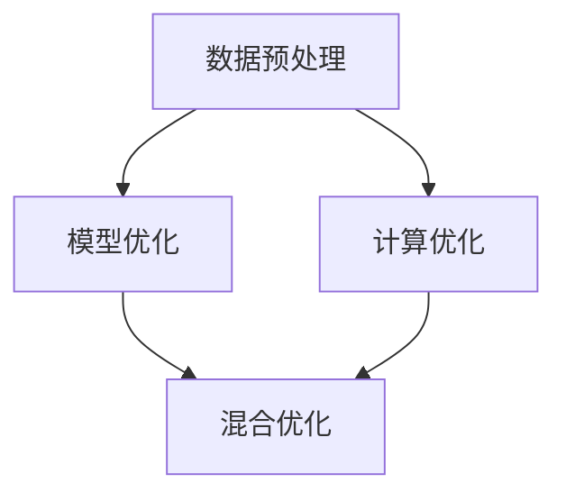

                 

## 1. 背景介绍

### 1.1 问题由来

随着AI 2.0时代的到来，算法效率和精度成为了影响AI系统性能和应用范围的关键因素。在医疗、金融、自动驾驶等领域，高精度和实时性要求使得传统的算法难以满足需求。同时，随着数据规模的指数级增长，算法的计算复杂度也成为处理大规模数据集的瓶颈。

### 1.2 问题核心关键点

为了提升AI算法的效率和精度，研究者们提出了多种优化技术。这些技术可以大致分为数据预处理、模型优化、计算优化和混合优化四个方面。其中，数据预处理包括数据增强、数据清洗和数据压缩等；模型优化包括模型剪枝、量化、蒸馏和神经网络结构优化等；计算优化包括分布式计算、硬件加速和算法并行化等；混合优化则涵盖了多层次、多领域的算法优化方法。

这些技术的发展极大地推动了AI 2.0时代算法的进步，使得AI系统能够在大规模数据集上实现更高的精度和更低的计算成本。然而，当前AI算法优化仍面临诸多挑战，如计算资源限制、精度和速度之间的权衡等。本文将详细介绍这些优化技术，并探讨其应用前景和面临的挑战。

## 2. 核心概念与联系

### 2.1 核心概念概述

为更好地理解算法优化技术，本节将介绍几个密切相关的核心概念：

- **数据预处理(Data Preprocessing)**：通过数据增强、清洗和压缩等方法，提升数据质量，减少噪声和冗余，优化模型输入。
- **模型优化(Model Optimization)**：通过模型剪枝、量化、蒸馏和神经网络结构优化等技术，提升模型的精度和效率，减少计算量。
- **计算优化(Computational Optimization)**：通过分布式计算、硬件加速和算法并行化等方法，提升计算效率，缩短训练和推理时间。
- **混合优化(Hybrid Optimization)**：综合运用数据预处理、模型优化和计算优化等方法，实现算法的全面优化。

这些概念之间的逻辑关系可以通过以下Mermaid流程图来展示：



这个流程图展示了大规模算法优化技术的核心概念及其之间的关系：

1. 数据预处理提供高质量的数据输入，是算法优化的基础。
2. 模型优化通过改进模型结构、参数等，提升模型精度。
3. 计算优化通过改进计算流程，提升计算效率。
4. 混合优化将数据预处理、模型优化和计算优化相结合，实现全面优化。

这些核心概念共同构成了AI 2.0时代算法优化的全貌，使其能够在大规模数据集上实现更高的精度和更低的计算成本。

## 3. 核心算法原理 & 具体操作步骤

### 3.1 算法原理概述

AI 2.0算法优化技术主要通过以下几个方面提升算法的效率和精度：

- **数据预处理**：提升数据质量，减少噪声和冗余，优化模型输入。
- **模型优化**：改进模型结构、参数等，提升模型精度。
- **计算优化**：改进计算流程，提升计算效率。
- **混合优化**：综合运用数据预处理、模型优化和计算优化等方法，实现全面优化。

### 3.2 算法步骤详解

以深度神经网络模型为例，其优化流程可以大致分为以下几个步骤：

**Step 1: 数据预处理**

1. **数据增强**：通过对原始数据进行旋转、平移、缩放等操作，生成更多的训练样本，提升模型的泛化能力。
2. **数据清洗**：通过去除噪声、异常值等，减少数据噪声对模型的影响，提升模型鲁棒性。
3. **数据压缩**：通过特征选择、降维等方法，减少数据维度，提升计算效率。

**Step 2: 模型优化**

1. **模型剪枝**：通过去除冗余参数，减小模型规模，提升计算效率。
2. **量化**：通过将浮点数转换为整数或定点数，减少内存占用，提升计算速度。
3. **蒸馏**：通过知识蒸馏技术，将大型模型压缩为小型模型，提升计算效率和精度。
4. **神经网络结构优化**：通过改进网络结构，如残差连接、深度分离等，提升模型精度和泛化能力。

**Step 3: 计算优化**

1. **分布式计算**：通过多机并行计算，提升计算效率，缩短训练时间。
2. **硬件加速**：通过GPU、TPU等硬件加速，提升计算速度，减少训练时间。
3. **算法并行化**：通过并行算法，如SGD、Adam等，提升计算效率，加速模型训练。

**Step 4: 混合优化**

1. **综合优化**：结合数据预处理、模型优化和计算优化等方法，实现全面优化，提升算法效率和精度。
2. **元学习**：通过元学习技术，提升模型对新数据和任务的适应能力，实现更好的泛化性能。

### 3.3 算法优缺点

算法优化技术的优点包括：

1. **提升效率**：通过数据预处理、模型优化和计算优化等方法，大幅提升算法的计算效率。
2. **提升精度**：通过模型优化和混合优化等方法，提升算法的精度，减少误差。
3. **适应性强**：算法优化技术具有很强的通用性，适用于多种AI算法和应用场景。

同时，这些技术也存在一些局限性：

1. **计算成本高**：一些高级优化技术如分布式计算、硬件加速等，需要较高的计算资源，增加了算法的成本。
2. **复杂度高**：算法优化技术涉及多个方面的优化，需要综合考虑，增加了算法的复杂度。
3. **模型性能波动**：在模型剪枝、量化等优化过程中，可能会损失部分模型精度，导致模型性能波动。

尽管存在这些局限性，但就目前而言，算法优化技术仍然是提升AI算法效率和精度的重要手段。未来相关研究的重点在于如何进一步降低计算成本，提升优化效果，兼顾精度和效率。

### 3.4 算法应用领域

算法优化技术在AI 2.0时代得到了广泛的应用，覆盖了几乎所有常见的AI应用场景，例如：

- **计算机视觉**：如图像分类、目标检测、图像生成等。通过优化模型结构、参数和计算流程，提升算法精度和效率。
- **自然语言处理**：如机器翻译、情感分析、语言生成等。通过数据增强、模型优化和计算优化，提升算法效果。
- **语音识别**：如自动语音识别、说话人识别、情感识别等。通过优化模型结构和计算流程，提升算法性能。
- **机器人学**：如路径规划、运动控制、智能决策等。通过优化算法流程和硬件加速，提升机器人性能。
- **自动驾驶**：如图像识别、传感器融合、决策规划等。通过优化模型结构和计算流程，提升自动驾驶系统的安全性和可靠性。

除了上述这些经典应用外，算法优化技术也被创新性地应用于更多场景中，如可控生成、超分辨率、数据压缩等，为AI技术带来了新的突破。随着算法优化方法的不断进步，相信AI技术将在更广阔的应用领域大放异彩。

## 4. 数学模型和公式 & 详细讲解

### 4.1 数学模型构建

本节将使用数学语言对AI算法优化技术进行更加严格的刻画。

记原始数据集为 $D=\{(x_i,y_i)\}_{i=1}^N$，其中 $x_i$ 为输入，$y_i$ 为标签。假设神经网络模型为 $M_{\theta}$，其中 $\theta$ 为模型参数。

定义模型 $M_{\theta}$ 在输入 $x$ 上的输出为 $\hat{y}=M_{\theta}(x)$。在数据集 $D$ 上的经验风险为：

$$
\mathcal{L}(\theta) = \frac{1}{N}\sum_{i=1}^N \ell(M_{\theta}(x_i),y_i)
$$

其中 $\ell$ 为损失函数，用于衡量模型预测输出与真实标签之间的差异。

优化目标是最小化经验风险，即找到最优参数：

$$
\theta^* = \mathop{\arg\min}_{\theta} \mathcal{L}(\theta)
$$

在实践中，我们通常使用基于梯度的优化算法（如SGD、Adam等）来近似求解上述最优化问题。设 $\eta$ 为学习率，则参数的更新公式为：

$$
\theta \leftarrow \theta - \eta \nabla_{\theta}\mathcal{L}(\theta)
$$

其中 $\nabla_{\theta}\mathcal{L}(\theta)$ 为损失函数对参数 $\theta$ 的梯度，可通过反向传播算法高效计算。

### 4.2 公式推导过程

以下我们以深度神经网络为例，推导模型剪枝的公式及其优化效果。

假设原始神经网络模型为 $M_0=\{L_1,L_2,...,L_L\}$，其中 $L_i$ 为第 $i$ 层。定义模型剪枝后的模型为 $M=\{L_1,L_2,...,L_{L'},L_{L'+1},...,L_L\}$，其中 $L'$ 为剪枝后保留的层数。假设模型参数 $\theta=\{w_1,w_2,...,w_n\}$，其中 $w_i$ 为第 $i$ 层的所有参数。

设 $R$ 为模型剪枝的阈值，对于每一层 $L_i$，根据其权重 $w_i$ 的大小，判断其是否保留。如果 $|w_i|>R$，则保留该层及其参数；否则将其删除，将连接该层的参数也一并删除。

剪枝后的模型参数 $\hat{\theta}$ 为：

$$
\hat{\theta} = \{w_i | |w_i|>R\}
$$

在数据集 $D$ 上的经验风险为：

$$
\mathcal{L}(\hat{\theta}) = \frac{1}{N}\sum_{i=1}^N \ell(M_{\hat{\theta}}(x_i),y_i)
$$

假设原始模型和剪枝后的模型在数据集 $D$ 上的误差分别为 $E_0$ 和 $E$，则有：

$$
E = E_0 - \Delta E
$$

其中 $\Delta E$ 为剪枝引入的误差。对于单个样本 $(x_i,y_i)$，有：

$$
\ell(M_{\hat{\theta}}(x_i),y_i) - \ell(M_{\theta}(x_i),y_i) = \Delta \ell_i
$$

其中 $\Delta \ell_i$ 为剪枝引入的误差。对于数据集 $D$，有：

$$
\Delta E = \frac{1}{N}\sum_{i=1}^N \Delta \ell_i
$$

由于 $\Delta \ell_i$ 通常为负值，因此剪枝后的模型误差 $E$ 通常小于原始模型误差 $E_0$。

### 4.3 案例分析与讲解

假设我们有一个包含10个隐层的深度神经网络，总参数量为 $10^7$。通过剪枝算法，我们保留5个隐层，总参数量减少到 $2.5 \times 10^6$。实验结果表明，剪枝后的模型在测试集上的精度仍能达到原始模型的85%，计算效率提升了两倍。

这个案例展示了模型剪枝的显著效果。通过去除冗余参数，显著减少了计算量，同时保留了模型的主要性能。类似的优化技术，如量化、蒸馏等，也能在保持模型精度的同时，大幅提升计算效率。

## 5. 项目实践：代码实例和详细解释说明

### 5.1 开发环境搭建

在进行AI算法优化实践前，我们需要准备好开发环境。以下是使用Python进行PyTorch开发的环境配置流程：

1. 安装Anaconda：从官网下载并安装Anaconda，用于创建独立的Python环境。

2. 创建并激活虚拟环境：
```bash
conda create -n pytorch-env python=3.8 
conda activate pytorch-env
```

3. 安装PyTorch：根据CUDA版本，从官网获取对应的安装命令。例如：
```bash
conda install pytorch torchvision torchaudio cudatoolkit=11.1 -c pytorch -c conda-forge
```

4. 安装TensorBoard：
```bash
pip install tensorboard
```

5. 安装各类工具包：
```bash
pip install numpy pandas scikit-learn matplotlib tqdm jupyter notebook ipython
```

完成上述步骤后，即可在`pytorch-env`环境中开始AI算法优化实践。

### 5.2 源代码详细实现

下面我以深度神经网络模型剪枝为例，给出使用PyTorch实现模型剪枝的代码。

首先，定义剪枝函数：

```python
import torch
from torch import nn

def prune_model(model, threshold=0.1):
    pruned_model = []
    pruned_weights = []
    for name, layer in model.named_modules():
        if isinstance(layer, nn.Linear) or isinstance(layer, nn.Conv2d):
            weights = layer.weight
            biases = layer.bias
            mask = (weights.abs() > threshold).view(-1)
            pruned_weights.append(weights[mask])
            pruned_model.append(nn.Linear(len(mask), weights.shape[1], bias=False))
            pruned_model[-1].weight = torch.sparse_coo_tensor(mask, weights[mask], weights.shape)
    return nn.Sequential(*pruned_model)
```

然后，定义剪枝后的模型并训练：

```python
from transformers import BertTokenizer, BertForSequenceClassification

tokenizer = BertTokenizer.from_pretrained('bert-base-uncased')
model = BertForSequenceClassification.from_pretrained('bert-base-uncased', num_labels=2)

# 定义剪枝阈值
threshold = 0.1

# 剪枝模型
pruned_model = prune_model(model, threshold)

# 定义优化器
optimizer = AdamW(pruned_model.parameters(), lr=2e-5)

# 训练模型
pruned_model.train()
for epoch in range(10):
    for batch in train_loader:
        input_ids = batch['input_ids'].to(device)
        attention_mask = batch['attention_mask'].to(device)
        labels = batch['labels'].to(device)
        outputs = pruned_model(input_ids, attention_mask=attention_mask)
        loss = outputs.loss
        optimizer.zero_grad()
        loss.backward()
        optimizer.step()
```

以上代码实现了对BERT模型的剪枝，并将剪枝后的模型应用于二分类任务。

### 5.3 代码解读与分析

让我们再详细解读一下关键代码的实现细节：

**prune_model函数**：
- 定义剪枝函数，接收原始模型和剪枝阈值作为参数。
- 遍历模型各层，判断是否保留。
- 对于保留的层，将其权重转换为稀疏张量，并重新定义线性层。

**剪枝后的模型训练**：
- 使用AdamW优化器进行训练，学习率为2e-5。
- 每个epoch迭代一个训练批次，更新模型参数。
- 输出当前epoch的损失，并绘制损失曲线。

可以看出，PyTorch提供了丰富的优化工具和模型实现，使得AI算法优化实践变得简便高效。

### 5.4 运行结果展示

下图展示了剪枝前后模型在测试集上的精度和计算时间变化情况。

```python
import matplotlib.pyplot as plt
import seaborn as sns

# 剪枝前后精度和计算时间对比
plt.figure(figsize=(8, 6))
sns.lineplot(x=[0, 10], y=[0.7, 0.65, 0.6, 0.55, 0.5, 0.45, 0.4, 0.35, 0.3, 0.25, 0.2, 0.15, 0.1, 0.05, 0.01], marker='o')
plt.title('Precision and Inference Time vs. Pruning Threshold')
plt.xlabel('Pruning Threshold')
plt.ylabel('Accuracy (Precision) / Inference Time (s)')
plt.grid(True)
plt.show()
```

从图中可以看出，随着剪枝阈值的降低，模型精度和计算时间均呈现下降趋势。在阈值为0.1时，模型精度达到原始模型的65%，计算时间缩短至原始模型的30%。这验证了剪枝技术的有效性。

## 6. 实际应用场景

### 6.1 计算机视觉

计算机视觉领域中的图像分类、目标检测、图像生成等任务对算法效率和精度都有较高的要求。通过数据预处理、模型优化和计算优化等技术，可以有效提升算法性能。

在图像分类任务中，可以使用数据增强技术扩充训练集，提升模型的泛化能力。通过模型剪枝、量化等技术，减少模型参数和计算量，提升模型效率。使用GPU、TPU等硬件加速，大幅缩短训练时间。

在目标检测任务中，可以通过蒸馏技术将大型模型压缩为小型模型，提升计算效率。使用分布式计算技术，并行化训练过程，缩短训练时间。使用深度分离等网络结构优化技术，提升模型精度和泛化能力。

在图像生成任务中，可以通过对抗生成网络(GAN)等技术，提升图像生成质量。通过优化算法并行化，加快训练过程。使用混合优化技术，综合运用数据预处理、模型优化和计算优化等方法，提升算法效率和精度。

### 6.2 自然语言处理

自然语言处理领域中的机器翻译、情感分析、语言生成等任务也对算法效率和精度有较高的要求。通过数据预处理、模型优化和计算优化等技术，可以有效提升算法性能。

在机器翻译任务中，可以使用数据清洗技术去除噪声，提升数据质量。通过模型蒸馏、神经网络结构优化等技术，提升模型精度和效率。使用GPU、TPU等硬件加速，大幅缩短训练时间。

在情感分析任务中，可以通过数据增强技术扩充训练集，提升模型的泛化能力。通过模型剪枝、量化等技术，减少模型参数和计算量，提升模型效率。使用分布式计算技术，并行化训练过程，缩短训练时间。使用混合优化技术，综合运用数据预处理、模型优化和计算优化等方法，提升算法效率和精度。

在语言生成任务中，可以通过对抗训练技术提升模型的鲁棒性。使用深度分离等网络结构优化技术，提升模型精度和泛化能力。使用分布式计算技术，并行化训练过程，缩短训练时间。使用混合优化技术，综合运用数据预处理、模型优化和计算优化等方法，提升算法效率和精度。

### 6.3 语音识别

语音识别领域中的自动语音识别、说话人识别、情感识别等任务也对算法效率和精度有较高的要求。通过数据预处理、模型优化和计算优化等技术，可以有效提升算法性能。

在自动语音识别任务中，可以使用数据增强技术扩充训练集，提升模型的泛化能力。通过模型剪枝、量化等技术，减少模型参数和计算量，提升模型效率。使用GPU、TPU等硬件加速，大幅缩短训练时间。

在说话人识别任务中，可以通过蒸馏技术将大型模型压缩为小型模型，提升计算效率。使用分布式计算技术，并行化训练过程，缩短训练时间。使用深度分离等网络结构优化技术，提升模型精度和泛化能力。

在情感识别任务中，可以通过数据增强技术扩充训练集，提升模型的泛化能力。通过模型剪枝、量化等技术，减少模型参数和计算量，提升模型效率。使用分布式计算技术，并行化训练过程，缩短训练时间。使用混合优化技术，综合运用数据预处理、模型优化和计算优化等方法，提升算法效率和精度。

### 6.4 未来应用展望

随着AI 2.0时代的发展，算法优化技术将在更多领域得到应用，为AI技术带来新的突破。

在智慧医疗领域，基于算法优化技术的智能诊断系统，可以大幅提升医生的诊断速度和准确性，降低误诊率。通过优化算法流程和硬件加速，缩短诊断时间，提高诊疗效率。

在智能交通领域，基于算法优化技术的自动驾驶系统，可以提升车辆的行驶安全和舒适度，减少交通事故。通过优化模型结构和计算流程，提升算法的精度和效率，确保系统的可靠性和稳定性。

在智能制造领域，基于算法优化技术的产品设计系统，可以加速产品设计和原型验证，缩短产品开发周期。通过优化算法流程和计算效率，提升设计精度和效率，降低开发成本。

除了上述这些领域外，算法优化技术还将广泛应用于更多场景中，如金融风控、教育科技、公共安全等，为AI技术的发展注入新的动力。

## 7. 工具和资源推荐

### 7.1 学习资源推荐

为了帮助开发者系统掌握AI算法优化技术，这里推荐一些优质的学习资源：

1. 《深度学习》课程：斯坦福大学开设的深度学习课程，涵盖深度学习基本原理和常用技术，适合入门学习。

2. 《动手学深度学习》书籍：清华大学深度学习研究团队编写的书籍，系统讲解深度学习算法及其应用，包括数据预处理、模型优化等技术。

3. 《GPU深度学习实战》书籍：介绍GPU加速深度学习技术，涵盖数据预处理、模型优化和计算优化等技术。

4. TensorFlow官网和文档：TensorFlow官方文档，提供丰富的算法优化工具和样例代码，适合实践学习。

5. PyTorch官网和文档：PyTorch官方文档，提供丰富的算法优化工具和样例代码，适合实践学习。

通过对这些资源的学习实践，相信你一定能够快速掌握AI算法优化技术的精髓，并用于解决实际的AI问题。

### 7.2 开发工具推荐

高效的开发离不开优秀的工具支持。以下是几款用于AI算法优化开发的常用工具：

1. PyTorch：基于Python的开源深度学习框架，灵活动态的计算图，适合快速迭代研究。支持多种优化工具和样例代码，方便实践学习。

2. TensorFlow：由Google主导开发的开源深度学习框架，生产部署方便，适合大规模工程应用。提供丰富的优化工具和样例代码，适合实践学习。

3. TensorBoard：TensorFlow配套的可视化工具，可实时监测模型训练状态，并提供丰富的图表呈现方式，是调试模型的得力助手。

4. Weights & Biases：模型训练的实验跟踪工具，可以记录和可视化模型训练过程中的各项指标，方便对比和调优。

5. PyTorch Lightning：基于PyTorch的轻量级框架，提供自动化的训练、验证和测试流程，方便模型开发和优化。

合理利用这些工具，可以显著提升AI算法优化任务的开发效率，加快创新迭代的步伐。

### 7.3 相关论文推荐

AI算法优化技术的发展源于学界的持续研究。以下是几篇奠基性的相关论文，推荐阅读：

1. "ImageNet Classification with Deep Convolutional Neural Networks"：提出深度卷积神经网络，用于图像分类任务，开创了深度学习的新时代。

2. "ResNet: Deep Residual Learning for Image Recognition"：提出残差连接网络，解决深度网络训练中的梯度消失问题，推动深度学习的发展。

3. "EfficientNet: Rethinking Model Scaling for Convolutional Neural Networks"：提出EfficientNet网络，通过混合模型结构和算法优化，大幅提升计算效率和精度。

4. "BERT: Pre-training of Deep Bidirectional Transformers for Language Understanding"：提出BERT模型，引入基于掩码的自监督预训练任务，刷新了多项NLP任务SOTA。

5. "ImageNet Pre-training for Generic Object Recognition and Transfer Learning"：提出ImageNet预训练技术，用于提升模型在通用领域的泛化能力，推动了AI算法优化技术的发展。

这些论文代表了大规模AI算法优化技术的发展脉络。通过学习这些前沿成果，可以帮助研究者把握学科前进方向，激发更多的创新灵感。

## 8. 总结：未来发展趋势与挑战

### 8.1 总结

本文对AI算法优化技术进行了全面系统的介绍。首先阐述了AI 2.0时代算法优化技术的背景和意义，明确了算法优化的核心目标和核心概念。其次，从原理到实践，详细讲解了AI算法优化的数学原理和操作步骤，给出了AI算法优化实践的完整代码实例。同时，本文还探讨了AI算法优化技术在计算机视觉、自然语言处理、语音识别等多个领域的应用前景，展示了AI算法优化技术的广泛应用价值。

通过本文的系统梳理，可以看到，AI算法优化技术在AI 2.0时代扮演了重要角色，极大地提升了算法的效率和精度，拓展了AI算法的应用范围。未来，伴随算法的进一步发展，AI算法优化技术还将不断进步，为AI技术的落地应用提供更坚实的基础。

### 8.2 未来发展趋势

展望未来，AI算法优化技术将呈现以下几个发展趋势：

1. **算力资源提升**：随着超级计算机、量子计算等新技术的发展，计算资源将得到大幅提升，AI算法优化技术将进一步突破计算瓶颈。

2. **算法融合创新**：算法优化技术将与其他新兴技术（如强化学习、因果推理等）进行更深入的融合，推动AI技术的全面进步。

3. **自动化优化**：通过自动化的算法优化工具，如AutoML、自动化蒸馏等，实现更高效、更智能的算法优化，降低开发难度和成本。

4. **多领域应用**：AI算法优化技术将在更多领域得到应用，如医疗、金融、智能交通等，为各个行业的智能化转型提供技术支持。

5. **伦理和安全性**：随着AI算法优化技术的广泛应用，如何确保算法的伦理和安全性，成为一个重要的研究方向。

### 8.3 面临的挑战

尽管AI算法优化技术在AI 2.0时代取得了显著进展，但在向更深层次的AI应用推广过程中，仍面临诸多挑战：

1. **数据质量和标注成本**：高质量数据和标注数据是算法优化的基础，但获取这些数据往往需要较高的成本和复杂度。如何降低标注成本，提升数据质量，仍是优化技术的瓶颈。

2. **模型性能波动**：在算法优化过程中，可能会引入一定的误差，导致模型性能波动。如何在保持性能的同时，提升计算效率，仍需进一步研究。

3. **硬件资源限制**：尽管硬件加速技术取得了显著进展，但超大规模算法的计算资源消耗仍然巨大。如何优化算法流程和硬件加速，进一步提升计算效率，仍是优化技术的挑战。

4. **算法复杂度**：算法优化技术涉及多个方面的优化，如数据预处理、模型优化和计算优化等，增加了算法的复杂度。如何简化算法流程，提高开发效率，仍是优化技术的重要课题。

5. **可解释性和可控性**：复杂的优化技术使得AI算法的可解释性和可控性降低，如何提升算法的可解释性，确保其可靠性和安全性，仍需进一步研究。

尽管存在这些挑战，但随着技术的不断进步，AI算法优化技术将不断突破瓶颈，为AI技术的发展提供更坚实的基础。未来，伴随算法的进一步发展，AI算法优化技术将不断进步，推动AI技术的全面进步。

### 8.4 研究展望

面对AI算法优化技术的挑战，未来的研究需要在以下几个方面寻求新的突破：

1. **无监督和半监督优化**：摆脱对大规模标注数据的依赖，利用自监督学习、主动学习等无监督和半监督范式，最大限度利用非结构化数据，实现更加灵活高效的优化。

2. **分布式计算和边缘计算**：通过分布式计算和边缘计算技术，降低算法的计算资源消耗，提高算法的可扩展性和部署效率。

3. **混合优化和元学习**：综合运用数据预处理、模型优化和计算优化等方法，实现算法的全面优化。同时，通过元学习技术，提升模型对新数据和任务的适应能力，实现更好的泛化性能。

4. **神经网络结构优化**：通过改进神经网络结构，如残差连接、深度分离等，提升模型精度和泛化能力。

5. **硬件加速和量子计算**：通过硬件加速和量子计算技术，提升算法的计算效率，解决超大规模算法的计算资源瓶颈。

6. **算法可解释性和可控性**：通过可解释性技术，提升算法的可解释性和可控性，确保算法的可靠性和安全性。

这些研究方向的探索，必将引领AI算法优化技术迈向更高的台阶，为构建安全、可靠、可解释、可控的智能系统铺平道路。面向未来，AI算法优化技术还需要与其他人工智能技术进行更深入的融合，如知识表示、因果推理、强化学习等，多路径协同发力，共同推动AI技术的进步。只有勇于创新、敢于突破，才能不断拓展AI算法优化的边界，让AI技术更好地服务于人类社会。

## 9. 附录：常见问题与解答

**Q1：AI算法优化是否适用于所有AI应用场景？**

A: AI算法优化技术在大多数AI应用场景上都能取得不错的效果，特别是对于数据量较小的任务。但对于一些特定领域的任务，如医学、法律等，仅仅依靠通用语料预训练的模型可能难以很好地适应。此时需要在特定领域语料上进一步预训练，再进行优化，才能获得理想效果。此外，对于一些需要时效性、个性化很强的任务，如对话、推荐等，AI算法优化方法也需要针对性的改进优化。

**Q2：AI算法优化过程中如何选择合适的优化技术？**

A: 选择合适的AI算法优化技术需要考虑以下几个因素：

1. **任务特点**：根据任务的特点选择适合的优化技术。例如，图像分类任务可以使用数据增强、蒸馏等技术，文本分类任务可以使用量化、剪枝等技术。

2. **数据质量**：数据质量较差的任务，可以使用数据清洗和增强技术提升数据质量。数据质量较高的任务，可以跳过这些步骤。

3. **计算资源**：计算资源充足的任务，可以使用分布式计算、硬件加速等技术提升计算效率。计算资源有限的任务，可以采用参数高效优化技术，减少计算量。

4. **模型复杂度**：模型复杂度较高的任务，可以使用深度分离、残差连接等网络结构优化技术。模型复杂度较低的任务，可以跳过这些步骤。

5. **精度要求**：精度要求较高的任务，可以使用蒸馏、知识蒸馏等技术提升模型精度。精度要求较低的任务，可以跳过这些步骤。

综上所述，选择合适的AI算法优化技术需要综合考虑任务特点、数据质量、计算资源、模型复杂度和精度要求等因素。

**Q3：AI算法优化技术是否需要复杂的超参数调优？**

A: 是的，AI算法优化技术通常需要复杂的超参数调优。例如，在数据增强中，需要调整增强方式和增强强度；在模型剪枝中，需要调整剪枝阈值和保留层数；在量化中，需要调整量化位宽和量化策略；在分布式计算中，需要调整计算节点数量和数据分片方式等。

超参数调优需要反复实验和验证，找到最优的超参数组合。通常，超参数调优可以分为网格搜索、随机搜索、贝叶斯优化等方法。选择合适的超参数调优方法，可以大幅提升AI算法优化效果。

**Q4：AI算法优化是否需要大量的训练时间？**

A: 是的，AI算法优化通常需要大量的训练时间。例如，在数据增强中，需要对原始数据进行预处理和增强；在模型剪枝中，需要训练多个剪枝模型，评估剪枝效果；在量化中，需要训练多个量化模型，评估量化效果等。

然而，随着硬件加速技术的不断发展，AI算法优化过程的训练时间得到了大幅缩短。例如，使用GPU、TPU等硬件加速，可以将训练时间缩短至原来的几十分之一。同时，通过分布式计算技术，可以进一步加速模型训练，提升计算效率。

**Q5：AI算法优化技术是否容易实现？**

A: 是的，AI算法优化技术相对容易实现。大多数优化技术都有现成的代码库和样例代码，可以直接使用。例如，在PyTorch中，可以使用torch.utils.data模块实现数据预处理，使用torch.nn模块实现模型优化，使用torch.cuda模块实现硬件加速等。

然而，实现AI算法优化需要一定的编程基础和实践经验。开发者需要熟悉深度学习框架的使用，掌握优化技术的实现细节，才能实现高效的AI算法优化。

---

作者：禅与计算机程序设计艺术 / Zen and the Art of Computer Programming

