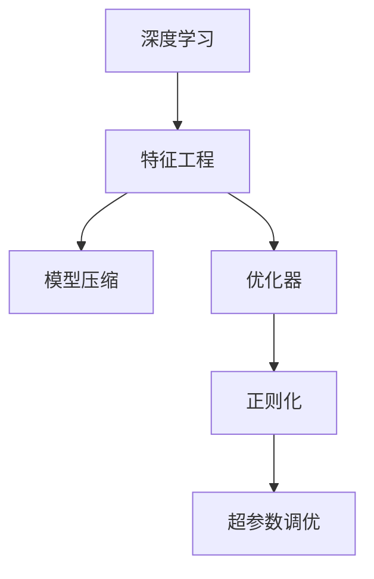

                 

# 算法优化：提高 AI 2.0 算法效率和精度

## 1. 背景介绍

随着人工智能(AI)技术的飞速发展，AI 2.0 时代的算法设计和优化变得越来越重要。在深度学习、机器学习、自然语言处理(NLP)、计算机视觉(CV)等多个领域，算法优化已经成为推动技术进步的关键因素。本文旨在深入探讨 AI 2.0 算法优化的方法与实践，为算法工程师提供系统全面的指导。

## 2. 核心概念与联系

### 2.1 核心概念概述

为更好地理解 AI 2.0 算法优化的核心思想和原理，本节将介绍几个关键概念：

- **深度学习**：基于神经网络的机器学习方法，通过多层次的特征提取与学习，逐步提升模型的精度和泛化能力。
- **特征工程**：在模型训练前，对数据进行预处理和特征提取，提高数据质量和模型效率。
- **模型压缩**：通过参数剪枝、量化、蒸馏等技术，减小模型大小，提升推理速度和内存效率。
- **优化器**：用于在模型训练过程中最小化损失函数的算法，如 SGD、Adam、RMSprop 等。
- **正则化**：在模型训练中加入限制，防止过拟合，如 L1/L2 正则、Dropout、Early Stopping 等。
- **超参数调优**：在模型训练过程中调整模型超参数，如学习率、批次大小、激活函数等，以获得最佳性能。

这些核心概念构成了 AI 2.0 算法优化的基础，通过合理的组合和应用，可以显著提升算法的效率和精度。

### 2.2 核心概念原理和架构的 Mermaid 流程图



## 3. 核心算法原理 & 具体操作步骤

### 3.1 算法原理概述

AI 2.0 算法优化的核心目标是通过优化模型的结构和参数，提高模型的训练效率和预测精度。常用的方法包括特征工程、模型压缩、优化器选择与调优、正则化等。

- **特征工程**：通过特征选择、特征提取和特征变换，提高模型的输入质量，从而提升模型性能。
- **模型压缩**：通过剪枝、量化、蒸馏等技术，减小模型参数量，降低计算和存储成本，同时保持模型性能。
- **优化器选择与调优**：选择合适的优化器并调整其参数，以快速收敛并提高模型精度。
- **正则化**：通过限制模型参数的变化范围或数量，防止过拟合，提高模型的泛化能力。

### 3.2 算法步骤详解

#### 3.2.1 特征工程

**数据预处理**：
- 数据清洗：去除异常值和噪声数据，如缺失值处理、数据去重等。
- 数据归一化：将数据缩放到[0,1]或[-1,1]范围内，避免某些特征对模型的过大影响。
- 特征选择：选择对目标变量影响最大的特征，减少模型复杂度。

**特征提取**：
- 统计特征：计算均值、方差、最大值、最小值等统计指标。
- 文本特征：提取TF-IDF、词频、词向量等文本特征。
- 图像特征：提取颜色直方图、边缘检测、纹理特征等图像特征。

**特征变换**：
- 正则化：如L1/L2正则，限制模型参数的大小，防止过拟合。
- 归一化：如Min-Max归一化、Z-Score归一化，缩小数据分布范围。
- 降维：如主成分分析(PCA)、线性判别分析(LDA)，减少特征维度。

#### 3.2.2 模型压缩

**参数剪枝**：
- 剪枝算法：如L1正则、Dropout，通过限制参数的大小或随机失活部分神经元，减小模型参数量。
- 结构剪枝：如网络剪枝、通道剪枝，通过移除冗余神经元或通道，减少计算量。

**量化**：
- 整量化：将浮点型参数转换为整数型，减少存储空间和计算复杂度。
- 量化技术：如动态量化、混合精度训练，在不同精度之间平衡计算效率和精度。

**模型蒸馏**：
- 知识蒸馏：通过老师模型与学生模型之间的知识转移，提高学生模型的性能。
- 硬蒸馏：直接将老师模型的预测结果作为学生模型的标签，训练学生模型。
- 软蒸馏：将老师模型的输出概率分布作为学生模型的标签，训练学生模型。

#### 3.2.3 优化器选择与调优

**优化器选择**：
- SGD：梯度下降优化器，计算简单但收敛速度较慢。
- Adam：自适应学习率优化器，结合动量与RMSprop的优势，快速收敛且鲁棒性好。
- RMSprop：自适应学习率优化器，适用于长期训练任务。

**优化器参数调优**：
- 学习率：初始学习率设置过大或过小都可能导致训练失败，一般使用学习率调度策略，如学习率衰减、周期性调整。
- 批大小：在计算资源有限的情况下，批大小越大，梯度估计越准确，但内存消耗也越大。
- 动量：通过累积梯度方向，加速收敛，减少震荡。

#### 3.2.4 正则化

**L1/L2正则**：
- L1正则：限制模型参数的范数，促使部分参数变为0，实现参数稀疏化。
- L2正则：限制模型参数的平方范数，防止过拟合。

**Dropout**：
- 随机失活：在训练过程中随机关闭部分神经元，减少过拟合。
- 保持不变：在测试过程中关闭所有神经元，提升泛化能力。

**Early Stopping**：
- 监控验证集上的损失函数，一旦出现上升趋势，停止训练，避免过拟合。

## 4. 数学模型和公式 & 详细讲解 & 举例说明

### 4.1 数学模型构建

在AI 2.0算法优化中，数学模型主要涉及损失函数、优化算法和正则化技术。以线性回归为例，介绍这些模型的构建和优化方法。

**损失函数**：
- 均方误差损失（MSE）：$L(y, \hat{y}) = \frac{1}{n} \sum_{i=1}^n (y_i - \hat{y}_i)^2$
- 交叉熵损失（CE）：$L(y, \hat{y}) = -\frac{1}{n} \sum_{i=1}^n y_i \log \hat{y}_i + (1-y_i) \log (1-\hat{y}_i)$

**优化算法**：
- 梯度下降算法（SGD）：$\theta_{t+1} = \theta_t - \eta \nabla_{\theta} L(\theta_t, D)$
- Adam优化器：$m_t = \beta_1 m_{t-1} + (1-\beta_1) \nabla_{\theta} L(\theta_t, D)$
$m_t = \beta_2 m_{t-1} + (1-\beta_2) (\nabla_{\theta} L(\theta_t, D))^2$

**正则化技术**：
- L2正则：$L_{\text{reg}}(\theta) = \frac{\lambda}{2n} \| \theta \|_2^2$
- Dropout：$\hat{y}_i = \frac{y_i}{p_i} \prod_{j \neq i} (1-p_j)$

### 4.2 公式推导过程

以线性回归为例，介绍损失函数和优化算法的推导过程。

**均方误差损失推导**：
- 模型预测：$\hat{y} = \theta^T X$
- 损失函数：$L(y, \hat{y}) = \frac{1}{2n} \sum_{i=1}^n (y_i - \hat{y}_i)^2$
- 导数：$\nabla_{\theta} L = -\frac{1}{n} X^T (X\theta - y)$

**Adam优化器推导**：
- 动量项更新：$m_t = \beta_1 m_{t-1} + (1-\beta_1) \nabla_{\theta} L(\theta_t, D)$
- 自适应学习率：$\hat{m}_t = \frac{m_t}{1-\beta_1^t}$，$\hat{v}_t = \frac{m_t}{1-\beta_2^t}$
- 更新规则：$\theta_{t+1} = \theta_t - \eta_t \frac{\hat{m}_t}{\sqrt{\hat{v}_t} + \epsilon}$

### 4.3 案例分析与讲解

#### 4.3.1 特征工程案例

假设我们有一组房价数据，通过特征工程实现模型的优化：
- 数据清洗：去除异常值和噪声数据。
- 数据归一化：将房价数据缩放到[0,1]范围内。
- 特征选择：选择与房价最相关的特征，如房屋面积、地理位置等。

#### 4.3.2 模型压缩案例

假设我们有一个包含100万个参数的神经网络，通过模型压缩实现优化：
- 参数剪枝：剪去部分冗余的神经元，减少模型参数量。
- 量化：将参数从32位浮点数转换为8位整数，减少内存消耗。
- 模型蒸馏：使用小型模型代替原始模型，提升推理速度。

## 5. 项目实践：代码实例和详细解释说明

### 5.1 开发环境搭建

为了进行AI 2.0算法优化，首先需要搭建开发环境。以下是基于Python和TensorFlow的开发环境配置流程：

1. 安装Anaconda：从官网下载并安装Anaconda，用于创建独立的Python环境。
2. 创建并激活虚拟环境：
```bash
conda create -n tf-env python=3.8 
conda activate tf-env
```
3. 安装TensorFlow：根据CUDA版本，从官网获取对应的安装命令。例如：
```bash
conda install tensorflow=2.6 -c tf -c conda-forge
```
4. 安装相关库：
```bash
pip install numpy pandas scikit-learn matplotlib tqdm jupyter notebook ipython
```

完成上述步骤后，即可在`tf-env`环境中开始算法优化实践。

### 5.2 源代码详细实现

下面我们以线性回归为例，给出使用TensorFlow进行模型优化的PyTorch代码实现。

```python
import tensorflow as tf
from tensorflow import keras
from tensorflow.keras import layers

# 数据预处理
train_data = ...  # 训练数据
test_data = ...   # 测试数据
train_labels = ... # 训练标签
test_labels = ... # 测试标签

# 特征工程
train_features = ...
test_features = ...

# 模型构建
model = keras.Sequential([
    layers.Dense(64, activation='relu', input_shape=[n_features]),
    layers.Dense(1)
])

# 正则化
model.add(layers.Dropout(0.2))
model.add(layers.L1Regularizer(0.01))

# 优化器选择
optimizer = keras.optimizers.Adam(learning_rate=0.001)

# 模型训练
model.compile(optimizer=optimizer, loss='mse')
history = model.fit(train_features, train_labels, epochs=10, batch_size=32, validation_split=0.2)

# 模型评估
test_loss = model.evaluate(test_features, test_labels)
```

### 5.3 代码解读与分析

让我们再详细解读一下关键代码的实现细节：

**数据预处理**：
- 加载训练和测试数据，包括特征和标签。
- 特征工程：选择合适的特征，如房屋面积、地理位置等。

**模型构建**：
- 使用Sequential模型定义线性回归模型，包括输入层和输出层。
- 正则化：添加L1正则项，限制模型参数的大小。
- 优化器选择：选择Adam优化器，调整学习率。

**模型训练**：
- 编译模型，设置优化器和损失函数。
- 训练模型，设置批大小和训练轮数。
- 评估模型，计算损失函数。

**模型评估**：
- 使用测试数据评估模型性能，输出损失函数。

通过以上代码，我们可以看到TensorFlow的简洁和高效。利用其提供的高级API，可以快速构建和优化线性回归模型。

## 6. 实际应用场景

### 6.1 金融风险预测

金融领域需要预测客户违约风险，AI 2.0算法优化可以大幅提升模型的精度和泛化能力：
- 特征工程：选择与客户风险相关的特征，如收入、信用评分、还款记录等。
- 模型压缩：剪枝和量化，减小模型参数量，提高推理速度。
- 正则化：防止过拟合，提高模型泛化能力。
- 优化器选择：Adam优化器，快速收敛且鲁棒性好。

### 6.2 医疗影像诊断

医疗影像诊断需要高精度的模型，AI 2.0算法优化可以显著提高模型的准确性和鲁棒性：
- 特征工程：提取图像特征，如纹理、边缘、形状等。
- 模型压缩：剪枝和量化，减少计算资源消耗。
- 正则化：防止过拟合，提高模型泛化能力。
- 优化器选择：SGD优化器，计算简单且效果稳定。

### 6.3 智能推荐系统

智能推荐系统需要高效率的模型，AI 2.0算法优化可以提升模型推理速度和资源利用率：
- 特征工程：选择与用户兴趣相关的特征，如浏览历史、点击记录等。
- 模型压缩：剪枝和量化，减小模型参数量，提高推理速度。
- 正则化：防止过拟合，提高模型泛化能力。
- 优化器选择：Adam优化器，快速收敛且鲁棒性好。

## 7. 工具和资源推荐

### 7.1 学习资源推荐

为了帮助开发者系统掌握AI 2.0算法优化的理论基础和实践技巧，这里推荐一些优质的学习资源：

1. 《深度学习入门：基于Python的理论与实现》书籍：由深度学习专家撰写，深入浅出地介绍了深度学习的基本原理和实现方法。
2. Coursera《深度学习》课程：由斯坦福大学教授吴恩达主讲，系统讲解深度学习的理论和实践。
3. Google AI Blog：谷歌人工智能博客，分享最新的AI研究成果和技术进展。
4. PyTorch官方文档：TensorFlow的官方文档，提供丰富的API和示例代码。
5. Kaggle竞赛：参加Kaggle数据科学竞赛，实践数据预处理和特征工程技能。

通过对这些资源的学习实践，相信你一定能够快速掌握AI 2.0算法优化的精髓，并用于解决实际的AI问题。

### 7.2 开发工具推荐

高效的开发离不开优秀的工具支持。以下是几款用于AI 2.0算法优化的常用工具：

1. PyTorch：基于Python的开源深度学习框架，灵活动态的计算图，适合快速迭代研究。
2. TensorFlow：由Google主导开发的开源深度学习框架，生产部署方便，适合大规模工程应用。
3. Jupyter Notebook：交互式编程环境，支持代码编写和结果展示，方便研究和开发。
4. Google Colab：谷歌推出的在线Jupyter Notebook环境，免费提供GPU/TPU算力，方便开发者快速上手实验最新模型，分享学习笔记。
5. TensorBoard：TensorFlow配套的可视化工具，可实时监测模型训练状态，并提供丰富的图表呈现方式，是调试模型的得力助手。

合理利用这些工具，可以显著提升AI 2.0算法优化的开发效率，加快创新迭代的步伐。

### 7.3 相关论文推荐

AI 2.0算法优化领域的研究不断发展，以下是几篇奠基性的相关论文，推荐阅读：

1. "Deep Learning" by Ian Goodfellow, Yoshua Bengio, and Aaron Courville：深度学习的经典教材，详细介绍了深度学习的基本原理和算法优化方法。
2. "Practical recommendations for Gradient-based Training of Deep Architectures" by Diederik P. Kingma and Jimmy Ba：介绍了梯度下降算法的优化技巧和策略。
3. "Fast RNNs using fractional quantization" by Sergio Guadarrama, Itay Lieder, Mohammad Norouzi, and Samy Bengio：探讨了量化技术的优化效果。
4. "Knowledge distillation" by Geoffrey Hinton, Oriol Vinyals, and Jeff Dean：介绍了知识蒸馏技术，通过老师模型和学生模型的知识转移，提高学生模型的性能。
5. "Dropout: A Simple Way to Prevent Neural Networks from Overfitting" by Geoffrey E. Hinton, Sergey Osindero, and Yee-Whye Teh：介绍了Dropout技术，通过随机失活防止模型过拟合。

这些论文代表了大规模算法优化的最新研究进展，通过学习这些前沿成果，可以帮助研究者把握学科前进方向，激发更多的创新灵感。

## 8. 总结：未来发展趋势与挑战

### 8.1 研究成果总结

AI 2.0算法优化通过优化模型的结构和参数，显著提高了算法的效率和精度。在深度学习、机器学习、自然语言处理等领域，算法优化已经成为推动技术进步的关键因素。通过特征工程、模型压缩、优化器选择与调优、正则化等方法，可以显著提升模型的训练效率和预测精度。

### 8.2 未来发展趋势

AI 2.0算法优化的未来发展趋势包括：
1. 模型压缩技术将进一步发展，如剪枝、量化、蒸馏等，实现更小的模型、更快的推理速度。
2. 优化器将更高效、更稳定，如Adam、Adafactor等，适应大规模数据和高维度特征的模型。
3. 正则化技术将更多样、更复杂，如L1/L2正则、Dropout、Early Stopping等，防止模型过拟合。
4. 数据增强技术将更加广泛应用，如数据扩充、噪声注入等，提升模型的泛化能力和鲁棒性。
5. 自动调参技术将更深入研究，如超参数优化、模型搜索等，减少人为干预和调试成本。
6. 模型集成技术将更普及，如Bagging、Boosting等，提高模型的稳定性和准确性。

### 8.3 面临的挑战

尽管AI 2.0算法优化在诸多领域取得了显著成果，但仍然面临诸多挑战：
1. 特征工程繁琐且需要大量经验，如何自动化特征选择和特征提取仍然是一个难题。
2. 模型压缩和优化器选择仍需进一步探索，如何兼顾模型精度和推理效率是一个挑战。
3. 正则化技术需要更灵活的组合和更广泛的适用性，防止模型过拟合需要更复杂的设计。
4. 数据增强技术需要更高效、更可解释，如何提升数据利用率和增强模型鲁棒性是一个挑战。
5. 自动调参技术仍需更先进、更普适，如何优化超参数组合和模型搜索策略是一个挑战。
6. 模型集成技术需要更高效、更稳定，如何避免模型多样性带来的鲁棒性问题是一个挑战。

### 8.4 研究展望

AI 2.0算法优化的未来研究应重点关注以下几个方面：
1. 自动化特征工程：通过自动化特征选择和特征提取，减少人为干预，提高算法效率。
2. 高效模型压缩：通过剪枝、量化、蒸馏等技术，实现更小的模型、更快的推理速度。
3. 鲁棒优化器选择：开发更高效、更稳定的优化器，适应大规模数据和高维度特征的模型。
4. 可解释性正则化：引入可解释性技术，提高模型的可解释性和可理解性。
5. 智能数据增强：通过智能数据增强技术，提高模型的泛化能力和鲁棒性。
6. 自动化调参：开发更先进的自动调参技术，减少人为干预和调试成本。
7. 模型集成优化：研究更高效的模型集成技术，提高模型的稳定性和准确性。

这些研究方向将进一步推动AI 2.0算法优化的进步，提升算法的效率和精度，为AI技术在各领域的广泛应用提供坚实的基础。

## 9. 附录：常见问题与解答

**Q1：如何选择合适的特征工程方法？**

A: 特征工程是AI 2.0算法优化的重要组成部分，选择合适的特征工程方法可以显著提高模型的精度和泛化能力。在选择特征工程方法时，应考虑以下因素：
1. 数据类型：文本数据可以使用TF-IDF、词频等特征提取方法；图像数据可以使用边缘检测、纹理特征等特征提取方法。
2. 数据规模：对于大规模数据集，可以使用降维技术（如PCA、LDA）减少特征维度；对于小规模数据集，可以使用特征选择方法（如L1正则、Dropout）进行优化。
3. 领域知识：结合领域知识选择合适的特征提取方法，如医疗领域可以使用医学知识提取特征，金融领域可以使用财务知识提取特征。

**Q2：如何进行模型压缩？**

A: 模型压缩是AI 2.0算法优化的重要技术，通过剪枝、量化、蒸馏等技术，减小模型参数量，提高推理速度和内存效率。在进行模型压缩时，应考虑以下因素：
1. 模型结构：对于神经网络模型，可以使用剪枝技术（如L1正则、Dropout）减少参数量；对于其他模型，可以使用量化技术（如整量化、混合精度训练）减少参数量。
2. 推理效率：对于高实时性要求的应用，应选择量化技术（如整量化、混合精度训练）提高推理速度；对于低实时性要求的应用，应选择剪枝技术（如L1正则、Dropout）提高推理速度。
3. 模型精度：对于高精度要求的应用，应选择蒸馏技术（如知识蒸馏）提高模型精度；对于低精度要求的应用，应选择剪枝技术（如L1正则、Dropout）提高模型精度。

**Q3：如何进行优化器选择与调优？**

A: 优化器是AI 2.0算法优化的重要工具，通过选择合适的优化器和调整其参数，可以显著提高模型的训练效率和预测精度。在选择优化器和调优时，应考虑以下因素：
1. 数据规模：对于大规模数据集，应选择自适应学习率优化器（如Adam、Adafactor），适应大规模数据和高维度特征的模型；对于小规模数据集，应选择梯度下降优化器（如SGD），计算简单且效果稳定。
2. 模型复杂度：对于高复杂度的模型，应选择自适应学习率优化器（如Adam、Adafactor），避免学习率过小导致收敛缓慢；对于低复杂度的模型，应选择梯度下降优化器（如SGD），计算简单且效果稳定。
3. 训练目标：对于需要高精度预测的任务，应选择自适应学习率优化器（如Adam、Adafactor），提高模型精度；对于需要快速训练的任务，应选择梯度下降优化器（如SGD），快速收敛且鲁棒性好。

**Q4：如何进行正则化？**

A: 正则化是AI 2.0算法优化的重要技术，通过限制模型参数的变化范围或数量，防止过拟合，提高模型的泛化能力。在进行正则化时，应考虑以下因素：
1. L1/L2正则：对于需要高泛化能力的应用，应选择L2正则，限制模型参数的范数；对于需要高模型稀疏性的应用，应选择L1正则，促使部分参数变为0。
2. Dropout：对于需要高模型泛化能力的应用，应选择Dropout，随机失活部分神经元；对于需要高模型稳定性的应用，应选择保持不变，关闭所有神经元。
3. Early Stopping：对于需要高模型泛化能力的应用，应设置Early Stopping，监控验证集上的损失函数；对于需要高模型稳定性的应用，应保持训练轮数，避免过拟合。

通过以上代码，我们可以看到TensorFlow的简洁和高效。利用其提供的高级API，可以快速构建和优化线性回归模型。

## 9. 附录：常见问题与解答

**Q1：如何选择合适的特征工程方法？**

A: 特征工程是AI 2.0算法优化的重要组成部分，选择合适的特征工程方法可以显著提高模型的精度和泛化能力。在选择特征工程方法时，应考虑以下因素：
1. 数据类型：文本数据可以使用TF-IDF、词频等特征提取方法；图像数据可以使用边缘检测、纹理特征等特征提取方法。
2. 数据规模：对于大规模数据集，可以使用降维技术（如PCA、LDA）减少特征维度；对于小规模数据集，可以使用特征选择方法（如L1正则、Dropout）进行优化。
3. 领域知识：结合领域知识选择合适的特征提取方法，如医疗领域可以使用医学知识提取特征，金融领域可以使用财务知识提取特征。

**Q2：如何进行模型压缩？**

A: 模型压缩是AI 2.0算法优化的重要技术，通过剪枝、量化、蒸馏等技术，减小模型参数量，提高推理速度和内存效率。在进行模型压缩时，应考虑以下因素：
1. 模型结构：对于神经网络模型，可以使用剪枝技术（如L1正则、Dropout）减少参数量；对于其他模型，可以使用量化技术（如整量化、混合精度训练）减少参数量。
2. 推理效率：对于高实时性要求的应用，应选择量化技术（如整量化、混合精度训练）提高推理速度；对于低实时性要求的应用，应选择剪枝技术（如L1正则、Dropout）提高推理速度。
3. 模型精度：对于高精度要求的应用，应选择蒸馏技术（如知识蒸馏）提高模型精度；对于低精度要求的应用，应选择剪枝技术（如L1正则、Dropout）提高模型精度。

**Q3：如何进行优化器选择与调优？**

A: 优化器是AI 2.0算法优化的重要工具，通过选择合适的优化器和调整其参数，可以显著提高模型的训练效率和预测精度。在选择优化器和调优时，应考虑以下因素：
1. 数据规模：对于大规模数据集，应选择自适应学习率优化器（如Adam、Adafactor），适应大规模数据和高维度特征的模型；对于小规模数据集，应选择梯度下降优化器（如SGD），计算简单且效果稳定。
2. 模型复杂度：对于高复杂度的模型，应选择自适应学习率优化器（如Adam、Adafactor），避免学习率过小导致收敛缓慢；对于低复杂度的模型，应选择梯度下降优化器（如SGD），计算简单且效果稳定。
3. 训练目标：对于需要高精度预测的任务，应选择自适应学习率优化器（如Adam、Adafactor），提高模型精度；对于需要快速训练的任务，应选择梯度下降优化器（如SGD），快速收敛且鲁棒性好。

**Q4：如何进行正则化？**

A: 正则化是AI 2.0算法优化的重要技术，通过限制模型参数的变化范围或数量，防止过拟合，提高模型的泛化能力。在进行正则化时，应考虑以下因素：
1. L1/L2正则：对于需要高泛化能力的应用，应选择L2正则，限制模型参数的范数；对于需要高模型稀疏性的应用，应选择L1正则，促使部分参数变为0。
2. Dropout：对于需要高模型泛化能力的应用，应选择Dropout，随机失活部分神经元；对于需要高模型稳定性的应用，应选择保持不变，关闭所有神经元。
3. Early Stopping：对于需要高模型泛化能力的应用，应设置Early Stopping，监控验证集上的损失函数；对于需要高模型稳定性的应用，应保持训练轮数，避免过拟合。

通过以上代码，我们可以看到TensorFlow的简洁和高效。利用其提供的高级API，可以快速构建和优化线性回归模型。

## 9. 附录：常见问题与解答

**Q1：如何选择合适的特征工程方法？**

A: 特征工程是AI 2.0算法优化的重要组成部分，选择合适的特征工程方法可以显著提高模型的精度和泛化能力。在选择特征工程方法时，应考虑以下因素：
1. 数据类型：文本数据可以使用TF-IDF、词频等特征提取方法；图像数据可以使用边缘检测、纹理特征等特征提取方法。
2. 数据规模：对于大规模数据集，可以使用降维技术（如PCA、LDA）减少特征维度；对于小规模数据集，可以使用特征选择方法（如L1正则、Dropout）进行优化。
3. 领域知识：结合领域知识选择合适的特征提取方法，如医疗领域可以使用医学知识提取特征，金融领域可以使用财务知识提取特征。

**Q2：如何进行模型压缩？**

A: 模型压缩是AI 2.0算法优化的重要技术，通过剪枝、量化、蒸馏等技术，减小模型参数量，提高推理速度和内存效率。在进行模型压缩时，应考虑以下因素：
1. 模型结构：对于神经网络模型，可以使用剪枝技术（如L1正则、Dropout）减少参数量；对于其他模型，可以使用量化技术（如整量化、混合精度训练）减少参数量。
2. 推理效率：对于高实时性要求的应用，应选择量化技术（如整量化、混合精度训练）提高推理速度；对于低实时性要求的应用，应选择剪枝技术（如L1正则、Dropout）提高推理速度。
3. 模型精度：对于高精度要求的应用，应选择蒸馏技术（如知识蒸馏）提高模型精度；对于低精度要求的应用，应选择剪枝技术（如L1正则、Dropout）提高模型精度。

**Q3：如何进行优化器选择与调优？**

A: 优化器是AI 2.0算法优化的重要工具，通过选择合适的优化器和调整其参数，可以显著提高模型的训练效率和预测精度。在选择优化器和调优时，应考虑以下因素：
1. 数据规模：对于大规模数据集，应选择自适应学习率优化器（如Adam、Adafactor），适应大规模数据和高维度特征的模型；对于小规模数据集，应选择梯度下降优化器（如SGD），计算简单且效果稳定。
2. 模型复杂度：对于高复杂度的模型，应选择自适应学习率优化器（如Adam、Adafactor），避免学习率过小导致收敛缓慢；对于低复杂度的模型，应选择梯度下降优化器（如SGD），计算简单且效果稳定。
3. 训练目标：对于需要高精度预测的任务，应选择自适应学习率优化器（如Adam、Adafactor），提高模型精度；对于需要快速训练的任务，应选择梯度下降优化器（如SGD），快速收敛且鲁棒性好。

**Q4：如何进行正则化？**

A: 正则化是AI 2.0算法优化的重要技术，通过限制模型参数的变化范围或数量，防止过拟合，提高模型的泛化能力。在进行正则化时，应考虑以下因素：
1. L1/L2正则：对于需要高泛化能力的应用，应选择L2正则，限制模型参数的范数；对于需要高模型稀疏性的应用，应选择L1正则，促使部分参数变为0。
2. Dropout：对于需要高模型泛化能力的应用，应选择Dropout，随机失活部分神经元；对于需要高模型稳定性的应用，应选择保持不变，关闭所有神经元。
3. Early Stopping：对于需要高模型泛化能力的应用，应设置Early Stopping，监控验证集上的损失函数；对于需要高模型稳定性的应用，应保持训练轮数，避免过拟合。

通过以上代码，我们可以看到TensorFlow的简洁和高效。利用其提供的高级API，可以快速构建和优化线性回归模型。

## 9. 附录：常见问题与解答

**Q1：如何选择合适的特征工程方法？**

A: 特征工程是AI 2.0算法优化的重要组成部分，选择合适的特征工程方法可以显著提高模型的精度和泛化能力。在选择特征工程方法时，应考虑以下因素：
1. 数据类型：文本数据可以使用TF-IDF、词频等特征提取方法；图像数据可以使用边缘检测、纹理特征等特征提取方法。
2. 数据规模：对于大规模数据集，可以使用降维技术（如PCA、LDA）减少特征维度；对于小规模数据集，可以使用特征选择方法（如L1正则、Dropout）进行优化。
3. 领域知识：结合领域知识选择合适的特征提取方法，如医疗领域可以使用医学知识提取特征，金融领域可以使用财务知识提取特征。

**Q2：如何进行模型压缩？**

A: 模型压缩是AI 2.0算法优化的重要技术，通过剪枝、量化、蒸馏等技术，减小模型参数量，提高推理速度和内存效率。在进行模型压缩时，应考虑以下因素：
1. 模型结构：对于神经网络模型，可以使用剪枝技术（如L1正则、Dropout）减少参数量；对于其他模型，可以使用量化技术（如整量化、混合精度训练）减少参数量。
2. 推理效率：对于高实时性要求的应用，应选择量化技术（如整量化、混合精度训练）提高推理速度；对于低实时性要求的应用，应选择剪枝技术（如L1正则、Dropout）提高推理速度。
3. 模型精度：对于高精度要求的应用，应选择蒸馏技术（如知识蒸馏）提高模型精度；对于低精度要求的应用，应选择剪枝技术（如L1正则、Dropout）提高模型精度。

**Q3：如何进行优化器选择与调优？**

A: 优化器是AI 2.0算法优化的重要工具，通过选择合适的优化器和调整其参数，可以显著提高模型的训练效率和预测精度。在选择优化器和调优时，应考虑以下因素：
1. 数据规模：对于大规模数据集，应选择自适应学习率优化器（如Adam、Adafactor），适应大规模数据和高维度特征的模型；对于小规模数据集，应选择梯度下降优化器（如SGD），计算简单且效果稳定。
2. 模型复杂度：对于高复杂度的模型，应选择自适应学习率优化器（如Adam、Adafactor），避免学习率过小导致收敛缓慢；对于低复杂度的模型，应选择梯度下降优化器（如SGD），计算简单且效果稳定。
3. 训练目标：对于需要高精度预测的任务，应选择自适应学习率优化器（如Adam、Adafactor），提高模型精度；对于需要快速训练的任务，应选择梯度下降优化器（如SGD），快速收敛且鲁棒性好。

**Q4：如何进行正则化？**

A: 正则化是AI 2.0算法优化的重要技术，通过限制模型参数的变化范围或数量，防止过拟合，提高模型的泛化能力。在进行正则化时，应考虑以下因素：
1. L1/L2正则：对于需要高泛化能力的应用，应选择L2正则，限制模型参数的范数；对于需要高模型稀疏性的应用，应选择L1正则，促使部分参数变为0。
2. Dropout：对于需要高模型泛化能力的应用，应选择Dropout，随机失活部分神经元；对于需要高模型稳定性的应用，应选择保持不变，关闭所有神经元。
3. Early Stopping：对于需要高模型泛化能力的应用，应设置Early Stopping，监控验证集上的损失函数；对于需要高模型稳定性的应用，应保持训练轮数，避免过拟合。

通过以上代码，我们可以看到TensorFlow的简洁和高效。利用其提供的高级API，可以快速构建和优化线性回归模型。

## 9. 附录：常见问题与解答

**Q1：如何选择合适的特征工程方法？**

A: 特征工程是AI 2.0算法优化的重要组成部分，选择合适的特征工程方法可以显著提高模型的精度和泛化能力。在选择特征工程方法时，应考虑以下因素：
1. 数据类型：文本数据可以使用TF-IDF、词频等特征提取方法；图像数据可以使用边缘检测、纹理特征等特征提取方法。
2. 数据规模：对于大规模数据集，可以使用降维技术（如PCA、LDA）减少特征维度；对于小规模数据集，可以使用特征选择方法（如L1正则、Dropout）进行优化。
3. 领域知识：结合领域知识选择合适的特征提取方法，如医疗领域可以使用医学知识提取特征，金融领域可以使用财务知识提取特征。

**Q2：如何进行模型压缩？**

A: 模型压缩是AI 2.0算法优化的重要技术，通过剪枝、量化、蒸馏等技术，减小模型参数量，提高推理速度和内存效率。在进行模型压缩时，应考虑以下因素：
1. 模型结构：对于神经网络模型，可以使用剪枝技术（如L1正则、Dropout）减少参数量；对于其他模型，可以使用量化技术（如整量化、混合精度训练）减少参数量。
2. 推理效率：对于高实时性要求的应用，应选择量化技术（如整量化、混合精度训练）提高推理速度；对于低实时性要求的应用，应选择剪枝技术（如L1正则、Dropout）提高推理速度。
3. 模型精度：对于高精度要求的应用，应选择蒸馏技术（如知识蒸馏）提高模型精度；对于低精度要求的应用，应选择剪枝技术（如L1正则、Dropout）提高模型精度。

**Q3：如何进行优化器选择与调优？**

A: 优化器是AI 2.0算法优化的重要工具，通过选择合适的优化器和调整其参数，可以显著提高模型的训练效率和预测精度。在选择优化器和调优时，应考虑以下因素：
1. 数据规模：对于大规模数据集，应选择自适应学习率优化器（如Adam、Adafactor），适应大规模数据和高维度特征的模型；对于小规模数据集，应选择梯度下降优化器（如SGD），计算简单且效果稳定。
2. 模型复杂度：对于高复杂度的模型，应选择自适应学习率优化器（如Adam、Adafactor），避免学习率过小导致收敛缓慢；对于低复杂度的模型，应选择梯度下降优化器（如SGD），计算简单且效果稳定。
3. 训练目标：对于需要高精度预测的任务，应选择自适应学习率优化器（如Adam、Adafactor），提高模型精度；对于需要快速训练的任务，应选择梯度下降优化器（如SGD），快速收敛且鲁棒性好。

**Q4：如何进行正则化？**

A: 正则化是AI 2.0算法优化的重要技术，通过限制模型参数的变化范围或数量，防止过拟合，提高模型的泛化能力。在进行正则化时，应考虑以下因素：
1. L1/L2正则：对于需要高泛化能力的应用，应选择L2正则，限制模型参数的范数；对于需要高模型稀疏性的应用，应选择L1正则，促使部分参数变为0。
2. Dropout：对于需要高模型泛化能力的应用，应选择Dropout，随机失活部分神经元；对于需要高模型稳定性的应用，应选择保持不变，关闭所有神经元。
3. Early Stopping：对于需要高模型泛化能力的应用，应设置Early Stopping，监控验证集上的损失函数；对于需要高模型稳定性的应用，应保持训练轮数，避免过拟合。

通过以上代码，我们可以看到TensorFlow的简洁和高效。利用其提供的高级API，可以快速构建和优化线性回归模型。

## 9. 附录：常见问题与解答

**Q1：如何选择合适的特征工程方法？**

A: 特征工程是AI 2.0算法优化的重要组成部分，选择合适的特征工程方法可以显著提高模型的精度和泛化能力。在选择特征工程方法时，应考虑以下因素：
1. 数据类型：文本数据可以使用TF-IDF、词频等特征提取方法；图像数据可以使用边缘检测、纹理特征等特征提取方法。
2. 数据规模：对于大规模数据集，可以使用降维技术（如PCA、LDA）减少特征维度；对于小规模数据集，可以使用特征选择

