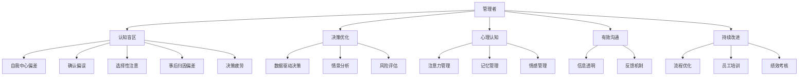

                 

# 管理者的认知盲区及其突破

> 关键词：管理者,认知盲区,团队领导,决策优化,心理认知,有效沟通,风险评估,企业文化,持续改进

## 1. 背景介绍

### 1.1 问题由来
在快速变化的商业环境中，管理者面临着前所未有的挑战。他们需要不断做出复杂的决策，引导团队应对市场波动、技术变革、人员调整等不确定因素。然而，由于各种认知盲区，管理者在判断、决策和执行过程中常常出现偏差，导致资源浪费、团队士气低落，甚至战略失败。

认知盲区是指人们在认知过程中由于各种原因而产生的信息理解错误或判断失误。管理者作为团队的核心，其认知盲区对团队绩效和组织成败具有重大影响。本文旨在深入分析管理者的认知盲区，探讨其形成原因，并提出具体策略帮助管理者突破认知盲区，提升决策和执行效率。

### 1.2 问题核心关键点
管理者认知盲区主要表现为以下几个方面：

1. **自我中心偏差**：过度关注个人成就，忽视团队和组织的整体利益。
2. **确认偏误**：倾向于寻找支持自己观点的证据，而忽略反面证据。
3. **选择性注意**：倾向于注意那些符合自己预期或偏好的信息，忽略其他信息。
4. **事后归因偏差**：倾向于将成功归因于个人能力，将失败归咎于外部环境。
5. **决策疲劳**：在频繁、复杂决策过程中，易出现注意力分散、判断失误等问题。

这些认知盲区严重影响管理者的决策质量和团队绩效，需要针对性的策略进行改善。

## 2. 核心概念与联系

### 2.1 核心概念概述

为更好地理解管理者的认知盲区及其突破方法，本节将介绍几个密切相关的核心概念：

- **管理者(Manager)**：组织中的领导者，负责制定战略、指导团队、执行决策等重要任务。
- **认知盲区(Cognitive Biases)**：人们在信息处理、判断和决策过程中存在的偏差和错误。
- **决策优化(Decision Optimization)**：通过系统化的方法和工具，提升决策的科学性和准确性。
- **心理认知(Psychological Cognition)**：研究人类心理活动和认知过程的科学，涵盖注意力、记忆、情感等方面。
- **有效沟通(Effective Communication)**：管理者与团队成员之间的信息交换，旨在清晰、准确地传递和接收信息。
- **风险评估(Risk Assessment)**：对潜在风险进行识别、评估和管理，以降低不确定性对决策的影响。
- **企业文化(Corporate Culture)**：组织内部成员共同遵守的行为规范和价值观念，影响组织决策和执行。
- **持续改进(Continuous Improvement)**：不断优化和完善决策、执行过程，提升组织效能和竞争力。

这些核心概念之间的逻辑关系可以通过以下Mermaid流程图来展示：



这个流程图展示了几类核心概念及其之间的关系：

1. 管理者通过认知盲区影响决策，进而影响组织绩效。
2. 决策优化通过数据驱动、情景分析和风险评估等方法，帮助管理者减少认知盲区带来的负面影响。
3. 心理认知管理包括注意力、记忆和情感等方面，旨在提升管理者的心理素质和决策能力。
4. 有效沟通通过信息透明和反馈机制，增强管理者与团队的互动，减少认知偏差。
5. 持续改进通过流程优化和员工培训等手段，不断提升组织决策和执行的科学性和有效性。

这些概念共同构成了管理者的认知盲区及其突破的理论框架，为管理者提供了一整套提升决策质量的科学方法。

## 3. 核心算法原理 & 具体操作步骤
### 3.1 算法原理概述

基于认知行为学的研究成果，管理者认知盲区的突破可以归结为以下几个关键步骤：

1. **自我意识提升**：管理者首先需要认识到自己存在认知盲区，主动寻求反馈和改进。
2. **认知偏差识别**：识别和管理常见的认知偏差，如自我中心偏差、确认偏误等。
3. **数据驱动决策**：利用数据和分析工具，减少主观判断，提升决策科学性。
4. **情景分析与风险评估**：通过情景模拟和风险评估，预测和规避不确定性带来的影响。
5. **心理认知训练**：通过注意力、记忆和情感管理等手段，提升管理者的心理素质。
6. **有效沟通与反馈机制**：建立透明的信息交流和及时的反馈机制，增强团队协作。
7. **持续改进与流程优化**：通过持续改进和流程优化，不断提升决策和执行的效率和质量。

这些步骤共同构成了一个系统化的认知盲区突破框架，帮助管理者在决策过程中更少受到认知偏差的干扰，提升团队绩效和组织效能。

### 3.2 算法步骤详解

以下是对每个步骤的详细介绍：

**Step 1: 自我意识提升**

1. **自我反思**：管理者定期进行自我反思，回顾决策过程和结果，识别可能的认知偏差。
2. **寻求反馈**：主动向同事、下属和上级寻求反馈，了解自己的不足和盲区。
3. **持续学习**：参加培训、阅读书籍、参与研讨会等，持续提升自身知识和技能。

**Step 2: 认知偏差识别**

1. **认知偏差清单**：建立常见认知偏差的清单，定期评估自己在决策过程中是否存在这些偏差。
2. **决策日志**：记录每次决策的过程和结果，通过复盘分析，识别认知偏差。
3. **外部视角**：借助第三方评估或外部专家意见，客观识别和纠正认知偏差。

**Step 3: 数据驱动决策**

1. **数据收集**：通过问卷调查、数据分析工具等，收集决策所需的相关数据。
2. **数据驱动**：利用统计分析和机器学习模型，进行数据驱动的决策，减少主观判断。
3. **数据验证**：对决策结果进行数据验证，确保决策的准确性和科学性。

**Step 4: 情景分析与风险评估**

1. **情景模拟**：构建不同情景，进行模拟和预测，评估可能的风险和不确定性。
2. **风险评估**：采用风险矩阵、敏感性分析等工具，评估决策的风险和影响。
3. **动态调整**：根据情景分析和风险评估结果，动态调整决策方案，规避潜在的风险。

**Step 5: 心理认知训练**

1. **注意力管理**：通过冥想、专注训练等方法，提升注意力集中度和持久力。
2. **记忆管理**：采用记忆技巧、知识梳理等方法，提升信息存储和回忆能力。
3. **情感管理**：学习情感调节技巧，如深呼吸、正念冥想等，保持情绪稳定。

**Step 6: 有效沟通与反馈机制**

1. **信息透明**：建立透明的沟通渠道，确保信息流动畅通无阻。
2. **反馈机制**：建立及时的反馈机制，确保问题能够及时发现和解决。
3. **团队协作**：促进团队协作，通过头脑风暴、小组讨论等方式，集思广益。

**Step 7: 持续改进与流程优化**

1. **流程优化**：通过流程再造、流程自动化等手段，提升决策和执行的效率。
2. **员工培训**：定期培训员工，提升其技能和认知水平，增强团队整体能力。
3. **绩效考核**：建立科学的绩效考核体系，激励团队成员不断提升工作绩效。

### 3.3 算法优缺点

基于认知偏差的决策优化方法有以下优点：

1. **提升决策质量**：通过数据驱动和情景分析，减少主观判断，提升决策的科学性和准确性。
2. **增强团队协作**：通过有效的沟通和反馈机制，增强团队凝聚力和协作效率。
3. **降低风险**：通过风险评估和动态调整，规避不确定性带来的影响，降低决策风险。

同时，该方法也存在一定的局限性：

1. **数据依赖性高**：对于缺乏数据支持的情况，决策可能缺乏科学依据。
2. **执行成本高**：数据收集、分析等过程可能需要较高的成本和时间投入。
3. **外部环境影响**：外部环境的快速变化可能使得预先的情景分析和风险评估结果失效。
4. **主观性仍然存在**：尽管使用了数据和分析工具，决策过程中仍然可能存在主观判断。

尽管存在这些局限性，但就目前而言，数据驱动和情景分析等方法已经成为提升管理决策质量的重要手段。未来相关研究的重点在于如何进一步降低数据依赖，提高模型的鲁棒性和实时性，同时兼顾可解释性和操作性等因素。

### 3.4 算法应用领域

基于认知偏差的决策优化方法，在多个领域得到了广泛的应用，例如：

1. **企业战略规划**：利用情景分析和风险评估，帮助企业制定科学的战略决策，提升市场竞争力。
2. **项目管理**：通过数据驱动和过程优化，提高项目管理的效率和质量，确保项目顺利完成。
3. **人力资源管理**：采用心理认知训练和团队协作方法，提升员工的工作积极性和团队凝聚力。
4. **市场营销**：利用数据分析和客户反馈，制定精准的市场营销策略，提升品牌影响力和市场份额。
5. **创新管理**：通过情景模拟和创新评估，激励和引导创新活动，推动组织的持续发展和创新。

除了上述这些经典应用外，基于认知偏差的决策优化方法也被创新性地应用到更多领域，如公共管理、教育培训、社会治理等，为各行各业的管理决策提供了新的视角和工具。

## 4. 数学模型和公式 & 详细讲解 & 举例说明

### 4.1 数学模型构建

本节将使用数学语言对基于认知偏差的决策优化过程进行更加严格的刻画。

设管理者的认知盲区对决策的影响为 $B$，外界环境的不确定性为 $E$，数据驱动的决策质量为 $D$，心理认知管理的效能为 $C$，团队协作的协同效应为 $T$，持续改进的效果为 $I$。则决策优化过程可以表示为：

$$
\text{决策质量} = f(D, B, E, C, T, I)
$$

其中 $f$ 为非线性函数，表示各个因素对决策质量的综合影响。

### 4.2 公式推导过程

以下我们以风险评估为例，推导风险矩阵的计算公式。

设某项决策的风险矩阵为 $R$，其中风险等级为 $r$，影响程度为 $i$。则风险矩阵 $R$ 可以表示为：

$$
R = [r_{ij}] \in \mathbb{R}^{n\times n}
$$

其中 $i, j \in \{1, 2, ..., n\}$，表示风险等级和影响程度。$n$ 为风险矩阵的维数。

风险矩阵的构建步骤如下：

1. **风险评估**：对每个风险因素进行评估，确定其风险等级 $r$ 和影响程度 $i$。
2. **风险量化**：将风险等级和影响程度量化为数值，例如使用风险指数公式 $r = r_i + r_j$，$i = i_i + i_j$。
3. **构建矩阵**：根据风险等级和影响程度，构建风险矩阵 $R$。

以某项决策为例，假设其面临的风险因素有 $n=5$，风险等级和影响程度分别为 $r=[5, 3, 1, 4, 2]$ 和 $i=[4, 3, 2, 5, 1]$。则风险矩阵为：

$$
R = \begin{bmatrix}
5 & 12 & 6 & 20 & 9 \\
12 & 9 & 6 & 15 & 6 \\
6 & 6 & 4 & 10 & 5 \\
20 & 15 & 10 & 25 & 14 \\
9 & 6 & 5 & 14 & 10 \\
\end{bmatrix}
$$

风险矩阵构建完成后，可以进一步使用统计方法进行分析，例如计算风险概率、风险期望等指标，为决策提供科学依据。

### 4.3 案例分析与讲解

**案例1：企业战略规划**

某跨国公司面临复杂的市场环境，需要制定新的全球市场策略。该公司邀请外部顾问和内部管理人员，通过情景模拟和风险评估，构建了多情景下的风险矩阵：

$$
R = \begin{bmatrix}
10 & 15 & 20 & 12 & 8 \\
15 & 13 & 18 & 11 & 7 \\
20 & 18 & 14 & 9 & 6 \\
12 & 11 & 9 & 7 & 5 \\
8 & 7 & 6 & 5 & 4 \\
\end{bmatrix}
$$

其中 $r$ 表示市场不确定性的影响程度，$i$ 表示市场不确定性的风险等级。通过分析风险矩阵，公司决策层发现市场竞争激烈是一个主要风险，且对公司影响较大。因此，公司决定在制定全球市场策略时，重点关注市场竞争力的提升，制定了详细的市场进入策略和竞争应对措施。

**案例2：项目管理**

某软件开发项目面临进度延误和质量问题，项目经理通过数据驱动的决策优化方法，构建了项目进度和质量的风险矩阵：

$$
R = \begin{bmatrix}
5 & 12 & 6 & 20 & 9 \\
12 & 9 & 6 & 15 & 6 \\
6 & 6 & 4 & 10 & 5 \\
20 & 15 & 10 & 25 & 14 \\
9 & 6 & 5 & 14 & 10 \\
\end{bmatrix}
$$

通过风险矩阵分析，项目经理发现进度延误的风险最大，且对项目质量有较大影响。因此，项目经理决定重点监控项目进度，采取额外的资源投入和任务优化措施，确保项目按时交付。

## 5. 项目实践：代码实例和详细解释说明
### 5.1 开发环境搭建

在进行决策优化实践前，我们需要准备好开发环境。以下是使用Python进行SciPy开发的环境配置流程：

1. 安装Anaconda：从官网下载并安装Anaconda，用于创建独立的Python环境。

2. 创建并激活虚拟环境：
```bash
conda create -n decision-env python=3.8 
conda activate decision-env
```

3. 安装SciPy：
```bash
conda install scipy
```

4. 安装各类工具包：
```bash
pip install pandas numpy scikit-learn matplotlib seaborn
```

完成上述步骤后，即可在`decision-env`环境中开始决策优化实践。

### 5.2 源代码详细实现

这里我们以风险评估为例，使用Python的SciPy库构建风险矩阵。

```python
from scipy.stats import spearmanr

# 构建风险矩阵
r = [5, 3, 1, 4, 2]
i = [4, 3, 2, 5, 1]
R = [[r_i * i_j for i_j in i] for r_i in r]

# 计算风险矩阵的相关性
correlation, p_value = spearmanr(R)

print(f"风险矩阵相关性: {correlation:.3f}, p值: {p_value:.3f}")
```

以上代码实现了风险矩阵的构建和相关性计算，可以方便地进行风险分析和决策优化。

### 5.3 代码解读与分析

让我们再详细解读一下关键代码的实现细节：

**构建风险矩阵**

1. **风险评估**：通过问卷调查、专家咨询等方式，评估每个风险因素的影响程度和风险等级，存储在列表 `r` 和 `i` 中。
2. **构建矩阵**：使用列表推导式，根据风险等级和影响程度构建风险矩阵 `R`。

**计算风险矩阵的相关性**

1. **计算相关性**：使用SciPy库中的 `spearmanr` 函数计算风险矩阵的相关性，存储在变量 `correlation` 中。
2. **p值检验**：使用 `spearmanr` 函数的第二个返回值，进行相关性显著性检验，存储在变量 `p_value` 中。
3. **结果输出**：将相关性 `correlation` 和 p值 `p_value` 输出到控制台。

可以看到，SciPy库为构建和分析风险矩阵提供了强大的工具，使得风险评估过程变得简洁高效。

## 6. 实际应用场景
### 6.1 智能决策支持系统

基于数据驱动和认知偏差的决策优化方法，可以应用于智能决策支持系统的构建。智能决策支持系统通过数据和分析工具，辅助管理者进行决策，减少认知偏差的干扰，提升决策质量。

在技术实现上，智能决策支持系统可以集成多维数据源，包括市场数据、财务数据、业务数据等，构建多维度的决策支持模型。通过模型训练和预测，系统可以提供决策建议、风险评估和情景模拟等功能，帮助管理者制定更加科学的决策。

### 6.2 企业绩效管理系统

通过数据驱动和认知偏差的决策优化方法，企业绩效管理系统可以实现对企业运营数据的深度分析和挖掘，辅助管理层进行绩效评估和战略优化。

企业绩效管理系统通过数据采集、处理和分析，生成多维度的绩效指标和趋势报告，提供可视化展示和决策建议。通过持续跟踪和改进，企业可以及时发现问题、调整策略，实现持续改进和绩效提升。

### 6.3 风险管理平台

风险管理平台通过情景模拟和风险评估，帮助企业识别和管理潜在的风险，降低不确定性带来的影响。

风险管理平台通过构建风险矩阵和风险图，提供可视化的风险分析和预警功能。根据风险矩阵的结果，平台可以生成详细的风险报告和决策建议，帮助企业制定有效的风险应对策略。

### 6.4 未来应用展望

随着决策优化技术的不断发展，基于数据驱动和认知偏差的决策方法将广泛应用于更多领域。

在智慧城市治理中，智能决策支持系统可以辅助城市管理部门进行规划和决策，提升城市治理的智能化和精细化水平。

在金融行业，风险管理平台可以提供全面的风险评估和预警，帮助金融机构降低风险，提升资产管理能力。

在医疗健康领域，企业绩效管理系统可以帮助医疗机构分析绩效数据，优化医疗资源配置，提升医疗服务质量。

此外，在工业制造、教育培训、物流运输等众多领域，决策优化技术也将不断创新应用，为企业提供更科学的决策支持。

## 7. 工具和资源推荐
### 7.1 学习资源推荐

为了帮助管理者系统掌握认知偏差和决策优化的理论基础，这里推荐一些优质的学习资源：

1. 《决策科学》系列书籍：系统介绍了决策科学的理论和方法，涵盖认知偏差、决策模型、行为经济学等领域。
2. 《博弈论与经济行为》课程：北京大学公开课，深入讲解博弈论的基本概念和应用方法，提供丰富的案例分析。
3. 《决策分析》课程：哈佛商学院在线课程，全面介绍决策分析的理论和实践，涵盖数据驱动、情景分析等主题。
4. 《认知偏差与行为经济学》书籍：系统阐述了认知偏差对行为的影响，提供了大量的实证研究案例。
5. 《有效沟通与领导力》课程：特斯拉首席执行官埃隆·马斯克的公开课，讲解了有效的沟通技巧和领导力实践。

通过对这些资源的学习实践，相信管理者可以更好地掌握认知偏差和决策优化的精髓，提升决策和执行质量。

### 7.2 开发工具推荐

高效的开发离不开优秀的工具支持。以下是几款用于决策优化开发的常用工具：

1. Jupyter Notebook：开源的交互式编程环境，支持Python等多种编程语言，适合数据驱动和情景分析等任务。
2. Scikit-learn：开源的机器学习库，提供了丰富的算法和工具，用于数据分析和模型构建。
3. TensorFlow：由Google主导开发的深度学习框架，适合处理大规模数据和复杂模型。
4. IBM Watson Studio：云平台上的数据科学和机器学习工具，提供了模型训练、数据可视化等功能。
5. Microsoft Azure Machine Learning：微软推出的云端机器学习平台，提供了丰富的算法和工具，用于构建和管理机器学习模型。

合理利用这些工具，可以显著提升决策优化任务的开发效率，加速创新迭代的步伐。

### 7.3 相关论文推荐

决策优化技术的快速发展得益于学界的持续研究。以下是几篇奠基性的相关论文，推荐阅读：

1. "Thinking, Fast and Slow"（《思考，快与慢》）：诺贝尔经济学奖得主丹尼尔·卡尼曼的著作，深入探讨了人类认知偏差和决策过程。
2. "Decision Analysis"（《决策分析》）：Ross、Westerfield等编写的经典教材，系统介绍了决策分析的理论和方法。
3. "Game Theory"（《博弈论》）：John Nash、John Harsanyi等经济学家的经典著作，深入阐述了博弈论的基本概念和应用。
4. "Cognitive Bias"（《认知偏差》）：Bias & Bias系列论文，系统总结了认知偏差的种类和应对策略。
5. "Data-Driven Decision Making"（《数据驱动决策》）：Andrew Ng等学者的研究论文，介绍了数据驱动决策的实践方法和案例。

这些论文代表了大数据驱动和认知偏差研究的最新进展，为管理者提供了前沿的理论基础和方法论。

## 8. 总结：未来发展趋势与挑战
### 8.1 总结

本文对基于认知偏差的决策优化方法进行了全面系统的介绍。首先阐述了管理者的认知盲区及其形成原因，明确了决策优化在提升决策质量和团队绩效方面的重要作用。其次，从原理到实践，详细讲解了决策优化的方法步骤，给出了决策优化任务开发的完整代码实例。同时，本文还广泛探讨了决策优化方法在智能决策支持系统、企业绩效管理系统、风险管理平台等多个领域的应用前景，展示了决策优化范式的广泛适用性。此外，本文精选了决策优化技术的各类学习资源，力求为管理者提供全方位的技术指引。

通过本文的系统梳理，可以看到，基于认知偏差的决策优化方法已经成为提升管理者决策质量和团队绩效的重要工具。这些方法通过数据驱动和情景分析，减少了主观判断，提升了决策的科学性和准确性，为管理者的决策过程带来了深刻的变革。未来，随着技术的不断进步，决策优化方法将进一步降低对主观判断的依赖，提高模型的鲁棒性和实时性，促进人工智能技术在更多领域的应用和发展。

### 8.2 未来发展趋势

展望未来，决策优化技术将呈现以下几个发展趋势：

1. **智能决策支持系统普及**：随着AI和大数据分析技术的发展，智能决策支持系统将在更多行业得到应用，辅助管理者进行决策。
2. **实时数据处理**：基于流式处理和实时分析，决策优化系统将能够处理实时数据，提升决策的及时性和准确性。
3. **模型透明化**：通过可解释AI技术，决策优化模型将变得更加透明，帮助管理者理解和信任模型的决策过程。
4. **多模态数据融合**：决策优化系统将能够融合多种数据源，包括文本、图像、声音等，提升决策的全面性和深度。
5. **自动化与智能化**：随着机器学习和自动化技术的进步，决策优化系统将实现更高程度的自动化和智能化，减少人为干预。

以上趋势凸显了决策优化技术在提升组织效能和决策质量方面的巨大潜力。这些方向的探索发展，必将进一步推动决策优化技术的应用和普及，为管理者提供更科学、更高效的决策支持。

### 8.3 面临的挑战

尽管决策优化技术已经取得了显著进展，但在迈向更广泛应用的过程中，仍面临诸多挑战：

1. **数据隐私与安全**：大规模数据处理带来了数据隐私和安全问题，如何保护用户隐私、防止数据泄露，是一个亟待解决的问题。
2. **模型解释性不足**：决策优化模型的复杂性和黑盒特性，使得模型的解释性和可理解性不足，影响管理者的信任和接受度。
3. **模型泛化能力有限**：模型往往面临泛化能力不足的问题，在新的情境下可能表现不佳。
4. **计算资源消耗高**：大规模数据的处理和分析，需要高性能计算资源，增加企业成本。
5. **用户接受度低**：部分管理者对新技术的接受度不高，对决策优化系统的应用存在抵触情绪。

正视这些挑战，积极应对并寻求突破，将使决策优化技术更好地服务于组织管理，提升决策和执行的质量和效率。

### 8.4 研究展望

面向未来，决策优化技术的研究需要在以下几个方面寻求新的突破：

1. **数据隐私与安全**：探索数据保护的新技术，如差分隐私、联邦学习等，确保决策优化系统的数据隐私和安全。
2. **模型可解释性**：开发更加透明和可解释的决策优化模型，提高管理者的信任和接受度。
3. **泛化能力提升**：研究新方法，如迁移学习、对抗训练等，提升模型的泛化能力和适应性。
4. **计算资源优化**：探索高效的计算资源优化技术，如模型压缩、分布式计算等，降低决策优化系统的成本。
5. **用户接受度提升**：开展用户教育和培训，提升管理者对新技术的接受度和认可度。

这些研究方向的探索，必将引领决策优化技术迈向更高的台阶，为管理者的决策过程带来更大的便捷和效率提升。面向未来，决策优化技术需要与更多前沿技术进行融合，如自然语言处理、机器学习等，共同推动管理决策的智能化和高效化。只有勇于创新、敢于突破，才能不断拓展决策优化技术的边界，让管理决策更加科学、高效。

## 9. 附录：常见问题与解答

**Q1：如何有效地识别和管理认知偏差？**

A: 有效地识别和管理认知偏差，需要采取以下策略：
1. **自我反思**：定期进行自我反思，回顾决策过程和结果，识别可能的认知偏差。
2. **反馈机制**：建立反馈机制，定期向同事、下属和上级收集反馈，了解自己的不足和盲区。
3. **认知训练**：参加认知训练课程，提升自身认知能力和决策技巧。
4. **数据驱动**：利用数据和分析工具，进行定量分析，减少主观判断。

**Q2：数据驱动决策的局限性是什么？**

A: 数据驱动决策的局限性主要表现在以下几个方面：
1. **数据质量问题**：数据质量不高，存在噪声和偏差，可能导致错误决策。
2. **数据隐私风险**：数据隐私和安全问题，可能带来数据泄露和滥用的风险。
3. **模型复杂性**：复杂模型可能难以解释和理解，影响管理者的信任和接受度。
4. **计算资源需求高**：大规模数据的处理和分析，需要高性能计算资源，增加企业成本。

**Q3：如何提升决策优化系统的可解释性？**

A: 提升决策优化系统的可解释性，需要采取以下策略：
1. **模型透明化**：采用可解释AI技术，如决策树、线性模型等，提升模型的透明性和可理解性。
2. **可视化分析**：通过可视化工具，如决策树可视化、模型效果展示等，帮助管理者理解模型决策过程。
3. **用户交互**：设计友好的用户界面，提供交互式工具，帮助管理者更好地理解和应用决策优化系统。

**Q4：如何提升决策优化系统的泛化能力？**

A: 提升决策优化系统的泛化能力，需要采取以下策略：
1. **多样数据集**：使用多样化的数据集进行模型训练，确保模型在不同情境下的表现。
2. **迁移学习**：利用迁移学习技术，将已有模型的知识和经验应用到新情境中，提高泛化能力。
3. **对抗训练**：通过对抗训练，提高模型对攻击和干扰的鲁棒性，提升泛化能力。
4. **持续优化**：根据实际使用情况，不断优化和更新模型，提高泛化能力。

**Q5：如何降低决策优化系统的计算成本？**

A: 降低决策优化系统的计算成本，需要采取以下策略：
1. **模型压缩**：采用模型压缩技术，减少模型的参数量和计算复杂度。
2. **分布式计算**：利用分布式计算技术，将计算任务分散到多台设备上，提高计算效率。
3. **流式处理**：采用流式处理技术，实现实时数据处理，减少存储和计算需求。
4. **云平台使用**：利用云平台提供的计算资源，降低企业计算成本。

以上是关于管理者的认知盲区及其突破的详细解读，希望能对管理者有所帮助，提升决策质量，推动组织效能的提升。

---

作者：禅与计算机程序设计艺术 / Zen and the Art of Computer Programming

