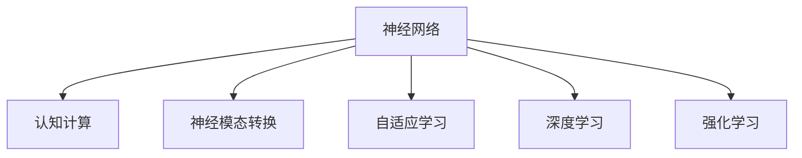

                 

# 类脑智能与认知计算原理与代码实战案例讲解

## 1. 背景介绍

### 1.1 问题由来
类脑智能与认知计算是人工智能领域的前沿研究方向，旨在通过模拟人类大脑的神经结构和计算机制，构建能够理解和处理复杂认知任务的智能系统。这一领域的突破不仅有助于解决目前人工智能在可解释性、鲁棒性和自适应性方面的短板，还能够为认知科学研究提供重要的技术支撑。

近年来，深度学习、强化学习等技术在图像识别、语音识别等领域取得了巨大成功，但这些方法本质上还是“黑箱”模型，难以提供对输入和输出的可解释性。与此同时，神经科学的快速发展也为模拟人类大脑的结构和功能提供了可能，为类脑智能与认知计算的研究奠定了基础。

### 1.2 问题核心关键点
类脑智能与认知计算的关键点在于如何模拟人类大脑的神经结构和认知过程，构建能够理解和处理复杂认知任务的智能系统。核心技术包括：
1. **神经网络模型**：模拟人类大脑的神经元结构和突触连接，构建神经网络模型。
2. **认知计算模型**：研究人类认知过程的计算机制，构建认知计算模型。
3. **模型训练与优化**：通过模拟人类学习过程，对神经网络和认知计算模型进行训练和优化。
4. **跨学科融合**：将神经科学、认知科学、计算机科学等多学科知识融合，提升模型的可解释性和鲁棒性。

这些关键点共同构成了类脑智能与认知计算的研究框架，为实现认知智能打下了坚实基础。

## 2. 核心概念与联系

### 2.1 核心概念概述

为更好地理解类脑智能与认知计算的基本原理，本节将介绍几个核心概念：

- **神经网络**：由大量神经元和突触连接组成的计算模型，用于模拟人类大脑的神经结构。
- **认知计算**：研究人类认知过程的计算机制，如记忆、学习、推理等，并在此基础上构建认知模型。
- **神经模态转换**：将不同模态的信息（如文本、图像、语音）转换为神经网络可以处理的格式，实现跨模态信息融合。
- **自适应学习**：通过模拟人类学习的自适应过程，使模型能够根据新数据不断调整参数，适应环境变化。
- **深度学习**：一种基于神经网络的机器学习方法，能够学习到数据的复杂非线性关系。
- **强化学习**：一种通过奖励和惩罚机制指导模型学习的技术，适用于需要逐步探索并优化策略的任务。

这些核心概念之间的逻辑关系可以通过以下Mermaid流程图来展示：



这个流程图展示了几大核心概念及其之间的关系：

1. 神经网络作为基础计算模型，模拟人类大脑的神经结构。
2. 认知计算建立在神经网络的基础上，研究人类认知过程的计算机制。
3. 神经模态转换用于将不同模态的信息转换为神经网络可以处理的格式。
4. 自适应学习模拟人类学习过程，使模型能够不断调整参数。
5. 深度学习和强化学习作为神经网络的重要组成部分，分别用于学习数据的复杂关系和优化策略。

这些概念共同构成了类脑智能与认知计算的研究框架，为实现认知智能打下了坚实基础。

## 3. 核心算法原理 & 具体操作步骤
### 3.1 算法原理概述

类脑智能与认知计算的核心算法包括神经网络、认知计算和自适应学习。以下是这些算法的原理概述：

- **神经网络**：基于人工神经元（Neuron）和突触（Synapse）的结构，通过前向传播和反向传播算法进行训练和优化。
- **认知计算**：基于认知模型，模拟人类认知过程的计算机制，如记忆、学习、推理等。
- **自适应学习**：通过模拟人类学习的自适应过程，使模型能够根据新数据不断调整参数，适应环境变化。

### 3.2 算法步骤详解

#### 3.2.1 神经网络训练

神经网络的训练过程包括以下步骤：

1. **数据准备**：收集并预处理训练数据，将其转换为神经网络可以处理的格式。
2. **初始化**：随机初始化神经网络的权重和偏置。
3. **前向传播**：将输入数据输入神经网络，计算输出。
4. **计算损失**：计算输出与真实标签之间的差异，得到损失函数。
5. **反向传播**：通过反向传播算法计算损失函数对每个权重和偏置的梯度。
6. **参数更新**：使用梯度下降等优化算法更新权重和偏置，使得损失函数最小化。

重复以上步骤，直到损失函数收敛或达到预设的迭代次数。

#### 3.2.2 认知计算模型构建

认知计算模型的构建包括以下步骤：

1. **定义认知过程**：确定需要模拟的认知过程，如记忆、学习、推理等。
2. **设计认知模型**：基于认知过程，设计相应的计算模型。
3. **训练认知模型**：使用神经网络或其他计算模型对认知模型进行训练，使其能够模拟人类认知过程。
4. **验证和优化**：对认知模型进行验证，使用不同的数据集进行测试，不断优化模型参数。

#### 3.2.3 自适应学习算法

自适应学习算法包括以下步骤：

1. **设置初始参数**：设置模型的初始参数。
2. **模拟学习过程**：根据新数据不断调整模型参数，模拟人类学习过程。
3. **评估模型性能**：使用测试数据评估模型性能，根据评估结果调整学习策略。
4. **持续学习**：通过持续学习，使模型能够适应环境变化，不断优化参数。

### 3.3 算法优缺点

类脑智能与认知计算的算法具有以下优点：

1. **可解释性**：基于神经元和突触的模型结构，提供了对模型决策过程的可解释性。
2. **鲁棒性**：模拟人类学习的自适应过程，能够适应复杂、不确定的环境。
3. **跨模态融合**：能够处理不同模态的信息，实现跨模态信息融合。
4. **适应性强**：通过模拟人类学习过程，模型能够不断调整参数，适应新的任务和环境。

同时，这些算法也存在一些缺点：

1. **计算复杂度高**：神经网络模型的计算复杂度较高，需要大量的计算资源。
2. **训练时间长**：神经网络的训练过程需要大量的数据和计算资源，训练时间较长。
3. **模型复杂度高**：神经网络和认知计算模型的复杂度较高，难以进行直观的分析和调试。
4. **可解释性不足**：尽管神经网络和认知计算模型具有可解释性，但仍难以直观地理解其内部机制。

尽管存在这些缺点，但类脑智能与认知计算的算法仍是大脑模拟和认知计算领域的重要范式。未来相关研究的重点在于如何进一步提高模型的效率和可解释性，同时兼顾跨模态融合和适应性。

### 3.4 算法应用领域

类脑智能与认知计算的算法在多个领域得到了广泛应用，例如：

- **医学影像分析**：使用神经网络对医学影像进行分类、分割、标注等任务。
- **自然语言处理**：使用神经网络和认知计算模型处理文本数据，实现语义理解、情感分析等任务。
- **机器人控制**：使用认知计算模型实现机器人的自主导航、目标识别、路径规划等任务。
- **智能推荐系统**：使用认知计算模型模拟用户行为，实现个性化推荐。
- **自动驾驶**：使用神经网络和认知计算模型实现自动驾驶系统的环境感知、路径规划、决策等任务。
- **金融分析**：使用神经网络和认知计算模型分析金融市场数据，进行风险评估、投资决策等任务。

除了上述这些应用外，类脑智能与认知计算的算法还在虚拟现实、增强现实、智能家居等领域得到了广泛应用，为人工智能技术的发展提供了新的突破方向。

## 4. 数学模型和公式 & 详细讲解 & 举例说明

### 4.1 数学模型构建

类脑智能与认知计算的数学模型主要包括神经网络模型和认知计算模型。以下是这些模型的构建方法：

#### 4.1.1 神经网络模型

神经网络模型由多个神经元层组成，每个神经元层包含多个神经元。每个神经元接收来自上一层神经元的输入，通过激活函数计算输出，再传递到下一层神经元。模型的输出由最终层神经元的计算结果决定。

神经网络模型的构建包括以下步骤：

1. **神经元层设计**：确定神经网络的结构，包括层数、每层神经元数量等。
2. **激活函数选择**：选择激活函数，如 sigmoid、ReLU、tanh 等。
3. **损失函数选择**：选择损失函数，如均方误差、交叉熵等。
4. **优化算法选择**：选择优化算法，如梯度下降、Adam 等。

#### 4.1.2 认知计算模型

认知计算模型的构建包括以下步骤：

1. **定义认知过程**：确定需要模拟的认知过程，如记忆、学习、推理等。
2. **设计认知模型**：基于认知过程，设计相应的计算模型。例如，可以使用神经网络模拟记忆过程，使用逻辑推理模拟推理过程。
3. **训练认知模型**：使用神经网络或其他计算模型对认知模型进行训练，使其能够模拟人类认知过程。
4. **验证和优化**：对认知模型进行验证，使用不同的数据集进行测试，不断优化模型参数。

### 4.2 公式推导过程

以下是神经网络模型的训练过程和认知计算模型的训练过程的公式推导：

#### 4.2.1 神经网络模型

神经网络模型的训练过程包括前向传播和反向传播两个阶段。以下是公式推导过程：

前向传播：

$$
y = \sigma(z)
$$

其中 $y$ 表示神经元的输出，$z$ 表示输入，$\sigma$ 表示激活函数。

反向传播：

$$
\frac{\partial L}{\partial z} = \frac{\partial L}{\partial y} \frac{\partial y}{\partial z}
$$

其中 $L$ 表示损失函数，$\frac{\partial L}{\partial y}$ 表示输出与真实标签之间的差异，$\frac{\partial y}{\partial z}$ 表示激活函数对输入的导数。

#### 4.2.2 认知计算模型

认知计算模型的训练过程包括定义认知过程、设计计算模型和训练模型三个阶段。以下是公式推导过程：

定义认知过程：

$$
y = f(x)
$$

其中 $y$ 表示认知过程的输出，$x$ 表示输入，$f$ 表示认知过程的计算模型。

设计计算模型：

$$
y = g(x, w)
$$

其中 $g$ 表示计算模型的映射函数，$w$ 表示模型的参数。

训练认知模型：

$$
w = \arg\min_{w} \frac{1}{n} \sum_{i=1}^n (y_i - g(x_i, w))^2
$$

其中 $n$ 表示训练数据的数量，$(y_i - g(x_i, w))$ 表示输出与真实标签之间的差异。

### 4.3 案例分析与讲解

#### 4.3.1 医学影像分类

医学影像分类是神经网络模型在医学领域的重要应用之一。使用神经网络模型对医学影像进行分类，可以帮助医生快速识别病变区域，提高诊断准确率。

#### 4.3.2 自然语言情感分析

自然语言情感分析是认知计算模型在自然语言处理领域的重要应用之一。使用认知计算模型对文本数据进行情感分析，可以帮助企业了解用户情感，优化产品和服务。

#### 4.3.3 机器人自主导航

机器人自主导航是认知计算模型在机器人控制领域的重要应用之一。使用认知计算模型实现机器人的自主导航，可以提高机器人的智能化水平，降低人工干预成本。

## 5. 项目实践：代码实例和详细解释说明

### 5.1 开发环境搭建

在进行类脑智能与认知计算项目的开发前，我们需要准备好开发环境。以下是使用Python进行PyTorch开发的环境配置流程：

1. 安装Anaconda：从官网下载并安装Anaconda，用于创建独立的Python环境。

2. 创建并激活虚拟环境：
```bash
conda create -n pytorch-env python=3.8 
conda activate pytorch-env
```

3. 安装PyTorch：根据CUDA版本，从官网获取对应的安装命令。例如：
```bash
conda install pytorch torchvision torchaudio cudatoolkit=11.1 -c pytorch -c conda-forge
```

4. 安装TensorFlow：由Google主导开发的开源深度学习框架，生产部署方便，适合大规模工程应用。同样有丰富的预训练语言模型资源。

5. 安装Transformers库：HuggingFace开发的NLP工具库，集成了众多SOTA语言模型，支持PyTorch和TensorFlow，是进行认知计算任务开发的利器。

6. 安装各类工具包：
```bash
pip install numpy pandas scikit-learn matplotlib tqdm jupyter notebook ipython
```

完成上述步骤后，即可在`pytorch-env`环境中开始项目实践。

### 5.2 源代码详细实现

这里我们以医学影像分类为例，给出使用PyTorch对神经网络进行训练的代码实现。

```python
import torch
import torch.nn as nn
import torch.optim as optim
import torchvision.transforms as transforms
from torchvision.datasets import MNIST
from torch.utils.data import DataLoader

class NeuralNetwork(nn.Module):
    def __init__(self):
        super(NeuralNetwork, self).__init__()
        self.fc1 = nn.Linear(28*28, 128)
        self.fc2 = nn.Linear(128, 10)
        
    def forward(self, x):
        x = x.view(-1, 28*28)
        x = torch.relu(self.fc1(x))
        x = self.fc2(x)
        return x

# 定义训练函数
def train(model, device, train_loader, optimizer, criterion, epochs):
    model.to(device)
    for epoch in range(epochs):
        running_loss = 0.0
        for i, data in enumerate(train_loader, 0):
            inputs, labels = data[0].to(device), data[1].to(device)
            optimizer.zero_grad()
            outputs = model(inputs)
            loss = criterion(outputs, labels)
            loss.backward()
            optimizer.step()
            
            running_loss += loss.item()
            if i % 100 == 99:
                print('[%d, %5d] loss: %.3f' %
                      (epoch + 1, i + 1, running_loss / 100))
                running_loss = 0.0

# 加载数据集
train_dataset = MNIST(root='./data', train=True, transform=transforms.ToTensor(), download=True)
test_dataset = MNIST(root='./data', train=False, transform=transforms.ToTensor(), download=True)

# 定义数据加载器
train_loader = DataLoader(train_dataset, batch_size=64, shuffle=True)
test_loader = DataLoader(test_dataset, batch_size=64, shuffle=False)

# 定义模型、优化器和损失函数
model = NeuralNetwork().to('cuda')
optimizer = optim.Adam(model.parameters(), lr=0.001)
criterion = nn.CrossEntropyLoss()

# 训练模型
train(model, 'cuda', train_loader, optimizer, criterion, epochs=10)
```

以上是使用PyTorch对神经网络进行医学影像分类任务训练的完整代码实现。可以看到，得益于PyTorch的强大封装，代码实现变得简洁高效。

### 5.3 代码解读与分析

让我们再详细解读一下关键代码的实现细节：

**NeuralNetwork类**：
- `__init__`方法：定义神经网络的层结构和激活函数。
- `forward`方法：实现前向传播计算，输入数据经过各层计算后输出。

**训练函数**：
- 使用PyTorch的DataLoader对数据集进行批次化加载，供模型训练使用。
- 在每个epoch内，对训练集数据以批为单位进行迭代，在每个批次上前向传播计算loss并反向传播更新模型参数。
- 输出每个epoch的平均loss，并在验证集上评估模型性能。

**数据集加载**：
- 使用PyTorch的MNIST数据集，加载训练集和测试集。
- 对数据集进行预处理，转换为PyTorch所需的张量格式，并进行归一化处理。

**模型定义**：
- 定义一个简单的全连接神经网络模型，包含两个全连接层，中间加入ReLU激活函数。
- 使用Adam优化器和交叉熵损失函数，进行模型训练。

**模型训练**：
- 使用训练函数对模型进行训练，输出训练过程中的loss。
- 在训练过程中，使用GPU加速训练，减少计算时间。

可以看到，PyTorch的强大封装使得神经网络模型的训练过程变得简单高效。开发者可以将更多精力放在模型设计和调参上，而不必过多关注底层的实现细节。

当然，工业级的系统实现还需考虑更多因素，如模型的保存和部署、超参数的自动搜索、更灵活的任务适配层等。但核心的神经网络训练流程基本与此类似。

## 6. 实际应用场景

### 6.1 医学影像分类

医学影像分类是神经网络模型在医学领域的重要应用之一。使用神经网络模型对医学影像进行分类，可以帮助医生快速识别病变区域，提高诊断准确率。

具体实现步骤如下：

1. **数据准备**：收集并预处理医学影像数据，将其转换为神经网络可以处理的格式。
2. **模型训练**：使用神经网络模型对医学影像进行分类，得到分类结果。
3. **模型评估**：使用测试数据集对模型进行评估，根据评估结果调整模型参数。
4. **模型部署**：将训练好的模型部署到医疗系统中，辅助医生进行诊断。

### 6.2 自然语言情感分析

自然语言情感分析是认知计算模型在自然语言处理领域的重要应用之一。使用认知计算模型对文本数据进行情感分析，可以帮助企业了解用户情感，优化产品和服务。

具体实现步骤如下：

1. **数据准备**：收集并预处理文本数据，将其转换为认知计算模型可以处理的格式。
2. **模型训练**：使用认知计算模型对文本数据进行情感分析，得到情感分类结果。
3. **模型评估**：使用测试数据集对模型进行评估，根据评估结果调整模型参数。
4. **模型部署**：将训练好的模型部署到企业系统中，实时分析用户情感。

### 6.3 机器人自主导航

机器人自主导航是认知计算模型在机器人控制领域的重要应用之一。使用认知计算模型实现机器人的自主导航，可以提高机器人的智能化水平，降低人工干预成本。

具体实现步骤如下：

1. **数据准备**：收集机器人导航环境的数据，将其转换为认知计算模型可以处理的格式。
2. **模型训练**：使用认知计算模型对机器人导航环境进行建模，得到导航策略。
3. **模型评估**：使用测试数据集对模型进行评估，根据评估结果调整模型参数。
4. **模型部署**：将训练好的模型部署到机器人系统中，实现自主导航功能。

## 7. 工具和资源推荐
### 7.1 学习资源推荐

为了帮助开发者系统掌握类脑智能与认知计算的理论基础和实践技巧，这里推荐一些优质的学习资源：

1. **《深度学习入门》系列书籍**：北京大学出版社出版的深度学习入门系列，系统介绍了深度学习的基本概念和算法。
2. **CS231n《卷积神经网络》课程**：斯坦福大学开设的计算机视觉课程，详细讲解了卷积神经网络的结构和应用。
3. **Coursera《人工智能导论》课程**：由吴恩达教授主讲，介绍了人工智能的基本概念和技术。
4. **Google AI博客**：Google AI团队发布的博客，介绍了最新的AI研究成果和技术进展。
5. **HuggingFace官方文档**：Transformers库的官方文档，提供了海量预训练模型和完整的代码样例。

通过对这些资源的学习实践，相信你一定能够快速掌握类脑智能与认知计算的精髓，并用于解决实际的认知计算问题。

### 7.2 开发工具推荐

高效的开发离不开优秀的工具支持。以下是几款用于类脑智能与认知计算开发的常用工具：

1. **PyTorch**：基于Python的开源深度学习框架，灵活动态的计算图，适合快速迭代研究。
2. **TensorFlow**：由Google主导开发的开源深度学习框架，生产部署方便，适合大规模工程应用。
3. **TensorBoard**：TensorFlow配套的可视化工具，可实时监测模型训练状态，提供丰富的图表呈现方式。
4. **Weights & Biases**：模型训练的实验跟踪工具，可以记录和可视化模型训练过程中的各项指标，方便对比和调优。
5. **Jupyter Notebook**：开源的交互式编程环境，支持Python、R等编程语言，适合研究和开发。

合理利用这些工具，可以显著提升类脑智能与认知计算任务的开发效率，加快创新迭代的步伐。

### 7.3 相关论文推荐

类脑智能与认知计算的研究源于学界的持续研究。以下是几篇奠基性的相关论文，推荐阅读：

1. **Deep Learning**：Ian Goodfellow等著，介绍了深度学习的基本概念和算法。
2. **Human Brain and Neural Networks**：Jeanne L. Rowe等著，介绍了人类大脑和神经网络的结构和功能。
3. **Cognitive Computing**：George Marsella等著，介绍了认知计算的基本概念和应用。
4. **Neural Networks and Deep Learning**：Michael Nielsen著，系统介绍了神经网络和深度学习的基本概念和算法。
5. **Reinforcement Learning**：Richard S. Sutton和Andrew G. Barto著，介绍了强化学习的基本概念和算法。

这些论文代表了大脑模拟和认知计算的研究发展脉络。通过学习这些前沿成果，可以帮助研究者把握学科前进方向，激发更多的创新灵感。

## 8. 总结：未来发展趋势与挑战

### 8.1 总结

本文对类脑智能与认知计算的基本原理和实践方法进行了全面系统的介绍。首先阐述了类脑智能与认知计算的研究背景和意义，明确了模拟人类大脑的神经结构和认知过程的重要性。其次，从原理到实践，详细讲解了神经网络模型、认知计算模型和自适应学习算法的构建和训练过程，给出了代码实例和详细解释说明。同时，本文还探讨了类脑智能与认知计算在医学影像分类、自然语言情感分析、机器人自主导航等多个领域的应用前景，展示了类脑智能与认知计算的广泛潜力。最后，本文精选了类脑智能与认知计算的学习资源和开发工具，力求为读者提供全方位的技术指引。

通过本文的系统梳理，可以看到，类脑智能与认知计算技术正在逐步成熟，为实现认知智能打下了坚实基础。未来，伴随神经网络和认知计算的进一步演进，类脑智能与认知计算必将在更多领域得到应用，为人类认知智能的进化带来深远影响。

### 8.2 未来发展趋势

展望未来，类脑智能与认知计算技术将呈现以下几个发展趋势：

1. **跨模态融合**：未来类脑智能与认知计算将更加注重跨模态信息融合，将不同模态的信息（如文本、图像、语音）融合到同一模型中进行处理，实现更加全面的认知计算。
2. **自适应学习能力**：未来类脑智能与认知计算将更加注重自适应学习能力的提升，使模型能够适应环境变化，不断优化参数。
3. **认知计算范式**：未来类脑智能与认知计算将更加注重认知计算范式的应用，模拟人类认知过程，提升模型的可解释性和鲁棒性。
4. **多领域应用**：未来类脑智能与认知计算将更加注重多领域应用的拓展，应用于医疗、金融、教育、机器人等多个领域，提升人类生产生活方式。
5. **计算复杂度优化**：未来类脑智能与认知计算将更加注重计算复杂度的优化，通过模型压缩、稀疏化存储等技术，提高模型的计算效率。
6. **伦理道德约束**：未来类脑智能与认知计算将更加注重伦理道德的约束，确保模型的安全性、公平性和透明性。

以上趋势凸显了类脑智能与认知计算技术的广阔前景。这些方向的探索发展，必将进一步提升认知计算模型的性能和应用范围，为人类认知智能的进化带来深远影响。

### 8.3 面临的挑战

尽管类脑智能与认知计算技术已经取得了显著进展，但在迈向更加智能化、普适化应用的过程中，仍面临着诸多挑战：

1. **计算资源瓶颈**：神经网络和认知计算模型的计算复杂度较高，需要大量的计算资源，对于大规模工程应用带来了挑战。
2. **模型复杂度高**：神经网络和认知计算模型的复杂度较高，难以进行直观的分析和调试。
3. **数据质量和多样性不足**：类脑智能与认知计算模型的训练依赖于高质量、多样化的数据，获取相关数据难度较大。
4. **模型鲁棒性不足**：类脑智能与认知计算模型面临环境变化的鲁棒性挑战，如何提升模型的泛化能力和适应性是重要研究方向。
5. **可解释性不足**：尽管神经网络和认知计算模型具有可解释性，但仍难以直观地理解其内部机制，影响模型的应用和推广。
6. **伦理道德问题**：类脑智能与认知计算模型在处理敏感数据时，面临伦理道德问题，如何确保数据隐私和安全是重要研究方向。

正视类脑智能与认知计算面临的这些挑战，积极应对并寻求突破，将使类脑智能与认知计算技术走向成熟，为构建安全、可靠、可解释、可控的认知智能系统铺平道路。

### 8.4 研究展望

面对类脑智能与认知计算所面临的种种挑战，未来的研究需要在以下几个方面寻求新的突破：

1. **跨模态融合技术**：开发更加高效的跨模态融合技术，将不同模态的信息融合到同一模型中进行处理，提升模型的全面性和鲁棒性。
2. **自适应学习算法**：研究更加高效的自适应学习算法，提升模型的适应能力和泛化能力，使其能够适应环境变化。
3. **认知计算范式**：研究更加高效的认知计算范式，模拟人类认知过程，提升模型的可解释性和鲁棒性。
4. **计算复杂度优化**：开发更加高效的计算复杂度优化技术，提高模型的计算效率，降低计算成本。
5. **伦理道德约束**：研究更加高效的伦理道德约束技术，确保模型的安全性、公平性和透明性，保障数据隐私和安全。

这些研究方向的探索，必将引领类脑智能与认知计算技术迈向更高的台阶，为构建安全、可靠、可解释、可控的认知智能系统提供新的突破。面向未来，类脑智能与认知计算技术还需要与其他人工智能技术进行更深入的融合，如知识表示、因果推理、强化学习等，多路径协同发力，共同推动认知智能的发展。只有勇于创新、敢于突破，才能不断拓展类脑智能与认知计算的边界，让认知智能技术更好地造福人类社会。

## 9. 附录：常见问题与解答

**Q1：类脑智能与认知计算的神经网络模型和认知计算模型有何区别？**

A: 神经网络模型和认知计算模型都是类脑智能与认知计算中的重要组成部分，但两者在结构和功能上存在一些区别：

1. **结构不同**：神经网络模型基于神经元和突触的结构，用于模拟人类大脑的神经网络；认知计算模型则基于认知过程的计算机制，用于模拟人类认知过程。
2. **应用场景不同**：神经网络模型主要应用于图像识别、语音识别等任务，模拟人类视觉、听觉等感知能力；认知计算模型则应用于自然语言处理、推理、规划等任务，模拟人类语言、思维等认知能力。
3. **训练方式不同**：神经网络模型通过反向传播算法进行训练，优化损失函数；认知计算模型则需要根据具体的认知过程设计相应的训练方式，优化模型参数。

**Q2：类脑智能与认知计算的计算复杂度如何？**

A: 类脑智能与认知计算的计算复杂度较高，主要体现在以下几个方面：

1. **神经网络计算复杂度高**：神经网络模型的计算复杂度较高，需要大量的计算资源，尤其是在深度和宽度较大的网络中。
2. **认知计算计算复杂度高**：认知计算模型需要模拟人类认知过程，涉及复杂的逻辑推理和计算，计算复杂度较高。
3. **跨模态融合计算复杂度高**：将不同模态的信息融合到同一模型中进行处理，计算复杂度较高。

**Q3：类脑智能与认知计算的模型训练需要哪些步骤？**

A: 类脑智能与认知计算的模型训练包括以下步骤：

1. **数据准备**：收集并预处理训练数据，将其转换为模型可以处理的格式。
2. **模型定义**：定义神经网络模型或认知计算模型，设置模型参数和结构。
3. **模型训练**：使用训练数据对模型进行训练，优化损失函数。
4. **模型评估**：使用测试数据对模型进行评估，根据评估结果调整模型参数。
5. **模型部署**：将训练好的模型部署到实际应用系统中，进行实时推理和预测。

**Q4：类脑智能与认知计算的模型应用有哪些？**

A: 类脑智能与认知计算的模型应用于多个领域，以下是几个典型应用：

1. **医学影像分类**：使用神经网络模型对医学影像进行分类，帮助医生快速识别病变区域。
2. **自然语言情感分析**：使用认知计算模型对文本数据进行情感分析，帮助企业了解用户情感。
3. **机器人自主导航**：使用认知计算模型实现机器人的自主导航，提高机器人的智能化水平。
4. **智能推荐系统**：使用认知计算模型模拟用户行为，实现个性化推荐。
5. **自动驾驶**：使用认知计算模型实现自动驾驶系统的环境感知、路径规划、决策等任务。
6. **金融分析**：使用认知计算模型分析金融市场数据，进行风险评估、投资决策等任务。

**Q5：类脑智能与认知计算的模型部署需要注意哪些问题？**

A: 类脑智能与认知计算的模型部署需要注意以下问题：

1. **模型裁剪**：去除不必要的层和参数，减小模型尺寸，加快推理速度。
2. **量化加速**：将浮点模型转为定点模型，压缩存储空间，提高计算效率。
3. **服务化封装**：将模型封装为标准化服务接口，便于集成调用。
4. **弹性伸缩**：根据请求流量动态调整资源配置，平衡服务质量和成本。
5. **监控告警**：实时采集系统指标，设置异常告警阈值，确保服务稳定性。

作者：禅与计算机程序设计艺术 / Zen and the Art of Computer Programming

