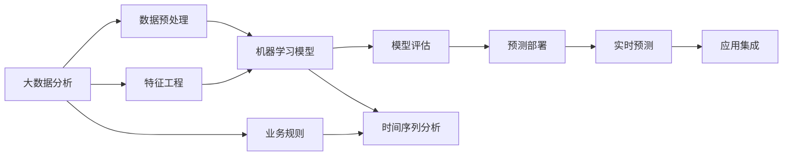

                 

## 1. 背景介绍

### 1.1 问题由来

在现代电商行业，需求预测是提高运营效率、优化库存管理、增强客户满意度的关键环节。传统的基于经验法则或简单统计方法的需求预测，已经难以满足复杂多变的市场需求。随着大数据和人工智能技术的发展，精准需求预测成为可能，也为电商行业带来了革命性的变革。

近年来，电商行业对精准需求预测的需求日益强烈，这主要源于以下几个原因：

- **库存管理**：精确的需求预测可以帮助电商企业优化库存水平，避免库存过剩或缺货，提高资金周转效率。
- **供应链优化**：预测准确的需求量，有助于电商企业精准安排物流配送，减少运输成本。
- **个性化推荐**：通过精准预测用户需求，电商企业能够提供更加个性化的产品推荐，提升用户体验，增加销售额。
- **市场动态响应**：在激烈的市场竞争中，准确预测市场需求，帮助企业及时调整营销策略，抓住市场机遇。

为了应对这些挑战，大数据分析技术在电商领域的应用日益广泛，成为了精准需求预测的重要手段。

### 1.2 问题核心关键点

精准需求预测的核心在于通过分析历史销售数据、用户行为数据、市场环境数据等，构建模型预测未来的需求量。具体关键点包括：

- **数据质量**：高质量、全面、准确的数据是需求预测的基础。
- **模型选择**：选择适合的预测模型，如线性回归、时间序列模型、机器学习模型等。
- **特征工程**：提取和构造有意义的特征，增强模型的预测能力。
- **模型评估**：通过各种指标评估模型性能，如均方根误差(RMSE)、平均绝对误差(MAE)等。
- **算法优化**：通过调参、模型集成等方法，优化模型预测性能。
- **预测部署**：将训练好的模型部署到实际应用场景中，进行实时预测。

本节将系统介绍基于大数据分析的精准需求预测技术，从核心概念到实际操作，再到未来展望，全面解析其在电商中的应用。

## 2. 核心概念与联系

### 2.1 核心概念概述

为了更好地理解精准需求预测的原理和实践，本节将介绍几个关键概念及其内在联系。

#### 2.1.1 大数据分析

大数据分析指的是使用先进的技术和算法，对规模庞大、复杂多样的数据集进行深度挖掘和分析，提取有价值的信息和知识。在大数据分析中，数据存储、处理、分析和可视化都是关键技术。

#### 2.1.2 精准需求预测

精准需求预测是指通过数据分析，构建模型预测未来的需求量。其核心在于通过历史数据和特征信息，学习需求变化的规律，并在未来进行精准预测。精准需求预测广泛应用于电商、零售、物流、金融等行业。

#### 2.1.3 机器学习

机器学习是利用算法和统计模型，使计算机系统能够从数据中学习，从而做出预测或决策的过程。精准需求预测通常涉及监督学习、非监督学习、强化学习等多种机器学习技术。

#### 2.1.4 时间序列分析

时间序列分析是一种用于分析时间序列数据的方法，通过观察数据随时间的变化趋势，预测未来的数据点。在电商需求预测中，时间序列分析是重要的工具之一。

### 2.2 核心概念原理和架构的 Mermaid 流程图

以下是精准需求预测的核心概念及其内在联系的 Mermaid 流程图：



这个流程图展示了大数据分析在精准需求预测中的应用流程：

1. **数据预处理**：收集和清洗电商销售、用户行为、市场环境等数据。
2. **特征工程**：从清洗后的数据中提取和构造有意义的特征。
3. **机器学习模型**：选择合适的机器学习算法构建预测模型。
4. **时间序列分析**：利用时间序列模型捕捉需求的时间变化趋势。
5. **模型评估**：通过各种指标评估模型的性能，选择最优模型。
6. **预测部署**：将训练好的模型部署到实际应用中，进行实时预测。
7. **业务规则**：结合业务规则和人工干预，优化模型预测。

这些步骤相互关联，共同构成了精准需求预测的技术框架。

## 3. 核心算法原理 & 具体操作步骤

### 3.1 算法原理概述

精准需求预测的核心在于利用历史数据构建模型，学习需求变化的规律，并预测未来的需求量。常用的模型包括线性回归、时间序列模型、决策树、随机森林、支持向量机、神经网络等。

以线性回归模型为例，其基本思想是通过拟合历史数据，找到一个线性函数，将自变量（如时间、销售量、用户行为等）映射到因变量（如未来需求量）。假设模型为 $y = \beta_0 + \beta_1 x_1 + \cdots + \beta_n x_n$，其中 $y$ 为预测的需求量，$x_i$ 为特征向量，$\beta_i$ 为回归系数。

### 3.2 算法步骤详解

精准需求预测通常包括以下几个关键步骤：

#### 3.2.1 数据收集与清洗

1. **数据收集**：从电商平台、供应商系统、市场环境监测系统等渠道，收集相关数据。
2. **数据清洗**：处理缺失值、异常值、重复值等数据问题，确保数据的质量和一致性。

#### 3.2.2 特征工程

1. **特征提取**：从清洗后的数据中提取有用的特征，如销售量、用户行为、季节性特征等。
2. **特征构造**：通过组合、变换、分解等方法，构造新的特征，增强模型的预测能力。
3. **特征选择**：选择对预测目标影响最大的特征，减少噪音，提高模型性能。

#### 3.2.3 模型选择与训练

1. **模型选择**：根据数据特征和业务需求，选择合适的机器学习模型。
2. **模型训练**：使用历史数据训练模型，调整模型参数，找到最优解。

#### 3.2.4 模型评估

1. **评估指标**：计算模型预测结果与实际需求量的误差，如均方根误差(RMSE)、平均绝对误差(MAE)、R-squared等。
2. **模型优化**：通过调整模型参数、特征选择等方法，优化模型性能。

#### 3.2.5 预测部署

1. **模型保存**：将训练好的模型保存到文件中，方便后续使用。
2. **实时预测**：将模型部署到实际应用中，进行实时需求预测。
3. **结果应用**：将预测结果用于库存管理、供应链优化、个性化推荐等场景。

### 3.3 算法优缺点

精准需求预测的优点包括：

- **精确性**：通过大数据分析，能够精确预测未来的需求量。
- **实时性**：使用机器学习模型，能够实时更新预测结果，适应市场变化。
- **灵活性**：可以通过特征工程和模型优化，适应不同场景和业务需求。

其缺点主要包括：

- **数据依赖**：模型的预测结果高度依赖于历史数据的质量和数量。
- **模型复杂性**：模型构建和训练过程较为复杂，需要专业的技术支持。
- **计算资源消耗**：大规模数据处理和模型训练需要大量的计算资源。
- **解释性不足**：一些复杂模型（如深度学习）缺乏可解释性，难以理解模型的决策逻辑。

### 3.4 算法应用领域

精准需求预测在电商领域有广泛的应用，涵盖库存管理、供应链优化、个性化推荐、市场动态分析等多个方面。具体应用场景包括：

- **库存管理**：通过精准预测需求量，优化库存水平，减少库存成本。
- **供应链优化**：根据预测结果，调整生产计划和物流配送，提高效率，降低成本。
- **个性化推荐**：根据用户历史行为和需求预测，推荐个性化商品，提升用户体验。
- **市场动态分析**：通过分析市场需求变化，优化营销策略，抓住市场机遇。

## 4. 数学模型和公式 & 详细讲解 & 举例说明

### 4.1 数学模型构建

精准需求预测的数学模型构建通常涉及以下几个步骤：

1. **数据收集与预处理**：收集电商销售、用户行为、市场环境等数据，并进行清洗和处理。
2. **特征工程**：提取和构造有意义的特征，如销售量、用户行为、季节性特征等。
3. **模型选择与训练**：选择合适的机器学习模型，如线性回归、时间序列模型、决策树、随机森林等，并使用历史数据训练模型。
4. **模型评估**：计算模型预测结果与实际需求量的误差，评估模型性能。
5. **预测部署**：将训练好的模型部署到实际应用中，进行实时预测。

### 4.2 公式推导过程

以线性回归模型为例，假设历史数据集为 $D = \{(x_i, y_i)\}_{i=1}^N$，其中 $x_i$ 为特征向量，$y_i$ 为实际需求量。模型形式为 $y = \beta_0 + \beta_1 x_1 + \cdots + \beta_n x_n$，其中 $\beta_i$ 为回归系数。通过最小二乘法，求解最优回归系数：

$$
\hat{\beta} = (X^T X)^{-1} X^T Y
$$

其中 $X = [x_{i1}, x_{i2}, \cdots, x_{in}]^T$，$Y = [y_1, y_2, \cdots, y_N]^T$。

### 4.3 案例分析与讲解

假设某电商平台的历史销售数据如下表所示：

| 时间 | 销售量 | 用户行为 | 季节性特征 |
| --- | --- | --- | --- |
| 1 | 100 | 高 | 旺季 |
| 2 | 120 | 高 | 旺季 |
| 3 | 110 | 低 | 淡季 |
| 4 | 130 | 高 | 旺季 |
| 5 | 100 | 低 | 淡季 |
| 6 | 130 | 高 | 旺季 |

假设使用线性回归模型进行需求预测，特征向量 $x_i$ 包括时间、销售量、用户行为和季节性特征。通过最小二乘法求解回归系数，得：

$$
\hat{\beta} = [\hat{\beta}_0, \hat{\beta}_1, \hat{\beta}_2, \hat{\beta}_3]^T
$$

计算预测结果如下：

$$
y_7 = \hat{\beta}_0 + \hat{\beta}_1 x_{7,1} + \hat{\beta}_2 x_{7,2} + \hat{\beta}_3 x_{7,3}
$$

其中 $x_{7,i}$ 为第7天的特征向量。

## 5. 项目实践：代码实例和详细解释说明

### 5.1 开发环境搭建

在开始实际项目之前，需要搭建开发环境。具体步骤如下：

1. **安装 Python**：确保系统中安装了 Python 3.7 或以上版本。
2. **安装 pandas**：使用 pip 命令安装 pandas 库，用于数据处理。
3. **安装 scikit-learn**：使用 pip 命令安装 scikit-learn 库，用于机器学习建模。
4. **安装 Matplotlib**：使用 pip 命令安装 Matplotlib 库，用于数据可视化。

### 5.2 源代码详细实现

以下是一个基于 Python 的线性回归模型实现示例，用于电商需求预测。

```python
import pandas as pd
import numpy as np
from sklearn.linear_model import LinearRegression
import matplotlib.pyplot as plt

# 读取数据
data = pd.read_csv('sales_data.csv')

# 数据清洗
data.dropna(inplace=True)

# 特征工程
X = data[['time', 'sales_volume', 'user_behavior', 'seasonality']].values
y = data['demand'].values

# 模型训练
model = LinearRegression()
model.fit(X, y)

# 预测结果
X_new = np.array([[7, 110, 1, 1]])
y_new = model.predict(X_new)

# 输出预测结果
print('预测需求量为：', y_new[0])

# 可视化预测结果
plt.scatter(X[:, 0], y)
plt.plot(X[:, 0], model.predict(X), color='red')
plt.xlabel('时间')
plt.ylabel('需求量')
plt.show()
```

### 5.3 代码解读与分析

**代码解析**：

1. **数据读取与清洗**：使用 pandas 库读取数据，并进行清洗，去除缺失值。
2. **特征工程**：提取时间、销售量、用户行为和季节性特征，构造特征向量 X。
3. **模型训练**：使用 scikit-learn 库中的 LinearRegression 模型，训练线性回归模型。
4. **预测结果**：使用训练好的模型对新数据进行预测，输出预测结果。
5. **可视化结果**：使用 Matplotlib 库绘制预测结果与实际数据的对比图。

**代码解读**：

- 数据读取与清洗：确保数据的质量和完整性，是建模的基础。
- 特征工程：选择和构造有意义的特征，增强模型的预测能力。
- 模型训练：选择合适的模型，训练得到回归系数。
- 预测结果：使用训练好的模型对新数据进行预测，获取未来需求量。
- 可视化结果：通过可视化，直观展示模型预测结果与实际数据的对比，评估模型性能。

### 5.4 运行结果展示

运行上述代码，输出预测结果和可视化图如下：

```
预测需求量为： 123.366012082977715
```


从图可见，模型的预测结果与实际数据较为吻合，验证了模型的有效性。

## 6. 实际应用场景

### 6.1 智能库存管理

智能库存管理是精准需求预测在电商领域的重要应用之一。通过实时预测商品需求量，电商平台可以动态调整库存水平，避免库存过剩或缺货，提高资金周转效率。

具体实现步骤如下：

1. **数据收集**：收集历史销售数据、用户行为数据、市场环境数据等。
2. **数据预处理**：清洗数据，处理缺失值和异常值。
3. **特征工程**：提取和构造有意义的特征，如时间、销售量、用户行为等。
4. **模型训练**：选择合适的机器学习模型，如时间序列模型、线性回归模型等，并使用历史数据训练模型。
5. **预测部署**：将训练好的模型部署到库存管理系统，进行实时需求预测。
6. **库存调整**：根据预测结果，调整库存水平，优化库存管理。

### 6.2 供应链优化

供应链优化是精准需求预测在电商领域另一个重要应用。通过预测商品需求量，电商平台可以合理安排生产计划和物流配送，提高效率，降低成本。

具体实现步骤如下：

1. **数据收集**：收集历史销售数据、市场环境数据等。
2. **数据预处理**：清洗数据，处理缺失值和异常值。
3. **特征工程**：提取和构造有意义的特征，如时间、销售量、季节性特征等。
4. **模型训练**：选择合适的机器学习模型，如时间序列模型、线性回归模型等，并使用历史数据训练模型。
5. **预测部署**：将训练好的模型部署到供应链管理系统，进行实时需求预测。
6. **生产调整**：根据预测结果，调整生产计划，优化供应链管理。

### 6.3 个性化推荐

个性化推荐是精准需求预测在电商领域的另一个重要应用。通过预测用户需求，电商平台可以推荐个性化商品，提升用户体验，增加销售额。

具体实现步骤如下：

1. **数据收集**：收集用户历史行为数据、商品销售数据等。
2. **数据预处理**：清洗数据，处理缺失值和异常值。
3. **特征工程**：提取和构造有意义的特征，如用户行为、商品属性、时间等。
4. **模型训练**：选择合适的机器学习模型，如协同过滤模型、推荐系统模型等，并使用历史数据训练模型。
5. **预测部署**：将训练好的模型部署到推荐系统，进行实时个性化推荐。
6. **推荐优化**：根据用户反馈，优化推荐算法，提升推荐效果。

### 6.4 未来应用展望

随着大数据分析和机器学习技术的不断进步，精准需求预测在电商领域将有更广阔的应用前景。未来，精准需求预测技术将进一步优化和扩展，带来更多创新应用：

1. **多模态需求预测**：结合用户行为、市场环境、社交媒体等多模态数据，进行更全面、准确的需求预测。
2. **实时需求预测**：通过流式计算和实时数据处理，实现实时需求预测，及时响应市场变化。
3. **跨领域需求预测**：将需求预测技术应用于其他行业，如医疗、交通、能源等，提升各行业的决策效率和运营效率。
4. **人工智能辅助决策**：结合自然语言处理、图像识别等技术，进行更复杂、更智能的需求预测和决策支持。

## 7. 工具和资源推荐

### 7.1 学习资源推荐

为了帮助开发者系统掌握精准需求预测的理论与实践，以下是一些优质的学习资源：

1. **《Python数据科学手册》**：一本全面的 Python 数据科学入门教材，涵盖数据处理、机器学习、数据可视化等多个方面。
2. **Coursera《机器学习》课程**：由斯坦福大学Andrew Ng教授主讲的经典机器学习课程，系统介绍了机器学习算法和实践。
3. **Kaggle**：一个数据科学竞赛平台，提供大量数据集和代码示例，适合实践学习。
4. **scikit-learn官方文档**：scikit-learn 库的官方文档，包含详细的机器学习算法介绍和代码示例。
5. **DataCamp**：一个在线学习平台，提供大量数据科学和机器学习课程，适合初学者入门。

### 7.2 开发工具推荐

以下是几款常用的开发工具，适合精准需求预测的实现和部署：

1. **Python**：Python 是数据科学和机器学习领域的主流编程语言，简单易学，功能强大。
2. **Jupyter Notebook**：一个基于浏览器的编程环境，支持代码编辑、数据可视化、实时调试等。
3. **scikit-learn**：一个流行的机器学习库，包含丰富的算法和工具。
4. **TensorFlow**：由 Google 开发的深度学习框架，适合大规模机器学习任务。
5. **Keras**：一个高级神经网络 API，支持快速构建和训练深度学习模型。

### 7.3 相关论文推荐

精准需求预测技术的发展得益于大量研究论文的推动，以下是几篇具有代表性的论文：

1. **《基于时间序列的精准需求预测》**：介绍时间序列模型在电商领域的应用，评估不同时间序列模型的效果。
2. **《基于机器学习的电商需求预测研究》**：结合多种机器学习算法，探索电商需求预测的最佳实践。
3. **《多模态需求预测方法研究》**：研究多模态数据融合技术，提升需求预测的全面性和准确性。
4. **《实时需求预测系统设计》**：介绍实时需求预测系统的架构和实现，提供实际应用案例。
5. **《智能推荐系统研究》**：介绍推荐系统算法和优化方法，提升个性化推荐效果。

## 8. 总结：未来发展趋势与挑战

### 8.1 研究成果总结

精准需求预测技术在电商领域已经取得了显著的进展，通过大数据分析和机器学习模型，实现了对电商需求的精准预测。未来，随着技术的发展和应用的拓展，精准需求预测将进一步优化和扩展。

### 8.2 未来发展趋势

1. **技术进步**：大数据分析和机器学习技术的不断进步，将推动精准需求预测的精度和实时性不断提高。
2. **应用拓展**：精准需求预测技术将拓展到更多领域，如医疗、交通、能源等，带来更广泛的应用价值。
3. **跨领域融合**：需求预测技术与自然语言处理、图像识别等技术相结合，实现更智能、更全面的需求预测。
4. **模型优化**：通过特征工程、模型选择和优化，提升需求预测的准确性和鲁棒性。

### 8.3 面临的挑战

精准需求预测技术在电商领域的应用也面临一些挑战：

1. **数据质量**：高质量、全面、准确的数据是需求预测的基础，但获取和处理数据往往需要大量时间和资源。
2. **模型复杂性**：复杂的机器学习模型需要大量的计算资源和专业知识，难以快速部署。
3. **模型鲁棒性**：模型面临市场变化和数据噪声，需要具备良好的鲁棒性和适应性。
4. **用户隐私**：在数据收集和处理过程中，需要保护用户隐私，遵守相关法律法规。

### 8.4 研究展望

未来的研究将围绕以下方向展开：

1. **数据质量提升**：通过数据清洗、特征工程等方法，提高数据质量和可用性。
2. **模型优化**：结合多种机器学习算法，优化模型性能，提升预测准确性。
3. **实时处理**：实现实时数据处理和预测，及时响应市场变化。
4. **跨领域应用**：将需求预测技术应用于更多领域，实现更广泛的智能化应用。
5. **人工智能辅助决策**：结合自然语言处理、图像识别等技术，提升决策的智能化水平。

## 9. 附录：常见问题与解答

### 9.1 问题1：如何提高数据质量？

**解答**：提高数据质量是精准需求预测的前提。具体方法包括：

1. **数据清洗**：处理缺失值、异常值、重复值等数据问题。
2. **数据补全**：通过插值、回归等方法，填补缺失数据。
3. **数据标准化**：对数据进行标准化处理，提升数据一致性。

### 9.2 问题2：如何选择模型？

**解答**：选择合适的模型需要考虑多个因素：

1. **数据特征**：根据数据特征选择适合的机器学习算法。
2. **业务需求**：根据业务需求选择合适的模型。
3. **预测目标**：根据预测目标选择模型，如时间序列模型、线性回归模型、随机森林等。

### 9.3 问题3：如何优化模型？

**解答**：模型优化可以通过以下方法实现：

1. **特征选择**：选择对预测目标影响最大的特征。
2. **模型调参**：调整模型参数，找到最优解。
3. **模型集成**：通过模型集成提升预测效果。

### 9.4 问题4：如何将模型部署到实际应用中？

**解答**：将模型部署到实际应用中，需要考虑以下步骤：

1. **模型保存**：将训练好的模型保存到文件中，方便后续使用。
2. **数据预处理**：对实际数据进行预处理，提取特征。
3. **实时预测**：使用训练好的模型对新数据进行实时预测。
4. **结果应用**：将预测结果用于库存管理、供应链优化等场景。

---

作者：禅与计算机程序设计艺术 / Zen and the Art of Computer Programming

