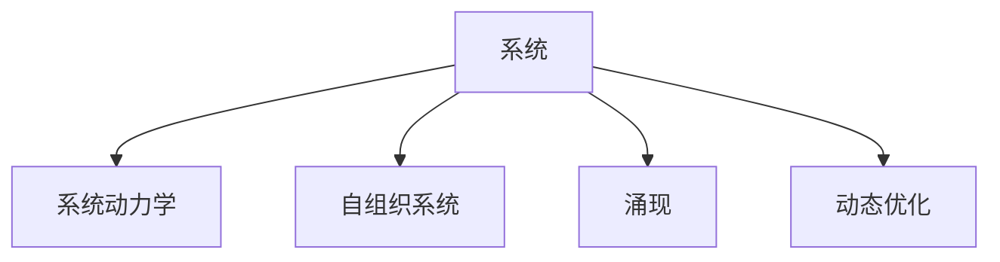

                 

# 系统思维:管理者驾驭复杂局面的能力

> 关键词：系统思维,复杂性管理,决策科学,数据驱动,自组织系统,动态优化

## 1. 背景介绍

### 1.1 问题由来
在当今快速变化的商业环境中，企业面临的挑战日益复杂和多样。如何有效管理这些复杂性，成为现代管理者的重要课题。系统思维作为一种跨学科的管理方法论，提供了强大的理论框架和实践工具，帮助管理者在复杂局面中理清头绪，实现决策的科学化和优化。

### 1.2 问题核心关键点
系统思维（Systems Thinking）是一种跨学科的方法论，强调从整体上理解和分析系统，而非仅关注局部。它涉及多个关键点：
- **整体性**：系统是由相互关联的元素构成的一个整体，其行为和结果受整体结构和动力学影响。
- **动态性**：系统是不断变化和发展的，需要根据实际情况进行调整和优化。
- **互联性**：系统中的各个元素相互影响，任何改变都会产生连带效应。
- **层次性**：系统具有不同层次的结构和功能，需要从不同层面进行分析和优化。
- **反馈**：系统具有自我调整和自我维持的能力，通过反馈机制实现动态平衡。

这些关键点构成了系统思维的理论基础，帮助管理者更好地理解和应对复杂系统。

## 2. 核心概念与联系

### 2.1 核心概念概述

为更好地理解系统思维，本节将介绍几个密切相关的核心概念：

- **系统（System）**：由多个相互作用和相互依赖的组成部分组成，形成一个有机的整体。系统思维的目的是从整体视角理解系统的动态变化和行为模式。
- **系统动力学（System Dynamics）**：研究系统的动态变化规律和反馈机制，通过建模分析系统的行为趋势。
- **自组织系统（Self-organizing System）**：系统内部各部分能够通过相互交互自发地形成有序结构，无需外部干预。
- **涌现（Emergence）**：系统通过各部分间的协同作用，生成无法从部分直接推断出的整体性质和行为。
- **动态优化（Dynamic Optimization）**：在变化的环境下，通过调整系统参数和策略，实现系统性能的最大化。

这些核心概念之间的逻辑关系可以通过以下Mermaid流程图来展示：



这个流程图展示了一些关键概念及其之间的关系：

1. 系统是所有概念的基础，其他概念都从系统这一整体出发。
2. 系统动力学研究系统的动态行为，是理解系统行为的重要工具。
3. 自组织系统揭示了系统内部各部分通过相互交互形成有序结构的机制。
4. 涌现描述了系统通过协同作用生成的整体性质和行为。
5. 动态优化旨在通过调整系统参数实现性能最大化。

这些概念共同构成了系统思维的理论框架，帮助管理者从整体视角理解和应对复杂系统。

## 3. 核心算法原理 & 具体操作步骤
### 3.1 算法原理概述

系统思维的核心理念是通过对系统的整体性、动态性和互联性进行建模和分析，从而实现系统的优化和控制。具体而言，系统思维涉及以下几个关键步骤：

1. **系统建模**：通过收集数据和定义变量，构建系统的数学模型。
2. **行为分析**：使用系统动力学工具，分析模型的行为趋势和稳态解。
3. **动态仿真**：通过仿真实验，测试模型在不同参数下的行为变化，进行敏感性分析。
4. **优化控制**：根据仿真结果，调整系统参数，实现性能优化。

### 3.2 算法步骤详解

以下是一个简化的系统思维操作步骤：

**Step 1: 系统建模**
- 定义系统的边界和组成部分。
- 列出关键变量和参数，并定义它们的数学关系。
- 使用系统动力学工具（如SysVue、Vensim等）构建系统的动态模型。

**Step 2: 行为分析**
- 对模型进行稳态分析，找出系统平衡状态。
- 分析系统在不同参数下的行为变化，如灵敏度分析。
- 使用仿真工具（如Matlab、Python等）模拟系统行为，输出仿真结果。

**Step 3: 动态仿真**
- 设置不同的参数组合，进行敏感性测试。
- 分析模型在不同参数变化下的响应，观察系统的稳定性和涌现行为。
- 优化系统参数，实现性能提升。

**Step 4: 优化控制**
- 根据仿真结果，调整系统参数，测试优化效果。
- 进行实际测试，验证优化措施的有效性。
- 持续监控系统状态，适时调整策略。

### 3.3 算法优缺点

系统思维作为一种管理方法，具有以下优点：
1. 提供全局视角：系统思维强调整体性和互联性，帮助管理者全面理解复杂系统的动态行为。
2. 可量化分析：通过数学建模和仿真，可以量化分析和预测系统行为，提供决策依据。
3. 动态优化：强调动态性，能够在变化的环境中持续优化系统性能。
4. 自适应性：通过反馈机制和自组织特性，系统能够自我调整和适应外部环境变化。

同时，该方法也存在一定的局限性：
1. 模型复杂度：构建复杂系统的数学模型需要丰富的领域知识和建模经验，难度较大。
2. 数据依赖：系统思维高度依赖数据质量，数据不准确或遗漏会影响分析结果。
3. 计算成本：模型仿真和优化过程可能需要大量计算资源，对于大规模系统尤为明显。
4. 非线性特性：系统行为可能存在非线性特性，难以通过线性模型完全描述。

尽管存在这些局限性，但就目前而言，系统思维是处理复杂系统问题的一种重要工具。未来相关研究的方向包括提高模型的易用性、降低计算成本、增强模型的非线性描述能力等。

### 3.4 算法应用领域

系统思维的应用领域非常广泛，涉及多个行业和领域：

- **工业生产管理**：通过系统思维优化生产流程，提升效率和质量。
- **能源与环境管理**：研究能源和环境的动态变化，实现可持续发展。
- **金融风险管理**：分析金融市场的动态变化，评估风险和优化投资策略。
- **城市规划与交通管理**：优化城市资源配置和交通流量，提升城市管理效率。
- **医疗健康管理**：分析疾病传播和公共卫生问题，制定科学合理的应对措施。
- **市场营销与消费者行为**：研究消费者需求变化和市场动态，优化营销策略。

这些领域中，系统思维提供了从整体视角理解系统行为和优化系统性能的强大工具，帮助管理者在复杂局面中作出科学决策。

## 4. 数学模型和公式 & 详细讲解 & 举例说明

### 4.1 数学模型构建

系统思维的数学模型通常包括两个部分：
- **状态方程**：描述系统各变量随时间变化的动态关系。
- **输入方程**：描述系统受到的外部干扰和控制措施。

以下是一个简单的离散系统状态方程示例：

$$
x(t+1) = a*x(t) + b*x(t-1) + c
$$

其中，$x(t)$ 表示系统在时间$t$的变量值，$a$、$b$、$c$ 为系数。

### 4.2 公式推导过程

以一个简单的线性系统为例，进行公式推导过程：

假设系统状态方程为：

$$
x(t+1) = 0.9*x(t) + 0.1*x(t-1) + 0.2
$$

设系统初始条件为$x(0) = 1$和$x(1) = 0$，则有：

$$
x(2) = 0.9*x(1) + 0.1*x(0) + 0.2 = 0.9*0 + 0.1*1 + 0.2 = 0.3
$$

$$
x(3) = 0.9*x(2) + 0.1*x(1) + 0.2 = 0.9*0.3 + 0.1*0 + 0.2 = 0.37
$$

通过递推计算，可以发现系统的稳态值为$x_s = \frac{c}{1-a}$，其中$a$、$b$、$c$为系数。

### 4.3 案例分析与讲解

以下是一个系统思维应用的案例分析：

**案例：交通流量优化**
- **问题描述**：在一个交叉路口，交通流量需要通过红绿灯控制。
- **系统建模**：定义交通流量$F$和红绿灯状态$S$，构建状态方程：
  $$
  F(t+1) = k_1*F(t) + k_2*F(t-1) + k_3*S(t)
  $$
- **行为分析**：通过稳态分析和灵敏度测试，确定最优的红绿灯控制策略。
- **动态仿真**：模拟不同参数组合下的交通流量变化，找出最优的参数设置。
- **优化控制**：根据仿真结果，调整红绿灯控制策略，实现交通流量优化。

通过系统思维的方法，该案例实现了交通流量的动态优化，提升了交叉路口的通行效率和安全性。

## 5. 项目实践：代码实例和详细解释说明
### 5.1 开发环境搭建

在进行系统思维的实践前，我们需要准备好开发环境。以下是使用Python进行SysVue开发的环境配置流程：

1. 安装Anaconda：从官网下载并安装Anaconda，用于创建独立的Python环境。

2. 创建并激活虚拟环境：
```bash
conda create -n sysvue-env python=3.8 
conda activate sysvue-env
```

3. 安装SysVue库：
```bash
conda install sysvue
```

4. 安装各类工具包：
```bash
pip install numpy pandas scikit-learn matplotlib tqdm jupyter notebook ipython
```

完成上述步骤后，即可在`sysvue-env`环境中开始系统思维实践。

### 5.2 源代码详细实现

下面以一个简单的线性系统为例，使用SysVue进行系统建模和行为分析的代码实现。

```python
import sysvue as sv
import matplotlib.pyplot as plt

# 定义系统状态方程
sys = sv.System()
sys.differential_eq = sv.d differential_eq(sys, 'x', 0.9*x + 0.1*x_prev + 0.2)
sys.equation = sv.equation('x', x, 'x')

# 设置初始条件
sys.initial_values = {'x': 1, 'x_prev': 0}

# 运行仿真
tspan = [0, 10]
res = sv.solve(sys, tspan, display='line')

# 输出仿真结果
plt.plot(res['t'], res['y'][:, 0], label='x(t)')
plt.legend()
plt.show()
```

上述代码中，首先通过SysVue定义了一个简单的线性系统，并设置其状态方程和初始条件。然后通过`solve`函数进行仿真，输出时间-变量曲线图。

### 5.3 代码解读与分析

让我们再详细解读一下关键代码的实现细节：

**SysVue类**：
- `differential_eq`方法：定义系统状态方程。
- `equation`方法：定义系统输入方程。
- `initial_values`属性：设置系统的初始条件。

**运行仿真**：
- `tspan`列表：定义仿真时间范围。
- `sv.solve`函数：运行系统仿真，返回时间-变量数据。

**绘图输出**：
- `matplotlib.pyplot`：绘制时间-变量曲线图。

可以看到，SysVue库提供了简单易用的API，可以方便地进行系统建模和行为分析。开发者可以快速构建和仿真各种复杂系统，进行系统的动态优化和控制。

当然，工业级的系统实现还需考虑更多因素，如模型的保存和部署、超参数的自动搜索、更灵活的任务适配层等。但核心的系统思维方法基本与此类似。

## 6. 实际应用场景
### 6.1 智能制造

系统思维在智能制造领域有广泛应用。传统制造系统存在生产效率低下、资源浪费严重等问题。通过系统思维优化制造流程，可以实现资源的高效利用和生产效率的提升。

在实践中，可以构建生产线的数学模型，模拟不同生产参数对生产效率的影响。通过仿真分析和优化控制，确定最优的生产参数组合。实时监控生产过程，根据环境变化及时调整生产策略，实现智能化制造。

### 6.2 医疗健康

在医疗健康领域，系统思维的应用同样重要。通过系统思维分析疾病的传播和公共卫生问题，可以制定科学的防疫和健康管理措施。

以COVID-19为例，通过构建流行病学模型，分析病毒传播的动态行为。通过仿真分析和敏感性测试，找出最优的防控策略。实时监测疫情变化，动态调整防控措施，实现疫情的有效控制。

### 6.3 智能交通

智能交通系统是一个典型的复杂系统，涉及多个子系统和多类交通参与者。通过系统思维优化交通流量和资源配置，可以实现交通系统的整体优化。

在实践中，可以构建交通网络的数学模型，模拟不同交通政策对交通流量的影响。通过仿真分析和优化控制，确定最优的交通政策和资源配置策略。实时监测交通流量，动态调整交通信号，实现交通流量的高效管理。

### 6.4 未来应用展望

随着系统思维理论的不断发展和应用技术的进步，未来的应用场景将更加广阔。

在智慧城市建设中，系统思维将帮助城市管理者优化资源配置，提升城市运行效率和居民生活质量。在能源管理中，系统思维将实现能源的高效利用和可持续发展。在金融风险管理中，系统思维将帮助金融机构制定科学的投资策略和风险防控措施。

总之，系统思维作为一种强大的管理工具，将在更多领域发挥其独特价值，帮助管理者应对复杂局面，实现科学决策和优化控制。

## 7. 工具和资源推荐
### 7.1 学习资源推荐

为了帮助开发者系统掌握系统思维的理论基础和实践技巧，这里推荐一些优质的学习资源：

1. 《系统思维：理论与实践》系列博文：由系统思维专家撰写，深入浅出地介绍了系统思维的理论基础、方法论和应用案例。

2. 《系统动力学基础》课程：麻省理工学院开设的课程，系统讲解系统动力学理论和方法，适合初学者学习。

3. 《系统思维与复杂系统》书籍：深入介绍系统思维的理论和方法，结合大量实际案例进行讲解。

4. 《系统思考的艺术》书籍：介绍系统思考的基本原理和应用技巧，适合实践者参考。

通过对这些资源的学习实践，相信你一定能够快速掌握系统思维的精髓，并用于解决实际的系统问题。

### 7.2 开发工具推荐

高效的开发离不开优秀的工具支持。以下是几款用于系统思维开发的常用工具：

1. SysVue：用于系统动力学模型构建和仿真的开源工具，功能强大且易于使用。

2. Vensim：系统动力学建模和仿真的主流工具，支持复杂模型的建立和分析。

3. Matlab：数学计算和仿真分析的强大工具，支持多种数学模型和仿真技术。

4. Python：广泛使用的编程语言，拥有丰富的科学计算和仿真库，如Sympy、SciPy等。

5. Jupyter Notebook：交互式编程和数据分析平台，支持多种编程语言和科学计算库。

合理利用这些工具，可以显著提升系统思维任务的开发效率，加快创新迭代的步伐。

### 7.3 相关论文推荐

系统思维的发展源于学界的持续研究。以下是几篇奠基性的相关论文，推荐阅读：

1. "The Systems Approach to Problem Solving" by Jay W. Forrester：介绍系统思维的基本原理和应用方法，系统动力学领域的经典著作。

2. "A New Approach to Modelling, Simulating and Understanding Social Economic Systems" by G. Polya：探讨系统思维在社会经济系统中的应用，提出多个实际案例。

3. "System Thinking for Social Change" by Peter Senge：介绍系统思维在组织变革中的应用，提出多个组织变革的成功案例。

4. "Understanding the Dynamics of Complex Adaptive Systems" by Richard M. S locum：探讨复杂适应系统的动态行为，提供系统思维的理论框架和方法。

这些论文代表了大系统思维的研究方向和成果，通过学习这些前沿成果，可以帮助研究者把握学科前进方向，激发更多的创新灵感。

## 8. 总结：未来发展趋势与挑战

### 8.1 总结

本文对系统思维进行了全面系统的介绍。首先阐述了系统思维的理论基础和应用意义，明确了系统思维在复杂系统管理中的独特价值。其次，从原理到实践，详细讲解了系统思维的数学建模和仿真分析过程，给出了系统思维任务开发的完整代码实例。同时，本文还广泛探讨了系统思维在智能制造、医疗健康、智能交通等多个行业领域的应用前景，展示了系统思维的强大应用潜力。此外，本文精选了系统思维学习的资源和工具，力求为读者提供全方位的技术指引。

通过本文的系统梳理，可以看到，系统思维作为一种强大的管理方法，能够帮助管理者在复杂局面中理清头绪，实现科学决策和优化控制。未来，伴随系统思维理论的不断发展和应用技术的进步，系统思维必将在更多领域发挥其独特价值，帮助管理者应对复杂局面，实现科学决策和优化控制。

### 8.2 未来发展趋势

展望未来，系统思维的发展趋势将呈现以下几个方向：

1. 数据驱动：系统思维将更加依赖数据驱动，通过大数据分析和机器学习技术，提升系统的预测能力和决策质量。

2. 自适应性：系统将具备更强的自适应能力，能够自动调整参数和策略，应对环境变化。

3. 跨学科融合：系统思维将与其他学科领域进行更深层次的融合，如人工智能、认知科学等，提供更多元化的分析工具。

4. 实时优化：系统将具备实时优化能力，能够动态调整参数，实现最优的运行效果。

5. 多目标优化：系统将支持多目标优化，能够同时考虑多个性能指标，实现综合的性能提升。

6. 多尺度分析：系统将支持多尺度分析，能够从不同层面进行建模和优化，提升系统的全面性。

以上趋势凸显了系统思维的广阔前景。这些方向的探索发展，必将进一步提升系统思维的应用价值，为系统管理提供更加科学、高效的方法论。

### 8.3 面临的挑战

尽管系统思维在许多领域已经取得了显著成果，但在迈向更加智能化、普适化应用的过程中，它仍面临诸多挑战：

1. 模型复杂度：构建复杂系统的数学模型需要丰富的领域知识和建模经验，难度较大。

2. 数据质量依赖：系统思维高度依赖数据质量，数据不准确或遗漏会影响分析结果。

3. 计算成本：模型仿真和优化过程可能需要大量计算资源，对于大规模系统尤为明显。

4. 非线性特性：系统行为可能存在非线性特性，难以通过线性模型完全描述。

5. 用户接受度：复杂的系统思维方法和技术，需要用户具备一定的理论基础和计算能力，存在一定的使用门槛。

6. 理论更新速度：系统思维的理论和算法需要持续更新，以适应新的应用场景和数据类型。

这些挑战需要学术界和工业界共同努力，积极应对并寻求突破，才能使系统思维在更多领域得到广泛应用。

### 8.4 研究展望

面对系统思维面临的挑战，未来的研究需要在以下几个方面寻求新的突破：

1. 提升模型易用性：开发更加友好、易于使用的建模和仿真工具，降低建模门槛，提高用户的接受度和使用效率。

2. 增强模型灵活性：开发更多元化的建模和仿真技术，支持多学科融合和多目标优化。

3. 降低计算成本：优化计算算法，减少计算资源的消耗，提高系统的实时性。

4. 提高模型鲁棒性：开发更加鲁棒的建模和仿真技术，能够处理非线性特性和复杂系统。

5. 加强理论与实践结合：结合实际应用场景，进行深入的理论和实践研究，提供更具实用性的系统思维方法论。

这些研究方向的探索，必将引领系统思维向更高的台阶发展，为复杂系统管理提供更加科学、高效的方法论。

## 9. 附录：常见问题与解答

**Q1：系统思维和传统思维有什么区别？**

A: 传统思维强调局部和细节，往往以线性思维为主，难以全面理解复杂系统的动态行为。系统思维则从整体视角出发，强调系统的动态性和互联性，能够更好地应对复杂局面。

**Q2：系统思维需要哪些数据？**

A: 系统思维需要收集和分析系统的各项参数和输入数据，构建系统的数学模型。数据质量对系统分析结果具有重要影响，需要保证数据的准确性和全面性。

**Q3：系统思维的建模方法有哪些？**

A: 系统思维的建模方法包括状态方程建模、输入方程建模、稳态分析、灵敏度分析等。这些方法需要根据具体问题和系统类型进行灵活选择和组合。

**Q4：系统思维的仿真分析方法有哪些？**

A: 系统思维的仿真分析方法包括稳态仿真、灵敏度分析、动态仿真、参数优化等。这些方法通过仿真实验和数据统计，分析系统的行为趋势和最优参数设置。

**Q5：系统思维的实际应用案例有哪些？**

A: 系统思维的实际应用案例涵盖多个行业和领域，如智能制造、医疗健康、智能交通、金融风险管理等。每个案例都需要根据具体问题和系统类型，进行系统的建模和优化。

总之，系统思维作为一种强大的管理工具，在复杂系统管理中具有重要应用价值。通过系统思维，管理者可以更好地理解系统行为，实现科学决策和优化控制。

---

作者：禅与计算机程序设计艺术 / Zen and the Art of Computer Programming

