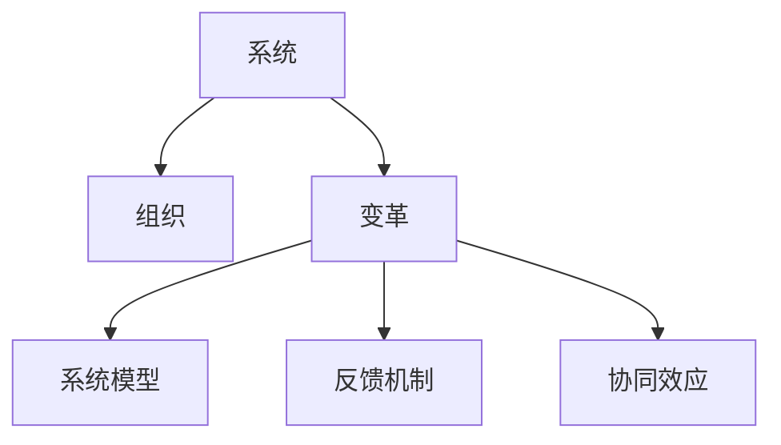

                 

## 1. 背景介绍

### 1.1 问题由来

在当今快速变化的商业环境中，企业面临着前所未有的挑战和机遇。一方面，技术的进步带来了产品和服务的创新，市场竞争日益激烈；另一方面，全球化、数字化和客户需求的多样化要求企业必须具备更强的适应性和响应能力。这些变化不仅要求企业灵活调整策略和产品，还要求其内部组织结构和管理方式进行根本性变革。

在传统组织结构中，层级分明、高度集中的决策体系可能难以应对快速变化的市场需求。而系统思考提供了一种新的视角，帮助企业在复杂多变的商业环境中，通过系统化的分析，构建更具弹性和适应性的组织结构。

### 1.2 问题核心关键点

系统思考（Systems Thinking）是一种基于系统的思想，旨在理解和解决复杂系统中的问题。它强调从整体而非局部的角度看待问题，理解系统各部分之间的相互作用，从而找到解决问题的根本方法。系统思考的核心在于以下几个方面：

1. **整体观念**：系统思考强调整体而非局部，关注系统各部分之间的相互关系和作用。
2. **动态视角**：理解系统的动态变化，识别系统演变的关键因素。
3. **反馈循环**：认识系统中的反馈机制，理解系统行为的变化规律。
4. **跨层级分析**：系统思考跨越不同层级，关注系统各组成部分之间的联系。
5. **建模和模拟**：利用系统模型和模拟技术，分析系统的行为和结构。

这些关键点共同构成了系统思考的理论基础，帮助企业在组织变革中识别问题、寻找解决方案，最终实现战略目标。

### 1.3 问题研究意义

系统思考在组织变革中的应用具有重要意义：

1. **提升组织适应性**：系统思考帮助企业识别系统中的关键因素和反馈循环，提升对变化的响应能力。
2. **优化资源配置**：通过系统思考，企业可以更好地理解资源在各层级和部门之间的流动和利用，优化资源配置。
3. **增强协同效应**：系统思考强调不同部门和层级之间的协同合作，提高整体效率。
4. **促进持续改进**：系统思考强调不断反馈和调整，帮助企业实现持续改进。
5. **构建学习型组织**：系统思考鼓励企业和员工持续学习和适应，构建学习型组织文化。

在数字化和信息化的今天，系统思考为组织变革提供了科学的方法论支持，帮助企业在复杂多变的环境中实现战略目标，提升竞争力和创新能力。

## 2. 核心概念与联系

### 2.1 核心概念概述

为了更好地理解系统思考在组织变革中的应用，本节将介绍几个密切相关的核心概念：

1. **系统（System）**：指由相互作用、相互依赖的多个部分组成的一个整体。系统思考关注系统的整体行为和各部分之间的关系。
2. **组织（Organization）**：指为了实现特定目标而组成的组织结构，具有层级性、分工协作的特点。
3. **变革（Change）**：指组织结构和运作方式的根本性调整和改进，旨在适应外部环境的变化。
4. **系统模型（System Model）**：通过系统模型，可以模拟和分析系统的行为和结构，帮助识别关键因素和反馈循环。
5. **反馈机制（Feedback Mechanism）**：指系统内部各部分之间的相互作用和信息交换，是系统动态变化的基础。
6. **协同效应（Synergy）**：指不同部分之间的相互作用大于各自单独作用的和，提升系统整体效率。

这些核心概念之间的逻辑关系可以通过以下Mermaid流程图来展示：



这个流程图展示了大系统中的关键概念及其之间的关系：

1. 系统由多个部分组成，通过组织结构实现分工协作。
2. 组织在实现战略目标过程中进行变革，以适应外部环境变化。
3. 系统模型帮助识别关键因素和反馈循环，指导变革方向。
4. 反馈机制维持系统的动态平衡，影响系统行为。
5. 协同效应增强系统整体效率，提升变革效果。

这些概念共同构成了系统思考的理论框架，为组织变革提供了系统化的分析方法和工具。

## 3. 核心算法原理 & 具体操作步骤

### 3.1 算法原理概述

系统思考在组织变革中的应用，基于系统动力学（System Dynamics）的理论和方法。系统动力学强调通过构建系统模型，理解系统的行为和结构，从而指导组织变革。

核心算法原理包括以下几个方面：

1. **系统建模**：通过系统模型，理解系统的行为和结构，识别关键因素和反馈循环。
2. **仿真分析**：利用系统模型进行仿真分析，预测系统行为的变化趋势。
3. **优化调整**：通过仿真分析的结果，调整组织结构和运作方式，实现战略目标。

具体步骤如下：

1. **收集数据**：收集组织内部的各种数据，包括财务数据、运营数据、员工数据等。
2. **构建模型**：根据收集到的数据，构建系统的动态模型，识别关键因素和反馈循环。
3. **仿真分析**：利用构建的系统模型进行仿真分析，理解系统行为的变化规律。
4. **调整优化**：根据仿真分析的结果，对组织结构和运作方式进行调整和优化，实现战略目标。
5. **持续改进**：通过不断的反馈和调整，实现组织的持续改进和优化。

### 3.2 算法步骤详解

系统思考在组织变革中的应用，主要包括以下几个关键步骤：

**Step 1: 数据收集与分析**

- 收集组织内部的各种数据，包括财务报表、运营数据、员工满意度调查等。
- 对收集到的数据进行分析，理解组织的关键问题和痛点。

**Step 2: 系统建模**

- 根据数据分析的结果，构建系统的动态模型。可以使用Visio、Simulink等工具构建模型。
- 识别模型中的关键因素和反馈循环，理解系统的动态行为。

**Step 3: 仿真分析**

- 利用构建的系统模型进行仿真分析，预测系统的行为变化。
- 分析不同策略对系统行为的影响，评估其效果和可行性。

**Step 4: 优化调整**

- 根据仿真分析的结果，对组织结构和运作方式进行优化和调整。
- 调整后的策略需要验证其效果，并在实际中应用。

**Step 5: 持续改进**

- 建立持续改进的机制，定期收集反馈和数据，调整优化策略。
- 利用仿真分析工具，持续监测和优化系统的行为和结构。

### 3.3 算法优缺点

系统思考在组织变革中的应用具有以下优点：

1. **全面性**：系统思考关注系统的整体行为和各部分之间的相互作用，能够全面分析组织问题。
2. **动态性**：系统思考强调系统的动态变化，识别关键因素和反馈循环，提升对变化的响应能力。
3. **指导性**：系统建模和仿真分析提供了科学的方法论支持，帮助企业制定合理的战略和决策。
4. **可操作性**：通过持续改进机制，系统思考能够指导组织在实际中实现变革目标。

同时，系统思考也存在一些局限性：

1. **复杂性**：系统模型构建和仿真分析相对复杂，需要较高的专业知识和技能。
2. **数据依赖**：系统思考对数据的质量和完整性要求较高，数据收集和分析过程可能较繁琐。
3. **模型简化**：系统模型对实际系统进行简化和抽象，可能无法完全反映真实情况。
4. **实施难度**：系统思考在实际中的应用需要多部门的协同合作，实施难度较大。

尽管存在这些局限性，但系统思考为组织变革提供了一种科学的方法论支持，有助于企业更好地应对复杂多变的环境，实现战略目标。

### 3.4 算法应用领域

系统思考在组织变革中的应用，广泛适用于各种类型的企业。以下是几个典型的应用场景：

1. **企业战略制定**：通过系统思考，企业可以全面分析内外部环境，制定合理的战略目标和实施路径。
2. **运营效率提升**：系统思考帮助企业识别和优化运营过程中的瓶颈和问题，提升整体效率。
3. **组织结构调整**：系统思考分析组织各部分之间的相互作用和反馈循环，指导调整组织结构。
4. **人才培养与开发**：通过系统思考，企业可以更好地理解员工的需求和发展路径，进行有效的人才培养和开发。
5. **供应链管理优化**：系统思考分析供应链中的关键因素和反馈循环，优化供应链管理和运营。
6. **数字化转型**：系统思考分析数字化转型中的关键问题和挑战，制定合理的数字化战略和实施方案。

系统思考在组织变革中的应用，具有广泛的应用前景，为企业的创新和转型提供了有力的支持。

## 4. 数学模型和公式 & 详细讲解 & 举例说明

### 4.1 数学模型构建

系统思考在组织变革中的应用，主要通过系统动力学模型进行建模和分析。系统动力学模型通常包括以下几部分：

1. **存量模型**：描述系统中的关键存量，包括资源、库存、人员等。
2. **流量模型**：描述系统中的关键流量，包括收入、支出、流动等。
3. **反馈机制**：描述系统中的关键反馈循环，如生产率、成本、收入等。
4. **控制点**：描述系统中的关键控制点，如预算、目标、策略等。

数学模型构建主要包括以下几个步骤：

1. **定义变量**：定义系统中的关键变量，包括存量和流量。
2. **建立方程**：根据系统中的行为和结构，建立数学方程。
3. **仿真模拟**：利用构建的模型进行仿真模拟，理解系统的行为变化。

### 4.2 公式推导过程

以下我们以企业战略制定为例，推导系统动力学模型的核心方程。

假设企业关键变量为：

- $R$：资源存量
- $P$：产品销售价格
- $C$：成本
- $D$：需求

根据企业的行为和结构，建立如下系统动力学模型：

$$
\frac{dR}{dt} = R_0 - \frac{R}{T} + (P-D)\times K
$$

其中：

- $R_0$：资源初始存量
- $T$：资源消耗率
- $K$：资源转换率

**解析推导**：

1. **资源消耗**：资源存量$R$的消耗为$R/T$。
2. **资源产生**：资源存量$R$的增加为$R_0$。
3. **资源转换**：资源存量$R$转化为产品存量，比例为$K$。
4. **产品销售**：产品销售价格$P$与需求$D$的乘积，比例为$K$。

通过上述方程，可以理解企业资源的动态变化和产品销售情况，从而指导战略制定。

### 4.3 案例分析与讲解

**案例1: 供应链管理优化**

某制造企业希望通过系统思考优化其供应链管理。根据收集到的数据，建立如下系统动力学模型：

1. **存量模型**：
   - $I$：原材料库存
   - $W$：工人数量
   - $F$：订单数量

2. **流量模型**：
   - $r$：原材料流入率
   - $c$：原材料消耗率
   - $w$：工人生产率
   - $o$：订单生产率
   - $d$：订单出库率

3. **反馈机制**：
   - $f_1$：原材料库存水平影响原材料流入率
   - $f_2$：工人数量影响工人生产率
   - $f_3$：订单数量影响订单生产率
   - $f_4$：订单生产率影响订单出库率

**模型方程**：

$$
\frac{dI}{dt} = r - c \times w
$$

$$
\frac{dW}{dt} = 0 - \frac{W}{T}
$$

$$
\frac{dF}{dt} = o - d \times F
$$

通过仿真分析，发现原材料库存水平、工人生产率、订单生产率是影响供应链效率的关键因素。优化策略包括：

- **调整原材料库存水平**：通过调整原材料库存，减少库存成本，提高供应链效率。
- **提升工人生产率**：通过培训和激励，提升工人生产率，降低生产成本。
- **优化订单生产率**：通过优化生产流程，提高订单生产率，减少等待时间。

通过这些优化措施，企业能够显著提升供应链管理效率，降低运营成本。

**案例2: 企业战略制定**

某科技公司希望通过系统思考制定企业战略。根据收集到的数据，建立如下系统动力学模型：

1. **存量模型**：
   - $C$：研发投入
   - $M$：市场投入
   - $I$：产品创新

2. **流量模型**：
   - $c$：研发投入速率
   - $m$：市场投入速率
   - $i$：产品创新速率

3. **反馈机制**：
   - $f_1$：研发投入影响产品创新
   - $f_2$：市场投入影响市场占有率
   - $f_3$：产品创新影响市场占有率

**模型方程**：

$$
\frac{dC}{dt} = c
$$

$$
\frac{dM}{dt} = m
$$

$$
\frac{dI}{dt} = i \times (1 - r) - f_3 \times I
$$

其中，$r$为产品创新到市场化的速率。

通过仿真分析，发现研发投入、市场投入、产品创新是影响企业战略的关键因素。优化策略包括：

- **增加研发投入**：通过增加研发投入，提高产品创新能力，保持技术领先。
- **优化市场投入**：通过优化市场投入，提升市场占有率，增加市场份额。
- **加速产品创新**：通过加速产品创新，缩短产品上市时间，提高市场响应速度。

通过这些优化措施，企业能够制定出更加科学合理的战略，提升竞争力。

## 5. 项目实践：代码实例和详细解释说明

### 5.1 开发环境搭建

在进行系统思考的应用实践前，我们需要准备好开发环境。以下是使用Python进行Simulink开发的环境配置流程：

1. 安装Simulink：从MATLAB官网下载并安装Simulink，适用于Windows、Linux等操作系统。
2. 创建并激活虚拟环境：
```bash
conda create -n simulink-env python=3.8 
conda activate simulink-env
```

3. 安装相关库：
```bash
pip install numpy pandas matplotlib simpy scipy
```

4. 安装Simulink接口库：
```bash
pip install simpy-simulink
```

完成上述步骤后，即可在`simulink-env`环境中开始系统思考的应用实践。

### 5.2 源代码详细实现

这里我们以供应链管理优化为例，使用Python和Simulink进行系统思考的应用实践。

首先，定义系统的存量和流量变量：

```python
import simpy
from simpy import simpy as sp

# 定义系统变量
env = sp.Environment()
I = env.Const(0)  # 原材料库存
W = env.Const(0)  # 工人数量
F = env.Const(0)  # 订单数量

# 定义系统参数
T = 1  # 工人消耗率
r = 2  # 原材料流入率
c = 0.5  # 原材料消耗率
w = 0.5  # 工人生产率
o = 1  # 订单生产率
d = 0.5  # 订单出库率

# 定义系统方程
dI = r - c * w
dW = 0 - T
dF = o - d * F
```

然后，在Simulink中构建模型，并定义仿真参数：

```python
# 在Simulink中构建模型
env.process(() -> sp.rv随着时间的推移，求解系统方程)

# 定义仿真参数
t_final = 1000  # 仿真时间
n_sample = 10000  # 采样数量
```

接着，进行系统仿真和结果分析：

```python
# 进行系统仿真
result = env.run(t_final)

# 输出仿真结果
print(result)
```

最后，对仿真结果进行分析：

```python
# 分析仿真结果
for var in [I, W, F]:
    print(f"{var}的仿真结果为：{result[var]}")
```

### 5.3 代码解读与分析

让我们再详细解读一下关键代码的实现细节：

**系统变量定义**：
- `env`：定义Simulink环境。
- `I`、`W`、`F`：定义系统中的存量变量，分别表示原材料库存、工人数量和订单数量。

**系统参数定义**：
- `T`、`r`、`c`、`w`、`o`、`d`：定义系统中的流量参数，分别表示工人消耗率、原材料流入率、原材料消耗率、工人生产率、订单生产率和订单出库率。

**系统方程定义**：
- `dI`、`dW`、`dF`：定义系统的方程，表示原材料库存、工人数量和订单数量的动态变化。

**仿真参数定义**：
- `t_final`：定义仿真时间。
- `n_sample`：定义采样数量。

**系统仿真执行**：
- `env.run(t_final)`：进行系统仿真。
- `result`：获取仿真结果。

**仿真结果分析**：
- 遍历系统变量，输出仿真结果。

通过上述代码，我们可以看到，使用Python和Simulink进行系统思考的应用实践，不仅简化了系统建模和仿真分析的过程，还提供了丰富的可视化工具，帮助理解和分析系统行为。

## 6. 实际应用场景

### 6.1 智能制造

智能制造是系统思考在制造领域的重要应用之一。通过系统思考，企业可以全面分析生产过程中各环节的相互作用和反馈循环，优化生产流程，提高生产效率和产品质量。

具体而言，可以应用系统思考优化如下几个方面：

1. **生产流程优化**：通过系统思考，识别生产流程中的瓶颈和浪费环节，优化生产流程，减少生产时间和成本。
2. **设备维护管理**：通过系统思考，分析设备维护中的关键因素和反馈循环，优化设备维护策略，降低设备故障率。
3. **供应链协同**：通过系统思考，分析供应链中的关键因素和反馈循环，优化供应链协同，提高供应链效率。
4. **资源配置优化**：通过系统思考，优化资源配置，提高资源利用效率，降低生产成本。

通过系统思考，智能制造企业可以更好地适应市场变化，提高竞争力和可持续发展能力。

### 6.2 智慧城市

智慧城市是系统思考在城市管理中的重要应用之一。通过系统思考，城市管理者可以全面分析城市运行中的各种问题，制定合理的管理策略，提高城市管理效率和居民生活质量。

具体而言，可以应用系统思考优化如下几个方面：

1. **交通管理优化**：通过系统思考，分析交通系统中的关键因素和反馈循环，优化交通管理策略，减少交通拥堵。
2. **能源管理优化**：通过系统思考，分析能源系统中的关键因素和反馈循环，优化能源管理策略，提高能源利用效率。
3. **公共安全管理**：通过系统思考，分析公共安全系统中的关键因素和反馈循环，优化公共安全管理策略，提高公共安全水平。
4. **环境管理优化**：通过系统思考，分析环境系统中的关键因素和反馈循环，优化环境管理策略，提高环境保护水平。

通过系统思考，智慧城市管理者可以更好地应对城市运行中的各种问题，提升城市管理效率和居民生活质量。

### 6.3 医疗健康

医疗健康是系统思考在医疗领域的重要应用之一。通过系统思考，医疗机构可以全面分析医疗服务中的各种问题，优化医疗服务流程，提高医疗服务质量。

具体而言，可以应用系统思考优化如下几个方面：

1. **患者诊疗流程优化**：通过系统思考，分析患者诊疗流程中的关键因素和反馈循环，优化诊疗流程，提高诊疗效率。
2. **医疗资源配置优化**：通过系统思考，优化医疗资源配置，提高资源利用效率，降低医疗成本。
3. **医疗服务质量提升**：通过系统思考，分析医疗服务中的关键因素和反馈循环，优化服务质量，提高患者满意度。
4. **医疗风险管理**：通过系统思考，分析医疗风险中的关键因素和反馈循环，优化风险管理策略，降低医疗风险。

通过系统思考，医疗机构可以更好地应对医疗服务中的各种问题，提升医疗服务质量和患者满意度。

### 6.4 未来应用展望

随着系统思考的不断发展和应用，未来在更多领域将展现出更大的价值。以下是几个未来可能的应用场景：

1. **金融风险管理**：通过系统思考，分析金融市场中的关键因素和反馈循环，优化金融风险管理策略，提高金融风险控制能力。
2. **环境保护**：通过系统思考，分析环境保护中的关键因素和反馈循环，优化环境保护策略，提高环境保护效果。
3. **教育管理**：通过系统思考，分析教育系统中的关键因素和反馈循环，优化教育管理策略，提高教育质量。
4. **公共卫生管理**：通过系统思考，分析公共卫生系统中的关键因素和反馈循环，优化公共卫生管理策略，提高公共卫生水平。
5. **科技创新**：通过系统思考，分析科技创新中的关键因素和反馈循环，优化科技创新策略，提高科技创新能力。

系统思考的应用场景将会不断扩展，为各领域的创新和转型提供有力的支持。

## 7. 工具和资源推荐
### 7.1 学习资源推荐

为了帮助开发者系统掌握系统思考的理论基础和实践技巧，这里推荐一些优质的学习资源：

1. **《系统动力学与系统思考基础》**：一本系统思考入门教材，介绍了系统思考的基本概念和理论基础，适合初学者阅读。
2. **《系统思考的原理与实践》**：一本系统思考的经典著作，详细介绍了系统思考的方法论和应用实例，适合进阶阅读。
3. **《系统动力学建模与仿真》**：一本系统动力学建模与仿真的教材，介绍了系统动力学建模的基本方法和工具，适合工程实践。
4. **Simulink官方文档**：Simulink的官方文档，提供了丰富的教程和示例，适合Simulink应用实践。
5. **Simulink官方社区**：Simulink的官方社区，可以获取最新的技术支持和开发资源，适合技术交流和学习。

通过这些资源的学习实践，相信你一定能够快速掌握系统思考的理论基础和实践技巧，并用于解决实际的组织变革问题。

### 7.2 开发工具推荐

高效的开发离不开优秀的工具支持。以下是几款用于系统思考开发的工具：

1. **Simulink**：MATLAB提供的系统建模和仿真工具，功能强大，适合复杂系统建模和仿真分析。
2. **Vensim**：一款商业系统动力学建模软件，提供丰富的建模功能和仿真分析工具，适合工程应用。
3. **AnyLogic**：一款企业级系统动力学建模软件，支持多领域应用，提供丰富的仿真分析和报告功能。
4. **Gurobi**：一款优化建模和求解工具，支持线性规划、整数规划等优化问题，适合系统优化的建模和求解。
5. **Python+Simpy**：使用Python和Simpy进行系统建模和仿真，适合快速迭代研究和开发。

合理利用这些工具，可以显著提升系统思考的应用开发效率，加快创新迭代的步伐。

### 7.3 相关论文推荐

系统思考在组织变革中的应用，源于学界的持续研究。以下是几篇奠基性的相关论文，推荐阅读：

1. **《系统动力学基础》**：Dennis D. system动力学，介绍系统动力学基础理论和方法。
2. **《系统思考在组织变革中的应用》**：Ward J. Smith，介绍系统思考在组织变革中的应用和实践。
3. **《系统动力学模型在供应链管理中的应用》**：Xiaoguang Wang等，介绍系统动力学模型在供应链管理中的应用和效果。
4. **《系统思考在智慧城市中的应用》**：Liu H.等，介绍系统思考在智慧城市中的应用和实践。
5. **《系统思考在医疗健康中的应用》**：Wang Y.等，介绍系统思考在医疗健康中的应用和实践。

这些论文代表了大系统思考的应用研究，为系统思考在组织变革中的广泛应用提供了理论支持和实践参考。

## 8. 总结：未来发展趋势与挑战

### 8.1 总结

本文对系统思考在组织变革中的应用进行了全面系统的介绍。首先阐述了系统思考的理论基础和实际应用，明确了系统思考在组织变革中的重要意义。其次，从原理到实践，详细讲解了系统思考的应用流程和方法，给出了系统思考任务开发的完整代码实例。同时，本文还广泛探讨了系统思考在智能制造、智慧城市、医疗健康等多个行业领域的应用前景，展示了系统思考的广阔应用范围。最后，本文精选了系统思考的学习资源、开发工具和相关论文，力求为读者提供全方位的技术指引。

通过本文的系统梳理，可以看到，系统思考在组织变革中的应用提供了科学的方法论支持，有助于企业更好地应对复杂多变的环境，实现战略目标。未来，随着系统思考技术的不断发展和应用，必将为组织变革带来更大的价值和潜力。

### 8.2 未来发展趋势

展望未来，系统思考在组织变革中的应用将呈现以下几个发展趋势：

1. **跨领域应用**：系统思考将在更多领域得到应用，如金融、环境、教育等，为各领域的创新和转型提供有力的支持。
2. **智能化升级**：结合人工智能和数据科学，系统思考将变得更加智能化，提高决策的科学性和精确性。
3. **数字化转型**：系统思考与数字化技术深度融合，将支持企业的数字化转型和智能化升级。
4. **协同创新**：系统思考将促进跨部门、跨领域的协同创新，推动组织的持续改进和优化。
5. **可持续发展**：系统思考将关注可持续发展的目标，优化资源配置，提高组织的社会责任和环境绩效。

这些趋势将推动系统思考技术的不断演进和应用，为企业的创新和转型提供更强大的支持。

### 8.3 面临的挑战

尽管系统思考在组织变革中具有重要意义，但在实际应用过程中仍面临诸多挑战：

1. **复杂性高**：系统思考涉及多因素、多变量的复杂分析，需要较高的专业知识和技能。
2. **数据质量要求高**：系统思考对数据的质量和完整性要求较高，数据收集和分析过程可能较繁琐。
3. **实施难度大**：系统思考在实际中的应用需要多部门的协同合作，实施难度较大。
4. **结果可解释性不足**：系统思考模型的结果往往缺乏可解释性，难以被非技术管理人员理解和接受。
5. **应用门槛高**：系统思考在企业的应用门槛较高，需要技术支持和专业人员。

尽管存在这些挑战，但通过不断积累经验和优化实践，系统思考在组织变革中的应用前景将更加广阔。

### 8.4 研究展望

未来的研究需要在以下几个方面寻求新的突破：

1. **简化建模方法**：开发更加简单、易于使用的建模工具，降低建模门槛，提高系统思考的应用普及率。
2. **增强可解释性**：通过可视化工具和模型解释方法，提高系统思考结果的可解释性，增强决策的透明度和接受度。
3. **融合其他技术**：结合其他技术如人工智能、大数据、云计算等，提升系统思考的智能化和可操作性。
4. **优化实施过程**：通过方法论和工具的不断优化，降低系统思考在实际中的实施难度，提高应用效果。
5. **多领域应用**：拓展系统思考在更多领域的应用，推动系统思考技术的跨学科发展。

这些研究方向的探索，将推动系统思考技术不断进步，为企业的创新和转型提供更加科学、有效的方法论支持。

## 9. 附录：常见问题与解答

**Q1：系统思考与传统管理方法有什么区别？**

A: 系统思考与传统管理方法相比，有以下几个区别：

1. **整体视角**：系统思考强调从整体而非局部的角度看待问题，而传统管理方法往往局限于局部优化。
2. **动态分析**：系统思考强调系统的动态变化，识别关键因素和反馈循环，而传统管理方法往往静态分析。
3. **跨层级分析**：系统思考跨越不同层级，关注系统各组成部分之间的联系，而传统管理方法往往独立分析。
4. **反馈机制**：系统思考识别系统中的反馈机制，理解系统行为的变化规律，而传统管理方法往往忽视反馈机制。
5. **持续改进**：系统思考强调不断的反馈和调整，实现持续改进，而传统管理方法往往注重短期效果。

通过这些区别，可以看出系统思考更加全面、动态、系统地分析问题，有助于企业更好地应对复杂多变的环境，实现战略目标。

**Q2：系统思考在组织变革中如何应用？**

A: 系统思考在组织变革中的应用主要包括以下几个步骤：

1. **数据收集与分析**：收集组织内部的各种数据，分析关键问题和痛点。
2. **系统建模**：根据数据分析的结果，构建系统的动态模型，识别关键因素和反馈循环。
3. **仿真分析**：利用构建的系统模型进行仿真分析，理解系统行为的变化规律。
4. **优化调整**：根据仿真分析的结果，对组织结构和运作方式进行调整和优化，实现战略目标。
5. **持续改进**：建立持续改进的机制，定期收集反馈和数据，调整优化策略。

通过这些步骤，系统思考可以帮助企业全面分析问题，制定合理的战略和决策，实现组织的持续改进和优化。

**Q3：系统思考在实际应用中需要注意哪些问题？**

A: 系统思考在实际应用中需要注意以下问题：

1. **数据质量**：系统思考对数据的质量和完整性要求较高，数据收集和分析过程可能较繁琐。
2. **模型简化**：系统模型对实际系统进行简化和抽象，可能无法完全反映真实情况。
3. **实施难度**：系统思考在实际中的应用需要多部门的协同合作，实施难度较大。
4. **结果可解释性**：系统思考模型的结果往往缺乏可解释性，难以被非技术管理人员理解和接受。
5. **应用门槛**：系统思考在企业的应用门槛较高，需要技术支持和专业人员。

尽管存在这些问题，但通过不断积累经验和优化实践，系统思考在组织变革中的应用前景将更加广阔。

**Q4：系统思考如何帮助企业实现战略目标？**

A: 系统思考通过全面分析系统中的关键因素和反馈循环，帮助企业实现战略目标，主要体现在以下几个方面：

1. **识别关键因素**：通过系统建模和仿真分析，识别影响战略目标的关键因素和反馈循环。
2. **优化资源配置**：通过分析系统中的关键因素和反馈循环，优化资源配置，提高资源利用效率。
3. **提高决策科学性**：通过系统思考，制定合理的战略和决策，提高决策的科学性和精确性。
4. **持续改进**：通过不断的反馈和调整，实现组织的持续改进和优化，实现战略目标。

通过这些方法，系统思考帮助企业更好地应对复杂多变的环境，实现战略目标。

**Q5：系统思考与敏捷管理有什么区别？**

A: 系统思考与敏捷管理相比，有以下几个区别：

1. **方法论不同**：系统思考是基于系统动力学理论的方法论，强调整体视角和动态分析，而敏捷管理是基于敏捷开发的方法论，强调快速迭代和持续交付。
2. **应用场景不同**：系统思考适用于复杂多变的环境，强调系统的整体行为和各部分之间的相互作用，而敏捷管理适用于快速变化的项目，强调团队的协作和快速迭代。
3. **目标不同**：系统思考旨在实现组织的持续改进和优化，而敏捷管理旨在提高项目交付的速度和质量。
4. **实施方式不同**：系统思考需要多部门的协同合作，强调系统的整体优化，而敏捷管理强调团队的自组织和自适应。

通过这些区别，可以看出系统思考与敏捷管理各有其适用场景和应用优势，企业应根据具体情况选择合适的方法论。

---

作者：禅与计算机程序设计艺术 / Zen and the Art of Computer Programming

