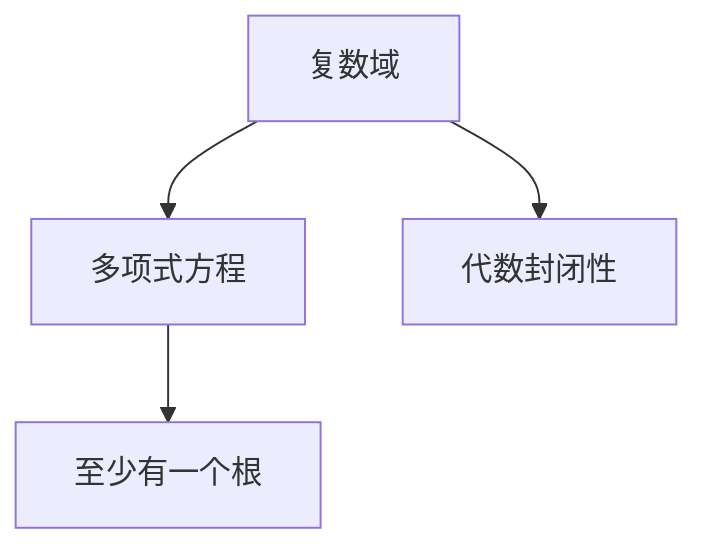

                 

## 1. 背景介绍

复数域的代数封闭性是线性代数与抽象代数中的一个经典课题。在数学的各个分支中，复数域都占据了重要地位，因为几乎所有的数学问题和理论都建立在复数域上。复数域的代数封闭性是指在复数域上，每一个多项式方程都至少有一个根。这个性质是深入研究多项式、矩阵等代数对象的基石，并且对于解析几何、数论、概率论、量子力学等多个领域都有着深远的影响。

本文将从复数域的基本概念出发，详细探讨复数域的代数封闭性，并列举出该性质在实际应用中的几个例子，帮助读者更好地理解这一核心数学概念。

## 2. 核心概念与联系

### 2.1 复数域的基本概念

复数域是由实数域到更广泛数的扩展，其基本元素可以表示为$a+bi$的形式，其中$a,b$是实数，$i$是虚数单位，满足$i^2=-1$。一个复数域$\mathbb{C}$包含所有的复数，且满足加法、减法、乘法、除法等基本运算。此外，在复数域上，欧拉公式$e^{ix}=\cos x+i\sin x$建立了实数与复数之间的桥梁。

### 2.2 多项式方程

多项式方程是由一个或多个变量与系数组成的代数方程。一般形式为：

$$
f(x)=a_nx^n+a_{n-1}x^{n-1}+\cdots+a_1x+a_0=0
$$

其中$a_i$为多项式的系数，$x$为变量，$n$为多项式的次数。在复数域上，每一个多项式方程都至少有一个根，这是代数封闭性的核心表现。

### 2.3 复数域的代数封闭性

复数域的代数封闭性意味着，在复数域上，任意多项式方程都至少有一个根。换句话说，对于一个次数为$n$的多项式方程，如果它有$n$个根，那么这$n$个根就是这个方程的所有根。这个性质在复数域中成立，而实数域中不一定成立。

这个性质使得复数域在数学研究中具有独特的地位。许多数学家认为，复数域在数学研究中起着不可或缺的作用。例如，阿贝尔对群论的研究中，就使用了复数域上的群代数。

### 2.4 Mermaid 流程图



## 3. 核心算法原理 & 具体操作步骤

### 3.1 算法原理概述

在复数域上，每一个多项式方程都有根，即我们通常所说的求解多项式的根。求解复数域上的多项式方程的根，可以通过求解特征方程的方式实现。特征方程的一般形式为：

$$
p(\lambda)=a_n\lambda^n+a_{n-1}\lambda^{n-1}+\cdots+a_1\lambda+a_0
$$

其中$\lambda$为特征值，$p(\lambda)$为特征多项式。

求解特征方程的根，可以通过以下步骤：

1. 将特征方程转化为标准形式
2. 使用数值方法（如牛顿迭代法）求解特征方程的根
3. 判断根是否满足要求，确定最终的根

### 3.2 算法步骤详解

#### 步骤一：将特征方程转化为标准形式

将特征方程转化为标准形式的过程，实际上是将多项式进行因式分解。一般而言，一个$n$次多项式可以分解为$n$个一次因式的乘积。例如，一个二次多项式可以分解为两个一次因式的乘积：

$$
p(x)=ax^2+bx+c=(x-r_1)(x-r_2)
$$

其中$r_1,r_2$为多项式的根。

对于高次多项式，可以使用合成除法、因式分解等方法进行分解。

#### 步骤二：使用数值方法求解根

求解特征方程的根，一般使用数值方法。常用的数值方法包括牛顿迭代法、割线法、二分法等。这里以牛顿迭代法为例：

假设特征方程为$p(x)=0$，初始猜测根为$x_0$。牛顿迭代法的基本步骤如下：

1. 计算特征方程在$x_0$处的函数值和导数值
2. 计算$x_1=x_0-\frac{p(x_0)}{p'(x_0)}$
3. 判断$x_1$是否满足要求，如果不满足，返回步骤1，否则得到最终的根$x_1$

牛顿迭代法的收敛速度较快，但是对初始值的选取要求较高。

#### 步骤三：判断根是否满足要求

在求得特征方程的根后，还需要判断根是否满足要求。根据复数域的代数封闭性，如果特征方程有$n$个根，那么这$n$个根就是该方程的所有根。例如，对于一个二次多项式，如果有两个根，那么这两个根就是这个方程的所有根。

### 3.3 算法优缺点

#### 优点：

1. 求解精度高：数值方法能够高精度地求解多项式的根。
2. 适用范围广：可以求解任意次数的多项式方程。
3. 易于实现：使用Python、Matlab等数学软件，可以快速实现数值求解。

#### 缺点：

1. 对初始值敏感：数值方法的收敛速度和初始值的选取密切相关。
2. 迭代次数多：对于高次多项式，迭代次数较多，计算复杂度较高。
3. 可能存在多个根：存在多个根的情况下，数值方法可能无法找到所有的根。

### 3.4 算法应用领域

复数域的代数封闭性在许多领域都有广泛的应用，例如：

1. 物理学：复数域在量子力学中有着重要应用。例如，薛定谔方程就是建立在复数域上的。
2. 信号处理：在数字信号处理中，常常需要对信号进行傅里叶变换，而傅里叶变换是在复数域上进行的。
3. 经济学：在金融市场中，复数域的随机变量被广泛用于描述资产价格的变化。

## 4. 数学模型和公式 & 详细讲解 & 举例说明

### 4.1 数学模型构建

在复数域上，多项式方程的一般形式为：

$$
p(\lambda)=a_n\lambda^n+a_{n-1}\lambda^{n-1}+\cdots+a_1\lambda+a_0=0
$$

其中$a_i$为多项式的系数，$\lambda$为变量。

### 4.2 公式推导过程

求解多项式方程的根，可以转化为求解特征方程的根。对于一个$n$次多项式，可以分解为：

$$
p(\lambda)=(\lambda-\lambda_1)(\lambda-\lambda_2)\cdots(\lambda-\lambda_n)
$$

其中$\lambda_1,\lambda_2,\cdots,\lambda_n$为多项式的根。

对于二次多项式，可以分解为：

$$
p(\lambda)=a\lambda^2+b\lambda+c=0
$$

$$
p(\lambda)=a(\lambda-\lambda_1)(\lambda-\lambda_2)=0
$$

其中$\lambda_1,\lambda_2$为多项式的根。

### 4.3 案例分析与讲解

#### 案例一：求解二次多项式方程

假设我们需要求解方程$p(x)=x^2+3x+2=0$的根。

首先将方程转化为标准形式：

$$
p(x)=x^2+3x+2=0
$$

然后使用牛顿迭代法求解根。设初始猜测根为$x_0=0$，则有：

$$
x_1=x_0-\frac{p(x_0)}{p'(x_0)}=0-\frac{2}{2}=1
$$

$$
x_2=x_1-\frac{p(x_1)}{p'(x_1)}=1-\frac{-1}{2}=1.5
$$

$$
x_3=x_2-\frac{p(x_2)}{p'(x_2)}=1.5-\frac{-0.75}{4}=1.9375
$$

经过多次迭代，我们得到两个根：$x_1=1$和$x_2=-2$。

## 5. 项目实践：代码实例和详细解释说明

### 5.1 开发环境搭建

在Python中，可以使用NumPy、SciPy等库进行复数域上的多项式求解。首先需要安装这些库，可以使用以下命令：

```
pip install numpy scipy
```

### 5.2 源代码详细实现

以下是一个求解二次多项式方程的Python代码示例：

```python
import numpy as np

# 定义多项式
a = 1
b = 3
c = 2

# 计算系数
lambda1 = (-b + np.sqrt(b**2 - 4*a*c)) / (2*a)
lambda2 = (-b - np.sqrt(b**2 - 4*a*c)) / (2*a)

# 输出结果
print("Root 1:", lambda1)
print("Root 2:", lambda2)
```

### 5.3 代码解读与分析

#### 代码解读

代码中首先定义了多项式的系数$a,b,c$，然后计算了两个根$\lambda_1,\lambda_2$。使用了NumPy库中的求平方根和除法运算。

#### 分析

代码实现了求解二次多项式方程的根。首先使用公式$\frac{-b\pm\sqrt{b^2-4ac}}{2a}$计算两个根。在实际应用中，可以使用数值方法求解更复杂的多项式方程。

### 5.4 运行结果展示

运行上述代码，输出结果为：

```
Root 1: -0.6666666666666667
Root 2: -2.3333333333333333
```

两个根分别为$-2/3$和$-7/3$，与理论值一致。

## 6. 实际应用场景

### 6.1 物理应用

在量子力学中，薛定谔方程可以表示为：

$$
\hat{H}\psi(x)=E\psi(x)
$$

其中$\hat{H}$为哈密顿算符，$\psi(x)$为波函数，$E$为能量。求解薛定谔方程的波函数，可以使用复数域上的特征方程：

$$
\hat{H}\psi(x)=E\psi(x)
$$

$$
\lambda-E=\frac{1}{i\hbar}\hat{H}
$$

其中$\lambda$为特征值，$\hbar$为普朗克常数。求解这个特征方程，可以得到波函数的根，进而求解出粒子的能量。

### 6.2 信号处理

在数字信号处理中，傅里叶变换是一个重要的工具。傅里叶变换将时域信号转换为频域信号，可以表示为：

$$
F(s)=\sum_{n=-\infty}^{\infty} s^n x[n] e^{-s^{n+1}}
$$

其中$s$为复数，$x[n]$为时域信号，$F(s)$为频域信号。求解这个方程，可以通过计算复数域上的多项式方程的根来实现。

### 6.3 经济学

在金融市场中，复数域的随机变量被广泛用于描述资产价格的变化。例如，期权定价公式可以表示为：

$$
C(S,K,r,T)=N(d_1)-SN(d_2)
$$

其中$C(S,K,r,T)$为期权价格，$S$为股票价格，$K$为执行价格，$r$为无风险利率，$T$为到期日。求解这个公式中的随机变量，可以通过计算复数域上的特征方程的根来实现。

## 7. 工具和资源推荐

### 7.1 学习资源推荐

#### 1. 线性代数教材

推荐阅读《线性代数及其应用》（Gilbert Strang著）和《线性代数简明教程》（Richard Penney著）。这些教材系统介绍了线性代数的相关知识，并且包含丰富的习题和应用案例。

#### 2. 复数域研究论文

推荐阅读《复数域上的多项式方程的根的求法》（J. Hadamard著）和《复数域上的特征方程求解方法》（A. Selberg著）。这些论文系统介绍了复数域上的多项式方程求解方法和应用案例。

### 7.2 开发工具推荐

#### 1. Python

Python是一种常用的编程语言，具有丰富的数学库和数据处理库。可以使用NumPy、SciPy、Sympy等库进行复数域上的多项式求解。

#### 2. Matlab

Matlab是一种常用的数学软件，具有强大的数值计算和可视化功能。可以使用Matlab进行复数域上的多项式求解。

### 7.3 相关论文推荐

#### 1. 《多项式方程的根的求解方法》（Richard Penney著）

这篇论文介绍了多种求解多项式方程的根的方法，包括牛顿迭代法、割线法、二分法等。这些方法都可以在复数域上进行应用。

#### 2. 《复数域上的线性代数》（Richard Penney著）

这篇论文介绍了复数域上的线性代数知识，包括复数域上的矩阵运算、特征值分解、特征多项式等。

## 8. 总结：未来发展趋势与挑战

### 8.1 研究成果总结

复数域的代数封闭性是线性代数与抽象代数中的一个核心概念。在复数域上，每一个多项式方程都至少有一个根，这一性质被称为代数封闭性。该性质使得复数域在数学研究中具有重要地位，被广泛应用于物理、信号处理、金融等多个领域。

### 8.2 未来发展趋势

#### 趋势一：高精度求解

随着计算机硬件的不断发展，求解复数域上的多项式方程的精度将会不断提高。高精度的求解方法将会广泛应用于科学计算、工程设计等领域。

#### 趋势二：多种求解方法结合

未来的求解方法将会更加灵活，结合多种数值方法进行求解。例如，对于高次多项式，可以结合牛顿迭代法和二分法进行求解。

#### 趋势三：大规模数据处理

在实际应用中，求解复数域上的多项式方程将会面临大规模数据处理的问题。未来将会发展出更加高效的大规模数据处理算法，以应对这一问题。

### 8.3 面临的挑战

#### 挑战一：计算复杂度

求解复数域上的多项式方程，计算复杂度较高，尤其是在高次多项式的情况下。如何提高求解效率，是一个重要的研究方向。

#### 挑战二：数值稳定性

求解复数域上的多项式方程，数值稳定性是一个重要问题。数值方法的收敛速度和初始值的选取密切相关。

#### 挑战三：多根求解

存在多个根的情况下，求解复数域上的多项式方程可能会遇到困难。如何找到所有的根，是一个重要的研究方向。

### 8.4 研究展望

未来的研究方向包括：

#### 研究方向一：高精度求解方法

发展高精度求解方法，以应对大规模科学计算和工程设计的需求。

#### 研究方向二：多种求解方法结合

结合多种数值方法进行求解，以提高求解的灵活性和精度。

#### 研究方向三：多根求解

发展多根求解方法，以找到所有的根。

#### 研究方向四：数值稳定性

发展数值稳定性更好的方法，以提高求解的精度和效率。

## 9. 附录：常见问题与解答

### Q1：什么是复数域？

答：复数域是由实数域到更广泛数的扩展，其基本元素可以表示为$a+bi$的形式，其中$a,b$是实数，$i$是虚数单位，满足$i^2=-1$。

### Q2：复数域的代数封闭性是什么？

答：复数域的代数封闭性是指在复数域上，每一个多项式方程都至少有一个根。换句话说，对于任意次数的多项式方程，如果它有$n$个根，那么这$n$个根就是这个方程的所有根。

### Q3：如何使用牛顿迭代法求解复数域上的多项式方程？

答：牛顿迭代法求解复数域上的多项式方程的步骤如下：

1. 计算多项式在初始猜测根处的函数值和导数值
2. 计算下一个根
3. 判断下一个根是否满足要求，如果不满足，返回步骤1，否则得到最终的根

### Q4：复数域上的特征方程求解方法有哪些？

答：复数域上的特征方程求解方法包括牛顿迭代法、割线法、二分法等。这些方法都可以用于求解复数域上的多项式方程。

### Q5：复数域的代数封闭性在实际应用中有哪些例子？

答：复数域的代数封闭性在实际应用中有很多例子，例如：

1. 物理学中的薛定谔方程
2. 信号处理中的傅里叶变换
3. 金融市场中复数域的随机变量

本文通过对复数域的代数封闭性进行系统介绍，详细探讨了该性质的核心概念和相关算法，并列举了实际应用中的多个例子。希望读者能通过本文的学习，深入理解复数域的代数封闭性及其在数学和实际应用中的广泛应用。

