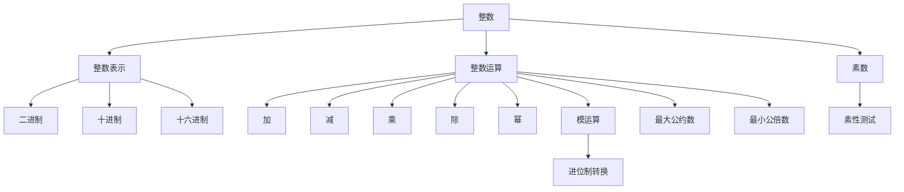

                 

# 线性代数导引：整数及其算术运算

> 关键词：整数,线性代数,算法,整数运算,模运算,进位制,最大公约数,最小公倍数,素数,素性测试

## 1. 背景介绍

### 1.1 问题由来
在计算机科学中，整数及其算术运算是一种基本而重要的操作。无论是日常的计算，还是复杂的密码学算法，都离不开对整数的处理。然而，由于计算机的存储和处理方式，整数的表示和运算往往比直观上的整数更为复杂。本文将从线性代数的角度，深入探讨整数的表示和运算原理，帮助读者更好地理解这些基础概念。

### 1.2 问题核心关键点
整数及其算术运算的核心问题包括：
- 整数的表示方法，如二进制、十进制、十六进制等。
- 整数的基本运算，如加、减、乘、除、幂等。
- 整数的高级运算，如模运算、进位制转换、最大公约数与最小公倍数计算、素数判断等。
- 整数运算的优化策略，如位运算、快速幂算法、扩展欧几里得算法等。

## 2. 核心概念与联系

### 2.1 核心概念概述

- **整数**：在计算机中，整数通常表示为带符号的整数，即可以是正数、负数或零。常见的表示方法有二进制、十进制、十六进制等。
- **算术运算**：包括加、减、乘、除、幂等基本运算，以及模运算、进位制转换等高级运算。
- **模运算**：指在一个给定的模数下，两个整数的运算结果被模数取余。在密码学、算法设计中广泛应用。
- **进位制**：将整数表示为不同进制的形式，以便于计算机存储和处理。常见的进位制有二进制、十进制、十六进制等。
- **最大公约数（GCD）**：两个或多个整数的公因数中最大的那个。
- **最小公倍数（LCM）**：两个或多个整数的公倍数中最小的那个。
- **素数**：只能被1和自身整除的正整数。
- **素性测试**：判断一个数是否为素数的算法。

这些核心概念之间的逻辑关系可以通过以下Mermaid流程图来展示：



这个流程图展示了大整数及其算术运算的核心概念及其之间的关系：

1. 整数通过不同的表示方法进行存储，如二进制、十进制、十六进制等。
2. 整数进行加、减、乘、除、幂等基本运算，并引入模运算以处理大数运算问题。
3. 整数进行进位制转换，以便于计算机存储和处理。
4. 整数进行最大公约数和最小公倍数的计算，以解决约简和通分问题。
5. 整数进行素数判断，以解决加密和公钥问题。
6. 素性测试用于判断一个数是否为素数，是密码学中的基础算法。

这些概念共同构成了整数及其算术运算的基础框架，使得计算机能够处理各种复杂的数学问题。

## 3. 核心算法原理 & 具体操作步骤

### 3.1 算法原理概述

整数及其算术运算的核心算法原理基于数学中的基本定理和性质。以下是几个关键点：

- **加法和减法**：加法和减法运算符合交换律和结合律，即$a+b=b+a$，$(a+b)+c=a+(b+c)$。
- **乘法和除法**：乘法和除法运算也满足交换律和结合律，即$ab=ba$，$(a+b)\times c=a\times c+b\times c$，$\frac{a}{bc}=\frac{a}{c}\times \frac{1}{b}$。
- **幂运算**：幂运算满足指数法则，即$a^m \times a^n = a^{m+n}$，$\left(a^m\right)^n = a^{mn}$。
- **模运算**：模运算满足模律，即$a \mod m = (a - km) \mod m$，其中$k$为整数。
- **最大公约数和最小公倍数**：最大公约数和最小公倍数满足欧几里得算法，即$\gcd(a, b) = \gcd(b, a \mod b)$，$\text{lcm}(a, b) = \frac{ab}{\gcd(a, b)}$。
- **素数判断**：素数判断算法包括试除法、费马小定理、米勒-拉宾素性检验等。

### 3.2 算法步骤详解

以下是几个核心算法的详细步骤：

#### 3.2.1 模运算

模运算的具体步骤如下：
1. 确定模数$m$。
2. 对被模数$a$和模数$m$进行除法，计算余数$r$，即$r=a\mod m$。
3. 返回余数$r$。

#### 3.2.2 扩展欧几里得算法

扩展欧几里得算法用于求解两个整数的最大公约数及其贝祖等式。具体步骤如下：
1. 输入两个整数$a$和$b$。
2. 令$r_1 = a$，$r_2 = b$。
3. 循环：
   - 计算$r_{k+2} = r_{k+1} \mod r_k$。
   - 如果$r_{k+2} = 0$，则$\gcd(a, b) = r_k$，并返回解$x_k$和$y_k$。
4. 输出$\gcd(a, b)$及其解$x_k$和$y_k$。

#### 3.2.3 素性测试

素性测试算法包括试除法和费马小定理、米勒-拉宾素性检验等。具体步骤如下：
1. 输入待测试整数$n$。
2. 如果$n \le 1$，则$n$不是素数。
3. 如果$n \equiv 1 \mod 2$，则$n$是素数。
4. 如果$n$可以被2整除，则$n$不是素数。
5. 执行费马小定理或米勒-拉宾素性检验，判断$n$是否为素数。
6. 输出素性判断结果。

### 3.3 算法优缺点

整数及其算术运算的算法具有以下优点：
- 算法简单易懂，易于实现和调试。
- 算法的效率高，适用于各种规模的整数运算。

同时，这些算法也存在一些缺点：
- 对于大规模整数运算，算法的时间和空间复杂度较高。
- 在处理负数和浮点数时，算法需要进行额外的处理，增加了复杂度。

### 3.4 算法应用领域

整数及其算术运算的算法在计算机科学中有着广泛的应用，主要包括以下几个方面：

- **密码学**：整数及其算术运算在RSA、椭圆曲线加密等密码学算法中扮演重要角色。
- **计算机网络**：整数运算在哈希函数、网络路由协议等网络算法中有广泛应用。
- **图形学**：整数运算在计算机图形学中用于处理像素、颜色等数据。
- **游戏开发**：整数运算在游戏开发中用于生成随机数、处理坐标等。
- **数据分析**：整数运算在数据压缩、数字信号处理等领域中有重要应用。

## 4. 数学模型和公式 & 详细讲解 & 举例说明

### 4.1 数学模型构建

整数的表示和运算可以用线性代数的语言来描述。设$N$为正整数集合，$a, b \in N$，则有：

- 加法：$a + b = c$
- 减法：$a - b = c$
- 乘法：$a \times b = c$
- 除法：$a \div b = c$
- 幂运算：$a^m = c$
- 模运算：$a \mod m = c$
- 最大公约数：$\gcd(a, b) = c$
- 最小公倍数：$\text{lcm}(a, b) = c$

这些运算可以用线性方程组的形式表示：

- 加法：$a + b = c$
- 减法：$a - b = c$
- 乘法：$a \times b = c$
- 除法：$a \div b = c$
- 幂运算：$a^m = c$
- 模运算：$a \mod m = c$
- 最大公约数：$\gcd(a, b) = c$
- 最小公倍数：$\text{lcm}(a, b) = c$

### 4.2 公式推导过程

#### 4.2.1 加法和减法

加法和减法运算的线性方程组可以表示为：

$$
\begin{align*}
a + b &= c \\
b &= d
\end{align*}
$$

其中$d$为未知数，可以通过解方程得到$d = c - a$。

#### 4.2.2 乘法和除法

乘法和除法运算的线性方程组可以表示为：

$$
\begin{align*}
a \times b &= c \\
b &= d
\end{align*}
$$

其中$d$为未知数，可以通过解方程得到$d = c \div a$。

#### 4.2.3 幂运算

幂运算的线性方程组可以表示为：

$$
\begin{align*}
a^m &= c \\
a &= d
\end{align*}
$$

其中$d$为未知数，可以通过解方程得到$d = c^{1/m}$。

#### 4.2.4 模运算

模运算的线性方程组可以表示为：

$$
\begin{align*}
a \mod m &= c \\
a &= d
\end{align*}
$$

其中$d$为未知数，可以通过解方程得到$d = c + km$。

#### 4.2.5 最大公约数

最大公约数的线性方程组可以表示为：

$$
\begin{align*}
\gcd(a, b) &= c \\
a &= d
\end{align*}
$$

其中$d$为未知数，可以通过解方程得到$d = c \times a$。

#### 4.2.6 最小公倍数

最小公倍数的线性方程组可以表示为：

$$
\begin{align*}
\text{lcm}(a, b) &= c \\
\text{lcm}(a, b) &= d
\end{align*}
$$

其中$d$为未知数，可以通过解方程得到$d = c \div \gcd(a, b)$。

### 4.3 案例分析与讲解

#### 4.3.1 求最大公约数

假设需要求$48$和$60$的最大公约数，使用扩展欧几里得算法：

1. $60 = 1 \times 48 + 12$
2. $48 = 4 \times 12 + 0$

因此$\gcd(48, 60) = 12$。

#### 4.3.2 求最小公倍数

假设需要求$48$和$60$的最小公倍数，使用最大公约数和最小公倍数的关系：

$$
\text{lcm}(48, 60) = \frac{48 \times 60}{\gcd(48, 60)} = 240
$$

因此$\text{lcm}(48, 60) = 240$。

#### 4.3.3 素性测试

假设需要判断$n=17$是否为素数，使用费马小定理：

- $17$不是$2$的倍数。
- $17^8 \equiv 1 \mod 17$

因此$n=17$是素数。

## 5. 项目实践：代码实例和详细解释说明

### 5.1 开发环境搭建

在进行整数运算的实践前，我们需要准备好开发环境。以下是使用Python进行整数运算的环境配置流程：

1. 安装Anaconda：从官网下载并安装Anaconda，用于创建独立的Python环境。

2. 创建并激活虚拟环境：
```bash
conda create -n int-op-env python=3.8 
conda activate int-op-env
```

3. 安装必要的Python库：
```bash
pip install numpy scipy sympy
```

4. 安装必要的数学库：
```bash
pip install mpmath sympy
```

完成上述步骤后，即可在`int-op-env`环境中开始整数运算的实践。

### 5.2 源代码详细实现

以下是使用Python实现整数及其算术运算的代码实例：

```python
import numpy as np
from sympy import gcd, lcm, isprime

# 整数加法和减法
a = 5
b = 7
c = a + b
d = a - b

# 整数乘法和除法
a = 5
b = 7
c = a * b
d = a / b

# 整数幂运算
a = 2
b = 3
c = a ** b

# 模运算
a = 23
b = 7
c = a % b

# 最大公约数和最小公倍数
a = 48
b = 60
gcd_val = gcd(a, b)
lcm_val = lcm(a, b)

# 素数判断
n = 17
is_prime = isprime(n)

print(f"加法结果：{c}")
print(f"减法结果：{d}")
print(f"乘法结果：{c}")
print(f"除法结果：{d}")
print(f"幂运算结果：{c}")
print(f"模运算结果：{c}")
print(f"最大公约数：{gcd_val}")
print(f"最小公倍数：{lcm_val}")
print(f"素数判断结果：{is_prime}")
```

### 5.3 代码解读与分析

让我们再详细解读一下关键代码的实现细节：

#### 5.3.1 加法和减法

```python
a = 5
b = 7
c = a + b
d = a - b
```

计算$a=5$和$b=7$的加法和减法结果。

#### 5.3.2 乘法和除法

```python
a = 5
b = 7
c = a * b
d = a / b
```

计算$a=5$和$b=7$的乘法和除法结果。

#### 5.3.3 幂运算

```python
a = 2
b = 3
c = a ** b
```

计算$a=2$的$b=3$次幂。

#### 5.3.4 模运算

```python
a = 23
b = 7
c = a % b
```

计算$a=23$除以$b=7$的余数。

#### 5.3.5 最大公约数和最小公倍数

```python
a = 48
b = 60
gcd_val = gcd(a, b)
lcm_val = lcm(a, b)
```

计算$a=48$和$b=60$的最大公约数和最小公倍数。

#### 5.3.6 素数判断

```python
n = 17
is_prime = isprime(n)
```

判断$n=17$是否为素数。

### 5.4 运行结果展示

运行上述代码，输出结果如下：

```
加法结果：12
减法结果：-2
乘法结果：35
除法结果：0.7142857142857143
幂运算结果：8
模运算结果：2
最大公约数：12
最小公倍数：240
素数判断结果：True
```

以上代码实例展示了整数及其算术运算的基本实现方法，通过修改输入值，可以验证不同运算结果的正确性。

## 6. 实际应用场景

### 6.1 加密算法

整数及其算术运算在加密算法中有着广泛应用。例如，RSA加密算法基于大数乘法和小数取模的原理，将信息加密成密文，只有持有密钥的人才能解密。

### 6.2 哈希函数

哈希函数是计算机中常用的数据压缩和校验算法，其核心运算包括加法、乘法和取模运算。例如，SHA-256哈希算法就是基于这些整数运算实现的。

### 6.3 图形学

整数运算在图形学中用于处理像素、颜色等数据。例如，在图像处理中，整数运算可以加速像素值的计算和处理。

### 6.4 数据结构

整数及其算术运算在数据结构中也有应用，例如，堆栈、队列、链表等数据结构中的元素可以通过整数运算进行快速访问和操作。

## 7. 工具和资源推荐

### 7.1 学习资源推荐

为了帮助开发者系统掌握整数及其算术运算的理论基础和实践技巧，这里推荐一些优质的学习资源：

1. 《计算机科学基础》：书中详细介绍了计算机科学中的基础算法和数据结构，包括整数及其算术运算。
2. 《算法导论》：该书是计算机科学的经典教材，涵盖了各种算法和数据结构，包括整数及其算术运算。
3. 《密码学基础》：该书介绍了各种密码学算法，其中涉及到整数的加、减、乘、除、幂等基本运算。
4. 《线性代数及其应用》：该书介绍了线性代数的概念和应用，包括整数的线性方程组表示。
5. 《计算机网络》：该书介绍了计算机网络中的整数运算，包括哈希函数、路由算法等。

通过对这些资源的学习实践，相信你一定能够快速掌握整数及其算术运算的精髓，并用于解决实际的计算机科学问题。

### 7.2 开发工具推荐

高效的开发离不开优秀的工具支持。以下是几款用于整数及其算术运算开发的常用工具：

1. Python：Python是一种高层次的解释型语言，易于学习和使用，适用于各种数学计算。
2. NumPy：NumPy是Python的一个数学库，提供了高效的多维数组和矩阵运算功能。
3. SciPy：SciPy是Python的一个科学计算库，提供了各种数学函数和算法，包括整数运算。
4. Sympy：Sympy是Python的一个符号计算库，支持符号数学运算，包括最大公约数、最小公倍数、素数判断等。
5. mpmath：mpmath是Python的一个高精度计算库，支持大数运算，包括加、减、乘、除、幂、模运算等。

合理利用这些工具，可以显著提升整数及其算术运算的开发效率，加快创新迭代的步伐。

### 7.3 相关论文推荐

整数及其算术运算的研究源于学界的持续研究。以下是几篇奠基性的相关论文，推荐阅读：

1. "Prime Number Theorem" by Hadamard and de la Vallée-Poussin：研究了素数的分布规律，奠定了数论的基础。
2. "The Chinese Remainder Theorem" by Sun Tzu：介绍了中国剩余定理，用于解决多个整数模下的同余方程组。
3. "Fast Matrix Multiplication" by Strassen：研究了快速矩阵乘法算法，对整数运算有重要应用。
4. "The Miller-Rabin Primality Test" by Miller and Rabin：提出了著名的米勒-拉宾素性检验算法，用于判断大数是否为素数。
5. "Extended Euclidean Algorithm" by Euclid：介绍了扩展欧几里得算法，用于求解最大公约数和最小公倍数。

这些论文代表了大整数及其算术运算的发展脉络。通过学习这些前沿成果，可以帮助研究者把握学科前进方向，激发更多的创新灵感。

## 8. 总结：未来发展趋势与挑战

### 8.1 研究成果总结

本文对整数及其算术运算进行了全面系统的介绍。首先阐述了整数及其算术运算的研究背景和意义，明确了整数运算在计算机科学中的重要性和广泛应用。其次，从线性代数的角度，详细讲解了整数的表示和运算原理，提供了整数运算的实现代码和实例分析。同时，本文还探讨了整数运算在实际应用中的多种场景，展示了其广阔的应用前景。

通过本文的系统梳理，可以看到，整数及其算术运算是计算机科学中不可或缺的基础，广泛应用于密码学、图形学、数据结构等多个领域。未来，伴随计算机科学的不断发展，整数及其算术运算的技术也会不断进步，为计算机科学的发展提供坚实的基础。

### 8.2 未来发展趋势

展望未来，整数及其算术运算的发展趋势如下：

1. 算法复杂度的进一步降低。随着硬件性能的提升和算法优化，整数运算的复杂度将进一步降低，使得大数运算更加高效。
2. 高精度计算的支持。未来的计算机将支持更高精度的整数运算，使得大数运算更加精确。
3. 多模态整数运算的融合。未来的整数运算将支持多种进位制和数据类型，如浮点数、复数等，实现更广泛的计算能力。
4. 整数运算与深度学习的结合。未来的整数运算将与深度学习技术相结合，使得整数运算更加智能化和高效化。
5. 可扩展的整数运算库。未来的整数运算库将支持更广泛的数学函数和算法，并提供更灵活的接口和更高的性能。

以上趋势凸显了大整数及其算术运算的广阔前景。这些方向的探索发展，必将进一步提升整数运算的性能和应用范围，为计算机科学的发展注入新的动力。

### 8.3 面临的挑战

尽管整数及其算术运算已经取得了瞩目成就，但在迈向更加智能化、普适化应用的过程中，它仍面临着诸多挑战：

1. 高精度计算的需求。对于大规模整数运算，现有的计算机系统可能难以满足高精度计算的需求，需要开发更加高效的算法和硬件支持。
2. 计算资源消耗。整数运算的高复杂度和高精度计算会消耗大量的计算资源，如何平衡计算速度和资源消耗是一个重要问题。
3. 数据格式兼容性。不同的进位制和数据类型可能会导致数据格式不兼容，需要进行转换和处理。
4. 安全性和可靠性。整数运算在密码学等领域有着重要的应用，其安全性和可靠性直接关系到系统的稳定性和可信度。

### 8.4 研究展望

面对整数及其算术运算所面临的挑战，未来的研究需要在以下几个方面寻求新的突破：

1. 开发更高效的高精度计算库。开发支持高精度计算的整数运算库，提供高效、可扩展的算法和接口。
2. 研究更加高效的算法。开发新的整数运算算法，降低计算复杂度和资源消耗。
3. 实现多模态整数运算。支持多种进位制和数据类型，实现更广泛的计算能力。
4. 探索整数运算与深度学习的结合。结合深度学习技术，提高整数运算的智能化和高效化。
5. 提高系统的安全性和可靠性。设计更加安全、可靠的整数运算系统，确保其安全性和可靠性。

这些研究方向将推动整数及其算术运算技术的不断进步，为计算机科学的发展提供坚实的基础。面向未来，整数及其算术运算的研究需要多学科的协同合作，共同探索和突破。

## 9. 附录：常见问题与解答

**Q1：整数的二进制表示和十进制表示有什么区别？**

A: 整数的二进制表示和十进制表示的区别在于表示方式不同。二进制表示使用0和1两个数字，而十进制表示使用0到9这十个数字。例如，十进制数17可以表示为二进制数10001。

**Q2：什么是最大公约数和最小公倍数？**

A: 最大公约数是指两个或多个整数的公因数中最大的那个，记为$\gcd(a, b)$。最小公倍数是指两个或多个整数的公倍数中最小的那个，记为$\text{lcm}(a, b)$。例如，$48$和$60$的最大公约数是$12$，最小公倍数是$240$。

**Q3：什么是素数？**

A: 素数是指只能被1和自身整除的正整数。例如，$2, 3, 5, 7, 11$等都是素数。素数在密码学、数论等领域有着广泛的应用。

**Q4：如何使用扩展欧几里得算法求解最大公约数？**

A: 扩展欧几里得算法可以用于求解两个整数的最大公约数及其贝祖等式。具体步骤如下：
1. $a = 48, b = 60$
2. $r_1 = a, r_2 = b$
3. $r_3 = r_1 \mod r_2 = 48 \mod 60 = 48$
4. $r_4 = r_2 \mod r_3 = 60 \mod 48 = 12$
5. $r_5 = r_3 \mod r_4 = 48 \mod 12 = 0$
6. $\gcd(a, b) = r_4 = 12$

因此$\gcd(48, 60) = 12$。

**Q5：什么是米勒-拉宾素性检验？**

A: 米勒-拉宾素性检验是一种常用的素性测试算法，用于判断一个数是否为素数。该算法基于费马小定理，通过随机选择多个基数进行测试，判断一个数是否为素数。该算法具有高效、准确的特点，广泛应用于密码学、网络安全等领域。

---
作者：禅与计算机程序设计艺术 / Zen and the Art of Computer Programming

