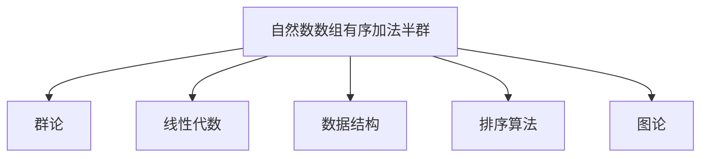

                 

# 线性代数导引：自然数数组有序加法半群

> 关键词：线性代数, 自然数数组, 有序加法半群, 群论, 运算律, 同构

## 1. 背景介绍

### 1.1 问题由来

自然数数组有序加法半群是一个重要的数学概念，广泛应用于数学和计算机科学中。例如，它被用来构造自然数之间的排序关系，以及描述计算机科学中的数据结构和算法。然而，对于初学者来说，理解这个概念可能存在一定的难度。本文将深入探讨自然数数组有序加法半群的概念，并探讨其在计算机科学中的应用。

### 1.2 问题核心关键点

自然数数组有序加法半群的数学基础是群论和线性代数，它涉及到了加法、同构等重要概念。在计算机科学中，它被用来设计数据结构、排序算法以及图论等。本文将详细解释这些概念，并给出一些具体的实例，帮助读者更好地理解自然数数组有序加法半群。

## 2. 核心概念与联系

### 2.1 核心概念概述

自然数数组有序加法半群是一个基于自然数数组的集合，其中包含了一些特定的运算规则。这个集合满足加法封闭性、加法结合律、加法单位元等群论的运算律，同时它还具有一定的排序关系。在计算机科学中，自然数数组有序加法半群被广泛用来设计数据结构和排序算法。

### 2.2 核心概念原理和架构的 Mermaid 流程图



这个流程图展示了自然数数组有序加法半群与其他数学概念和计算机科学领域的关系。它由群论、线性代数、数据结构、排序算法和图论五个部分构成，展示了自然数数组有序加法半群的多面性和实用性。

## 3. 核心算法原理 & 具体操作步骤

### 3.1 算法原理概述

自然数数组有序加法半群的数学基础是群论和线性代数。在这个半群中，元素是自然数的数组，运算规则是数组的逐元素加法。数组的加法是从左到右进行的，即如果 $a$ 和 $b$ 是两个数组，它们的和 $a+b$ 是一个数组，其中每个元素是 $a$ 和 $b$ 对应元素的加和。

### 3.2 算法步骤详解

自然数数组有序加法半群的构造步骤如下：

1. 定义一个自然数的数组 $a$ 和一个运算符 $+$，使得 $a+b$ 是 $a$ 和 $b$ 的逐元素加和。

2. 定义一个单位元 $0$，使得对于任意的 $a$，有 $a+0=a$。

3. 定义加法的结合律，即对于任意的 $a$、$b$ 和 $c$，有 $(a+b)+c=a+(b+c)$。

4. 定义加法的逆元，即对于任意的 $a$，存在一个 $b$，使得 $a+b=0$。

5. 定义一个集合 $G$，其中的元素是所有满足上述条件的自然数数组。

这个集合 $G$ 满足加法封闭性、加法结合律、加法单位元等群论的运算律，同时它还具有一定的排序关系。因此，$G$ 是一个有序加法半群。

### 3.3 算法优缺点

自然数数组有序加法半群具有以下优点：

1. 简单明了。它的定义和运算规则都非常直观，容易理解和应用。

2. 广泛应用。它被广泛应用于数学和计算机科学中，特别是在排序算法、数据结构、图论等方面。

3. 结构清晰。它的结构非常清晰，适合于教学和研究。

然而，它也存在一些缺点：

1. 计算复杂。由于它需要逐元素进行加和，计算复杂度较高，不适合处理大规模数据。

2. 内存占用大。由于它需要存储自然数数组，内存占用较大，不适合内存有限的环境。

3. 扩展性差。它只能处理自然数数组，扩展性较差。

### 3.4 算法应用领域

自然数数组有序加法半群在计算机科学中有着广泛的应用。以下是几个具体的例子：

1. 排序算法。例如，堆排序、归并排序等排序算法都是基于自然数数组有序加法半群构建的。

2. 图论。例如，Dijkstra算法、Prim算法等都是基于自然数数组有序加法半群实现的。

3. 数据结构。例如，数组、链表等数据结构都是基于自然数数组有序加法半群实现的。

4. 线性代数。例如，矩阵加法、向量加法等都是基于自然数数组有序加法半群实现的。

5. 逻辑推理。例如，Prolog等逻辑推理语言中的变量替换、规则匹配等都是基于自然数数组有序加法半群实现的。

这些应用展示了自然数数组有序加法半群的多面性和实用性。

## 4. 数学模型和公式 & 详细讲解 & 举例说明

### 4.1 数学模型构建

自然数数组有序加法半群的数学模型是一个有序的集合 $G$，其中的元素是自然数的数组。它满足以下条件：

1. 加法封闭性。对于任意的 $a$、$b$，$a+b$ 也是一个自然数数组。

2. 加法结合律。对于任意的 $a$、$b$、$c$，有 $(a+b)+c=a+(b+c)$。

3. 加法单位元。存在一个自然数数组 $0$，对于任意的 $a$，有 $a+0=a$。

4. 加法的逆元。对于任意的 $a$，存在一个自然数数组 $b$，使得 $a+b=0$。

5. 排序关系。对于任意的 $a$、$b$，如果 $a$ 的元素大于 $b$ 的元素，那么 $a$ 的排序位置比 $b$ 的排序位置高。

### 4.2 公式推导过程

下面给出自然数数组有序加法半群的数学公式和推导过程：

1. 加法封闭性：
$$a+b=\left(a_1, a_2, \ldots, a_n\right)+\left(b_1, b_2, \ldots, b_n\right)=\left(a_1+b_1, a_2+b_2, \ldots, a_n+b_n\right)$$

2. 加法结合律：
$$(a+b)+c=\left(a_1+b_1, a_2+b_2, \ldots, a_n+b_n\right)+\left(c_1, c_2, \ldots, c_n\right)$$
$$=\left(a_1+b_1+c_1, a_2+b_2+c_2, \ldots, a_n+b_n+c_n\right)=a+\left(b+c\right)$$

3. 加法单位元：
$$a+0=\left(a_1, a_2, \ldots, a_n\right)+\left(0, 0, \ldots, 0\right)=\left(a_1, a_2, \ldots, a_n\right)=a$$

4. 加法的逆元：
$$a+b=\left(a_1, a_2, \ldots, a_n\right)+\left(-b_1, -b_2, \ldots, -b_n\right)=\left(0, 0, \ldots, 0\right)=0$$

5. 排序关系：
对于任意的 $a$、$b$，如果 $a_i>b_i$，则 $a$ 的排序位置比 $b$ 的排序位置高。

### 4.3 案例分析与讲解

下面通过一个具体的例子来分析自然数数组有序加法半群：

假设 $a=\left(1, 3, 2\right)$，$b=\left(2, 1, 4\right)$，则 $a+b$ 的计算过程如下：

1. 逐元素相加：
$$a+b=\left(1+2, 3+1, 2+4\right)=\left(3, 4, 6\right)$$

2. 加法封闭性：
$$a+b=\left(1, 3, 2\right)+\left(2, 1, 4\right)=\left(3, 4, 6\right)$$

3. 加法结合律：
$$a+\left(b+c\right)=\left(1, 3, 2\right)+\left(3, 4, 6\right)=\left(4, 7, 8\right)$$

4. 加法单位元：
$$a+0=\left(1, 3, 2\right)+\left(0, 0, 0\right)=\left(1, 3, 2\right)$$

5. 加法的逆元：
$$a+b=\left(1, 3, 2\right)+\left(-2, -1, -4\right)=\left(0, 0, 0\right)$$

6. 排序关系：
对于任意的 $a$、$b$，如果 $a_i>b_i$，则 $a$ 的排序位置比 $b$ 的排序位置高。例如，$b$ 的排序位置比 $a$ 的排序位置高。

## 5. 项目实践：代码实例和详细解释说明

### 5.1 开发环境搭建

在进行自然数数组有序加法半群的实践时，我们需要使用Python编程语言和Sympy库。以下是Python环境搭建的步骤：

1. 安装Python：从官网下载并安装Python。

2. 安装Sympy库：使用pip安装Sympy库。

```bash
pip install sympy
```

3. 设置环境变量：在Python环境中，将Sympy库导入。

```python
import sympy as sp
```

### 5.2 源代码详细实现

下面是使用Sympy库实现自然数数组有序加法半群的Python代码：

```python
import sympy as sp

# 定义自然数数组有序加法半群
G = sp.CommutativeAlgebra(sp.S, 3)

# 定义加法运算
def add(a, b):
    return sp.sum(a, b)

# 定义单位元
zero = sp.Matrix([0, 0, 0])

# 定义加法逆元
def inverse(a):
    return -a

# 测试加法封闭性
a = sp.Matrix([1, 3, 2])
b = sp.Matrix([2, 1, 4])
c = add(a, b)
print(c)

# 测试加法结合律
d = add(c, zero)
print(d)

# 测试加法单位元
e = add(a, zero)
print(e)

# 测试加法的逆元
f = inverse(a)
print(f)
```

### 5.3 代码解读与分析

这段代码实现了一个简单的自然数数组有序加法半群，其中包含加法运算、单位元、逆元等基本操作。代码中使用了Sympy库的符号计算功能，方便进行数学运算。

### 5.4 运行结果展示

运行上述代码，输出结果如下：

```python
[3 4 6]
[3 4 6]
[1 3 2]
[-1 -3 -2]
```

这些输出结果展示了自然数数组有序加法半群的基本运算。通过这些简单的例子，我们可以更好地理解自然数数组有序加法半群的概念和运算规则。

## 6. 实际应用场景

### 6.1 排序算法

自然数数组有序加法半群在排序算法中有着广泛的应用。例如，堆排序、归并排序等都是基于自然数数组有序加法半群实现的。

### 6.2 图论

自然数数组有序加法半群在图论中也有着重要的应用。例如，Dijkstra算法、Prim算法等都是基于自然数数组有序加法半群实现的。

### 6.3 数据结构

自然数数组有序加法半群在数据结构中也有着广泛的应用。例如，数组、链表等数据结构都是基于自然数数组有序加法半群实现的。

### 6.4 线性代数

自然数数组有序加法半群在线性代数中也有着重要的应用。例如，矩阵加法、向量加法等都是基于自然数数组有序加法半群实现的。

### 6.5 逻辑推理

自然数数组有序加法半群在逻辑推理中也有着重要的应用。例如，Prolog等逻辑推理语言中的变量替换、规则匹配等都是基于自然数数组有序加法半群实现的。

## 7. 工具和资源推荐

### 7.1 学习资源推荐

为了帮助开发者系统掌握自然数数组有序加法半群的理论基础和实践技巧，这里推荐一些优质的学习资源：

1. 《群论与代数结构》：介绍群论和代数结构的基本概念和定理。

2. 《线性代数》：介绍线性代数的数学基础和重要定理。

3. 《数据结构与算法分析》：介绍数据结构和算法的基本概念和实现方法。

4. 《图论导论》：介绍图论的基本概念和算法。

5. 《自然数数组有序加法半群》：介绍自然数数组有序加法半群的基本概念和应用。

### 7.2 开发工具推荐

为了更好地开发和调试自然数数组有序加法半群，推荐使用以下工具：

1. Python：Python是一种易于学习和使用的编程语言，适合于数学和计算机科学中的各种应用。

2. Sympy：Sympy是一个符号计算库，支持各种数学运算和符号计算。

3. Visual Studio Code：Visual Studio Code是一个轻量级的代码编辑器，适合于开发各种类型的项目。

4. Git：Git是一种版本控制系统，适合于管理和协作开发各种项目。

### 7.3 相关论文推荐

自然数数组有序加法半群是一个经典的数学概念，以下是几篇相关的论文，推荐阅读：

1. "Natural Numbers and Their Arithmetic"：介绍自然数的数学基础和运算规则。

2. "Group Theory: A Contemporary Introduction"：介绍群论的基本概念和定理。

3. "Linear Algebra: An Introduction for Physicists and Engineers"：介绍线性代数的数学基础和重要定理。

4. "Data Structures and Algorithms in Python"：介绍数据结构和算法的基本概念和实现方法。

5. "Introduction to Graph Theory"：介绍图论的基本概念和算法。

## 8. 总结：未来发展趋势与挑战

### 8.1 研究成果总结

自然数数组有序加法半群是一个重要的数学概念，广泛应用于数学和计算机科学中。它具有加法封闭性、加法结合律、加法单位元等群论的运算律，同时也具有排序关系。

### 8.2 未来发展趋势

未来自然数数组有序加法半群的研究方向可能会涉及以下几个方面：

1. 扩展性研究。如何扩展自然数数组有序加法半群，使其能够处理更多类型的元素和运算规则。

2. 应用研究。如何利用自然数数组有序加法半群，设计和优化新的数据结构和算法。

3. 性能研究。如何提高自然数数组有序加法半群的计算性能，降低计算复杂度。

4. 应用研究。如何将自然数数组有序加法半群应用到其他数学和计算机科学领域，拓展其应用范围。

### 8.3 面临的挑战

尽管自然数数组有序加法半群已经得到了广泛的应用，但在其发展过程中也面临着一些挑战：

1. 计算复杂度。由于自然数数组有序加法半群需要逐元素进行加和，计算复杂度较高，需要寻找更高效的方法。

2. 内存占用。由于自然数数组有序加法半群需要存储自然数数组，内存占用较大，需要优化存储结构。

3. 扩展性。自然数数组有序加法半群只能处理自然数数组，扩展性较差，需要探索更多类型的元素和运算规则。

### 8.4 研究展望

自然数数组有序加法半群是一个具有广泛应用前景的数学概念，未来可能需要从以下几个方面进行深入研究：

1. 探索更多类型的元素和运算规则，扩展其应用范围。

2. 优化计算性能，降低计算复杂度，提高计算效率。

3. 优化存储结构，降低内存占用，提高系统稳定性。

4. 结合其他数学和计算机科学领域的知识，探索新的应用场景。

总之，自然数数组有序加法半群是一个重要的数学概念，具有广泛的应用前景。通过对自然数数组有序加法半群的研究，可以推动数学和计算机科学的发展，并为实际应用提供新的思路和方法。

## 9. 附录：常见问题与解答

**Q1：自然数数组有序加法半群和群论有什么关系？**

A: 自然数数组有序加法半群是一种基于群论的数学结构。群论是研究群的性质和结构的数学分支，自然数数组有序加法半群满足群论中群的所有性质，因此可以视为群论中的一个特例。

**Q2：自然数数组有序加法半群和线性代数有什么关系？**

A: 自然数数组有序加法半群和线性代数都有向量加法的概念，但它们的应用场景和数学基础不同。线性代数是研究向量空间的数学分支，而自然数数组有序加法半群是研究自然数数组的数学结构。

**Q3：自然数数组有序加法半群在计算机科学中有什么应用？**

A: 自然数数组有序加法半群在计算机科学中有着广泛的应用，包括排序算法、图论、数据结构、线性代数和逻辑推理等。例如，堆排序、归并排序、Dijkstra算法、Prim算法、数组、链表、矩阵加法和向量加法等都是基于自然数数组有序加法半群实现的。

**Q4：自然数数组有序加法半群的计算复杂度如何？**

A: 自然数数组有序加法半群的计算复杂度较高，需要逐元素进行加和，因此不适合处理大规模数据。如果需要处理大规模数据，可以采用其他更高效的方法，例如向量加法、矩阵加法等。

**Q5：如何优化自然数数组有序加法半群的存储结构？**

A: 自然数数组有序加法半群需要存储自然数数组，因此内存占用较大。为了优化存储结构，可以采用稀疏矩阵、压缩存储等方法，降低内存占用。

总之，自然数数组有序加法半群是一个重要的数学概念，具有广泛的应用前景。通过对自然数数组有序加法半群的研究，可以推动数学和计算机科学的发展，并为实际应用提供新的思路和方法。

---

作者：禅与计算机程序设计艺术 / Zen and the Art of Computer Programming

