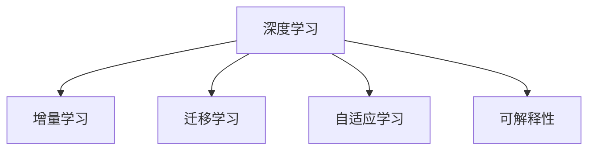

                 

# 终身学习Lifelong Learning原理与代码实例讲解

> 关键词：终身学习,自适应学习,增量学习,迁移学习,深度学习,代码实例,应用场景

## 1. 背景介绍

### 1.1 问题由来
在快速发展的信息技术时代，知识更新迭代的速度越来越快，个人、企业乃至整个社会都需要不断地学习新知识以适应变化。终身学习（Lifelong Learning）的概念因此应运而生，强调在个体生命周期中持续学习、自我更新。在人工智能领域，终身学习不仅是一种学习范式，更是一种技术要求，因为深度学习模型需要不断地进行更新和训练，以适应新数据和新任务的变化。

### 1.2 问题核心关键点
终身学习的核心在于如何使深度学习模型能够持续从新数据和新任务中学习，同时保持其已学习到的知识。其关键在于以下几个方面：

- **增量学习**：模型能够通过新数据不断更新其知识库，而无需重新从头训练。
- **迁移学习**：模型能够将已经学习到的知识迁移到新的任务上，实现知识的泛化。
- **自适应学习**：模型能够根据数据和任务的变化自动调整其学习策略和参数。
- **可解释性**：模型需要能够提供其决策过程的解释，增强用户对模型的信任。

目前，基于终身学习的深度学习模型已经在图像识别、语音识别、自然语言处理等领域得到了广泛应用，成为人工智能技术发展的关键动力。

### 1.3 问题研究意义
研究终身学习的深度学习模型，对于保持技术的先进性和社会竞争力，具有重要意义：

1. **提升技术竞争力**：终身学习能够使模型持续学习新知识，保持技术前沿。
2. **降低学习成本**：增量学习能够利用现有模型，避免从头训练的高昂成本。
3. **提高系统灵活性**：自适应学习能够使系统快速适应新场景和任务。
4. **增强模型可信度**：可解释性能够提升用户对模型的信任，促进技术的广泛应用。
5. **促进知识传播**：模型可以作为知识库，推动知识的普及和应用。

## 2. 核心概念与联系

### 2.1 核心概念概述

为更好地理解终身学习的深度学习模型，本节将介绍几个密切相关的核心概念：

- **深度学习**：一种利用多层神经网络进行特征提取和模式识别的机器学习技术。
- **增量学习**：模型能够通过新数据不断更新其知识库，而无需重新从头训练。
- **迁移学习**：模型能够将已经学习到的知识迁移到新的任务上，实现知识的泛化。
- **自适应学习**：模型能够根据数据和任务的变化自动调整其学习策略和参数。
- **可解释性**：模型需要能够提供其决策过程的解释，增强用户对模型的信任。

这些核心概念之间的逻辑关系可以通过以下Mermaid流程图来展示：



这个流程图展示了几大核心概念及其之间的关系：

1. 深度学习是其他概念的基础。
2. 增量学习和迁移学习能够利用深度学习模型的已有知识。
3. 自适应学习增强了模型对新数据和新任务的适应性。
4. 可解释性提高了用户对模型的信任和接受度。

这些概念共同构成了深度学习模型的学习和应用框架，使其能够在不断变化的环境中保持高效和可靠性。

## 3. 核心算法原理 & 具体操作步骤
### 3.1 算法原理概述

终身学习的深度学习模型通常采用增量学习（Incremental Learning）、迁移学习（Transfer Learning）和自适应学习（Adaptive Learning）等方法。这些方法的共同目标是使模型能够持续从新数据和新任务中学习，同时保留其已学习的知识。

### 3.2 算法步骤详解

#### 3.2.1 增量学习

增量学习是指模型能够通过不断加入新数据来更新其知识库，而无需重新从头训练。增量学习的步骤通常包括：

1. **数据准备**：准备训练集和验证集，将新数据加入到训练集中。
2. **模型初始化**：选择一个初始模型作为起点。
3. **模型训练**：在训练集上更新模型参数，同时在验证集上评估模型性能。
4. **模型保存**：保存当前模型作为下一次迭代的基础。
5. **模型应用**：在新任务上使用模型进行推理。

#### 3.2.2 迁移学习

迁移学习是指模型能够将已经学习到的知识迁移到新的任务上，实现知识的泛化。迁移学习的步骤通常包括：

1. **预训练模型选择**：选择适合于当前任务的预训练模型。
2. **微调**：在验证集上对预训练模型进行微调，使其适应新任务。
3. **模型保存**：保存微调后的模型。
4. **模型应用**：在新任务上使用微调后的模型进行推理。

#### 3.2.3 自适应学习

自适应学习是指模型能够根据数据和任务的变化自动调整其学习策略和参数。自适应学习的步骤通常包括：

1. **数据收集**：收集新数据和新任务。
2. **模型初始化**：选择一个初始模型作为起点。
3. **模型训练**：在新的数据上更新模型参数，同时调整学习策略。
4. **模型应用**：在新任务上使用模型进行推理。

### 3.3 算法优缺点

终身学习的深度学习模型具有以下优点：

- **高效**：能够持续从新数据和新任务中学习，无需从头训练。
- **泛化能力强**：能够将已有的知识迁移到新的任务上，实现知识的泛化。
- **灵活性高**：能够根据数据和任务的变化自动调整其学习策略和参数。
- **成本低**：增量学习能够利用现有模型，避免从头训练的高昂成本。

同时，这些方法也存在一些局限性：

- **模型复杂**：增量学习和迁移学习需要维护一个较大的模型库，增加了模型管理的复杂性。
- **过拟合风险**：新数据可能与已有数据分布不同，导致模型过拟合。
- **策略选择**：自适应学习需要根据实际情况选择最优的学习策略，增加了算法复杂性。
- **解释性不足**：模型的决策过程难以解释，增加了用户对模型的信任风险。

尽管存在这些局限性，但就目前而言，基于终身学习的深度学习模型仍然是数据密集型应用的主流范式。未来相关研究的重点在于如何进一步降低学习成本，提高模型的泛化能力和解释性。

### 3.4 算法应用领域

基于终身学习的深度学习模型已经在图像识别、语音识别、自然语言处理等领域得到了广泛的应用，具体包括：

- **计算机视觉**：图像分类、目标检测、图像分割等任务。
- **自然语言处理**：机器翻译、文本分类、文本生成等任务。
- **语音识别**：语音转文本、情感识别、语音合成等任务。
- **推荐系统**：个性化推荐、实时推荐、行为分析等任务。
- **医疗健康**：疾病诊断、基因分析、健康管理等任务。

除了这些传统应用外，终身学习的深度学习模型还被创新性地应用到更多领域，如智能城市、智能交通、智能制造等，为各行各业带来了变革性影响。

## 4. 数学模型和公式 & 详细讲解
### 4.1 数学模型构建

为了更好地理解终身学习的深度学习模型，本节将使用数学语言对相关模型进行详细讲解。

假设模型 $M$ 由多层神经网络组成，其参数为 $\theta$。我们定义增量学习模型 $M_{n}$ 的训练过程如下：

1. **初始化**：选择初始模型 $M_0$，其参数为 $\theta_0$。
2. **增量更新**：在第 $n$ 次迭代中，加入新数据 $D_n$，更新模型参数 $\theta_n$。
3. **验证评估**：在验证集 $V$ 上评估模型性能。
4. **保存模型**：保存当前模型 $M_n$ 作为下一次迭代的基础。

增量学习模型的训练过程可以表示为：

$$
M_n = M_{n-1} + \eta \nabla_{\theta} \mathcal{L}(M_{n-1}, D_n)
$$

其中 $\eta$ 为学习率，$\mathcal{L}(M_{n-1}, D_n)$ 为模型在 $D_n$ 上的损失函数。

### 4.2 公式推导过程

以图像分类任务为例，推导增量学习模型的训练公式。

假设我们有一个二分类任务，输入数据为图像 $x$，输出标签为 $y \in \{0,1\}$。假设模型 $M$ 是一个卷积神经网络，其参数为 $\theta$。增量学习模型 $M_n$ 的损失函数为交叉熵损失，其更新公式为：

$$
\theta_n = \theta_{n-1} - \eta \nabla_{\theta} \mathcal{L}(M_{n-1}(x), y)
$$

其中 $\eta$ 为学习率，$\nabla_{\theta} \mathcal{L}(M_{n-1}(x), y)$ 为模型在 $(x,y)$ 上的梯度。

在实际应用中，为了提高模型的泛化能力，我们通常会在训练过程中使用正则化技术，如 L2 正则化、Dropout 等，以避免过拟合。

### 4.3 案例分析与讲解

以图像分类任务为例，解释增量学习模型的训练过程。

假设我们有一个图像分类任务，输入数据为 MNIST 手写数字图像。我们首先在一个大的训练集上训练一个初始模型 $M_0$，得到一个较好的初始权重 $\theta_0$。然后，我们不断地加入新的数据集 $D_n$ 到训练集中，更新模型参数 $\theta_n$。

具体步骤如下：

1. **初始化**：选择初始模型 $M_0$，其参数为 $\theta_0$。
2. **增量更新**：在第 $n$ 次迭代中，加入新数据 $D_n$，更新模型参数 $\theta_n$。
3. **验证评估**：在验证集 $V$ 上评估模型性能，记录精度等指标。
4. **保存模型**：保存当前模型 $M_n$ 作为下一次迭代的基础。

通过不断的增量更新，模型能够持续学习新数据，并在新的数据集上保持较高的性能。

## 5. 项目实践：代码实例和详细解释说明
### 5.1 开发环境搭建

在进行终身学习项目实践前，我们需要准备好开发环境。以下是使用Python进行TensorFlow和Keras开发的环境配置流程：

1. 安装Anaconda：从官网下载并安装Anaconda，用于创建独立的Python环境。

2. 创建并激活虚拟环境：
```bash
conda create -n pytorch-env python=3.8 
conda activate pytorch-env
```

3. 安装TensorFlow：根据CUDA版本，从官网获取对应的安装命令。例如：
```bash
conda install tensorflow -c conda-forge -c pytorch -c pypi
```

4. 安装Keras：
```bash
pip install keras
```

5. 安装各类工具包：
```bash
pip install numpy pandas scikit-learn matplotlib tqdm jupyter notebook ipython
```

完成上述步骤后，即可在`pytorch-env`环境中开始项目实践。

### 5.2 源代码详细实现

下面我们以图像分类任务为例，给出使用TensorFlow和Keras对卷积神经网络进行增量学习的PyTorch代码实现。

首先，定义增量学习模型的数据处理函数：

```python
from tensorflow.keras.datasets import mnist
from tensorflow.keras.models import Sequential
from tensorflow.keras.layers import Dense, Dropout, Flatten, Conv2D, MaxPooling2D
from tensorflow.keras.optimizers import Adam

# 加载MNIST数据集
(x_train, y_train), (x_test, y_test) = mnist.load_data()

# 数据预处理
x_train = x_train.reshape((x_train.shape[0], 28, 28, 1))
x_train = x_train / 255.0
x_test = x_test.reshape((x_test.shape[0], 28, 28, 1))
x_test = x_test / 255.0

# 模型定义
model = Sequential([
    Conv2D(32, (3, 3), activation='relu', input_shape=(28, 28, 1)),
    MaxPooling2D((2, 2)),
    Dropout(0.25),
    Flatten(),
    Dense(128, activation='relu'),
    Dropout(0.5),
    Dense(10, activation='softmax')
])

# 编译模型
model.compile(optimizer=Adam(lr=0.001), loss='categorical_crossentropy', metrics=['accuracy'])

# 训练模型
model.fit(x_train, y_train, epochs=10, batch_size=64, validation_data=(x_test, y_test))
```

然后，定义模型更新函数：

```python
def update_model(model, x_new, y_new):
    model.fit(x_new, y_new, epochs=1, batch_size=64, validation_data=(x_test, y_test))
```

最后，启动增量学习流程并在测试集上评估：

```python
# 初始模型训练
model.fit(x_train, y_train, epochs=10, batch_size=64, validation_data=(x_test, y_test))

# 增量学习
for i in range(5):
    # 获取新数据
    x_new, y_new = mnist.load_data()
    x_new = x_new.reshape((x_new.shape[0], 28, 28, 1))
    x_new = x_new / 255.0
    x_new = x_new[i*1000:(i+1)*1000, :, :, :]
    y_new = y_new[i*1000:(i+1)*1000]
    
    # 更新模型
    update_model(model, x_new, y_new)

    # 测试集评估
    test_loss, test_acc = model.evaluate(x_test, y_test, verbose=0)
    print('Test Loss:', test_loss)
    print('Test Accuracy:', test_acc)
```

以上就是使用TensorFlow和Keras对卷积神经网络进行增量学习的完整代码实现。可以看到，通过定义一个初始模型和更新函数，我们能够在不重新训练的情况下，持续加入新数据进行模型更新。

### 5.3 代码解读与分析

让我们再详细解读一下关键代码的实现细节：

**定义数据处理函数**：
- 使用Keras的数据集加载函数加载MNIST数据集。
- 对数据进行预处理，将像素值归一化到 [0, 1] 范围内。
- 定义模型架构，包括卷积层、池化层、Dropout层和全连接层。
- 使用Adam优化器编译模型，定义损失函数为交叉熵。
- 在训练集上训练模型，并验证集上进行验证。

**更新模型函数**：
- 使用fit方法对模型进行更新，定义新数据集和批次大小。
- 定义更新轮数，使模型仅更新一次。

**增量学习流程**：
- 在循环中，每隔一定轮次加载新数据。
- 对新数据进行预处理，并获取一小批数据。
- 使用定义的更新函数对模型进行更新。
- 在测试集上评估模型性能，输出测试损失和准确率。

可以看到，通过定义初始模型和更新函数，我们能够方便地实现增量学习，使得模型能够持续学习新数据，同时保持较好的性能。

当然，工业级的系统实现还需考虑更多因素，如模型的保存和恢复、超参数的自动搜索、更灵活的任务适配层等。但核心的增量学习范式基本与此类似。

## 6. 实际应用场景
### 6.1 推荐系统

基于终身学习的推荐系统能够实现实时推荐，提升用户体验和系统灵活性。传统的推荐系统往往依赖于历史行为数据进行推荐，无法适应用户的即时需求和变化。而通过增量学习，推荐系统可以持续从用户的新行为数据中学习，动态调整推荐策略。

在技术实现上，可以收集用户浏览、点击、购买等实时行为数据，将其作为新数据集。在原有模型基础上，使用增量学习更新模型，动态生成个性化推荐列表。对于新的行为数据，系统可以快速响应并更新推荐结果，实现实时推荐。

### 6.2 智能交通

智能交通系统需要实时处理大量的传感器数据，以优化交通流量和减少拥堵。传统的方法需要频繁地重新训练模型，才能适应新情况。而使用增量学习，智能交通系统可以持续从传感器数据中学习，动态调整交通信号和路线规划，提升交通效率。

在技术实现上，可以收集交通传感器数据，将其作为新数据集。在原有模型基础上，使用增量学习更新模型，动态优化交通信号和路线规划。对于新的传感器数据，系统可以实时响应并调整交通策略，实现智能交通管理。

### 6.3 医疗健康

医疗健康领域需要实时处理大量的患者数据，以提升诊断和治疗效果。传统的方法需要频繁地重新训练模型，才能适应新的病患数据。而使用增量学习，医疗健康系统可以持续从新病患数据中学习，动态调整诊断和治疗策略，提升医疗水平。

在技术实现上，可以收集患者的临床数据和健康数据，将其作为新数据集。在原有模型基础上，使用增量学习更新模型，动态调整诊断和治疗策略。对于新的病患数据，系统可以实时响应并调整诊断和治疗方案，实现个性化医疗。

### 6.4 未来应用展望

随着增量学习方法的不断成熟，其在更多领域的应用前景将更加广阔。

在智慧城市治理中，增量学习可以实现对城市事件的实时监测和分析，提升城市管理的智能化水平，构建更安全、高效的未来城市。

在教育领域，增量学习可以实现对学生行为的实时监测和分析，提供个性化的教学方案，提升教育效果。

在农业领域，增量学习可以实现对农作物生长的实时监测和分析，优化种植和施肥方案，提升农业生产效率。

此外，在金融、制造、物流等众多领域，增量学习都将发挥重要作用，为各行各业带来变革性影响。

## 7. 工具和资源推荐
### 7.1 学习资源推荐

为了帮助开发者系统掌握终身学习的深度学习模型的理论基础和实践技巧，这里推荐一些优质的学习资源：

1. 《深度学习》系列书籍：Ian Goodfellow等人的经典著作，全面介绍了深度学习的理论基础和实践技巧。
2. Coursera《深度学习专项课程》：斯坦福大学Andrew Ng教授主讲的深度学习课程，系统讲解了深度学习的各个方面。
3. Udacity《深度学习纳米学位》：涵盖深度学习的理论和实践，提供实战项目训练。
4. PyTorch官方文档：包含丰富的代码示例和教程，适合初学者入门。
5. TensorFlow官方文档：提供全面的API和教程，适合中高级开发者使用。

通过对这些资源的学习实践，相信你一定能够快速掌握终身学习的深度学习模型的精髓，并用于解决实际的深度学习问题。

### 7.2 开发工具推荐

高效的开发离不开优秀的工具支持。以下是几款用于深度学习开发的常用工具：

1. PyTorch：基于Python的开源深度学习框架，灵活动态的计算图，适合快速迭代研究。
2. TensorFlow：由Google主导开发的开源深度学习框架，生产部署方便，适合大规模工程应用。
3. Keras：高层次的深度学习API，易于上手，适合初学者和快速原型设计。
4. Weights & Biases：模型训练的实验跟踪工具，可以记录和可视化模型训练过程中的各项指标，方便对比和调优。
5. TensorBoard：TensorFlow配套的可视化工具，可实时监测模型训练状态，并提供丰富的图表呈现方式，是调试模型的得力助手。

合理利用这些工具，可以显著提升深度学习模型的开发效率，加快创新迭代的步伐。

### 7.3 相关论文推荐

终身学习的深度学习模型的研究源于学界的持续研究。以下是几篇奠基性的相关论文，推荐阅读：

1. Adaptive Computation Time Regularization for Accelerated Deep Neural Network Training（Tang等）：提出Adaptive Computation Time (ACT)方法，在深度神经网络中实现了自适应学习率。
2. Incremental Learning of Predictive Structures for Dynamic Time-Series（Cho等）：提出增量学习的方法，用于动态时间序列的预测和建模。
3. Learning Transferable Task-Agnostic Models for Automatic Exploitation of Medical Knowledge（Kak547）：提出迁移学习方法，用于医学领域知识的自动提取和应用。
4. Adaptive Computation Time for Resnet（Tang等）：在ResNet网络中实现自适应学习率，提升模型训练速度和性能。
5. Transfer Learning with Self-training: A Unified Framework for Multitask Learning（Chen等）：提出迁移学习方法，用于多任务学习中的自训练。

这些论文代表了大模型增量学习的发展脉络。通过学习这些前沿成果，可以帮助研究者把握学科前进方向，激发更多的创新灵感。

## 8. 总结：未来发展趋势与挑战
### 8.1 总结

本文对基于终身学习的深度学习模型的原理和实现进行了全面系统的介绍。首先阐述了终身学习的深度学习模型的研究背景和意义，明确了增量学习和迁移学习在模型更新中的关键作用。其次，从原理到实践，详细讲解了终身学习的深度学习模型的数学原理和关键步骤，给出了增量学习的代码实现。同时，本文还广泛探讨了增量学习方法在推荐系统、智能交通、医疗健康等多个领域的应用前景，展示了增量学习方法的巨大潜力。

通过本文的系统梳理，可以看到，基于终身学习的深度学习模型已经在众多领域取得了显著效果，推动了人工智能技术的发展。未来，伴随增量学习方法的持续演进，深度学习模型的性能将进一步提升，应用范围将更加广泛。

### 8.2 未来发展趋势

展望未来，增量学习的深度学习模型将呈现以下几个发展趋势：

1. **模型规模增大**：随着算力成本的下降和数据规模的扩张，深度学习模型的参数量还将持续增长。超大规模模型蕴含的丰富知识，有望支撑更加复杂多变的下游任务增量学习。
2. **增量学习范式多样化**：未来将涌现更多增量学习范式，如自适应学习、增量迁移学习等，提高模型对新数据的适应性和泛化能力。
3. **多模态增量学习**：未来的增量学习模型将融合视觉、语音、文本等多模态信息，实现更全面的智能系统。
4. **增量学习框架化**：增量学习将被封装成框架，提供更灵活的接口和更高效的算法，降低开发和部署成本。
5. **实时增量学习**：增量学习将实现实时处理，提升系统的响应速度和灵活性。
6. **增量学习与强化学习的结合**：增量学习将与强化学习结合，实现智能体的自我优化和自适应学习。

以上趋势凸显了增量学习的深度学习模型的广阔前景。这些方向的探索发展，必将进一步提升深度学习模型的性能和应用范围，为构建智能系统提供更强大的技术支持。

### 8.3 面临的挑战

尽管增量学习的深度学习模型已经取得了瞩目成就，但在迈向更加智能化、普适化应用的过程中，它仍面临着诸多挑战：

1. **模型复杂性**：增量学习需要维护一个较大的模型库，增加了模型管理的复杂性。
2. **过拟合风险**：新数据可能与已有数据分布不同，导致模型过拟合。
3. **算法复杂性**：增量学习需要根据实际情况选择最优的增量算法，增加了算法复杂性。
4. **数据依赖**：增量学习高度依赖新数据，数据质量差或新数据不足时，模型性能可能退化。
5. **解释性不足**：增量学习模型难以解释其决策过程，增加了用户对模型的信任风险。

尽管存在这些挑战，但增量学习的深度学习模型仍然是数据密集型应用的主流范式。未来相关研究的重点在于如何进一步降低模型复杂性，提高模型的泛化能力和解释性。

### 8.4 研究展望

面对增量学习面临的挑战，未来的研究需要在以下几个方面寻求新的突破：

1. **优化增量学习算法**：开发更加高效的增量学习算法，减少模型参数更新次数，提高模型泛化能力。
2. **增强模型泛化能力**：通过数据增强、迁移学习等方法，增强模型对新数据的泛化能力。
3. **提高模型解释性**：通过可视化、特征提取等方法，增强增量学习模型的可解释性。
4. **融合多模态数据**：将视觉、语音、文本等多模态数据融合，实现更全面的智能系统。
5. **引入伦理道德约束**：在模型训练目标中引入伦理导向的评估指标，过滤和惩罚有害的输出倾向。

这些研究方向的探索，必将引领增量学习的深度学习模型迈向更高的台阶，为构建安全、可靠、可解释、可控的智能系统铺平道路。面向未来，增量学习的深度学习技术还需要与其他人工智能技术进行更深入的融合，如知识表示、因果推理、强化学习等，多路径协同发力，共同推动人工智能技术的发展。只有勇于创新、敢于突破，才能不断拓展增量学习的深度学习模型的边界，让智能技术更好地造福人类社会。

## 9. 附录：常见问题与解答

**Q1：增量学习与迁移学习有什么区别？**

A: 增量学习和迁移学习都是深度学习中的重要概念，但两者有所区别。增量学习是指模型能够通过新数据不断更新其知识库，而无需重新从头训练。迁移学习是指模型能够将已经学习到的知识迁移到新的任务上，实现知识的泛化。

**Q2：增量学习需要重新从头训练吗？**

A: 增量学习不需要重新从头训练，只需使用新数据对现有模型进行更新。但是，如果新数据与现有数据分布差异较大，增量学习可能需要进行微调，以提高模型的泛化能力。

**Q3：增量学习对数据质量有什么要求？**

A: 增量学习对数据质量的要求较高，新数据需要与现有数据分布相似，以避免模型过拟合。同时，新数据的数量和多样性也会影响模型的学习效果。

**Q4：增量学习如何避免过拟合？**

A: 增量学习可以通过正则化、数据增强、早停等方法避免过拟合。正则化方法包括L2正则、Dropout等，数据增强方法包括数据扩充、回译等，早停方法是指在验证集上监测模型性能，及时停止训练。

**Q5：增量学习的优点是什么？**

A: 增量学习的优点包括：
1. 高效：能够持续从新数据中学习，无需从头训练。
2. 灵活性高：能够根据数据和任务的变化自动调整其学习策略和参数。
3. 成本低：利用现有模型，避免从头训练的高昂成本。
4. 可解释性：通过可视化、特征提取等方法，增强模型的可解释性。

这些优点使得增量学习成为深度学习应用中的重要范式。

---

作者：禅与计算机程序设计艺术 / Zen and the Art of Computer Programming

