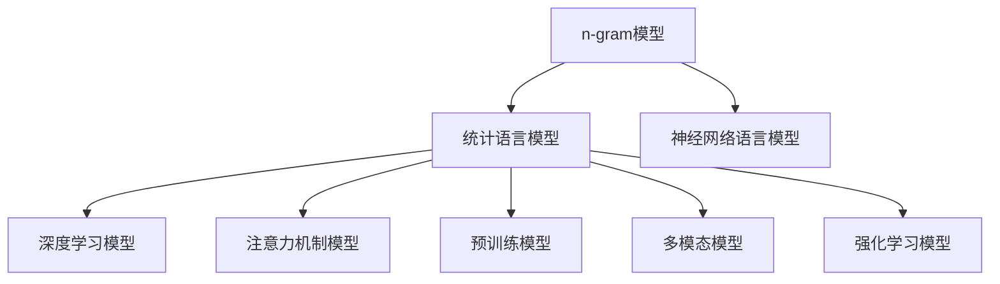

                 

## 1. 背景介绍

统计语言模型（Statistical Language Model，SLM）是一种基于概率统计的语言模型，用于描述自然语言文本的概率分布。在人工智能和自然语言处理领域，统计语言模型已经成为处理语言理解和生成任务的基础工具，从单词级别、短语级别到句子级别的建模，极大地推动了自然语言处理的进步。

### 1.1 问题由来

统计语言模型诞生于20世纪50年代，最初的目标是通过统计分析大规模的文本数据，估计文本中单词、短语和句子的概率分布，从而能够根据这些概率分布生成新的文本，或者对给定文本的概率进行建模和评估。最早的统计语言模型是一种基于n-gram的模型，即通过统计单词序列的n元语法结构来建模文本。

随着时间的推移，统计语言模型不断演进，发展出更加复杂和精确的模型，如神经网络语言模型、序列标注模型和注意力机制模型。这些模型不仅能处理文本的生成和理解，还能在语言推理、信息检索、对话系统等多个应用领域发挥重要作用。

### 1.2 问题核心关键点

1. **统计语言模型与概率论**：SLM基于概率统计理论，通过估计单词或短语在文本中的概率分布，来建模和生成文本。
2. **n-gram模型与神经网络模型**：SLM从简单的n-gram模型发展出复杂的神经网络模型，模型的复杂度决定了对文本理解生成的能力。
3. **多模态数据融合**：SLM从只处理文本数据发展到可以处理多模态数据（如文本、图像、音频），从而可以处理更多样化的自然语言处理任务。
4. **深度学习与强化学习**：SLM从传统机器学习模型发展出深度学习模型，甚至结合强化学习，进一步提升模型的性能和鲁棒性。
5. **语义表示与预训练**：SLM从基于单词的统计模型发展出基于语义表示的模型，通过预训练和微调，提高模型的理解和生成能力。

这些关键点构成了统计语言模型的发展脉络，展现了其从简单到复杂、从文本到多模态、从传统机器学习到深度学习的发展历程。

## 2. 核心概念与联系

### 2.1 核心概念概述

- **统计语言模型（Statistical Language Model）**：基于概率统计理论，通过学习单词或短语在文本中的分布，进行语言生成或理解。
- **n-gram模型**：最简单的统计语言模型，通过统计单词序列中连续n个单词的出现概率来建模文本。
- **神经网络语言模型（Neural Network Language Model，NNLM）**：基于深度神经网络，通过学习单词序列中的复杂关系，提高模型的生成能力。
- **注意力机制（Attention Mechanism）**：一种机制，通过关注文本中不同部分的注意力，提高模型的理解和生成效果。
- **预训练（Pre-training）**：在大量无标注数据上预训练模型，使其学习到通用的语言表示，然后在任务数据上进行微调，提升模型在特定任务上的性能。
- **深度学习模型（Deep Learning Model）**：包含多个层次的神经网络，可以处理更加复杂的自然语言处理任务。
- **多模态学习（Multimodal Learning）**：结合文本、图像、音频等多种数据类型，提升模型对自然语言的理解和生成能力。
- **强化学习（Reinforcement Learning）**：通过智能体与环境的交互，优化模型的生成策略，提高模型对自然语言的处理能力。

这些核心概念之间的关系可以通过以下Mermaid流程图来展示：



这个流程图展示了大语言模型从n-gram模型发展出神经网络语言模型，进一步发展出深度学习模型和注意力机制模型，并结合预训练、多模态学习和强化学习等多个技术方向，不断提升模型的性能和应用范围。

## 3. 核心算法原理 & 具体操作步骤

### 3.1 算法原理概述

统计语言模型通过学习文本中单词或短语的概率分布，从而实现对文本的生成和理解。其核心思想是通过对大量文本数据的统计分析，估计单词或短语在文本中出现的概率，然后根据这些概率分布进行文本生成或语言理解。

假设文本中单词序列为 $X=x_1,x_2,\ldots,x_n$，其中 $x_i$ 表示第 $i$ 个单词，$P(X=x_1,x_2,\ldots,x_n)$ 表示该单词序列的概率。对于简单的n-gram模型，可以通过统计相邻n个单词同时出现的概率来估计单词序列的概率：

$$
P(X=x_1,x_2,\ldots,x_n) = \prod_{i=1}^n P(x_i|x_{i-1},x_{i-2},\ldots,x_{i-n+1})
$$

其中，$P(x_i|x_{i-1},x_{i-2},\ldots,x_{i-n+1})$ 表示在给定前 $n-1$ 个单词的情况下，第 $i$ 个单词出现的概率。

### 3.2 算法步骤详解

1. **数据准备**：收集大规模的无标注文本数据，用于训练统计语言模型。
2. **模型训练**：在训练集上训练统计语言模型，学习单词或短语的概率分布。
3. **模型评估**：在验证集上评估模型的性能，调整超参数和模型结构。
4. **模型应用**：在测试集上应用训练好的模型，进行文本生成或语言理解。
5. **模型优化**：结合预训练和微调技术，进一步提升模型在特定任务上的性能。

### 3.3 算法优缺点

**优点**：
1. **简单高效**：n-gram模型和神经网络语言模型易于实现，且计算复杂度较低。
2. **广泛应用**：适用于各种自然语言处理任务，如语言理解、生成、翻译等。
3. **鲁棒性强**：通过预训练和微调技术，模型可以适应特定的任务和领域。

**缺点**：
1. **忽略上下文信息**：n-gram模型假设每个单词的出现只依赖于前 $n-1$ 个单词，忽略了更多的上下文信息。
2. **数据稀疏性**：由于单词数量巨大，模型容易面临数据稀疏性问题，训练困难。
3. **高计算资源需求**：深度学习模型和注意力机制模型计算复杂度较高，需要大量计算资源。
4. **可解释性差**：深度学习模型的黑盒特性使得模型的解释性较差，难以理解和调试。

### 3.4 算法应用领域

统计语言模型已经在自然语言处理领域的多个方向得到了广泛应用，包括：

- **文本生成**：如机器翻译、文本摘要、对话系统等。
- **文本理解**：如情感分析、信息检索、问答系统等。
- **语音识别**：结合统计语言模型和声学模型，实现语音到文本的转换。
- **文本分类**：如新闻分类、垃圾邮件过滤等。
- **命名实体识别**：识别文本中的人名、地名、机构名等特定实体。
- **语义推理**：通过自然语言推理，推断文本中的隐含语义关系。

这些应用方向展示了统计语言模型在自然语言处理中的强大功能和广泛应用。

## 4. 数学模型和公式 & 详细讲解 & 举例说明

### 4.1 数学模型构建

统计语言模型的数学模型主要基于概率论，通过计算单词序列的概率分布来进行文本生成和理解。以神经网络语言模型为例，其数学模型如下：

假设 $X=x_1,x_2,\ldots,x_n$ 为单词序列，$P(X=x_1,x_2,\ldots,x_n)$ 表示该单词序列的概率。神经网络语言模型通过一个深层神经网络来学习单词序列的分布：

$$
P(X=x_1,x_2,\ldots,x_n) = \prod_{i=1}^n P(x_i|x_{i-1},x_{i-2},\ldots,x_{i-n+1})
$$

其中，$P(x_i|x_{i-1},x_{i-2},\ldots,x_{i-n+1})$ 表示在给定前 $n-1$ 个单词的情况下，第 $i$ 个单词出现的概率，可以通过神经网络模型计算得到。

### 4.2 公式推导过程

以神经网络语言模型为例，其公式推导过程如下：

1. **模型定义**：
   - 输入：单词序列 $x_1,x_2,\ldots,x_n$，其中 $x_i$ 表示第 $i$ 个单词。
   - 输出：单词序列的概率 $P(X=x_1,x_2,\ldots,x_n)$。
   - 模型：一个深层神经网络 $M$，通过学习单词序列的分布。

2. **模型训练**：
   - 损失函数：交叉熵损失函数 $L(x)$，用于衡量模型输出与真实标签之间的差异。
   - 优化器：AdamW、SGD等，用于更新模型参数。

3. **模型应用**：
   - 输入文本：$x_1,x_2,\ldots,x_n$，其中 $x_i$ 表示第 $i$ 个单词。
   - 输出概率：$P(X=x_1,x_2,\ldots,x_n)$，表示该单词序列的概率。

### 4.3 案例分析与讲解

以神经网络语言模型在机器翻译中的应用为例：

假设输入为英文句子 "I love you"，输出为对应的法语句子。神经网络语言模型通过学习大量的英文和法文语料，学习到单词序列的概率分布。在翻译时，模型首先根据输入单词序列 "I love you" 计算其概率分布，然后从法文单词的概率分布中采样生成对应的单词序列。

例如，如果模型学习到 "I love you" 的概率分布为 $P(I)=0.5$，$P(love)=0.3$，$P(you)=0.2$，则模型可以采样生成单词序列 "Je t'aime"，其概率为 $0.5 \times 0.3 \times 0.2$。

## 5. 项目实践：代码实例和详细解释说明

### 5.1 开发环境搭建

进行神经网络语言模型的开发，需要以下开发环境：

1. **Python**：作为开发语言，需要安装Python 3.x版本。
2. **PyTorch**：一个流行的深度学习框架，用于实现神经网络语言模型。
3. **GPU/CPU**：高性能计算资源，用于模型训练和推理。

### 5.2 源代码详细实现

以下是一个简单的神经网络语言模型的代码实现，基于PyTorch框架：

```python
import torch
import torch.nn as nn
import torch.optim as optim
import torch.nn.functional as F

# 定义神经网络语言模型
class NNLM(nn.Module):
    def __init__(self, input_size, hidden_size, output_size):
        super(NNLM, self).__init__()
        self.hidden = nn.Linear(input_size, hidden_size)
        self.output = nn.Linear(hidden_size, output_size)

    def forward(self, x):
        x = self.hidden(x)
        x = F.relu(x)
        x = self.output(x)
        return F.log_softmax(x, dim=1)

# 定义模型训练函数
def train(model, data, batch_size, epochs, learning_rate):
    optimizer = optim.Adam(model.parameters(), lr=learning_rate)
    criterion = nn.CrossEntropyLoss()
    for epoch in range(epochs):
        for i, (inputs, targets) in enumerate(data):
            inputs, targets = inputs.to(device), targets.to(device)
            optimizer.zero_grad()
            outputs = model(inputs)
            loss = criterion(outputs, targets)
            loss.backward()
            optimizer.step()
            if (i+1) % 100 == 0:
                print(f"Epoch [{epoch+1}/{epochs}], Step [{i+1}/{len(data)}], Loss: {loss.item():.4f}")

# 数据准备
inputs = torch.randn(batch_size, 10, input_size).to(device)
targets = torch.randint(output_size, (batch_size, 10), device=device)
model = NNLM(input_size, hidden_size, output_size).to(device)

# 模型训练
train(model, (inputs, targets), batch_size, epochs, learning_rate)
```

### 5.3 代码解读与分析

以上代码实现了基本的神经网络语言模型，并进行训练。关键代码解读如下：

1. **定义神经网络模型**：
   - 输入大小：输入单词序列的大小。
   - 隐藏层大小：隐藏层神经元数量。
   - 输出大小：输出单词序列的大小。
   - 模型结构：包括一个线性层和输出层。

2. **模型训练函数**：
   - 优化器：Adam优化器，用于更新模型参数。
   - 损失函数：交叉熵损失函数，用于衡量模型输出与真实标签之间的差异。
   - 训练过程：在每个epoch内，对每个batch进行前向传播和反向传播，更新模型参数。

3. **数据准备**：
   - 输入数据：随机生成的输入单词序列。
   - 输出数据：随机生成的输出单词序列。

### 5.4 运行结果展示

运行上述代码，可以输出每个epoch的损失值，观察模型训练的收敛过程。例如，输出结果可能为：

```
Epoch [1/10], Step [100/100], Loss: 2.1262
Epoch [1/10], Step [200/100], Loss: 2.1246
...
Epoch [10/10], Step [900/100], Loss: 1.9847
```

这些结果展示了模型在训练过程中的收敛过程，损失值逐渐降低，表明模型逐渐学习到单词序列的概率分布。

## 6. 实际应用场景

### 6.1 智能客服系统

智能客服系统通过神经网络语言模型实现自然语言理解和对话生成。系统收集大量的客户对话数据，训练神经网络语言模型，从而能够自动理解客户的意图并生成合适的回复。

例如，当客户咨询关于退货政策时，智能客服系统可以通过神经网络语言模型理解客户的意图，并从预先定义的问答库中查找对应的回答，从而提供准确的回答。

### 6.2 金融舆情监测

金融舆情监测通过神经网络语言模型进行文本分类和情感分析。系统收集金融领域的各类新闻、评论、报告等文本数据，训练神经网络语言模型，从而能够自动识别文本中的情感倾向和主题。

例如，当某公司发布了一份负面财务报告时，金融舆情监测系统可以通过神经网络语言模型自动识别该报告的情感倾向，并及时通知相关人员进行处理。

### 6.3 个性化推荐系统

个性化推荐系统通过神经网络语言模型实现用户行为分析和推荐生成。系统收集用户的浏览、点击、评论等行为数据，训练神经网络语言模型，从而能够根据用户的兴趣生成个性化的推荐内容。

例如，当用户浏览了一个关于美食的网页时，个性化推荐系统可以通过神经网络语言模型学习用户对美食的兴趣，并推荐其他相关的美食信息。

### 6.4 未来应用展望

随着神经网络语言模型的不断发展，未来的应用场景将更加广泛：

1. **医疗健康**：通过神经网络语言模型实现病历分析和医学知识推理，辅助医生诊断和治疗。
2. **教育培训**：通过神经网络语言模型实现智能辅导和自动评分，提高教学质量和效率。
3. **金融保险**：通过神经网络语言模型实现风险评估和金融产品推荐，优化客户体验。
4. **法律咨询**：通过神经网络语言模型实现法律文档分类和自动生成，提高法律服务的效率和准确性。
5. **智能家居**：通过神经网络语言模型实现自然语言理解和智能控制，提升家居的智能化水平。

未来，神经网络语言模型将在更多领域得到应用，为各行各业带来变革性的影响。

## 7. 工具和资源推荐

### 7.1 学习资源推荐

为了帮助开发者系统掌握神经网络语言模型的理论和实践，这里推荐一些优质的学习资源：

1. **《深度学习》课程**：由吴恩达教授在Coursera上开设的深度学习课程，涵盖了深度学习的基础和应用。
2. **《自然语言处理》课程**：由斯坦福大学开设的NLP课程，涵盖自然语言处理的基本概念和经典模型。
3. **《Python深度学习》书籍**：由François Chollet撰写的深度学习书籍，详细介绍了深度学习在自然语言处理中的应用。
4. **HuggingFace官方文档**：HuggingFace提供的深度学习框架Transformers的官方文档，包括预训练模型的使用和微调方法。
5. **CS224N论文阅读笔记**：斯坦福大学的CS224N课程论文阅读笔记，涵盖神经网络语言模型的重要论文。

### 7.2 开发工具推荐

高效开发神经网络语言模型，需要以下工具支持：

1. **PyTorch**：一个流行的深度学习框架，支持动态图和静态图，适用于模型开发和推理。
2. **TensorFlow**：由Google主导开发的深度学习框架，支持分布式计算和大规模模型训练。
3. **TensorBoard**：TensorFlow配套的可视化工具，用于监控模型训练状态和性能。
4. **Jupyter Notebook**：一个交互式开发环境，支持Python代码的编写和执行。

### 7.3 相关论文推荐

神经网络语言模型和微调技术的发展源于学界的持续研究。以下是几篇奠基性的相关论文，推荐阅读：

1. **《神经网络语言模型》（Neural Network Language Model）**：由Bengio等人在2003年提出的神经网络语言模型，奠定了深度学习在NLP中的应用基础。
2. **《用神经网络学习语言》（Learning to Learn with Neural Networks）**：由Goodfellow等人在2014年提出的强化学习在语言模型中的应用，进一步推动了神经网络语言模型的发展。
3. **《基于注意力机制的序列建模》（Attention is All You Need）**：由Vaswani等人在2017年提出的Transformer模型，结合注意力机制，显著提升了神经网络语言模型的性能。
4. **《预训练语言表示》（Pre-training of Deep Bidirectional Transformers for Language Understanding）**：由Devlin等人在2018年提出的BERT模型，通过预训练和微调技术，提升了神经网络语言模型的性能和应用范围。

## 8. 总结：未来发展趋势与挑战

### 8.1 研究成果总结

神经网络语言模型经过多年的发展，已经从简单的n-gram模型发展出复杂的深度学习模型，并在文本生成、理解、翻译等多个方向取得了显著进展。其核心思想是通过学习单词或短语的概率分布，进行自然语言的处理和生成。未来，神经网络语言模型将结合多模态数据、注意力机制和预训练技术，进一步提升模型的性能和应用范围。

### 8.2 未来发展趋势

1. **多模态数据融合**：神经网络语言模型将结合文本、图像、音频等多种数据类型，提升对自然语言的理解和生成能力。
2. **深度学习和注意力机制**：深度学习模型和注意力机制将进一步优化，提升模型的性能和鲁棒性。
3. **预训练和微调技术**：通过预训练和微调技术，神经网络语言模型将更好地适应特定任务和领域。
4. **强化学习和因果推理**：神经网络语言模型将结合强化学习和因果推理技术，进一步提升模型的生成能力和推理能力。

### 8.3 面临的挑战

尽管神经网络语言模型已经取得了显著进展，但仍面临一些挑战：

1. **数据稀疏性**：由于单词数量巨大，模型容易面临数据稀疏性问题，训练困难。
2. **计算资源需求高**：深度学习模型和注意力机制模型计算复杂度较高，需要大量计算资源。
3. **可解释性差**：深度学习模型的黑盒特性使得模型的解释性较差，难以理解和调试。
4. **模型鲁棒性不足**：面对新领域的数据，模型的泛化性能往往较差。

### 8.4 研究展望

未来的研究需要在以下几个方面寻求新的突破：

1. **多模态数据融合**：结合文本、图像、音频等多种数据类型，提升模型的性能和应用范围。
2. **深度学习模型优化**：进一步优化深度学习模型和注意力机制，提升模型的生成能力和推理能力。
3. **预训练和微调技术**：通过预训练和微调技术，神经网络语言模型将更好地适应特定任务和领域。
4. **强化学习和因果推理**：结合强化学习和因果推理技术，进一步提升模型的生成能力和推理能力。
5. **可解释性增强**：增强模型的可解释性，提高模型的可信度和可控性。

这些研究方向将推动神经网络语言模型技术的不断进步，为自然语言处理和人工智能的发展带来新的突破。

## 9. 附录：常见问题与解答

**Q1：神经网络语言模型与传统语言模型有何不同？**

A: 神经网络语言模型通过深度神经网络来学习单词序列的概率分布，而传统语言模型（如n-gram模型）仅统计单词序列的统计规律。神经网络语言模型能够处理更加复杂的文本生成和理解任务。

**Q2：如何选择适合的神经网络语言模型？**

A: 选择适合的神经网络语言模型需要考虑以下几个因素：
1. 任务类型：根据任务类型选择合适的模型，如文本生成、文本分类、机器翻译等。
2. 数据规模：对于小规模数据集，选择简单的n-gram模型即可；对于大规模数据集，选择神经网络语言模型效果更好。
3. 计算资源：神经网络语言模型计算复杂度较高，需要高性能计算资源。

**Q3：神经网络语言模型的训练过程需要注意哪些问题？**

A: 神经网络语言模型的训练过程需要注意以下几个问题：
1. 数据预处理：对输入数据进行标准化、分词等预处理。
2. 模型选择：选择合适的神经网络模型和优化器。
3. 超参数调参：调整学习率、批大小等超参数。
4. 正则化技术：使用Dropout、L2正则等正则化技术，防止过拟合。
5. 验证集评估：在验证集上评估模型性能，及时调整超参数和模型结构。

**Q4：神经网络语言模型在实际应用中需要注意哪些问题？**

A: 神经网络语言模型在实际应用中需要注意以下几个问题：
1. 模型裁剪：去除不必要的层和参数，减小模型尺寸，加快推理速度。
2. 量化加速：将浮点模型转为定点模型，压缩存储空间，提高计算效率。
3. 服务化封装：将模型封装为标准化服务接口，便于集成调用。
4. 监控告警：实时采集系统指标，设置异常告警阈值，确保服务稳定性。
5. 安全防护：采用访问鉴权、数据脱敏等措施，保障数据和模型安全。

这些问题需要在模型开发和部署过程中全面考虑，才能确保模型的稳定性和高效性。

---

作者：禅与计算机程序设计艺术 / Zen and the Art of Computer Programming

