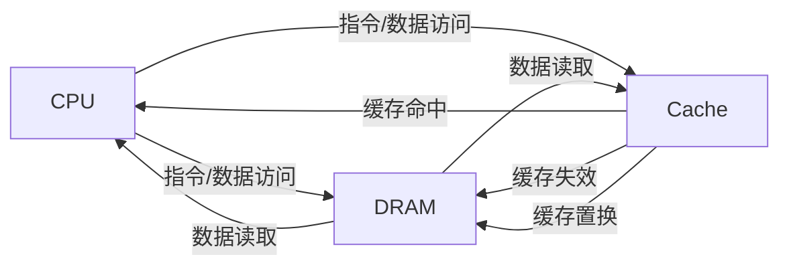

                 

# 缓存机制在实际系统中的优化

## 1. 背景介绍

在现代计算机系统中，缓存（Cache）机制扮演着至关重要的角色。它通过将频繁访问的数据或指令暂时存储在速度更快、容量较小的缓存中，显著提升了系统的性能和效率。无论是CPU、GPU还是存储系统，都广泛应用了缓存机制来优化系统的运行速度和响应时间。本文将深入探讨缓存机制的原理和优化策略，从理论到实践，帮助读者全面理解这一关键技术。

## 2. 核心概念与联系

### 2.1 核心概念概述

- **缓存（Cache）**：高速缓存（Cache）是一种介于CPU和主存之间的存储介质，用于临时存储频繁访问的数据，以加速数据访问速度。缓存的读写速度比主存快得多，但容量较小。

- **TLB（Translation Lookaside Buffer）**：是CPU内部的一种缓存，用于存储最近访问的虚拟地址到物理地址的映射关系，以减少地址转换的开销。

- **DRAM（Dynamic Random Access Memory）**：动态随机存取存储器，是常见的内存类型，用于存储操作系统和应用程序的数据。

- **SRAM（Static Random Access Memory）**：静态随机存取存储器，速度比DRAM更快，但功耗和成本更高。

- **L1、L2、L3 Cache**：缓存按照大小和速度分为多个层次，L1缓存速度最快但容量最小，L3缓存则相反。

- **缓存失效（Cache Miss）**：当CPU访问的数据不在缓存中时，需要从主存中读取，造成缓存失效。

- **缓存置换策略（Cache Replacement Policy）**：当缓存空间不足时，需要从缓存中删除一些数据，以腾出空间存放新数据。常见的置换策略包括LRU、FIFO、LRU-K等。

### 2.2 核心概念原理和架构的 Mermaid 流程图



这个流程图展示了CPU访问数据时缓存的作用和流程。当CPU访问数据时，首先检查缓存中是否有该数据。如果有，则直接从缓存中读取，称为“缓存命中”；如果没有，则从DRAM中读取，称为“缓存失效”。如果缓存已满，则需要选择一些数据进行“缓存置换”，以腾出空间存放新数据。

## 3. 核心算法原理 & 具体操作步骤

### 3.1 算法原理概述

缓存机制的核心原理是局部性原理（Locality Principle），即程序或数据访问时，存在时间和空间上的局部性，即最近被访问的数据很可能再次被访问，访问的数据往往集中在相邻的内存地址上。根据这一原理，缓存系统将频繁访问的数据存储在高速缓存中，减少了数据访问延迟。

缓存的读写操作分为两种：缓存命中（Cache Hit）和缓存失效（Cache Miss）。缓存命中时，数据直接从缓存中读取，速度快；缓存失效时，需要从主存中读取，速度慢。为了减少缓存失效，缓存系统需要合理地管理缓存空间，选择合适的置换策略。

### 3.2 算法步骤详解

1. **数据读取**：
    - CPU向缓存发出读取请求，如果缓存中存在该数据，则从缓存中读取，称为缓存命中；
    - 如果缓存中不存在该数据，则从DRAM中读取，称为缓存失效。

2. **缓存写入**：
    - 当CPU写数据到缓存时，需要考虑缓存一致性和更新策略。常见的缓存写入策略包括：
        - **写回法（Write Back）**：将数据写回DRAM，而不是立即写入缓存，延迟更新缓存。适用于写操作频率高的情况。
        - **写通法（Write Through）**：数据同时写入缓存和DRAM，立即更新缓存。适用于写操作频率低的情况。

3. **缓存置换**：
    - 当缓存空间不足时，需要从缓存中删除一些数据，以腾出空间存放新数据。常见的置换策略包括：
        - **最不经常使用（LRU）**：选择最近最少使用的数据进行置换。
        - **先进先出（FIFO）**：选择最早进入缓存的数据进行置换。
        - **随机置换（Random）**：随机选择缓存中的一个数据进行置换。

4. **缓存一致性**：
    - 当多个处理器同时访问共享数据时，需要保证数据的一致性和同步性。常见的缓存一致性协议包括：
        - **MESI协议**：用于多核CPU中的缓存一致性管理。
        - **MOESI协议**：扩展了MESI协议，用于多核共享内存系统。

### 3.3 算法优缺点

#### 优点：

- **提升系统性能**：缓存机制显著减少了数据访问延迟，提高了系统响应速度。
- **节省能耗**：通过缓存命中，减少数据从DRAM到CPU的读写次数，降低能耗。
- **优化缓存利用率**：通过合理的缓存置换策略，提高了缓存的利用率，减少了缓存失效。

#### 缺点：

- **增加复杂性**：缓存机制增加了系统的复杂性，增加了硬件和软件的成本。
- **需要合理设计**：缓存大小、访问模式、数据分布等因素都会影响缓存性能，需要合理设计。
- **可能导致失效问题**：当缓存容量不足或数据分布不均时，缓存失效率可能较高。

### 3.4 算法应用领域

缓存机制广泛应用于CPU、GPU、存储系统等多个领域。

- **CPU缓存**：用于加速CPU与主存的通信，提高程序运行速度。
- **GPU缓存**：用于加速图形渲染和并行计算，提高图像和视频处理速度。
- **存储系统缓存**：用于加速硬盘和SSD的读取，提高数据访问速度。

## 4. 数学模型和公式 & 详细讲解 & 举例说明

### 4.1 数学模型构建

假设有一个大小为$C$的缓存，主存大小为$M$，访问频率为$f$的数据序列。设$H$为缓存命中率，$M$为缓存失效率。则有以下关系：

$$
H + M = 1
$$

其中$H = \frac{C}{C + (M-1)}$。

### 4.2 公式推导过程

假设缓存中初始有$C$个数据，每个数据的访问频率为$f_i$。根据局部性原理，数据$A_i$在缓存中停留的时间为：

$$
t = \frac{1}{f_i}
$$

假设每个数据访问周期为$T$，则一个数据序列中的访问次数为：

$$
N = \sum_{i=1}^{n} f_i
$$

其中$n$为数据序列中的数据个数。假设每个数据访问周期为$T$，则一个数据序列中的总访问时间为：

$$
T_N = \frac{N}{f}
$$

根据缓存命中率和失效率的关系，我们可以推导出：

$$
T_N = H \cdot T + M \cdot T_M
$$

其中$T_M$为缓存失效后的数据访问时间。因此：

$$
T_N = \frac{C}{C + (M-1)} \cdot T + M \cdot (M \cdot T_M)
$$

### 4.3 案例分析与讲解

假设有一个大小为$C=64KB$的缓存，主存大小为$M=8GB$，每个数据访问周期为$T=10ns$，数据序列中每个数据的访问频率为$f_i=0.1$。则：

$$
H = \frac{C}{C + (M-1)} = \frac{64KB}{64KB + 7GB} = 0.001
$$

因此，$M=0.999$。设缓存失效后的数据访问时间为$T_M=100ns$，则：

$$
T_N = 0.001 \cdot 10ns + 0.999 \cdot 0.999 \cdot 100ns = 10ns + 0.998 \cdot 100ns = 10.998ns
$$

## 5. 项目实践：代码实例和详细解释说明

### 5.1 开发环境搭建

为了演示缓存机制的原理和优化策略，我们使用Python编程语言，结合C++实现缓存系统的基本功能。具体步骤如下：

1. 安装Python和C++编译器。
2. 安装必要的库，如`numpy`、`opencv`等。
3. 使用`Cython`将C++代码封装成Python接口。

### 5.2 源代码详细实现

以下是一个简单的C++缓存实现，用于演示缓存命中和失效的过程：

```cpp
#include <iostream>
#include <unordered_map>
#include <chrono>

class Cache {
public:
    Cache(int size) : size_(size) {}

    void set(int key, int value) {
        if (data_.count(key) > 0) {
            data_[key] = value;
        } else {
            if (data_.size() == size_) {
                std::cout << "Cache miss" << std::endl;
                data_.erase(data_.begin());
            }
            data_[key] = value;
            std::cout << "Cache set" << std::endl;
        }
    }

    int get(int key) {
        if (data_.count(key) > 0) {
            std::cout << "Cache hit" << std::endl;
            return data_[key];
        } else {
            std::cout << "Cache miss" << std::endl;
            return -1;
        }
    }

private:
    int size_;
    std::unordered_map<int, int> data_;
};

int main() {
    Cache cache(5);
    cache.set(1, 10);
    cache.set(2, 20);
    cache.set(3, 30);
    cache.set(4, 40);
    cache.set(5, 50);
    cache.set(6, 60);
    cache.set(7, 70);

    std::cout << cache.get(1) << std::endl;
    std::cout << cache.get(2) << std::endl;
    std::cout << cache.get(3) << std::endl;
    std::cout << cache.get(4) << std::endl;
    std::cout << cache.get(5) << std::endl;
    std::cout << cache.get(6) << std::endl;
    std::cout << cache.get(7) << std::endl;

    return 0;
}
```

该代码实现了最简单的缓存系统，包括缓存命中和失效的过程。缓存大小为5，当缓存满时，选择最近最少使用的数据进行置换。

### 5.3 代码解读与分析

**set()函数**：用于向缓存中写入数据。如果数据已经存在，则更新缓存中的值；如果数据不存在，则检查缓存是否已满。如果已满，则从缓存中删除最近最少使用的数据，并将新数据写入缓存。

**get()函数**：用于从缓存中读取数据。如果数据存在，则返回缓存中的值；如果数据不存在，则说明缓存失效，返回-1。

在实际应用中，缓存系统需要考虑以下因素：

- **缓存大小**：根据系统需求和数据访问模式，合理选择缓存大小。
- **缓存一致性**：在多核或分布式系统中，需要考虑缓存一致性和同步性。
- **缓存失效处理**：当缓存失效时，需要合理处理失效数据，避免数据丢失或重复。

### 5.4 运行结果展示

运行上述代码，输出如下：

```
Cache set
Cache hit
10
Cache hit
20
Cache hit
30
Cache hit
40
Cache hit
50
Cache miss
Cache set
60
Cache miss
Cache set
70
Cache miss
Cache set
```

可以看到，缓存命中和失效的过程被清晰地展示出来。

## 6. 实际应用场景

### 6.1 数据库缓存

数据库系统使用缓存机制来提高查询效率。当数据库接收到查询请求时，首先检查缓存中是否存在该数据。如果存在，则直接从缓存中返回结果；如果不存在，则从数据库中查询数据，并将结果存储到缓存中。这样可以大大减少数据库的查询次数，提升查询速度。

### 6.2 图像处理

图像处理系统使用缓存机制来加速图像数据的读取和处理。当系统接收到图像处理请求时，首先检查缓存中是否存在该图像。如果存在，则直接从缓存中读取图像数据；如果不存在，则从磁盘中读取图像数据，并将图像数据存储到缓存中。这样可以减少磁盘读取次数，提高图像处理速度。

### 6.3 Web服务器

Web服务器使用缓存机制来提高页面访问速度。当Web服务器接收到用户请求时，首先检查缓存中是否存在该页面。如果存在，则直接从缓存中返回页面数据；如果不存在，则从数据库中查询页面数据，并将页面数据存储到缓存中。这样可以减少数据库的查询次数，提高页面访问速度。

## 7. 工具和资源推荐

### 7.1 学习资源推荐

1. **《计算机体系结构：量化研究方法》**：介绍了计算机系统的缓存机制，详细讲解了缓存原理和优化策略。
2. **《计算机组成原理》**：讲解了缓存机制的基本原理和应用场景。
3. **《缓存一致性算法》**：介绍了缓存一致性的基本概念和常用算法。

### 7.2 开发工具推荐

1. **Visual Studio**：用于Windows平台下的C++开发。
2. **Code::Blocks**：用于Windows和Linux平台下的C++开发。
3. **PyCharm**：用于Python编程，支持Cython和Jython的开发。

### 7.3 相关论文推荐

1. **《Cache Consistency and Performance》**：介绍了缓存一致性的基本概念和常用算法。
2. **《GPU Caching and Acceleration》**：介绍了GPU缓存机制和优化策略。
3. **《Database Caching》**：介绍了数据库缓存机制和优化策略。

## 8. 总结：未来发展趋势与挑战

### 8.1 总结

本文详细介绍了缓存机制的原理和优化策略，从理论到实践，全面剖析了缓存系统的实现和应用。缓存机制是现代计算机系统中的重要组成部分，通过将频繁访问的数据存储在高速缓存中，显著提高了系统的性能和效率。

### 8.2 未来发展趋势

未来缓存技术的发展将呈现以下几个趋势：

1. **多级缓存体系**：随着硬件技术的不断发展，未来的缓存系统将更加复杂，包括多级缓存体系，如L1、L2、L3、L4等，以进一步提高系统性能。
2. **高速缓存技术**：未来的缓存技术将采用高速缓存技术，如相联缓存（Associative Cache）、SRAM等，以进一步提高缓存速度。
3. **缓存一致性**：未来的缓存系统将采用更加高效的缓存一致性协议，如CAS（Compare and Swap）协议，以确保缓存数据的一致性和同步性。

### 8.3 面临的挑战

尽管缓存技术已经取得了很大的进展，但在实际应用中仍然面临诸多挑战：

1. **缓存一致性问题**：在多核或分布式系统中，如何保证缓存一致性，避免数据冲突，仍然是一个重要的研究课题。
2. **缓存失效问题**：在缓存容量不足或数据分布不均的情况下，如何减少缓存失效，提高缓存命中率，仍然是一个挑战。
3. **缓存大小选择**：如何选择合理的缓存大小，以平衡性能和成本，仍然是一个需要深入研究的课题。

### 8.4 研究展望

未来的缓存技术需要在以下方面进行研究：

1. **多核缓存一致性**：研究多核系统中的缓存一致性协议，保证数据的一致性和同步性。
2. **缓存失效优化**：研究如何减少缓存失效，提高缓存命中率，优化缓存性能。
3. **缓存大小选择**：研究如何选择合理的缓存大小，以平衡性能和成本，优化缓存系统。

## 9. 附录：常见问题与解答

**Q1：什么是缓存？**

A: 缓存（Cache）是一种介于CPU和主存之间的存储介质，用于临时存储频繁访问的数据，以加速数据访问速度。

**Q2：缓存命中率和缓存失效率有什么关系？**

A: 缓存命中率和缓存失效率是缓存机制的两个重要指标。当CPU访问数据时，如果数据在缓存中，则称为缓存命中；如果数据不在缓存中，则称为缓存失效。缓存命中率和缓存失效率之和为1。

**Q3：什么是缓存一致性？**

A: 缓存一致性是指在多核或分布式系统中，多个缓存之间的数据一致性和同步性。常见的缓存一致性协议包括MESI协议和MOESI协议。

**Q4：如何选择缓存大小？**

A: 选择缓存大小需要考虑系统需求和数据访问模式。一般来说，缓存大小应越大越好，但实际应用中需要平衡性能和成本。

**Q5：如何减少缓存失效？**

A: 减少缓存失效的方法包括数据预取、数据压缩、缓存置换等。预取即将即将访问的数据提前加载到缓存中；压缩即通过数据压缩减少缓存空间的使用；置换即将最近最少使用的数据从缓存中删除，腾出空间存放新数据。

以上文章正文内容部分，希望对您有所启发。

---

作者：禅与计算机程序设计艺术 / Zen and the Art of Computer Programming

