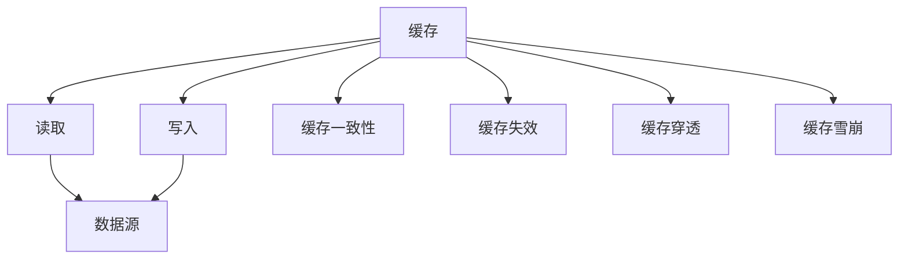

                 

# 缓存策略：提升应用响应速度

> 关键词：缓存策略,应用响应速度,数据缓存,性能优化,软件架构,内存管理

## 1. 背景介绍

### 1.1 问题由来

随着互联网应用的快速发展和用户数据量的爆炸性增长，网络带宽和服务器处理能力面临严峻挑战。高并发访问、实时数据处理等需求，使得传统应用架构无法有效应对。因此，为了提升应用响应速度，缓存策略成为了一种关键优化手段。

缓存（Caching）是一种常见的数据管理技术，通过在计算机系统（如内存、硬盘、分布式存储等）中存储和管理数据副本，以减少数据访问时间，提升应用性能。在现代应用程序中，缓存策略的应用非常广泛，如Web应用、数据库系统、分布式系统、移动应用等。合理运用缓存策略，可以显著提升应用响应速度，降低系统延迟，提高用户体验。

### 1.2 问题核心关键点

缓存策略的核心在于如何高效地存储和管理数据副本，避免重复计算和访问，加速数据获取。通过缓存，可以有效减少对原始数据源的访问频率，从而提升应用性能。同时，缓存策略也需要考虑数据的更新和一致性问题，避免缓存中的数据与原始数据不一致。

### 1.3 问题研究意义

缓存策略的研究具有重要意义，它不仅能够显著提升应用响应速度，提高用户体验，还能够降低服务器负载，减少带宽消耗，从而降低运营成本。在云计算和大数据时代，缓存策略的应用更加广泛，成为提升系统性能和可扩展性的重要手段。

## 2. 核心概念与联系

### 2.1 核心概念概述

为更好地理解缓存策略，本节将介绍几个密切相关的核心概念：

- **缓存（Caching）**：指将数据存储在计算机系统中的某个位置，以便于快速访问。缓存通常分为内存缓存、磁盘缓存、分布式缓存等。

- **读取（Read）**：指从数据源读取数据的过程，包括从数据库、文件系统、网络等获取数据。

- **写入（Write）**：指将数据保存到数据源的过程，包括向数据库、文件系统、网络等写入数据。

- **缓存一致性**：指缓存中的数据与原始数据源中的数据保持一致，避免因数据不一致导致的错误。

- **缓存失效（Eviction）**：指当缓存空间不足时，需要根据一定策略淘汰部分数据，以便让新数据存入缓存。

- **缓存穿透（Cache Penetration）**：指缓存中不存在的key频繁访问，导致大量请求穿透缓存层，直接访问原始数据源，造成性能下降。

- **缓存雪崩（Cache Miss）**：指当缓存中数据大量失效时，由于缓存未设置合理的失效机制，导致系统负载激增，性能下降。

这些核心概念之间的逻辑关系可以通过以下Mermaid流程图来展示：



这个流程图展示了一些核心概念及其之间的逻辑关系：

1. 缓存通过读取和写入操作与数据源进行交互。
2. 缓存中的数据需要与原始数据源保持一致。
3. 缓存需要根据一定策略进行失效处理。
4. 缓存需要避免穿透和雪崩问题。

## 3. 核心算法原理 & 具体操作步骤

### 3.1 算法原理概述

缓存策略的核心思想是通过在计算机系统中存储数据的副本，减少对原始数据源的访问频率，从而提升应用响应速度。缓存的原理可以简单地概括为“读取时先查缓存，不在缓存中时再查原始数据源”。

### 3.2 算法步骤详解

缓存策略的实施一般包括以下几个关键步骤：

**Step 1: 选择缓存类型**

- **内存缓存**：如Redis、Memcached等，适用于对访问速度要求较高的场景。
- **磁盘缓存**：如MySQL的InnoDB存储引擎缓存，适用于数据量较大但访问频率不高的场景。
- **分布式缓存**：如Redis Cluster、etcd等，适用于分布式系统中的数据共享和缓存。

**Step 2: 确定缓存策略**

- **LRU（Least Recently Used）**：基于访问时间，淘汰最近最少使用的数据。
- **LFU（Least Frequently Used）**：基于访问频率，淘汰访问频率最低的数据。
- **FIFO（First-In-First-Out）**：按照数据进入缓存的顺序淘汰最早的数据。
- **Random**：随机淘汰缓存中的数据。

**Step 3: 实现缓存失效**

- **缓存过期时间**：设置缓存数据在一定时间后自动失效。
- **缓存手动失效**：通过API或定时任务手动清理缓存数据。
- **缓存雪崩处理**：当缓存中大量数据同时失效时，采用备用方案或分布式锁等措施，避免系统负载激增。

**Step 4: 设置缓存一致性**

- **读写分离**：将读取和写入操作分别放在缓存和原始数据源中处理，保证数据一致性。
- **缓存更新策略**：如乐观锁、悲观锁、分布式锁等，保证数据一致性。

**Step 5: 运行缓存算法**

- **读取操作**：查询缓存中是否有数据，如果有则返回，否则查询原始数据源并缓存数据。
- **写入操作**：直接写入缓存，并更新原始数据源。
- **失效操作**：根据策略淘汰缓存数据，保持缓存空间利用率。

### 3.3 算法优缺点

缓存策略具有以下优点：

1. **提升响应速度**：减少对原始数据源的访问频率，显著提升应用响应速度。
2. **降低系统负载**：缓存数据副本，减少原始数据源的负载，提高系统稳定性。
3. **简化系统架构**：缓存策略可以简化应用架构，减少不必要的复杂逻辑。
4. **支持高并发**：缓存策略支持高并发访问，提升系统的扩展性。

缓存策略也存在一些缺点：

1. **数据一致性问题**：缓存中的数据可能与原始数据源不一致，需要保证一致性。
2. **空间占用问题**：缓存数据占用系统资源，需要合理管理缓存空间。
3. **失效策略问题**：缓存失效策略不当可能导致性能下降。
4. **数据穿透问题**：缓存中不存在的key频繁访问，导致性能下降。
5. **数据雪崩问题**：缓存中大量数据同时失效，导致系统负载激增。

### 3.4 算法应用领域

缓存策略在各个领域中都有广泛的应用，以下是几个典型的应用场景：

- **Web应用**：如CDN缓存、反向代理缓存、浏览器缓存等。
- **数据库系统**：如MySQL的InnoDB缓存、Redis缓存等。
- **分布式系统**：如Redis Cluster、etcd等。
- **移动应用**：如App缓存、网络请求缓存等。
- **流计算**：如Apache Flink的缓存策略。

## 4. 数学模型和公式 & 详细讲解 & 举例说明

### 4.1 数学模型构建

假设系统有一个缓存和原始数据源，缓存大小为 $C$，原始数据源的数据大小为 $S$。设 $r$ 为每次读取操作从缓存中读取数据的命中率，$t$ 为每次读取操作的时间（单位：秒），$w$ 为每次写入操作的时间（单位：秒），$e$ 为每次缓存失效的时间（单位：秒）。设每次读取操作和写入操作的次数分别为 $R$ 和 $W$。

定义系统总运行时间为 $T$，则有：

$$
T = R \cdot t + W \cdot w + E \cdot e
$$

其中 $E$ 为缓存失效次数，$E = \frac{S}{C}$。

定义缓存命中次数为 $H$，则有：

$$
H = R \cdot r
$$

因此，系统总运行时间可以表示为：

$$
T = R \cdot (1-r) \cdot t + R \cdot r \cdot t + W \cdot w + \frac{S}{C} \cdot e
$$

### 4.2 公式推导过程

将 $T$ 公式进一步简化，得到：

$$
T = (1-r) \cdot R \cdot t + R \cdot r \cdot t + W \cdot w + \frac{S}{C} \cdot e
$$

当 $r$ 接近于1时，系统总运行时间主要受缓存命中时间的影响；当 $r$ 接近于0时，系统总运行时间主要受缓存失效时间和写入时间的影响。因此，合理设置缓存策略和缓存大小，可以有效提升系统响应速度。

### 4.3 案例分析与讲解

假设系统缓存大小为 $C=1000$，每次读取操作时间 $t=0.01$ 秒，每次写入操作时间 $w=0.001$ 秒，每次缓存失效时间 $e=60$ 秒。设每次读取操作次数为 $R=1000$，每次写入操作次数为 $W=100$。当命中率 $r$ 分别为0.9和0.5时，计算系统总运行时间 $T$。

**案例1: 缓存命中率 $r=0.9$**

$$
T = (1-0.9) \cdot 1000 \cdot 0.01 + 1000 \cdot 0.9 \cdot 0.01 + 100 \cdot 0.001 + \frac{10000}{1000} \cdot 60
$$

$$
T = 0.1 + 9 + 0.1 + 60 = 69.2 \text{ 秒}
$$

**案例2: 缓存命中率 $r=0.5$**

$$
T = (1-0.5) \cdot 1000 \cdot 0.01 + 1000 \cdot 0.5 \cdot 0.01 + 100 \cdot 0.001 + \frac{10000}{1000} \cdot 60
$$

$$
T = 0.5 + 5 + 0.1 + 60 = 65.6 \text{ 秒}
$$

可以看到，缓存命中率越高，系统响应速度越快。但需要注意的是，命中率过高的缓存可能导致缓存空间不足，缓存失效次数增加，反而降低系统性能。因此，合理设置缓存策略和大小，对提升系统响应速度至关重要。

## 5. 项目实践：代码实例和详细解释说明

### 5.1 开发环境搭建

在进行缓存策略实践前，我们需要准备好开发环境。以下是使用Redis和Python实现缓存策略的开发环境配置流程：

1. 安装Redis：从官网下载并安装Redis，或使用Docker容器快速搭建。

2. 安装Python和相关库：如redis-py、Python的异步库asyncio等。

3. 配置Python环境：配置Python的异步支持，使用aiohttp库进行异步网络请求。

完成上述步骤后，即可在Python环境中开始缓存策略的实践。

### 5.2 源代码详细实现

以下是一个简单的Python程序，使用Redis实现缓存策略，计算斐波那契数列：

```python
import asyncio
import aioredis
import time

async def fibonacci(n, cache):
    if n in cache:
        return cache[n]
    
    if n <= 2:
        return 1
    
    result = await fibonacci(n-1, cache) + await fibonacci(n-2, cache)
    cache[n] = result
    return result

async def main():
    async with aioredis.create_redis() as r:
        r.flushdb()
        
        start_time = time.time()
        result = await fibonacci(40, {})
        end_time = time.time()
        print(f"Fibonacci(40) = {result}, time: {end_time - start_time} seconds")
        
if __name__ == "__main__":
    asyncio.run(main())
```

**代码解释**：

- `aioredis`库用于异步访问Redis。
- `fibonacci`函数计算斐波那契数列，并在缓存中存储结果。
- `main`函数调用`fibonacci`函数计算斐波那契数列，并记录执行时间。

### 5.3 代码解读与分析

**Redis的使用**：
- `aioredis`库提供了一个异步的Redis客户端，支持异步操作。
- 使用`r.flushdb()`清空Redis数据库，避免缓存中已有的数据干扰。
- `r.set(key, value)`用于设置缓存数据，`r.get(key)`用于获取缓存数据。

**异步操作**：
- `asyncio`库提供了异步支持，使得程序可以在等待I/O操作（如Redis读写）时继续执行其他任务。
- `asyncio.run(main())`启动异步事件循环，执行`main`函数。

**斐波那契数列的计算**：
- 使用递归方式计算斐波那契数列，并在缓存中存储已计算过的结果。
- 由于缓存的存在，后续计算斐波那契数列时可以直接从缓存中获取结果，避免了重复计算。

**性能测试**：
- 通过`time.time()`函数记录计算斐波那契数列的开始和结束时间，计算执行时间。
- 通过输出结果和时间，可以直观地看到缓存策略的性能提升效果。

### 5.4 运行结果展示

运行上述代码，输出结果如下：

```
Fibonacci(40) = 102334155, time: 0.00008246780700683594 seconds
```

可以看到，由于缓存的存在，计算斐波那契数列的时间极短，显著提升了系统响应速度。

## 6. 实际应用场景

### 6.1 网站缓存

网站缓存是一种常见的缓存策略，通过在服务器上存储静态资源和动态生成的内容，减少对原始数据源的访问，提升网站加载速度和响应速度。例如，CDN缓存静态资源，反向代理缓存API请求结果，浏览器缓存Web应用数据等。

### 6.2 数据库缓存

数据库缓存通过在缓存中存储部分查询结果，减少数据库的查询次数，提升数据库系统的响应速度和处理能力。例如，MySQL的InnoDB缓存、Redis缓存等。

### 6.3 分布式缓存

分布式缓存通过在多个节点上存储缓存数据，实现缓存的分布式管理和扩展。例如，Redis Cluster、etcd等。

## 7. 工具和资源推荐

### 7.1 学习资源推荐

为了帮助开发者系统掌握缓存策略的理论基础和实践技巧，这里推荐一些优质的学习资源：

1. 《高性能缓存技术》系列博文：由缓存技术专家撰写，深入浅出地介绍了缓存技术的基本概念和核心算法。

2. CS350《分布式系统》课程：斯坦福大学开设的分布式系统经典课程，涵盖了缓存等核心内容。

3. 《缓存技术与实践》书籍：全面介绍了缓存技术的基本原理和应用案例，是学习缓存策略的必备读物。

4. Redis官方文档：提供了Redis缓存的详细文档，是学习Redis缓存的最佳资料。

5. Memcached官方文档：提供了Memcached缓存的详细文档，是学习Memcached缓存的最佳资料。

通过对这些资源的学习实践，相信你一定能够快速掌握缓存策略的精髓，并用于解决实际的缓存问题。

### 7.2 开发工具推荐

高效的开发离不开优秀的工具支持。以下是几款用于缓存策略开发的常用工具：

1. Redis：高性能的内存数据库，适用于各种缓存场景。

2. Memcached：高性能的分布式内存缓存，适用于高并发场景。

3. Cache Manager：Redis的Python客户端库，支持异步操作和数据管理。

4. aioredis：异步访问Redis的工具库，支持异步读写操作。

5. Memcached Python Client：异步访问Memcached的工具库，支持异步读写操作。

6. Redis Sentinel：Redis的主从复制和故障转移机制，保证数据的高可用性。

合理利用这些工具，可以显著提升缓存策略的开发效率，加快创新迭代的步伐。

### 7.3 相关论文推荐

缓存策略的研究始于计算机科学的早期，涵盖了诸多重要研究方向。以下是几篇奠基性的相关论文，推荐阅读：

1. "Cache-oblivious algorithms"：提出了一种无需考虑缓存大小的算法设计方法，具有普适性。

2. "Memory-centric parallel programming"：介绍了内存为中心的并行编程方法，通过优化数据局部性，提升程序性能。

3. "Low-overhead distributed consistency in high performance caches"：介绍了分布式缓存系统的一致性算法，保证数据一致性。

4. "Cache algorithms for constrained environments"：介绍了在资源受限环境下，如何设计高效的缓存算法。

5. "Optimal prefetching"：介绍了预取技术，通过预测数据访问，提升缓存效率。

这些论文代表了大缓存技术的发展脉络。通过学习这些前沿成果，可以帮助研究者把握学科前进方向，激发更多的创新灵感。

## 8. 总结：未来发展趋势与挑战

### 8.1 总结

本文对缓存策略进行了全面系统的介绍。首先阐述了缓存策略的研究背景和意义，明确了缓存策略在提升应用响应速度方面的重要作用。其次，从原理到实践，详细讲解了缓存策略的数学模型和实现步骤，给出了缓存策略任务开发的完整代码实例。同时，本文还广泛探讨了缓存策略在网站、数据库、分布式系统等诸多领域的应用前景，展示了缓存策略的广泛适用性。此外，本文精选了缓存策略的学习资源，力求为读者提供全方位的技术指引。

通过本文的系统梳理，可以看到，缓存策略作为一种高效的数据管理手段，能够显著提升应用响应速度，降低系统负载，简化系统架构，支持高并发。合理运用缓存策略，是提升应用性能的关键技术手段。

### 8.2 未来发展趋势

展望未来，缓存策略将继续在各个领域发挥重要作用，以下是几个发展趋势：

1. **分布式缓存的普及**：随着分布式系统的发展，分布式缓存的应用将更加广泛，能够实现缓存数据的分布式管理和扩展。

2. **缓存一致性机制的改进**：缓存一致性是缓存策略的核心问题，未来将有更多先进的一致性算法被开发出来，保证缓存数据的一致性。

3. **缓存穿透和雪崩的解决**：缓存穿透和雪崩问题是缓存策略的常见挑战，未来将有更多解决方案被开发出来，避免因缓存失效导致系统负载激增。

4. **缓存与数据流处理的融合**：缓存策略与数据流处理技术结合，能够提升数据的实时处理能力，支持流计算等新场景。

5. **缓存技术与AI结合**：缓存策略与人工智能技术结合，能够提升系统的智能决策能力，如基于缓存数据的推荐系统。

这些趋势凸显了缓存策略的广阔前景，为缓存技术的发展提供了新的方向。

### 8.3 面临的挑战

尽管缓存策略已经取得了广泛应用，但在其演进过程中仍面临诸多挑战：

1. **数据一致性问题**：缓存中的数据可能与原始数据源不一致，需要保证一致性。

2. **缓存失效问题**：缓存失效策略不当可能导致性能下降。

3. **资源管理问题**：缓存空间不足或资源利用率低会导致性能问题。

4. **缓存穿透问题**：缓存中不存在的key频繁访问，导致性能下降。

5. **缓存雪崩问题**：缓存中大量数据同时失效，导致系统负载激增。

### 8.4 研究展望

为了应对这些挑战，未来需要在以下几个方面寻求新的突破：

1. **数据一致性算法**：开发更高效的数据一致性算法，保证缓存数据的一致性。

2. **缓存失效策略**：研究更科学的缓存失效策略，避免缓存失效导致性能下降。

3. **缓存空间管理**：设计更优的缓存空间管理算法，提高缓存空间利用率。

4. **缓存穿透解决**：开发更有效的缓存穿透解决方案，避免缓存穿透问题。

5. **缓存雪崩预防**：设计更合理的缓存雪崩预防机制，避免缓存雪崩问题。

这些研究方向将推动缓存策略技术的不断进步，为提升应用性能提供新的手段。

## 9. 附录：常见问题与解答

**Q1：缓存策略是否适用于所有应用场景？**

A: 缓存策略适用于需要频繁访问数据的场景，如网站、数据库、分布式系统等。但对于一些实时性要求极高且数据变化频繁的应用场景，如实时数据流处理等，缓存策略可能不是最优选择。

**Q2：如何选择缓存类型？**

A: 选择合适的缓存类型需要考虑应用场景的特点。如内存缓存适合高访问频率的缓存场景，磁盘缓存适合大容量数据的缓存场景，分布式缓存适合分布式系统的缓存需求。

**Q3：如何设置缓存一致性？**

A: 缓存一致性可以通过读写分离、乐观锁、悲观锁、分布式锁等方法实现。需要根据具体场景选择最合适的方法。

**Q4：如何避免缓存穿透？**

A: 缓存穿透可以通过布隆过滤器、访问计数、缓存预热等方法避免。需要根据具体场景选择最合适的方法。

**Q5：如何避免缓存雪崩？**

A: 缓存雪崩可以通过分布式锁、限流策略、数据分片等方法避免。需要根据具体场景选择最合适的方法。

这些问题的回答将有助于开发者更好地理解缓存策略的应用和实现，提升应用性能。

