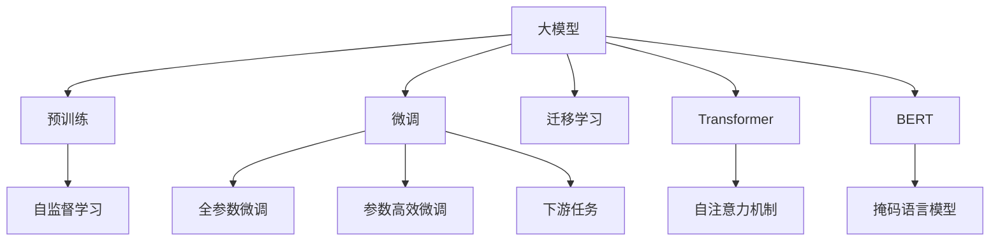

                 

# 美国大模型公司的现状与未来

> 关键词：大模型,OpenAI,GPT,Google,Baidu

## 1. 背景介绍

### 1.1 问题由来
近年来，美国大模型公司如OpenAI、Google等，凭借其在深度学习、自然语言处理（NLP）领域的长期积累和技术创新，迅速崛起。这些公司不仅推出了众多高性能的预训练语言模型，还在实际应用中取得了显著的进展。从聊天机器人到自动摘要，从机器翻译到对话系统，美国大模型公司正在深刻地改变着我们与计算机交互的方式。

然而，面对日益激烈的行业竞争和不断变化的市场需求，大模型公司如何持续创新、提升竞争力，是当前亟需关注的重要课题。本文将对美国大模型公司的现状进行全面梳理，探讨其在技术、市场、产品、商业模式等方面的现状，并结合未来发展趋势，提出一些建议和展望。

### 1.2 问题核心关键点
大模型公司面临的核心问题包括：

- **技术创新**：如何在保持技术领先的同时，应对算法瓶颈、数据隐私、计算资源等挑战？
- **市场竞争**：如何应对来自Google、Microsoft等竞争对手的挑战，拓展市场份额？
- **产品多样性**：如何在现有成功产品的基础上，推出更多具有差异化竞争优势的新产品？
- **商业模式**：如何在开放开源和私有商业化之间找到平衡，满足不同客户的需求？

通过回答这些问题，可以更全面地了解美国大模型公司的现状，并展望其未来发展。

## 2. 核心概念与联系

### 2.1 核心概念概述

为更好地理解美国大模型公司的现状，本节将介绍几个密切相关的核心概念：

- **大模型(Large Model)**：指包含数亿甚至数十亿参数的深度学习模型，能够处理复杂的语言、图像、语音等数据。大模型通常通过预训练和微调的方式获得应用领域的知识。

- **预训练(Pre-training)**：指在大规模无标签数据上，通过自监督学习任务训练模型的过程。预训练可以使模型学习到通用的语言或视觉特征，为下游任务提供强大的基础。

- **微调(Fine-tuning)**：指在预训练模型的基础上，使用下游任务的少量标注数据进行有监督学习，优化模型在该任务上的性能。微调是提升模型特定任务能力的有效方式。

- **迁移学习(Transfer Learning)**：指将一个领域学习到的知识，迁移到另一个不同但相关的领域中进行学习。大模型公司通常采用预训练-微调的方式，实现模型在多个任务间的迁移。

- **Transformer**：一种基于自注意力机制的深度学习模型，广泛应用于NLP领域。Transformer模型在处理序列数据时具有出色的表现，成为大模型公司的主力架构。

- **GPT系列**：由OpenAI开发的一系列预训练语言模型，包括GPT-1、GPT-2、GPT-3等，具有较强的语言生成能力。

- **BERT**：由Google开发的一种预训练语言模型，通过掩码语言模型等任务学习到丰富的语义表示。

### 2.2 核心概念原理和架构的 Mermaid 流程图(Mermaid 流程节点中不要有括号、逗号等特殊字符)



这个流程图展示了核心概念之间的联系：

1. 大模型通过预训练获得基础能力。
2. 微调优化模型在特定任务上的性能。
3. 迁移学习将知识从预训练模型迁移到下游任务。
4. 全参数微调和参数高效微调两种微调方式。
5. Transformer和BERT两种预训练模型架构。
6. 自注意力机制是Transformer的核心。
7. 掩码语言模型是BERT的主要预训练任务。
8. 下游任务涉及分类、生成、匹配等多种类型。

这些概念共同构成了大模型公司的技术基础，使其能够在各种应用场景下发挥强大的语言理解和生成能力。

## 3. 核心算法原理 & 具体操作步骤

### 3.1 算法原理概述

美国大模型公司所采用的算法原理主要包括预训练-微调和迁移学习。其中，预训练-微调是指在大量无标签数据上进行预训练，然后在特定任务上使用少量标注数据进行微调，以提升模型在该任务上的性能。迁移学习则是指将一个领域学到的知识迁移到另一个相关领域，以提升模型在新任务上的性能。

### 3.2 算法步骤详解

大模型公司通常采用以下步骤进行算法开发和应用：

**Step 1: 收集和准备数据**
- 收集大规模无标签数据，用于预训练。
- 收集下游任务的标注数据，用于微调。
- 数据需要进行清洗和预处理，确保数据质量和一致性。

**Step 2: 预训练模型构建**
- 选择合适的模型架构，如Transformer。
- 定义预训练任务，如掩码语言模型、next sentence prediction等。
- 在预训练数据上进行训练，学习通用的语言表示。

**Step 3: 微调模型适配**
- 定义任务适配层，如全连接层、softmax层等。
- 选择合适的优化器和超参数，如AdamW、SGD等。
- 使用标注数据对预训练模型进行微调，优化模型在特定任务上的性能。

**Step 4: 评估和优化**
- 在验证集上评估模型性能，监控指标如准确率、召回率等。
- 根据评估结果调整模型参数，进行迭代优化。
- 在测试集上再次评估模型性能，确认微调效果。

**Step 5: 应用和部署**
- 将微调后的模型部署到实际应用系统中，进行推理和预测。
- 监控模型性能，进行必要的维护和优化。
- 不断收集新数据，进行持续学习和微调。

### 3.3 算法优缺点

大模型公司在算法上主要采用预训练-微调和迁移学习的范式，具有以下优点：

- **高效性**：通过预训练学习到通用的语言表示，然后在特定任务上使用少量标注数据进行微调，大大减少了标注数据的需求和训练时间。
- **通用性**：通过迁移学习，模型能够快速适应新任务，提升在多个领域的应用能力。
- **可解释性**：预训练和微调的过程透明，模型决策过程可以解释，有助于提升模型的可信度。

但同时，也存在一些缺点：

- **资源需求高**：预训练和微调需要大量的计算资源，如GPU、TPU等，成本较高。
- **参数量大**：大模型通常包含数亿甚至数十亿参数，增加了模型的训练和推理复杂度。
- **数据隐私问题**：预训练模型往往需要大量数据，如何保护用户隐私是一个重要问题。
- **泛化能力不足**：大模型通常在训练数据集上表现良好，但在实际应用中可能泛化能力有限，对小样本数据的适应能力较弱。

### 3.4 算法应用领域

大模型公司在技术上已经广泛应用于多个领域，具体如下：

- **自然语言处理**：包括文本分类、情感分析、机器翻译、问答系统、文本摘要、命名实体识别等。
- **计算机视觉**：如图像分类、目标检测、图像生成等。
- **语音识别**：如自动语音识别、语音合成等。
- **推荐系统**：如个性化推荐、广告推荐等。
- **医疗健康**：如疾病诊断、药物研发等。
- **金融科技**：如风险评估、欺诈检测等。
- **智能客服**：如智能客服机器人、智能对话等。

这些应用场景展示了美国大模型公司的广泛影响力，推动了各行业的智能化发展。

## 4. 数学模型和公式 & 详细讲解 & 举例说明

### 4.1 数学模型构建

大模型公司通常使用Transformer架构进行预训练和微调。Transformer模型由多个编码器-解码器层构成，每个层包含多头自注意力机制和前馈神经网络。

假设输入序列为 $x_1, x_2, ..., x_n$，输出序列为 $y_1, y_2, ..., y_n$。使用Transformer模型进行预训练的数学模型可以表示为：

$$
y_i = \text{Decoder}(\text{Encoder}(x_i), x_{< i}, x_{i+1, ... , n}, y_{< i})
$$

其中，Encoder表示自编码器部分，Decoder表示自回归解码器部分。Transformer的预训练任务包括掩码语言模型和next sentence prediction等。

### 4.2 公式推导过程

以掩码语言模型为例，其数学推导如下：

假设输入序列 $x_1, x_2, ..., x_n$ 中的某个位置被掩码，记为 $x_{\text{mask}}$。掩码语言模型的目标是通过预测 $x_{\text{mask}}$ 处的词汇，重构整个序列。

假设词汇表大小为 $V$，预训练模型的输入为 $x_1, x_2, ..., x_n$，输出为 $\hat{y}_{\text{mask}}$，其中 $\hat{y}_{\text{mask}}$ 为预测的词汇。掩码语言模型的目标函数为：

$$
L = -\frac{1}{N} \sum_{i=1}^N \log p(y_i \mid x_{<i}, x_{>i}, y_{<i})
$$

其中 $p(y_i \mid x_{<i}, x_{>i}, y_{<i})$ 表示条件概率分布。

### 4.3 案例分析与讲解

以GPT-3为例，GPT-3是OpenAI开发的预训练语言模型，参数量达到175亿，可以生成高质量的文本。其预训练过程包括：

1. 使用大规模无标签文本进行掩码语言模型预训练。
2. 使用大规模标注数据进行微调，优化模型在特定任务上的性能。
3. 提供基于提示的学习接口，让用户可以输入一段文本，生成新的文本。

通过这些技术手段，GPT-3在文本生成、翻译、问答等方面取得了显著的效果，广泛应用于各种NLP任务。

## 5. 项目实践：代码实例和详细解释说明

### 5.1 开发环境搭建

要在实际环境中使用大模型，需要搭建相应的开发环境。以下是使用Python进行PyTorch开发的环境配置流程：

1. 安装Anaconda：从官网下载并安装Anaconda，用于创建独立的Python环境。

2. 创建并激活虚拟环境：
```bash
conda create -n pytorch-env python=3.8 
conda activate pytorch-env
```

3. 安装PyTorch：根据CUDA版本，从官网获取对应的安装命令。例如：
```bash
conda install pytorch torchvision torchaudio cudatoolkit=11.1 -c pytorch -c conda-forge
```

4. 安装Transformers库：
```bash
pip install transformers
```

5. 安装各类工具包：
```bash
pip install numpy pandas scikit-learn matplotlib tqdm jupyter notebook ipython
```

完成上述步骤后，即可在`pytorch-env`环境中开始微调实践。

### 5.2 源代码详细实现

这里我们以GPT-3进行文本生成为例，展示使用PyTorch和Transformers库进行代码实现的完整过程。

首先，定义预训练模型：

```python
from transformers import GPT3LMHeadModel

model = GPT3LMHeadModel.from_pretrained('gpt3')
```

然后，定义优化器和损失函数：

```python
from transformers import AdamW
import torch

optimizer = AdamW(model.parameters(), lr=1e-5)
loss_fn = torch.nn.CrossEntropyLoss()
```

接下来，定义数据预处理函数：

```python
def tokenize(text):
    tokenizer = model.tokenizer
    return tokenizer(text, return_tensors='pt')

def generate_text(model, text, max_length=100):
    input_ids = tokenize(text)
    with torch.no_grad():
        outputs = model.generate(input_ids, max_length=max_length, do_sample=True, top_k=50, top_p=0.95)
    return tokenizer.decode(outputs[0], skip_special_tokens=True)
```

最后，启动模型训练流程并在测试集上评估：

```python
for epoch in range(10):
    for i, text in enumerate(train_dataset):
        input_ids = tokenize(text)
        labels = torch.tensor(input_ids)[:, :-1]
        outputs = model(input_ids, labels=labels)
        loss = loss_fn(outputs.logits, labels)
        optimizer.zero_grad()
        loss.backward()
        optimizer.step()

    dev_text = next(iter(dev_dataset))
    print(generate_text(model, dev_text))
```

以上就是使用PyTorch和Transformers库进行GPT-3微调的完整代码实现。可以看到，通过使用Transformers库，我们可以非常便捷地使用预训练模型，进行微调和推理。

### 5.3 代码解读与分析

让我们再详细解读一下关键代码的实现细节：

**tokenize函数**：
- 定义了一个函数，用于对输入文本进行分词和编码，返回模型的输入ids。

**generate_text函数**：
- 定义了一个函数，用于生成新的文本。函数接受预训练模型、输入文本和最大生成长度作为参数。使用模型的generate方法进行文本生成，最后使用tokenizer解码生成文本。

**训练流程**：
- 定义训练的轮数和批次大小，使用训练集进行迭代训练。
- 在每个批次上计算损失并反向传播更新模型参数。
- 在验证集上评估生成文本的质量，输出结果。

以上代码展示了使用PyTorch和Transformers库进行GPT-3微调的基本流程，通过简单易懂的方式，可以帮助开发者快速上手微调大模型。

## 6. 实际应用场景

### 6.1 智能客服系统

基于大模型公司的技术，智能客服系统能够高效处理用户的咨询请求。通过将历史客服对话数据进行预训练和微调，智能客服能够自动理解用户意图，并提供相应的回答。这不仅提高了客服响应速度，还大大降低了人工客服的运营成本。

### 6.2 金融舆情监测

大模型公司通过预训练和微调，实现了对金融舆情的自动化监测。通过对金融领域的新闻、报告和评论进行预训练和微调，模型能够自动识别舆情的情感倾向和主题。这为金融机构提供了实时监测和预警功能，有助于及时应对市场波动和风险。

### 6.3 个性化推荐系统

基于大模型公司的推荐算法，个性化推荐系统能够根据用户的历史行为和兴趣，推荐符合其需求的商品或内容。通过将用户行为数据进行预训练和微调，模型能够学习到用户的个性化特征，从而提供更加精准和多样化的推荐结果。

### 6.4 未来应用展望

未来，大模型公司在技术上将面临更多挑战和机遇。

**技术创新**：
- **自监督学习**：利用自监督任务，进一步提升模型的通用性和泛化能力。
- **多模态学习**：将视觉、语音等多模态数据与文本数据结合，提升模型的多任务处理能力。
- **元学习**：研究元学习算法，使模型能够快速适应新任务。

**市场竞争**：
- **开源与商业化**：在大规模开源基础上，推出商业化模型，满足不同用户的需求。
- **合作与生态**：与其他公司和生态系统合作，构建更广泛的应用场景。

**产品多样性**：
- **生成式AI**：推出更多的生成式AI产品，如自动写作、虚拟角色等。
- **可解释性**：提升模型的可解释性，增强用户的信任和接受度。

**商业模式**：
- **按需付费**：根据用户的使用情况，提供灵活的收费模式。
- **服务即代码**：通过API接口，提供快速部署和集成服务。

这些方向展示了大模型公司未来的发展潜力和应用前景，值得关注和期待。

## 7. 工具和资源推荐

### 7.1 学习资源推荐

为了帮助开发者系统掌握大模型公司的技术，这里推荐一些优质的学习资源：

1. 《Transformer from Scratch》系列博文：由大模型公司专家撰写，深入浅出地介绍了Transformer原理和实现。

2. 《Natural Language Processing with Transformers》书籍：由大模型公司的作者所著，全面介绍了使用Transformer进行NLP任务开发的方法。

3. 《Machine Learning Mastery》博客：提供各种机器学习和深度学习的教程，适合初学者和进阶者。

4. CS224N《Deep Learning for Natural Language Processing》课程：斯坦福大学开设的NLP明星课程，有Lecture视频和配套作业。

5. Weights & Biases：模型训练的实验跟踪工具，可以记录和可视化模型训练过程中的各项指标。

这些资源可以帮助开发者全面了解大模型公司的技术，提升其实践能力。

### 7.2 开发工具推荐

在开发过程中，使用以下工具可以提高效率：

1. PyTorch：基于Python的开源深度学习框架，灵活动态的计算图，适合快速迭代研究。

2. TensorFlow：由Google主导开发的开源深度学习框架，生产部署方便，适合大规模工程应用。

3. Transformers库：大模型公司提供的NLP工具库，集成了多个SOTA语言模型，支持PyTorch和TensorFlow。

4. Jupyter Notebook：免费的交互式开发环境，方便进行模型训练和可视化。

5. TensorBoard：TensorFlow配套的可视化工具，可以实时监测模型训练状态，并提供丰富的图表呈现方式。

这些工具可以帮助开发者更高效地进行模型训练和推理，加速研究进展。

### 7.3 相关论文推荐

大模型公司在技术上已经取得了很多突破，以下是几篇奠基性的相关论文，推荐阅读：

1. Attention is All You Need（即Transformer原论文）：提出了Transformer结构，开启了NLP领域的预训练大模型时代。

2. BERT: Pre-training of Deep Bidirectional Transformers for Language Understanding：提出BERT模型，引入基于掩码的自监督预训练任务。

3. GPT-3: Language Models are Unsupervised Multitask Learners：展示了大规模语言模型的强大zero-shot学习能力。

4. Transformer-XL: Attentive Language Models beyond a Fixed-Length Context：提出Transformer-XL模型，解决长文本生成的问题。

5. T5: Exploring the Limits of Transfer Learning with a Unified Text-to-Text Transformer：提出T5模型，提供统一的文本生成和理解框架。

这些论文展示了大模型公司在技术上的深厚积累和不断创新，值得深入学习和研究。

## 8. 总结：未来发展趋势与挑战

### 8.1 总结

本文对美国大模型公司的现状进行了全面梳理，涵盖了技术、市场、产品、商业模式等方面。通过分析当前大模型公司的核心概念、算法原理和具体实现，展示了其在NLP领域的广泛应用和未来发展方向。

### 8.2 未来发展趋势

未来，大模型公司在技术上将持续创新，提升模型的性能和应用范围。具体趋势如下：

- **技术突破**：大模型公司将进一步优化模型架构，提升模型的泛化能力和性能。
- **应用拓展**：在现有成功的基础上，推出更多具有差异化竞争优势的新产品。
- **市场竞争**：与其他公司和生态系统合作，构建更广泛的应用场景。
- **商业模式**：探索新的商业模式，满足不同用户的需求。

### 8.3 面临的挑战

尽管大模型公司在技术上已经取得了显著进展，但在未来发展过程中，仍面临以下挑战：

- **资源需求**：大规模模型需要大量的计算资源和存储空间，成本较高。
- **数据隐私**：预训练模型需要大量数据，如何保护用户隐私是一个重要问题。
- **算法鲁棒性**：模型在面对噪声数据和对抗样本时，泛化能力有限。
- **可解释性**：大模型缺乏可解释性，难以对其内部工作机制进行理解和调试。

### 8.4 研究展望

为了应对这些挑战，大模型公司需要继续探索新技术和方法，提升模型的性能和可靠性。具体研究展望如下：

- **自监督学习**：利用自监督任务，进一步提升模型的泛化能力。
- **多模态学习**：将视觉、语音等多模态数据与文本数据结合，提升模型的多任务处理能力。
- **元学习**：研究元学习算法，使模型能够快速适应新任务。
- **生成式AI**：推出更多的生成式AI产品，如自动写作、虚拟角色等。
- **可解释性**：提升模型的可解释性，增强用户的信任和接受度。

这些方向展示了大模型公司未来的发展潜力和应用前景，值得关注和期待。

## 9. 附录：常见问题与解答

**Q1：大模型公司如何平衡开源和商业化？**

A: 大模型公司通常在大规模开源的基础上，推出商业化的模型和工具，满足不同用户的需求。这种平衡方式有助于扩大用户基础，同时保护商业利益。

**Q2：大模型公司在技术上如何保持领先？**

A: 大模型公司通过持续投入研发，引入新的技术和方法，不断优化和改进现有模型。同时，通过与学术界和工业界的合作，推动技术创新。

**Q3：大模型公司的预训练和微调需要哪些资源？**

A: 大模型公司的预训练和微调需要大量的计算资源，如GPU、TPU等。同时，需要大量的数据进行训练，保护用户隐私也是一个重要问题。

**Q4：大模型公司在落地应用时需要注意哪些问题？**

A: 大模型公司在落地应用时，需要注意模型裁剪、量化加速、服务化封装、弹性伸缩、监控告警、安全防护等技术问题，确保模型的稳定性和安全性。

**Q5：大模型公司在产品多样化方面有哪些策略？**

A: 大模型公司在产品多样化方面，可以通过推出生成式AI产品、提升模型的可解释性、探索新的商业模式等策略，满足不同用户的需求。

通过本文的系统梳理，可以看到美国大模型公司在技术、市场、产品、商业模式等方面的现状，并展望其未来的发展趋势和面临的挑战。相信在未来，大模型公司将持续创新，引领NLP技术的进步，为更多领域带来智能化变革。

---

作者：禅与计算机程序设计艺术 / Zen and the Art of Computer Programming

