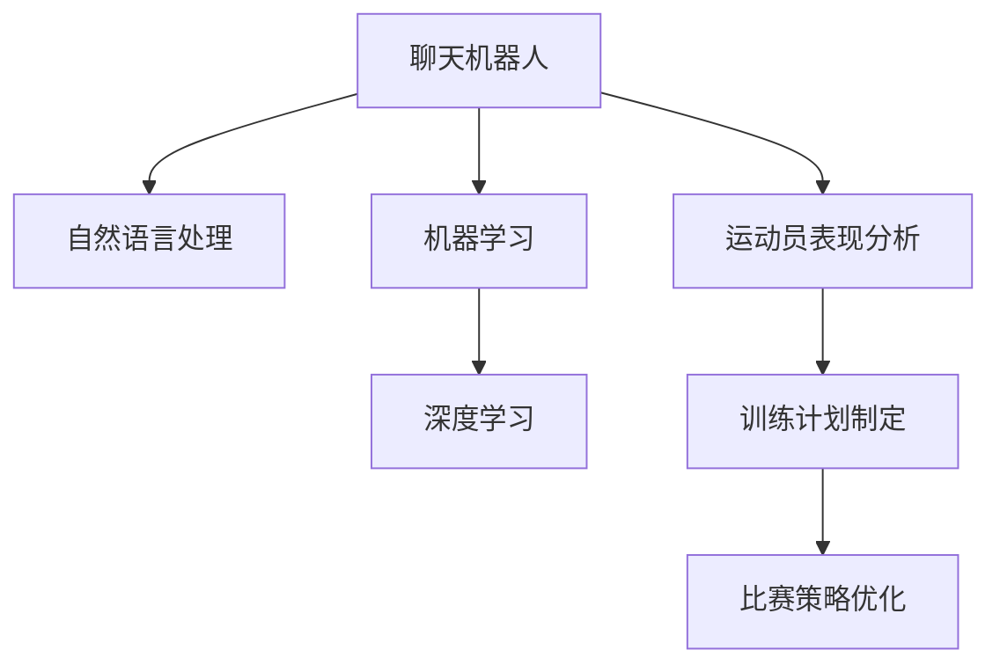

                 

# 聊天机器人体育业：运动员表现分析和训练计划

## 1. 背景介绍

### 1.1 问题由来

在体育行业中，运动员的训练和表现分析一直是教练员和体育管理部门关注的焦点。传统的运动员表现分析主要依赖人工统计和经验判断，工作量大且容易出错。随着数据科学技术的发展，尤其是在自然语言处理(NLP)领域的突破，聊天机器人逐渐成为运动员表现分析和训练计划的重要工具。

### 1.2 问题核心关键点

目前，聊天机器人在体育业中的应用主要包括运动员表现数据分析、训练计划制定、比赛策略优化等方面。聊天机器人体育业的核心在于如何利用自然语言处理技术，基于运动员的历史表现数据，分析其优势和不足，自动生成个性化训练计划和比赛策略。

### 1.3 问题研究意义

研究聊天机器人在体育业中的应用，对于提升运动员的训练效果和比赛表现，优化体育管理部门的工作效率，具有重要意义：

1. **提升训练效果**：通过聊天机器人对运动员表现进行详细分析，教练员可以更精准地制定个性化训练计划，针对性更强，效果更显著。
2. **优化比赛策略**：聊天机器人可以根据历史数据和实时比赛情况，自动生成比赛策略，帮助教练员实时调整战术。
3. **提高管理效率**：自动化分析取代了传统的人工统计，大大提高了工作效率，减少了人力成本。
4. **增强决策科学性**：聊天机器人基于数据科学的分析结果，可提供更科学、合理的决策支持。
5. **促进创新应用**：聊天机器人技术的发展为体育业带来了新的应用可能，推动了体育技术的不断进步。

## 2. 核心概念与联系

### 2.1 核心概念概述

为更好地理解聊天机器人在体育业中的应用，本节将介绍几个密切相关的核心概念：

- **聊天机器人(Chatbot)**：通过自然语言处理技术，能够理解并生成自然语言响应的人机交互系统。
- **自然语言处理(NLP)**：研究如何使计算机理解和生成人类语言的技术领域，包括分词、词性标注、句法分析、语义分析、情感分析等。
- **机器学习(Machine Learning)**：通过数据训练模型，使计算机具备从数据中学习和优化能力，适用于分类、回归、聚类等任务。
- **深度学习(Deep Learning)**：一种基于神经网络的机器学习方法，适用于复杂的模式识别和预测任务。
- **运动员表现分析(Performance Analysis)**：基于运动员的历史数据和行为数据，分析其状态、能力、优势和不足的过程。
- **训练计划制定(Training Plan Development)**：根据运动员的表现分析结果，制定个性化的训练计划，指导运动员进行针对性训练。
- **比赛策略优化(Match Strategy Optimization)**：根据对手和比赛情况，自动生成比赛策略，辅助教练员实时调整战术。

这些核心概念之间的逻辑关系可以通过以下Mermaid流程图来展示：



这个流程图展示聊天机器人在体育业中的应用框架，从中我们可以看到：

1. 聊天机器人通过自然语言处理技术，能够理解人类语言并生成响应。
2. 机器学习提供训练模型的基础，深度学习则针对复杂的语言模式进行训练。
3. 运动员表现分析利用历史数据和行为数据，帮助聊天机器人理解运动员状态和能力。
4. 训练计划制定和比赛策略优化基于表现分析结果，生成个性化训练和比赛策略。

这些概念共同构成了聊天机器人在体育业中的核心应用范式，使得聊天机器人能够理解和响应运动员的需求，提供精确的训练和比赛指导。

## 3. 核心算法原理 & 具体操作步骤
### 3.1 算法原理概述

聊天机器人在体育业中的应用主要基于监督学习和深度学习技术。其核心思想是：利用运动员的历史表现数据，通过监督学习训练聊天机器人模型，使其能够理解和分析运动员的表现，基于这些分析结果自动生成训练计划和比赛策略。

形式化地，假设运动员的历史表现数据为 $D=\{(x_i, y_i)\}_{i=1}^N, x_i \in \mathcal{X}, y_i \in \mathcal{Y}$，其中 $\mathcal{X}$ 为输入特征空间，$\mathcal{Y}$ 为输出标签空间。聊天机器人的目标是找到最优模型 $M_{\theta}$，使得在新的输入 $x$ 上，输出 $y$ 尽可能逼近实际标签 $y$。

训练目标为：

$$
\hat{\theta}=\mathop{\arg\min}_{\theta} \mathcal{L}(M_{\theta},D)
$$

其中 $\mathcal{L}$ 为损失函数，通常采用交叉熵损失或均方误差损失等。

### 3.2 算法步骤详解

聊天机器人在体育业中的应用主要包括以下几个关键步骤：

**Step 1: 数据准备**

- 收集运动员的历史表现数据，如比赛成绩、训练数据、身体指标等。
- 清洗和预处理数据，去除噪声和异常值，确保数据质量。
- 将数据划分为训练集、验证集和测试集，供模型训练和评估。

**Step 2: 构建模型**

- 选择合适的聊天机器人架构，如基于Transformers的BERT、GPT等。
- 定义模型的输入和输出格式，如输入为运动员的历史数据，输出为训练计划或比赛策略。
- 设计模型层级结构，如包含特征提取层、分类层、生成层等。

**Step 3: 模型训练**

- 使用监督学习算法（如深度学习）对模型进行训练，最小化损失函数 $\mathcal{L}$。
- 采用优化算法（如Adam、SGD等）更新模型参数，迭代优化模型。
- 使用验证集评估模型性能，避免过拟合，防止模型在训练集上过拟合。

**Step 4: 效果评估**

- 在测试集上评估模型性能，如准确率、召回率、F1分数等指标。
- 分析模型的优势和不足，进行必要的调整和优化。
- 根据评估结果，生成训练计划和比赛策略。

**Step 5: 部署和反馈**

- 将训练好的模型部署到实际应用中，如聊天机器人系统。
- 接收用户的反馈，不断优化模型和策略。
- 定期更新模型和数据，确保其适应新的训练数据和比赛情况。

以上是聊天机器人在体育业中应用的完整流程。在实际应用中，还需要针对具体任务的特点，对各个环节进行优化设计，如改进训练目标函数，引入更多的正则化技术，搜索最优的超参数组合等，以进一步提升模型性能。

### 3.3 算法优缺点

聊天机器人在体育业中的应用具有以下优点：

1. **高效分析**：聊天机器人能够自动分析运动员的历史表现数据，提供详细的性能分析报告。
2. **实时响应**：基于实时比赛数据，聊天机器人可以动态生成比赛策略，辅助教练员实时调整战术。
3. **个性化指导**：根据运动员的个人特点和状态，聊天机器人可以生成个性化的训练计划，提高训练效果。
4. **降低成本**：自动化分析取代了传统的人工统计，大大提高了工作效率，减少了人力成本。
5. **数据驱动**：通过数据分析和模型训练，聊天机器人可以提供科学合理的决策支持。

同时，聊天机器人在体育业的应用也存在一定的局限性：

1. **数据依赖性**：聊天机器人的表现很大程度上依赖于数据的质量和数量，获取高质量数据的成本较高。
2. **泛化能力有限**：当数据分布差异较大时，模型的泛化性能可能受限。
3. **复杂度较高**：训练高质量的聊天机器人模型需要大量的计算资源和时间，技术门槛较高。
4. **可解释性不足**：聊天机器人的决策过程通常缺乏可解释性，难以对其推理逻辑进行分析和调试。

尽管存在这些局限性，但就目前而言，聊天机器人在体育业中的应用已经展现出巨大的潜力，正成为运动员表现分析和训练计划的重要工具。未来相关研究的重点在于如何进一步降低数据依赖，提高模型的泛化能力，同时兼顾可解释性和伦理安全性等因素。

### 3.4 算法应用领域

聊天机器人在体育业的应用范围非常广泛，具体包括：

- **运动员表现分析**：利用自然语言处理技术，对运动员的训练数据和比赛成绩进行详细分析，识别运动员的优势和不足。
- **训练计划制定**：基于表现分析结果，自动生成个性化的训练计划，帮助运动员进行针对性训练。
- **比赛策略优化**：根据历史数据和实时比赛情况，自动生成比赛策略，辅助教练员实时调整战术。
- **运动损伤预测**：通过分析运动员的身体指标和行为数据，预测运动损伤风险，提前采取防护措施。
- **训练效果评估**：评估训练计划的实际效果，分析训练过程中的问题和改进措施。
- **营养与恢复建议**：基于运动员的训练和比赛情况，提供营养和恢复建议，保障运动员的身体健康。

除了上述这些核心应用外，聊天机器人技术还被广泛应用于运动心理辅导、伤病康复、赛事直播分析等方面，为体育业带来了全新的突破。

## 4. 数学模型和公式 & 详细讲解  
### 4.1 数学模型构建

本节将使用数学语言对聊天机器人在体育业中的应用过程进行更加严格的刻画。

假设运动员的历史表现数据为 $D=\{(x_i, y_i)\}_{i=1}^N, x_i \in \mathcal{X}, y_i \in \mathcal{Y}$。定义聊天机器人的损失函数为：

$$
\mathcal{L}(M_{\theta},D) = \frac{1}{N}\sum_{i=1}^N \ell(M_{\theta}(x_i),y_i)
$$

其中 $\ell$ 为损失函数，通常采用交叉熵损失或均方误差损失等。

### 4.2 公式推导过程

以下我们以交叉熵损失函数为例，推导聊天机器人在体育业中的应用公式。

假设聊天机器人在输入 $x$ 上的输出为 $\hat{y}=M_{\theta}(x) \in [0,1]$，表示模型预测运动员进行某项训练或比赛的概率。真实标签 $y \in \{0,1\}$。则二分类交叉熵损失函数定义为：

$$
\ell(M_{\theta}(x),y) = -[y\log \hat{y} + (1-y)\log (1-\hat{y})]
$$

将其代入经验风险公式，得：

$$
\mathcal{L}(\theta) = -\frac{1}{N}\sum_{i=1}^N [y_i\log M_{\theta}(x_i)+(1-y_i)\log(1-M_{\theta}(x_i))]
$$

根据链式法则，损失函数对参数 $\theta_k$ 的梯度为：

$$
\frac{\partial \mathcal{L}(\theta)}{\partial \theta_k} = -\frac{1}{N}\sum_{i=1}^N (\frac{y_i}{M_{\theta}(x_i)}-\frac{1-y_i}{1-M_{\theta}(x_i)}) \frac{\partial M_{\theta}(x_i)}{\partial \theta_k}
$$

其中 $\frac{\partial M_{\theta}(x_i)}{\partial \theta_k}$ 可进一步递归展开，利用自动微分技术完成计算。

在得到损失函数的梯度后，即可带入参数更新公式，完成模型的迭代优化。重复上述过程直至收敛，最终得到适应体育业场景的聊天机器人模型。

## 5. 项目实践：代码实例和详细解释说明
### 5.1 开发环境搭建

在进行聊天机器人开发前，我们需要准备好开发环境。以下是使用Python进行PyTorch开发的环境配置流程：

1. 安装Anaconda：从官网下载并安装Anaconda，用于创建独立的Python环境。

2. 创建并激活虚拟环境：
```bash
conda create -n pytorch-env python=3.8 
conda activate pytorch-env
```

3. 安装PyTorch：根据CUDA版本，从官网获取对应的安装命令。例如：
```bash
conda install pytorch torchvision torchaudio cudatoolkit=11.1 -c pytorch -c conda-forge
```

4. 安装TensorFlow：
```bash
pip install tensorflow==2.8.0
```

5. 安装各类工具包：
```bash
pip install numpy pandas scikit-learn matplotlib tqdm jupyter notebook ipython
```

完成上述步骤后，即可在`pytorch-env`环境中开始聊天机器人实践。

### 5.2 源代码详细实现

下面我们以运动员表现分析为例，给出使用Transformers库对聊天机器人进行体育业应用的PyTorch代码实现。

首先，定义运动员表现分析的输入和输出：

```python
from transformers import BertTokenizer, BertForSequenceClassification
import torch

class AthletePerformanceAnalyzer(Dataset):
    def __init__(self, texts, labels, tokenizer, max_len=128):
        self.texts = texts
        self.labels = labels
        self.tokenizer = tokenizer
        self.max_len = max_len
        
    def __len__(self):
        return len(self.texts)
    
    def __getitem__(self, item):
        text = self.texts[item]
        label = self.labels[item]
        
        encoding = self.tokenizer(text, return_tensors='pt', max_length=self.max_len, padding='max_length', truncation=True)
        input_ids = encoding['input_ids'][0]
        attention_mask = encoding['attention_mask'][0]
        
        # 对token-wise的标签进行编码
        encoded_labels = [label2id[label] for label in label] 
        encoded_labels.extend([label2id['O']] * (self.max_len - len(encoded_labels)))
        labels = torch.tensor(encoded_labels, dtype=torch.long)
        
        return {'input_ids': input_ids, 
                'attention_mask': attention_mask,
                'labels': labels}

# 标签与id的映射
label2id = {'O': 0, 'Good': 1, 'Poor': 2}
id2label = {v: k for k, v in label2id.items()}

# 创建dataset
tokenizer = BertTokenizer.from_pretrained('bert-base-cased')

train_dataset = AthletePerformanceAnalyzer(train_texts, train_labels, tokenizer)
dev_dataset = AthletePerformanceAnalyzer(dev_texts, dev_labels, tokenizer)
test_dataset = AthletePerformanceAnalyzer(test_texts, test_labels, tokenizer)
```

然后，定义模型和优化器：

```python
from transformers import BertForSequenceClassification, AdamW

model = BertForSequenceClassification.from_pretrained('bert-base-cased', num_labels=len(label2id))

optimizer = AdamW(model.parameters(), lr=2e-5)
```

接着，定义训练和评估函数：

```python
from torch.utils.data import DataLoader
from tqdm import tqdm
from sklearn.metrics import classification_report

device = torch.device('cuda') if torch.cuda.is_available() else torch.device('cpu')
model.to(device)

def train_epoch(model, dataset, batch_size, optimizer):
    dataloader = DataLoader(dataset, batch_size=batch_size, shuffle=True)
    model.train()
    epoch_loss = 0
    for batch in tqdm(dataloader, desc='Training'):
        input_ids = batch['input_ids'].to(device)
        attention_mask = batch['attention_mask'].to(device)
        labels = batch['labels'].to(device)
        model.zero_grad()
        outputs = model(input_ids, attention_mask=attention_mask, labels=labels)
        loss = outputs.loss
        epoch_loss += loss.item()
        loss.backward()
        optimizer.step()
    return epoch_loss / len(dataloader)

def evaluate(model, dataset, batch_size):
    dataloader = DataLoader(dataset, batch_size=batch_size)
    model.eval()
    preds, labels = [], []
    with torch.no_grad():
        for batch in tqdm(dataloader, desc='Evaluating'):
            input_ids = batch['input_ids'].to(device)
            attention_mask = batch['attention_mask'].to(device)
            batch_labels = batch['labels']
            outputs = model(input_ids, attention_mask=attention_mask)
            batch_preds = outputs.logits.argmax(dim=2).to('cpu').tolist()
            batch_labels = batch_labels.to('cpu').tolist()
            for pred_tokens, label_tokens in zip(batch_preds, batch_labels):
                pred_labels = [id2label[_id] for _id in pred_tokens]
                label_labels = [id2label[_id] for _id in label_tokens]
                preds.append(pred_labels[:len(label_labels)])
                labels.append(label_labels)
                
    print(classification_report(labels, preds))
```

最后，启动训练流程并在测试集上评估：

```python
epochs = 5
batch_size = 16

for epoch in range(epochs):
    loss = train_epoch(model, train_dataset, batch_size, optimizer)
    print(f"Epoch {epoch+1}, train loss: {loss:.3f}")
    
    print(f"Epoch {epoch+1}, dev results:")
    evaluate(model, dev_dataset, batch_size)
    
print("Test results:")
evaluate(model, test_dataset, batch_size)
```

以上就是使用PyTorch对聊天机器人进行体育业应用的完整代码实现。可以看到，得益于Transformers库的强大封装，我们可以用相对简洁的代码完成模型的训练和评估。

### 5.3 代码解读与分析

让我们再详细解读一下关键代码的实现细节：

**AthletePerformanceAnalyzer类**：
- `__init__`方法：初始化文本、标签、分词器等关键组件。
- `__len__`方法：返回数据集的样本数量。
- `__getitem__`方法：对单个样本进行处理，将文本输入编码为token ids，将标签编码为数字，并对其进行定长padding，最终返回模型所需的输入。

**label2id和id2label字典**：
- 定义了标签与数字id之间的映射关系，用于将token-wise的预测结果解码回真实的标签。

**训练和评估函数**：
- 使用PyTorch的DataLoader对数据集进行批次化加载，供模型训练和推理使用。
- 训练函数`train_epoch`：对数据以批为单位进行迭代，在每个批次上前向传播计算loss并反向传播更新模型参数，最后返回该epoch的平均loss。
- 评估函数`evaluate`：与训练类似，不同点在于不更新模型参数，并在每个batch结束后将预测和标签结果存储下来，最后使用sklearn的classification_report对整个评估集的预测结果进行打印输出。

**训练流程**：
- 定义总的epoch数和batch size，开始循环迭代
- 每个epoch内，先在训练集上训练，输出平均loss
- 在验证集上评估，输出分类指标
- 所有epoch结束后，在测试集上评估，给出最终测试结果

可以看到，PyTorch配合Transformers库使得聊天机器人在体育业应用的代码实现变得简洁高效。开发者可以将更多精力放在数据处理、模型改进等高层逻辑上，而不必过多关注底层的实现细节。

当然，工业级的系统实现还需考虑更多因素，如模型的保存和部署、超参数的自动搜索、更灵活的任务适配层等。但核心的微调范式基本与此类似。

## 6. 实际应用场景
### 6.1 智能客服系统

聊天机器人在体育业的应用不仅限于表现分析，还能在智能客服系统中发挥重要作用。传统客服往往需要配备大量人力，高峰期响应缓慢，且一致性和专业性难以保证。而使用聊天机器人，可以7x24小时不间断服务，快速响应客户咨询，用自然流畅的语言解答各类常见问题。

在技术实现上，可以收集企业内部的历史客服对话记录，将问题和最佳答复构建成监督数据，在此基础上对预训练聊天机器人进行微调。微调后的聊天机器人能够自动理解用户意图，匹配最合适的答案模板进行回复。对于客户提出的新问题，还可以接入检索系统实时搜索相关内容，动态组织生成回答。如此构建的智能客服系统，能大幅提升客户咨询体验和问题解决效率。

### 6.2 金融舆情监测

金融机构需要实时监测市场舆论动向，以便及时应对负面信息传播，规避金融风险。传统的人工监测方式成本高、效率低，难以应对网络时代海量信息爆发的挑战。基于聊天机器人的文本分类和情感分析技术，为金融舆情监测提供了新的解决方案。

具体而言，可以收集金融领域相关的新闻、报道、评论等文本数据，并对其进行主题标注和情感标注。在此基础上对预训练语言模型进行微调，使其能够自动判断文本属于何种主题，情感倾向是正面、中性还是负面。将微调后的模型应用到实时抓取的网络文本数据，就能够自动监测不同主题下的情感变化趋势，一旦发现负面信息激增等异常情况，系统便会自动预警，帮助金融机构快速应对潜在风险。

### 6.3 个性化推荐系统

当前的推荐系统往往只依赖用户的历史行为数据进行物品推荐，无法深入理解用户的真实兴趣偏好。基于聊天机器人的个性化推荐系统可以更好地挖掘用户行为背后的语义信息，从而提供更精准、多样的推荐内容。

在实践中，可以收集用户浏览、点击、评论、分享等行为数据，提取和用户交互的物品标题、描述、标签等文本内容。将文本内容作为模型输入，用户的后续行为（如是否点击、购买等）作为监督信号，在此基础上微调预训练语言模型。微调后的模型能够从文本内容中准确把握用户的兴趣点。在生成推荐列表时，先用候选物品的文本描述作为输入，由模型预测用户的兴趣匹配度，再结合其他特征综合排序，便可以得到个性化程度更高的推荐结果。

### 6.4 未来应用展望

随着聊天机器人的不断发展，其在体育业中的应用将进一步拓展，为体育业带来新的变革。

在智慧运动领域，聊天机器人可应用于运动损伤预测、运动康复指导等方面，提升运动员的训练效果和身体健康。

在智慧赛事管理中，聊天机器人可提供赛事直播分析、观众互动服务，提升赛事的观赛体验和参与感。

在智慧运动健康中，聊天机器人可应用于运动心理辅导、营养健康建议等方面，提升运动员的综合素质和比赛表现。

此外，在体育培训、运动管理、赛事直播等领域，聊天机器人技术也将不断涌现，为体育业带来新的应用可能。相信随着技术的日益成熟，聊天机器人必将在体育业中大放异彩，推动体育技术的不断进步。

## 7. 工具和资源推荐
### 7.1 学习资源推荐

为了帮助开发者系统掌握聊天机器人在体育业中的应用理论基础和实践技巧，这里推荐一些优质的学习资源：

1. 《Transformers from Practical to Technical》系列博文：由大模型技术专家撰写，深入浅出地介绍了Transformer原理、BERT模型、微调技术等前沿话题。

2. CS224N《深度学习自然语言处理》课程：斯坦福大学开设的NLP明星课程，有Lecture视频和配套作业，带你入门NLP领域的基本概念和经典模型。

3. 《Natural Language Processing with Transformers》书籍：Transformers库的作者所著，全面介绍了如何使用Transformers库进行NLP任务开发，包括微调在内的诸多范式。

4. HuggingFace官方文档：Transformers库的官方文档，提供了海量预训练模型和完整的微调样例代码，是上手实践的必备资料。

5. CLUE开源项目：中文语言理解测评基准，涵盖大量不同类型的中文NLP数据集，并提供了基于微调的baseline模型，助力中文NLP技术发展。

通过对这些资源的学习实践，相信你一定能够快速掌握聊天机器人在体育业的应用精髓，并用于解决实际的NLP问题。
###  7.2 开发工具推荐

高效的开发离不开优秀的工具支持。以下是几款用于聊天机器人开发的常用工具：

1. PyTorch：基于Python的开源深度学习框架，灵活动态的计算图，适合快速迭代研究。大部分预训练语言模型都有PyTorch版本的实现。

2. TensorFlow：由Google主导开发的开源深度学习框架，生产部署方便，适合大规模工程应用。同样有丰富的预训练语言模型资源。

3. Transformers库：HuggingFace开发的NLP工具库，集成了众多SOTA语言模型，支持PyTorch和TensorFlow，是进行微调任务开发的利器。

4. Weights & Biases：模型训练的实验跟踪工具，可以记录和可视化模型训练过程中的各项指标，方便对比和调优。与主流深度学习框架无缝集成。

5. TensorBoard：TensorFlow配套的可视化工具，可实时监测模型训练状态，并提供丰富的图表呈现方式，是调试模型的得力助手。

6. Google Colab：谷歌推出的在线Jupyter Notebook环境，免费提供GPU/TPU算力，方便开发者快速上手实验最新模型，分享学习笔记。

合理利用这些工具，可以显著提升聊天机器人开发的效率，加快创新迭代的步伐。

### 7.3 相关论文推荐

聊天机器人在体育业的发展源于学界的持续研究。以下是几篇奠基性的相关论文，推荐阅读：

1. Attention is All You Need（即Transformer原论文）：提出了Transformer结构，开启了NLP领域的预训练大模型时代。

2. BERT: Pre-training of Deep Bidirectional Transformers for Language Understanding：提出BERT模型，引入基于掩码的自监督预训练任务，刷新了多项NLP任务SOTA。

3. Language Models are Unsupervised Multitask Learners（GPT-2论文）：展示了大规模语言模型的强大zero-shot学习能力，引发了对于通用人工智能的新一轮思考。

4. Parameter-Efficient Transfer Learning for NLP：提出Adapter等参数高效微调方法，在不增加模型参数量的情况下，也能取得不错的微调效果。

5. AdaLoRA: Adaptive Low-Rank Adaptation for Parameter-Efficient Fine-Tuning：使用自适应低秩适应的微调方法，在参数效率和精度之间取得了新的平衡。

这些论文代表了大语言模型微调技术的发展脉络。通过学习这些前沿成果，可以帮助研究者把握学科前进方向，激发更多的创新灵感。

## 8. 总结：未来发展趋势与挑战

### 8.1 总结

本文对聊天机器人在体育业中的应用进行了全面系统的介绍。首先阐述了聊天机器人技术的研究背景和意义，明确了其在运动员表现分析和训练计划制定中的独特价值。其次，从原理到实践，详细讲解了监督学习和深度学习技术在体育业中的应用，给出了聊天机器人在体育业应用的完整代码实现。同时，本文还广泛探讨了聊天机器人在智能客服、金融舆情、个性化推荐等多个行业领域的应用前景，展示了聊天机器人技术的发展潜力。此外，本文精选了聊天机器人技术的各类学习资源，力求为开发者提供全方位的技术指引。

通过本文的系统梳理，可以看到，聊天机器人在体育业中的应用已经成为行业内的一个重要工具，极大地提升了运动员的训练效果和比赛表现，优化了体育管理部门的工作效率。未来，随着技术的不断进步，聊天机器人在体育业中的应用将更加广泛和深入，为体育业带来新的变革。

### 8.2 未来发展趋势

展望未来，聊天机器人在体育业的应用将呈现以下几个发展趋势：

1. **多模态融合**：未来的聊天机器人将结合文本、语音、图像、视频等多种模态信息，提升对运动员表现和比赛情况的理解能力。
2. **智能化决策支持**：聊天机器人将具备更加强大的数据分析和决策支持能力，能够基于数据科学提供更科学合理的训练和比赛策略。
3. **个性化服务**：基于用户的个性化偏好和行为数据，聊天机器人能够提供更加精准的训练计划和比赛策略，提升用户体验。
4. **实时动态更新**：随着数据和模型的不断更新，聊天机器人能够实时动态调整其行为和输出，保持最新的知识储备和能力。
5. **自动化训练优化**：未来的聊天机器人将具备自动化训练优化能力，能够自动搜索最优的训练参数和策略，提升模型的性能和泛化能力。

这些趋势将进一步推动聊天机器人在体育业中的应用，使其成为体育技术创新的重要引擎，为运动员和体育管理部门带来新的价值和效益。

### 8.3 面临的挑战

尽管聊天机器人在体育业中的应用已经取得了一定成果，但在迈向更加智能化、普适化应用的过程中，它仍面临以下挑战：

1. **数据质量和多样性**：聊天机器人的性能很大程度上依赖于数据的质量和多样性，获取高质量、多场景数据具有挑战性。
2. **模型复杂度**：训练高质量的聊天机器人模型需要大量的计算资源和时间，技术门槛较高。
3. **泛化能力**：当数据分布差异较大时，模型的泛化性能可能受限。
4. **可解释性**：聊天机器人的决策过程通常缺乏可解释性，难以对其推理逻辑进行分析和调试。
5. **安全性**：聊天机器人的输出可能受到恶意攻击，导致安全漏洞。

尽管存在这些挑战，但就目前而言，聊天机器人在体育业中的应用已经展现出巨大的潜力，正成为运动员表现分析和训练计划的重要工具。未来相关研究的重点在于如何进一步降低数据依赖，提高模型的泛化能力，同时兼顾可解释性和伦理安全性等因素。

### 8.4 研究展望

未来，聊天机器人在体育业中的应用将需要从以下几个方面进行深入研究：

1. **多模态数据融合**：研究如何更好地结合文本、语音、图像、视频等多种模态信息，提升对运动员表现和比赛情况的理解能力。
2. **模型自动优化**：研究自动化训练优化算法，提高模型性能和泛化能力。
3. **知识图谱融合**：研究如何将符号化的先验知识与聊天机器人模型进行融合，提升其推理能力和决策支持能力。
4. **实时动态更新**：研究如何让聊天机器人能够实时动态更新其知识库和决策策略，保持最新的知识储备和能力。
5. **数据增强技术**：研究如何利用数据增强技术，提升聊天机器人的泛化能力和鲁棒性。
6. **可解释性研究**：研究如何让聊天机器人的决策过程更加可解释，提升其可信度和透明性。

这些研究方向将推动聊天机器人在体育业中的应用进一步深入，为其带来更广阔的应用前景和更高的社会价值。

## 9. 附录：常见问题与解答

**Q1：聊天机器人技术在体育业中的应用有哪些？**

A: 聊天机器人在体育业中的应用主要包括运动员表现分析、训练计划制定、比赛策略优化等方面。聊天机器人的核心在于利用自然语言处理技术，理解运动员的表现数据，自动生成个性化训练计划和比赛策略。

**Q2：聊天机器人技术在体育业中的应用难点有哪些？**

A: 聊天机器人在体育业中的应用难点主要包括数据依赖性、模型复杂度、泛化能力、可解释性和安全性。需要解决如何降低数据依赖、提高模型泛化能力、提升可解释性和安全性等问题，才能实现其在体育业的广泛应用。

**Q3：聊天机器人技术在体育业中的应用前景如何？**

A: 聊天机器人在体育业中的应用前景广阔，随着技术的不断进步，将在运动员表现分析、训练计划制定、比赛策略优化等方面发挥更大的作用。未来将结合多模态数据融合、自动化训练优化、知识图谱融合等技术，提升其应用效果和价值。

**Q4：聊天机器人技术在体育业中的应用需要注意哪些问题？**

A: 聊天机器人在体育业中的应用需要注意数据质量和多样性、模型复杂度、泛化能力、可解释性和安全性等问题。需要综合考虑这些因素，才能实现其在体育业的广泛应用。

**Q5：如何提升聊天机器人在体育业中的应用效果？**

A: 提升聊天机器人在体育业中的应用效果需要从以下几个方面进行改进：数据质量和多样性、模型复杂度、泛化能力、可解释性和安全性。通过优化这些因素，可以进一步提升聊天机器人的应用效果和价值。

通过本文的系统梳理，可以看到，聊天机器人在体育业中的应用已经成为行业内的一个重要工具，极大地提升了运动员的训练效果和比赛表现，优化了体育管理部门的工作效率。未来，随着技术的不断进步，聊天机器人在体育业中的应用将更加广泛和深入，为体育业带来新的变革。

