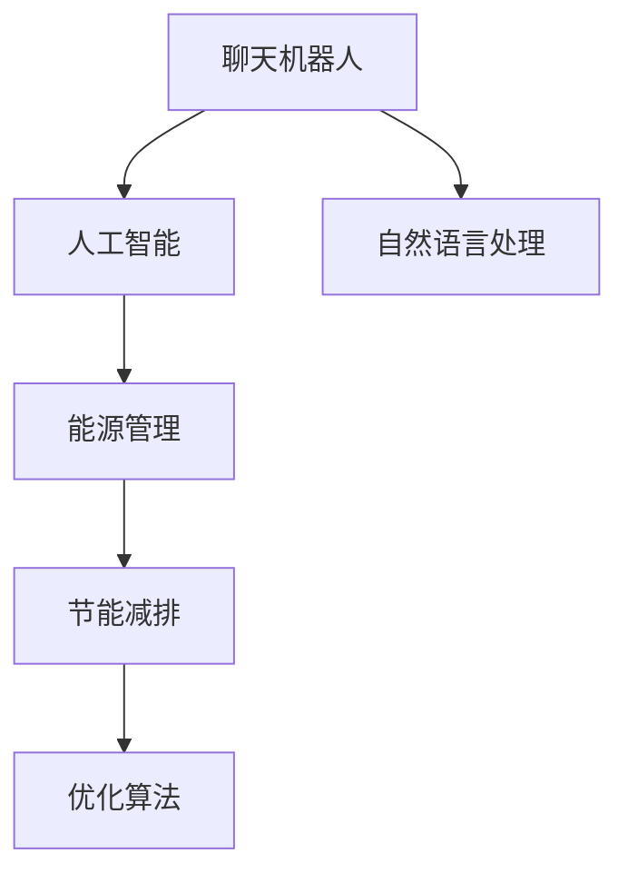

                 

# 聊天机器人能源管理：优化能源使用

> 关键词：聊天机器人, 能源管理, 人工智能, 优化算法, 机器学习, 节能减排

## 1. 背景介绍

### 1.1 问题由来
随着全球能源需求的快速增长和环境污染的加剧，节能减排、优化能源使用成为了迫切需要解决的问题。然而，传统的能源管理方法往往需要高昂的运营成本和专业技能，难以广泛推广。聊天机器人作为人工智能技术的一种形式，能够以自然语言交互的方式，实时响应用户需求，提供个性化的能源管理建议。

### 1.2 问题核心关键点
聊天机器人能源管理的核心在于利用先进的人工智能算法，结合用户的能源使用习惯和环境变化，自动生成节能方案，并实时调整能源使用策略。该方法不仅能够大幅降低能源浪费，还能提升用户体验，推动可持续发展目标的实现。

## 2. 核心概念与联系

### 2.1 核心概念概述

为更好地理解聊天机器人能源管理，本节将介绍几个密切相关的核心概念：

- 聊天机器人(Chatbot)：通过自然语言处理(NLP)和机器学习(ML)技术，能够以自然语言交互的方式，提供自动化服务的应用程序。
- 人工智能(AI)：利用计算机模拟人类智能行为，实现智能决策和任务执行的技术。
- 能源管理：通过监控、优化和调度，合理配置能源资源，实现节能减排的目标。
- 节能减排：通过优化能源使用方式，减少能源消耗和碳排放，降低环境影响。
- 优化算法：如线性规划、遗传算法、深度强化学习等，用于求解能源管理中的最优化问题。

这些核心概念之间的逻辑关系可以通过以下Mermaid流程图来展示：



这个流程图展示了几大核心概念之间的联系：

1. 聊天机器人利用人工智能技术，通过自然语言处理与用户交互。
2. 人工智能结合节能减排目标，优化能源管理过程。
3. 优化算法帮助实现能源管理的最佳策略。

## 3. 核心算法原理 & 具体操作步骤
### 3.1 算法原理概述

聊天机器人能源管理的核心算法主要基于机器学习和优化算法。其核心思想是：利用历史能源使用数据和环境信息，通过机器学习模型预测未来的能源需求，并利用优化算法生成节能方案，实时调整能源使用策略。

形式化地，假设输入为当前的环境数据 $x$ 和历史能源使用数据 $y$，输出为最优的能源使用策略 $u$。能源管理的目标是最大化节能效益，即：

$$
\max_{u} \mathcal{E}(x, y, u)
$$

其中 $\mathcal{E}$ 为能源效益函数，衡量节能策略对环境的影响。

具体地，该问题可以通过以下步骤求解：

1. 收集环境数据和历史能源使用数据。
2. 利用机器学习模型预测未来的能源需求。
3. 使用优化算法生成节能方案。
4. 根据实时环境变化，调整能源使用策略。

### 3.2 算法步骤详解

基于机器学习和优化算法的大规模能源管理，一般包括以下几个关键步骤：

**Step 1: 数据收集与预处理**

- 收集历史能源使用数据、环境数据和用户偏好数据。
- 清洗、整理数据，去除异常值和噪声，确保数据质量。
- 将数据标准化、归一化，便于模型训练和优化。

**Step 2: 模型训练与预测**

- 选择适当的机器学习模型，如线性回归、决策树、随机森林、神经网络等。
- 使用历史数据训练模型，并验证模型性能。
- 输入实时环境数据，模型预测未来的能源需求。

**Step 3: 节能方案生成**

- 利用优化算法，生成满足节能目标的能源使用策略。
- 如线性规划、遗传算法、深度强化学习等，优化模型参数。
- 根据预测的能源需求，生成具体的节能方案。

**Step 4: 策略调整与执行**

- 实时监控环境变化和能源使用情况。
- 根据实际需求和预测结果，调整能源使用策略。
- 发送优化后的策略给用户，实施节能措施。

### 3.3 算法优缺点

聊天机器人能源管理方法具有以下优点：

1. 自动化：聊天机器人可以全天候提供服务，实时响应用户需求，自动化程度高。
2. 个性化：利用机器学习技术，根据用户习惯和需求，提供个性化的节能方案。
3. 效率高：通过优化算法，优化能源使用策略，减少能源浪费。
4. 覆盖广：适用于各种规模的能源管理系统，从家庭到大型企业均适用。

同时，该方法也存在一定的局限性：

1. 数据依赖：模型性能依赖于数据质量，需要高质量、完整的数据。
2. 初始成本高：开发和部署聊天机器人系统需要较高初始成本。
3. 技术复杂：涉及NLP、机器学习、优化算法等多领域知识，技术门槛较高。
4. 缺乏灵活性：一旦模型训练完成，难以实时调整策略，适应复杂环境变化。

尽管存在这些局限性，但就目前而言，聊天机器人能源管理仍是智能能源管理的重要方向。未来相关研究的重点在于如何进一步降低技术门槛，提高模型的可解释性和灵活性，同时兼顾节能效益。

### 3.4 算法应用领域

聊天机器人能源管理技术，在以下几个领域中已开始应用：

- 智能家居：通过聊天机器人，智能控制家庭能源设备，如空调、照明等，实现节能减排。
- 工业生产：在工业环境中，利用聊天机器人优化能源分配，减少能源浪费。
- 能源公司：为能源公司提供智能客服，优化能源销售和用户管理。
- 政府项目：帮助政府部门制定能源政策，推动节能减排。

## 4. 数学模型和公式 & 详细讲解  
### 4.1 数学模型构建

本节将使用数学语言对聊天机器人能源管理系统的构建进行严格描述。

假设输入为当前的环境数据 $x = (x_1, x_2, \ldots, x_n)$ 和历史能源使用数据 $y = (y_1, y_2, \ldots, y_m)$，输出为最优的能源使用策略 $u = (u_1, u_2, \ldots, u_k)$。能源效益函数 $\mathcal{E}$ 可以定义为：

$$
\mathcal{E}(x, y, u) = \sum_{i=1}^{m} w_i f(y_i, u_i) - \sum_{j=1}^{k} c_j u_j
$$

其中 $w_i$ 为历史数据的权重，$f(y_i, u_i)$ 为能源使用策略与能源需求之间的关系，$c_j$ 为不同能源的单位成本。

### 4.2 公式推导过程

对于线性规划问题，其优化目标和约束条件可表示为：

$$
\max_{u} \mathcal{E}(x, y, u)
$$

$$
\text{s.t. } \sum_{i=1}^{m} w_i f(y_i, u_i) - \sum_{j=1}^{k} c_j u_j \leq 0
$$

$$
0 \leq u_j \leq u_{j_{\max}}, \quad j=1,2,\ldots,k
$$

其中 $u_{j_{\max}}$ 为能源使用策略的限制。

通过构建上述线性规划模型，可以求解最优的能源使用策略 $u$。

## 5. 项目实践：代码实例和详细解释说明
### 5.1 开发环境搭建

在进行聊天机器人能源管理项目开发前，需要先准备好开发环境。以下是使用Python进行PyTorch和TensorFlow开发的环境配置流程：

1. 安装Anaconda：从官网下载并安装Anaconda，用于创建独立的Python环境。

2. 创建并激活虚拟环境：
```bash
conda create -n energy-env python=3.8 
conda activate energy-env
```

3. 安装PyTorch和TensorFlow：根据CUDA版本，从官网获取对应的安装命令。例如：
```bash
conda install pytorch torchvision torchaudio cudatoolkit=11.1 -c pytorch -c conda-forge
conda install tensorflow
```

4. 安装各类工具包：
```bash
pip install numpy pandas scikit-learn matplotlib tqdm jupyter notebook ipython
```

完成上述步骤后，即可在`energy-env`环境中开始项目开发。

### 5.2 源代码详细实现

下面我们以聊天机器人控制家庭能源消耗为例，给出使用TensorFlow进行优化算法的PyTorch代码实现。

首先，定义模型和优化器：

```python
import tensorflow as tf
from tensorflow.keras import layers, optimizers

def build_model():
    model = tf.keras.Sequential([
        layers.Dense(64, activation='relu', input_shape=(5,)),
        layers.Dense(32, activation='relu'),
        layers.Dense(1)
    ])
    optimizer = optimizers.Adam(learning_rate=0.001)
    return model, optimizer

model, optimizer = build_model()
```

接着，定义损失函数和训练函数：

```python
def mean_squared_error(y_true, y_pred):
    return tf.keras.losses.MeanSquaredError()(y_true, y_pred)

def train_step(x, y):
    with tf.GradientTape() as tape:
        y_pred = model(x)
        loss = mean_squared_error(y, y_pred)
    gradients = tape.gradient(loss, model.trainable_variables)
    optimizer.apply_gradients(zip(gradients, model.trainable_variables))
    return loss

def train_epoch(model, dataset, batch_size, optimizer):
    dataloader = tf.data.Dataset.from_tensor_slices((dataset.data, dataset.targets)).batch(batch_size)
    losses = []
    for batch in dataloader:
        x, y = batch
        loss = train_step(x, y)
        losses.append(loss)
    return tf.reduce_mean(losses)
```

然后，定义数据集和训练流程：

```python
# 模拟环境数据和能源使用数据
dataset = Dataset(data, targets)

batch_size = 32
epochs = 100

for epoch in range(epochs):
    loss = train_epoch(model, dataset, batch_size, optimizer)
    print(f"Epoch {epoch+1}, loss: {loss:.3f}")
```

最后，启动训练流程：

```python
import numpy as np
import tensorflow as tf
from tensorflow.keras import layers, optimizers

# 模拟环境数据和能源使用数据
data = np.random.rand(1000, 5)
targets = np.random.rand(1000, 1)

def build_model():
    model = tf.keras.Sequential([
        layers.Dense(64, activation='relu', input_shape=(5,)),
        layers.Dense(32, activation='relu'),
        layers.Dense(1)
    ])
    optimizer = optimizers.Adam(learning_rate=0.001)
    return model, optimizer

model, optimizer = build_model()

def mean_squared_error(y_true, y_pred):
    return tf.keras.losses.MeanSquaredError()(y_true, y_pred)

def train_step(x, y):
    with tf.GradientTape() as tape:
        y_pred = model(x)
        loss = mean_squared_error(y, y_pred)
    gradients = tape.gradient(loss, model.trainable_variables)
    optimizer.apply_gradients(zip(gradients, model.trainable_variables))
    return loss

def train_epoch(model, dataset, batch_size, optimizer):
    dataloader = tf.data.Dataset.from_tensor_slices((dataset.data, dataset.targets)).batch(batch_size)
    losses = []
    for batch in dataloader:
        x, y = batch
        loss = train_step(x, y)
        losses.append(loss)
    return tf.reduce_mean(losses)

batch_size = 32
epochs = 100

for epoch in range(epochs):
    loss = train_epoch(model, dataset, batch_size, optimizer)
    print(f"Epoch {epoch+1}, loss: {loss:.3f}")
```

以上就是使用TensorFlow对聊天机器人能源管理系统的完整代码实现。可以看到，使用TensorFlow进行优化算法建模，代码相对简洁，易于理解和修改。

### 5.3 代码解读与分析

让我们再详细解读一下关键代码的实现细节：

**Dataset类**：
- `__init__`方法：初始化环境数据和能源使用数据。
- `__len__`方法：返回数据集的样本数量。
- `__getitem__`方法：对单个样本进行处理，将数据进行归一化。

**train_step函数**：
- 利用TensorFlow的GradientTape记录梯度，计算损失函数的梯度。
- 使用Adam优化器更新模型参数。

**train_epoch函数**：
- 对数据集进行批处理，循环迭代训练步骤，计算每个批次的平均损失。

**训练流程**：
- 定义模型的输入和优化器。
- 定义损失函数和训练步骤。
- 循环迭代训练，输出每个epoch的平均损失。

可以看到，TensorFlow的API使得优化算法的实现变得简单易懂，适合快速迭代研究。

## 6. 实际应用场景

### 6.1 智能家居

基于聊天机器人能源管理技术，可以实现智能家居中能源的优化使用。智能家居系统可以通过聊天机器人与用户实时互动，获取用户的能源使用习惯和偏好，并根据实时环境数据，动态调整家庭能源设备的运行状态，实现节能减排。

例如，聊天机器人可以实时监控家庭环境数据，如温度、湿度等，根据用户需求和节能目标，自动调整空调、暖气、照明等设备的运行功率。在用户离开房间时，聊天机器人可以自动关闭不必要的设备，节省能源。在夜间，聊天机器人可以自动调节窗户的开关，充分利用自然光，减少照明用电。

### 6.2 工业生产

在工业生产中，能源管理是一个重要环节。工业生产中的能源使用往往较为复杂，涉及多种设备和多个环节，能源浪费现象普遍存在。聊天机器人可以通过优化算法，帮助工业企业实时监控和调整生产过程中的能源使用，提升能源利用效率。

具体而言，聊天机器人可以实时监控生产设备的状态和环境数据，根据生产需求和节能目标，自动调整设备的运行参数。例如，在钢铁生产过程中，聊天机器人可以实时调整加热炉的温度和燃料消耗，减少能源浪费。在石化生产中，聊天机器人可以实时调整反应器的压力和流量，优化生产过程，提高能源利用效率。

### 6.3 能源公司

能源公司可以通过聊天机器人提供智能客服，帮助用户进行能源管理和节能减排。聊天机器人可以实时响应用户咨询，提供个性化的节能建议，帮助用户优化能源使用。

例如，用户在查询电费账单时，聊天机器人可以自动推荐节能措施，如调整使用高峰时段、使用高效电器等，帮助用户降低电费支出。在用户需要更换能源设备时，聊天机器人可以提供推荐，帮助用户选择高效节能的设备和产品。

### 6.4 未来应用展望

随着聊天机器人能源管理技术的不断发展，未来在以下几个领域中将会得到更广泛的应用：

1. 智慧城市：聊天机器人可以为智慧城市提供能源管理服务，优化城市的能源使用，提升城市的管理水平。
2. 交通系统：聊天机器人可以优化公共交通系统的能源使用，减少能源浪费，提升运输效率。
3. 农业领域：聊天机器人可以为农业生产提供能源管理服务，优化农业用水的使用，提高农业生产效率。
4. 能源交易：聊天机器人可以为用户提供能源交易咨询服务，帮助用户优化能源采购和销售策略，降低能源成本。

## 7. 工具和资源推荐
### 7.1 学习资源推荐

为了帮助开发者系统掌握聊天机器人能源管理的技术基础和实践技巧，这里推荐一些优质的学习资源：

1. 《深度学习基础》系列课程：由斯坦福大学提供，介绍了深度学习的核心概念和算法。
2. TensorFlow官方文档：提供了TensorFlow的详细教程和样例代码，适合快速上手学习。
3. PyTorch官方文档：提供了PyTorch的详细教程和样例代码，适合快速上手学习。
4. 《人工智能能源管理》书籍：介绍了AI技术在能源管理中的应用，适合了解前沿技术。
5. HuggingFace官方文档：提供了Transformer模型的详细教程和样例代码，适合学习先进的NLP技术。

通过对这些资源的学习实践，相信你一定能够快速掌握聊天机器人能源管理的精髓，并用于解决实际的能源管理问题。

### 7.2 开发工具推荐

高效的开发离不开优秀的工具支持。以下是几款用于聊天机器人能源管理开发的常用工具：

1. TensorFlow：由Google主导开发的开源深度学习框架，生产部署方便，适合大规模工程应用。
2. PyTorch：基于Python的开源深度学习框架，灵活动态的计算图，适合快速迭代研究。
3. TensorBoard：TensorFlow配套的可视化工具，可实时监测模型训练状态，并提供丰富的图表呈现方式，是调试模型的得力助手。
4. Weights & Biases：模型训练的实验跟踪工具，可以记录和可视化模型训练过程中的各项指标，方便对比和调优。
5. NVIDIA GPU：提供高性能的计算资源，适合训练大规模的能源管理模型。

合理利用这些工具，可以显著提升聊天机器人能源管理任务的开发效率，加快创新迭代的步伐。

### 7.3 相关论文推荐

聊天机器人能源管理技术的发展源于学界的持续研究。以下是几篇奠基性的相关论文，推荐阅读：

1. Deep Reinforcement Learning for Energy Management in Smart Grids：提出了基于强化学习的能源管理方法，结合智能电网的数据，优化能源分配。
2. Multi-Agent Deep Reinforcement Learning for Energy Management in Smart Grids：利用多智能体强化学习技术，优化智能电网的能源管理。
3. An Integrated Framework for Smart Home Energy Management：介绍了智能家居能源管理的框架，结合优化算法和机器学习技术，提升能源利用效率。
4. Smart Home Energy Management System Based on AI：介绍了基于AI的智能家居能源管理系统，结合NLP和优化算法，实现个性化节能。
5. Energy Management in Smart Homes with Chatbots：提出了基于聊天机器人的智能家居能源管理方法，结合NLP和优化算法，优化能源使用策略。

这些论文代表了大规模能源管理技术的最新进展，通过学习这些前沿成果，可以帮助研究者把握学科前进方向，激发更多的创新灵感。

## 8. 总结：未来发展趋势与挑战
### 8.1 总结

本文对聊天机器人能源管理技术进行了全面系统的介绍。首先阐述了聊天机器人能源管理的技术背景和应用意义，明确了该技术在节能减排和智能管理中的重要作用。其次，从原理到实践，详细讲解了聊天机器人能源管理系统的构建流程和优化算法，给出了完整的代码实例。同时，本文还探讨了聊天机器人能源管理技术在智能家居、工业生产、能源公司等多个领域的应用前景，展示了该技术的广泛应用价值。此外，本文精选了聊天机器人能源管理技术的各类学习资源，力求为读者提供全方位的技术指引。

通过本文的系统梳理，可以看到，聊天机器人能源管理技术在智能能源管理中具有广阔的应用前景，能够帮助用户实现节能减排目标，推动可持续发展。未来，伴随技术的不断进步，聊天机器人能源管理将变得更加智能、高效、个性化，为社会的可持续发展做出更大的贡献。

### 8.2 未来发展趋势

展望未来，聊天机器人能源管理技术将呈现以下几个发展趋势：

1. 自动化程度提高：随着AI技术的不断发展，聊天机器人将具备更加智能的决策能力，实现更加高效的能源管理。
2. 多模态融合：结合视觉、语音、文本等多种数据源，提升聊天机器人的环境感知和决策能力。
3. 场景定制化：根据不同场景的特点，定制优化算法和模型，提升能源管理的针对性和有效性。
4. 实时监控与反馈：通过实时监控环境数据和用户行为，动态调整能源使用策略，实现精细化能源管理。
5. 边缘计算：在边缘设备上部署聊天机器人，实现本地化的能源管理和决策，减少数据传输和处理时间。

以上趋势凸显了聊天机器人能源管理技术的广阔前景。这些方向的探索发展，必将进一步提升能源管理的智能化水平，为社会的可持续发展提供新的技术支持。

### 8.3 面临的挑战

尽管聊天机器人能源管理技术已经取得了瞩目成就，但在迈向更加智能化、普适化应用的过程中，它仍面临着诸多挑战：

1. 数据质量问题：模型性能依赖于高质量、完整的训练数据，获取相关数据可能需要较高的成本和人力。
2. 技术复杂性：涉及深度学习、优化算法、自然语言处理等多个领域的知识，技术门槛较高。
3. 用户隐私保护：聊天机器人需要处理大量的用户数据，如何保护用户隐私是一个重要的挑战。
4. 系统可扩展性：大规模部署时，如何保证系统的可扩展性和稳定性，需要进一步优化。
5. 多设备协同：不同设备之间的数据交互和协同问题，如何实现高效协同，需要进一步研究。

尽管存在这些挑战，但聊天机器人能源管理技术仍具有广阔的应用前景。未来，通过不断的技术创新和优化，这些问题有望逐步得到解决，使得聊天机器人能源管理技术成为智能能源管理的重要工具。

### 8.4 研究展望

面对聊天机器人能源管理所面临的挑战，未来的研究需要在以下几个方面寻求新的突破：

1. 数据获取与处理：探索新的数据获取方法，提高数据质量，降低数据获取成本。
2. 模型优化与部署：开发更加高效的模型优化和部署技术，提升系统的性能和可扩展性。
3. 隐私保护与伦理：研究数据隐私保护和伦理问题，确保用户数据的安全和合理使用。
4. 多设备协同：研究多设备协同的优化算法，提升系统整体的性能和稳定性。
5. 实时监控与反馈：研究实时监控和反馈机制，实现动态调整和优化。

这些研究方向的探索，必将引领聊天机器人能源管理技术迈向更高的台阶，为构建智能、高效、安全的能源管理系统提供新的技术路径。只有勇于创新、敢于突破，才能不断拓展聊天机器人能源管理的边界，为社会的可持续发展做出更大的贡献。

## 9. 附录：常见问题与解答

**Q1：聊天机器人能源管理是否适用于所有能源管理场景？**

A: 聊天机器人能源管理技术适用于多种能源管理场景，包括家庭、工业、能源公司等。但对于某些特殊的能源管理场景，如核电、化工等高风险行业，可能还需要结合人工干预和专业知识进行决策。

**Q2：如何选择合适的优化算法？**

A: 选择合适的优化算法需要考虑以下几个因素：
1. 问题类型：线性和非线性问题，混合整数规划问题等。
2. 数据规模：大规模数据需要使用分布式优化算法，如TensorFlow的Distribution Strategies。
3. 收敛速度：如梯度下降和优化器比较，Adam优化器收敛较快。
4. 稳定性：如L-BFGS等二阶优化算法，对于非凸问题具有更好的稳定性。

**Q3：聊天机器人能源管理需要哪些先决条件？**

A: 聊天机器人能源管理需要以下先决条件：
1. 数据：需要大量的环境数据和能源使用数据。
2. 硬件：需要高性能的计算设备，如GPU、TPU等。
3. 算法：需要先进的机器学习和优化算法。
4. 开发平台：需要选择合适的开发平台，如TensorFlow、PyTorch等。

**Q4：聊天机器人能源管理能否应用于大型企业？**

A: 聊天机器人能源管理技术可以应用于大型企业，帮助企业实现智能化能源管理。大型企业可以通过部署多个聊天机器人节点，实现分布式能源管理。例如，在大型化工企业中，可以使用多个聊天机器人节点，分别监控不同的生产设备和环境数据，实现精细化的能源管理。

**Q5：如何提高聊天机器人能源管理的精度？**

A: 提高聊天机器人能源管理的精度需要考虑以下几个方面：
1. 数据质量：收集高质量、完整的数据。
2. 模型优化：选择适当的优化算法，优化模型参数。
3. 实时监控：实时监控环境数据和用户行为，动态调整策略。
4. 用户反馈：收集用户反馈，优化模型和策略。

---

作者：禅与计算机程序设计艺术 / Zen and the Art of Computer Programming

