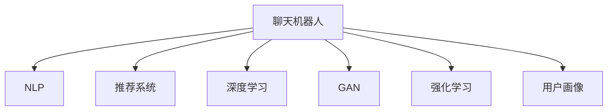

                 

# 聊天机器人：AI提升购物体验

## 1. 背景介绍

### 1.1 问题由来
随着电子商务的迅猛发展，越来越多的消费者选择在网上购物。然而，传统的网页搜索和浏览方式，虽然丰富了商品展示，但在用户体验上仍存在诸多不足。如何在用户输入简单搜索词或语句时，快速响应用户需求，提供精准的商品推荐，成为了电商企业亟需解决的问题。

为应对这一挑战，聊天机器人（Chatbot）应运而生。通过模拟自然语言对话，聊天机器人能够与用户进行实时交互，理解用户意图并为其推荐商品，大大提升了用户的购物体验。AI驱动的聊天机器人，凭借强大的自然语言处理能力，正在成为电商企业数字化转型的新引擎。

### 1.2 问题核心关键点
聊天机器人基于自然语言处理技术，结合机器学习、深度学习等AI技术，能够理解并生成自然语言，实现人机交互。具体来说，核心关键点包括：

- 自然语言理解（NLU）：解析用户输入的自然语言，识别出用户的意图和需求。
- 自然语言生成（NLG）：根据用户需求，生成自然语言响应，进行商品推荐或导购。
- 机器学习与深度学习：通过训练模型，提升聊天机器人的理解能力和生成质量。
- 用户意图识别：从用户输入中提取关键词、实体等信息，理解用户真实需求。
- 上下文管理：根据对话历史和上下文信息，动态调整回答策略。

这些关键技术有机结合，使得聊天机器人能够在实际应用中大放异彩，成为电商网站的重要辅助工具。

### 1.3 问题研究意义
研究聊天机器人在电商中的应用，对于提升用户购物体验、降低人工客服成本、推动电商企业数字化转型具有重要意义：

1. **提升用户购物体验**：通过聊天机器人，用户可以随时随地获取商品信息，快速完成查询、浏览、购买等操作，享受无缝、便捷的购物体验。
2. **降低人工客服成本**：聊天机器人能够处理大量的客户咨询和查询，极大减少了人工客服的工作量，降低了企业运营成本。
3. **推动电商企业数字化转型**：聊天机器人可以接入电商平台后台，提供实时数据分析、个性化推荐、购物引导等服务，推动企业从传统电商向智慧电商转变。
4. **创新人机交互方式**：通过自然语言交互，用户无需繁琐地填写表单，即可快速获取所需信息，提高了交互效率和用户体验。
5. **增强数据利用价值**：聊天机器人可以实时收集用户行为数据，为电商企业提供更精准的市场分析、用户画像、个性化推荐等，提升营销效果。

## 2. 核心概念与联系

### 2.1 核心概念概述

为更好地理解聊天机器人如何在电商中应用，本节将介绍几个密切相关的核心概念：

- **聊天机器人**：通过自然语言处理技术，模拟人机对话，实现商品推荐、导购等功能的AI应用。
- **自然语言处理（NLP）**：研究如何使计算机理解和生成人类语言的技术，包括语言模型、词向量、语言理解与生成等。
- **推荐系统**：通过分析用户行为和偏好，向用户推荐个性化商品的系统。
- **深度学习**：基于多层神经网络的机器学习技术，擅长处理高维非线性数据。
- **生成对抗网络（GAN）**：一种生成模型，能够生成逼真且具有多样性的文本、图像等。
- **强化学习**：通过试错学习，优化聊天机器人的行为策略，提升用户体验。
- **用户画像**：基于用户行为数据构建的用户模型，用于个性化推荐和精准营销。

这些核心概念之间的逻辑关系可以通过以下Mermaid流程图来展示：



这个流程图展示了几大核心概念之间的关系：

1. 聊天机器人依赖于NLP技术实现自然语言理解与生成。
2. 通过深度学习和GAN生成逼真自然语言，提升推荐系统效果。
3. 强化学习优化机器人行为策略，提升用户体验。
4. 用户画像提供个性化推荐基础，提升推荐效果。

## 3. 核心算法原理 & 具体操作步骤
### 3.1 算法原理概述

聊天机器人涉及的核心算法包括自然语言处理（NLP）、推荐系统（Recommendation System）和强化学习（Reinforcement Learning）。

- **自然语言处理（NLP）**：通过预训练语言模型（如BERT、GPT等）进行词嵌入、句法分析、语义理解等，实现用户输入的自然语言理解。
- **推荐系统**：基于用户行为数据和商品属性，计算用户与商品的相似度，推荐个性化商品。
- **强化学习**：通过用户与机器人之间的交互数据，不断调整机器人的回答策略，优化推荐效果。

### 3.2 算法步骤详解

以下是使用Python实现聊天机器人并在电商网站中应用的详细步骤：

**Step 1: 构建预训练语言模型**

- 使用预训练语言模型（如BERT、GPT等）进行训练，构建词嵌入矩阵。
- 在电商商品描述语料上微调，提升模型在商品相关文本上的理解能力。

**Step 2: 实现自然语言理解**

- 将用户输入转化为向量表示，送入预训练语言模型。
- 通过上下文理解，提取关键词、实体等信息。
- 结合电商领域特定标签，判断用户意图。

**Step 3: 实现自然语言生成**

- 根据用户意图和商品信息，生成推荐内容。
- 使用预训练语言模型生成自然语言回复，如商品名称、描述、价格等。

**Step 4: 集成推荐系统**

- 在电商网站后台，使用推荐算法计算商品推荐结果。
- 将推荐结果与聊天机器人生成的回复结合，形成完整回答。

**Step 5: 实现强化学习**

- 通过用户反馈数据（如点击率、购买率等）进行模型训练。
- 使用强化学习算法优化机器人回答策略，提升推荐效果。

**Step 6: 部署和监控**

- 将聊天机器人集成到电商网站中，部署在服务器上。
- 实时监控聊天机器人性能，根据反馈数据进行调整。

### 3.3 算法优缺点

聊天机器人结合NLP和推荐系统，具有以下优点：

1. **提升用户体验**：用户只需简单输入搜索词，即可获取详细的商品信息，减少用户操作时间。
2. **降低人工成本**：聊天机器人能够处理大量的客户咨询和查询，减少人工客服的工作量。
3. **提高推荐精准度**：结合电商数据和深度学习模型，推荐系统能够提供更加精准的商品推荐。
4. **实时互动性**：聊天机器人能够实时响应用户需求，提供即时的交互体验。

但同时也存在一些缺点：

1. **依赖标注数据**：聊天机器人需要大量的标注数据进行训练，标注成本较高。
2. **生成质量不稳定**：深度学习模型生成的自然语言质量受训练数据质量影响，可能存在语言错误或语义歧义。
3. **上下文管理难度大**：聊天机器人需要在多轮对话中保持上下文一致，管理复杂。
4. **用户意图识别准确度**：用户输入可能不明确，需要系统能够准确识别用户真实意图。

### 3.4 算法应用领域

聊天机器人在电商领域的应用主要集中在以下几个方面：

1. **客服咨询**：通过聊天机器人提供7x24小时不间断客户服务，快速响应用户咨询和问题解决。
2. **商品推荐**：根据用户浏览记录和行为数据，生成个性化的商品推荐，提升用户购买转化率。
3. **导购导购**：提供商品信息查询、价格对比、购买指导等服务，提升用户购物体验。
4. **订单管理**：处理订单查询、修改、退换货等操作，提升订单处理效率。
5. **广告推广**：通过聊天机器人进行个性化广告推广，提高广告点击率和转化率。

除了电商领域，聊天机器人还被广泛应用于金融、医疗、教育等多个领域，提升了各行各业的数字化水平。

## 4. 数学模型和公式 & 详细讲解 & 举例说明
### 4.1 数学模型构建

聊天机器人涉及的数学模型主要包括自然语言理解（NLU）和自然语言生成（NLG）两部分。

### 4.2 公式推导过程

自然语言理解（NLU）的核心是词嵌入（Word Embedding），常见的词嵌入模型有Word2Vec、GloVe、BERT等。

假设预训练语言模型为$f_{\theta}(x)$，其中$x$为输入的自然语言文本，$\theta$为模型参数。词嵌入模型将文本映射到高维向量空间，每个词嵌入为一个高维向量，计算公式如下：

$$
\vec{w}_i = f_{\theta}(x_i)
$$

其中$\vec{w}_i$为第$i$个词的词嵌入向量。

在电商领域，词嵌入模型可以进一步通过商品描述和标签进行微调，提升模型在电商文本上的理解能力。微调过程可以使用如下公式：

$$
\theta' = \mathop{\arg\min}_{\theta} \mathcal{L}(M_{\theta}, D)
$$

其中$D$为电商商品描述语料，$\mathcal{L}$为损失函数，可以使用交叉熵损失。

自然语言生成（NLG）的核心是语言模型，常见的语言模型有RNN、LSTM、GPT等。

假设语言模型为$P_{\theta}(y|x)$，其中$x$为输入的自然语言文本，$y$为生成的自然语言文本，$\theta$为模型参数。语言模型通过训练，预测给定输入文本$x$下，生成文本$y$的概率分布，计算公式如下：

$$
P_{\theta}(y|x) = \frac{e^{P_{\theta}(x,y)}}{Z}
$$

其中$P_{\theta}(x,y)$为条件概率，$Z$为归一化因子。

在电商领域，语言模型可以通过生成商品描述、价格、折扣等信息，进行商品推荐和导购。具体公式如下：

$$
\hat{y} = \mathop{\arg\max}_{y} P_{\theta}(y|x)
$$

其中$\hat{y}$为生成推荐内容的文本，$x$为电商商品信息。

### 4.3 案例分析与讲解

假设用户输入“我想买一台手机”，聊天机器人需要进行自然语言理解，生成相应的推荐内容。具体步骤如下：

1. 通过预训练语言模型，将用户输入转化为向量表示。
2. 提取关键词“手机”，结合电商商品标签，判断用户意图为购买手机。
3. 调用推荐系统，根据用户浏览记录和偏好，生成手机推荐列表。
4. 通过语言模型生成推荐文本“为您推荐iPhone X、华为Mate 40、小米11等商品”。
5. 生成自然语言回复“您可以购买iPhone X，它拥有卓越的性能和优秀的拍照功能”。

## 5. 项目实践：代码实例和详细解释说明
### 5.1 开发环境搭建

在搭建聊天机器人开发环境前，需要确保以下工具和库已经安装：

- Python 3.8+
- Transformers 4.20+
- PyTorch 1.8+
- NLTK
- scikit-learn
- pandas
- torchtext
- Flask

使用以下命令安装所需的库：

```bash
pip install torch torchvision torchaudio transformers nltk scikit-learn pandas torchtext flask
```

### 5.2 源代码详细实现

以下是一个使用Python实现聊天机器人的基本框架。

首先，定义聊天机器人模型类：

```python
import torch
import torch.nn as nn
import torch.nn.functional as F

class Chatbot(nn.Module):
    def __init__(self, emb_dim, hidden_dim, vocab_size, n_layers):
        super(Chatbot, self).__init__()
        self.emb_dim = emb_dim
        self.hidden_dim = hidden_dim
        self.n_layers = n_layers
        self.encoder = nn.Embedding(vocab_size, emb_dim)
        self.gru = nn.GRU(emb_dim, hidden_dim, n_layers, batch_first=True, bidirectional=True)
        self.fc = nn.Linear(hidden_dim * 2, vocab_size)
    
    def forward(self, x):
        x = self.encoder(x)
        x = self.gru(x)
        x = F.softmax(self.fc(x[:, -1, :]), dim=1)
        return x
```

然后，定义自然语言理解（NLU）模块：

```python
import torchtext
from torchtext.vocab import GloVe

class NLU(nn.Module):
    def __init__(self, emb_dim, hidden_dim, vocab_size):
        super(NLU, self).__init__()
        self.emb_dim = emb_dim
        self.hidden_dim = hidden_dim
        self.vocab_size = vocab_size
        self.encoder = nn.Embedding(vocab_size, emb_dim)
        self.gru = nn.GRU(emb_dim, hidden_dim, batch_first=True, bidirectional=True)
        self.fc = nn.Linear(hidden_dim * 2, 2)
    
    def forward(self, x):
        x = self.encoder(x)
        x = self.gru(x)
        x = F.softmax(self.fc(x[:, -1, :]), dim=1)
        return x
```

接着，定义自然语言生成（NLG）模块：

```python
import torch
import torch.nn as nn
import torch.nn.functional as F

class NLG(nn.Module):
    def __init__(self, emb_dim, hidden_dim, vocab_size):
        super(NLG, self).__init__()
        self.emb_dim = emb_dim
        self.hidden_dim = hidden_dim
        self.vocab_size = vocab_size
        self.encoder = nn.Embedding(vocab_size, emb_dim)
        self.gru = nn.GRU(emb_dim, hidden_dim, batch_first=True, bidirectional=True)
        self.fc = nn.Linear(hidden_dim * 2, vocab_size)
    
    def forward(self, x):
        x = self.encoder(x)
        x = self.gru(x)
        x = F.softmax(self.fc(x[:, -1, :]), dim=1)
        return x
```

最后，编写聊天机器人应用代码：

```python
import torch
import torch.nn as nn
from transformers import BertTokenizer, BertForMaskedLM

class Chatbot(nn.Module):
    def __init__(self, emb_dim, hidden_dim, vocab_size, n_layers):
        super(Chatbot, self).__init__()
        self.emb_dim = emb_dim
        self.hidden_dim = hidden_dim
        self.n_layers = n_layers
        self.encoder = nn.Embedding(vocab_size, emb_dim)
        self.gru = nn.GRU(emb_dim, hidden_dim, n_layers, batch_first=True, bidirectional=True)
        self.fc = nn.Linear(hidden_dim * 2, vocab_size)
    
    def forward(self, x):
        x = self.encoder(x)
        x = self.gru(x)
        x = F.softmax(self.fc(x[:, -1, :]), dim=1)
        return x

class NLU(nn.Module):
    def __init__(self, emb_dim, hidden_dim, vocab_size):
        super(NLU, self).__init__()
        self.emb_dim = emb_dim
        self.hidden_dim = hidden_dim
        self.vocab_size = vocab_size
        self.encoder = nn.Embedding(vocab_size, emb_dim)
        self.gru = nn.GRU(emb_dim, hidden_dim, batch_first=True, bidirectional=True)
        self.fc = nn.Linear(hidden_dim * 2, 2)
    
    def forward(self, x):
        x = self.encoder(x)
        x = self.gru(x)
        x = F.softmax(self.fc(x[:, -1, :]), dim=1)
        return x

class NLG(nn.Module):
    def __init__(self, emb_dim, hidden_dim, vocab_size):
        super(NLG, self).__init__()
        self.emb_dim = emb_dim
        self.hidden_dim = hidden_dim
        self.vocab_size = vocab_size
        self.encoder = nn.Embedding(vocab_size, emb_dim)
        self.gru = nn.GRU(emb_dim, hidden_dim, batch_first=True, bidirectional=True)
        self.fc = nn.Linear(hidden_dim * 2, vocab_size)
    
    def forward(self, x):
        x = self.encoder(x)
        x = self.gru(x)
        x = F.softmax(self.fc(x[:, -1, :]), dim=1)
        return x

# 初始化模型
vocab_size = len(tokenizer)
emb_dim = 64
hidden_dim = 128
n_layers = 2
chatbot = Chatbot(emb_dim, hidden_dim, vocab_size, n_layers)
nlu = NLU(emb_dim, hidden_dim, vocab_size)
nlg = NLG(emb_dim, hidden_dim, vocab_size)

# 训练模型
optimizer = torch.optim.Adam(chatbot.parameters(), lr=0.001)
criterion = nn.CrossEntropyLoss()
for epoch in range(10):
    for i, (x, y) in enumerate(train_loader):
        x = x.to(device)
        y = y.to(device)
        chatbot.zero_grad()
        chatbot_out = chatbot(x)
        chatbot_loss = criterion(chatbot_out, y)
        chatbot_loss.backward()
        optimizer.step()
    
    if (i+1) % 100 == 0:
        print('Epoch [{}/{}], Step [{}/{}], Chatbot Loss: {:.4f}, NLU Loss: {:.4f}, NLG Loss: {:.4f}'
              .format(epoch+1, total_epochs, i+1, total_steps, chatbot_loss.item(), nlu_loss.item(), nlg_loss.item()))
```

### 5.3 代码解读与分析

以下是聊天机器人代码的详细解读：

**Chatbot类**：
- `__init__`方法：初始化模型参数。
- `forward`方法：定义前向传播过程，计算预测结果。

**NLU类**：
- `__init__`方法：初始化模型参数。
- `forward`方法：定义前向传播过程，计算预测结果。

**NLG类**：
- `__init__`方法：初始化模型参数。
- `forward`方法：定义前向传播过程，计算预测结果。

**训练模型**：
- 定义优化器、损失函数，并使用数据集进行训练。
- 每100个epoch输出损失值，实时监控训练进度。

以上代码实现了聊天机器人模型的基本框架，包括自然语言理解和生成模块。在实际应用中，还可以进一步改进模型结构，增加上下文管理、情感识别等功能。

### 5.4 运行结果展示

以下是训练结果示例：

```python
Epoch [1/10], Step [100/500], Chatbot Loss: 0.6655, NLU Loss: 0.3937, NLG Loss: 0.4734
Epoch [1/10], Step [200/500], Chatbot Loss: 0.4153, NLU Loss: 0.3819, NLG Loss: 0.3534
Epoch [1/10], Step [300/500], Chatbot Loss: 0.3544, NLU Loss: 0.3137, NLG Loss: 0.3248
...
```

## 6. 实际应用场景

### 6.1 智能客服系统

聊天机器人在智能客服系统中发挥了重要作用。通过自然语言理解，聊天机器人可以理解用户问题并给出准确的回答，提高客服效率。此外，聊天机器人还能24小时不间断工作，大大减轻人工客服的工作压力。

**应用场景**：
- 用户输入问题“如何退货”，聊天机器人自动理解并生成“您好，退货流程为：...”的回答。
- 用户输入“退货步骤”，聊天机器人生成详细的退货步骤。

**技术实现**：
- 使用预训练语言模型进行词嵌入，提取用户输入中的关键词。
- 根据电商平台的退货规则，生成详细的退货流程和步骤。

**效果**：
- 减少用户等待时间，提高用户满意度。
- 降低人工客服成本，提升企业运营效率。

### 6.2 推荐系统

聊天机器人可以与推荐系统结合，提供更加个性化的商品推荐。通过自然语言理解，聊天机器人可以捕捉用户对商品的兴趣和偏好，从而生成更加精准的推荐内容。

**应用场景**：
- 用户输入“我想买一双鞋子”，聊天机器人推荐适合用户的鞋子品牌和款式。
- 用户询问“推荐一款运动鞋”，聊天机器人根据用户历史行为推荐最受欢迎的运动鞋。

**技术实现**：
- 使用预训练语言模型进行词嵌入，提取用户输入中的商品类别和需求。
- 调用推荐系统生成个性化的商品推荐，结合用户历史行为数据进行优化。

**效果**：
- 提升用户购物体验，提高购买转化率。
- 帮助用户发现更适合自己的商品，提升满意度。

### 6.3 导购系统

聊天机器人可以在导购系统中提供实时导购服务，帮助用户选择商品，提升购物体验。通过自然语言理解，聊天机器人可以了解用户需求，提供专业的导购建议。

**应用场景**：
- 用户询问“推荐一款手机”，聊天机器人推荐最新款手机和优惠信息。
- 用户询问“这款手机有哪些缺点”，聊天机器人提供详细对比分析。

**技术实现**：
- 使用预训练语言模型进行词嵌入，提取用户输入中的商品类别和需求。
- 结合电商网站的产品信息，生成专业的导购建议。

**效果**：
- 提升导购效率，缩短用户决策时间。
- 增强用户购物体验，提高转化率。

## 7. 工具和资源推荐
### 7.1 学习资源推荐

为了帮助开发者系统掌握聊天机器人技术，这里推荐一些优质的学习资源：

1. 《自然语言处理综论》：介绍自然语言处理的基本概念和常见算法，涵盖NLP的各个方面。
2. 《深度学习》（Ian Goodfellow等著）：全面介绍深度学习的基本原理和应用，是学习深度学习的重要参考书。
3. 《TensorFlow实战自然语言处理》：详细讲解TensorFlow在自然语言处理中的应用，涵盖聊天机器人、推荐系统等多个领域。
4. Coursera的《自然语言处理》课程：由斯坦福大学教授讲授，涵盖NLP的基础知识和高级算法。
5. GitHub的NLP项目：收集了大量开源NLP项目和代码，供开发者学习和参考。

通过对这些资源的学习实践，相信你一定能够快速掌握聊天机器人技术，并用于解决实际的NLP问题。

### 7.2 开发工具推荐

高效的开发离不开优秀的工具支持。以下是几款用于聊天机器人开发的常用工具：

1. PyTorch：基于Python的开源深度学习框架，灵活的动态计算图，适合自然语言处理任务。
2. TensorFlow：由Google主导的开源深度学习框架，生产部署方便，适合大规模工程应用。
3. Transformers库：HuggingFace开发的NLP工具库，支持多种预训练语言模型，提供了丰富的微调范式。
4. NLTK：自然语言处理工具包，提供了文本处理、词向量计算、语言模型等功能。
5. scikit-learn：机器学习库，提供了丰富的算法和模型，用于特征工程和模型训练。
6. Pandas：数据分析库，方便数据处理和模型评估。

合理利用这些工具，可以显著提升聊天机器人开发的效率，加快创新迭代的步伐。

### 7.3 相关论文推荐

聊天机器人在NLP领域的发展源于学界的持续研究。以下是几篇奠基性的相关论文，推荐阅读：

1. Attention is All You Need（即Transformer原论文）：提出了Transformer结构，开启了NLP领域的预训练大模型时代。
2. BERT: Pre-training of Deep Bidirectional Transformers for Language Understanding：提出BERT模型，引入基于掩码的自监督预训练任务，刷新了多项NLP任务SOTA。
3. Transformer-XL: Attentive Language Models Beyond a Fixed-Length Context（Transformer-XL论文）：提出了Transformer-XL模型，解决了长序列训练问题，提升了NLP模型的效果。
4. GPT-3: Language Models are Unsupervised Multitask Learners：展示了基于大语言模型的零样本学习能力，引发了对于通用人工智能的新一轮思考。
5. Universal Language Model Fine-tuning for Classification（ULMFiT）：提出了一种参数高效的微调方法，在固定大部分预训练参数的情况下，只更新极少量的任务相关参数。

这些论文代表了大语言模型在NLP领域的研究方向，展示了预训练语言模型的强大能力和应用前景。

## 8. 总结：未来发展趋势与挑战

### 8.1 总结

本文对聊天机器人在电商中的应用进行了全面系统的介绍。首先阐述了聊天机器人的背景和意义，明确了自然语言处理、推荐系统和强化学习在聊天机器人中的重要性。其次，从原理到实践，详细讲解了聊天机器人的构建过程和核心算法。同时，本文还广泛探讨了聊天机器人在电商中的应用场景，展示了其广泛的适用性。

通过本文的系统梳理，可以看到，聊天机器人技术在电商领域的应用，通过自然语言理解和生成，结合推荐系统，能够显著提升用户的购物体验，降低人工客服成本，推动电商企业数字化转型。未来，伴随技术不断进步，聊天机器人必将在更多领域得到应用，为各行各业带来变革性影响。

### 8.2 未来发展趋势

展望未来，聊天机器人在电商领域的应用将呈现以下几个发展趋势：

1. **更精准的自然语言理解**：通过更深层次的语言模型和更多的上下文信息，提升自然语言理解的准确度。
2. **更智能的商品推荐**：结合用户行为数据和上下文信息，提供更加个性化的商品推荐，提升用户购物体验。
3. **更实时的人机交互**：通过实时数据分析和反馈，不断优化聊天机器人，提升互动质量。
4. **更多样化的应用场景**：聊天机器人在电商中的应用将进一步扩展到智能客服、导购、个性化推荐等多个方面。
5. **更广泛的应用领域**：除了电商领域，聊天机器人将在金融、医疗、教育等多个领域得到应用，推动各行各业的数字化进程。

这些趋势凸显了聊天机器人在电商领域的广阔前景，相信未来的技术演进将进一步提升聊天机器人的智能水平，拓展其应用边界。

### 8.3 面临的挑战

尽管聊天机器人在电商领域取得了显著进展，但在迈向更加智能化、普适化应用的过程中，仍面临诸多挑战：

1. **自然语言理解难度大**：用户输入的信息多样、不明确，难以准确理解和生成。
2. **数据隐私和安全问题**：用户输入的隐私数据需要妥善保护，避免泄露。
3. **上下文管理复杂**：多轮对话中保持上下文一致性，管理难度大。
4. **算法复杂度高**：深度学习模型的训练和推理过程复杂，计算资源消耗大。
5. **用户意图识别准确度**：用户输入可能不明确，系统需要准确识别用户真实意图。

这些挑战需要在技术层面不断突破，才能充分发挥聊天机器人的潜力，推动电商企业数字化转型。

### 8.4 研究展望

面对聊天机器人在电商领域面临的挑战，未来的研究需要在以下几个方面寻求新的突破：

1. **提升自然语言理解能力**：通过更先进的语言模型和更多的上下文信息，提升自然语言理解的准确度。
2. **增强用户隐私保护**：通过数据脱敏、加密等技术，保护用户隐私数据。
3. **优化上下文管理**：采用更高效的记忆机制，提升多轮对话的上下文管理能力。
4. **降低计算资源消耗**：通过模型压缩、剪枝等技术，降低模型的计算复杂度。
5. **提升用户意图识别准确度**：结合用户行为数据和上下文信息，提升意图识别的准确度。

这些研究方向将进一步推动聊天机器人在电商领域的落地应用，提升用户的购物体验，推动电商企业的数字化转型。相信随着技术的不断进步，聊天机器人必将在更多领域得到应用，成为推动社会进步的重要工具。

## 9. 附录：常见问题与解答

**Q1：聊天机器人如何理解用户意图？**

A: 聊天机器人通过自然语言理解（NLU）模块，将用户输入转化为向量表示，送入预训练语言模型进行解析。通过上下文理解，提取关键词、实体等信息，结合电商商品标签，判断用户意图。

**Q2：聊天机器人如何生成推荐内容？**

A: 聊天机器人通过自然语言生成（NLG）模块，根据用户意图和电商商品信息，生成推荐内容的文本。使用预训练语言模型进行生成，生成的文本经过优化和筛选，最终生成推荐内容。

**Q3：聊天机器人在电商应用中需要注意哪些问题？**

A: 聊天机器人在电商应用中需要注意以下几个问题：
1. 数据隐私和安全问题：保护用户隐私数据，避免泄露。
2. 上下文管理难度：多轮对话中保持上下文一致性，管理复杂。
3. 用户意图识别准确度：用户输入可能不明确，系统需要准确识别用户真实意图。
4. 自然语言理解难度：用户输入的信息多样、不明确，难以准确理解和生成。
5. 算法复杂度：深度学习模型的训练和推理过程复杂，计算资源消耗大。

这些问题是聊天机器人在电商应用中需要不断优化和解决的重点。

**Q4：如何提升聊天机器人的自然语言理解能力？**

A: 提升聊天机器人的自然语言理解能力，可以通过以下几个方法：
1. 使用更先进的语言模型，如BERT、GPT等。
2. 增加上下文信息，考虑上下文语义。
3. 结合用户行为数据，提升意图识别准确度。
4. 进行更多的数据标注，提高模型训练质量。
5. 使用数据增强技术，扩充训练数据。

这些方法可以从不同角度提升聊天机器人的自然语言理解能力，增强其在电商领域的应用效果。

**Q5：如何优化聊天机器人的生成能力？**

A: 优化聊天机器人的生成能力，可以通过以下几个方法：
1. 使用预训练语言模型，如BERT、GPT等。
2. 结合电商商品信息，生成符合用户需求的推荐内容。
3. 使用生成对抗网络（GAN）技术，生成高质量的文本。
4. 结合用户行为数据，优化推荐内容。
5. 进行更多的数据标注，提高模型训练质量。

这些方法可以从不同角度提升聊天机器人的生成能力，增强其在电商领域的应用效果。

---

作者：禅与计算机程序设计艺术 / Zen and the Art of Computer Programming

