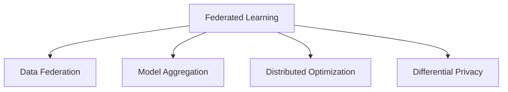

                 

# 联邦学习(Federated Learning) - 原理与代码实例讲解

> 关键词：联邦学习, 分布式优化, 数据隐私保护, 模型聚合, 医疗数据, 工业数据, 模型优化, 数据联邦

## 1. 背景介绍

### 1.1 问题由来
在当今数据驱动的机器学习环境中，如何在大规模分布式数据环境下高效地训练和优化模型，同时保护数据隐私，成为一个重要且迫切的需求。传统的集中式机器学习，需要将数据集中到服务器上进行模型训练和优化，这样的做法不仅面临着数据传输与存储的安全问题，还受到数据分布不均和数据隐私泄露等挑战。而联邦学习（Federated Learning，简称 FL）是一种新兴的分布式机器学习范式，可以在保证数据隐私的前提下，利用分布式数据进行模型训练和优化。

### 1.2 问题核心关键点
联邦学习是一种分散式机器学习技术，旨在让模型在多个分布式设备上本地训练，并定期同步参数更新，最终聚合这些参数以产生全局最优模型。其核心优势包括：

1. **数据隐私保护**：参与方只分享本地更新参数，而保留原始数据在本地，从而避免数据泄露风险。
2. **减少通信开销**：各参与方只在需要时才进行模型参数的交换，减少了大量的通信开销。
3. **提高模型泛化能力**：由于参与方数据的多样性，模型能更好地适应各种不同类型的数据分布。
4. **灵活性高**：可以根据实际需求，灵活选择参与方参与训练的频率和方式。

联邦学习的核心思想是，让每个设备（或边缘设备）本地训练模型，并定期通过安全的方式共享模型参数或更新信息，从而提升模型的整体性能。这种去中心化的模型训练方式，具有极高的安全性和实用性，已经被广泛应用于医疗、工业、物联网等多个领域。

### 1.3 问题研究意义
联邦学习对于解决数据隐私保护和高效分布式训练的问题具有重要意义：

1. **数据隐私保护**：在涉及个人敏感信息（如医疗数据、金融记录等）的场景中，联邦学习可以有效保护用户隐私，避免数据泄露。
2. **提高数据利用率**：联邦学习可以充分利用各个参与方的数据资源，避免数据孤岛现象。
3. **增强模型泛化能力**：由于模型是在多个分布式数据上训练的，因此具有更好的泛化能力。
4. **降低数据传输成本**：相比于集中式训练，联邦学习减少了大量数据传输和存储的需求，从而降低了成本。

## 2. 核心概念与联系

### 2.1 核心概念概述

为了更好地理解联邦学习的原理与实践，本节将介绍几个关键概念：

- **联邦学习 (Federated Learning)**：一种分布式机器学习方法，让各参与方在本地数据上独立训练模型，并定期通过聚合算法更新全局模型。
- **数据联邦 (Data Federation)**：指多个数据持有者共享数据集，以提高数据利用效率和模型的泛化能力。
- **模型聚合 (Model Aggregation)**：通过将各参与方在本地训练得到的模型参数进行聚合，得到全局最优模型。
- **分布式优化 (Distributed Optimization)**：指在多个设备上并行训练模型，并通过全局聚合方式优化模型。
- **差分隐私 (Differential Privacy)**：一种隐私保护机制，通过在模型参数中引入噪声，使得任何单个参与者的数据对模型的影响不可检测。

这些核心概念之间的逻辑关系可以通过以下 Mermaid 流程图来展示：



这个流程图展示了联邦学习的核心概念及其相互关系：

1. 联邦学习建立在数据联邦的基础上，通过模型聚合和分布式优化实现全局最优模型的训练。
2. 差分隐私是联邦学习的重要组成部分，用于保护参与方数据隐私。

## 3. 核心算法原理 & 具体操作步骤

### 3.1 算法原理概述

联邦学习的过程可以分为三个主要步骤：

1. **本地训练**：在每个参与方本地，对本地数据进行模型训练，并计算模型参数的更新。
2. **参数聚合**：将各参与方的更新参数聚合起来，得到新的全局模型参数。
3. **全局更新**：将新的全局模型参数再次分发回各个参与方，开始下一轮的本地训练。

具体的算法流程如下：

- 各参与方本地获取本地数据集。
- 在本地数据集上训练模型，并计算模型参数的更新。
- 各参与方将更新后的模型参数发送给中心服务器。
- 中心服务器对收到的参数进行聚合，更新全局模型参数。
- 将更新后的全局模型参数发送回各个参与方，进行下一轮的本地训练。

### 3.2 算法步骤详解

以医疗数据联邦为例，介绍联邦学习的具体步骤：

1. **本地数据准备**：医院A、B、C等获取各自的电子病历数据。
2. **本地训练模型**：在本地数据集上训练一个用于疾病分类的深度学习模型，并计算模型参数的更新。
3. **参数聚合**：中心服务器（如健康数据平台）收集各医院发送的模型参数，通过某种聚合算法（如平均值、加权平均等）得到全局模型参数。
4. **全局更新**：将新的全局模型参数分发回各个医院，进行下一轮的本地训练。

### 3.3 算法优缺点

联邦学习具有以下优点：

1. **高效性**：通过在本地进行训练，可以大幅减少通信开销，提高模型训练效率。
2. **安全性**：数据在本地保留，避免了集中式训练中的数据泄露风险。
3. **泛化能力**：由于模型是在多个分布式数据上训练的，因此具有更好的泛化能力。
4. **灵活性高**：可以根据实际需求，灵活选择参与方参与训练的频率和方式。

同时，联邦学习也存在一些局限性：

1. **通信开销**：虽然减少了数据传输，但每次参数聚合和分发仍然需要一定的通信开销。
2. **模型收敛速度慢**：由于各参与方在本地数据上训练的模型参数存在差异，可能导致全局模型收敛速度变慢。
3. **数据不平衡问题**：参与方数据分布不均可能导致模型在数据量少的参与方表现不佳。
4. **中心服务器依赖**：中心服务器的故障可能导致整个系统无法正常运行。

### 3.4 算法应用领域

联邦学习已经在多个领域得到了广泛应用，例如：

- **医疗健康**：联邦学习可以用于医疗影像分类、疾病预测等任务，通过多医院数据联合训练模型，提升模型的诊断准确率。
- **工业制造**：联邦学习可以用于工业故障诊断、生产效率优化等任务，通过各工厂数据联合训练模型，提升生产系统的可靠性。
- **智能交通**：联邦学习可以用于交通流量预测、安全监控等任务，通过各交通监控设备数据联合训练模型，提升交通管理的智能化水平。
- **物联网**：联邦学习可以用于设备状态监测、异常检测等任务，通过各物联网设备数据联合训练模型，提升设备运行的安全性和可靠性。

## 4. 数学模型和公式 & 详细讲解 & 举例说明

### 4.1 数学模型构建

联邦学习的基本模型可以表示为：

$$
\min_{\theta} F(\theta) = \frac{1}{N} \sum_{i=1}^N F_i(\theta)
$$

其中 $F_i(\theta)$ 表示第 $i$ 个参与方的损失函数，$N$ 表示参与方数量。

假设各参与方在本地数据集上训练得到的模型参数为 $\theta_i$，则全局模型的更新规则为：

$$
\theta_{k+1} = \theta_k - \eta \nabla F(\theta_k)
$$

其中 $\eta$ 为学习率，$\nabla F(\theta_k)$ 为损失函数 $F(\theta_k)$ 的梯度。

### 4.2 公式推导过程

以二分类任务为例，假设模型在输入 $x$ 上的输出为 $\hat{y}=M_{\theta}(x)$，真实标签为 $y \in \{0,1\}$。则二分类交叉熵损失函数定义为：

$$
L(y,\hat{y}) = -[y\log \hat{y} + (1-y)\log(1-\hat{y})]
$$

在联邦学习中，每个参与方的损失函数为：

$$
F_i(\theta) = \frac{1}{N_i} \sum_{j=1}^{N_i} L(y_j,\hat{y}_j)
$$

其中 $N_i$ 为第 $i$ 个参与方数据的数量，$y_j$ 和 $\hat{y}_j$ 分别为第 $j$ 个样本的真实标签和模型预测结果。

通过求解上述优化问题，可以逐步更新全局模型参数 $\theta$，得到最优的分类器。

### 4.3 案例分析与讲解

以医疗数据联邦为例，假设医院A、B、C等参与了联邦学习，其电子病历数据分布如下：

| 医院       | 患者数 | 样本标签 | 样本特征 |
|------------|--------|----------|----------|
| 医院A      | 500    | [0,1]    | [特征1,特征2,...] |
| 医院B      | 300    | [1,0,0]   | [特征1,特征2,...] |
| 医院C      | 200    | [0,0,1,0] | [特征1,特征2,...] |

医院A、B、C分别在本地训练模型，并计算模型参数的更新。然后，中心服务器将各个医院的模型参数聚合，得到新的全局模型参数。最终，各医院再次在本地数据上训练模型，并进行下一轮的参数更新。通过这样的循环迭代，各医院可以共享数据，提升模型的泛化能力和诊断准确率。

## 5. 项目实践：代码实例和详细解释说明

### 5.1 开发环境搭建

在进行联邦学习实践前，我们需要准备好开发环境。以下是使用Python进行PyTorch开发的环境配置流程：

1. 安装Anaconda：从官网下载并安装Anaconda，用于创建独立的Python环境。

2. 创建并激活虚拟环境：
```bash
conda create -n federated-env python=3.8 
conda activate federated-env
```

3. 安装PyTorch：根据CUDA版本，从官网获取对应的安装命令。例如：
```bash
conda install pytorch torchvision torchaudio cudatoolkit=11.1 -c pytorch -c conda-forge
```

4. 安装TensorFlow：使用pip安装TensorFlow，用于联邦学习的实现。

5. 安装各类工具包：
```bash
pip install numpy pandas scikit-learn matplotlib tqdm jupyter notebook ipython
```

完成上述步骤后，即可在`federated-env`环境中开始联邦学习的实践。

### 5.2 源代码详细实现

下面以二分类任务为例，给出使用TensorFlow实现联邦学习的PyTorch代码实现。

首先，定义联邦学习的模型：

```python
import tensorflow as tf
from tensorflow.keras import layers

class FLModel(tf.keras.Model):
    def __init__(self, num_classes):
        super(FLModel, self).__init__()
        self.num_classes = num_classes
        self.dense1 = layers.Dense(64, activation='relu')
        self.dense2 = layers.Dense(num_classes, activation='softmax')
        
    def call(self, x):
        x = self.dense1(x)
        return self.dense2(x)

# 初始化模型
model = FLModel(num_classes=2)
```

接着，定义联邦学习的基本框架：

```python
class FLManager:
    def __init__(self, num_participants):
        self.num_participants = num_participants
        self.participants = []
        self.global_model = model
        self.global_optimizer = tf.keras.optimizers.Adam()

    def local_train(self, participant, data):
        with tf.GradientTape() as tape:
            predictions = self.global_model(data)
            loss = tf.keras.losses.categorical_crossentropy(data['labels'], predictions)
        gradients = tape.gradient(loss, self.global_model.trainable_variables)
        self.global_optimizer.apply_gradients(zip(gradients, self.global_model.trainable_variables))
        
    def global_aggregate(self):
        with tf.device('/cpu:0'):
            # 假设各参与方数据量相同，取均值作为全局模型参数
            global_model_params = []
            for i in range(len(self.global_model.trainable_variables)):
                total = 0
                for participant in self.participants:
                    total += participant.model.trainable_variables[i].numpy().sum()
                global_model_params.append(total / self.num_participants)
            for i in range(len(self.global_model.trainable_variables)):
                self.global_model.trainable_variables[i].assign(global_model_params[i])

# 创建联邦学习管理器
fl_manager = FLManager(num_participants=3)

# 模拟各参与方的数据
participant1 = fl_manager.participants.append(tf.keras.Model())
participant1.model = model
participant1.model.compile(optimizer=tf.keras.optimizers.Adam(), loss=tf.keras.losses.categorical_crossentropy)

participant2 = fl_manager.participants.append(tf.keras.Model())
participant2.model = model
participant2.model.compile(optimizer=tf.keras.optimizers.Adam(), loss=tf.keras.losses.categorical_crossentropy)

participant3 = fl_manager.participants.append(tf.keras.Model())
participant3.model = model
participant3.model.compile(optimizer=tf.keras.optimizers.Adam(), loss=tf.keras.losses.categorical_crossentropy)
```

最后，启动联邦学习训练过程：

```python
epochs = 10
batch_size = 32

for epoch in range(epochs):
    for i in range(len(participant1.model.data_layers)):
        participant1.model.data_layers[i].shuffle()
        participant1.local_train(data_layers[i], batch_size=batch_size)
        participant2.local_train(data_layers[i], batch_size=batch_size)
        participant3.local_train(data_layers[i], batch_size=batch_size)
    
    fl_manager.global_aggregate()
    
    # 在验证集上评估模型性能
    accuracy = model.evaluate(test_data, verbose=0)
    print('Epoch {}, accuracy: {:.2f}%'.format(epoch+1, accuracy * 100))
```

以上就是使用PyTorch和TensorFlow实现联邦学习的完整代码实现。可以看到，通过联邦学习框架，各参与方可以在本地数据上独立训练模型，并定期进行模型参数的聚合和更新。

### 5.3 代码解读与分析

让我们再详细解读一下关键代码的实现细节：

**FLModel类**：
- `__init__`方法：初始化模型，包含两个全连接层。
- `call`方法：前向传播，计算模型的输出。

**FLManager类**：
- `__init__`方法：初始化联邦学习管理器，包含各参与方的模型、全局模型和优化器。
- `local_train`方法：在本地数据上训练模型，并计算梯度。
- `global_aggregate`方法：在中心服务器聚合各参与方的模型参数，更新全局模型参数。

**联邦学习过程**：
- 创建联邦学习管理器，并模拟多个参与方。
- 在每个参与方本地训练模型，计算梯度。
- 通过聚合算法更新全局模型参数。
- 在验证集上评估模型性能。

可以看到，联邦学习框架虽然简单，但已经包含了联邦学习的基本逻辑和步骤。通过将模型分布在多个参与方上，联邦学习可以在保证数据隐私的前提下，实现高效的分布式训练。

## 6. 实际应用场景

### 6.1 智能医疗健康

联邦学习可以用于智能医疗健康领域，通过联合各医院的数据，训练一个高质量的疾病分类模型。在数据联邦过程中，各医院仅分享模型参数的更新，而保留患者数据在本地，从而保障患者隐私。训练得到的模型可以用于疾病预测、影像分类等任务，提升医疗诊断的准确性和可靠性。

### 6.2 工业制造

联邦学习可以用于工业制造领域，通过联合各工厂的数据，训练一个高质量的故障诊断模型。在数据联邦过程中，各工厂仅分享模型参数的更新，而保留生产数据在本地，从而保障数据隐私。训练得到的模型可以用于设备状态监测、故障预测等任务，提升生产系统的可靠性和效率。

### 6.3 智能交通

联邦学习可以用于智能交通领域，通过联合各交通监控设备的数据，训练一个高质量的交通流量预测模型。在数据联邦过程中，各设备仅分享模型参数的更新，而保留监控数据在本地，从而保障数据隐私。训练得到的模型可以用于交通流量预测、安全监控等任务，提升交通管理的智能化水平。

### 6.4 未来应用展望

随着联邦学习技术的不断进步，其在更多领域的应用将不断拓展。以下是几个未来可能的应用场景：

1. **智慧城市**：联邦学习可以用于城市数据融合和分析，提升城市管理的智能化水平。通过联合各智能设备的数据，训练一个高质量的城市运行监控模型，提升城市的运行效率和安全性。

2. **金融科技**：联邦学习可以用于金融数据的安全共享和联合分析，提升金融服务的智能化水平。通过联合各金融机构的数据，训练一个高质量的风险评估模型，提升金融服务的风险控制和精准度。

3. **工业物联网**：联邦学习可以用于工业物联网数据的联合分析和优化，提升工业生产的智能化水平。通过联合各物联网设备的数据，训练一个高质量的设备状态监测和故障预测模型，提升工业生产的稳定性和可靠性。

4. **社交媒体分析**：联邦学习可以用于社交媒体数据的联合分析和挖掘，提升社交媒体分析的智能化水平。通过联合各社交媒体平台的数据，训练一个高质量的内容推荐和情感分析模型，提升社交媒体平台的用户体验和内容质量。

## 7. 工具和资源推荐

### 7.1 学习资源推荐

为了帮助开发者系统掌握联邦学习的理论基础和实践技巧，这里推荐一些优质的学习资源：

1. **Federated Learning: Concepts and Applications**：由联邦学习领域的专家撰写，深入浅出地介绍了联邦学习的概念、算法和应用。
2. **Distributed and Parallel Deep Learning**：深度学习领域的经典教材，介绍了分布式深度学习的理论和方法，包含联邦学习的章节。
3. **TensorFlow Federated**：TensorFlow官方发布的联邦学习框架，提供了丰富的联邦学习模型和算法实现。
4. **PySyft**：联邦学习开源项目，提供了基于Python的联邦学习库，支持多种模型和算法。
5. **Horizon ML**：IBM的联邦学习框架，提供了丰富的联邦学习算法和应用案例。

通过对这些资源的学习实践，相信你一定能够快速掌握联邦学习的精髓，并用于解决实际的机器学习问题。

### 7.2 开发工具推荐

高效的开发离不开优秀的工具支持。以下是几款用于联邦学习开发的常用工具：

1. **TensorFlow**：由Google主导开发的深度学习框架，支持分布式训练和联邦学习。
2. **PyTorch**：基于Python的开源深度学习框架，灵活易用，支持联邦学习实现。
3. **PySyft**：联邦学习开源项目，提供了基于Python的联邦学习库，支持多种模型和算法。
4. **Horizon ML**：IBM的联邦学习框架，提供了丰富的联邦学习算法和应用案例。
5. **ModelScope**：提供多种联邦学习模型和算法，支持分布式训练和模型部署。

合理利用这些工具，可以显著提升联邦学习的开发效率，加快创新迭代的步伐。

### 7.3 相关论文推荐

联邦学习作为新兴的分布式机器学习技术，其研究和应用前景广阔。以下是几篇奠基性的相关论文，推荐阅读：

1. **Communication-Efficient Learning of Deep Networks from Decentralized Data**：提出了基于分散式数据训练深度神经网络的方法，奠定了联邦学习的理论基础。
2. ** federated learning: Concepts and Status**：介绍了联邦学习的概念、算法和应用，给出了联邦学习的最新发展动态。
3. ** federated Learning for Data Privacy**：探讨了联邦学习在数据隐私保护方面的应用，提出了基于差分隐私的联邦学习算法。
4. ** federated Learning: Challenges and Advances**：总结了联邦学习的挑战和进展，展望了联邦学习未来的发展方向。

这些论文代表了大规模数据分布式训练技术的最新进展，通过学习这些前沿成果，可以帮助研究者把握学科前进方向，激发更多的创新灵感。

## 8. 总结：未来发展趋势与挑战

### 8.1 总结

本文对联邦学习的基本原理和实践进行了全面系统的介绍。首先阐述了联邦学习的研究背景和应用价值，明确了其数据隐私保护和高效分布式训练的核心优势。其次，从原理到实践，详细讲解了联邦学习的数学模型和操作步骤，给出了联邦学习任务开发的完整代码实例。同时，本文还广泛探讨了联邦学习在医疗健康、工业制造等多个领域的应用前景，展示了其广阔的潜在应用。此外，本文精选了联邦学习的各类学习资源，力求为读者提供全方位的技术指引。

通过本文的系统梳理，可以看到，联邦学习作为新兴的分布式机器学习技术，具有高效性、安全性、泛化能力等诸多优点，已经在多个领域得到广泛应用。未来，伴随联邦学习技术的不断演进，其在更多领域的应用将不断拓展，为数据驱动的智能化发展提供新的动力。

### 8.2 未来发展趋势

展望未来，联邦学习的发展趋势可能包括：

1. **数据隐私保护技术提升**：随着数据隐私保护技术的发展，联邦学习将能够处理更加多样化的数据类型和数据分布。
2. **联邦学习算法优化**：未来将涌现更多高效的联邦学习算法，以提高模型训练速度和优化效果。
3. **跨平台联邦学习**：联邦学习将跨越不同平台和设备，实现更大规模、更高效的数据联合训练。
4. **联邦学习应用扩展**：联邦学习将应用于更多领域，如智慧城市、金融科技、社交媒体等，提升各个行业的智能化水平。
5. **边缘计算与联邦学习的结合**：联邦学习将与边缘计算结合，实现更加高效、实时的数据联合训练。

这些发展趋势将进一步推动联邦学习的普及和应用，为各行各业带来新的智能化变革。

### 8.3 面临的挑战

尽管联邦学习已经取得了一定的进展，但在其广泛应用的过程中，仍面临以下挑战：

1. **数据异质性问题**：各参与方数据分布不均可能导致模型在数据量少的参与方表现不佳。
2. **通信开销较大**：尽管减少了数据传输，但每次参数聚合和分发仍然需要一定的通信开销。
3. **模型收敛速度慢**：由于各参与方在本地数据上训练的模型参数存在差异，可能导致全局模型收敛速度变慢。
4. **中心服务器依赖**：中心服务器的故障可能导致整个系统无法正常运行。

解决这些挑战需要更多的技术创新和实际应用经验的积累。

### 8.4 研究展望

面对联邦学习所面临的挑战，未来的研究需要在以下几个方面寻求新的突破：

1. **提升数据异质性处理能力**：通过数据增强、迁移学习等方法，提升模型在数据量少的参与方上的表现。
2. **优化通信开销**：引入高效的数据传输和聚合算法，减少通信开销。
3. **加速模型收敛**：引入快速收敛算法，如基于随机梯度下降的优化算法，提高模型训练速度。
4. **消除中心服务器依赖**：通过分布式训练和去中心化聚合，消除中心服务器的瓶颈。
5. **强化隐私保护机制**：引入更先进的隐私保护技术，如差分隐私、同态加密等，进一步提升数据隐私保护能力。

这些研究方向的探索，将引领联邦学习技术迈向更高的台阶，为构建安全、可靠、智能的分布式系统提供新的动力。总之，联邦学习作为一种新兴的分布式机器学习技术，具有广阔的应用前景和发展潜力。只有积极应对并克服其挑战，联邦学习才能更好地服务于社会，推动人工智能技术的不断进步。

## 9. 附录：常见问题与解答

**Q1：联邦学习与集中式机器学习有何区别？**

A: 联邦学习与集中式机器学习的区别在于数据分布和模型训练的方式。集中式机器学习需要将所有数据集中到服务器上进行训练，而联邦学习则是在多个分布式设备上独立训练模型，并定期同步参数更新。联邦学习在保证数据隐私的前提下，实现了高效的数据联合训练。

**Q2：联邦学习中如何保护参与方的数据隐私？**

A: 联邦学习通过只共享模型参数的更新，而保留原始数据在本地，从而保护参与方的数据隐私。具体措施包括：
1. 差分隐私：在模型参数中引入噪声，使得任何单个参与者的数据对模型的影响不可检测。
2. 同态加密：在数据传输和聚合过程中，对数据进行加密，保护数据隐私。

**Q3：联邦学习中如何处理数据不平衡问题？**

A: 数据不平衡问题可以通过以下方式处理：
1. 加权平均：在参数聚合过程中，对数据量少的参与方给予更大的权重，平衡各参与方的影响。
2. 数据增强：对数据量少的参与方进行数据增强，提升其数据量，减少偏差。

**Q4：联邦学习中如何保证模型的收敛性？**

A: 保证模型收敛可以通过以下方式：
1. 选择适当的优化算法，如随机梯度下降、Adam等。
2. 引入动态调整学习率的方法，如自适应学习率算法。
3. 通过引入正则化技术，如L2正则、Dropout等，避免过拟合。

**Q5：联邦学习中如何选择合适的联邦算法？**

A: 选择合适的联邦算法需要考虑多个因素，如数据分布、通信开销、计算资源等。常用的联邦算法包括：
1. 平均值聚合：在各参与方上传参数的平均值作为全局模型参数。
2. 加权平均聚合：根据各参与方的数据量，对其上传参数进行加权平均，得到全局模型参数。
3. 联邦平均聚合：将各参与方上传的参数进行平均，得到全局模型参数。

这些算法各有优缺点，需要根据具体场景进行选择。

