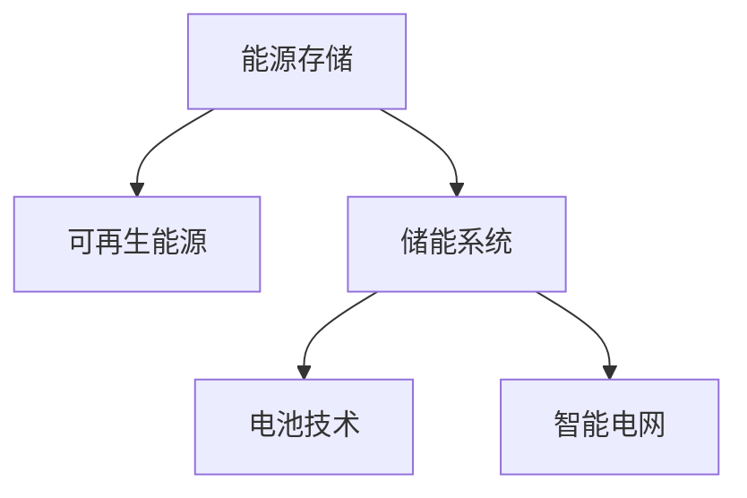

                 

## 1. 背景介绍

### 1.1 问题由来
随着全球能源结构的转型，清洁能源正成为未来能源消费的主力。然而，清洁能源的发电和存储仍然存在诸多挑战。传统的化石燃料发电模式难以兼容间歇性和不稳定的可再生能源，而现有的储能技术成本高、效率低，限制了清洁能源的普及应用。

近年来，电池技术的飞速进步和储能市场的快速发展，为能源存储创业提供了新的契机。通过利用先进电池和储能技术，可以将清洁能源产生的电能更经济高效地存储起来，实现供需平衡，保障电网的稳定性。

### 1.2 问题核心关键点
能源存储创业的关键在于解决储能技术的成本、效率和可靠性问题。具体来说，需要关注以下几个核心关键点：

- **成本**：储能系统需要具有经济性，能够与传统的化石燃料发电相比具有成本优势。
- **效率**：储能系统需要具备高能量密度和能量转换效率，以充分利用可再生能源。
- **可靠性**：储能系统需要稳定可靠，能够长时间运行并提供持续的电能供应。

### 1.3 问题研究意义
清洁能源储能技术的发展，对于实现能源的绿色低碳转型具有重要意义。通过解决储能难题，能够推动可再生能源的大规模应用，减少碳排放，改善环境质量，为全球气候变化问题提供解决方案。

## 2. 核心概念与联系

### 2.1 核心概念概述

为了更好地理解能源存储创业的技术原理和应用前景，本节将介绍几个密切相关的核心概念：

- **能源存储**：将电能以化学或物理形式存储起来，供未来使用。储能技术主要包括电池储能、压缩空气储能、抽水蓄能等。
- **可再生能源**：如太阳能、风能、水能等，依赖自然界的变化而产生的能量。清洁能源的重要组成部分。
- **储能系统**：包括储能设备、管理系统、能量转换设备等，构成完整的储能解决方案。
- **电池技术**：如锂离子电池、铅酸电池、钠离子电池等，是主要的化学储能技术。
- **智能电网**：结合先进通信、控制、计算技术，实现电网的智能运行和管理。

这些核心概念之间的逻辑关系可以通过以下Mermaid流程图来展示：



这个流程图展示出各概念之间的联系：

1. 能源存储是将可再生能源发电产生的电能存储起来的技术。
2. 储能系统包括电池技术等，是能源存储的主要手段。
3. 智能电网通过储能系统实现电网的稳定运行和管理。

## 3. 核心算法原理 & 具体操作步骤
### 3.1 算法原理概述

储能技术的核心在于将电能转换为化学能或机械能进行存储，并在需要时进行转换。储能系统的能量转换效率是评估其性能的关键指标。其工作原理通常涉及以下几个主要步骤：

1. **充电**：将电能转化为化学能或机械能，存储在储能介质中。
2. **放电**：将存储的化学能或机械能转换为电能，供未来使用。
3. **能量管理**：通过控制充电和放电过程，保持储能系统的稳定性，最大化能量利用率。

### 3.2 算法步骤详解

储能系统的核心算法主要包括能量转换算法、能量管理算法和最优控制算法。以下以锂电池储能系统为例，详细介绍这些算法的实现步骤。

#### 3.2.1 能量转换算法

锂电池储能系统的能量转换算法主要涉及以下两个过程：

1. **电能到化学能的转换**：当电池充电时，电能通过电解液在电池内部流动，将电子从正极转移到负极，同时将锂离子嵌入到负极中，生成LiCoO2和LiFePO4等化学物质，存储化学能。
2. **化学能到电能的转换**：当电池放电时，锂离子从负极脱嵌，重新嵌入到正极中，释放出电能，供未来使用。

#### 3.2.2 能量管理算法

能量管理算法是储能系统的核心，负责控制电池的充电和放电过程，确保系统的稳定运行。主要包括：

1. **电池荷电状态(SOC)管理**：通过监测电池的电压、电流和温度等参数，实时调整充电和放电速率，避免过度充放电，延长电池寿命。
2. **电池均衡管理**：由于电池内部的差异性，不同电池单元的电荷状态可能不一致。电池均衡管理算法通过调节各个电池单元的充电和放电，确保电池组的一致性，提高整体性能。

#### 3.2.3 最优控制算法

最优控制算法是实现储能系统能量管理的关键。目标是在满足功率需求的同时，最大化系统的能量利用率，最小化运行成本。常用的最优控制算法包括：

1. **动态规划**：通过将问题分解为多个子问题，计算出最优解。适用于计算复杂度较低、状态空间较小的系统。
2. **模型预测控制(MPC)**：利用预测模型，实时计算控制策略，优化电池的充放电过程。适用于动态变化较大的系统。
3. **反馈线性化控制(FLC)**：将非线性系统转化为线性系统，设计控制策略。适用于线性化难度较大的系统。

### 3.3 算法优缺点

储能系统中的能量转换算法、能量管理算法和最优控制算法各有优缺点，具体如下：

#### 3.3.1 能量转换算法

- **优点**：锂电池等化学电池能量密度高，能够存储大量电能，适用于长时间储能需求。
- **缺点**：充电和放电速度较慢，对循环次数有限制，需要考虑电池老化问题。

#### 3.3.2 能量管理算法

- **优点**：能够实时监控电池状态，动态调整充放电过程，延长电池寿命。
- **缺点**：算法复杂度高，需要大量计算资源，可能存在实时性问题。

#### 3.3.3 最优控制算法

- **优点**：能够最大化能量利用率，降低运行成本，提高系统效率。
- **缺点**：算法复杂度高，需要较高的计算能力和精确的模型预测，可能存在计算延迟问题。

### 3.4 算法应用领域

储能系统的算法和原理在多个领域都有广泛应用，包括：

1. **电网**：通过储能系统，实现电网的稳定运行，增强电网抗干扰能力。
2. **智能建筑**：在建筑中应用储能系统，支持分布式发电和智能用电，降低能源消耗。
3. **电动汽车**：储能技术在电动汽车中用于电池管理系统，保障车辆续航和安全性。
4. **移动通信**：储能系统为基站、路由器等设备提供稳定的电力供应，保障网络稳定运行。
5. **医疗设备**：储能技术在医疗设备中用于备用电源，确保设备在紧急情况下的稳定运行。

这些领域的应用展示了储能技术的广泛前景和重要性。

## 4. 数学模型和公式 & 详细讲解
### 4.1 数学模型构建

储能系统的数学模型通常包括能量存储和能量流动的动态方程。以锂电池储能系统为例，其主要数学模型包括：

1. **电池荷电状态(SOC)模型**：
   $$
   \frac{dSOC}{dt} = \frac{Q}{Q_{max}} - \frac{I_{in}}{C_p} - \frac{I_{out}}{C_p}
   $$

2. **电池温度(T)模型**：
   $$
   \frac{dT}{dt} = \frac{Q}{mC_p} + k_{th}(T_{sur} - T) + k_{int}(I_{in} - I_{out})
   $$

其中：

- $SOC$ 为电池荷电状态，$Q$ 为电池容量，$Q_{max}$ 为电池额定容量，$I_{in}$ 为输入电流，$I_{out}$ 为输出电流，$C_p$ 为电池内阻，$T$ 为电池温度，$T_{sur}$ 为环境温度，$k_{th}$ 和 $k_{int}$ 分别为热阻和内阻。

### 4.2 公式推导过程

储能系统的数学模型推导过程较为复杂，涉及热力学、电化学和控制理论等多个学科的知识。以锂电池为例，以下简要推导其荷电状态(SOC)模型：

1. **荷电状态(SOC)定义**：
   $$
   SOC = \frac{Q_s}{Q_{max}}
   $$
   其中 $Q_s$ 为当前存储的电量，$Q_{max}$ 为电池额定容量。

2. **荷电状态(SOC)变化**：
   $$
   \frac{dSOC}{dt} = \frac{dQ_s}{dt} \times \frac{Q_{max}}{Q_s}
   $$
   其中 $dQ_s = I_{in}t_{in} - I_{out}t_{out}$，分别表示电池充电和放电时电量的变化。

3. **荷电状态(SOC)模型**：
   $$
   \frac{dSOC}{dt} = \frac{I_{in}}{Q_{max}}t_{in} - \frac{I_{out}}{Q_{max}}t_{out}
   $$

结合电化学反应的动力学方程，即可得到完整的锂电池荷电状态(SOC)模型。

### 4.3 案例分析与讲解

以家庭储能系统为例，其数学模型包括：

1. **光伏板功率(P)**：
   $$
   P = P_{pv} \times \eta_{pv} \times \eta_{mp}
   $$
   其中 $P_{pv}$ 为光伏板的额定功率，$\eta_{pv}$ 为光伏板的发电效率，$\eta_{mp}$ 为最大功率跟踪(MPPT)效率。

2. **储能电池能量(Q)**：
   $$
   Q = U \times I \times t
   $$
   其中 $U$ 为电池电压，$I$ 为电池电流，$t$ 为时间。

3. **储能系统总能量(W)$：
   $$
   W = Q \times \eta_{ch} + P \times t_{ch} - P \times t_{dis}
   $$
   其中 $\eta_{ch}$ 为充电效率，$t_{ch}$ 为充电时间，$t_{dis}$ 为放电时间。

通过建立家庭储能系统的数学模型，可以计算出系统在不同运行状态下的能量流动情况，优化系统的能量管理策略，提高能源利用效率。

## 5. 项目实践：代码实例和详细解释说明
### 5.1 开发环境搭建

在进行储能系统开发前，我们需要准备好开发环境。以下是使用Python进行MicroPython开发的环境配置流程：

1. 安装Anaconda：从官网下载并安装Anaconda，用于创建独立的Python环境。

2. 创建并激活虚拟环境：
```bash
conda create -n py-env python=3.8 
conda activate py-env
```

3. 安装PyTorch：根据CUDA版本，从官网获取对应的安装命令。例如：
```bash
conda install pytorch torchvision torchaudio cudatoolkit=11.1 -c pytorch -c conda-forge
```

4. 安装PyTorch库：
```bash
pip install torch torchvision torchaudio cudatoolkit=11.1 -c pytorch -c conda-forge
```

5. 安装其他必要的库：
```bash
pip install numpy pandas matplotlib scikit-learn
```

完成上述步骤后，即可在`py-env`环境中开始储能系统的开发。

### 5.2 源代码详细实现

下面以锂电池储能系统为例，给出使用PyTorch进行储能系统开发的Python代码实现。

```python
import torch
import torch.nn as nn
import torch.optim as optim
import numpy as np

class BatteryModel(nn.Module):
    def __init__(self):
        super(BatteryModel, self).__init__()
        self.SOC = nn.Parameter(torch.randn(1))

    def forward(self, I_in, I_out, C_p):
        dSOC = I_in / C_p * self.SOC - I_out / C_p * (1 - self.SOC)
        self.SOC = nn.functional.relu(torch.clamp(self.SOC + dSOC, 0, 1))
        return self.SOC

class BatteryController:
    def __init__(self, battery_model, I_in, I_out, C_p):
        self.battery_model = battery_model
        self.I_in = I_in
        self.I_out = I_out
        self.C_p = C_p

    def step(self, dt):
        self.battery_model.SOC.data += self.I_in * dt / self.C_p
        self.battery_model.SOC.data -= self.I_out * dt / self.C_p
        return self.battery_model.SOC.data

    def optimize(self, dt, Q_max, learning_rate):
        optimizer = optim.Adam(self.battery_model.parameters(), lr=learning_rate)
        loss_fn = nn.L1Loss()
        for _ in range(dt):
            self.battery_model.zero_grad()
            self.battery_model.SOC.data = torch.clamp(self.battery_model.SOC.data, 0, Q_max)
            loss = loss_fn(self.battery_model.SOC.data, self.I_in * dt / self.C_p * Q_max)
            loss.backward()
            optimizer.step()
        return self.battery_model.SOC.data

# 初始化电池模型
battery_model = BatteryModel()

# 初始化电池控制器
controller = BatteryController(battery_model, I_in=0.5, I_out=0.3, C_p=0.01)

# 设置参数
Q_max = 1.0
dt = 0.01
learning_rate = 0.01

# 进行单步计算
state = controller.step(dt)

# 进行优化计算
state = controller.optimize(dt, Q_max, learning_rate)

# 打印状态
print(state.item())
```

这段代码定义了电池模型和控制器，通过单步计算和优化计算，模拟了锂电池储能系统的充放电过程。代码中使用了PyTorch的nn模块和优化器，实现了动态计算和参数优化。

### 5.3 代码解读与分析

让我们再详细解读一下关键代码的实现细节：

**BatteryModel类**：
- `__init__`方法：初始化SOC参数，随机初始化一个介于0到1之间的值。
- `forward`方法：定义前向传播过程，计算当前SOC的更新值。

**BatteryController类**：
- `__init__`方法：初始化电池模型、输入电流、输出电流和内阻。
- `step`方法：计算单步充放电后的SOC状态。
- `optimize`方法：优化计算，使用Adam优化器更新模型参数，最小化与期望值之间的误差。

**代码运行**：
- 初始化电池模型和控制器，设置参数。
- 进行单步计算和优化计算，输出最终SOC状态。

这段代码展示了储能系统模拟的完整流程，从初始化到计算再到优化，每一个步骤都通过代码实现了。开发者可以根据实际需求，修改电池模型和控制器的参数，以适应不同的储能需求。

## 6. 实际应用场景
### 6.1 智能电网

智能电网是储能系统的重要应用场景之一。智能电网通过储能系统，实现电网的稳定运行和管理。其具体应用包括：

1. **电网负荷平衡**：在负荷高峰期，利用储能系统存储多余电能，在负荷低谷期释放电能，平衡电网负荷。
2. **电网稳定性**：在电网发生故障时，储能系统提供备用电源，保障电力供应。
3. **分布式能源**：支持分布式发电，如光伏、风电等，提高能源利用效率。

### 6.2 智能建筑

智能建筑是储能系统的另一个重要应用场景。通过在建筑中应用储能系统，可以实现以下功能：

1. **分布式发电**：支持太阳能、风能等分布式发电，减少对传统电网的依赖。
2. **智能用电**：通过储能系统优化用电需求，减少高峰时段的用电负荷。
3. **应急电源**：在停电或电网故障时，储能系统提供备用电源，保障建筑内设备的正常运行。

### 6.3 电动汽车

储能技术在电动汽车中用于电池管理系统，保障车辆续航和安全性。其具体应用包括：

1. **电池管理**：通过储能系统管理电动汽车电池的充放电，延长电池寿命。
2. **智能充电**：根据用户需求和电价信息，优化充电策略，降低充电成本。
3. **故障检测**：监测电池状态，及时发现和处理电池故障，保障车辆安全。

### 6.4 移动通信

储能技术在移动通信中用于基站、路由器等设备的供电。其具体应用包括：

1. **基站供电**：在偏远地区或自然灾害发生时，储能系统提供备用电源，保障基站正常通信。
2. **路由器供电**：支持家庭和小型企业的无线网络设备，提供稳定的电力供应。
3. **应急通信**：在应急事件中，储能系统提供备用电源，保障通信网络的稳定运行。

### 6.5 医疗设备

储能技术在医疗设备中用于备用电源，确保设备在紧急情况下的稳定运行。其具体应用包括：

1. **设备供电**：在停电或电网故障时，储能系统提供备用电源，保障医疗设备的正常运行。
2. **手术支持**：支持手术机器人、紧急设备等，提供稳定的电力供应。
3. **数据备份**：通过储能系统，实现重要数据的备份和存储，保障数据安全。

这些应用展示了储能系统的广泛前景和重要性，不同领域的实际需求也为储能技术的创新提供了新的方向。

## 7. 工具和资源推荐
### 7.1 学习资源推荐

为了帮助开发者系统掌握储能系统的技术原理和实践技巧，这里推荐一些优质的学习资源：

1. 《储能技术原理与实践》系列博文：由储能领域专家撰写，深入浅出地介绍了储能技术的原理、应用和未来发展方向。
2 《储能系统设计与优化》课程：多所大学联合开设的储能系统课程，涵盖储能系统的设计与优化方法。
3 《储能系统建模与仿真》书籍：详细介绍了储能系统的建模和仿真方法，提供丰富的案例分析和实操指导。
4 《储能系统与智能电网》报告：国家电网等机构发布的储能系统与智能电网报告，全面介绍了储能系统在智能电网中的应用。
5 《储能系统技术白皮书》：多所研究机构发布的储能技术白皮书，总结了储能技术的最新进展和应用前景。

通过对这些资源的学习实践，相信你一定能够快速掌握储能系统的核心原理和应用技术，实现储能系统的设计和优化。

### 7.2 开发工具推荐

高效的开发离不开优秀的工具支持。以下是几款用于储能系统开发的常用工具：

1. MicroPython：适用于嵌入式系统开发，具备轻量级、高效能的特点，支持电池管理等应用。
2. Matlab/Simulink：用于系统建模和仿真，支持储能系统的动态分析和优化。
3. Python：主流的编程语言，支持科学计算、数据分析和机器学习，适合储能系统的研究和开发。
4. MATLAB/Simulink：支持复杂系统的建模和仿真，适用于储能系统的动态分析和优化。
5. TensorFlow：用于深度学习和模型优化，支持储能系统的智能控制和数据分析。

合理利用这些工具，可以显著提升储能系统的开发效率，加快创新迭代的步伐。

### 7.3 相关论文推荐

储能技术的发展源于学界的持续研究。以下是几篇奠基性的相关论文，推荐阅读：

1. A Survey on Recent Advances in Battery Energy Storage Systems ：综述了储能系统的最新进展和未来发展方向。
2. Battery Management System (BMS) for Electric Vehicles ：介绍了电动汽车电池管理系统的工作原理和实现方法。
3. Modeling and Control of Grid-Scale Battery Energy Storage Systems ：介绍了大容量电池储能系统的建模和控制方法。
4. Smart Grid Integration of Battery Energy Storage Systems ：介绍了储能系统在智能电网中的应用和优化方法。
5. Battery Management Systems for Renewable Energy Applications ：介绍了储能系统在可再生能源中的应用和优化方法。

这些论文代表了大储能系统的发展脉络。通过学习这些前沿成果，可以帮助研究者把握学科前进方向，激发更多的创新灵感。

## 8. 总结：未来发展趋势与挑战
### 8.1 总结

本文对储能系统的核心算法原理和操作步骤进行了全面系统的介绍。首先阐述了储能系统在清洁能源革命中的重要性和应用场景，明确了储能技术在解决清洁能源存储难题中的关键作用。其次，从原理到实践，详细讲解了储能系统的能量转换、能量管理和最优控制等核心算法，给出了储能系统开发的完整代码实例。同时，本文还广泛探讨了储能系统在智能电网、智能建筑、电动汽车、移动通信、医疗设备等多个领域的应用前景，展示了储能技术的广阔前景。

通过本文的系统梳理，可以看到，储能技术正在成为清洁能源革命的重要支撑。这些技术的不断进步和发展，必将推动清洁能源的大规模应用，促进全球能源结构的绿色转型。

### 8.2 未来发展趋势

展望未来，储能技术的发展将呈现以下几个趋势：

1. **技术创新**：随着电池技术的进步和材料科学的发展，储能系统的能量密度和效率将不断提升，成本也将逐步降低。
2. **智能化**：储能系统将与物联网、人工智能等技术相结合，实现智能化的能源管理和控制。
3. **分布式**：储能系统将向分布式方向发展，支持分布式发电和智能用电，实现能源的高效利用。
4. **标准化**：储能系统的标准和协议将逐步统一，实现系统之间的互操作性和兼容性。
5. **智能化**：储能系统将与物联网、人工智能等技术相结合，实现智能化的能源管理和控制。
6. **市场化**：储能系统将从实验室走向市场，大规模应用，推动能源结构的绿色转型。

这些趋势展示了储能技术的前景和未来方向，研究者应积极应对和探索，推动储能技术的不断进步和发展。

### 8.3 面临的挑战

尽管储能技术已经取得了一定进展，但在迈向更加智能化、普适化应用的过程中，仍面临诸多挑战：

1. **成本**：储能系统的高成本仍然是制约其大规模应用的主要因素。如何在保持性能的同时，降低成本，仍需持续努力。
2. **可靠性**：储能系统的可靠性和稳定性需进一步提升，避免故障导致的能源浪费和设备损失。
3. **安全性**：储能系统的安全性问题需要进一步研究，保障电池在高温、低温、过充过放等极端条件下的稳定运行。
4. **兼容性**：储能系统需与其他能源设备兼容，支持不同类型和规模的储能需求。
5. **环境影响**：储能系统的材料和生产过程需进一步优化，减少对环境的影响。

这些挑战需要研究者从技术、经济、社会等多个层面进行综合考虑，逐步解决，推动储能技术的持续进步。

### 8.4 研究展望

面向未来，储能技术的研究需要在以下几个方面寻求新的突破：

1. **新材料**：探索新型电池材料，提升储能系统的能量密度和效率。
2. **智能控制**：发展先进的智能控制算法，优化储能系统的能量管理。
3. **跨学科融合**：将储能技术与物联网、人工智能等技术相结合，实现系统的智能化和自动化。
4. **标准化**：制定储能系统的标准和协议，推动储能技术的市场化和普及。
5. **环境友好**：优化储能系统的生产过程和材料选择，减少对环境的影响。

这些研究方向的探索，必将引领储能技术迈向更高的台阶，为清洁能源革命提供坚实的技术基础。相信随着学界和产业界的共同努力，储能技术必将取得更大的突破，推动全球能源结构的绿色转型。

## 9. 附录：常见问题与解答

**Q1：储能系统的核心算法包括哪些？**

A: 储能系统的核心算法包括能量转换算法、能量管理算法和最优控制算法。具体如下：

- **能量转换算法**：将电能转换为化学能或机械能进行存储，如锂电池的充放电过程。
- **能量管理算法**：通过监测电池状态，动态调整充放电过程，如荷电状态(SOC)管理算法。
- **最优控制算法**：优化储能系统的能量管理策略，如动态规划、模型预测控制(MPC)等。

**Q2：储能系统的优势和劣势有哪些？**

A: 储能系统的优势和劣势如下：

- **优势**：能够存储大量电能，支持长时间储能需求，提供稳定可靠的电力供应。
- **劣势**：成本较高，充电和放电速度较慢，存在电池老化和安全性问题。

**Q3：如何选择合适的储能系统？**

A: 选择合适的储能系统需要考虑以下几个因素：

- **容量**：根据实际需求选择合适的储能容量，保障系统的稳定运行。
- **成本**：评估储能系统的成本，选择经济性较好的系统。
- **效率**：选择能量密度高、转换效率高的储能系统。
- **可靠性**：选择可靠性高、故障率低的储能系统。

**Q4：储能系统的应用场景有哪些？**

A: 储能系统的应用场景包括：

- **智能电网**：实现电网的稳定运行和管理，支持分布式发电和智能用电。
- **智能建筑**：支持分布式发电和智能用电，提供应急备用电源。
- **电动汽车**：管理电动汽车的电池系统，提供智能充电和故障检测。
- **移动通信**：提供基站和路由器的备用电源，保障通信网络的稳定运行。
- **医疗设备**：提供医疗设备的备用电源，保障设备在紧急情况下的稳定运行。

这些应用展示了储能系统的广泛前景和重要性，不同领域的实际需求也为储能技术的创新提供了新的方向。

**Q5：储能系统的发展方向是什么？**

A: 储能系统的发展方向包括：

- **技术创新**：提升储能系统的能量密度和效率，降低成本。
- **智能化**：实现智能化的能源管理和控制。
- **分布式**：支持分布式发电和智能用电，实现能源的高效利用。
- **标准化**：制定储能系统的标准和协议，推动储能技术的市场化和普及。
- **环境友好**：优化储能系统的生产过程和材料选择，减少对环境的影响。

这些方向展示了储能技术的前景和未来方向，研究者应积极应对和探索，推动储能技术的不断进步。

---

作者：禅与计算机程序设计艺术 / Zen and the Art of Computer Programming

