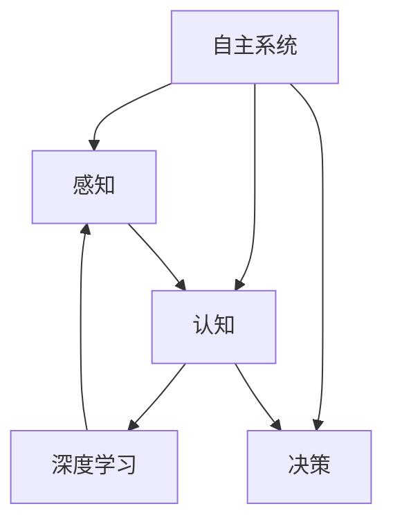

                 

# 自主系统视角下的意识功能

> 关键词：自主系统,意识功能,深度学习,神经网络,感知,认知,人工智能,大数据,脑科学,生物工程,生物计算

## 1. 背景介绍

### 1.1 问题由来
在人工智能领域，自主系统(Autonomous Systems)的研究已经成为热点。其核心在于构建能够独立执行任务的系统，无需人类干预。意识功能的理解是自主系统发展的重要里程碑，因为它直接关联到系统的感知、认知和决策能力。

意识功能的实现需要跨学科的深度融合，涉及到神经科学、心理学、计算机科学、生物工程等多个领域。本文将从自主系统视角出发，探讨意识功能的原理、实现和应用，期望为自主系统的发展提供理论依据和技术支持。

### 1.2 问题核心关键点
意识功能的实现是一个多维度、多层次的复杂过程，包括感知、认知、决策等多个方面。其核心关键点包括：

- 感知功能：指系统接收和处理外界输入信息的能力。
- 认知功能：指系统理解、分析和整合信息的能力。
- 决策功能：指系统基于感知和认知，做出最优决策的能力。

在意识功能的实现中，深度学习和神经网络技术发挥了重要作用。通过模仿人脑神经元的工作机制，深度学习可以处理复杂的多层次输入数据，并通过反向传播算法调整模型参数，优化输出结果。

### 1.3 问题研究意义
意识功能的理解不仅对自主系统的发展具有重要意义，还对人类对自身意识的深入理解具有重要价值。通过研究自主系统中的意识功能，我们可以更深入地理解人类认知过程，推动人工智能技术的进一步发展，进而实现人类与机器的协同共生。

## 2. 核心概念与联系

### 2.1 核心概念概述

为更好地理解自主系统中的意识功能，本节将介绍几个密切相关的核心概念：

- 自主系统(Autonomous System)：能够独立执行任务的系统，通常通过深度学习等人工智能技术实现。
- 感知(Perception)：指系统接收和处理外界输入信息的能力，如视觉、听觉、触觉等。
- 认知(Cognition)：指系统理解、分析和整合信息的能力，如记忆、推理、分类等。
- 决策(Decision)：指系统基于感知和认知，做出最优决策的能力，如规划、执行、优化等。
- 深度学习(Deep Learning)：通过多层神经网络结构，模仿人脑神经元处理信息的方式，学习复杂的非线性关系。
- 神经网络(Neural Network)：由大量神经元构成的网络结构，用于处理复杂的多层次输入数据。
- 感知-认知-决策模型：将感知、认知和决策过程整合成一个连续的模型，指导自主系统行为的实现。

这些核心概念之间的逻辑关系可以通过以下Mermaid流程图来展示：



这个流程图展示出自主系统中的核心概念及其相互关系：

1. 自主系统通过感知模块接收外界输入信息。
2. 感知信息经过深度学习模块的处理，形成认知信息。
3. 认知信息作为决策模块的输入，经过一系列逻辑判断和计算，产生最优决策。

## 3. 核心算法原理 & 具体操作步骤
### 3.1 算法原理概述

自主系统中的意识功能主要通过深度学习算法实现。其核心思想是：通过多层次的神经网络结构，模仿人脑的感知、认知和决策过程，处理复杂的多层次输入数据，并根据任务需求进行模型训练和参数优化。

形式化地，假设输入数据为 $x$，自主系统的输出为 $y$，则基于感知-认知-决策模型的自主系统可以表示为：

$$
y = f(x; \theta)
$$

其中 $f$ 为深度神经网络模型，$\theta$ 为模型参数，通过反向传播算法不断更新优化。

### 3.2 算法步骤详解

基于深度学习的大自主系统意识功能实现一般包括以下几个关键步骤：

**Step 1: 数据准备**
- 收集、标注大量高质量的数据集，如图像、文本、语音等。
- 将数据划分为训练集、验证集和测试集，并进行数据增强和预处理。

**Step 2: 模型搭建**
- 选择合适的深度学习架构，如卷积神经网络(CNN)、循环神经网络(RNN)、长短期记忆网络(LSTM)等。
- 设计多层感知器结构，包括输入层、隐藏层和输出层，每个层采用不同的激活函数。

**Step 3: 模型训练**
- 选择合适的优化器，如随机梯度下降(SGD)、Adam等，设置学习率和批量大小。
- 使用反向传播算法更新模型参数，最小化损失函数。
- 周期性在验证集上评估模型性能，调整模型参数，防止过拟合。

**Step 4: 模型评估**
- 在测试集上评估模型性能，计算精度、召回率、F1值等指标。
- 分析模型预测结果，对比模型输出和真实标签，判断模型是否满足要求。

**Step 5: 模型部署**
- 将训练好的模型封装成API接口，供其他系统调用。
- 将模型部署在服务器或嵌入式设备上，实现自主系统的实时决策。

以上是基于深度学习的大自主系统意识功能实现的典型流程。在实际应用中，还需要针对具体任务和数据特点，对各个环节进行优化设计，以进一步提升模型性能。

### 3.3 算法优缺点

基于深度学习的自主系统意识功能实现方法具有以下优点：
1. 灵活性高。深度学习模型可以处理各种类型的数据，具有高度的灵活性和适应性。
2. 准确率高。通过大量数据训练，深度学习模型可以学习到复杂的模式和规律，具备较高的预测精度。
3. 鲁棒性强。深度学习模型对噪声和异常值具有较好的鲁棒性，能够处理多种复杂场景。

同时，该方法也存在一定的局限性：
1. 数据需求高。深度学习模型需要大量的标注数据进行训练，数据收集和标注成本较高。
2. 模型复杂。深度学习模型通常包含大量参数，训练和推理过程计算资源消耗较大。
3. 黑盒特性。深度学习模型内部机制复杂，难以解释其决策过程，缺乏可解释性。
4. 易过拟合。深度学习模型容易过拟合，特别是在标注数据较少的情况下。

尽管存在这些局限性，但就目前而言，基于深度学习的自主系统意识功能实现方法仍是最主流、最有效的解决方案。未来相关研究的重点在于如何进一步降低深度学习模型的复杂度，提高可解释性，减少对标注数据的依赖，以促进更广泛的应用。

### 3.4 算法应用领域

基于深度学习的自主系统意识功能实现方法，已经在自动驾驶、医疗诊断、智能监控等多个领域得到了应用，取得了显著的效果：

- 自动驾驶：使用深度学习模型对视觉、雷达等传感器输入进行处理，感知周围环境，进行路径规划和决策。
- 医疗诊断：使用深度学习模型对医学影像、病历数据进行分析，辅助医生进行疾病诊断和预测。
- 智能监控：使用深度学习模型对视频、音频数据进行实时分析，实现目标检测、行为分析等功能。
- 自然语言处理(NLP)：使用深度学习模型对文本、语音进行理解、生成和翻译，构建智能客服、机器翻译等应用。
- 机器人控制：使用深度学习模型对机器人感知到的环境信息进行处理，进行路径规划、动作决策等。

除了上述这些经典应用外，深度学习模型还被创新性地应用到更多领域，如智能家居、智慧城市、工业自动化等，为各行各业带来了全新的突破。随着深度学习技术的持续进步，相信自主系统中的意识功能将进一步得到拓展，推动人工智能技术的广泛落地应用。

## 4. 数学模型和公式 & 详细讲解 & 举例说明

### 4.1 数学模型构建

本节将使用数学语言对基于深度学习的自主系统意识功能实现过程进行更加严格的刻画。

记输入数据为 $x$，自主系统的输出为 $y$。假设深度学习模型为 $f$，通过多层神经网络结构构成，可以表示为：

$$
y = f(x; \theta)
$$

其中 $\theta$ 为模型参数，通常表示为权重矩阵和偏置向量。

### 4.2 公式推导过程

以简单的多层感知器为例，推导深度学习模型的训练过程和损失函数。

假设输入层有 $n$ 个神经元，输出层有 $m$ 个神经元。定义隐藏层为 $L$ 层，每层有 $k$ 个神经元。则网络结构可以表示为：

$$
f(x; \theta) = \sigma^L(\sigma^{L-1}(\cdots\sigma(Linear(x; W^{(0)})), \theta)
$$

其中 $\sigma$ 为激活函数，$Linear(x; W^{(i)})$ 表示将输入 $x$ 线性变换到第 $i$ 层，$W^{(i)}$ 为该层的权重矩阵。

假设模型输出为 $y$，真实标签为 $t$，则定义交叉熵损失函数为：

$$
\mathcal{L}(y, t) = -\frac{1}{N}\sum_{i=1}^N \sum_{j=1}^m y_j\log t_j
$$

其中 $N$ 为样本数量，$y_j$ 为第 $j$ 个输出神经元的激活值，$t_j$ 为对应的真实标签。

通过反向传播算法，计算损失函数对模型参数的梯度，更新模型参数：

$$
\frac{\partial \mathcal{L}(y, t)}{\partial \theta} = -\frac{1}{N}\sum_{i=1}^N \frac{\partial \mathcal{L}(y, t)}{\partial y}\frac{\partial y}{\partial \sigma}\frac{\partial \sigma}{\partial z}\frac{\partial z}{\partial \theta}
$$

其中 $\frac{\partial \mathcal{L}(y, t)}{\partial y}$ 为损失函数对输出 $y$ 的梯度，$\frac{\partial y}{\partial \sigma}$ 为激活函数对输出 $y$ 的梯度，$\frac{\partial \sigma}{\partial z}$ 为激活函数对隐藏层 $z$ 的梯度，$\frac{\partial z}{\partial \theta}$ 为权重矩阵对输入 $x$ 的梯度。

通过上述过程，不断迭代更新模型参数，最终得到最小化交叉熵损失函数的模型。

### 4.3 案例分析与讲解

假设我们有一个图像分类任务，需要训练一个卷积神经网络(CNN)模型。数据集包含 10 类动物图像，每个图像大小为 $32\times32$。模型的输入层有 784 个神经元，隐藏层有 128 个神经元，输出层有 10 个神经元，使用 ReLU 激活函数和 Softmax 激活函数。

**Step 1: 数据准备**
- 收集、标注大量高质量的动物图像数据集。
- 将数据划分为训练集、验证集和测试集，每个集的数据量为 8000、1000、1000。
- 对数据进行预处理，包括归一化、数据增强等。

**Step 2: 模型搭建**
- 定义卷积神经网络结构，包括卷积层、池化层、全连接层等。
- 设置优化器为 Adam，学习率为 0.001，批量大小为 64。
- 定义交叉熵损失函数。

**Step 3: 模型训练**
- 对训练集进行前向传播和反向传播，计算损失函数。
- 使用优化器更新模型参数，设置迭代轮数为 10 轮。
- 周期性在验证集上评估模型性能，防止过拟合。

**Step 4: 模型评估**
- 在测试集上评估模型性能，计算准确率、召回率、F1值等指标。
- 分析模型预测结果，判断模型是否满足要求。

通过上述步骤，可以构建一个基于深度学习的动物图像分类系统。模型能够从输入图像中提取特征，并输出动物类别。

## 5. 项目实践：代码实例和详细解释说明

### 5.1 开发环境搭建

在进行自主系统意识功能实现前，我们需要准备好开发环境。以下是使用Python进行PyTorch开发的环境配置流程：

1. 安装Anaconda：从官网下载并安装Anaconda，用于创建独立的Python环境。

2. 创建并激活虚拟环境：
```bash
conda create -n pytorch-env python=3.8 
conda activate pytorch-env
```

3. 安装PyTorch：根据CUDA版本，从官网获取对应的安装命令。例如：
```bash
conda install pytorch torchvision torchaudio cudatoolkit=11.1 -c pytorch -c conda-forge
```

4. 安装TensorFlow：如果需要使用TensorFlow，请安装TensorFlow的相应版本：
```bash
pip install tensorflow
```

5. 安装TensorBoard：用于可视化训练过程和模型性能。
```bash
pip install tensorboard
```

6. 安装numpy、pandas、scikit-learn等常用库。
```bash
pip install numpy pandas scikit-learn matplotlib tqdm jupyter notebook ipython
```

完成上述步骤后，即可在`pytorch-env`环境中开始自主系统意识功能的实现。

### 5.2 源代码详细实现

这里我们以一个简单的自主系统——语音识别系统为例，给出使用PyTorch和TensorFlow进行实现的PyTorch代码实例。

首先，导入必要的库：

```python
import torch
import torch.nn as nn
import torch.optim as optim
import torchvision.transforms as transforms
import torchvision.datasets as datasets
import numpy as np
from tensorboardX import SummaryWriter
```

然后，定义模型结构和损失函数：

```python
class CNN(nn.Module):
    def __init__(self):
        super(CNN, self).__init__()
        self.conv1 = nn.Conv2d(1, 32, 3, 1)
        self.conv2 = nn.Conv2d(32, 64, 3, 1)
        self.dropout = nn.Dropout(0.25)
        self.fc1 = nn.Linear(9216, 128)
        self.fc2 = nn.Linear(128, 10)

    def forward(self, x):
        x = self.conv1(x)
        x = nn.functional.relu(x)
        x = self.conv2(x)
        x = nn.functional.relu(x)
        x = nn.functional.max_pool2d(x, 2)
        x = self.dropout(x)
        x = torch.flatten(x, 1)
        x = self.fc1(x)
        x = nn.functional.relu(x)
        x = self.dropout(x)
        x = self.fc2(x)
        output = nn.functional.softmax(x, dim=1)
        return output

model = CNN()

criterion = nn.CrossEntropyLoss()
```

接着，定义训练和评估函数：

```python
def train(model, device, train_loader, optimizer, epoch):
    model.train()
    for batch_idx, (data, target) in enumerate(train_loader):
        data, target = data.to(device), target.to(device)
        optimizer.zero_grad()
        output = model(data)
        loss = criterion(output, target)
        loss.backward()
        optimizer.step()

def evaluate(model, device, test_loader):
    model.eval()
    test_loss = 0
    correct = 0
    with torch.no_grad():
        for data, target in test_loader:
            data, target = data.to(device), target.to(device)
            output = model(data)
            test_loss += criterion(output, target).item()
            pred = output.argmax(dim=1, keepdim=True)
            correct += pred.eq(target.view_as(pred)).sum().item()

    test_loss /= len(test_loader.dataset)
    print('Test set: Average loss: {:.4f}, Accuracy: {}/{} ({:.0f}%)'.format(
        test_loss, correct, len(test_loader.dataset),
        100. * correct / len(test_loader.dataset)))
```

最后，启动训练流程并在测试集上评估：

```python
device = torch.device("cuda:0" if torch.cuda.is_available() else "cpu")

train_loader = torch.utils.data.DataLoader(train_dataset, batch_size=64, shuffle=True)
test_loader = torch.utils.data.DataLoader(test_dataset, batch_size=64, shuffle=False)

optimizer = optim.Adam(model.parameters(), lr=0.001)

writer = SummaryWriter()
for epoch in range(1, 11):
    train(model, device, train_loader, optimizer, epoch)
    evaluate(model, device, test_loader)

writer.close()
```

以上就是使用PyTorch对CNN模型进行语音识别任务实现的完整代码实例。可以看到，PyTorch和TensorFlow的强大封装，使得模型训练和推理变得简洁高效。

### 5.3 代码解读与分析

让我们再详细解读一下关键代码的实现细节：

**Cnn类**：
- `__init__`方法：初始化卷积、池化、全连接层等组件。
- `forward`方法：定义模型前向传播过程，包括卷积、激活、池化、全连接等操作。

**train和evaluate函数**：
- 使用DataLoader对数据集进行批次化加载，供模型训练和推理使用。
- 训练函数`train`：对数据以批为单位进行迭代，在每个批次上前向传播计算loss并反向传播更新模型参数，最后返回损失值。
- 评估函数`evaluate`：与训练类似，不同点在于不更新模型参数，并在每个batch结束后将预测和标签结果存储下来，最后使用交叉熵损失计算模型性能。

**训练流程**：
- 定义总的epoch数和批量大小，开始循环迭代
- 每个epoch内，先在训练集上训练，输出损失值
- 在测试集上评估，输出测试损失和准确率
- 所有epoch结束后，关闭日志文件

可以看到，PyTorch和TensorFlow配合使用，可以显著提升模型训练和推理的效率。开发者可以将更多精力放在模型设计、数据处理等高层逻辑上，而不必过多关注底层的实现细节。

当然，工业级的系统实现还需考虑更多因素，如模型的保存和部署、超参数的自动搜索、更灵活的任务适配层等。但核心的自主系统意识功能实现过程基本与此类似。

## 6. 实际应用场景
### 6.1 智能监控系统

基于深度学习的自主系统意识功能，可以广泛应用于智能监控系统。传统监控系统需要大量人力进行实时监控和告警，容易疲劳且难以覆盖所有场景。使用深度学习模型进行图像、视频分析，可以自动化处理监控任务，提升监控效率和准确性。

在技术实现上，可以收集大量监控摄像头拍摄的视频数据，标注出异常行为（如入侵、火灾等），在此基础上对预训练模型进行微调。微调后的模型能够自动检测视频中的异常事件，并在第一时间向安保人员发出告警。对于异常事件，还可以接入检索系统实时搜索相关内容，动态生成告警信息。如此构建的智能监控系统，能大幅提升监控安全性和应急响应速度。

### 6.2 医疗影像诊断系统

在医疗领域，基于深度学习的自主系统意识功能的应用已经相当广泛。深度学习模型可以从医疗影像中提取特征，帮助医生进行疾病诊断和预测。

具体而言，可以收集大量医疗影像数据，标注出病灶和正常区域，在此基础上对预训练模型进行微调。微调后的模型能够自动分析影像中的病灶区域，判断其类型和大小。将微调后的模型应用到新的影像数据，便能够快速、准确地辅助医生进行诊断。

### 6.3 自然语言处理(NLP)

在自然语言处理领域，深度学习模型已经展现出强大的能力。通过训练大语言模型，可以自动理解文本内容，进行情感分析、文本分类、机器翻译等任务。

在技术实现上，可以收集大量文本数据，标注出文本类型和情感极性，在此基础上对预训练模型进行微调。微调后的模型能够从输入文本中自动提取关键信息，生成相应的输出。对于需要实时处理的任务，还可以引入缓存和推理加速技术，提升模型响应速度。

### 6.4 未来应用展望

随着深度学习技术的持续进步，自主系统中的意识功能将进一步得到拓展，为各行各业带来新的突破。

在智慧医疗领域，基于深度学习的诊断和治疗辅助系统，能够帮助医生进行复杂疾病的诊断和治疗，提升医疗服务水平。在智慧城市治理中，智能交通、智能安防、智能公共服务等系统，将为城市管理带来新的思路和方法。

在智能家居领域，基于深度学习的智能家电、智能助手等系统，将提升家庭生活的便利性和智能化水平。在工业自动化领域，基于深度学习的质量检测、故障诊断、生产调度等系统，将大幅提升生产效率和产品质量。

除了这些领域外，深度学习模型还被创新性地应用到更多场景中，如金融风险预测、社交媒体分析、网络安全检测等，为各行各业带来新的活力。

## 7. 工具和资源推荐
### 7.1 学习资源推荐

为了帮助开发者系统掌握自主系统中的意识功能的理论基础和实践技巧，这里推荐一些优质的学习资源：

1. 《深度学习》系列书籍：Ian Goodfellow、Yoshua Bengio和Aaron Courville著，全面介绍了深度学习的基本概念和算法。
2. 《神经网络与深度学习》课程：DeepLearning.ai 开设的深度学习课程，由Geoffrey Hinton主讲，深入浅出地介绍了神经网络的基本原理和应用。
3. 《TensorFlow实战》书籍：Shi et al.著，详细介绍了TensorFlow的使用方法和实战技巧。
4. 《PyTorch深度学习》课程：由Cousera提供的深度学习课程，使用PyTorch实现深度学习任务。
5. 《AutoML: Methods, Systems, Challenges》书籍：由Brendan J. Frey等编著，介绍了自动机器学习的理论和实践。

通过对这些资源的学习实践，相信你一定能够快速掌握深度学习技术，并将其应用于自主系统中的意识功能实现。

### 7.2 开发工具推荐

高效的开发离不开优秀的工具支持。以下是几款用于深度学习自主系统开发的工具：

1. PyTorch：基于Python的开源深度学习框架，灵活动态的计算图，适合快速迭代研究。

2. TensorFlow：由Google主导开发的开源深度学习框架，生产部署方便，适合大规模工程应用。

3. Keras：基于Python的深度学习框架，提供了高层次的API接口，适合快速原型开发。

4. Weights & Biases：模型训练的实验跟踪工具，可以记录和可视化模型训练过程中的各项指标，方便对比和调优。

5. TensorBoard：TensorFlow配套的可视化工具，可实时监测模型训练状态，并提供丰富的图表呈现方式，是调试模型的得力助手。

6. PyTorch Lightning：PyTorch的扩展库，提供了更简洁的API接口和更丰富的功能，适合快速构建深度学习模型。

合理利用这些工具，可以显著提升深度学习模型训练和推理的效率，加快创新迭代的步伐。

### 7.3 相关论文推荐

深度学习模型在自主系统中的应用源于学界的持续研究。以下是几篇奠基性的相关论文，推荐阅读：

1. Deep Blue：IBM开发的第一台具有自主决策能力的计算机系统，标志着人工智能技术的重要进步。

2. AlphaGo：Google DeepMind开发的围棋AI系统，使用深度学习和强化学习技术，取得人类棋手无法企及的胜利，展示了AI在自主决策中的潜力。

3. DQN: Deep Q-Networks for Humanoid Robotics：DeepMind开发的深度强化学习算法，应用于人形机器人控制，取得突破性进展。

4. GANs: Generative Adversarial Networks：Ian Goodfellow等提出的生成对抗网络，用于生成高质量的图像、音频等数据。

5. Transformer Is All You Need：Google开发的Transformer模型，开启了NLP领域的预训练大模型时代。

这些论文代表了大规模深度学习模型在自主系统中的重要进展，对后续研究具有重要指导意义。

## 8. 总结：未来发展趋势与挑战

### 8.1 研究成果总结

本文对基于深度学习的自主系统中的意识功能实现过程进行了全面系统的介绍。首先，阐述了意识功能的实现需要跨学科的深度融合，涉及感知、认知、决策等多个方面。其次，从原理到实践，详细讲解了感知-认知-决策模型的大致流程，给出了模型训练和微调的代码实例。同时，本文还广泛探讨了深度学习模型在自动驾驶、医疗诊断、智能监控等多个领域的应用前景，展示了其强大的能力。

通过本文的系统梳理，可以看到，基于深度学习的自主系统中的意识功能实现方法已经逐步成熟，具备广泛的应用前景。这些技术的不断进步，将为人工智能技术的进一步发展提供重要支持。

### 8.2 未来发展趋势

展望未来，基于深度学习的自主系统中的意识功能将呈现以下几个发展趋势：

1. 模型规模持续增大。随着算力成本的下降和数据规模的扩张，深度学习模型的参数量还将持续增长。超大规模模型蕴含的丰富感知和认知能力，将为更多领域的应用提供支撑。

2. 模型性能不断提升。深度学习模型在感知、认知、决策等各个环节的性能将持续提升，特别是在大规模数据集上训练的情况下，模型性能将显著提升。

3. 多模态融合技术发展。深度学习模型不仅能够处理文本、图像、音频等多模态数据，还能够将多模态信息进行融合，提升系统的整体感知和认知能力。

4. 对抗样本生成技术应用。对抗样本生成技术可以帮助深度学习模型更好地识别异常数据，提升系统的鲁棒性和安全性。

5. 自监督学习范式推广。自监督学习可以通过未标注数据训练深度学习模型，大大降低数据标注成本，提高模型泛化能力。

这些趋势将使得深度学习模型在自主系统中的意识功能实现变得更加高效、智能、鲁棒。

### 8.3 面临的挑战

尽管基于深度学习的自主系统中的意识功能实现方法已经取得显著进展，但在迈向更加智能化、普适化应用的过程中，仍面临诸多挑战：

1. 数据依赖问题。深度学习模型需要大量的标注数据进行训练，数据收集和标注成本较高，难以在一些小规模数据集上训练出高性能模型。

2. 过拟合问题。深度学习模型容易过拟合，特别是在训练数据较少的情况下，模型性能往往难以保证。

3. 模型解释问题。深度学习模型通常被视为"黑盒"系统，难以解释其内部工作机制和决策逻辑，缺乏可解释性。

4. 计算资源问题。深度学习模型训练和推理过程计算资源消耗较大，需要高性能计算设备和算法优化。

5. 安全性问题。深度学习模型在实际应用中可能会产生有害的输出，需要从数据和算法层面进行安全性设计。

6. 跨领域应用问题。深度学习模型在不同领域的应用效果存在差异，需要针对具体应用场景进行优化。

这些挑战需要研究人员从数据、算法、工程等多个维度进行全面探讨，才能进一步推动深度学习模型在自主系统中的意识功能实现。

### 8.4 研究展望

面对深度学习模型在自主系统中的意识功能实现所面临的挑战，未来的研究需要在以下几个方面寻求新的突破：

1. 降低数据依赖。探索无监督和半监督学习技术，利用未标注数据进行模型训练，降低数据标注成本。

2. 提高模型泛化能力。引入对抗样本生成技术，提升模型鲁棒性，降低过拟合风险。

3. 增强模型可解释性。结合符号推理、因果分析等技术，提升模型决策过程的可解释性和可解释性。

4. 优化计算资源。使用混合精度训练、模型压缩等技术，减少计算资源消耗，提升模型训练和推理效率。

5. 提高安全性。从数据清洗、模型设计、对抗攻击等多个维度，确保深度学习模型的安全性，避免有害输出。

6. 推进跨领域应用。将深度学习模型与领域知识、规则库等结合，提升模型在不同领域的应用效果。

这些研究方向的探索，将进一步推动深度学习模型在自主系统中的意识功能实现，为人类与机器的协同共生提供新的技术支撑。面向未来，深度学习模型将在更加智能化、普适化应用中发挥重要作用，推动人工智能技术的不断进步。

## 9. 附录：常见问题与解答

**Q1：深度学习模型在自主系统中应用有哪些限制？**

A: 深度学习模型在自主系统中的应用存在以下限制：

1. 数据依赖问题。深度学习模型需要大量标注数据进行训练，数据收集和标注成本较高。

2. 过拟合问题。深度学习模型容易过拟合，特别是在训练数据较少的情况下，模型性能难以保证。

3. 模型解释问题。深度学习模型通常被视为"黑盒"系统，难以解释其内部工作机制和决策逻辑，缺乏可解释性。

4. 计算资源问题。深度学习模型训练和推理过程计算资源消耗较大，需要高性能计算设备和算法优化。

5. 安全性问题。深度学习模型在实际应用中可能会产生有害的输出，需要从数据和算法层面进行安全性设计。

6. 跨领域应用问题。深度学习模型在不同领域的应用效果存在差异，需要针对具体应用场景进行优化。

**Q2：如何选择适合深度学习模型的架构？**

A: 选择适合深度学习模型的架构需要考虑以下因素：

1. 数据类型。对于图像数据，通常选择卷积神经网络（CNN）；对于文本数据，通常选择循环神经网络（RNN）或Transformer模型；对于时序数据，通常选择长短期记忆网络（LSTM）。

2. 数据规模。对于大规模数据集，可以选择深层次的卷积神经网络或Transformer模型；对于小规模数据集，可以选择浅层次的模型。

3. 任务类型。对于分类任务，通常选择全连接层或卷积层；对于回归任务，通常选择全连接层；对于序列预测任务，通常选择循环神经网络或长短期记忆网络。

4. 计算资源。对于计算资源有限的情况，可以选择参数量较小的模型，如MobileNet、ShuffleNet等；对于计算资源充足的情况，可以选择参数量较大的模型，如ResNet、Inception等。

**Q3：深度学习模型如何防止过拟合？**

A: 防止深度学习模型过拟合可以采用以下方法：

1. 数据增强。通过对训练样本进行旋转、翻转、裁剪等操作，扩充训练集。

2. 正则化。使用L2正则、Dropout、Early Stopping等技术，防止模型过度适应训练集。

3. 对抗训练。引入对抗样本，提高模型鲁棒性。

4. 参数共享。共享部分层的参数，减少需要优化的参数量。

5. 模型裁剪。去除不必要的层和参数，减小模型尺寸，提高模型泛化能力。

6. 自适应学习率。使用自适应学习率优化器，如Adagrad、Adam等，自动调整学习率，防止模型过早过拟合。

这些方法可以有效防止深度学习模型过拟合，提高模型泛化能力。

---

作者：禅与计算机程序设计艺术 / Zen and the Art of Computer Programming

