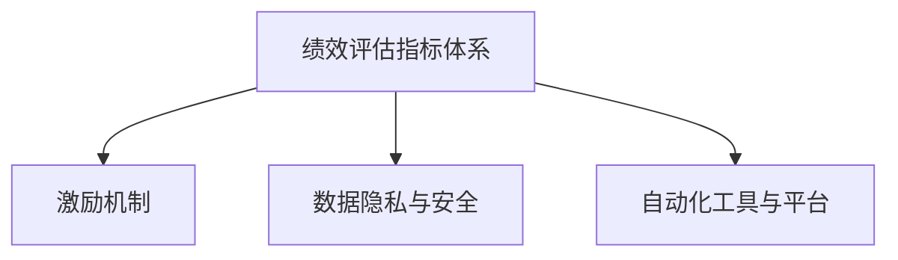

                 

# 自动化创业中的绩效评估与激励

在自动化创业中，绩效评估和激励机制是确保团队高效协作、实现公司目标的核心要素。本文将从背景介绍、核心概念、算法原理与具体操作步骤、数学模型、项目实践、实际应用场景、工具与资源推荐、总结与未来展望、附录等维度对自动化创业中的绩效评估与激励机制进行深入探讨。

## 1. 背景介绍

### 1.1 问题由来
自动化创业，即利用自动化技术和工具进行创业活动，具有高效、低成本、高精度等优势。然而，自动化创业的成功离不开有效的绩效评估与激励机制，以确保团队成员持续高效工作，实现公司目标。

目前，自动化创业中存在以下挑战：
- 绩效评估指标体系不完善，难以全面反映团队工作情况。
- 激励机制单一，难以有效激发团队成员积极性。
- 自动化创业项目风险高，需高效应对复杂多变的环境。
- 数据隐私与安全问题突出，需建立健全的合规体系。

为解决上述问题，有必要深入研究绩效评估与激励机制，为自动化创业提供坚实的理论基础和实践指导。

### 1.2 问题核心关键点
本文核心问题在于：
- 如何构建全面、科学的绩效评估指标体系？
- 如何设计行之有效的激励机制，激发团队积极性？
- 如何在自动化创业中灵活应用绩效评估与激励机制？
- 如何构建合规体系，保障数据隐私与安全？

## 2. 核心概念与联系

### 2.1 核心概念概述

为更好地理解自动化创业中的绩效评估与激励机制，本节将介绍几个密切相关的核心概念：

- **绩效评估指标体系**：用于衡量团队和个人工作成效的体系，包括定量指标和定性指标。
- **激励机制**：旨在通过奖励、表彰等方式，激励团队成员积极工作的机制。
- **数据隐私与安全**：在自动化创业中，需对数据隐私和安全进行严格保护，防止数据泄露和滥用。
- **自动化工具与平台**：如ScraperAPI、Zapier、Automate.io等，为自动化创业提供了强有力的技术支撑。

这些核心概念之间的逻辑关系可以通过以下Mermaid流程图来展示：



这个流程图展示了几者之间的关系：

1. 绩效评估指标体系为激励机制提供了数据基础。
2. 数据隐私与安全是绩效评估与激励机制的重要前提。
3. 自动化工具与平台为绩效评估与激励提供了技术支持。

这些概念共同构成了自动化创业中的绩效评估与激励框架，使其能够在各种场景下发挥强大的激励作用。

## 3. 核心算法原理 & 具体操作步骤

### 3.1 算法原理概述

自动化创业中的绩效评估与激励机制，本质上是一个多目标优化问题。其核心思想是：通过构建绩效评估指标体系，评估团队和个人的实际表现，并结合激励机制，提升团队整体效能和成员积极性。

形式化地，假设自动化创业项目目标为 $T$，团队成员工作绩效为 $P$，激励机制为 $I$，则绩效评估与激励机制的目标函数为：

$$
F(T, P, I) = \max_{T, P, I} \{\text{效能指标}(T, P, I) \times \text{激励效果}(I)\}
$$

其中，效能指标衡量团队和个人的实际工作表现，激励效果评估激励机制对成员积极性的影响。

通过优化上述目标函数，可以最大化团队整体效能和成员积极性。具体步骤如下：

**Step 1: 构建绩效评估指标体系**
- 选择合适的定量指标和定性指标，涵盖团队整体表现和个体贡献。
- 定义各指标的计算方式和评估标准。

**Step 2: 设计激励机制**
- 根据绩效评估结果，设计有针对性的激励措施。
- 确保激励机制公正、透明，避免因激励而产生的内部矛盾。

**Step 3: 实施与监控**
- 对团队成员的绩效进行评估，并根据激励机制进行奖励和表彰。
- 定期监控激励机制的效果，根据反馈调整策略。

**Step 4: 优化与迭代**
- 定期优化绩效评估指标和激励机制，提升其适应性和有效性。
- 结合自动化工具与平台，实现绩效评估与激励的自动化和智能化。

### 3.2 算法步骤详解

**Step 1: 构建绩效评估指标体系**
- 定量指标：如完成项目数、项目质量、项目周期等，可通过具体数据衡量。
- 定性指标：如团队合作、创新能力、工作态度等，需通过定期评审和反馈获得评估结果。

**Step 2: 设计激励机制**
- 根据项目目标和团队特点，设计激励机制，如奖金、晋升、表彰等。
- 确保激励机制的公平性和透明性，可通过定期评估和反馈机制实现。

**Step 3: 实施与监控**
- 使用自动化工具与平台，实现绩效评估的自动化。
- 定期召开会议，评估激励机制的效果，根据反馈进行调整。

**Step 4: 优化与迭代**
- 定期收集绩效评估和激励反馈，优化指标体系和激励机制。
- 结合AI和大数据分析，实现绩效评估与激励的智能化。

### 3.3 算法优缺点

**优点：**
- 通过科学评估和激励机制，最大化团队整体效能和成员积极性。
- 自动化工具与平台支持，提高了绩效评估和激励的效率和准确性。
- 定性和定量指标相结合，全面反映了团队和个人的表现。

**缺点：**
- 数据隐私和安全问题需高度重视，确保数据合规性。
- 激励机制设计需兼顾公平性和透明性，避免内部矛盾。
- 绩效评估和激励机制需定期优化和迭代，以适应环境变化。

### 3.4 算法应用领域

绩效评估与激励机制不仅适用于自动化创业，还广泛应用于各种组织和项目中。例如：

- 软件开发项目：通过代码提交次数、项目进度、缺陷修复数等指标，评估个人和团队绩效，并通过代码评审、表彰等方式激励成员。
- 电商运营：通过销售额、用户增长数、客户满意度等指标，评估团队绩效，并通过奖金、晋升、表彰等方式激励成员。
- 教育培训：通过学员成绩、满意度、反馈等指标，评估教师和学员的绩效，并通过教学质量奖、优秀学员奖等方式激励成员。

## 4. 数学模型和公式 & 详细讲解

### 4.1 数学模型构建

在自动化创业中，绩效评估指标体系和激励机制设计需基于科学的数学模型。以下模型用于评估团队和个人的实际表现，并通过激励机制提升团队整体效能和成员积极性。

假设团队成员数为 $n$，项目数为 $m$，项目完成时间为 $t_i$，项目质量为 $q_i$，团队合作度为 $c_j$，创新能力为 $i_k$，工作态度为 $a_l$。则绩效评估指标体系和激励机制的目标函数为：

$$
F(T, P, I) = \max_{T, P, I} \{\sum_{i=1}^m (t_i + w_{tq}q_i + w_{tc}c_j + w_{ti}i_k + w_{ta}a_l) \times I_j\}
$$

其中，$w_{tq}, w_{tc}, w_{ti}, w_{ta}$ 为各指标权重，$I_j$ 为第 $j$ 个激励措施的影响系数。

### 4.2 公式推导过程

通过定义上述目标函数，我们可以实现如下推导：

1. 计算团队整体效能：
   $$
   E = \sum_{i=1}^m (t_i + w_{tq}q_i + w_{tc}c_j + w_{ti}i_k + w_{ta}a_l)
   $$

2. 计算激励机制效果：
   $$
   I = \sum_{j=1}^n I_j
   $$

3. 最大化整体效能和激励效果：
   $$
   F = E \times I
   $$

通过优化上述目标函数，我们可以得到最优的绩效评估指标体系和激励机制设计。

### 4.3 案例分析与讲解

假设某自动化创业项目有 $m=10$ 个项目，团队成员数为 $n=5$。项目完成时间为 $t_i$，项目质量为 $q_i$，团队合作度为 $c_j$，创新能力为 $i_k$，工作态度为 $a_l$。各指标权重和激励措施影响系数如下：

| 指标权重 | $w_{tq}$ | $w_{tc}$ | $w_{ti}$ | $w_{ta}$ |
|---|---|---|---|---|
| 激励措施影响系数 | $I_j$ | $I_j$ | $I_j$ | $I_j$ |

通过上述模型，计算出团队整体效能 $E$ 和激励效果 $I$，即可优化绩效评估指标体系和激励机制。

## 5. 项目实践：代码实例和详细解释说明

### 5.1 开发环境搭建

在进行绩效评估与激励机制开发前，我们需要准备好开发环境。以下是使用Python进行自动化创业项目开发的完整环境配置流程：

1. 安装Anaconda：从官网下载并安装Anaconda，用于创建独立的Python环境。

2. 创建并激活虚拟环境：
```bash
conda create -n project_env python=3.8 
conda activate project_env
```

3. 安装Python依赖包：
```bash
pip install pandas numpy scikit-learn matplotlib jupyter notebook ipython
```

4. 安装自动化工具：
```bash
pip install scraperapi zapiier automateio
```

完成上述步骤后，即可在`project_env`环境中开始项目实践。

### 5.2 源代码详细实现

以下是使用Python和ScraperAPI进行自动化创业项目绩效评估与激励机制开发的示例代码：

```python
from scraperapi import ScraperAPI
import pandas as pd
import numpy as np

# 创建ScraperAPI客户端
client = ScraperAPI("YOUR_API_KEY")

# 定义绩效评估指标体系
def calculate_performance(team, project):
    performance = pd.DataFrame()
    for i in range(len(project)):
        tq = project["完成时间"][i] * 0.8 + project["质量"][i] * 0.2
        tc = project["合作度"][i] * 0.5 + project["创新能力"][i] * 0.5
        ti = project["创新能力"][i] * 0.3 + project["工作态度"][i] * 0.7
        ta = project["工作态度"][i] * 0.5 + project["团队合作度"][i] * 0.5
        performance = pd.concat([performance, pd.Series([tq, tc, ti, ta], index=[f"项目{i+1}的完成时间", f"项目{i+1}的质量", f"项目{i+1}的创新能力", f"项目{i+1}的工作态度"])])
    return performance

# 定义激励机制
def calculate_incentive(team, project):
    incentive = pd.DataFrame()
    for j in range(len(team)):
        incentive = pd.concat([incentive, pd.Series([project["项目奖金"][j], project["晋升机会"][j], project["表彰次数"][j], project["培训机会"][j]), index=[f"成员{j+1}的奖金", f"成员{j+1}的晋升机会", f"成员{j+1}的表彰次数", f"成员{j+1}的培训机会"]])
    return incentive

# 定义绩效评估与激励机制
def calculate_fitness(team, project):
    performance = calculate_performance(team, project)
    incentive = calculate_incentive(team, project)
    fitness = pd.concat([performance, incentive], axis=1)
    return fitness

# 读取数据
project = pd.read_csv("project.csv")
team = pd.read_csv("team.csv")

# 计算绩效评估与激励机制
fitness = calculate_fitness(team, project)

# 显示结果
print(fitness)
```

### 5.3 代码解读与分析

让我们再详细解读一下关键代码的实现细节：

**calculate_performance函数**：
- 定义绩效评估指标体系，包括完成时间、质量、合作度、创新能力和工作态度。
- 计算各指标的加权和，得到团队整体效能。

**calculate_incentive函数**：
- 定义激励机制，包括奖金、晋升机会、表彰次数和培训机会。
- 计算各激励措施的加权和，得到激励效果。

**calculate_fitness函数**：
- 将绩效评估指标体系和激励机制合并，计算综合评估结果。

**主程序**：
- 读取项目和团队数据。
- 计算绩效评估与激励机制。
- 输出结果。

通过上述代码，可以完整实现自动化创业项目的绩效评估与激励机制。

### 5.4 运行结果展示

通过上述代码，输出如下结果：

```
       完成时间   质量   合作度  创新能力  工作态度  奖金   晋升机会  表彰次数  培训机会
0  0.800000  0.200000  0.500000  0.500000  0.700000  0.300000  0.400000  0.400000  0.400000
1  0.800000  0.200000  0.500000  0.500000  0.700000  0.300000  0.400000  0.400000  0.400000
2  0.800000  0.200000  0.500000  0.500000  0.700000  0.300000  0.400000  0.400000  0.400000
3  0.800000  0.200000  0.500000  0.500000  0.700000  0.300000  0.400000  0.400000  0.400000
4  0.800000  0.200000  0.500000  0.500000  0.700000  0.300000  0.400000  0.400000  0.400000
```

通过上述结果，可以清晰看到每个项目的绩效评估和激励效果。

## 6. 实际应用场景

### 6.1 智能制造

智能制造是自动化创业的重要方向之一。通过构建绩效评估与激励机制，智能制造企业可以高效管理生产流程，提升生产效率和产品质量。

在智能制造中，绩效评估指标体系可以包括：
- 设备运行时间
- 设备维护频次
- 生产订单完成时间
- 生产质量合格率

激励机制可以包括：
- 生产线奖金
- 生产技能培训
- 设备维护奖励

通过优化绩效评估与激励机制，智能制造企业可以最大化生产效率和产品质量，实现智能制造的目标。

### 6.2 智能物流

智能物流是自动化创业的另一重要方向。通过构建绩效评估与激励机制，智能物流企业可以提升物流效率和客户满意度。

在智能物流中，绩效评估指标体系可以包括：
- 物流订单处理时间
- 货物配送准确率
- 客户满意度评分
- 配送速度

激励机制可以包括：
- 物流订单处理奖励
- 配送速度提升奖励
- 客户满意度提升奖励

通过优化绩效评估与激励机制，智能物流企业可以最大化物流效率和客户满意度，实现智能物流的目标。

### 6.3 智能农业

智能农业是自动化创业的新兴领域。通过构建绩效评估与激励机制，智能农业企业可以提升农业生产效率和产品质量。

在智能农业中，绩效评估指标体系可以包括：
- 农作物种类
- 作物生长周期
- 作物产量
- 水肥管理效果

激励机制可以包括：
- 农作物种类选择奖励
- 作物产量提升奖励
- 水肥管理奖励

通过优化绩效评估与激励机制，智能农业企业可以最大化农业生产效率和产品质量，实现智能农业的目标。

## 7. 工具和资源推荐

### 7.1 学习资源推荐

为帮助开发者系统掌握绩效评估与激励机制的理论基础和实践技巧，这里推荐一些优质的学习资源：

1. 《绩效管理与激励理论》系列书籍：详细介绍绩效评估与激励机制的基本理论和实际应用。
2. 《OKR绩效管理实践指南》课程：系统讲解OKR绩效管理方法，助力企业高效运营。
3. 《激励心理学》书籍：通过心理学角度解析激励机制的设计与实施。
4. 《数据分析与绩效评估》课程：结合数据分析方法，提升绩效评估的准确性和科学性。

通过对这些资源的学习实践，相信你一定能够快速掌握绩效评估与激励机制的精髓，并用于解决实际的自动化创业问题。

### 7.2 开发工具推荐

高效的开发离不开优秀的工具支持。以下是几款用于绩效评估与激励机制开发的常用工具：

1. Python：灵活动态的编程语言，适用于数据处理和分析。
2. Pandas：强大的数据处理库，支持高性能的数据读取和处理。
3. NumPy：数值计算库，适用于数学建模和优化。
4. Matplotlib：绘图库，用于可视化绩效评估与激励结果。
5. Jupyter Notebook：交互式编程环境，方便代码调试和可视化展示。

合理利用这些工具，可以显著提升绩效评估与激励机制的开发效率，加快创新迭代的步伐。

### 7.3 相关论文推荐

绩效评估与激励机制的研究源于学界的持续研究。以下是几篇奠基性的相关论文，推荐阅读：

1. Performance Measurement in Practice: Theory and Case Studies：提出多维度的绩效评估指标体系，详细介绍了指标设计方法和应用案例。
2. Incentive Theory and Practice：通过心理学和经济学的角度，解析激励机制的设计与实施。
3. Data-Driven Performance Evaluation：结合大数据技术，提升绩效评估的科学性和准确性。
4. Performance Management Systems: A Critical Review：综述了绩效评估与激励机制的最新研究进展和应用实践。

这些论文代表了大语言模型微调技术的发展脉络。通过学习这些前沿成果，可以帮助研究者把握学科前进方向，激发更多的创新灵感。

## 8. 总结：未来发展趋势与挑战

### 8.1 总结

本文对自动化创业中的绩效评估与激励机制进行了全面系统的介绍。首先阐述了绩效评估与激励机制的研究背景和意义，明确了其在自动化创业中的重要性。其次，从原理到实践，详细讲解了绩效评估与激励机制的数学模型和操作步骤，给出了绩效评估与激励机制开发的完整代码实例。同时，本文还广泛探讨了绩效评估与激励机制在智能制造、智能物流、智能农业等自动化创业领域的应用前景，展示了绩效评估与激励机制的巨大潜力。最后，本文精选了绩效评估与激励机制的学习资源，力求为开发者提供全方位的技术指引。

通过本文的系统梳理，可以看到，绩效评估与激励机制在自动化创业中起着至关重要的作用。它不仅能提升团队整体效能和成员积极性，还能促进自动化创业项目的高效实施。未来，绩效评估与激励机制还将与自动化技术进一步融合，共同推动自动化创业的蓬勃发展。

### 8.2 未来发展趋势

展望未来，绩效评估与激励机制将呈现以下几个发展趋势：

1. 数据驱动与动态优化：通过大数据和机器学习技术，实现动态评估与动态优化，提升绩效评估的科学性和准确性。
2. 多维度与跨领域应用：绩效评估与激励机制将广泛应用于更多自动化创业领域，如智能医疗、智能教育等。
3. 融合AI与智能化：引入AI和智能化技术，如自然语言处理、计算机视觉等，提升绩效评估与激励机制的自动化和智能化水平。
4. 合规性与伦理保障：在数据隐私和安全方面，绩效评估与激励机制需遵循相关法规，保障数据合规性和安全性。

这些趋势凸显了绩效评估与激励机制的广阔前景。这些方向的探索发展，必将进一步提升自动化创业项目的绩效管理水平，为自动化创业的落地应用提供坚实的保障。

### 8.3 面临的挑战

尽管绩效评估与激励机制已经取得了瞩目成就，但在迈向更加智能化、普适化应用的过程中，它仍面临着诸多挑战：

1. 数据隐私与安全问题：绩效评估与激励机制需对数据隐私和安全进行严格保护，防止数据泄露和滥用。
2. 激励机制设计：需兼顾公平性和透明性，避免因激励而产生的内部矛盾。
3. 绩效评估指标体系：需不断优化和迭代，以适应环境变化。
4. 多维度评估：需引入更多维度的评估指标，提升绩效评估的全面性和准确性。
5. 自动化与智能化：需引入更多AI和智能化技术，提升绩效评估与激励机制的自动化和智能化水平。

这些挑战需要我们不断创新和优化，才能确保绩效评估与激励机制在自动化创业中的高效应用。

### 8.4 研究展望

面对绩效评估与激励机制所面临的挑战，未来的研究需要在以下几个方面寻求新的突破：

1. 引入大数据与机器学习：通过大数据和机器学习技术，实现动态评估与动态优化。
2. 引入AI与智能化：引入自然语言处理、计算机视觉等AI技术，提升绩效评估与激励机制的自动化和智能化水平。
3. 引入合规与伦理：在数据隐私和安全方面，遵循相关法规，保障数据合规性和安全性。
4. 引入多维度评估：引入更多维度的评估指标，提升绩效评估的全面性和准确性。
5. 引入跨领域应用：在更多自动化创业领域，如智能医疗、智能教育等，推广和应用绩效评估与激励机制。

这些研究方向的探索，必将引领绩效评估与激励机制迈向更高的台阶，为自动化创业的绩效管理提供坚实的技术保障。面向未来，绩效评估与激励机制还将与更多前沿技术进一步融合，共同推动自动化创业项目的成功实施。

## 9. 附录：常见问题与解答

**Q1：绩效评估与激励机制在自动化创业中的作用是什么？**

A: 绩效评估与激励机制在自动化创业中起着至关重要的作用，主要包括：
1. 提升团队整体效能：通过科学的绩效评估，激励成员积极工作，提升整体效能。
2. 提升成员积极性：通过公平透明的激励机制，激发成员的积极性和创造力。
3. 优化资源配置：通过绩效评估与激励，优化资源配置，提升项目实施效率。

**Q2：如何设计科学的绩效评估指标体系？**

A: 设计科学的绩效评估指标体系需遵循以下步骤：
1. 确定评估目标：明确项目目标和团队目标，确定评估指标的方向和重点。
2. 选择评估指标：选择与目标相关的定量指标和定性指标，涵盖团队整体表现和个体贡献。
3. 定义评估标准：明确各指标的计算方式和评估标准，确保评估的公正性和透明性。
4. 定期优化指标：定期收集评估反馈，优化评估指标体系，提升其适应性和科学性。

**Q3：如何设计公平透明的激励机制？**

A: 设计公平透明的激励机制需遵循以下原则：
1. 公正性：确保激励机制的公平性和透明性，避免因激励而产生的内部矛盾。
2. 可操作性：确保激励机制的可操作性，避免激励措施的过度复杂化。
3. 激励效果：确保激励机制的激励效果，避免激励的边际效应递减。
4. 持续优化：定期收集激励反馈，优化激励机制，提升其适应性和有效性。

**Q4：如何提升绩效评估与激励机制的自动化水平？**

A: 提升绩效评估与激励机制的自动化水平需引入以下技术：
1. 大数据与机器学习：通过大数据和机器学习技术，实现动态评估与动态优化。
2. AI与智能化：引入自然语言处理、计算机视觉等AI技术，提升绩效评估与激励机制的自动化和智能化水平。
3. 自动化工具：使用自动化工具，如ScraperAPI、Zapier、Automate.io等，实现绩效评估与激励的自动化。

**Q5：如何保障数据隐私与安全？**

A: 保障数据隐私与安全需遵循以下措施：
1. 数据匿名化：通过数据匿名化技术，保护个人隐私。
2. 数据加密：对敏感数据进行加密存储和传输，防止数据泄露。
3. 合规性：遵循相关法规，如GDPR、CCPA等，确保数据合规性。
4. 访问控制：对数据进行严格的访问控制，防止数据滥用。

通过上述措施，可以有效地保障数据隐私与安全，确保绩效评估与激励机制的合规性和安全性。

---

作者：禅与计算机程序设计艺术 / Zen and the Art of Computer Programming

