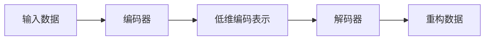

                 

# 自动编码器 (Autoencoder) 原理与代码实例讲解

## 1. 背景介绍

自动编码器 (Autoencoder) 是一种神经网络模型，其核心思想是通过对输入数据进行编码和解码，重构出原始数据，从而学习数据的压缩表示。自动编码器被广泛应用于特征提取、数据降维、数据去噪等领域。

## 2. 核心概念与联系

### 2.1 核心概念概述

- **自动编码器 (Autoencoder)**：一种无监督学习模型，用于学习数据的低维压缩表示。
- **编码器 (Encoder)**：自动编码器中负责对输入数据进行压缩的部分，输出一个低维编码表示。
- **解码器 (Decoder)**：自动编码器中负责将低维编码表示重构回原始数据的部分。
- **重构误差 (Reconstruction Error)**：编码器输出的低维表示与解码器重构出的原始数据的差异度量，常用于评估自动编码器的性能。

### 2.2 核心概念原理和架构

自动编码器的架构如下：



其中，编码器将输入数据压缩为低维编码表示，解码器将低维编码表示重构为原始数据。自动编码器的目标是使重构误差最小化，即 $L = \| \mathbf{x} - \mathbf{\hat{x}} \|$，其中 $\mathbf{x}$ 是原始数据，$\mathbf{\hat{x}}$ 是重构数据。

## 3. 核心算法原理 & 具体操作步骤

### 3.1 算法原理概述

自动编码器的训练过程分为编码和解码两个阶段：

1. **编码阶段**：将输入数据 $\mathbf{x}$ 输入编码器，得到低维编码表示 $\mathbf{z}$。
2. **解码阶段**：将低维编码表示 $\mathbf{z}$ 输入解码器，得到重构数据 $\mathbf{\hat{x}}$。

自动编码器的损失函数通常为重构误差 $L = \| \mathbf{x} - \mathbf{\hat{x}} \|$，其中 $\| \cdot \|$ 是范数，通常为均方误差 (Mean Squared Error, MSE) 或交叉熵 (Cross-Entropy)。

### 3.2 算法步骤详解

自动编码器的训练过程可以总结为以下几个步骤：

1. **数据预处理**：将原始数据标准化，归一化到 $[0,1]$ 或 $[-1,1]$ 范围内。
2. **初始化权重**：随机初始化编码器和解码器的权重矩阵。
3. **编码阶段**：将标准化后的数据 $\mathbf{x}$ 输入编码器，得到低维编码表示 $\mathbf{z}$。
4. **解码阶段**：将低维编码表示 $\mathbf{z}$ 输入解码器，得到重构数据 $\mathbf{\hat{x}}$。
5. **计算损失**：计算重构误差 $L = \| \mathbf{x} - \mathbf{\hat{x}} \|$。
6. **反向传播**：利用反向传播算法更新编码器和解码器的权重。
7. **迭代训练**：重复步骤 3-6，直到收敛或达到预设的训练轮数。

### 3.3 算法优缺点

自动编码器的优点包括：

- 自适应性：能够适应各种类型的数据，无需标注数据。
- 特征提取：学习数据的低维压缩表示，能够提取数据的本质特征。
- 去噪能力：能够通过重构误差自适应地去除噪声，提高数据质量。

自动编码器的缺点包括：

- 过拟合：当输入数据和编码器权重过于复杂时，容易发生过拟合。
- 参数设置：编码器和解码器的参数设置需要经过多次实验才能找到最优组合。
- 可解释性：自动编码器的训练过程缺乏可解释性，难以理解模型内部的学习机制。

### 3.4 算法应用领域

自动编码器在多个领域都有广泛应用，包括：

- **特征提取**：学习数据的低维表示，用于图像处理、信号处理等。
- **数据降维**：将高维数据压缩到低维空间，用于可视化、数据分析等。
- **数据去噪**：通过重构误差自适应地去除噪声，用于图像去噪、音频去噪等。
- **生成模型**：通过编码器-解码器结构，生成与原始数据类似的新数据。

## 4. 数学模型和公式 & 详细讲解 & 举例说明

### 4.1 数学模型构建

假设输入数据 $\mathbf{x} \in \mathbb{R}^n$，编码器输出的低维编码表示 $\mathbf{z} \in \mathbb{R}^m$，解码器重构的数据 $\mathbf{\hat{x}} \in \mathbb{R}^n$。

自动编码器的训练目标是最小化重构误差 $L = \| \mathbf{x} - \mathbf{\hat{x}} \|$。

### 4.2 公式推导过程

自动编码器的训练过程可以表示为：

1. **编码器**：$\mathbf{z} = g_{enc}(\mathbf{x})$
2. **解码器**：$\mathbf{\hat{x}} = g_{dec}(\mathbf{z})$
3. **损失函数**：$L = \| \mathbf{x} - \mathbf{\hat{x}} \|$

其中，$g_{enc}$ 和 $g_{dec}$ 分别是编码器和解码器的非线性函数。通常使用 ReLU 或 Sigmoid 函数作为激活函数。

### 4.3 案例分析与讲解

以一个简单的两层神经网络为例，分析自动编码器的训练过程：

```python
import torch
import torch.nn as nn
import torch.optim as optim

# 定义编码器和解码器
class Autoencoder(nn.Module):
    def __init__(self, input_dim, latent_dim):
        super(Autoencoder, self).__init__()
        self.encoder = nn.Sequential(
            nn.Linear(input_dim, latent_dim),
            nn.ReLU()
        )
        self.decoder = nn.Sequential(
            nn.Linear(latent_dim, input_dim),
            nn.ReLU()
        )

    def forward(self, x):
        z = self.encoder(x)
        x_hat = self.decoder(z)
        return x_hat

# 定义损失函数和优化器
input_dim = 784
latent_dim = 64
model = Autoencoder(input_dim, latent_dim)
criterion = nn.MSELoss()
optimizer = optim.Adam(model.parameters(), lr=0.01)

# 训练过程
for epoch in range(1000):
    for x in train_data:
        x = x.view(-1, input_dim)
        y_hat = model(x)
        loss = criterion(x_hat, x)
        optimizer.zero_grad()
        loss.backward()
        optimizer.step()
        if (epoch+1) % 100 == 0:
            print('Epoch [{}/{}], Loss: {:.4f}'.format(epoch+1, 1000, loss.item()))
```

## 5. 项目实践：代码实例和详细解释说明

### 5.1 开发环境搭建

自动编码器的实现需要 PyTorch 框架的支持。以下是在 Python 环境下搭建 PyTorch 开发环境的步骤：

1. 安装 Python 环境：
   ```
   conda create --name pytorch_env python=3.7
   conda activate pytorch_env
   ```

2. 安装 PyTorch 和相关依赖：
   ```
   pip install torch torchvision torchaudio
   ```

### 5.2 源代码详细实现

以下是一个简单的自动编码器实现，用于对 MNIST 手写数字数据进行去噪处理：

```python
import torch
import torch.nn as nn
import torchvision.datasets as datasets
import torchvision.transforms as transforms
import torch.optim as optim

# 定义编码器和解码器
class Autoencoder(nn.Module):
    def __init__(self, input_dim, latent_dim):
        super(Autoencoder, self).__init__()
        self.encoder = nn.Sequential(
            nn.Linear(input_dim, latent_dim),
            nn.ReLU()
        )
        self.decoder = nn.Sequential(
            nn.Linear(latent_dim, input_dim),
            nn.ReLU()
        )

    def forward(self, x):
        z = self.encoder(x)
        x_hat = self.decoder(z)
        return x_hat

# 定义损失函数和优化器
input_dim = 784
latent_dim = 64
model = Autoencoder(input_dim, latent_dim)
criterion = nn.MSELoss()
optimizer = optim.Adam(model.parameters(), lr=0.01)

# 加载 MNIST 数据集
train_dataset = datasets.MNIST(root='./data', train=True, transform=transforms.ToTensor(), download=True)
test_dataset = datasets.MNIST(root='./data', train=False, transform=transforms.ToTensor())

# 数据预处理
def normalize_data(data):
    return (data - data.mean()) / data.std()

train_data = normalize_data(train_dataset)
test_data = normalize_data(test_dataset)

# 训练过程
for epoch in range(1000):
    for x in train_data:
        x = x.view(-1, input_dim)
        y_hat = model(x)
        loss = criterion(x_hat, x)
        optimizer.zero_grad()
        loss.backward()
        optimizer.step()
        if (epoch+1) % 100 == 0:
            print('Epoch [{}/{}], Loss: {:.4f}'.format(epoch+1, 1000, loss.item()))
```

### 5.3 代码解读与分析

自动编码器训练过程主要包括以下几个步骤：

1. **定义模型结构**：定义一个简单的两层神经网络作为编码器和解码器，使用 ReLU 作为激活函数。
2. **定义损失函数和优化器**：使用均方误差作为损失函数，Adam 优化器进行参数更新。
3. **加载数据集**：使用 PyTorch 内置的 MNIST 数据集，将数据标准化为 $[0,1]$ 范围内。
4. **训练过程**：在每个 epoch 内，对训练数据进行前向传播、计算损失、反向传播、参数更新，直到达到预设的训练轮数。

### 5.4 运行结果展示

训练结束后，可以可视化重构后的图像，观察自动编码器去噪的效果。

```python
import matplotlib.pyplot as plt

# 可视化重构后的图像
def visualize_images(X, images):
    fig, axes = plt.subplots(10, 10)
    for i in range(10):
        for j in range(10):
            axes[i, j].imshow(X[i*10+j].view(28, 28).numpy(), cmap='gray')
            axes[i, j].axis('off')
    plt.show()

# 测试集上的可视化
test_data = normalize_data(test_dataset)
test_images = model(test_data)
visualize_images(test_images.numpy(), test_images)
```

## 6. 实际应用场景

### 6.1 图像去噪

自动编码器被广泛应用于图像去噪领域，通过学习噪声和图像之间的映射关系，去除图像中的噪声，提高图像质量。例如，在医学图像处理中，自动编码器可以去除 X 光片和 CT 扫描图像中的噪声，提高诊断的准确性。

### 6.2 数据降维

自动编码器可以将高维数据压缩到低维空间，用于可视化、数据分析等。例如，在自然语言处理中，自动编码器可以将文本数据压缩到低维空间，用于词向量表示和文本分类。

### 6.3 生成新数据

自动编码器通过编码器-解码器结构，生成与原始数据类似的新数据。例如，在图像生成领域，自动编码器可以生成与训练数据类似的新图像，用于图像合成和增强。

## 7. 工具和资源推荐

### 7.1 学习资源推荐

- **《深度学习》课程**：斯坦福大学 CS231n 课程，介绍了深度学习的基础知识和自动编码器的原理。
- **《深度学习》书籍**：Ian Goodfellow 所著，详细介绍了深度学习的各个方面，包括自动编码器。
- **《PyTorch 官方文档》**：PyTorch 框架的官方文档，提供了自动编码器的实现示例和详细解释。

### 7.2 开发工具推荐

- **PyTorch**：基于 Python 的深度学习框架，支持 GPU 加速，易于使用。
- **TensorFlow**：由 Google 开发，支持多种深度学习模型，包括自动编码器。
- **Keras**：高层次的深度学习框架，支持多种模型结构，易于上手。

### 7.3 相关论文推荐

- **Auto-encoders: Theory, Architectures, and Applications**：介绍了自动编码器的基本原理和应用，是自动编码器领域的经典论文。
- **Variational Autoencoders**：介绍了变分自编码器 (Variational Autoencoder)，一种特殊的自动编码器，可以生成高质量的新数据。

## 8. 总结：未来发展趋势与挑战

### 8.1 研究成果总结

自动编码器作为深度学习的重要组成部分，在图像处理、数据降维、数据去噪等领域得到了广泛应用，推动了深度学习技术的发展。

### 8.2 未来发展趋势

未来自动编码器的发展趋势包括：

- **更深层次的网络结构**：通过增加网络的深度，可以进一步提高自动编码器的性能。
- **更加复杂的解码器**：使用更加复杂的解码器结构，如残差网络、注意力机制等，提高重构效果。
- **多模态自动编码器**：将自动编码器应用于多模态数据，如文本、图像、音频等，提高数据融合和处理能力。

### 8.3 面临的挑战

自动编码器在实际应用中面临的挑战包括：

- **训练时间长**：深度网络结构的自动编码器训练时间较长，需要更多的计算资源。
- **参数过多**：自动编码器通常需要大量的参数，容易出现过拟合问题。
- **可解释性差**：自动编码器内部机制难以解释，难以理解模型学习的过程和结果。

### 8.4 研究展望

未来自动编码器的研究展望包括：

- **无监督学习**：研究无监督学习下的自动编码器，减少对标注数据的依赖，提高模型泛化能力。
- **多任务学习**：研究多任务学习下的自动编码器，提高模型对多种任务的处理能力。
- **生成对抗网络 (GAN)**：将自动编码器与 GAN 结合，生成高质量的新数据，推动生成对抗网络的进步。

## 9. 附录：常见问题与解答

**Q1: 自动编码器中的损失函数是什么？**

A: 自动编码器通常使用均方误差 (MSE) 作为损失函数，即 $L = \| \mathbf{x} - \mathbf{\hat{x}} \|$，其中 $\mathbf{x}$ 是原始数据，$\mathbf{\hat{x}}$ 是重构数据。

**Q2: 自动编码器中的激活函数有哪些？**

A: 自动编码器中常用的激活函数包括 ReLU、Sigmoid、Tanh 等，ReLU 和 Sigmoid 函数常用于编码器，Tanh 函数常用于解码器。

**Q3: 自动编码器中的正则化技术有哪些？**

A: 自动编码器中常用的正则化技术包括 Dropout、L2 正则化、Batch Normalization 等，可以防止过拟合，提高模型泛化能力。

**Q4: 自动编码器有哪些实际应用场景？**

A: 自动编码器被广泛应用于图像去噪、数据降维、生成新数据等场景，具体应用包括医学图像处理、文本分类、图像合成等。

---

作者：禅与计算机程序设计艺术 / Zen and the Art of Computer Programming

