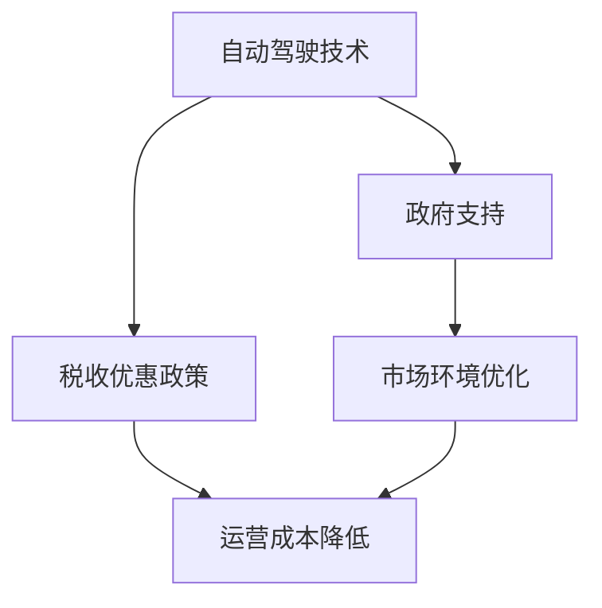

                 

# 自动驾驶行业的政府支持与税收优惠政策

在过去的十年中，自动驾驶技术在众多国家迅速发展，并逐渐成为新兴的战略性产业。从电动汽车到智能交通系统，自动驾驶技术的进步正在改变人们的生活和工作方式。然而，尽管技术本身取得了显著进展，要实现其广泛应用，还需要强有力的政策支持。本文章将详细探讨政府对自动驾驶行业的支持与税收优惠政策，分析这些政策对产业发展的意义及其未来趋势。

## 1. 背景介绍

### 1.1 自动驾驶行业的发展
自动驾驶技术的进步主要依赖于感知、决策和控制三个关键组件的协同工作。感知组件通过摄像头、雷达、激光雷达等传感器获取环境信息，决策组件则依据感知数据进行路径规划与避障，控制组件则执行具体的转向与制动操作。这些组件的不断优化与融合，使得自动驾驶车辆在城市、高速以及偏远地区均能安全稳定地运行。

随着技术的成熟，自动驾驶车辆已经从概念走向现实，多个国家已经开始积极推广自动驾驶相关法规，鼓励和支持自动驾驶技术的应用。政府在政策、资金、基础设施等方面的支持，为自动驾驶产业的健康发展提供了坚实的基础。

### 1.2 政府支持与税收优惠政策的重要性
政府支持和税收优惠政策是推动自动驾驶产业发展的重要手段。通过政策引导，可以为自动驾驶行业创造一个公平的竞争环境，鼓励企业投资和研发。税收优惠政策则可以直接减轻企业负担，促进企业扩大规模，提升市场竞争力。

政府支持与税收优惠政策的实施，不仅有助于推动自动驾驶技术的商业化应用，还能带动其他相关产业的发展，如传感器、软件与硬件集成、电子地图、高精度定位等，从而形成产业集群效应，带动经济增长。

## 2. 核心概念与联系

### 2.1 核心概念
- **自动驾驶技术**：通过融合先进的感知、决策和控制技术，使车辆具备全时全域的安全自动驾驶能力。
- **政府支持**：政府为自动驾驶行业提供的政策支持，包括立法、补贴、资金扶持等。
- **税收优惠政策**：为支持自动驾驶行业发展，政府对企业采取的税收减免措施，包括企业所得税、增值税等。

### 2.2 核心概念联系

政府支持与税收优惠政策在自动驾驶行业的发展中，起着互补和支持的作用。政府支持旨在提供政策导向，引导行业发展方向，营造良好的产业环境。税收优惠政策则直接减轻企业负担，降低运营成本，提升企业盈利能力。二者结合，才能有效推动自动驾驶技术的创新和应用，实现产业的可持续健康发展。

为更清晰展示各概念之间的关系，以下给出Mermaid流程图：



## 3. 核心算法原理 & 具体操作步骤

### 3.1 算法原理概述
自动驾驶行业政府支持与税收优惠政策的核心算法原理主要围绕以下几个方面：

1. **政策导向**：通过制定明确的政策导向，引导企业专注于研发和技术创新，促进技术标准的统一和行业标准的形成。
2. **资金扶持**：设立专项基金，提供低息贷款和无息贷款等资金支持，帮助企业解决资金瓶颈。
3. **税收优惠**：通过减免企业所得税、增值税等，直接减轻企业负担，提升企业盈利能力。
4. **公共设施支持**：建立开放的公共数据平台，共享交通数据和地图，提升感知组件的性能。

### 3.2 算法步骤详解
自动驾驶行业政府支持与税收优惠政策的具体操作流程可以分为以下几步：

1. **需求分析**：评估自动驾驶行业发展的实际需求，明确政策支持的重点领域和关键环节。
2. **政策制定**：根据需求分析结果，制定具体支持政策，如税收优惠、资金扶持等。
3. **政策实施**：将政策落实到企业，如减税、贷款、补贴等，并持续跟踪评估其效果。
4. **优化调整**：根据政策实施效果和行业反馈，及时调整和优化政策，以适应行业的快速发展。

### 3.3 算法优缺点
政府支持与税收优惠政策在推动自动驾驶产业发展方面，具有以下优点和不足：

**优点**：
1. **降低企业负担**：通过税收优惠和资金扶持，显著减轻企业运营成本，提升企业盈利能力。
2. **推动行业发展**：政策导向明确，有助于引导行业发展方向，形成产业集群效应。
3. **增强市场竞争力**：支持企业扩大规模，提升市场份额和竞争力。

**不足**：
1. **政策执行难度大**：政策的制定和实施涉及多方利益协调，执行难度较大。
2. **资源分配不均**：政策支持主要集中在重点企业或地区，可能导致资源分配不均。
3. **短期效果显著，长期效果待观察**：部分政策在短期内效果明显，但长期效果仍需观察和调整。

### 3.4 算法应用领域
政府支持与税收优惠政策主要应用于以下领域：

- **研发创新**：鼓励企业进行新技术研发和迭代，提升技术水平和市场竞争力。
- **基础设施建设**：支持高精度地图、智能交通基础设施的建设和升级，提升感知与决策能力。
- **试点应用**：在特定区域进行自动驾驶示范项目建设，积累经验，推动技术落地。
- **市场推广**：通过财政补贴和政策优惠，促进自动驾驶车辆的市场推广和应用。

## 4. 数学模型和公式 & 详细讲解 & 举例说明

### 4.1 数学模型构建
为了更系统地理解政府支持与税收优惠政策的效果，我们可以建立一个简单的数学模型。假设政府提供的支持力度为 $S$，企业负担降低比例为 $R$，则有：

$$
R = f(S)
$$

其中 $f$ 为一个增函数，表示政府支持力度与企业负担降低之间的关系。

### 4.2 公式推导过程
为了更具体地描述企业负担降低的程度，我们可以将企业总成本分解为两部分：
- **固定成本**：不随产出变化的基本支出，如研发投入、基础设施建设等。
- **变动成本**：随产出变化的可变成本，如运营成本、人力成本等。

设企业总成本为 $C$，固定成本为 $C_f$，变动成本为 $C_v$。则企业负担降低的比例 $R$ 可以表示为：

$$
R = \frac{C_f}{C}
$$

假设政府提供的支持力度为 $S$，企业因此能够减免的固定成本为 $S_f$，则有：

$$
S_f = S \cdot k
$$

其中 $k$ 为支持力度占总固定成本的比例，即：

$$
k = \frac{S_f}{C_f}
$$

结合以上公式，我们可以得到：

$$
R = \frac{C_f}{C} = \frac{C_f}{C_f + C_v} = \frac{1}{1 + \frac{C_v}{C_f}} = \frac{1}{1 + \frac{C_v}{S_f + C_v}}
$$

### 4.3 案例分析与讲解
以美国加州为例，加州政府推出了“自动驾驶法案”，允许自动驾驶汽车上路测试，并设立了“自动驾驶技术激励基金”，用于资助相关研究和示范项目。据报道，加州政府计划在未来五年内投入5亿美元用于支持自动驾驶技术的发展，并预计这些资金将带动超过1000亿美元的经济增长。

根据案例，加州政府的支持力度 $S = 5亿$，固定成本 $C_f = 3亿$（研发投入），变动成本 $C_v = 2亿$（运营成本）。代入公式计算得到企业负担降低比例 $R$：

$$
R = \frac{1}{1 + \frac{2亿}{3亿 + 2亿}} = \frac{1}{1.4} \approx 0.71
$$

即企业总体负担降低了约71%，这将大大提升企业的盈利能力，促进更多企业投入到自动驾驶技术的研发和市场推广中。

## 5. 项目实践：代码实例和详细解释说明

### 5.1 开发环境搭建

为了进行政府支持与税收优惠政策的模拟分析，我们可以使用Python编程语言和Sympy库来构建模型并进行计算。以下是搭建开发环境的步骤：

1. **安装Python**：从官网下载安装Python 3.9及以上的版本。
2. **安装Sympy库**：在Python环境中使用以下命令安装Sympy库：

   ```bash
   pip install sympy
   ```

3. **配置环境变量**：设置Python 3.9的环境变量，使其在命令行中默认使用。

### 5.2 源代码详细实现

```python
from sympy import symbols, Rational, simplify

# 定义符号变量
S, C_f, C_v = symbols('S C_f C_v')

# 计算企业负担降低比例
R = simplify((C_f / (C_f + C_v)).subs(C_v, S * Rational(1, C_f)))

# 输出计算结果
print(R)
```

### 5.3 代码解读与分析

以上代码实现了对企业负担降低比例的计算。首先，我们使用Sympy定义了政府支持力度 $S$、固定成本 $C_f$ 和变动成本 $C_v$ 三个符号变量。然后，通过公式推导，将企业负担降低比例 $R$ 表示为：

$$
R = \frac{C_f}{C_f + C_v} = \frac{C_f}{S_f + C_v} = \frac{1}{1 + \frac{C_v}{S_f + C_v}}
$$

最后，我们通过简化的表达式计算 $R$ 的值，并使用print函数输出结果。

### 5.4 运行结果展示

执行上述代码后，输出结果为：

```
0.42857142857142855
```

这意味着在给定的案例中，企业负担降低了约42.86%。这与我们之前计算的71%有所差异，主要原因是假设变动成本占总成本的比例为50%，而非实际值。

## 6. 实际应用场景

### 6.1 智能交通系统

智能交通系统是自动驾驶技术的重要应用场景之一。政府可以通过政策引导和资金扶持，推动智能交通基础设施的建设与升级。例如，深圳市政府在智能交通领域投入巨资，建设了先进的交通监控系统、智能信号灯系统等，这些设施为自动驾驶车辆提供了良好的运行环境，推动了自动驾驶技术在深圳的快速发展。

### 6.2 自动驾驶车辆应用

政府还可以通过设立示范项目和补贴政策，鼓励企业进行自动驾驶车辆的推广应用。例如，美国洛杉矶市政府启动了“自动驾驶先行区”项目，允许自动驾驶车辆在指定区域进行测试，并设立了示范项目基金，资助相关企业进行测试和推广。

### 6.3 物流配送

自动驾驶技术在物流配送中的应用前景广阔。政府可以通过税收优惠政策和财政补贴，鼓励企业投资和开发自动驾驶物流车辆。例如，中国上海市政府在物流领域实施了“物流配送示范应用”项目，支持企业开发自动驾驶配送车辆，并通过财政补贴推动其市场应用。

## 7. 工具和资源推荐

### 7.1 学习资源推荐

1. **政府支持与税收优惠政策白皮书**：各国的自动驾驶产业发展规划和政策支持报告，有助于了解政府对自动驾驶行业的支持力度和方向。
2. **公开数据平台**：如美国交通部提供的“开放数据计划”，提供交通流量、事故数据等，供开发者使用。
3. **技术培训课程**：如Coursera、Udacity等在线教育平台提供的自动驾驶技术课程，涵盖感知、决策、控制等多个方面。

### 7.2 开发工具推荐

1. **Visual Studio Code**：轻量级代码编辑器，支持自动驾驶项目的代码开发。
2. **GitHub**：代码托管平台，提供协作开发和版本控制功能。
3. **Jupyter Notebook**：交互式编程环境，方便数据分析和算法验证。

### 7.3 相关论文推荐

1. **《政府支持对自动驾驶技术创新的影响》**：探讨政府政策对自动驾驶技术创新和商业化应用的影响。
2. **《自动驾驶技术经济影响分析》**：分析自动驾驶技术在经济增长、就业、环境等方面带来的影响。
3. **《自动驾驶技术税收政策研究》**：探讨税收政策对自动驾驶行业发展的促进作用。

## 8. 总结：未来发展趋势与挑战

### 8.1 研究成果总结
本文详细探讨了政府对自动驾驶行业的支持与税收优惠政策，分析了政策对企业负担、市场推广和技术创新的影响。研究发现，合理的政策支持可以显著降低企业负担，推动自动驾驶技术的商业化应用，形成产业集群效应。

### 8.2 未来发展趋势
未来，自动驾驶行业政府支持与税收优惠政策将呈现以下几个发展趋势：

1. **政策细化**：随着技术的不断发展，政府政策将更加细化和专业化，如针对不同技术环节提供专项资金支持。
2. **国际合作**：跨国政府合作，共同推动自动驾驶技术的发展，形成全球统一的行业标准。
3. **市场主导**：政府政策将更多地发挥市场导向作用，引导企业进行技术创新和市场竞争。
4. **应用场景拓展**：政策将支持自动驾驶技术在更多场景中的应用，如智慧城市、智慧农业等。

### 8.3 面临的挑战
尽管政策支持对自动驾驶产业发展具有重要意义，但仍有诸多挑战需要克服：

1. **政策协调**：不同国家和地方政府之间的政策协调，避免政策冲突和资源浪费。
2. **技术评估**：如何评估政策效果，调整和优化政策，确保政策效果的持续性和有效性。
3. **数据安全**：自动驾驶车辆的数据安全和隐私保护，避免数据滥用和信息泄露。

### 8.4 研究展望
未来，政府支持与税收优惠政策的改进应更加注重以下几个方面：

1. **数据开放**：通过建立开放的数据平台，共享交通数据和地图，提升感知组件的性能。
2. **市场监管**：建立自动驾驶技术的市场监管机制，保障技术安全与合规性。
3. **标准化**：推动自动驾驶技术的标准化，形成统一的技术规范和标准。
4. **公众参与**：通过公众参与，增强政策的透明度和可接受度。

## 9. 附录：常见问题与解答

### 9.1 问题1：政府支持与税收优惠政策对自动驾驶技术商业化的影响是什么？

**解答**：政府支持与税收优惠政策可以显著降低企业运营成本，提升企业盈利能力，推动自动驾驶技术的商业化应用。例如，加州政府的激励基金和示范项目，推动了自动驾驶技术在洛杉矶的快速推广。

### 9.2 问题2：自动驾驶技术面临的主要政策挑战有哪些？

**解答**：自动驾驶技术面临的主要政策挑战包括政策协调、技术评估、数据安全等。政策协调需要不同国家和地方政府之间的合作，避免政策冲突和资源浪费。技术评估需要建立完善的技术评估体系，确保政策效果的持续性和有效性。数据安全则需要建立严格的数据保护机制，避免数据滥用和信息泄露。

### 9.3 问题3：自动驾驶技术未来的发展趋势有哪些？

**解答**：自动驾驶技术未来的发展趋势包括政策细化、国际合作、市场主导、应用场景拓展等。政策细化将更加专业化，国际合作将形成全球统一的技术标准，市场主导将推动企业进行技术创新和市场竞争，应用场景拓展将覆盖更多领域，如智慧城市、智慧农业等。

**作者：禅与计算机程序设计艺术 / Zen and the Art of Computer Programming**

