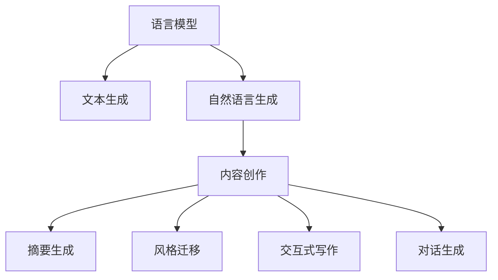

                 

# 自然语言生成（NLG）在内容创作中的应用

> 关键词：自然语言生成，NLG，内容创作，文本生成，语言模型，GPT-3，Transformer，AI写作，文本摘要，AI小说，智能写作助手

## 1. 背景介绍

### 1.1 问题由来
随着人工智能技术的快速发展，自然语言生成（Natural Language Generation，NLG）技术正逐渐成为内容创作领域的重要工具。传统的文本创作依赖于人工，效率低，成本高，且质量难以保障。而基于自然语言生成技术的内容创作，能够快速生成高质量、大批量、多维度的文本内容，大大降低了内容创作的难度和时间成本。

### 1.2 问题核心关键点
当前，自然语言生成技术在内容创作中的应用主要集中在以下几个方面：

- **新闻报道**：自动生成新闻标题、摘要、文章等内容，提升新闻生产效率和质量。
- **营销文案**：快速生成产品介绍、广告文案、社交媒体帖子等，推动品牌营销。
- **技术文档**：生成编程代码、用户手册、技术博客等内容，加速知识传播。
- **创意写作**：创作小说、剧本、诗歌等文学作品，开拓新的艺术形式。
- **数据报告**：自动生成市场分析、财务报告、科学研究等内容，简化数据呈现过程。

### 1.3 问题研究意义
研究自然语言生成技术在内容创作中的应用，对于提升内容生产效率、降低成本、提高内容质量具有重要意义：

1. **效率提升**：自动化生成大量高质量文本，快速响应市场变化。
2. **成本降低**：减少人工撰写成本，降低内容创作的门槛。
3. **质量保障**：通过算法优化和数据驱动，提升文本内容的准确性和可读性。
4. **规模化**：实现多维度、多渠道的文本内容生产，满足不同场景需求。
5. **创新潜力**：开拓新的内容创作形式，如AI小说、AI剧本等，推动文化和艺术的革新。

## 2. 核心概念与联系

### 2.1 核心概念概述

为更好地理解自然语言生成技术在内容创作中的应用，本节将介绍几个密切相关的核心概念：

- **自然语言生成（NLG）**：使用计算机算法和模型，将结构化数据转换为自然语言文本的过程。
- **语言模型（Language Model）**：能够预测文本序列中下一个词的分布模型，如LSTM、RNN、Transformer等。
- **文本生成（Text Generation）**：通过模型生成符合语法规则和语义逻辑的文本内容。
- **内容创作（Content Creation）**：创作具有实际价值和应用意义的文章、报告、广告等文本。
- **风格迁移（Style Transfer）**：将一种风格的文本内容转换为另一种风格，如正式语体、口语语体等。
- **交互式写作（Interactive Writing）**：结合用户输入和反馈，动态生成文本，提升用户体验。
- **摘要生成（Summarization）**：自动生成文本的简要概述，帮助快速理解核心内容。
- **对话生成（Dialogue Generation）**：生成多轮对话，用于聊天机器人、客服系统等场景。

这些核心概念之间的逻辑关系可以通过以下Mermaid流程图来展示：



这个流程图展示了这个框架的关键组成部分：

1. 语言模型提供生成文本的基础能力。
2. 文本生成利用语言模型生成符合语法和语义的文本。
3. 自然语言生成技术将结构化数据转换为自然语言文本。
4. 内容创作使用NLG技术生成具有实际意义的文章、报告等。
5. 摘要生成对文本进行简要概述，帮助理解。
6. 风格迁移改变文本风格，适应不同应用场景。
7. 交互式写作动态生成文本，提升用户体验。
8. 对话生成生成多轮对话，用于自动化交互。

## 3. 核心算法原理 & 具体操作步骤
### 3.1 算法原理概述

自然语言生成技术在内容创作中的应用，核心在于利用语言模型进行文本生成。该技术通过将结构化数据转换为自然语言文本，自动化生成高质量、高效率的内容。

形式化地，假设输入为结构化数据 $D$，输出为自然语言文本 $T$，语言模型为 $M_{\theta}$，则文本生成过程可以表示为：

$$
T = M_{\theta}(D)
$$

其中，$\theta$ 为模型参数。在文本生成过程中，语言模型会根据已有文本序列生成下一个词的概率分布，通过采样选择概率最大的词进行输出。

### 3.2 算法步骤详解

基于自然语言生成技术的内容创作一般包括以下几个关键步骤：

**Step 1: 准备输入数据**
- 收集并处理结构化数据，如新闻、商品描述、科技文章等。
- 将结构化数据转换为易于模型处理的格式，如JSON、CSV等。

**Step 2: 设计语言模型**
- 选择合适的语言模型结构，如LSTM、RNN、Transformer等。
- 在标注数据集上预训练语言模型，使其学习到语言的通用表示。
- 使用微调技术调整模型参数，以适应具体内容创作任务。

**Step 3: 生成文本**
- 将输入数据输入模型，利用语言模型生成文本序列。
- 设置模型参数和输出格式，如句子长度、文本风格等。
- 使用解码器解码模型输出，得到完整的文本内容。

**Step 4: 后处理**
- 对生成文本进行语法校验、风格调整、拼写检查等后处理。
- 将生成的文本进行格式化，确保符合目标应用场景的需求。

**Step 5: 评估与优化**
- 对生成的文本进行人工或自动评估，检查内容准确性和可读性。
- 根据评估结果，对模型进行调整和优化，提升生成效果。

### 3.3 算法优缺点

基于自然语言生成技术的内容创作方法具有以下优点：

1. **高效性**：自动化生成大量文本，大幅提升内容创作效率。
2. **多样性**：可以根据不同的输入数据生成多种风格的文本。
3. **灵活性**：可以处理多种结构化数据，适用于各种内容创作场景。
4. **可扩展性**：可以扩展到多语言、多领域的内容创作。

同时，该方法也存在一些缺点：

1. **依赖标注数据**：生成效果依赖于标注数据的数量和质量。
2. **可控性差**：生成的文本可能存在语法错误、逻辑不清等问题。
3. **生成结果的偏见**：模型可能受到训练数据的偏见，生成结果有偏差。
4. **缺乏创造性**：生成文本缺乏人类创作的创造性和独特性。

尽管存在这些局限性，但就目前而言，基于自然语言生成技术的内容创作方法仍是大规模文本生成的主要手段。未来相关研究的重点在于如何进一步提高生成结果的质量和可控性，同时兼顾创造性和公平性等因素。

### 3.4 算法应用领域

自然语言生成技术在内容创作中的应用已经广泛应用于各个领域，例如：

- **新闻行业**：自动生成新闻标题、摘要、文章等，提升新闻生产效率。
- **广告行业**：快速生成广告文案、社交媒体帖子等，推动品牌营销。
- **技术行业**：生成编程代码、技术文档、用户手册等，加速知识传播。
- **文学创作**：创作小说、剧本、诗歌等文学作品，开拓新的艺术形式。
- **教育行业**：生成教学材料、考试试题等，辅助教学和评估。
- **医疗行业**：生成医疗报告、健康建议等，辅助诊断和治疗。
- **法律行业**：生成法律文件、合同条款等，提升法律工作效率。
- **金融行业**：生成金融报告、投资分析等，辅助投资决策。

除了上述这些经典应用外，自然语言生成技术还在舆情分析、智能客服、舆情监测、舆情分析等诸多领域得到了广泛应用，为各行各业的内容创作带来了新的变革。

## 4. 数学模型和公式 & 详细讲解
### 4.1 数学模型构建

本节将使用数学语言对自然语言生成技术在内容创作中的应用进行更加严格的刻画。

假设语言模型为 $M_{\theta}$，输入数据为 $D$，生成的文本序列为 $T$，则文本生成过程可以表示为：

$$
T = M_{\theta}(D)
$$

其中，$\theta$ 为模型参数。在文本生成过程中，语言模型会根据已有文本序列生成下一个词的概率分布，通过采样选择概率最大的词进行输出。

### 4.2 公式推导过程

以下我们以使用Transformer模型进行文本生成为例，推导文本生成过程的数学公式。

假设输入数据为 $D$，生成的文本序列为 $T$，语言模型为 $M_{\theta}$。在Transformer模型中，输入 $D$ 会被编码为 token ids，并送入编码器（Encoder）进行处理。编码器的输出 $H$ 通过多头注意力机制（Multi-Head Attention）生成中间表示 $X$，再送入解码器（Decoder）进行生成。解码器的输出 $Y$ 通过线性层和softmax函数生成下一个词的概率分布 $P$，最终选择概率最大的词进行输出。

解码器输出的概率分布 $P$ 可以表示为：

$$
P = softmax(DecoderOutput(X, Y))
$$

其中，$DecoderOutput$ 为解码器输出的中间表示，$X$ 为编码器的输出，$Y$ 为前一个生成的词的token ids。

在实际应用中，$P$ 被用于采样选择下一个词的token ids，形成文本序列 $T$。采样过程可以表示为：

$$
next_word = \arg\max_{t}P(t)
$$

生成文本序列 $T$ 的过程可以表示为：

$$
T = \{w_1, w_2, ..., w_n\} = \{next_word_{1}, next_word_{2}, ..., next_word_{n}\}
$$

### 4.3 案例分析与讲解

以生成新闻标题为例，假设输入数据为新闻文章 $D$，语言模型为Transformer模型，生成的文本序列为新闻标题 $T$。具体流程如下：

1. 将新闻文章 $D$ 转换为token ids，输入编码器进行处理。
2. 通过多头注意力机制生成中间表示 $X$。
3. 将中间表示 $X$ 送入解码器，生成新闻标题 $T$。
4. 对生成的标题进行语法校验、风格调整、拼写检查等后处理。
5. 将生成的标题输出，作为最终的内容创作结果。

例如，输入一篇关于新冠疫情的新闻文章，模型生成的标题可以是：“新冠疫情全球扩散，多国进入紧急状态”。

## 5. 项目实践：代码实例和详细解释说明
### 5.1 开发环境搭建

在进行文本生成实践前，我们需要准备好开发环境。以下是使用Python进行PyTorch开发的环境配置流程：

1. 安装Anaconda：从官网下载并安装Anaconda，用于创建独立的Python环境。

2. 创建并激活虚拟环境：
```bash
conda create -n pytorch-env python=3.8 
conda activate pytorch-env
```

3. 安装PyTorch：根据CUDA版本，从官网获取对应的安装命令。例如：
```bash
conda install pytorch torchvision torchaudio cudatoolkit=11.1 -c pytorch -c conda-forge
```

4. 安装Transformers库：
```bash
pip install transformers
```

5. 安装各类工具包：
```bash
pip install numpy pandas scikit-learn matplotlib tqdm jupyter notebook ipython
```

完成上述步骤后，即可在`pytorch-env`环境中开始文本生成实践。

### 5.2 源代码详细实现

这里我们以使用Transformer模型生成新闻标题为例，给出Python代码实现。

首先，定义Transformer模型的输入和输出格式：

```python
from transformers import AutoTokenizer, AutoModelForSeq2SeqLM
from transformers import pipeline

tokenizer = AutoTokenizer.from_pretrained('t5-small')
model = AutoModelForSeq2SeqLM.from_pretrained('t5-small')

input_text = "新冠疫情全球扩散，多国进入紧急状态。"
input_ids = tokenizer(input_text, return_tensors='pt').input_ids
output = model.generate(input_ids, max_length=15, num_return_sequences=1)

generated_text = tokenizer.decode(output[0], skip_special_tokens=True)
print(generated_text)
```

接着，使用pipeline函数进行文本生成：

```python
from transformers import pipeline

generator = pipeline('text-generation', model=model, tokenizer=tokenizer)

input_text = "新冠疫情全球扩散，多国进入紧急状态。"
output = generator(input_text, max_length=15, num_return_sequences=1)

generated_text = output[0]['generated_text']
print(generated_text)
```

以上代码展示了使用Transformer模型生成新闻标题的过程。可以看到，通过调用pipeline函数，可以方便快捷地进行文本生成。

### 5.3 代码解读与分析

让我们再详细解读一下关键代码的实现细节：

**AutoTokenizer和AutoModelForSeq2SeqLM**：
- 自动加载预训练模型和分词器，方便快速进行文本生成。
- AutoTokenizer负责将输入文本转换为模型可以接受的token ids。
- AutoModelForSeq2SeqLM是专门用于文本生成的序列到序列模型。

**input_text和input_ids**：
- input_text为输入的原始文本，可以是一个完整的句子。
- input_ids是经过分词器编码后的token ids，需要输入到模型中。

**generate函数**：
- 生成函数用于根据输入的token ids生成文本序列。
- 参数包括max_length表示生成的文本长度，num_return_sequences表示返回多少个生成的文本。

**pipeline函数**：
- pipeline函数用于快速创建文本生成任务，方便使用。
- 参数包括模型名称和分词器，可以直接加载预训练模型。

**generated_text**：
- 生成的文本内容，以字符串形式输出。

通过以上代码，可以看出使用Transformer模型进行文本生成非常容易，只需简单几行代码即可实现。

## 6. 实际应用场景
### 6.1 智能客服系统

基于自然语言生成技术的内容创作，可以广泛应用于智能客服系统的构建。传统客服往往需要配备大量人力，高峰期响应缓慢，且一致性和专业性难以保证。而使用生成式文本创作的智能客服系统，可以7x24小时不间断服务，快速响应客户咨询，用自然流畅的语言解答各类常见问题。

在技术实现上，可以收集企业内部的历史客服对话记录，将问题和最佳答复构建成监督数据，在此基础上对预训练生成模型进行微调。微调后的生成模型能够自动理解用户意图，匹配最合适的答复模板进行回复。对于客户提出的新问题，还可以接入检索系统实时搜索相关内容，动态组织生成回答。如此构建的智能客服系统，能大幅提升客户咨询体验和问题解决效率。

### 6.2 广告文案生成

传统的广告文案创作依赖于人工撰写，不仅成本高、效率低，还容易存在创意不足的问题。基于自然语言生成技术，可以快速生成多样化的广告文案，提升品牌营销效果。

在实际应用中，可以收集广告样本和用户反馈，训练生成模型。模型可以根据品牌调性和市场需求生成个性化的广告文案，如产品介绍、社交媒体帖子、邮件营销等。通过不断的迭代优化，生成模型能够创作出更符合品牌调性和用户喜好的广告内容，推动品牌营销的持续发展。

### 6.3 技术文档创作

技术文档是软件开发中不可或缺的一部分，但编写技术文档通常需要耗费大量的时间和精力。基于自然语言生成技术，可以快速生成高质量的技术文档，提升开发效率和文档质量。

在实际应用中，可以收集技术文档样本和相关代码，训练生成模型。模型可以根据代码注释和结构化数据生成技术文档，如API文档、用户手册、技术博客等。通过不断的迭代优化，生成模型能够创作出更全面、准确、易读的技术文档，帮助开发者快速理解和学习。

### 6.4 金融分析报告

金融行业需要定期生成市场分析报告、财务报告等文档，但这些文档的生成通常需要专业知识和丰富经验。基于自然语言生成技术，可以快速生成高质量的金融分析报告，提升金融分析的效率和准确性。

在实际应用中，可以收集历史金融报告和市场数据，训练生成模型。模型可以根据市场数据和最新信息生成分析报告，如市场分析、投资建议、财务报告等。通过不断的迭代优化，生成模型能够创作出更符合市场趋势和投资者需求的分析报告，提升投资决策的科学性和准确性。

### 6.5 创意写作

传统的文学创作依赖于人类的创造力和想象力，但人类创作存在速度慢、创意有限等问题。基于自然语言生成技术，可以快速生成多样化的文学作品，拓展创意写作的边界。

在实际应用中，可以收集文学作品和用户反馈，训练生成模型。模型可以根据用户喜好和创作风格生成小说、剧本、诗歌等文学作品。通过不断的迭代优化，生成模型能够创作出更符合用户口味和创作需求的文学作品，推动文学创作的发展。

### 6.6 数据报告生成

数据报告是企业决策的重要依据，但传统的报告生成通常需要耗费大量的时间和精力。基于自然语言生成技术，可以快速生成高质量的数据报告，提升决策效率和报告质量。

在实际应用中，可以收集历史数据报告和相关数据，训练生成模型。模型可以根据数据和市场信息生成分析报告，如市场分析、客户画像、财务报告等。通过不断的迭代优化，生成模型能够创作出更全面、准确、易读的数据报告，帮助企业做出更科学的决策。

## 7. 工具和资源推荐
### 7.1 学习资源推荐

为了帮助开发者系统掌握自然语言生成技术在内容创作中的应用，这里推荐一些优质的学习资源：

1. 《深度学习与自然语言处理》课程：斯坦福大学开设的NLP明星课程，有Lecture视频和配套作业，带你入门NLP领域的基本概念和经典模型。

2. 《自然语言处理基础》书籍：讲解NLP基本概念和常用模型的经典教材，适合初学者和进阶者阅读。

3. 《NLG in Action》书籍：详细讲解自然语言生成技术的书籍，包含大量实践案例和代码示例。

4. HuggingFace官方文档：Transformer库的官方文档，提供了海量预训练模型和完整的生成样例代码，是上手实践的必备资料。

5. OpenAI Blog：收集了大量自然语言生成技术的最新研究和实践，适合技术进阶阅读。

通过对这些资源的学习实践，相信你一定能够快速掌握自然语言生成技术在内容创作中的应用，并用于解决实际的NLP问题。
###  7.2 开发工具推荐

高效的开发离不开优秀的工具支持。以下是几款用于自然语言生成技术在内容创作应用的常用工具：

1. PyTorch：基于Python的开源深度学习框架，灵活动态的计算图，适合快速迭代研究。大部分预训练语言模型都有PyTorch版本的实现。

2. TensorFlow：由Google主导开发的开源深度学习框架，生产部署方便，适合大规模工程应用。同样有丰富的预训练语言模型资源。

3. Transformers库：HuggingFace开发的NLP工具库，集成了众多SOTA语言模型，支持PyTorch和TensorFlow，是进行文本生成任务的开发的利器。

4. Weights & Biases：模型训练的实验跟踪工具，可以记录和可视化模型训练过程中的各项指标，方便对比和调优。与主流深度学习框架无缝集成。

5. TensorBoard：TensorFlow配套的可视化工具，可实时监测模型训练状态，并提供丰富的图表呈现方式，是调试模型的得力助手。

6. Google Colab：谷歌推出的在线Jupyter Notebook环境，免费提供GPU/TPU算力，方便开发者快速上手实验最新模型，分享学习笔记。

合理利用这些工具，可以显著提升自然语言生成技术在内容创作应用的开发效率，加快创新迭代的步伐。

### 7.3 相关论文推荐

自然语言生成技术的发展源于学界的持续研究。以下是几篇奠基性的相关论文，推荐阅读：

1. Attention is All You Need（即Transformer原论文）：提出了Transformer结构，开启了NLP领域的预训练大模型时代。

2. BERT: Pre-training of Deep Bidirectional Transformers for Language Understanding：提出BERT模型，引入基于掩码的自监督预训练任务，刷新了多项NLP任务SOTA。

3. Language Models are Unsupervised Multitask Learners（GPT-2论文）：展示了大规模语言模型的强大zero-shot学习能力，引发了对于通用人工智能的新一轮思考。

4. GPT-3：在大规模语言模型的基础上，展示了更大的数据规模和更强的生成能力，推动了自然语言生成技术的进步。

5. Curriculum-based Generation of Bilingual Parallel Corpora from Monolingual Data：提出了一种基于课程的生成方法，利用单语料生成高质量的双语平行语料。

6. Multi-World Type-Conditional Pre-Training for Sequence Generation：提出了一种基于多世界的预训练方法，提高了文本生成的多样性和合理性。

这些论文代表了大语言生成技术的发展脉络。通过学习这些前沿成果，可以帮助研究者把握学科前进方向，激发更多的创新灵感。

## 8. 总结：未来发展趋势与挑战

### 8.1 总结

本文对自然语言生成技术在内容创作中的应用进行了全面系统的介绍。首先阐述了自然语言生成技术在内容创作领域的研究背景和意义，明确了文本生成在提升内容生产效率、降低成本、提高内容质量方面的独特价值。其次，从原理到实践，详细讲解了文本生成的数学原理和关键步骤，给出了文本生成任务开发的完整代码实例。同时，本文还广泛探讨了文本生成技术在智能客服、广告文案、技术文档、金融分析报告、创意写作、数据报告等多个行业领域的应用前景，展示了文本生成技术的巨大潜力。此外，本文精选了文本生成技术的各类学习资源，力求为读者提供全方位的技术指引。

通过本文的系统梳理，可以看到，自然语言生成技术在内容创作领域正逐渐成为主流，极大地提升了内容生产的效率和质量，为各行各业的内容创作带来了新的变革。未来，伴随自然语言生成技术的不断进步，相信文本生成技术将在更广阔的应用领域大放异彩，深刻影响人类的生产生活方式。

### 8.2 未来发展趋势

展望未来，自然语言生成技术在内容创作领域将呈现以下几个发展趋势：

1. **模型规模持续增大**：随着算力成本的下降和数据规模的扩张，预训练语言模型的参数量还将持续增长。超大规模语言模型蕴含的丰富语言知识，有望支撑更加复杂多变的文本生成任务。

2. **生成结果的情感和风格多样化**：通过引入情感分析和风格迁移技术，生成模型能够创作出更多情感丰富、风格多样的文本内容。

3. **交互式生成**：结合用户输入和反馈，动态生成文本，提升用户体验。如智能写作助手、对话生成系统等。

4. **生成内容的个性化和定制化**：通过个性推荐和动态调整，生成模型能够创作出更加个性化和定制化的文本内容。

5. **生成内容的自动化校验**：引入语法校验、风格调整、拼写检查等技术，提高生成内容的准确性和可读性。

6. **生成内容的自动化评估**：引入自动评估技术，量化评估生成内容的性能和质量，指导模型优化。

以上趋势凸显了自然语言生成技术的广阔前景。这些方向的探索发展，必将进一步提升文本生成的效率和质量，为各行各业的内容创作带来新的变革。

### 8.3 面临的挑战

尽管自然语言生成技术已经取得了瞩目成就，但在迈向更加智能化、普适化应用的过程中，它仍面临着诸多挑战：

1. **生成内容的可控性差**：生成的文本可能存在语法错误、逻辑不清等问题。

2. **生成内容的偏见**：模型可能受到训练数据的偏见，生成结果有偏差。

3. **生成内容的创造性不足**：生成的文本缺乏人类创作的创造性和独特性。

4. **生成内容的稳定性不足**：模型可能对输入数据的微小变化敏感，导致生成结果不稳定。

5. **生成内容的可靠性不足**：生成的文本可能存在误导性、有害性等问题。

6. **生成内容的隐私保护**：生成模型的数据使用可能涉及隐私问题，需加强隐私保护和合规性。

7. **生成内容的版本管理**：生成模型的版本管理难度大，需建立良好的版本控制系统。

这些挑战凸显了自然语言生成技术在内容创作领域的发展瓶颈。为了应对这些挑战，未来的研究需要在以下几个方面寻求新的突破：

1. **引入先验知识**：将符号化的先验知识，如知识图谱、逻辑规则等，与神经网络模型进行融合，提升生成内容的准确性和合理性。

2. **引入对比学习和因果推断**：通过引入对比学习和因果推断思想，增强生成模型的稳定性和泛化能力。

3. **引入生成对抗网络（GAN）**：通过生成对抗网络，提升生成内容的创造性和多样性。

4. **引入强化学习**：通过强化学习，优化生成模型的策略和参数，提升生成内容的可控性和稳定性。

5. **引入隐私保护技术**：通过隐私保护技术，保护生成模型数据使用的隐私和安全。

6. **引入版本控制系统**：建立良好的版本控制系统，确保生成模型版本的可追溯和可管理。

这些研究方向将推动自然语言生成技术在内容创作领域的不断进步，为构建安全、可靠、可解释、可控的内容创作系统铺平道路。面向未来，自然语言生成技术还需要与其他人工智能技术进行更深入的融合，如知识表示、因果推理、强化学习等，多路径协同发力，共同推动内容创作系统的进步。只有勇于创新、敢于突破，才能不断拓展自然语言生成技术的边界，让智能技术更好地造福人类社会。

### 8.4 研究展望

面对自然语言生成技术所面临的种种挑战，未来的研究需要在以下几个方面寻求新的突破：

1. **引入多模态信息**：将视觉、听觉等多模态信息与文本生成结合，提升生成内容的真实感和表现力。

2. **引入交互式生成**：结合用户输入和反馈，动态生成文本，提升用户体验。如智能写作助手、对话生成系统等。

3. **引入知识图谱**：将知识图谱与自然语言生成技术结合，提升生成内容的准确性和合理性。

4. **引入情感分析**：通过情感分析技术，生成情感丰富的文本内容，满足用户情感需求。

5. **引入风格迁移**：将一种风格的文本内容转换为另一种风格，提升生成内容的多样性和个性化。

6. **引入智能校验**：通过智能校验技术，提升生成内容的准确性和可读性。如语法校验、风格调整、拼写检查等。

7. **引入隐私保护技术**：通过隐私保护技术，保护生成模型数据使用的隐私和安全。

8. **引入版本控制系统**：建立良好的版本控制系统，确保生成模型版本的可追溯和可管理。

这些研究方向将推动自然语言生成技术在内容创作领域的不断进步，为构建安全、可靠、可解释、可控的内容创作系统铺平道路。面向未来，自然语言生成技术还需要与其他人工智能技术进行更深入的融合，如知识表示、因果推理、强化学习等，多路径协同发力，共同推动内容创作系统的进步。只有勇于创新、敢于突破，才能不断拓展自然语言生成技术的边界，让智能技术更好地造福人类社会。

## 9. 附录：常见问题与解答

**Q1：自然语言生成技术在内容创作中的优势是什么？**

A: 自然语言生成技术在内容创作中的优势主要包括：

1. **高效性**：自动化生成大量文本，大幅提升内容创作效率。
2. **多样性**：可以根据不同的输入数据生成多种风格的文本。
3. **灵活性**：可以处理多种结构化数据，适用于各种内容创作场景。
4. **可扩展性**：可以扩展到多语言、多领域的内容创作。

**Q2：自然语言生成技术在内容创作中面临的主要挑战是什么？**

A: 自然语言生成技术在内容创作中面临的主要挑战包括：

1. **生成内容的可控性差**：生成的文本可能存在语法错误、逻辑不清等问题。
2. **生成内容的偏见**：模型可能受到训练数据的偏见，生成结果有偏差。
3. **生成内容的创造性不足**：生成的文本缺乏人类创作的创造性和独特性。
4. **生成内容的稳定性不足**：模型可能对输入数据的微小变化敏感，导致生成结果不稳定。
5. **生成内容的可靠性不足**：生成的文本可能存在误导性、有害性等问题。
6. **生成内容的隐私保护**：生成模型的数据使用可能涉及隐私问题，需加强隐私保护和合规性。
7. **生成内容的版本管理**：生成模型的版本管理难度大，需建立良好的版本控制系统。

**Q3：如何提高自然语言生成技术的生成质量？**

A: 提高自然语言生成技术的生成质量可以从以下几个方面入手：

1. **引入先验知识**：将符号化的先验知识，如知识图谱、逻辑规则等，与神经网络模型进行融合，提升生成内容的准确性和合理性。
2. **引入对比学习和因果推断**：通过引入对比学习和因果推断思想，增强生成模型的稳定性和泛化能力。
3. **引入生成对抗网络（GAN）**：通过生成对抗网络，提升生成内容的创造性和多样性。
4. **引入强化学习**：通过强化学习，优化生成模型的策略和参数，提升生成内容的可控性和稳定性。
5. **引入隐私保护技术**：通过隐私保护技术，保护生成模型数据使用的隐私和安全。
6. **引入版本控制系统**：建立良好的版本控制系统，确保生成模型版本的可追溯和可管理。

**Q4：自然语言生成技术在内容创作中的应用有哪些？**

A: 自然语言生成技术在内容创作中的应用包括：

1. **新闻行业**：自动生成新闻标题、摘要、文章等，提升新闻生产效率。
2. **广告行业**：快速生成广告文案、社交媒体帖子等，推动品牌营销。
3. **技术行业**：生成编程代码、技术文档、用户手册等，加速知识传播。
4. **文学创作**：创作小说、剧本、诗歌等文学作品，开拓新的艺术形式。
5. **教育行业**：生成教学材料、考试试题等，辅助教学和评估。
6. **医疗行业**：生成医疗报告、健康建议等，辅助诊断和治疗。
7. **法律行业**：生成法律文件、合同条款等，提升法律工作效率。
8. **金融行业**：生成金融报告、投资分析等，辅助投资决策。

**Q5：自然语言生成技术在内容创作中的局限性是什么？**

A: 自然语言生成技术在内容创作中的局限性主要包括：

1. **生成内容的可控性差**：生成的文本可能存在语法错误、逻辑不清等问题。
2. **生成内容的偏见**：模型可能受到训练数据的偏见，生成结果有偏差。
3. **生成内容的创造性不足**：生成的文本缺乏人类创作的创造性和独特性。
4. **生成内容的稳定性不足**：模型可能对输入数据的微小变化敏感，导致生成结果不稳定。
5. **生成内容的可靠性不足**：生成的文本可能存在误导性、有害性等问题。
6. **生成内容的隐私保护**：生成模型的数据使用可能涉及隐私问题，需加强隐私保护和合规性。
7. **生成内容的版本管理**：生成模型的版本管理难度大，需建立良好的版本控制系统。

通过以上问题的解答，可以看到自然语言生成技术在内容创作领域的广泛应用和面临的挑战。只有不断优化算法和技术，提升生成质量，才能让自然语言生成技术在内容创作领域发挥更大的作用。

---

作者：禅与计算机程序设计艺术 / Zen and the Art of Computer Programming

