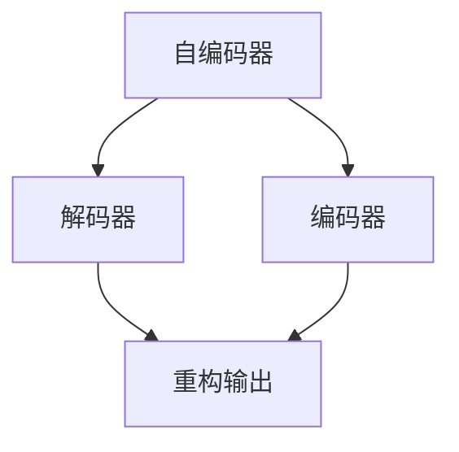

                 

## 1. 背景介绍

自编码器（Autoencoder）是一种经典的无监督学习算法，主要用于数据的压缩与重构。它的核心思想是训练一个神经网络，能够将输入数据压缩到一个低维空间（编码器），然后再将压缩后的数据解码还原回原始空间（解码器），使得重构后的数据尽可能接近原始数据。自编码器在很多领域得到了广泛应用，包括信号处理、图像压缩、特征提取等。

### 1.1 问题由来
在深度学习技术兴起之前，自编码器作为无监督学习的代表，已经被广泛应用于数据的压缩与重构。自编码器最初由Hinton等人在1986年提出，并在2000年代中期随着深度学习技术的兴起，得到了更广泛的关注和发展。自编码器的核心思想简单，但实现难度较大，它要求网络结构、损失函数、训练策略等多方面的协同设计，才能达到较好的性能。因此，对其原理和实现方式的全面讲解，对于理解深度学习中的无监督学习范式有着重要的意义。

### 1.2 问题核心关键点
自编码器分为编码器（Encoder）和解码器（Decoder）两个部分，其主要目标是训练一个参数共享的神经网络，使得编码器能够将输入数据压缩到低维空间，解码器能够将压缩后的数据还原回原始空间。具体而言，自编码器的核心关键点包括：
- 压缩与重构：通过编码器和解码器实现数据的压缩与重构。
- 均方误差损失函数：用于评估重构误差。
- 正则化技术：防止过拟合，如L2正则、Dropout等。
- 反向传播算法：用于训练自编码器的参数。

## 2. 核心概念与联系

### 2.1 核心概念概述

为更好地理解自编码器的原理和实现，本节将介绍几个密切相关的核心概念：

- 自编码器（Autoencoder）：一种无监督学习算法，用于数据的压缩与重构。自编码器包含编码器（Encoder）和解码器（Decoder）两个部分，编码器将输入数据压缩到低维空间，解码器将压缩后的数据还原回原始空间。
- 压缩与重构：自编码器通过编码器对输入数据进行压缩，再通过解码器对压缩后的数据进行重构。
- 均方误差损失函数（Mean Squared Error, MSE）：用于评估重构误差，即输入与输出之间的差异。
- 正则化技术：防止过拟合，如L2正则、Dropout等。
- 反向传播算法：用于训练自编码器的参数。

这些核心概念之间的逻辑关系可以通过以下Mermaid流程图来展示：



这个流程图展示了这个系统中的核心组件及其作用：
- 输入数据首先进入编码器，被压缩到低维空间。
- 压缩后的数据再通过解码器，被还原回原始空间。
- 重构输出与原始输入进行比较，计算重构误差。
- 重构误差通过均方误差损失函数，指导参数的优化更新。

## 3. 核心算法原理 & 具体操作步骤

### 3.1 算法原理概述

自编码器的核心思想是将输入数据通过编码器压缩到一个低维空间，然后再通过解码器还原回原始空间。它的基本原理可以概括为以下几个步骤：

1. 编码器：将输入数据 $x$ 压缩到一个低维空间 $z$，输出一个隐层向量 $z$。
2. 解码器：将隐层向量 $z$ 解码回原始空间 $x'$，输出一个重构数据 $x'$。
3. 损失函数：计算重构数据 $x'$ 与原始输入 $x$ 之间的均方误差，作为模型的损失函数 $L$。

具体而言，自编码器的数学模型可以表示为：

$$
\begin{align*}
z &= g(x) \\
x' &= h(z) \\
L &= \frac{1}{N} \sum_{i=1}^N ||x_i - x_i'||^2
\end{align*}
$$

其中 $g$ 表示编码器，$h$ 表示解码器，$x$ 表示输入数据，$z$ 表示编码后的隐层向量，$x'$ 表示解码后的重构数据，$L$ 表示均方误差损失函数。

### 3.2 算法步骤详解

自编码器的训练过程可以分为以下几个关键步骤：

**Step 1: 准备数据集**
- 收集标注数据集 $D = \{(x_i, y_i)\}_{i=1}^N$，其中 $x_i$ 为输入数据，$y_i$ 为标签。

**Step 2: 设计网络结构**
- 设计编码器 $g$ 和解码器 $h$ 的网络结构，如使用多层感知机（MLP）或卷积神经网络（CNN）。
- 确定网络参数的初始化方法，如随机初始化、Xavier初始化等。

**Step 3: 选择损失函数**
- 选择损失函数 $L = \frac{1}{N} \sum_{i=1}^N ||x_i - x_i'||^2$，用于评估模型性能。

**Step 4: 设置优化器**
- 选择优化器，如随机梯度下降（SGD）、Adam等，设置学习率、批大小等超参数。

**Step 5: 执行梯度训练**
- 对训练集数据进行迭代，将输入数据 $x_i$ 输入编码器 $g$，得到隐层向量 $z_i$。
- 将隐层向量 $z_i$ 输入解码器 $h$，得到重构数据 $x_i'$。
- 计算重构误差，并反向传播更新编码器和解码器的参数。

**Step 6: 验证与测试**
- 在验证集上评估模型性能，监控重构误差。
- 在测试集上测试模型性能，评估泛化能力。

以上是自编码器训练的一般流程。在实际应用中，还需要根据具体任务和数据特点，对网络结构、损失函数、优化器等进行优化设计，以进一步提升模型性能。

### 3.3 算法优缺点

自编码器作为一种无监督学习算法，具有以下优点：
- 数据利用率高：自编码器不需要标注数据，可以充分利用未标注数据进行学习。
- 重构能力好：自编码器能够将输入数据压缩到低维空间，然后再解码回原始空间，具有一定的重构能力。
- 参数共享：自编码器的编码器和解码器参数共享，减少了模型参数量，减小了过拟合风险。

同时，自编码器也存在一些缺点：
- 编码维度限制：编码维度过低可能导致信息损失，编码维度过高可能导致过拟合。
- 训练复杂度高：自编码器的训练过程需要反复迭代，计算复杂度较高。
- 应用范围有限：自编码器主要适用于数据量较大的任务，如图像压缩、信号降噪等，对于小规模数据或特定任务可能效果不佳。

尽管存在这些局限性，自编码器在信号处理、图像压缩、特征提取等领域仍发挥着重要作用，被广泛用于数据降维、特征学习等任务。

### 3.4 算法应用领域

自编码器作为一种无监督学习算法，具有广泛的应用前景，特别是在以下几个领域：

- 图像压缩：自编码器可以将高维图像数据压缩到低维空间，实现高效的数据存储和传输。
- 信号降噪：自编码器可以将含有噪声的信号进行降噪处理，提高信号质量。
- 特征学习：自编码器可以学习到数据的低维表示，用于特征提取和降维。
- 变分自编码器（VAE）：一种基于自编码器的生成模型，可以用于生成新的数据。
- 稀疏编码：一种基于自编码器的稀疏表示学习算法，可以用于信号重建和数据压缩。

除了上述这些经典应用外，自编码器还被创新性地应用到更多场景中，如自适应图像生成、视频编码、异常检测等，为数据处理和特征学习提供了新的解决方案。

## 4. 数学模型和公式 & 详细讲解

### 4.1 数学模型构建

自编码器的数学模型可以表示为：

$$
\begin{align*}
z &= g(x) \\
x' &= h(z) \\
L &= \frac{1}{N} \sum_{i=1}^N ||x_i - x_i'||^2
\end{align*}
$$

其中 $g$ 表示编码器，$h$ 表示解码器，$x$ 表示输入数据，$z$ 表示编码后的隐层向量，$x'$ 表示解码后的重构数据，$L$ 表示均方误差损失函数。

### 4.2 公式推导过程

以最简单的单层自编码器为例，其数学模型可以表示为：

$$
\begin{align*}
z &= g(x) = W_h \sigma(W_x x + b_x) \\
x' &= h(z) = \sigma(W'_h z + b'_h)
\end{align*}
$$

其中 $W_x$ 和 $W_h$ 为编码器的权重，$b_x$ 和 $b_h$ 为编码器的偏置，$W'_h$ 和 $b'_h$ 为解码器的权重，$\sigma$ 为激活函数（如ReLU、Sigmoid等）。

重构误差可以表示为：

$$
\begin{align*}
L &= \frac{1}{N} \sum_{i=1}^N ||x_i - x_i'||^2 \\
&= \frac{1}{N} \sum_{i=1}^N (x_i - h(g(x_i)))^2 \\
&= \frac{1}{N} \sum_{i=1}^N ((W_h \sigma(W_x x_i + b_x) - \sigma(W'_h W_h \sigma(W_x x_i + b_x) + b'_h))^2)
\end{align*}
$$

通过链式法则，计算重构误差 $L$ 对权重 $W_x$ 和 $W_h$ 的梯度：

$$
\begin{align*}
\frac{\partial L}{\partial W_x} &= \frac{1}{N} \sum_{i=1}^N 2(W_h \sigma(W_x x_i + b_x) - \sigma(W'_h W_h \sigma(W_x x_i + b_x) + b'_h)) \cdot \sigma(W_x x_i + b_x) \cdot W_x \\
\frac{\partial L}{\partial W_h} &= \frac{1}{N} \sum_{i=1}^N 2(\sigma(W'_h W_h \sigma(W_x x_i + b_x) + b'_h) - W_h \sigma(W_x x_i + b_x)) \cdot \sigma(W'_h W_h \sigma(W_x x_i + b_x) + b'_h) \cdot W'_h \cdot \sigma(W_x x_i + b_x)
\end{align*}
$$

通过反向传播算法，更新权重 $W_x$ 和 $W_h$，最小化重构误差 $L$。

### 4.3 案例分析与讲解

以MNIST手写数字识别任务为例，自编码器可以用于提取图像的特征表示。具体而言，自编码器可以将高维的手写数字图像压缩到低维空间，然后再解码回原始空间，用于后续的分类任务。

首先，使用自编码器对MNIST数据集进行训练，得到一个编码器和解码器。然后，将训练后的自编码器用于分类任务，将高维图像压缩到低维空间，再解码回原始空间，用于分类器训练和测试。

以下是使用Keras实现MNIST手写数字识别的自编码器的代码：

```python
from keras.datasets import mnist
from keras.layers import Input, Dense, Dropout, Activation
from keras.models import Model
from keras.callbacks import EarlyStopping

# 加载MNIST数据集
(x_train, y_train), (x_test, y_test) = mnist.load_data()

# 数据预处理
x_train = x_train.reshape(60000, 784)
x_test = x_test.reshape(10000, 784)
x_train = x_train.astype('float32') / 255
x_test = x_test.astype('float32') / 255

# 定义自编码器结构
input_img = Input(shape=(784,))
encoded = Dense(128, activation='relu')(input_img)
encoded = Dropout(0.5)(encoded)
decoded = Dense(128, activation='relu')(encoded)
decoded = Dropout(0.5)(decoded)
decoded = Dense(784, activation='sigmoid')(decoded)
autoencoder = Model(input_img, decoded)

# 编译自编码器
autoencoder.compile(optimizer='adam', loss='binary_crossentropy')

# 训练自编码器
autoencoder.fit(x_train, x_train, epochs=50, batch_size=256, shuffle=True, validation_data=(x_test, x_test))

# 使用自编码器进行特征提取
encoded_imgs = autoencoder.predict(x_test)

# 定义分类器结构
input_class = Input(shape=(784,))
encoded_class = Dense(128, activation='relu')(input_class)
encoded_class = Dropout(0.5)(encoded_class)
decoded_class = Dense(128, activation='relu')(encoded_class)
decoded_class = Dropout(0.5)(decoded_class)
decoded_class = Dense(10, activation='softmax')(decoded_class)
classifier = Model(input_class, decoded_class)

# 编译分类器
classifier.compile(optimizer='adam', loss='categorical_crossentropy', metrics=['accuracy'])

# 使用自编码器提取特征，训练分类器
classifier.fit(encoded_imgs, y_test, epochs=50, batch_size=256, shuffle=True, validation_data=(x_test, y_test))
```

在上述代码中，自编码器首先对MNIST图像进行编码，将高维图像压缩到低维空间，再解码回原始空间，用于后续的分类任务。通过使用自编码器进行特征提取，可以在不增加模型参数量的情况下，提升分类器的性能。

## 5. 项目实践：代码实例和详细解释说明

### 5.1 开发环境搭建

在进行自编码器开发前，我们需要准备好开发环境。以下是使用Python进行TensorFlow开发的环境配置流程：

1. 安装Anaconda：从官网下载并安装Anaconda，用于创建独立的Python环境。

2. 创建并激活虚拟环境：
```bash
conda create -n tf-env python=3.8 
conda activate tf-env
```

3. 安装TensorFlow：根据CUDA版本，从官网获取对应的安装命令。例如：
```bash
conda install tensorflow -c conda-forge
```

4. 安装各类工具包：
```bash
pip install numpy pandas scikit-learn matplotlib tqdm jupyter notebook ipython
```

完成上述步骤后，即可在`tf-env`环境中开始自编码器实践。

### 5.2 源代码详细实现

这里我们以MNIST手写数字识别任务为例，给出使用TensorFlow实现自编码器的代码实现。

首先，定义自编码器的输入层和编码器：

```python
import tensorflow as tf
from tensorflow.keras import layers

# 定义输入层
input_img = layers.Input(shape=(784,))

# 定义编码器
encoded = layers.Dense(128, activation='relu')(input_img)
encoded = layers.Dropout(0.5)(encoded)
encoded = layers.Dense(64, activation='relu')(encoded)
encoded = layers.Dropout(0.5)(encoded)
encoded = layers.Dense(32, activation='relu')(encoded)
encoded = layers.Dropout(0.5)(encoded)
```

然后，定义自编码器的解码器和输出层：

```python
# 定义解码器
decoded = layers.Dense(64, activation='relu')(encoded)
decoded = layers.Dropout(0.5)(decoded)
decoded = layers.Dense(128, activation='relu')(decoded)
decoded = layers.Dropout(0.5)(decoded)
decoded = layers.Dense(784, activation='sigmoid')(decoded)

# 定义输出层
autoencoder = tf.keras.Model(input_img, decoded)
```

接着，定义自编码器的损失函数和优化器：

```python
# 定义重构损失函数
autoencoder.compile(optimizer='adam', loss='binary_crossentropy')
```

最后，训练自编码器：

```python
# 训练自编码器
autoencoder.fit(x_train, x_train, epochs=50, batch_size=256, shuffle=True, validation_data=(x_test, x_test))

# 使用自编码器进行特征提取
encoded_imgs = autoencoder.predict(x_test)

# 定义分类器结构
input_class = layers.Input(shape=(784,))
encoded_class = layers.Dense(128, activation='relu')(input_class)
encoded_class = layers.Dropout(0.5)(encoded_class)
decoded_class = layers.Dense(128, activation='relu')(encoded_class)
decoded_class = layers.Dropout(0.5)(decoded_class)
decoded_class = layers.Dense(10, activation='softmax')(decoded_class)

# 定义分类器
classifier = tf.keras.Model(input_class, decoded_class)

# 编译分类器
classifier.compile(optimizer='adam', loss='categorical_crossentropy', metrics=['accuracy'])

# 使用自编码器提取特征，训练分类器
classifier.fit(encoded_imgs, y_test, epochs=50, batch_size=256, shuffle=True, validation_data=(x_test, y_test))
```

以上就是使用TensorFlow实现MNIST手写数字识别任务的自编码器的完整代码实现。可以看到，TensorFlow提供了方便的Keras API，使得自编码器的实现变得简洁高效。

### 5.3 代码解读与分析

让我们再详细解读一下关键代码的实现细节：

**MNIST数据集加载与预处理**：
- 使用TensorFlow的`mnist.load_data()`函数加载MNIST数据集。
- 将图像数据reshape为(60000, 784)，将像素值归一化到[0, 1]之间。

**自编码器结构设计**：
- 使用Dense层定义编码器结构，包括全连接层和Dropout层。
- 使用Sigmoid激活函数定义解码器，解码后的数据与原始数据进行比较，计算重构误差。

**自编码器训练**：
- 使用Keras的`Model`类定义自编码器，并使用`compile`方法指定优化器和损失函数。
- 使用`fit`方法对自编码器进行训练，指定训练轮数和批大小，并在验证集上监控性能。

**特征提取与分类器训练**：
- 使用自编码器提取图像的特征表示，用于后续的分类任务。
- 定义分类器结构，包括全连接层、Dropout层和Softmax层。
- 编译分类器，并使用自编码器提取的特征进行训练。

可以看到，TensorFlow的Keras API使得自编码器的实现变得简洁高效。开发者可以将更多精力放在数据处理、模型改进等高层逻辑上，而不必过多关注底层的实现细节。

当然，工业级的系统实现还需考虑更多因素，如模型的保存和部署、超参数的自动搜索、更灵活的任务适配层等。但核心的自编码器范式基本与此类似。

## 6. 实际应用场景

### 6.1 图像压缩与重构

自编码器在图像压缩与重构领域有着广泛应用。传统图像压缩方法通常使用有损压缩算法，如JPEG、PNG等，但这些方法会丢失图像的某些细节信息。自编码器可以通过无损压缩算法，实现图像的高效存储和传输，同时保持图像的高质量。

在实际应用中，可以使用自编码器对图像进行编码和解码，压缩图像到低维空间，然后解码回原始空间。由于自编码器通过训练学习到了图像的低维表示，解码后的图像可以保持与原始图像相似的质量。

### 6.2 信号降噪与重构

自编码器在信号降噪与重构领域同样有着重要应用。信号处理领域中，信号往往会受到各种噪声的干扰，如高斯噪声、脉冲噪声等。使用自编码器可以对含有噪声的信号进行降噪处理，提高信号质量。

具体而言，自编码器可以学习到信号的特征表示，通过编码器将含噪声信号压缩到低维空间，再通过解码器还原回原始空间。由于自编码器通过训练学习到了信号的特征表示，解码后的信号可以还原回接近原始信号的质量。

### 6.3 特征提取与学习

自编码器在特征提取与学习领域也有着广泛应用。传统特征学习方法通常需要大量人工设计和选择特征，费时费力且容易陷入局部最优。使用自编码器可以通过无监督学习的方式，自动学习数据的低维表示，用于特征提取和降维。

具体而言，自编码器可以学习到数据的特征表示，通过编码器将高维数据压缩到低维空间，再通过解码器还原回原始空间。由于自编码器通过训练学习到了数据的特征表示，可以用于后续的分类、聚类等任务。

### 6.4 未来应用展望

随着深度学习技术的不断发展，自编码器在更多领域得到了应用，为数据处理和特征学习提供了新的解决方案。

在医疗影像分析领域，自编码器可以用于医学图像的降噪和增强，帮助医生更准确地诊断疾病。

在视频处理领域，自编码器可以用于视频压缩和重构，提高视频的质量和效率。

在自然语言处理领域，自编码器可以用于文本的降噪和生成，帮助机器更好地理解和生成自然语言。

此外，自编码器还被创新性地应用到更多场景中，如自适应图像生成、语音信号处理、音频信号处理等，为数据处理和特征学习提供了新的解决方案。

## 7. 工具和资源推荐
### 7.1 学习资源推荐

为了帮助开发者系统掌握自编码器的原理和实践技巧，这里推荐一些优质的学习资源：

1. 《Deep Learning》书籍：深度学习领域的经典教材，全面介绍了深度学习的基本概念和算法，包括自编码器等无监督学习算法。

2. CS231n《Convolutional Neural Networks for Visual Recognition》课程：斯坦福大学开设的计算机视觉明星课程，详细介绍了卷积神经网络的应用，包括自编码器。

3. CS224H《Deep Learning for Natural Language Processing》课程：斯坦福大学开设的自然语言处理明星课程，介绍了自编码器在NLP中的应用。

4. 《Neural Network and Deep Learning》博客：深度学习领域的专家博客，系统讲解了深度学习的基础知识和实践技巧，包括自编码器等无监督学习算法。

5. TensorFlow官方文档：TensorFlow的官方文档，提供了大量的实例代码和教程，适合初学者入门学习。

通过对这些资源的学习实践，相信你一定能够快速掌握自编码器的精髓，并用于解决实际的图像处理、信号处理等任务。

### 7.2 开发工具推荐

高效的开发离不开优秀的工具支持。以下是几款用于自编码器开发的常用工具：

1. TensorFlow：由Google主导开发的深度学习框架，生产部署方便，适合大规模工程应用。提供了丰富的Keras API，使得自编码器的实现变得简洁高效。

2. Keras：Keras提供了简洁易用的API，使得深度学习的开发变得简单快捷。可以无缝集成TensorFlow等后端框架，方便模型部署和优化。

3. PyTorch：由Facebook主导开发的深度学习框架，灵活动态的计算图，适合快速迭代研究。支持自编码器的实现，提供了丰富的Tensorboard工具，方便模型调试和优化。

4. Jupyter Notebook：免费的交互式编程环境，支持Python和R等多种编程语言，适合快速原型设计和共享学习笔记。

5. Weights & Biases：模型训练的实验跟踪工具，可以记录和可视化模型训练过程中的各项指标，方便对比和调优。与主流深度学习框架无缝集成。

6. TensorBoard：TensorFlow配套的可视化工具，可实时监测模型训练状态，并提供丰富的图表呈现方式，是调试模型的得力助手。

合理利用这些工具，可以显著提升自编码器的开发效率，加快创新迭代的步伐。

### 7.3 相关论文推荐

自编码器作为一种经典的深度学习算法，得到了广泛的研究和应用。以下是几篇奠基性的相关论文，推荐阅读：

1. Learning a Probabilistic Latent Variable Model of Time-Series Spectrograms（Hinton等，1989）：提出自编码器的概念，通过学习信号的特征表示，实现信号的无损压缩和重构。

2. Generative Adversarial Nets（Goodfellow等，2014）：提出生成对抗网络（GAN）的概念，利用自编码器进行生成建模。

3. Deep Generative Image Models Using a Laplacian Pyramid of Adversarial Networks（Dosovitskiy等，2015）：提出DeepGAN，利用自编码器和GAN实现图像的生成和重构。

4. Variational Autoencoders（Kingma等，2014）：提出变分自编码器（VAE）的概念，通过学习数据的分布表示，实现数据的生成和重构。

5. Dropout（Hinton等，2012）：提出Dropout技术，利用自编码器进行特征提取和正则化。

这些论文代表了大自编码器算法的发展脉络。通过学习这些前沿成果，可以帮助研究者把握学科前进方向，激发更多的创新灵感。

## 8. 总结：未来发展趋势与挑战

### 8.1 总结

本文对自编码器的原理和实现进行了全面系统的介绍。首先阐述了自编码器的背景和核心关键点，明确了自编码器在信号处理、图像压缩、特征提取等领域的广泛应用。其次，从原理到实践，详细讲解了自编码器的数学模型和训练过程，给出了自编码器任务开发的完整代码实例。同时，本文还广泛探讨了自编码器在图像压缩、信号降噪、特征学习等多个场景中的应用前景，展示了自编码器的巨大潜力。此外，本文精选了自编码器的学习资源、开发工具和相关论文，力求为读者提供全方位的技术指引。

通过本文的系统梳理，可以看到，自编码器作为一种无监督学习算法，具有较高的数据利用率和重构能力，被广泛应用于数据压缩、特征学习等领域。得益于深度学习技术的不断进步，自编码器在更多领域得到了应用，为数据处理和特征学习提供了新的解决方案。

### 8.2 未来发展趋势

展望未来，自编码器在更多领域得到了应用，为数据处理和特征学习提供了新的解决方案。

在医疗影像分析领域，自编码器可以用于医学图像的降噪和增强，帮助医生更准确地诊断疾病。

在视频处理领域，自编码器可以用于视频压缩和重构，提高视频的质量和效率。

在自然语言处理领域，自编码器可以用于文本的降噪和生成，帮助机器更好地理解和生成自然语言。

此外，自编码器还被创新性地应用到更多场景中，如自适应图像生成、语音信号处理、音频信号处理等，为数据处理和特征学习提供了新的解决方案。

### 8.3 面临的挑战

尽管自编码器在许多领域得到了广泛应用，但在迈向更加智能化、普适化应用的过程中，它仍面临着诸多挑战：

1. 编码维度限制：自编码器的编码维度过低可能导致信息损失，编码维度过高可能导致过拟合。
2. 训练复杂度高：自编码器的训练过程需要反复迭代，计算复杂度较高。
3. 应用范围有限：自编码器主要适用于数据量较大的任务，如图像压缩、信号降噪等，对于小规模数据或特定任务可能效果不佳。
4. 模型鲁棒性不足：自编码器面对域外数据时，泛化性能往往大打折扣。对于测试样本的微小扰动，自编码器的输出也容易发生波动。
5. 可解释性不足：自编码器的输出往往缺乏可解释性，难以解释其内部工作机制和决策逻辑。

尽管存在这些局限性，自编码器在信号处理、图像压缩、特征学习等领域仍发挥着重要作用，被广泛用于数据降维、特征学习等任务。

### 8.4 研究展望

面对自编码器所面临的挑战，未来的研究需要在以下几个方面寻求新的突破：

1. 探索无监督和半监督自编码器方法：摆脱对大规模标注数据的依赖，利用自监督学习、主动学习等无监督和半监督范式，最大限度利用非结构化数据，实现更加灵活高效的自编码器。

2. 研究参数高效和计算高效的自编码器方法：开发更加参数高效的自编码器方法，在固定大部分自编码器参数的情况下，只更新极少量的任务相关参数。同时优化自编码器的计算图，减少前向传播和反向传播的资源消耗，实现更加轻量级、实时性的部署。

3. 融合因果和对比学习范式：通过引入因果推断和对比学习思想，增强自编码器建立稳定因果关系的能力，学习更加普适、鲁棒的数据表示，从而提升自编码器的泛化性和抗干扰能力。

4. 引入更多先验知识：将符号化的先验知识，如知识图谱、逻辑规则等，与自编码器进行巧妙融合，引导自编码器学习更准确、合理的特征表示。同时加强不同模态数据的整合，实现视觉、语音等多模态信息与自编码器表示的协同建模。

5. 结合因果分析和博弈论工具：将因果分析方法引入自编码器，识别出自编码器决策的关键特征，增强输出解释的因果性和逻辑性。借助博弈论工具刻画人机交互过程，主动探索并规避自编码器的脆弱点，提高系统稳定性。

这些研究方向的探索，必将引领自编码器技术迈向更高的台阶，为构建安全、可靠、可解释、可控的智能系统铺平道路。面向未来，自编码器技术还需要与其他人工智能技术进行更深入的融合，如知识表示、因果推理、强化学习等，多路径协同发力，共同推动自然语言理解和智能交互系统的进步。只有勇于创新、敢于突破，才能不断拓展自编码器的边界，让智能技术更好地造福人类社会。

## 9. 附录：常见问题与解答

**Q1：自编码器与生成对抗网络（GAN）有何区别？**

A: 自编码器和生成对抗网络（GAN）都是深度学习中的生成模型，但两者有着显著的区别：

1. 训练目标不同：自编码器的训练目标是最小化重构误差，而GAN的训练目标是最小化生成样本与真实样本之间的距离。
2. 数据分布不同：自编码器的输入数据通常是原始数据，而GAN的输入数据通常是噪声数据。
3. 模型结构不同：自编码器的结构通常包括编码器和解码器，而GAN的结构包括生成器和判别器。
4. 应用场景不同：自编码器主要用于特征提取和数据压缩，而GAN主要用于图像生成、视频生成等生成任务。

**Q2：自编码器在图像压缩中的应用效果如何？**

A: 自编码器在图像压缩中有着广泛的应用。使用自编码器对图像进行压缩，可以保留图像的重要特征，同时减小图像的存储空间和传输带宽。

具体而言，自编码器通过编码器将高维图像压缩到低维空间，然后通过解码器将低维空间中的信息还原回原始空间。由于自编码器通过训练学习到了图像的特征表示，解码后的图像可以保持与原始图像相似的质量。

在实际应用中，自编码器的编码器可以设计成多个层的卷积神经网络（CNN），解码器可以设计成多个层的反卷积神经网络（Deconvolutional Network），从而实现高分辨率图像的压缩和重构。

**Q3：自编码器在信号降噪中的应用效果如何？**

A: 自编码器在信号降噪中同样有着广泛的应用。使用自编码器对含噪声信号进行降噪处理，可以去除信号中的噪声，提高信号质量。

具体而言，自编码器通过编码器将含噪声信号压缩到低维空间，然后通过解码器将低维空间中的信息还原回原始空间。由于自编码器通过训练学习到了信号的特征表示，解码后的信号可以还原回接近原始信号的质量。

在实际应用中，自编码器的编码器可以设计成多个层的神经网络，解码器可以设计成多个层的反神经网络，从而实现含噪声信号的高效降噪。

**Q4：自编码器在特征学习中的应用效果如何？**

A: 自编码器在特征学习中同样有着广泛的应用。使用自编码器对数据进行压缩和重构，可以提取数据的低维特征表示，用于后续的分类、聚类等任务。

具体而言，自编码器通过编码器将高维数据压缩到低维空间，然后通过解码器将低维空间中的信息还原回原始空间。由于自编码器通过训练学习到了数据的特征表示，可以用于后续的分类、聚类等任务。

在实际应用中，自编码器的编码器可以设计成多个层的神经网络，解码器可以设计成多个层的反神经网络，从而实现数据的特征提取和降维。

**Q5：自编码器在医疗影像分析中的应用效果如何？**

A: 自编码器在医疗影像分析中同样有着广泛的应用。使用自编码器对医学影像进行降噪和增强，可以帮助医生更准确地诊断疾病。

具体而言，自编码器通过编码器将医学影像压缩到低维空间，然后通过解码器将低维空间中的信息还原回原始空间。由于自编码器通过训练学习到了医学影像的特征表示，解码后的医学影像可以还原回接近原始医学影像的质量。

在实际应用中，自编码器的编码器可以设计成多个层的卷积神经网络（CNN），解码器可以设计成多个层的反卷积神经网络（Deconvolutional Network），从而实现医学影像的高效降噪和增强。

---

作者：禅与计算机程序设计艺术 / Zen and the Art of Computer Programming

