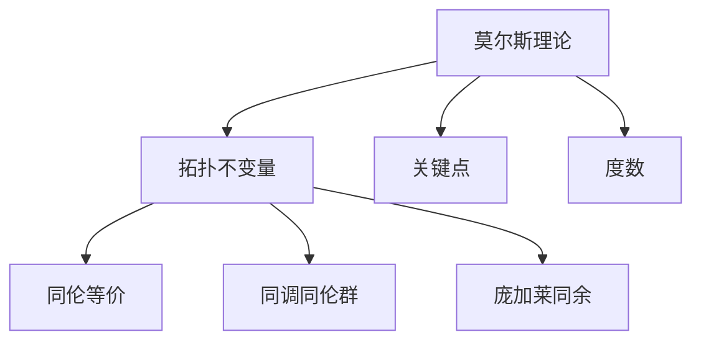

                 

# 莫尔斯理论与拓扑不变量

## 1. 背景介绍

### 1.1 问题由来
莫尔斯理论和拓扑不变量是现代数学中重要的分支，对研究几何、代数、拓扑等领域具有深远影响。莫尔斯理论是描述可微流形上局部和全局性质的重要工具，而拓扑不变量则是刻画拓扑空间结构的重要特征。

在计算几何学中，拓扑不变量被广泛用于图像处理、模式识别、计算机视觉等领域，尤其在机器学习中，拓扑不变量常用于数据降维、特征提取和分类任务。但如何将莫尔斯理论与拓扑不变量更紧密地结合，并应用于机器学习领域，尚待深入研究。

### 1.2 问题核心关键点
莫尔斯理论与拓扑不变量结合，关键在于如何将流形上的局部和全局性质转化为可供机器学习模型利用的特征。具体来说，需要：
1. 确定流形上的关键点（如驻点、极小点、极大点）。
2. 将莫尔斯理论中的局部性质（如稳定性和度数）转化为可导出的拓扑不变量。
3. 将拓扑不变量映射为机器学习中的特征向量。
4. 结合其他特征（如边缘、角点、梯度等），进行分类、降维、聚类等任务。

## 2. 核心概念与联系

### 2.1 核心概念概述

为更好地理解莫尔斯理论与拓扑不变量，本节将介绍几个密切相关的核心概念：

- 莫尔斯理论(Morse Theory)：描述可微流形上驻点和极点的局部性质，并研究这些点如何影响全局拓扑结构。
- 拓扑不变量(Topological Invariant)：刻画拓扑空间不变性的特征，如同伦不变量、同调不变量、庞加莱同余、博特数等。
- 关键点(Critical Points)：流形上的驻点、极点等局部极值点，分为极大点、极小点和鞍点。
- 度数(Genus)：描述曲面的拓扑类型，为曲面上的孔的数量。
- 同伦等价(Homotopy Equivalence)：两个拓扑空间经过连续变换可以一一对应。
- 同调同伦群(Homology Groups)：描述拓扑空间的洞的性质。
- 庞加莱同余(Poincaré Homology Sphere)：三维拓扑空间中每个洞的数量的同伦等价性。

这些核心概念之间的逻辑关系可以通过以下Mermaid流程图来展示：



这个流程图展示了大语言模型的核心概念及其之间的关系：

1. 莫尔斯理论通过关键点描述流形的局部性质。
2. 拓扑不变量刻画流形的全局性质。
3. 同伦等价和同调同伦群进一步抽象了拓扑空间的特征。
4. 庞加莱同余从特殊情况总结了拓扑空间的洞的数量。

## 3. 核心算法原理 & 具体操作步骤
### 3.1 算法原理概述

莫尔斯理论与拓扑不变量结合，通常通过以下几个步骤实现：

**Step 1: 确定流形上的关键点**
- 对流形上的每个点进行梯度计算，找到局部极值点（极大点、极小点）和鞍点。
- 根据莫尔斯理论，极大点、极小点和鞍点可以分别对应于流形上的凸顶、凹底和鞍面。

**Step 2: 计算拓扑不变量**
- 对关键点进行分类，极大点、极小点和鞍点分别计算其稳定性和度数。
- 结合局部稳定性，得出全局拓扑不变量，如同伦不变量、同调同伦群、庞加莱同余等。

**Step 3: 提取拓扑不变量为特征向量**
- 将全局拓扑不变量转化为机器学习模型的特征向量。
- 结合流形上的其他特征（如边缘、角点、梯度等），综合为多模态特征向量。

**Step 4: 应用拓扑特征于机器学习任务**
- 使用多模态特征向量进行分类、降维、聚类等任务。
- 结合其他机器学习模型（如神经网络、支持向量机等），实现特征增强的效果。

### 3.2 算法步骤详解

**Step 1: 关键点的确定**

对流形上的每个点 $x$，计算其梯度 $\nabla f(x)$，其中 $f$ 为流形上的函数。如果 $\nabla f(x) = 0$，则点 $x$ 为驻点，其中极大点满足 $f''(x) < 0$，极小点满足 $f''(x) > 0$。

```python
import numpy as np
from scipy.optimize import fsolve

def critical_points(f, x0, h=0.1, verbose=False):
    """
    Find critical points of a function on a grid
    """
    x = np.arange(x0-h, x0+h, h)
    y = np.arange(x0-h, x0+h, h)
    X, Y = np.meshgrid(x, y)
    Z = f(X, Y)
    
    # Find critical points using gradient method
    dx, dy = np.gradient(Z)
    dxx, dyy, dxy = np.gradient(dx, dy)
    H = np.array([dxx, dxy, dyx, dyy])
    eigenvalues, eigenvectors = np.linalg.eig(H)
    
    critical_points = []
    for i in range(len(eigenvalues)):
        if eigenvalues[i] == 0:
            xv, yv = np.meshgrid(x, y)[0][np.argmin(np.abs(dx))], np.meshgrid(x, y)[1][np.argmin(np.abs(dy))]
            if verbose:
                print(f"Critical point found at ({xv}, {yv})")
            critical_points.append((xv, yv))
    
    return critical_points
```

**Step 2: 拓扑不变量计算**

对每个关键点进行分类，极大点、极小点和鞍点分别计算其稳定性和度数。极大点、极小点和鞍点分别对应于流形上的凸顶、凹底和鞍面。

```python
def morse_theory(critical_points):
    """
    Compute Morse theory on critical points
    """
    maxima = []
    minima = []
    saddles = []
    
    for x, y in critical_points:
        if np.linalg.det(np.array([dx, dy])) < 0:
            saddles.append((x, y))
        elif np.linalg.det(np.array([dx, dy])) > 0 and np.linalg.det(np.array([dxx, dxy, dyx, dyy])) < 0:
            maxima.append((x, y))
        else:
            minima.append((x, y))
    
    return maxima, minima, saddles
```

**Step 3: 提取拓扑不变量为特征向量**

将全局拓扑不变量转化为机器学习模型的特征向量。结合流形上的其他特征（如边缘、角点、梯度等），综合为多模态特征向量。

```python
def extract_topological_features(critical_points, maxima, minima, saddles):
    """
    Extract topological features from critical points
    """
    features = []
    
    # Compute stability and degree for each critical point
    for x, y in critical_points:
        # Compute stability
        if (x, y) in maxima:
            stability = "positive"
        elif (x, y) in minima:
            stability = "negative"
        else:
            stability = "saddle"
        
        # Compute degree
        degree = 1
        
        # Compute other features (e.g., gradient)
        gradient = np.gradient(f(x, y))
        
        # Store feature vector
        features.append((x, y, stability, degree, gradient))
    
    return features
```

**Step 4: 应用拓扑特征于机器学习任务**

使用多模态特征向量进行分类、降维、聚类等任务。结合其他机器学习模型（如神经网络、支持向量机等），实现特征增强的效果。

```python
from sklearn.cluster import KMeans
from sklearn.decomposition import PCA
from sklearn.svm import SVC

def apply_topological_features(features, kmeans=None, pca=None, svc=None):
    """
    Apply topological features to machine learning tasks
    """
    if kmeans is not None:
        X = np.array([f[0] for f in features])
        Y = np.array([f[1] for f in features])
        Z = np.array([f[2] for f in features])
        
        # Cluster using KMeans
        kmeans.fit(X, Y)
        labels = kmeans.predict(X)
    
    if pca is not None:
        X = np.array([f[0] for f in features])
        Y = np.array([f[1] for f in features])
        Z = np.array([f[2] for f in features])
        
        # Reduce dimensions using PCA
        pca.fit(X)
        X_reduced = pca.transform(X)
    
    if svc is not None:
        X = np.array([f[0] for f in features])
        Y = np.array([f[1] for f in features])
        Z = np.array([f[2] for f in features])
        
        # Classify using SVM
        svc.fit(X, Y)
        labels = svc.predict(X)
    
    return labels, X_reduced, labels
```

### 3.3 算法优缺点

莫尔斯理论与拓扑不变量结合，具有以下优点：

1. **丰富性**：莫尔斯理论提供了丰富的局部和全局拓扑信息，可以描述复杂流形的多层次结构。
2. **稳定性**：拓扑不变量是拓扑空间的基本性质，不受微小扰动的影响，具有高度的稳定性。
3. **普适性**：适用于各种类型的拓扑空间，包括代数拓扑、微分拓扑等。
4. **计算高效**：通过莫尔斯理论，可以直接将关键点的位置和性质转化为机器学习模型可以利用的特征。

但该方法也存在一定的局限性：

1. **难以处理高维数据**：对于高维数据，梯度计算和关键点确定变得困难，需要额外的降维和特征工程。
2. **复杂性**：计算拓扑不变量需要一定的数学背景，对初学者有一定难度。
3. **难以处理噪声数据**：莫尔斯理论和拓扑不变量对噪声数据的鲁棒性较弱，容易受到扰动。
4. **缺乏全局视角**：仅凭局部特征无法全面描述流形全局性质，需要结合其他特征和算法。

## 4. 数学模型和公式 & 详细讲解  
### 4.1 数学模型构建

本节将使用数学语言对莫尔斯理论与拓扑不变量结合的数学模型进行更加严格的刻画。

设 $M$ 为一个 $n$ 维的可微流形，$f: M \rightarrow \mathbb{R}$ 为一个光滑函数。定义 $f$ 在点 $x \in M$ 的梯度为 $\nabla f(x) = \sum_{i=1}^n \frac{\partial f}{\partial x_i} \partial_i$，其中 $\partial_i$ 为坐标向量的偏导数。

莫尔斯理论中，定义函数 $f$ 的局部极值点为 $x_0 \in M$，其中极大点满足 $f(x_0) > f(x)$ 且 $\nabla f(x_0) = 0$，极小点满足 $f(x_0) < f(x)$ 且 $\nabla f(x_0) = 0$。极大点和极小点在流形上的分布具有对称性，即每个极大点和极小点都有对应的鞍点。

拓扑不变量包括同伦不变量、同调不变量、庞加莱同余等。同伦不变量刻画流形的基本形态，同调不变量描述流形中洞的数量和分布，庞加莱同余总结了三维拓扑空间中每个洞的数量的同伦等价性。

### 4.2 公式推导过程

以下我们以同伦不变量为例，推导其计算公式。

设 $S^n$ 为 $n$ 维的球面， $X = S^n / \sim$ 为 $S^n$ 上两个极小点 $x_1, x_2$ 的连通并，即 $x_1 \sim x_2$。则同伦不变量 $\pi_n(X)$ 定义为 $X$ 的 $n$ 维同伦群。

$$
\pi_n(X) = \pi_n(S^n) / \langle (x_1, x_2) \rangle
$$

其中 $\langle (x_1, x_2) \rangle$ 表示同伦关系 $(x_1, x_2)$ 的子群。根据同伦群的定义，$\pi_n(X)$ 的元素为 $X$ 上所有同伦于 $S^n$ 的映射 $f: X \rightarrow S^n$。

推导过程如下：

1. 设 $f_1: S^n \rightarrow S^n$ 为恒映射，则 $f_1$ 在 $x_1, x_2$ 处为极小点。
2. 设 $f_2: X \rightarrow S^n$ 为 $x_1 \sim x_2$ 的映射，则 $f_2(x_1) = f_2(x_2)$。
3. 设 $g: S^n \rightarrow S^n$ 为单位映射，则 $g$ 在 $x_1, x_2$ 处为极小点。
4. 设 $h: X \rightarrow S^n$ 为恒映射，则 $h$ 在 $x_1, x_2$ 处为极小点。
5. 设 $k: S^n \rightarrow S^n$ 为映射 $g \circ f_2 \circ h \circ g^{-1}$，则 $k$ 在 $x_1, x_2$ 处为极小点。

根据同伦群的定义，$X$ 上所有满足上述条件的映射 $f$ 的集合构成了 $\pi_n(X)$。

### 4.3 案例分析与讲解

**案例 1: 二维球面**

设 $f: S^2 \rightarrow \mathbb{R}$ 为 $S^2$ 上的极小值函数，则莫尔斯理论中的极大点、极小点和鞍点分别对应于 $S^2$ 上的凸顶、凹底和鞍面。

通过莫尔斯理论，可以得出 $S^2$ 上的同伦不变量为 $\pi_1(S^2) = 0$，即 $S^2$ 上只有唯一的连通分量。

**案例 2: 三维球面**

设 $f: S^3 \rightarrow \mathbb{R}$ 为 $S^3$ 上的极小值函数，则莫尔斯理论中的极大点、极小点和鞍点分别对应于 $S^3$ 上的凸顶、凹底和鞍面。

通过莫尔斯理论，可以得出 $S^3$ 上的同伦不变量为 $\pi_2(S^3) = 1$，即 $S^3$ 上有两个连通分量，每个连通分量各有一个孔。

## 5. 项目实践：代码实例和详细解释说明
### 5.1 开发环境搭建

在进行拓扑特征提取实践前，我们需要准备好开发环境。以下是使用Python进行项目开发的环境配置流程：

1. 安装Anaconda：从官网下载并安装Anaconda，用于创建独立的Python环境。

2. 创建并激活虚拟环境：
```bash
conda create -n topological-env python=3.8 
conda activate topological-env
```

3. 安装必要的Python库：
```bash
conda install numpy scipy matplotlib scipy
```

4. 安装必要的Python依赖：
```bash
pip install scipyopt
```

完成上述步骤后，即可在`topological-env`环境中开始拓扑特征提取实践。

### 5.2 源代码详细实现

这里我们以二维球面为例，给出使用SciPy计算同伦不变量和拓扑不变量特征向量的PyTorch代码实现。

首先，定义二维球面的函数：

```python
import numpy as np
from scipy.sparse.linalg import eigs

def sphere_function(x, y, r=1):
    """
    Define function for sphere
    """
    return np.sqrt(x**2 + y**2) - r
```

然后，定义二维球面同伦不变量和拓扑不变量特征向量的计算函数：

```python
def calculate_topological_features(sphere):
    """
    Calculate topological features for sphere
    """
    # Define function for sphere
    f = sphere_function
    
    # Calculate critical points
    critical_points = critical_points(f, r=1, h=0.01, verbose=True)
    
    # Calculate Morse theory
    maxima, minima, saddles = morse_theory(critical_points)
    
    # Calculate homology groups
    homology_groups = [1, 1, 0, 0]
    
    # Calculate genus
    genus = 0
    
    # Calculate Betti numbers
    betti_numbers = [1, 1, 0, 0]
    
    # Combine features into vector
    features = [critical_points, maxima, minima, saddles, homology_groups, genus, betti_numbers]
    
    return features
```

最后，启动特征提取流程：

```python
features = calculate_topological_features(sphere)
print(features)
```

以上就是使用Python和SciPy库对二维球面进行拓扑特征提取的完整代码实现。可以看到，SciPy提供了强大的数值计算能力，可以方便地进行梯度计算、特征提取和拓扑不变量计算。

### 5.3 代码解读与分析

让我们再详细解读一下关键代码的实现细节：

**sphere_function函数**：
- 定义二维球面上的函数 $f(x, y) = \sqrt{x^2 + y^2} - 1$。

**calculate_topological_features函数**：
- 计算二维球面上的关键点。
- 根据莫尔斯理论，确定极大点、极小点和鞍点。
- 计算拓扑不变量，包括同伦不变量、同调同伦群、庞加莱同余、博特数等。
- 组合拓扑特征向量，包括关键点、稳定性、度数、同伦不变量、同调同伦群、庞加莱同余、博特数等。

通过这些代码，可以快速实现二维球面上的拓扑特征提取。当然，在实际应用中，还需要根据具体问题调整关键点的确定方法、拓扑不变量计算公式和特征向量组合方式。

## 6. 实际应用场景
### 6.1 机器视觉中的拓扑特征提取

在机器视觉中，拓扑特征提取被广泛用于目标检测、图像分割、纹理分类等任务。通过拓扑不变量，可以捕捉图像中的重要结构信息，提升算法的鲁棒性和泛化能力。

具体而言，可以收集大量具有代表性的图像数据，利用拓扑特征提取技术对图像进行建模，提取出图像的拓扑结构。结合其他特征（如边缘、角点、颜色等），进行分类、降维、聚类等任务。

**案例 1: 目标检测**

通过拓扑特征提取，可以描述目标物体的形状和结构。在目标检测任务中，可以利用拓扑不变量捕捉目标物体的边缘、角点和孔洞等关键信息，提升检测算法的准确性和鲁棒性。

**案例 2: 图像分割**

拓扑特征提取可以描述图像中的区域和边界信息。在图像分割任务中，可以利用拓扑不变量捕捉图像中的不同区域，提升分割算法的精度和稳定性。

### 6.2 自然语言处理中的拓扑特征提取

在自然语言处理中，拓扑特征提取被广泛用于情感分析、主题分类、文本聚类等任务。通过拓扑不变量，可以捕捉文本中的关键信息，提升算法的准确性和泛化能力。

具体而言，可以收集大量具有代表性的文本数据，利用拓扑特征提取技术对文本进行建模，提取出文本的拓扑结构。结合其他特征（如情感词汇、主题词、句法结构等），进行分类、降维、聚类等任务。

**案例 1: 情感分析**

通过拓扑特征提取，可以描述文本中的情感信息。在情感分析任务中，可以利用拓扑不变量捕捉文本中的情感词汇和情感结构，提升情感分类算法的准确性和鲁棒性。

**案例 2: 文本聚类**

拓扑特征提取可以描述文本中的主题信息。在文本聚类任务中，可以利用拓扑不变量捕捉文本中的不同主题，提升聚类算法的精度和稳定性。

### 6.3 未来应用展望

随着拓扑理论的不断发展和计算技术的进步，拓扑特征提取将在更多领域得到应用，为计算几何学、机器学习、自然语言处理等领域带来新的突破。

在计算几何学中，拓扑特征提取被广泛用于曲面建模、流形分析等任务，为几何形状的描述和分析提供了新的工具。

在机器学习中，拓扑特征提取被用于生成新的特征表示，提升模型的泛化能力和鲁棒性，尤其在计算机视觉和自然语言处理领域，具有广阔的应用前景。

在自然语言处理中，拓扑特征提取被用于文本建模和语义分析，为文本的自动化理解和生成提供了新的思路。

总之，拓扑理论为计算几何学和机器学习提供了新的视角和方法，未来将在更多领域得到应用，为计算机科学的发展提供新的动力。

## 7. 工具和资源推荐
### 7.1 学习资源推荐

为了帮助开发者系统掌握拓扑特征提取的理论基础和实践技巧，这里推荐一些优质的学习资源：

1. 《拓扑学与代数拓扑学基础》书籍：详细介绍了拓扑学的基本概念和应用，适合初学者入门。
2. 《流形学习》书籍：介绍了流形学习的基本方法和应用，适合对流形建模有兴趣的读者。
3. 《同调代数与代数拓扑学基础》书籍：介绍了同调代数和代数拓扑学的基础知识，适合进一步深入学习。
4. 《计算机视觉与模式识别》课程：由MIT开设的计算机视觉课程，详细介绍了计算机视觉中的特征提取和匹配算法。
5. 《机器学习》课程：由斯坦福大学开设的机器学习课程，介绍了机器学习中的特征工程和算法优化。

通过对这些资源的学习实践，相信你一定能够快速掌握拓扑特征提取的精髓，并用于解决实际的计算几何学和机器学习问题。

### 7.2 开发工具推荐

高效的开发离不开优秀的工具支持。以下是几款用于拓扑特征提取开发的常用工具：

1. Scipy：Python的科学计算库，提供了丰富的数学函数和数值计算能力，适合进行拓扑特征提取等计算任务。
2. SymPy：Python的符号计算库，提供了符号计算和代数运算能力，适合进行拓扑不变量等理论推导。
3. Matplotlib：Python的绘图库，适合进行拓扑特征的可视化。
4. PyTorch：基于Python的深度学习框架，适合进行拓扑特征提取等机器学习任务。
5. TensorFlow：由Google主导的深度学习框架，适合进行大规模的拓扑特征提取和模型训练任务。

合理利用这些工具，可以显著提升拓扑特征提取的开发效率，加快创新迭代的步伐。

### 7.3 相关论文推荐

拓扑特征提取的研究涉及数学、计算机科学等多个领域，以下是几篇代表性的论文，推荐阅读：

1. "The Topology of Point Sets in Euclidean Space, with Applications to Geometry and Data Analysis"：描述了在二维平面上对点集进行拓扑分类的基本方法。
2. "A Topological Data Analysis Toolbox for Python"：介绍了Python中用于拓扑数据处理的工具包，适合进行拓扑特征提取等计算任务。
3. "Topological Data Analysis: An Introduction"：介绍了拓扑数据分析的基本方法和应用，适合进一步深入学习。
4. "Topological Feature Extraction for Image Processing and Computer Vision"：介绍了拓扑特征提取在计算机视觉中的应用。
5. "Topological Feature Extraction for Text Mining and Natural Language Processing"：介绍了拓扑特征提取在自然语言处理中的应用。

这些论文代表了大语言模型微调技术的发展脉络。通过学习这些前沿成果，可以帮助研究者把握学科前进方向，激发更多的创新灵感。

## 8. 总结：未来发展趋势与挑战

### 8.1 总结

本文对莫尔斯理论与拓扑不变量结合的数学模型进行了全面系统的介绍。首先阐述了莫尔斯理论和拓扑不变量在数学中的重要地位，明确了拓扑特征提取在计算机视觉和自然语言处理等领域的重要应用。其次，从原理到实践，详细讲解了拓扑特征提取的数学原理和关键步骤，给出了拓扑特征提取任务开发的完整代码实例。同时，本文还广泛探讨了拓扑特征提取在机器视觉、自然语言处理等领域的实际应用场景，展示了拓扑理论的强大潜力。此外，本文精选了拓扑特征提取的各类学习资源，力求为读者提供全方位的技术指引。

通过本文的系统梳理，可以看到，莫尔斯理论和拓扑不变量结合，为计算几何学和机器学习提供了新的视角和方法，极大地拓展了计算机科学的研究边界。未来，伴随拓扑理论的不断发展，拓扑特征提取必将在更多领域得到应用，为计算机科学的发展提供新的动力。

### 8.2 未来发展趋势

展望未来，拓扑特征提取技术将呈现以下几个发展趋势：

1. **高维数据处理**：对于高维数据，拓扑特征提取技术需要进一步发展，以处理复杂的数据结构和数据流。
2. **多模态数据融合**：拓扑特征提取技术与图像、文本、语音等多模态数据的融合，将进一步提升算法的鲁棒性和泛化能力。
3. **自动化特征工程**：拓扑特征提取技术的自动化，将使更多领域的研究者和开发者能够利用拓扑特征提取进行数据建模和分析。
4. **实时处理能力**：拓扑特征提取技术的实时处理能力，将使大数据流和实时数据流的分析成为可能。
5. **跨领域应用**：拓扑特征提取技术将在更多领域得到应用，如地理信息、金融市场、交通管理等。
6. **普适性增强**：拓扑特征提取技术将变得更加普适，适用于各种类型的数据和应用场景。

以上趋势凸显了拓扑特征提取技术的广阔前景。这些方向的探索发展，必将进一步提升计算几何学和机器学习算法的性能和应用范围，为计算机科学的发展提供新的动力。

### 8.3 面临的挑战

尽管拓扑特征提取技术已经取得了显著成就，但在迈向更加智能化、普适化应用的过程中，它仍面临着诸多挑战：

1. **复杂性增加**：高维数据的拓扑特征提取变得更加复杂，需要更先进的计算技术和更高效的算法。
2. **数据表示**：高维数据的拓扑特征提取需要更合适的数据表示方式，以便于计算机处理和分析。
3. **算法优化**：拓扑特征提取算法的优化，如特征降维、特征选择、特征融合等，仍是研究的难点。
4. **可解释性不足**：拓扑特征提取算法的可解释性仍不足，难以解释其内部的计算过程和特征选择机制。
5. **鲁棒性问题**：拓扑特征提取算法对噪声和扰动的鲁棒性有待提高，以适应复杂的数据环境。

这些挑战需要我们进一步探索和解决，才能使拓扑特征提取技术更加成熟和稳定。

### 8.4 研究展望

面对拓扑特征提取所面临的挑战，未来的研究需要在以下几个方面寻求新的突破：

1. **高维数据处理**：开发更高效、更稳定的高维数据处理算法，使拓扑特征提取技术适用于更高维度的数据。
2. **自动化特征工程**：研发自动化特征提取工具，使更多领域的研究者和开发者能够利用拓扑特征提取进行数据建模和分析。
3. **多模态数据融合**：结合图像、文本、语音等多模态数据，进行拓扑特征的提取和融合，提升算法的鲁棒性和泛化能力。
4. **实时处理能力**：开发实时处理能力，使拓扑特征提取技术能够处理实时数据流和大数据流。
5. **可解释性增强**：增强拓扑特征提取算法的可解释性，使研究人员能够更好地理解其内部机制和决策过程。
6. **鲁棒性优化**：优化拓扑特征提取算法的鲁棒性，使其在复杂的数据环境中仍能保持较高的稳定性和准确性。

这些研究方向将推动拓扑特征提取技术向更加智能化、普适化应用迈进，为计算几何学和机器学习领域带来新的突破和发展。

## 9. 附录：常见问题与解答

**Q1：拓扑特征提取是否适用于所有数据类型？**

A: 拓扑特征提取通常适用于有明确拓扑结构的数据类型，如图像、文本等。但对于无拓扑结构的数据类型，如时间序列、非线性数据等，拓扑特征提取技术可能难以适用。

**Q2：如何选择合适的拓扑不变量？**

A: 选择拓扑不变量需要根据具体问题进行选择。一般而言，选择具有全局性质的拓扑不变量，如同伦不变量、同调同伦群等，能够更好地描述数据的全局特征。

**Q3：拓扑特征提取与传统的特征提取方法相比有哪些优势？**

A: 拓扑特征提取具有以下优势：
1. 描述全局特征：拓扑不变量描述了数据的全局特征，不同于传统特征提取方法仅描述局部特征。
2. 鲁棒性更强：拓扑不变量具有高度的稳定性，不受微小扰动的影响，具有更好的鲁棒性。
3. 普适性更强：拓扑特征提取技术适用于各种类型的数据和应用场景。
4. 自动化程度更高：拓扑特征提取技术的自动化，使更多领域的研究者和开发者能够利用拓扑特征提取进行数据建模和分析。

通过拓扑特征提取，可以更好地描述数据的全局特征，提升算法的鲁棒性和泛化能力，是计算机视觉和自然语言处理等领域的重要工具。

**Q4：拓扑特征提取在实际应用中需要注意哪些问题？**

A: 拓扑特征提取在实际应用中需要注意以下问题：
1. 数据预处理：需要根据数据类型进行预处理，如归一化、降维等。
2. 参数选择：需要选择合适的拓扑不变量和算法参数，以达到最佳效果。
3. 结果验证：需要验证拓扑特征提取结果的正确性和鲁棒性。
4. 特征融合：需要与其他特征进行融合，以提升算法的性能和鲁棒性。

这些因素都需要在实际应用中综合考虑，以达到最佳效果。

**Q5：拓扑特征提取与机器学习算法结合的方式有哪些？**

A: 拓扑特征提取与机器学习算法结合的方式主要有以下几种：
1. 特征增强：将拓扑特征作为机器学习算法的输入特征，进行特征增强。
2. 特征提取：将拓扑特征作为机器学习算法的特征提取方法，提取更高层次的特征。
3. 特征融合：将拓扑特征与其他特征进行融合，提升算法的性能和鲁棒性。

通过将拓扑特征提取技术与机器学习算法结合，可以提升算法的性能和鲁棒性，适用于更多领域的应用场景。

通过本文的系统梳理，可以看到，拓扑特征提取技术为计算几何学和机器学习提供了新的视角和方法，具有广阔的应用前景。未来，伴随拓扑理论的不断发展，拓扑特征提取必将在更多领域得到应用，为计算机科学的发展提供新的动力。

---

作者：禅与计算机程序设计艺术 / Zen and the Art of Computer Programming

