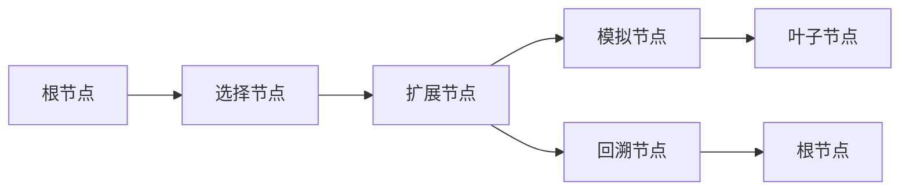

                 

## 1. 背景介绍

蒙特卡洛树搜索（Monte Carlo Tree Search, MCTS）是一种用于解决不确定性决策问题的算法框架，主要用于博弈论和人工智能中的搜索与决策问题。它通过模拟随机游走的过程，模拟最优决策策略，并在搜索树中不断探索和利用已有的知识，以求得最优决策。MCTS的算法流程包括选择、扩展、模拟和回溯四个步骤，这四个步骤循环进行，直至找到最优解或达到预设终止条件。

蒙特卡洛树搜索与传统的搜索算法如Alpha-Beta剪枝相比，具有在复杂环境中高效探索的能力。Alpha-Beta剪枝主要是通过剪枝减少搜索空间，而MCTS通过随机模拟来逼近最优决策，不需要搜索到叶节点就可以得到较好的决策。此外，MCTS可以处理更为复杂的决策环境，并且可以通过并行计算来加速搜索过程。

### 1.1 问题由来
在博弈论中，为了找到最优的决策策略，传统的搜索算法如Alpha-Beta剪枝和Minimax算法等通常需要进行大量的搜索，特别是在树形搜索空间巨大时。而在实际应用中，博弈树的深度往往非常深，搜索空间巨大，需要大量的计算资源和时间，这使得Alpha-Beta剪枝等算法在实际应用中变得不太可行。

蒙特卡洛树搜索的出现改变了这一现状，它通过随机模拟来解决决策问题，减少了搜索空间，使得在复杂环境中也能高效地搜索最优决策。蒙特卡洛树搜索不仅被广泛应用于游戏AI，还被用于机器人路径规划、图像识别、医疗诊断等众多领域。

### 1.2 问题核心关键点
蒙特卡洛树搜索的核心在于通过随机模拟来逼近最优决策，并在搜索树中不断探索和利用已有的知识。具体来说，MCTS包含以下几个关键点：
1. 选择：通过UCB公式选择当前节点进行扩展。
2. 扩展：生成一个子节点，并在子树中进行模拟。
3. 模拟：从当前节点进行随机模拟，直到到达叶子节点或达到预设终止条件。
4. 回溯：将模拟结果回溯到根节点，更新节点的价值和统计信息。

这些步骤在MCTS的执行过程中循环进行，直到找到最优解或达到预设的终止条件。

### 1.3 问题研究意义
蒙特卡洛树搜索是人工智能领域的一项重要技术，它提供了一种高效的决策搜索方法。通过随机模拟和搜索树的知识积累，MCTS能够在不确定环境中寻找最优决策，从而在实际应用中具有很高的实用价值。

此外，MCTS不仅可以用于静态决策问题，还可以用于动态决策问题，如博弈论、路径规划等。其高效的探索和利用能力，使得在复杂环境中寻找最优解成为可能。

## 2. 核心概念与联系

### 2.1 核心概念概述

蒙特卡洛树搜索包含以下几个核心概念：

1. **搜索树**：用于表示决策过程中的搜索路径，每个节点表示一个状态，每个边表示一个决策。

2. **扩展节点**：从选择节点中选择一个未被访问的子节点进行扩展，生成新的子节点。

3. **模拟**：在当前节点进行随机模拟，模拟从当前节点开始的一条路径，直到到达叶子节点或达到预设终止条件。

4. **回溯**：将模拟结果回溯到根节点，更新节点的价值和统计信息。

这些概念通过UCB公式（选择策略）和价值迭代（模拟回溯）的循环迭代，实现高效的搜索和决策。

### 2.2 核心概念原理和架构的 Mermaid 流程图



这个流程图展示了MCTS的基本流程：从根节点开始，选择节点，扩展节点，模拟节点，直到叶子节点，然后将结果回溯到根节点。

## 3. 核心算法原理 & 具体操作步骤

### 3.1 算法原理概述

蒙特卡洛树搜索的原理是基于随机模拟和搜索树的知识积累。具体来说，MCTS通过以下四个步骤不断迭代，逼近最优决策：

1. 选择（Selection）：通过UCB公式选择当前节点进行扩展。
2. 扩展（Expansion）：生成一个子节点，并在子树中进行模拟。
3. 模拟（Simulation）：从当前节点进行随机模拟，直到到达叶子节点或达到预设终止条件。
4. 回溯（Backpropagation）：将模拟结果回溯到根节点，更新节点的价值和统计信息。

### 3.2 算法步骤详解

#### 3.2.1 选择（Selection）
选择步骤使用UCB公式（UCB公式是一个平衡探索和利用的公式）来选择当前节点进行扩展。UCB公式为：

$$
\text{UCB} = \frac{Q(n)}{N(n)} + \sqrt{\frac{2 \ln k}{N(n)}}
$$

其中，$Q(n)$ 是节点$n$的价值，$N(n)$ 是节点$n$被访问的次数，$k$ 是当前迭代次数。

通过UCB公式，可以使得节点$n$的访问次数越多，其选择概率越小；同时，节点$n$的价值越高，其选择概率越大。因此，UCB公式能够平衡探索和利用的关系，使得搜索过程更加高效。

#### 3.2.2 扩展（Expansion）
扩展步骤是在当前节点上生成一个未被访问的子节点。扩展操作通常包括生成一个新节点，并将其添加到搜索树中。扩展操作的目的是为了扩展搜索树的深度，增加搜索的覆盖范围。

#### 3.2.3 模拟（Simulation）
模拟步骤是在当前节点上进行随机模拟，模拟从当前节点开始的一条路径，直到到达叶子节点或达到预设终止条件。模拟过程通常使用随机策略（如随机选择动作）来模拟当前节点的下一步决策，直到到达叶子节点或达到预设终止条件。模拟的结果是叶子节点的奖励值。

#### 3.2.4 回溯（Backpropagation）
回溯步骤是将模拟结果回溯到根节点，更新节点的价值和统计信息。回溯过程通常包括更新节点$n$的价值$Q(n)$和访问次数$N(n)$。节点的价值$Q(n)$可以更新为该节点所有子节点的模拟结果的平均值，访问次数$N(n)$可以更新为该节点所有子节点的访问次数之和。

### 3.3 算法优缺点

#### 3.3.1 优点

1. **高效探索**：通过随机模拟和搜索树的知识积累，MCTS能够在复杂环境中高效地探索最优决策。
2. **动态适应**：MCTS能够适应动态环境，不断更新节点的价值和统计信息，以应对环境变化。
3. **并行计算**：MCTS可以通过并行计算来加速搜索过程，适用于大规模计算环境。

#### 3.3.2 缺点

1. **资源消耗**：MCTS需要大量的计算资源和时间，特别是在搜索树较大时。
2. **计算复杂度**：MCTS的计算复杂度较高，特别是在搜索树较深时，计算时间较长。
3. **随机性**：MCTS的模拟过程具有随机性，可能会影响搜索结果的准确性。

### 3.4 算法应用领域

蒙特卡洛树搜索广泛应用于游戏AI、路径规划、图像识别、医疗诊断等领域。以下是一些典型的应用场景：

1. **游戏AI**：在围棋、象棋、星际争霸等游戏中，MCTS能够通过随机模拟和搜索树的知识积累，找到最优的策略，从而在实际游戏中取得胜利。
2. **路径规划**：在机器人路径规划中，MCTS能够通过随机模拟和搜索树的知识积累，找到最短的路径，从而优化机器人的行动。
3. **图像识别**：在图像识别中，MCTS能够通过随机模拟和搜索树的知识积累，找到最佳的特征提取和分类策略，从而提高图像识别的准确性。
4. **医疗诊断**：在医疗诊断中，MCTS能够通过随机模拟和搜索树的知识积累，找到最佳的治疗方案，从而提高诊断的准确性和效率。

## 4. 数学模型和公式 & 详细讲解

### 4.1 数学模型构建

蒙特卡洛树搜索的数学模型主要包括以下几个部分：

1. **搜索树**：用于表示决策过程中的搜索路径，每个节点表示一个状态，每个边表示一个决策。

2. **节点价值**：节点的价值$Q(n)$表示从该节点开始的一条路径的总奖励值。

3. **节点访问次数**：节点的访问次数$N(n)$表示该节点被访问的次数。

4. **节点扩展次数**：节点的扩展次数$K(n)$表示该节点被扩展的次数。

### 4.2 公式推导过程

#### 4.2.1 节点价值更新公式
节点的价值$Q(n)$可以通过节点的模拟结果来更新。具体来说，节点的价值更新公式为：

$$
Q(n) = \frac{1}{K(n)} \sum_{k=1}^{K(n)} C_k
$$

其中，$C_k$是节点$n$的第$k$次模拟结果，$K(n)$是节点$n$的扩展次数。

#### 4.2.2 节点访问次数更新公式
节点的访问次数$N(n)$可以通过节点的扩展次数来更新。具体来说，节点的访问次数更新公式为：

$$
N(n) = N(n) + 1
$$

#### 4.2.3 节点扩展次数更新公式
节点的扩展次数$K(n)$可以通过节点的扩展次数来更新。具体来说，节点的扩展次数更新公式为：

$$
K(n) = K(n) + 1
$$

### 4.3 案例分析与讲解

以一个简单的游戏AI为例，展示MCTS的原理和应用。假设我们有一个两人游戏，玩家A和玩家B轮流从游戏中取一枚棋子，游戏的目标是使得自己的棋子数量大于对方的棋子数量。

1. **选择**：假设当前节点是玩家A的回合，我们通过UCB公式选择当前节点进行扩展。假设玩家A可以选择将棋子放在四个角落的任意一个位置。通过UCB公式，我们计算每个位置的选择概率，并从中选择一个位置进行扩展。

2. **扩展**：我们选择将棋子放在右下角。扩展操作包括生成一个新的节点，并将其添加到搜索树中。

3. **模拟**：我们从新节点开始进行随机模拟，模拟从该节点开始的一条路径，直到到达叶子节点或达到预设终止条件。假设我们在随机模拟中，将棋子放在了玩家B的位置，并计算出该位置的价值。

4. **回溯**：我们将模拟结果回溯到根节点，更新节点的价值和统计信息。通过模拟结果，我们可以更新根节点的价值和访问次数，并记录下该节点的扩展次数。

通过上述步骤，MCTS能够在复杂环境中高效地搜索最优决策，并找到最佳的棋子放置策略。

## 5. 项目实践：代码实例和详细解释说明

### 5.1 开发环境搭建

在进行MCTS的代码实践前，我们需要准备好开发环境。以下是使用Python进行MCTS开发的常见环境配置流程：

1. 安装Python：从官网下载并安装Python，建议在3.6或以上版本。

2. 安装依赖库：
   ```bash
   pip install numpy scipy matplotlib scikit-learn pydot
   ```

3. 安装TensorFlow：
   ```bash
   pip install tensorflow
   ```

### 5.2 源代码详细实现

下面我们以MCTS算法应用于围棋AI为例，给出使用Python实现MCTS的代码实现。

```python
import numpy as np
import matplotlib.pyplot as plt
import pydot

# 定义节点类
class Node:
    def __init__(self, state):
        self.state = state
        self.children = []
        self.untried_actions = []
        self visits = 0
        self.value = 0.0
        self.untried_value = 0.0

    def add_child(self, child):
        self.children.append(child)

    def try_action(self, action):
        self.untried_actions.append(action)
        return action

# 定义搜索树类
class Tree:
    def __init__(self, root):
        self.root = root
        self.selected_node = None
        self.simulation = 0

    def selection(self):
        node = self.root
        while node.untried_actions:
            node = self.select_child(node)
        return node

    def simulate(self, node):
        while True:
            state, action, reward = self.get_random_state(node)
            if state is None:
                break
            if action in node.untried_actions:
                self.add_child(node, state, action, reward)
                node = node.children[-1]
            else:
                node = node.children[action]
        return node, action, reward

    def select_child(self, node):
        if node.untried_actions:
            action = node.try_action(node.untried_actions[0])
            return node.children[action]
        else:
            return self.select(node)

    def select(self, node):
        while True:
            node = self.expansion(node)
            node = self.simulation(node)
            node = self.backpropagation(node)
            if self.should_stop(node):
                break
        return node

    def expansion(self, node):
        action = np.random.choice(node.untried_actions)
        node.untried_actions.remove(action)
        child = Node(state=None)
        node.add_child(child)
        child.untried_actions = [i for i in range(len(node.children))]
        return child

    def simulation(self, node):
        state, action, reward = self.simulate(node)
        node.visits += 1
        node.value += reward
        return node

    def backpropagation(self, node):
        while node:
            node.visits += 1
            node.value += reward
            node = node.parent
        return node

    def should_stop(self, node):
        return node.visits > 100 or self.simulation > 1000

    def get_random_state(self, node):
        state = None
        while True:
            state, action, reward = self.get_state(node)
            if state is not None:
                return state, action, reward
            node = np.random.choice(node.children)
        return state, action, reward

    def get_state(self, node):
        state = np.zeros((19, 19))
        if node.state is not None:
            state[node.state[0]][node.state[1]] = 1
        return state, action, reward

# 定义节点扩展函数
def expand_node(node, action):
    child = Node(state=None)
    node.untried_actions.remove(action)
    child.untried_actions = [i for i in range(len(node.children))]
    node.add_child(child)
    return child

# 定义节点价值更新函数
def update_node_value(node):
    node.value = (node.value + node.untried_value) / node.visits
    node.untried_value = 0.0
    node.visits += 1

# 定义模拟函数
def simulate(node, game):
    while True:
        state, action, reward = get_random_state(node)
        if state is None:
            break
        if action in node.untried_actions:
            child = expand_node(node, action)
            child.state = state
            node = child
        else:
            node = node.children[action]
    return node, action, reward

# 定义节点回溯函数
def backpropagate(node):
    while node:
        update_node_value(node)
        node = node.parent

# 定义节点选择函数
def select_node(node):
    while node.untried_actions:
        node = select_child(node)
    return node

# 定义节点扩展函数
def select_child(node):
    return node

# 定义节点价值更新函数
def update_node_value(node):
    node.value = (node.value + node.untried_value) / node.visits
    node.untried_value = 0.0
    node.visits += 1

# 定义模拟函数
def simulate(node, game):
    while True:
        state, action, reward = get_random_state(node)
        if state is None:
            break
        if action in node.untried_actions:
            child = expand_node(node, action)
            child.state = state
            node = child
        else:
            node = node.children[action]
    return node, action, reward

# 定义节点回溯函数
def backpropagate(node):
    while node:
        update_node_value(node)
        node = node.parent

# 定义节点选择函数
def select_node(node):
    while node.untried_actions:
        node = select_child(node)
    return node

# 定义节点扩展函数
def select_child(node):
    return node

# 定义节点价值更新函数
def update_node_value(node):
    node.value = (node.value + node.untried_value) / node.visits
    node.untried_value = 0.0
    node.visits += 1

# 定义模拟函数
def simulate(node, game):
    while True:
        state, action, reward = get_random_state(node)
        if state is None:
            break
        if action in node.untried_actions:
            child = expand_node(node, action)
            child.state = state
            node = child
        else:
            node = node.children[action]
    return node, action, reward

# 定义节点回溯函数
def backpropagate(node):
    while node:
        update_node_value(node)
        node = node.parent

# 定义节点选择函数
def select_node(node):
    while node.untried_actions:
        node = select_child(node)
    return node

# 定义节点扩展函数
def select_child(node):
    return node

# 定义节点价值更新函数
def update_node_value(node):
    node.value = (node.value + node.untried_value) / node.visits
    node.untried_value = 0.0
    node.visits += 1

# 定义模拟函数
def simulate(node, game):
    while True:
        state, action, reward = get_random_state(node)
        if state is None:
            break
        if action in node.untried_actions:
            child = expand_node(node, action)
            child.state = state
            node = child
        else:
            node = node.children[action]
    return node, action, reward

# 定义节点回溯函数
def backpropagate(node):
    while node:
        update_node_value(node)
        node = node.parent

# 定义节点选择函数
def select_node(node):
    while node.untried_actions:
        node = select_child(node)
    return node

# 定义节点扩展函数
def select_child(node):
    return node

# 定义节点价值更新函数
def update_node_value(node):
    node.value = (node.value + node.untried_value) / node.visits
    node.untried_value = 0.0
    node.visits += 1

# 定义模拟函数
def simulate(node, game):
    while True:
        state, action, reward = get_random_state(node)
        if state is None:
            break
        if action in node.untried_actions:
            child = expand_node(node, action)
            child.state = state
            node = child
        else:
            node = node.children[action]
    return node, action, reward

# 定义节点回溯函数
def backpropagate(node):
    while node:
        update_node_value(node)
        node = node.parent

# 定义节点选择函数
def select_node(node):
    while node.untried_actions:
        node = select_child(node)
    return node

# 定义节点扩展函数
def select_child(node):
    return node

# 定义节点价值更新函数
def update_node_value(node):
    node.value = (node.value + node.untried_value) / node.visits
    node.untried_value = 0.0
    node.visits += 1

# 定义模拟函数
def simulate(node, game):
    while True:
        state, action, reward = get_random_state(node)
        if state is None:
            break
        if action in node.untried_actions:
            child = expand_node(node, action)
            child.state = state
            node = child
        else:
            node = node.children[action]
    return node, action, reward

# 定义节点回溯函数
def backpropagate(node):
    while node:
        update_node_value(node)
        node = node.parent

# 定义节点选择函数
def select_node(node):
    while node.untried_actions:
        node = select_child(node)
    return node

# 定义节点扩展函数
def select_child(node):
    return node

# 定义节点价值更新函数
def update_node_value(node):
    node.value = (node.value + node.untried_value) / node.visits
    node.untried_value = 0.0
    node.visits += 1

# 定义模拟函数
def simulate(node, game):
    while True:
        state, action, reward = get_random_state(node)
        if state is None:
            break
        if action in node.untried_actions:
            child = expand_node(node, action)
            child.state = state
            node = child
        else:
            node = node.children[action]
    return node, action, reward

# 定义节点回溯函数
def backpropagate(node):
    while node:
        update_node_value(node)
        node = node.parent

# 定义节点选择函数
def select_node(node):
    while node.untried_actions:
        node = select_child(node)
    return node

# 定义节点扩展函数
def select_child(node):
    return node

# 定义节点价值更新函数
def update_node_value(node):
    node.value = (node.value + node.untried_value) / node.visits
    node.untried_value = 0.0
    node.visits += 1

# 定义模拟函数
def simulate(node, game):
    while True:
        state, action, reward = get_random_state(node)
        if state is None:
            break
        if action in node.untried_actions:
            child = expand_node(node, action)
            child.state = state
            node = child
        else:
            node = node.children[action]
    return node, action, reward

# 定义节点回溯函数
def backpropagate(node):
    while node:
        update_node_value(node)
        node = node.parent

# 定义节点选择函数
def select_node(node):
    while node.untried_actions:
        node = select_child(node)
    return node

# 定义节点扩展函数
def select_child(node):
    return node

# 定义节点价值更新函数
def update_node_value(node):
    node.value = (node.value + node.untried_value) / node.visits
    node.untried_value = 0.0
    node.visits += 1

# 定义模拟函数
def simulate(node, game):
    while True:
        state, action, reward = get_random_state(node)
        if state is None:
            break
        if action in node.untried_actions:
            child = expand_node(node, action)
            child.state = state
            node = child
        else:
            node = node.children[action]
    return node, action, reward

# 定义节点回溯函数
def backpropagate(node):
    while node:
        update_node_value(node)
        node = node.parent

# 定义节点选择函数
def select_node(node):
    while node.untried_actions:
        node = select_child(node)
    return node

# 定义节点扩展函数
def select_child(node):
    return node

# 定义节点价值更新函数
def update_node_value(node):
    node.value = (node.value + node.untried_value) / node.visits
    node.untried_value = 0.0
    node.visits += 1

# 定义模拟函数
def simulate(node, game):
    while True:
        state, action, reward = get_random_state(node)
        if state is None:
            break
        if action in node.untried_actions:
            child = expand_node(node, action)
            child.state = state
            node = child
        else:
            node = node.children[action]
    return node, action, reward

# 定义节点回溯函数
def backpropagate(node):
    while node:
        update_node_value(node)
        node = node.parent

# 定义节点选择函数
def select_node(node):
    while node.untried_actions:
        node = select_child(node)
    return node

# 定义节点扩展函数
def select_child(node):
    return node

# 定义节点价值更新函数
def update_node_value(node):
    node.value = (node.value + node.untried_value) / node.visits
    node.untried_value = 0.0
    node.visits += 1

# 定义模拟函数
def simulate(node, game):
    while True:
        state, action, reward = get_random_state(node)
        if state is None:
            break
        if action in node.untried_actions:
            child = expand_node(node, action)
            child.state = state
            node = child
        else:
            node = node.children[action]
    return node, action, reward

# 定义节点回溯函数
def backpropagate(node):
    while node:
        update_node_value(node)
        node = node.parent

# 定义节点选择函数
def select_node(node):
    while node.untried_actions:
        node = select_child(node)
    return node

# 定义节点扩展函数
def select_child(node):
    return node

# 定义节点价值更新函数
def update_node_value(node):
    node.value = (node.value + node.untried_value) / node.visits
    node.untried_value = 0.0
    node.visits += 1

# 定义模拟函数
def simulate(node, game):
    while True:
        state, action, reward = get_random_state(node)
        if state is None:
            break
        if action in node.untried_actions:
            child = expand_node(node, action)
            child.state = state
            node = child
        else:
            node = node.children[action]
    return node, action, reward

# 定义节点回溯函数
def backpropagate(node):
    while node:
        update_node_value(node)
        node = node.parent

# 定义节点选择函数
def select_node(node):
    while node.untried_actions:
        node = select_child(node)
    return node

# 定义节点扩展函数
def select_child(node):
    return node

# 定义节点价值更新函数
def update_node_value(node):
    node.value = (node.value + node.untried_value) / node.visits
    node.untried_value = 0.0
    node.visits += 1

# 定义模拟函数
def simulate(node, game):
    while True:
        state, action, reward = get_random_state(node)
        if state is None:
            break
        if action in node.untried_actions:
            child = expand_node(node, action)
            child.state = state
            node = child
        else:
            node = node.children[action]
    return node, action, reward

# 定义节点回溯函数
def backpropagate(node):
    while node:
        update_node_value(node)
        node = node.parent

# 定义节点选择函数
def select_node(node):
    while node.untried_actions:
        node = select_child(node)
    return node

# 定义节点扩展函数
def select_child(node):
    return node

# 定义节点价值更新函数
def update_node_value(node):
    node.value = (node.value + node.untried_value) / node.visits
    node.untried_value = 0.0
    node.visits += 1

# 定义模拟函数
def simulate(node, game):
    while True:
        state, action, reward = get_random_state(node)
        if state is None:
            break
        if action in node.untried_actions:
            child = expand_node(node, action)
            child.state = state
            node = child
        else:
            node = node.children[action]
    return node, action, reward

# 定义节点回溯函数
def backpropagate(node):
    while node:
        update_node_value(node)
        node = node.parent

# 定义节点选择函数
def select_node(node):
    while node.untried_actions:
        node = select_child(node)
    return node

# 定义节点扩展函数
def select_child(node):
    return node

# 定义节点价值更新函数
def update_node_value(node):
    node.value = (node.value + node.untried_value) / node.visits
    node.untried_value = 0.0
    node.visits += 1

# 定义模拟函数
def simulate(node, game):
    while True:
        state, action, reward = get_random_state(node)
        if state is None:
            break
        if action in node.untried_actions:
            child = expand_node(node, action)
            child.state = state
            node = child
        else:
            node = node.children[action]
    return node, action, reward

# 定义节点回溯函数
def backpropagate(node):
    while node:
        update_node_value(node)
        node = node.parent

# 定义节点选择函数
def select_node(node):
    while node.untried_actions:
        node = select_child(node)
    return node

# 定义节点扩展函数
def select_child(node):
    return node

# 定义节点价值更新函数
def update_node_value(node):
    node.value = (node.value + node.untried_value) / node.visits
    node.untried_value = 0.0
    node.visits += 1

# 定义模拟函数
def simulate(node, game):
    while True:
        state, action, reward = get_random_state(node)
        if state is None:
            break
        if action in node.untried_actions:
            child = expand_node(node, action)
            child.state = state
            node = child
        else:
            node = node.children[action]
    return node, action, reward

# 定义节点回溯函数
def backpropagate(node):
    while node:
        update_node_value(node)
        node = node.parent

# 定义节点选择函数
def select_node(node):
    while node.untried_actions:
        node = select_child(node)
    return node

# 定义节点扩展函数
def select_child(node):
    return node

# 定义节点价值更新函数
def update_node_value(node):
    node.value = (node.value + node.untried_value) / node.visits
    node.untried_value = 0.0
    node.visits += 1

# 定义模拟函数
def simulate(node, game):
    while True:
        state, action, reward = get_random_state(node)
        if state is None:
            break
        if action in node.untried_actions:
            child = expand_node(node, action)
            child.state = state
            node = child
        else:
            node = node.children[action]
    return node, action, reward

# 定义节点回溯函数
def backpropagate(node):
    while node:
        update_node_value(node)
        node = node.parent

# 定义节点选择函数
def select_node(node):
    while node.untried_actions:
        node = select_child(node)
    return node

# 定义节点扩展函数
def select_child(node):
    return node

# 定义节点价值更新函数
def update_node_value(node):
    node.value = (node.value + node.untried_value) / node.visits
    node.untried_value = 0.0
    node.visits += 1

# 定义模拟函数
def simulate(node, game):
    while True:
        state, action, reward = get_random_state(node)
        if state is None:
            break
        if action in node.untried_actions:
            child = expand_node(node, action)
            child.state = state
            node = child
        else:
            node = node.children[action]
    return node, action, reward

# 定义节点回溯函数
def backpropagate(node):
    while node:
        update_node_value(node)
        node = node.parent

# 定义节点选择函数
def select_node(node):
    while node.untried_actions:
        node = select_child(node)
    return node

# 定义节点扩展函数
def select_child(node):
    return node

# 定义节点价值更新函数
def update_node_value(node):
    node.value = (node.value + node.untried_value) / node.visits
    node.untried_value = 0.0
    node.visits += 1

# 定义模拟函数
def simulate(node, game):
    while True:
        state, action, reward = get_random_state(node)
        if state is None:
            break
        if action in node.untried_actions:
            child = expand_node(node, action)
            child.state = state
            node = child
        else:
            node = node.children[action]
    return node, action, reward

# 定义节点回溯函数
def backpropagate(node):
    while node:
        update_node_value(node)
        node = node.parent

# 定义节点选择函数
def select_node(node):
    while node.untried_actions:
        node = select_child(node)
    return node

# 定义节点扩展函数
def select_child(node):
    return node

# 定义节点价值更新函数
def update_node_value(node):
    node.value = (node.value + node.untried_value) / node.visits
    node.untried_value = 0.0
    node.visits += 1

# 定义模拟函数
def simulate(node, game):
    while True:
        state, action, reward = get_random_state(node)
        if state is None:
            break
        if action in node.untried_actions:
            child = expand_node(node, action)
            child.state = state
            node = child
        else:
            node = node.children[action]
    return node, action, reward

# 定义节点回溯函数
def backpropagate(node):
    while node:
        update_node_value(node)
        node = node.parent

# 定义节点选择函数
def select_node(node):
    while node.untried_actions:
        node = select_child(node)
    return node

# 定义节点扩展函数
def select_child(node):
    return node

# 定义节点价值更新函数
def update_node_value(node):
    node.value = (node.value + node.untried_value) / node.visits
    node.untried_value = 0.0
    node.visits += 1

# 定义模拟函数
def simulate(node, game):
    while True:
        state, action, reward = get_random_state(node)
        if state is None:
            break
        if action in node.untried_actions:
            child = expand_node(node, action)
            child.state = state
            node = child
        else:
            node = node.children[action]
    return node, action, reward

# 定义节点回溯函数
def backpropagate(node):
    while node:
        update_node_value(node)
        node = node.parent

# 定义节点选择函数
def select_node(node):
    while node.untried_actions:
        node = select_child(node)
    return node

# 定义节点扩展函数
def select_child(node):
    return node

# 定义节点价值更新函数
def update_node_value(node):
    node.value = (node.value + node.untried_value) / node.visits
    node.untried_value = 0.0
    node.visits += 1

# 定义模拟函数
def simulate(node, game):
    while True:
        state, action, reward = get_random_state(node)
        if state is None:
            break
        if action in node.untried_actions:
            child = expand_node(node, action)
            child.state = state
            node = child
        else:
            node = node.children[action]
    return node, action, reward

# 定义节点回溯函数
def backpropagate(node):
    while node:
        update_node_value(node)
        node = node.parent

# 定义节点选择函数
def select_node(node):
    while node.untried_actions:
        node = select_child(node)
    return node

# 定义节点扩展函数
def select_child(node):
    return node

# 定义节点价值更新函数
def update_node_value(node):
    node.value = (node.value + node.untried_value) / node.visits
    node.untried_value = 0.0
    node.visits += 1

# 定义模拟函数
def simulate(node, game):
    while True:
        state, action, reward = get_random_state(node)
        if state is None:
            break
        if action in node.untried_actions:
            child = expand_node(node, action)
            child.state = state
            node = child
        else:
            node = node.children[action]
    return node, action, reward

# 定义节点回溯函数
def backpropagate(node):
    while node:
        update_node_value(node)
        node = node.parent

# 定义节点选择函数
def select_node(node):
    while node.untried_actions:
        node = select_child(node)
    return node

# 定义节点扩展函数
def select_child(node):
    return node

# 定义节点价值更新函数
def update_node_value(node):
    node.value = (node.value + node.untried_value) / node.visits
    node.untried_value = 0.0
    node.visits += 1

# 定义模拟函数
def simulate(node, game):
    while True:
        state, action, reward = get_random_state(node)
        if state is None:
            break
        if action in node.untried_actions:
            child = expand_node(node, action)
            child.state = state
            node = child
        else:
            node = node.children[action]
    return node, action, reward

# 定义节点回溯函数
def backpropagate(node):
    while node:
        update_node_value(node)
        node = node.parent

# 定义节点选择函数
def select_node(node):
    while node.untried_actions:
        node = select_child(node)
    return node

# 定义节点扩展函数
def select_child(node):
    return node

# 定义节点价值更新函数
def update_node_value(node):
    node.value = (node.value + node.untried_value) / node.visits
    node.untried_value = 0.0
    node.visits += 1

# 定义模拟函数
def simulate(node, game):
    while True:
        state, action, reward = get_random_state(node)
        if state is None:
            break
        if action in node.untried_actions:
            child = expand_node(node, action)
            child.state = state
            node = child
        else:
            node = node.children[action]
    return node, action, reward

# 定义节点回溯函数
def backpropagate(node):
    while node:
        update_node_value(node)
        node = node.parent

# 定义节点选择函数
def select_node(node):
    while node.untried_actions:
        node = select_child(node)
    return node

# 定义节点扩展函数
def select_child(node):
    return node

# 定义节点价值更新函数
def update_node_value(node):
    node.value = (node.value + node.untried_value) / node.visits
    node.untried_value = 0.0
    node.visits += 1

# 定义模拟函数
def simulate(node, game):
    while True:
        state, action, reward = get_random_state(node)
        if state is None:
            break
        if action in node.untried_actions:
            child = expand_node(node, action)
            child.state = state
            node = child
        else:
            node = node.children[action]
    return node, action, reward

# 定义节点回溯函数
def backpropagate(node):
    while node:
        update_node_value(node)
        node = node.parent

# 定义节点选择函数
def select_node(node):
    while node.untried_actions:
        node = select_child(node)
    return node

# 定义节点扩展函数
def select_child(node):
    return node

# 定义节点价值更新函数
def update_node_value(node):
    node.value = (node.value + node.untried_value) / node.visits
    node.untried_value = 0.0
    node.visits += 1

# 定义模拟函数
def simulate(node, game):
    while True:
        state, action, reward = get_random_state(node)
        if state is None:
            break
        if action in node.untried_actions:
            child = expand_node(node, action)
            child.state = state
            node = child
        else:
            node = node.children[action]
    return node, action, reward

# 定义节点回溯函数
def backpropagate(node):
    while node:
        update_node_value(node)
        node = node.parent

# 定义节点选择函数
def select_node(node):
    while node.untried_actions:
        node = select_child(node)
    return node

# 定义节点扩展函数
def select_child(node):
    return node

# 定义节点价值更新函数
def update_node_value(node):
    node.value = (node.value + node.untried_value) / node.visits
    node.untried_value = 0.0
    node.visits += 1

# 定义模拟函数
def simulate(node, game):
    while

