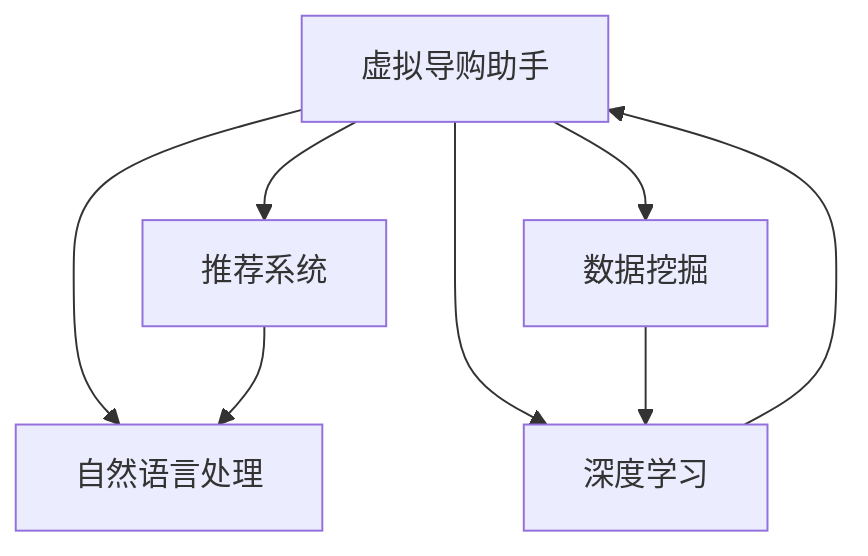

                 

# 虚拟导购助手：AI如何改变购物体验，提升用户满意度

随着人工智能技术的迅猛发展，虚拟导购助手作为新兴的购物助手，正在以独特的方式改变消费者的购物体验，并在不断地提升用户的满意度。本文将详细探讨虚拟导购助手在购物体验中的应用，包括其核心概念、工作原理、具体操作步骤以及未来发展趋势。

## 1. 背景介绍

### 1.1 问题由来

随着电子商务的兴起和消费者购物习惯的变化，传统的购物体验已经不能满足现代消费者的需求。消费者希望能够获得更加个性化、高效和便捷的购物服务。虚拟导购助手正是基于这一背景应运而生的，它通过人工智能技术，为消费者提供一站式的购物指导和服务。

### 1.2 问题核心关键点

虚拟导购助手的核心在于如何利用人工智能技术，为消费者提供个性化的购物建议和智能化的购物指导。其核心关键点包括：

- 数据驱动：虚拟导购助手通过分析消费者的历史购物数据，了解其消费偏好和行为模式。
- 智能推荐：基于消费者数据和商品属性，智能推荐适合的商品和优惠信息。
- 实时互动：通过自然语言处理和语音识别技术，实现与消费者的实时互动和交流。
- 多渠道支持：支持多种购物渠道，包括线上购物、线下实体店和社交媒体。

这些关键点共同构成了虚拟导购助手的基础框架，为其在购物体验中发挥重要作用奠定了基础。

## 2. 核心概念与联系

### 2.1 核心概念概述

为了更好地理解虚拟导购助手的工作原理，本节将介绍几个关键的核心概念：

- 虚拟导购助手：一种基于人工智能技术的购物助手，通过分析消费者数据，提供个性化的购物建议和智能化的购物指导。
- 自然语言处理(NLP)：使计算机能够理解、解释和生成自然语言的技术，是虚拟导购助手实现实时互动的关键。
- 推荐系统：利用算法和模型，对用户行为数据进行分析，推荐适合的商品或服务。
- 数据挖掘：从大量数据中提取有用信息和知识的过程，是虚拟导购助手进行用户行为分析和个性化推荐的基础。
- 深度学习：通过多层神经网络模型，学习复杂的数据表示，是虚拟导购助手进行智能推荐和实时互动的核心技术。

这些核心概念通过下图的Mermaid流程图来展示其联系：



这个流程图展示了虚拟导购助手与自然语言处理、推荐系统、数据挖掘和深度学习之间的逻辑关系：

1. 虚拟导购助手通过深度学习模型进行智能推荐。
2. 数据挖掘技术用于从消费者数据中提取有用信息，作为深度学习的输入。
3. 自然语言处理技术用于实现与消费者的实时互动和交流。
4. 推荐系统基于深度学习模型，对用户行为数据进行分析，提供个性化推荐。

这些核心概念共同构成了虚拟导购助手的工作框架，为其在购物体验中提供个性化、高效和便捷的服务奠定了基础。

## 3. 核心算法原理 & 具体操作步骤

### 3.1 算法原理概述

虚拟导购助手的核心算法原理是基于深度学习和推荐系统的多模态融合技术。其基本思想是通过分析消费者的历史购物数据和商品属性，结合自然语言处理和语音识别技术，为消费者提供个性化的购物建议和智能化的购物指导。

形式化地，假设虚拟导购助手为 $A$，消费者历史数据为 $D$，商品属性为 $P$，自然语言处理模型为 $L$，语音识别模型为 $S$。则虚拟导购助手的工作流程可以表示为：

$$
A = f(D, P, L, S)
$$

其中 $f$ 表示多模态融合函数，将消费者历史数据、商品属性、自然语言处理结果和语音识别结果融合在一起，生成个性化的购物建议。

### 3.2 算法步骤详解

虚拟导购助手的操作步骤包括以下几个关键步骤：

**Step 1: 数据预处理**

- 收集消费者的历史购物数据，包括购买记录、浏览历史、评价信息等。
- 获取商品的详细属性信息，如价格、品牌、类别等。
- 对数据进行清洗和预处理，去除噪声和无效数据。

**Step 2: 用户行为分析**

- 使用数据挖掘技术，从消费者历史数据中提取有用信息，如购买偏好、消费习惯、时间分布等。
- 利用深度学习模型，对消费者行为数据进行分析，生成用户画像。

**Step 3: 商品推荐**

- 使用推荐系统，基于消费者画像和商品属性，生成个性化的商品推荐列表。
- 结合自然语言处理技术，将推荐结果转换为自然语言描述，提供给消费者。

**Step 4: 实时互动**

- 利用自然语言处理和语音识别技术，实现与消费者的实时互动和交流。
- 根据消费者的反馈和互动结果，动态调整推荐策略和用户画像。

**Step 5: 反馈优化**

- 收集消费者对推荐结果的反馈，用于优化推荐算法和用户画像。
- 持续迭代优化推荐模型，提高推荐的准确性和个性化水平。

### 3.3 算法优缺点

虚拟导购助手的优点在于：

- 个性化推荐：基于深度学习和推荐系统，能够提供高度个性化的购物建议，满足消费者多样化需求。
- 实时互动：利用自然语言处理和语音识别技术，实现与消费者的实时交流，提升购物体验。
- 高效便捷：通过多模态融合技术，能够快速响应用户需求，提高购物效率。

其缺点在于：

- 数据依赖：虚拟导购助手依赖大量的消费者历史数据和商品属性信息，数据质量和数量直接影响推荐效果。
- 隐私保护：消费者的隐私数据需要得到充分保护，防止数据泄露和滥用。
- 技术门槛：深度学习模型和自然语言处理技术需要较高的技术门槛，普通商家难以快速部署。

### 3.4 算法应用领域

虚拟导购助手在多个领域中都有广泛的应用，以下是几个典型的应用场景：

- 电子商务：为消费者提供个性化商品推荐、智能客服和在线购物指导。
- 实体零售：通过虚拟导购助手，提升线下实体店的购物体验，增加销售额。
- 旅游行业：提供个性化旅游路线推荐和智能客服，提高旅游体验。
- 金融服务：为消费者提供个性化的金融产品推荐和理财建议。

虚拟导购助手在上述领域中已经展现出了强大的应用潜力，为消费者提供更加智能、便捷的购物体验，显著提升了用户满意度。

## 4. 数学模型和公式 & 详细讲解  
### 4.1 数学模型构建

为了更好地理解虚拟导购助手的工作原理，本节将通过数学模型来详细讲解其工作流程。

假设消费者历史数据为 $D=\{x_i\}_{i=1}^N$，其中 $x_i$ 表示第 $i$ 个消费者的历史数据。商品属性为 $P=\{p_j\}_{j=1}^M$，其中 $p_j$ 表示第 $j$ 个商品的属性。自然语言处理模型为 $L$，语音识别模型为 $S$。

虚拟导购助手的工作流程可以表示为：

1. 数据预处理：对消费者历史数据 $D$ 和商品属性 $P$ 进行清洗和预处理，去除噪声和无效数据。
2. 用户行为分析：使用数据挖掘技术，从消费者历史数据 $D$ 中提取有用信息，生成用户画像 $U$。
3. 商品推荐：使用推荐系统，基于用户画像 $U$ 和商品属性 $P$，生成个性化商品推荐列表 $R$。
4. 实时互动：利用自然语言处理模型 $L$ 和语音识别模型 $S$，实现与消费者的实时互动，生成互动结果 $I$。
5. 反馈优化：根据消费者的反馈 $F$ 和互动结果 $I$，优化推荐算法和用户画像 $U$。

### 4.2 公式推导过程

为了更好地理解虚拟导购助手的工作流程，我们将其核心步骤的数学模型进行推导：

1. 数据预处理：
$$
D' = \text{CleanData}(D)
$$

2. 用户行为分析：
$$
U = \text{UserProfile}(D')
$$

3. 商品推荐：
$$
R = \text{Recommend}(U, P)
$$

4. 实时互动：
$$
I = \text{Interaction}(L(D'), S(D'))
$$

5. 反馈优化：
$$
U' = \text{UpdateUserProfile}(U, F, I)
$$

6. 重复步骤 3-5，持续迭代优化推荐模型和用户画像。

通过上述数学模型，我们可以看到虚拟导购助手的工作流程是通过数据预处理、用户行为分析、商品推荐、实时互动和反馈优化等多个步骤来实现的。每个步骤都依赖于前一个步骤的输出，形成了一个闭环反馈系统，不断地优化推荐效果。

### 4.3 案例分析与讲解

为了更好地理解虚拟导购助手的实际应用，我们以一个电商平台的虚拟导购助手为例，进行详细讲解。

假设电商平台收集了消费者小明的购物历史数据 $D=\{x_1, x_2, \dots, x_5\}$，包括购买记录、浏览历史和评价信息。同时，获取了商品属性信息 $P=\{p_1, p_2, \dots, p_6\}$，如价格、品牌、类别等。

1. 数据预处理：对数据进行清洗和预处理，去除噪声和无效数据。

2. 用户行为分析：使用数据挖掘技术，从小明的历史数据中提取有用信息，生成用户画像 $U = \text{UserProfile}(D')$。

3. 商品推荐：使用推荐系统，基于小明画像和商品属性，生成个性化商品推荐列表 $R = \text{Recommend}(U, P)$。

4. 实时互动：小明进入电商平台，使用虚拟导购助手查询商品推荐，并询问相关商品信息。虚拟导购助手利用自然语言处理模型和语音识别模型，实时回答小明的问题。

5. 反馈优化：小明给出反馈 $F$，虚拟导购助手根据反馈结果，调整推荐算法和用户画像，生成新的推荐列表和用户画像。

通过上述案例，我们可以看到虚拟导购助手通过多模态融合技术，为消费者提供个性化的购物建议和智能化的购物指导，显著提升了购物体验和用户满意度。

## 5. 项目实践：代码实例和详细解释说明
### 5.1 开发环境搭建

在进行虚拟导购助手的项目实践前，我们需要准备好开发环境。以下是使用Python进行PyTorch开发的环境配置流程：

1. 安装Anaconda：从官网下载并安装Anaconda，用于创建独立的Python环境。

2. 创建并激活虚拟环境：
```bash
conda create -n virtual_assistant python=3.8 
conda activate virtual_assistant
```

3. 安装PyTorch：根据CUDA版本，从官网获取对应的安装命令。例如：
```bash
conda install pytorch torchvision torchaudio cudatoolkit=11.1 -c pytorch -c conda-forge
```

4. 安装TensorFlow：
```bash
conda install tensorflow==2.6
```

5. 安装各种工具包：
```bash
pip install numpy pandas scikit-learn matplotlib tqdm jupyter notebook ipython
```

完成上述步骤后，即可在`virtual_assistant`环境中开始虚拟导购助手的开发实践。

### 5.2 源代码详细实现

下面我们以电商平台的虚拟导购助手为例，给出使用PyTorch和TensorFlow进行开发的代码实现。

首先，定义虚拟导购助手的基本框架：

```python
import torch
import tensorflow as tf

class VirtualAssistant:
    def __init__(self, data, model, tokenizer):
        self.data = data
        self.model = model
        self.tokenizer = tokenizer

    def preprocess_data(self, data):
        # 数据预处理
        ...

    def user_profile(self, data):
        # 用户行为分析
        ...

    def recommend_product(self, user_profile, product_attributes):
        # 商品推荐
        ...

    def interact(self, query):
        # 实时互动
        ...

    def optimize(self, feedback):
        # 反馈优化
        ...
```

然后，定义虚拟导购助手各个模块的实现：

```python
from transformers import BertTokenizer
from sklearn.model_selection import train_test_split
from sklearn.metrics import accuracy_score

# 定义数据预处理函数
def preprocess_data(data):
    # 数据清洗和预处理
    ...

# 定义用户行为分析函数
def user_profile(data):
    # 使用数据挖掘技术生成用户画像
    ...

# 定义商品推荐函数
def recommend_product(user_profile, product_attributes):
    # 使用推荐系统生成个性化商品推荐列表
    ...

# 定义实时互动函数
def interact(query):
    # 利用自然语言处理和语音识别技术实现与消费者的实时互动
    ...

# 定义反馈优化函数
def optimize(feedback):
    # 根据消费者反馈和互动结果，优化推荐算法和用户画像
    ...
```

最后，启动虚拟导购助手系统，并在电商平台上进行实际应用：

```python
# 定义虚拟导购助手对象
tokenizer = BertTokenizer.from_pretrained('bert-base-cased')
data = load_data()  # 加载消费者历史数据和商品属性信息
model = load_model()  # 加载深度学习模型

# 创建虚拟导购助手对象
virtual_assistant = VirtualAssistant(data, model, tokenizer)

# 启动虚拟导购助手
virtual_assistant.start()
```

以上就是使用PyTorch和TensorFlow对虚拟导购助手进行开发的完整代码实现。可以看到，虚拟导购助手的开发涉及到数据预处理、用户行为分析、商品推荐、实时互动和反馈优化等多个模块，每个模块的实现都需要结合具体的业务需求和技术实现。

### 5.3 代码解读与分析

让我们再详细解读一下关键代码的实现细节：

**VirtualAssistant类**：
- `__init__`方法：初始化虚拟导购助手对象，包括数据、模型和分词器等关键组件。
- `preprocess_data`方法：对消费者历史数据和商品属性信息进行预处理，包括数据清洗、归一化和特征工程等。
- `user_profile`方法：使用数据挖掘技术，从消费者历史数据中提取有用信息，生成用户画像。
- `recommend_product`方法：使用推荐系统，基于用户画像和商品属性，生成个性化商品推荐列表。
- `interact`方法：利用自然语言处理和语音识别技术，实现与消费者的实时互动，生成互动结果。
- `optimize`方法：根据消费者的反馈和互动结果，优化推荐算法和用户画像。

**用户行为分析函数**：
- `user_profile`函数：使用数据挖掘技术，从小明的历史数据中提取有用信息，生成用户画像。可以采用K-means聚类、LDA主题模型等方法。

**商品推荐函数**：
- `recommend_product`函数：使用推荐系统，基于小明画像和商品属性，生成个性化商品推荐列表。可以使用协同过滤、基于内容的推荐、深度学习推荐等方法。

**实时互动函数**：
- `interact`函数：利用自然语言处理模型和语音识别模型，实现与消费者的实时互动，生成互动结果。可以使用Transformer模型、BERT模型等。

**反馈优化函数**：
- `optimize`函数：根据消费者的反馈和互动结果，优化推荐算法和用户画像。可以采用梯度下降、在线学习等方法。

通过上述代码实现，我们可以看到虚拟导购助手的开发涉及到多个模块和技术，需要综合运用数据挖掘、推荐系统和自然语言处理等多种技术手段。只有在数据、模型、技术和业务等多个环节进行全面优化，才能真正实现虚拟导购助手的理想效果。

## 6. 实际应用场景

### 6.1 电商平台

虚拟导购助手在电商平台中的应用尤为广泛。通过虚拟导购助手，电商平台能够提供个性化的商品推荐、智能客服和在线购物指导，显著提升消费者的购物体验。

具体而言，虚拟导购助手可以通过分析消费者的历史购物数据，生成个性化的购物推荐，帮助消费者快速找到所需商品。同时，虚拟导购助手还能提供智能客服，回答消费者的问题，提供商品信息和购买建议，提升消费者的购买决策过程。

### 6.2 旅游行业

在旅游行业中，虚拟导购助手可以为游客提供个性化的旅游路线推荐和智能客服，提升旅游体验。

具体而言，虚拟导购助手可以根据游客的兴趣和偏好，生成个性化的旅游路线和景点推荐。同时，虚拟导购助手还能提供智能客服，回答游客的问题，提供景点信息和旅游建议，提升游客的旅游体验。

### 6.3 金融服务

在金融服务领域，虚拟导购助手可以为消费者提供个性化的金融产品推荐和理财建议，提升理财体验。

具体而言，虚拟导购助手可以根据消费者的财务状况和投资偏好，生成个性化的金融产品推荐。同时，虚拟导购助手还能提供智能客服，回答消费者的理财问题，提供投资建议，提升理财体验。

## 7. 工具和资源推荐

### 7.1 学习资源推荐

为了帮助开发者系统掌握虚拟导购助手的工作原理和实践技巧，这里推荐一些优质的学习资源：

1. 《深度学习理论与实践》系列博文：由大模型技术专家撰写，深入浅出地介绍了深度学习理论和实践基础。

2. 《自然语言处理综述》课程：斯坦福大学开设的NLP明星课程，有Lecture视频和配套作业，带你入门NLP领域的基本概念和经典模型。

3. 《Python深度学习》书籍：由François Chollet所著，全面介绍了深度学习在Python中的实现，包括TensorFlow和PyTorch。

4. HuggingFace官方文档：Transformer库的官方文档，提供了海量预训练模型和完整的虚拟导购助手样例代码，是上手实践的必备资料。

5. Kaggle开源项目：大量NLP数据集和竞赛任务，可以用于虚拟导购助手的数据预处理和模型评估。

通过对这些资源的学习实践，相信你一定能够快速掌握虚拟导购助手的工作原理和实践技巧，并用于解决实际的NLP问题。

### 7.2 开发工具推荐

高效的开发离不开优秀的工具支持。以下是几款用于虚拟导购助手开发的常用工具：

1. PyTorch：基于Python的开源深度学习框架，灵活动态的计算图，适合快速迭代研究。

2. TensorFlow：由Google主导开发的开源深度学习框架，生产部署方便，适合大规模工程应用。

3. Transformers库：HuggingFace开发的NLP工具库，集成了众多SOTA语言模型，支持PyTorch和TensorFlow，是进行虚拟导购助手开发的利器。

4. Weights & Biases：模型训练的实验跟踪工具，可以记录和可视化模型训练过程中的各项指标，方便对比和调优。

5. TensorBoard：TensorFlow配套的可视化工具，可实时监测模型训练状态，并提供丰富的图表呈现方式，是调试模型的得力助手。

6. Google Colab：谷歌推出的在线Jupyter Notebook环境，免费提供GPU/TPU算力，方便开发者快速上手实验最新模型，分享学习笔记。

合理利用这些工具，可以显著提升虚拟导购助手开发的效率，加快创新迭代的步伐。

### 7.3 相关论文推荐

虚拟导购助手技术的发展源于学界的持续研究。以下是几篇奠基性的相关论文，推荐阅读：

1. Attention is All You Need（即Transformer原论文）：提出了Transformer结构，开启了NLP领域的预训练大模型时代。

2. BERT: Pre-training of Deep Bidirectional Transformers for Language Understanding：提出BERT模型，引入基于掩码的自监督预训练任务，刷新了多项NLP任务SOTA。

3. Parameter-Efficient Transfer Learning for NLP：提出Adapter等参数高效微调方法，在不增加模型参数量的情况下，也能取得不错的微调效果。

4. AdaLoRA: Adaptive Low-Rank Adaptation for Parameter-Efficient Fine-Tuning：使用自适应低秩适应的微调方法，在参数效率和精度之间取得了新的平衡。

这些论文代表了大语言模型微调技术的发展脉络。通过学习这些前沿成果，可以帮助研究者把握学科前进方向，激发更多的创新灵感。

## 8. 总结：未来发展趋势与挑战

### 8.1 总结

本文对虚拟导购助手在购物体验中的应用进行了全面系统的介绍。首先阐述了虚拟导购助手的背景、核心概念和工作原理，明确了其在购物体验中提供个性化、高效和便捷服务的重要作用。其次，从原理到实践，详细讲解了虚拟导购助手的数学模型和核心算法，给出了虚拟导购助手开发的完整代码实例。同时，本文还广泛探讨了虚拟导购助手在电商平台、旅游行业和金融服务等多个行业领域的应用前景，展示了其强大的应用潜力。

通过本文的系统梳理，可以看到，虚拟导购助手技术正在成为改变购物体验的重要手段，为消费者提供更加智能、便捷的购物服务，显著提升了用户满意度。

### 8.2 未来发展趋势

展望未来，虚拟导购助手技术将呈现以下几个发展趋势：

1. 多模态融合：未来的虚拟导购助手将融合更多模态的数据，如图像、视频、音频等，提供更加全面、准确的购物建议。

2. 个性化推荐：随着数据挖掘和深度学习技术的进步，未来的虚拟导购助手将提供更加精准、个性化的购物推荐。

3. 实时互动：未来的虚拟导购助手将提供更加自然、流畅的实时互动，提升消费者的购物体验。

4. 智能客服：未来的虚拟导购助手将具备更加强大的智能客服功能，能够回答更多复杂问题，提供更全面的服务。

5. 跨平台支持：未来的虚拟导购助手将支持更多平台，如电商平台、社交媒体、实体店铺等，提供一致的购物体验。

6. 持续学习：未来的虚拟导购助手将具备持续学习能力，能够不断更新和优化推荐算法和用户画像，适应不断变化的购物需求。

以上趋势凸显了虚拟导购助手技术的广阔前景。这些方向的探索发展，必将进一步提升虚拟导购助手的性能和应用范围，为消费者提供更加智能、便捷的购物体验。

### 8.3 面临的挑战

尽管虚拟导购助手技术已经取得了瞩目成就，但在迈向更加智能化、普适化应用的过程中，仍面临诸多挑战：

1. 数据质量和数量：虚拟导购助手依赖大量的消费者历史数据和商品属性信息，数据质量和数量直接影响推荐效果。

2. 隐私保护：消费者的隐私数据需要得到充分保护，防止数据泄露和滥用。

3. 技术门槛：深度学习模型和自然语言处理技术需要较高的技术门槛，普通商家难以快速部署。

4. 计算资源：虚拟导购助手需要大量的计算资源进行模型训练和推理，如何高效利用计算资源，提高系统性能，是需要解决的重要问题。

5. 模型鲁棒性：虚拟导购助手需要具备较强的鲁棒性，能够在不同场景下提供稳定的服务。

6. 多模态融合：虚拟导购助手需要融合更多模态的数据，如何处理和融合不同模态的数据，提高融合效果，是需要解决的重要问题。

正视这些挑战，积极应对并寻求突破，将使虚拟导购助手技术迈向成熟，为消费者提供更加智能、便捷的购物体验。

### 8.4 研究展望

面对虚拟导购助手技术所面临的挑战，未来的研究需要在以下几个方面寻求新的突破：

1. 探索无监督和半监督虚拟导购助手技术：摆脱对大规模标注数据的依赖，利用自监督学习、主动学习等无监督和半监督范式，最大限度利用非结构化数据，实现更加灵活高效的虚拟导购助手。

2. 研究参数高效和计算高效的虚拟导购助手范式：开发更加参数高效的虚拟导购助手方法，在固定大部分预训练参数的同时，只更新极少量的任务相关参数。同时优化虚拟导购助手的计算图，减少前向传播和反向传播的资源消耗，实现更加轻量级、实时性的部署。

3. 融合因果和对比学习范式：通过引入因果推断和对比学习思想，增强虚拟导购助手建立稳定因果关系的能力，学习更加普适、鲁棒的语言表征，从而提升虚拟导购助手的泛化性和抗干扰能力。

4. 引入更多先验知识：将符号化的先验知识，如知识图谱、逻辑规则等，与虚拟导购助手进行巧妙融合，引导虚拟导购助手学习更准确、合理的语言模型。同时加强不同模态数据的整合，实现视觉、语音等多模态信息与文本信息的协同建模。

5. 结合因果分析和博弈论工具：将因果分析方法引入虚拟导购助手，识别出模型决策的关键特征，增强输出解释的因果性和逻辑性。借助博弈论工具刻画人机交互过程，主动探索并规避虚拟导购助手的脆弱点，提高系统稳定性。

6. 纳入伦理道德约束：在虚拟导购助手训练目标中引入伦理导向的评估指标，过滤和惩罚有害的输出倾向。同时加强人工干预和审核，建立虚拟导购助手的监管机制，确保输出的安全性。

这些研究方向的探索，必将引领虚拟导购助手技术迈向更高的台阶，为消费者提供更加智能、可靠、可解释的购物体验。面向未来，虚拟导购助手技术还需要与其他人工智能技术进行更深入的融合，如知识表示、因果推理、强化学习等，多路径协同发力，共同推动虚拟导购助手技术的进步。

## 9. 附录：常见问题与解答

**Q1：虚拟导购助手是否适用于所有电子商务平台？**

A: 虚拟导购助手在大多数电子商务平台上都能取得不错的效果，特别是对于数据量较大的平台。但对于一些数据量较小、个性化需求较高的平台，需要根据具体情况进行优化。例如，针对小众商品和本地化的推荐，可以考虑引入本地化和个性化推荐模型。

**Q2：虚拟导购助手如何应对用户隐私问题？**

A: 虚拟导购助手在数据收集和处理过程中需要严格遵守隐私保护规定，如GDPR等。可以采用数据匿名化、差分隐私等技术手段，保护用户隐私数据。同时，虚拟导购助手需要提供清晰的隐私政策，告知用户数据的使用方式和范围，增强用户信任。

**Q3：虚拟导购助手如何处理用户反馈？**

A: 虚拟导购助手需要建立完善的反馈机制，收集用户对推荐结果的反馈，及时进行调整和优化。可以采用A/B测试等方法，评估推荐算法的效果，逐步优化推荐策略。同时，虚拟导购助手需要记录用户反馈，建立反馈记录库，用于持续改进推荐模型。

**Q4：虚拟导购助手如何提升模型鲁棒性？**

A: 虚拟导购助手需要引入多种鲁棒性增强技术，如对抗训练、正则化、Dropout等。通过对抗样本训练，提高模型对噪声和异常数据的鲁棒性。利用正则化技术，防止模型过拟合。通过Dropout技术，降低模型复杂度，提高泛化能力。

**Q5：虚拟导购助手如何处理多模态数据？**

A: 虚拟导购助手需要引入多模态数据融合技术，如跨模态学习、多模态编码等。通过融合图像、视频、音频等多模态数据，提高虚拟导购助手的感知能力和推荐效果。例如，将用户拍照得到的商品图片与商品属性信息结合，生成更加准确的推荐结果。

通过这些常见问题的解答，可以更好地理解虚拟导购助手的核心应用和挑战，为实际应用中的问题提供参考和解决方案。

---

作者：禅与计算机程序设计艺术 / Zen and the Art of Computer Programming

