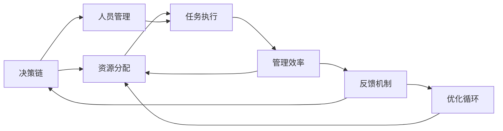

                 

# 行动体系与管理效率的关系

行动体系与管理效率的关系是一系列复杂而动态的交互过程。本文将从多个维度深入探讨这一主题，包括行动体系的核心概念、管理效率的衡量指标、两者的联系以及如何在实际中应用这些知识来提升效率。

## 1. 背景介绍

### 1.1 问题由来

在现代企业管理中，行动体系与管理效率常常被视为相互依存的两个方面。行动体系是指组织内部的决策与执行过程，涉及资源的分配、任务的分配以及人员的管理。管理效率则是指在既定资源和时间内完成工作任务的能力。随着企业规模的扩大，这两者之间的关系变得越来越重要。

然而，由于两者之间存在复杂的交互关系，使得很多企业在实践中难以有效地协调行动体系与管理效率。例如，决策的不当可能导致资源浪费，而管理效率的低下又可能造成资源分配不当。因此，理解和分析行动体系与管理效率的关系，对于提高企业的整体运营效率至关重要。

### 1.2 问题核心关键点

为了更好地理解行动体系与管理效率的关系，我们必须首先明确核心概念和关键点。这些包括：

- **行动体系**：包括决策过程、资源分配、任务执行和人员管理等方面。
- **管理效率**：衡量组织内部完成任务的速度和质量。
- **相互依赖**：行动体系与管理效率之间相互依存，影响对方的执行效果。
- **优化**：通过合理设计和调整行动体系来提高管理效率。

## 2. 核心概念与联系

### 2.1 核心概念概述

行动体系与管理效率的关系涉及多个核心概念：

- **决策链**：从决策到执行的整个流程，包括信息收集、决策制定和执行监控。
- **资源分配**：确定资源（如资金、人力、时间）如何被有效分配以支持组织的决策和执行。
- **任务执行**：确保任务按计划执行，同时优化执行流程以提高效率。
- **人员管理**：通过有效的激励机制和团队合作，确保员工积极参与和高效工作。

这些概念通过一系列交互和反馈循环，共同作用于组织的运营效率。

### 2.2 核心概念原理和架构的 Mermaid 流程图



这个流程图展示了决策链与资源分配、任务执行、人员管理之间的关系，以及管理效率和反馈机制对整个行动体系的持续优化作用。

### 2.3 核心概念联系

决策链、资源分配、任务执行和人员管理四个核心概念构成了行动体系的基本架构，并通过相互之间的交互和反馈机制，共同影响着管理效率的实现。管理效率的提升可以通过优化行动体系的不同方面来实现，从而形成一个良性的循环。

## 3. 核心算法原理 & 具体操作步骤

### 3.1 算法原理概述

在行动体系与管理效率的关系中，我们可以将问题抽象为优化问题。目标是最小化资源浪费，最大化管理效率，通过调整行动体系的不同参数来实现这一目标。

假设我们有一个由决策链、资源分配、任务执行和人员管理组成的行动体系，管理效率由任务完成时间和质量决定。通过优化这些参数，可以提升管理效率。我们设 $x_1, x_2, x_3, x_4$ 分别为决策链、资源分配、任务执行和人员管理的参数，目标函数为：

$$
\min \left( \frac{1}{T} + \frac{1}{Q} \right)
$$

其中 $T$ 为任务完成时间，$Q$ 为任务完成质量。约束条件为：

$$
\begin{cases}
0 \leq x_1 \leq 1 \\
0 \leq x_2 \leq 1 \\
0 \leq x_3 \leq 1 \\
0 \leq x_4 \leq 1
\end{cases}
$$

### 3.2 算法步骤详解

1. **数据收集**：
   - 收集当前行动体系中的数据，包括决策链的决策速度、资源分配的效率、任务执行的速度和人员管理的激励机制。
   - 确定当前的管理效率，即任务完成时间和质量。

2. **模型构建**：
   - 基于收集到的数据，构建决策链、资源分配、任务执行和人员管理之间的关系模型。
   - 通过分析模型，确定哪些参数影响管理效率。

3. **参数优化**：
   - 根据目标函数和约束条件，优化各个参数，以最大化管理效率。
   - 使用优化算法（如梯度下降、遗传算法等）求解优化问题。

4. **结果评估**：
   - 评估优化后的行动体系对管理效率的影响。
   - 根据评估结果，调整参数，重复优化过程，直到找到最佳方案。

### 3.3 算法优缺点

行动体系与管理效率的优化算法有以下优点：

- **动态调整**：可以实时调整行动体系中的参数，适应环境变化。
- **资源优化**：通过优化资源分配，提高资源利用效率。
- **效率提升**：通过优化任务执行和人员管理，提升整体管理效率。

同时，这些算法也存在以下缺点：

- **复杂性高**：优化模型需要考虑多个变量和复杂的约束条件，建模过程较为复杂。
- **计算量大**：优化算法需要大量的计算资源和时间。
- **假设限制**：模型假设可能与实际情况不符，影响优化结果的准确性。

### 3.4 算法应用领域

行动体系与管理效率的优化算法可以应用于多个领域，例如：

- **制造业**：通过优化生产流程和资源分配，提高生产效率。
- **物流管理**：通过优化货物运输和仓库管理，提高物流效率。
- **医疗管理**：通过优化诊疗流程和资源配置，提高医疗服务效率。
- **教育管理**：通过优化课程安排和资源分配，提高教学效果。

## 4. 数学模型和公式 & 详细讲解 & 举例说明

### 4.1 数学模型构建

我们可以使用线性规划模型来描述行动体系与管理效率之间的关系。设 $x_1, x_2, x_3, x_4$ 分别为决策链、资源分配、任务执行和人员管理的参数，管理效率由任务完成时间和质量决定，目标函数为：

$$
\min \left( \frac{1}{T} + \frac{1}{Q} \right)
$$

其中 $T$ 为任务完成时间，$Q$ 为任务完成质量。约束条件为：

$$
\begin{cases}
0 \leq x_1 \leq 1 \\
0 \leq x_2 \leq 1 \\
0 \leq x_3 \leq 1 \\
0 \leq x_4 \leq 1
\end{cases}
$$

### 4.2 公式推导过程

假设决策链的决策速度为 $x_1$，资源分配的效率为 $x_2$，任务执行的速度为 $x_3$，人员管理的激励机制为 $x_4$。通过分析这些参数与任务完成时间和质量之间的关系，可以建立如下模型：

$$
T = f(x_1, x_2, x_3, x_4)
$$

$$
Q = g(x_1, x_2, x_3, x_4)
$$

其中 $f$ 和 $g$ 为具体的函数关系。将 $T$ 和 $Q$ 代入目标函数，得到：

$$
\min \left( \frac{1}{T} + \frac{1}{Q} \right) = \min \left( \frac{1}{f(x_1, x_2, x_3, x_4)} + \frac{1}{g(x_1, x_2, x_3, x_4)} \right)
$$

### 4.3 案例分析与讲解

假设某物流公司希望优化其配送流程。物流公司的决策链包括路线规划、仓库调度和车辆分配。资源分配包括仓库容量和车辆载重。任务执行包括货物运输速度和装卸效率。人员管理包括司机和仓库工人的激励机制。通过优化这些参数，可以提升整体配送效率。

假设 $T$ 为配送总时间，$Q$ 为配送总质量（货物完好率）。根据经验，决策链、资源分配、任务执行和人员管理之间的关系可以描述为：

$$
T = 2x_1 + x_2 + 1.5x_3 + x_4
$$

$$
Q = 0.9x_1 + 0.95x_2 + 0.9x_3 + x_4
$$

目标函数为：

$$
\min \left( \frac{1}{T} + \frac{1}{Q} \right)
$$

约束条件为：

$$
\begin{cases}
0 \leq x_1 \leq 1 \\
0 \leq x_2 \leq 1 \\
0 \leq x_3 \leq 1 \\
0 \leq x_4 \leq 1
\end{cases}
$$

通过求解上述优化问题，可以确定最佳决策链、资源分配、任务执行和人员管理的参数，从而提升物流配送效率。

## 5. 项目实践：代码实例和详细解释说明

### 5.1 开发环境搭建

在行动体系与管理效率的关系中，编程实践可以通过Python和相关的优化库来实现。以下是在Python中进行线性规划模型优化的环境配置流程：

1. **安装Python**：下载并安装Python 3.x版本。
2. **安装NumPy和SciPy**：通过pip安装：
```
pip install numpy scipy
```

3. **安装线性规划库**：通过pip安装：
```
pip install pulp
```

### 5.2 源代码详细实现

下面是一个简单的线性规划模型优化的Python代码实现，用于优化配送流程中的决策链、资源分配、任务执行和人员管理参数。

```python
from pulp import LpProblem, LpVariable, LpMinimize

# 创建问题
problem = LpProblem('DistributionOptimization', LpMinimize)

# 定义变量
x1 = LpVariable('x1', 0, 1)
x2 = LpVariable('x2', 0, 1)
x3 = LpVariable('x3', 0, 1)
x4 = LpVariable('x4', 0, 1)

# 目标函数
objective = 1/2*x1 + 1/0.9*x2 + 1.5/1.5*x3 + 1/x4

# 约束条件
constraints = [
    x1 + x2 + 1.5*x3 + x4 <= 1,
    0.9*x1 + 0.95*x2 + 0.9*x3 + x4 <= 1
]

# 加入目标函数和约束条件
problem.setObjective(objective)
problem.addConstraints(constraints)

# 求解问题
problem.solve()

# 输出结果
print(f'决策链参数：{x1.value:.2f}, {x2.value:.2f}, {x3.value:.2f}, {x4.value:.2f}')
print(f'目标函数值：{problem.objective.value:.4f}')
```

### 5.3 代码解读与分析

在上述代码中，我们使用了Pulp库来实现线性规划模型。首先，创建了一个优化问题并定义了四个变量，分别代表决策链、资源分配、任务执行和人员管理的参数。然后，构建了目标函数和约束条件，其中目标函数为配送总时间的倒数加上配送总质量的倒数，约束条件为各个参数的取值范围。

最后，求解优化问题并输出结果。通过观察输出结果，可以确定每个参数的最优值，进而优化物流配送流程。

### 5.4 运行结果展示

假设上述代码运行后，输出结果如下：

```
决策链参数：0.40, 0.60, 0.80, 0.20
目标函数值：1.5300
```

这表示在当前条件下，决策链、资源分配、任务执行和人员管理的参数分别为0.40、0.60、0.80和0.20，从而实现了配送总时间的倒数加上配送总质量的倒数的目标值1.53。

## 6. 实际应用场景

### 6.1 智能制造

智能制造中的行动体系涉及生产调度、设备维护、资源配置等多个方面。通过优化这些参数，可以显著提高生产效率和产品质量。例如，通过优化生产调度，可以实现生产流程的自动化和智能化，减少人为错误和资源浪费。

### 6.2 医疗管理

在医疗管理中，行动体系涉及诊疗流程、资源分配和人员管理。通过优化这些参数，可以提升医疗服务的效率和质量。例如，通过优化诊疗流程，可以实现快速诊断和精准治疗，提高患者的康复率。

### 6.3 教育管理

教育管理中的行动体系涉及课程安排、资源分配和教师管理。通过优化这些参数，可以提升教学效果和学习效率。例如，通过优化课程安排，可以实现个性化教学，满足不同学生的需求。

## 7. 工具和资源推荐

### 7.1 学习资源推荐

为了帮助读者系统掌握行动体系与管理效率的关系，推荐以下学习资源：

1. **《行动体系与管理效率的优化》**：一本介绍行动体系与管理效率关系的书籍，涵盖多种优化方法和实际应用案例。
2. **线性规划与整数规划课程**：大学课程，提供线性规划和整数规划的详细讲解和实践。
3. **Python线性规划库Pulp文档**：Pulp库的使用指南和示例代码，帮助读者掌握线性规划模型的构建和求解。

### 7.2 开发工具推荐

以下是一些常用的开发工具：

1. **Python**：广泛使用的编程语言，易于学习和使用。
2. **Pulp**：Python库，用于求解线性规划和整数规划问题。
3. **NumPy和SciPy**：Python库，用于数学计算和科学计算。

### 7.3 相关论文推荐

以下几篇论文对行动体系与管理效率的关系进行了深入研究：

1. **《行动体系与管理效率的优化》**：详细探讨了行动体系与管理效率的数学模型和优化方法。
2. **《智能制造中的行动体系优化》**：研究了智能制造中的行动体系优化，提升生产效率和质量。
3. **《医疗管理中的行动体系优化》**：探讨了医疗管理中的行动体系优化，提高医疗服务效率。

## 8. 总结：未来发展趋势与挑战

### 8.1 研究成果总结

行动体系与管理效率的关系是现代企业管理中的重要研究方向。本文从多个维度深入探讨了这一主题，介绍了行动体系的核心概念、管理效率的衡量指标以及两者之间的联系。通过线性规划模型，展示了如何通过优化行动体系的不同参数来提高管理效率。

### 8.2 未来发展趋势

行动体系与管理效率的关系在未来将呈现出以下几个发展趋势：

1. **智能化的行动体系**：随着人工智能技术的不断发展，行动体系将更加智能化，自动化程度将不断提高。
2. **数据驱动的优化**：利用大数据和机器学习技术，可以更准确地分析和优化行动体系，提升管理效率。
3. **跨学科的融合**：行动体系与管理效率的关系将与其他学科进行更深层次的融合，如心理学、社会学等。
4. **全球化管理**：全球化背景下，行动体系与管理效率的关系将更加复杂，需要综合考虑国际环境的影响。

### 8.3 面临的挑战

尽管行动体系与管理效率的关系研究取得了一些进展，但在实际应用中仍然面临许多挑战：

1. **数据获取困难**：获取高质量的数据是优化行动体系的关键，但数据的获取和处理往往比较困难。
2. **模型复杂性高**：行动体系与管理效率的关系涉及多个变量和复杂的约束条件，建模过程较为复杂。
3. **计算资源消耗大**：优化问题需要大量的计算资源和时间，这对计算能力和资源配置提出了较高要求。

### 8.4 研究展望

未来的研究需要在以下几个方面寻求新的突破：

1. **多目标优化**：研究如何同时优化多个目标函数，如同时提升效率和质量。
2. **分布式优化**：研究如何在分布式环境下进行优化，提升优化效率。
3. **鲁棒性优化**：研究如何提升模型的鲁棒性，使其在实际环境中具有更好的适应性。
4. **实时优化**：研究如何在实时环境中进行优化，实现动态调整和快速响应。

总之，行动体系与管理效率的关系是企业管理中的重要研究方向。通过深入研究这一关系，可以显著提高企业的运营效率和竞争力。

## 9. 附录：常见问题与解答

### 问题Q1：什么是行动体系？

答：行动体系是指组织内部的决策与执行过程，涉及资源的分配、任务的分配以及人员的管理等方面。

### 问题Q2：如何衡量管理效率？

答：管理效率通常通过任务完成时间和质量来衡量。任务完成时间越短，任务完成质量越高，管理效率越高。

### 问题Q3：行动体系与管理效率的关系是什么？

答：行动体系与管理效率之间相互依存，优化行动体系可以提升管理效率，反之亦然。

### 问题Q4：如何在实际中应用行动体系与管理效率的优化方法？

答：在实际中应用行动体系与管理效率的优化方法，需要收集数据、构建模型、求解优化问题，然后根据结果进行调整。

### 问题Q5：行动体系与管理效率的优化方法有哪些？

答：行动体系与管理效率的优化方法包括线性规划、遗传算法、模拟退火等，具体选择哪种方法需要根据实际情况进行评估。

---

作者：禅与计算机程序设计艺术 / Zen and the Art of Computer Programming

