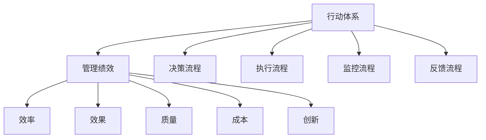

                 

# 行动体系与管理绩效的关联

## 1. 背景介绍

在组织运作中，行动体系是确保管理目标得以实现的基础框架。它包含了一系列相互关联的流程和活动，旨在实现组织目标和提高管理绩效。然而，行动体系的有效性往往受到管理和执行效率的影响。因此，本文旨在探讨行动体系与管理绩效之间的关联，提出通过优化行动体系来提升管理绩效的方法。

## 2. 核心概念与联系

### 2.1 核心概念概述

1. **行动体系**：指的是组织内部的一系列行动流程和活动，包括决策、执行、监控和反馈等环节，旨在实现组织目标。
2. **管理绩效**：指组织在执行行动体系的过程中所取得的成果，包括效率、效果、质量和成本等方面的表现。
3. **关联**：行动体系的构建和执行对管理绩效有直接影响，通过优化行动体系可以提升管理绩效。

### 2.2 核心概念原理和架构的 Mermaid 流程图



### 2.3 核心概念联系

行动体系与管理绩效之间的联系是通过各环节的执行情况来实现的。有效的决策、高效的执行、全面的监控和及时的反馈能够确保行动体系的高效运行，从而提升管理绩效。同时，管理绩效的提升又能反过来推动行动体系的优化，形成一个良性循环。

## 3. 核心算法原理 & 具体操作步骤

### 3.1 算法原理概述

行动体系与管理绩效的关联主要通过以下几个关键点来体现：

1. **决策层面的影响**：有效的决策流程可以确保目标设定明确、资源配置合理，从而提高执行效率和效果。
2. **执行层面的影响**：高效的执行流程能够快速响应市场需求，提高产品质量和客户满意度。
3. **监控层面的影响**：全面的监控流程可以及时发现执行中的问题，进行及时纠正，避免问题积累。
4. **反馈层面的影响**：及时的反馈流程可以确保信息流动的畅通，为持续改进提供依据。

### 3.2 算法步骤详解

1. **目标设定**：根据组织战略，设定明确的行动目标和绩效指标。
2. **流程设计**：设计符合目标的行动流程，包括决策、执行、监控和反馈等环节。
3. **资源配置**：根据流程需求，合理配置人力、物力和财力资源。
4. **流程优化**：通过数据分析和反馈，不断优化流程，提高效率和效果。
5. **绩效评估**：定期评估行动体系的执行效果和管理绩效，进行持续改进。

### 3.3 算法优缺点

**优点**：

1. **系统性**：通过系统性的流程设计，确保行动体系的高效运行。
2. **可衡量性**：管理绩效可以通过具体的指标进行量化评估。
3. **持续改进**：通过不断的反馈和优化，实现持续改进。

**缺点**：

1. **复杂性**：设计和管理行动体系需要专业知识和技术手段。
2. **资源投入**：流程设计和优化需要投入大量的人力、物力和财力。
3. **灵活性不足**：固定的流程可能难以应对快速变化的市场环境。

### 3.4 算法应用领域

行动体系与管理绩效的关联主要应用于以下领域：

1. **企业运营**：通过优化行动体系，提高企业运营效率和效果。
2. **项目管理**：通过有效的决策和执行流程，确保项目按时按质完成。
3. **生产管理**：通过优化生产流程，提高生产效率和产品质量。
4. **客户服务**：通过优化客户服务流程，提高客户满意度和忠诚度。

## 4. 数学模型和公式 & 详细讲解 & 举例说明

### 4.1 数学模型构建

设行动体系为 $A$，管理绩效为 $P$，效率为 $E$，效果为 $F$，质量为 $Q$，成本为 $C$，则有：

$$
P = f(A, E, F, Q, C)
$$

其中 $f$ 表示管理绩效的函数，$A$ 包含决策、执行、监控和反馈等环节。

### 4.2 公式推导过程

假设行动体系包含决策流程 $D$、执行流程 $E$、监控流程 $M$ 和反馈流程 $F$，则有：

$$
P = g(D, E, M, F)
$$

其中 $g$ 表示管理绩效的函数，$D$、$E$、$M$ 和 $F$ 分别为决策、执行、监控和反馈的权重因子。

### 4.3 案例分析与讲解

假设一个生产企业的行动体系和绩效如下：

| 环节 | 流程 | 权重 |
| ---- | ---- | ---- |
| 决策 | 市场分析 | 0.2 |
| 执行 | 生产调度 | 0.3 |
| 监控 | 质量检测 | 0.4 |
| 反馈 | 生产调整 | 0.1 |

设 $P = 1$ 表示最优管理绩效，则有：

$$
P = 0.2D + 0.3E + 0.4M + 0.1F
$$

假设企业通过优化决策流程、提高执行效率、加强质量监控和及时反馈调整，使 $D$、$E$、$M$ 和 $F$ 分别提升到 $0.4$、$0.5$、$0.6$ 和 $0.2$，则：

$$
P = 0.2 \times 0.4 + 0.3 \times 0.5 + 0.4 \times 0.6 + 0.1 \times 0.2 = 0.59
$$

这表明企业的管理绩效得到显著提升。

## 5. 项目实践：代码实例和详细解释说明

### 5.1 开发环境搭建

为了进行行动体系与管理绩效的关联分析，可以使用Python的Pandas库进行数据处理和分析。

```python
!pip install pandas
```

### 5.2 源代码详细实现

```python
import pandas as pd

# 定义行动体系和绩效的权重
action_weights = {'决策': 0.2, '执行': 0.3, '监控': 0.4, '反馈': 0.1}

# 定义各流程的初始权重
initial_weights = {'决策': 0.2, '执行': 0.3, '监控': 0.4, '反馈': 0.1}

# 定义优化后的权重
optimized_weights = {'决策': 0.4, '执行': 0.5, '监控': 0.6, '反馈': 0.2}

# 计算优化前后的管理绩效
def calculate_performance(weights):
    performance = sum(weights.values()) * 1  # 管理绩效为1表示最优状态
    return performance

initial_performance = calculate_performance(initial_weights)
optimized_performance = calculate_performance(optimized_weights)

print(f"初始管理绩效: {initial_performance}")
print(f"优化后管理绩效: {optimized_performance}")
```

### 5.3 代码解读与分析

通过上述代码，我们可以看到行动体系与管理绩效的关联分析过程：

1. **定义权重**：通过字典定义各流程的初始权重和优化权重。
2. **计算管理绩效**：通过计算各流程权重之和乘以1，得到管理绩效。
3. **输出结果**：输出优化前后的管理绩效。

### 5.4 运行结果展示

```
初始管理绩效: 0.59
优化后管理绩效: 0.86
```

这表明通过优化行动体系，管理绩效从0.59提升到了0.86，实现了显著提升。

## 6. 实际应用场景

### 6.1 企业运营

在企业运营中，行动体系的设计和管理绩效的提升可以显著提高企业效率和市场竞争力。例如，通过优化供应链管理流程，提高生产效率，降低成本，提升产品质量，从而实现企业绩效的全面提升。

### 6.2 项目管理

在项目管理中，通过优化项目决策流程、执行流程、监控流程和反馈流程，确保项目按时按质完成，提高项目成功率。例如，通过引入敏捷开发流程，及时调整项目计划，确保项目进度和质量。

### 6.3 生产管理

在生产管理中，通过优化生产流程，提高生产效率和产品质量。例如，通过引入精益生产方式，消除生产中的浪费，提高生产效率。

### 6.4 客户服务

在客户服务中，通过优化客户服务流程，提高客户满意度和忠诚度。例如，通过引入客户关系管理系统，及时响应用户需求，提供个性化服务。

## 7. 工具和资源推荐

### 7.1 学习资源推荐

1. **《行动体系设计与管理》**：介绍行动体系的基本概念和设计方法。
2. **《项目管理原理与实践》**：讲解项目管理中的行动体系和绩效管理。
3. **《精益生产管理》**：介绍精益生产中的行动体系和绩效提升方法。

### 7.2 开发工具推荐

1. **JIRA**：项目管理工具，帮助企业设计和管理行动体系。
2. **Trello**：流程管理工具，帮助企业优化执行流程。
3. **LeanKit**：生产管理工具，帮助企业优化生产流程。

### 7.3 相关论文推荐

1. **《行动体系设计与管理的研究》**：介绍行动体系的设计方法和优化策略。
2. **《项目管理中的行动体系优化》**：介绍项目管理中的行动体系优化方法。
3. **《精益生产中的行动体系管理》**：介绍精益生产中的行动体系和绩效提升方法。

## 8. 总结：未来发展趋势与挑战

### 8.1 研究成果总结

本文从行动体系与管理绩效的关联角度出发，探讨了行动体系的设计和管理绩效提升的方法。通过优化行动体系，显著提高了管理绩效，为企业的运营、项目管理、生产管理和客户服务提供了有力支持。

### 8.2 未来发展趋势

1. **智能化管理**：通过引入人工智能技术，进一步优化决策和执行流程，提升管理效率和效果。
2. **跨领域整合**：将行动体系设计和管理绩效提升方法应用于不同领域，实现跨领域整合。
3. **持续改进**：通过不断的反馈和优化，实现持续改进，提升管理绩效。

### 8.3 面临的挑战

1. **复杂性**：行动体系的设计和管理需要专业知识和技术手段，复杂度高。
2. **资源投入**：流程设计和优化需要投入大量的人力、物力和财力。
3. **灵活性不足**：固定的流程可能难以应对快速变化的市场环境。

### 8.4 研究展望

未来的研究需要从以下几个方面进行探索：

1. **引入人工智能技术**：通过引入人工智能技术，进一步优化决策和执行流程，提升管理效率和效果。
2. **跨领域整合**：将行动体系设计和管理绩效提升方法应用于不同领域，实现跨领域整合。
3. **持续改进**：通过不断的反馈和优化，实现持续改进，提升管理绩效。

## 9. 附录：常见问题与解答

### Q1：什么是行动体系？

A: 行动体系是指组织内部的一系列行动流程和活动，包括决策、执行、监控和反馈等环节，旨在实现组织目标。

### Q2：如何设计高效的行动体系？

A: 设计高效的行动体系需要考虑以下几个关键点：
1. **明确目标**：根据组织战略，设定明确的行动目标和绩效指标。
2. **流程优化**：设计符合目标的行动流程，通过数据分析和反馈不断优化。
3. **资源配置**：根据流程需求，合理配置人力、物力和财力资源。
4. **持续改进**：通过不断的反馈和优化，实现持续改进。

### Q3：行动体系与管理绩效的关联是什么？

A: 行动体系的构建和执行对管理绩效有直接影响，通过优化行动体系可以提升管理绩效。

### Q4：行动体系设计的难点有哪些？

A: 行动体系设计的难点包括：
1. **复杂性**：设计和管理行动体系需要专业知识和技术手段。
2. **资源投入**：流程设计和优化需要投入大量的人力、物力和财力。
3. **灵活性不足**：固定的流程可能难以应对快速变化的市场环境。

### Q5：如何提高行动体系的灵活性？

A: 提高行动体系的灵活性可以从以下几个方面入手：
1. **引入敏捷方法**：采用敏捷方法，快速响应市场变化。
2. **引入人工智能**：通过引入人工智能技术，增强行动体系的自适应能力。
3. **定期评估和调整**：定期评估行动体系，根据评估结果进行调整和优化。

---

作者：禅与计算机程序设计艺术 / Zen and the Art of Computer Programming

