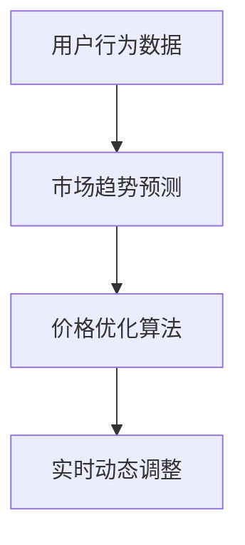

                 

# 规模化消费：降低产品价格

## 1. 背景介绍

在当今竞争激烈的电子商务市场中，降低产品价格已经成为各大电商平台吸引用户、抢占市场份额的重要手段。然而，如何在保持产品品质的前提下，实现价格的降低，是每一个电商平台都必须面对的挑战。规模化消费通过利用先进的算法和数据驱动，帮助电商平台实现大规模商品价格的下调，不仅能够满足消费者的需求，还能提升销售额和市场竞争力。

### 1.1 问题由来

电商平台销售商品价格通常受到成本、利润率和市场需求的影响。当市场对某类商品的需求增长时，为吸引更多消费者，电商平台通常会选择降价促销。但传统的降价促销方式往往依赖于人力成本和库存成本，且无法精确预测市场动态，因此如何高效、精确地进行价格调整，成为电商平台亟需解决的问题。规模化消费通过对用户行为数据的深入分析，帮助电商平台在降低成本的同时，实现价格的规模化调整。

### 1.2 问题核心关键点

规模化消费的核心在于利用数据科学和机器学习算法，精确地预测市场趋势和用户行为，从而实现价格的动态调整。具体来说，包括以下几个关键点：

1. **用户行为数据分析**：通过对用户点击、购买、浏览等行为数据的分析，获取用户的消费偏好和价格敏感度。
2. **市场趋势预测**：利用时间序列分析等技术，预测商品在未来一段时间内的市场需求变化。
3. **价格优化算法**：结合成本和利润率，利用优化算法确定最优的价格策略。
4. **实时动态调整**：根据市场和用户的变化，实时调整商品价格，保持市场竞争力。

### 1.3 问题研究意义

研究规模化消费方法，对于电商平台在保持商品质量的前提下，通过技术手段降低价格，提升用户体验和平台竞争力，具有重要意义：

1. **提升用户满意度**：通过精准的价格调整，满足消费者对价格敏感度的需求，提高用户购买欲望和满意度。
2. **降低运营成本**：优化库存管理，减少过度库存和积压，提升资金周转率，降低运营成本。
3. **增加销售额**：通过价格调整吸引更多消费者，增加平台的总销售额和市场份额。
4. **提高市场竞争力**：通过动态价格调整，保持平台价格的竞争优势，提升市场地位。
5. **促进技术创新**：规模化消费的实现需要结合大数据、机器学习等前沿技术，促进相关技术的发展和应用。

## 2. 核心概念与联系

### 2.1 核心概念概述

为更好地理解规模化消费的原理和应用，本节将介绍几个关键概念及其之间的联系：

- **规模化消费**：通过数据分析和算法优化，实现大规模商品价格的下调，以满足市场需求，提升销售量和市场竞争力。
- **用户行为数据**：用户在电商平台上的点击、浏览、购买等行为数据，是分析用户需求和市场趋势的基础。
- **市场趋势预测**：通过时间序列分析、回归分析等方法，预测商品在未来一段时间内的市场需求变化。
- **价格优化算法**：结合成本、利润率和市场需求，利用优化算法确定最优价格策略。
- **实时动态调整**：根据市场和用户的变化，实时调整商品价格，保持市场竞争力。

这些核心概念之间的逻辑关系可以通过以下Mermaid流程图来展示：



这个流程图展示了大规模消费的核心概念及其之间的关系：

1. 用户行为数据作为市场趋势预测的基础，预测市场需求变化。
2. 市场趋势预测作为价格优化算法的输入，优化价格策略。
3. 价格优化算法输出最优价格，再通过实时动态调整，实现价格的下调。

## 3. 核心算法原理 & 具体操作步骤
### 3.1 算法原理概述

规模化消费的核心算法原理基于数据分析和机器学习技术，其目标是利用用户行为数据和市场趋势预测，通过价格优化算法确定最优价格策略，并实时动态调整商品价格，以提升销售额和市场竞争力。

### 3.2 算法步骤详解

以下是规模化消费的具体算法步骤：

**Step 1: 收集和整理用户行为数据**
- 收集用户在平台上的所有行为数据，如点击、浏览、购买、评分等。
- 对数据进行清洗和标注，去除噪音数据和异常值。
- 对数据进行特征工程，提取有用的特征，如用户ID、商品ID、访问时间、购买频率等。

**Step 2: 进行市场趋势预测**
- 利用时间序列分析、回归分析等方法，对用户行为数据进行建模，预测商品的市场需求变化。
- 根据预测结果，确定商品的需求量、销售增长率等关键指标。

**Step 3: 制定价格优化策略**
- 结合商品的成本、利润率和市场需求预测，制定价格优化策略。
- 利用优化算法（如线性规划、遗传算法等），求解最优价格策略。
- 根据市场变化和用户反馈，实时调整价格策略。

**Step 4: 实施价格动态调整**
- 根据价格优化策略，实时调整商品价格。
- 监控价格调整后的市场反应，如销售额、库存量等指标。
- 根据市场反馈，持续优化价格策略，确保价格的合理性和市场竞争力。

### 3.3 算法优缺点

规模化消费算法具有以下优点：

1. **精确预测**：通过用户行为数据分析和市场趋势预测，能够精确地预测市场需求和用户偏好，从而制定合理的价格策略。
2. **实时调整**：结合实时市场数据和用户反馈，能够动态调整商品价格，保持市场竞争力。
3. **提升销售额**：通过价格优化和动态调整，吸引更多消费者，增加总销售额和市场份额。
4. **降低成本**：优化库存管理，减少库存积压和过期商品，提升资金周转率。

同时，该算法也存在一定的局限性：

1. **数据质量要求高**：用户行为数据的准确性和完整性直接影响算法的预测效果。
2. **市场变化快**：市场环境的变化可能超出算法的预测范围，导致价格策略失效。
3. **算法复杂度高**：算法涉及大量的数据分析和优化计算，需要较高的计算资源。
4. **用户隐私问题**：用户行为数据的收集和处理可能涉及用户隐私，需严格遵守相关法规。

尽管存在这些局限性，但规模化消费算法在电商平台中的应用已经取得了显著的成效，未来有望在更多场景中得到广泛应用。

### 3.4 算法应用领域

规模化消费算法不仅适用于电商平台，还在多个领域得到了应用：

- **零售行业**：通过对用户购买行为和市场趋势的分析，制定最优价格策略，提升销售量和市场竞争力。
- **金融行业**：利用市场数据和用户交易行为，进行金融产品的定价和优化，提升投资回报率。
- **物流行业**：通过分析用户配送需求和市场物流趋势，优化物流方案和价格，提高物流效率和客户满意度。
- **旅游行业**：结合用户预订行为和市场趋势，制定旅游产品的定价和促销策略，吸引更多用户。

## 4. 数学模型和公式 & 详细讲解 & 举例说明
### 4.1 数学模型构建

本节将使用数学语言对规模化消费的算法进行更加严格的刻画。

设电商平台销售的商品集合为 $\mathcal{G}$，每个商品 $g \in \mathcal{G}$ 的价格为 $p_g$，市场对商品 $g$ 的需求量为 $d_g$。

定义电商平台在时间 $t$ 的总收入为 $\mathcal{R}(t)$，成本为 $\mathcal{C}(t)$，利润率为 $\pi(t)$。则总利润函数为：

$$
\mathcal{L}(t) = \mathcal{R}(t) - \mathcal{C}(t)
$$

假设市场需求量 $d_g$ 可以通过时间序列分析等方法进行预测，则总收入 $\mathcal{R}(t)$ 可以表示为：

$$
\mathcal{R}(t) = \sum_{g \in \mathcal{G}} p_g \cdot d_g
$$

### 4.2 公式推导过程

以下我们以二项式回归模型为例，推导市场需求量的预测公式。

假设市场需求量 $d_g$ 服从二项式分布，其概率质量函数为：

$$
P(d_g | \mu_g, \sigma_g) = \binom{D_g}{d_g} \mu_g^{d_g} (1-\mu_g)^{D_g-d_g}
$$

其中 $D_g$ 为总需求量，$\mu_g$ 为平均需求量，$\sigma_g$ 为需求量的标准差。利用最大似然估计方法，可以求解出 $\mu_g$ 和 $\sigma_g$ 的值。

将市场需求量的预测公式带入总收入公式，得到：

$$
\mathcal{R}(t) = \sum_{g \in \mathcal{G}} p_g \cdot P(d_g | \mu_g, \sigma_g)
$$

利用价格优化算法，最小化总利润函数 $\mathcal{L}(t)$，求解最优价格策略 $p_g^*$：

$$
p_g^* = \mathop{\arg\min}_{p_g} \mathcal{L}(t)
$$

### 4.3 案例分析与讲解

**案例1: 电商平台商品价格优化**

某电商平台销售的商品数量为 100 种，每个商品初始价格为 100 元，市场需求量预测如下：

- 商品 A：平均需求量 50，标准差 5
- 商品 B：平均需求量 20，标准差 3
- 商品 C：平均需求量 10，标准差 2

假设每个商品的固定成本为 10 元，目标利润率为 10%。利用上述公式和算法，计算最优价格策略：

1. 计算总收入 $\mathcal{R}(t)$：
   $$
   \mathcal{R}(t) = 100 \times (0.5 \times 50 + 0.5 \times 20 + 0.5 \times 10) = 100 \times 20 = 2000
   $$

2. 计算总成本 $\mathcal{C}(t)$：
   $$
   \mathcal{C}(t) = 100 \times 10 = 1000
   $$

3. 计算总利润 $\mathcal{L}(t)$：
   $$
   \mathcal{L}(t) = 2000 - 1000 = 1000
   $$

4. 计算每个商品的最优价格 $p_g^*$：
   - 商品 A：$p_A^* = \frac{0.5 \times 50}{1 + \frac{10}{100}} \approx 25$
   - 商品 B：$p_B^* = \frac{0.5 \times 20}{1 + \frac{10}{100}} \approx 15$
   - 商品 C：$p_C^* = \frac{0.5 \times 10}{1 + \frac{10}{100}} \approx 5$

通过计算得到，商品 A 的最优价格为 25 元，商品 B 的最优价格为 15 元，商品 C 的最优价格为 5 元，能够最大化总利润。

**案例2: 金融行业股票价格优化**

某金融平台销售的股票数量为 50 种，每个股票初始价格为 100 元，市场需求量预测如下：

- 股票 A：平均需求量 30，标准差 4
- 股票 B：平均需求量 20，标准差 3
- 股票 C：平均需求量 15，标准差 2

假设每个股票的固定成本为 5 元，目标利润率为 5%。利用上述公式和算法，计算最优价格策略：

1. 计算总收入 $\mathcal{R}(t)$：
   $$
   \mathcal{R}(t) = 50 \times (0.5 \times 30 + 0.5 \times 20 + 0.5 \times 15) = 50 \times 21.5 = 1075
   $$

2. 计算总成本 $\mathcal{C}(t)$：
   $$
   \mathcal{C}(t) = 50 \times 5 = 250
   $$

3. 计算总利润 $\mathcal{L}(t)$：
   $$
   \mathcal{L}(t) = 1075 - 250 = 825
   $$

4. 计算每个股票的最优价格 $p_g^*$：
   - 股票 A：$p_A^* = \frac{0.5 \times 30}{1 + \frac{5}{100}} \approx 15$
   - 股票 B：$p_B^* = \frac{0.5 \times 20}{1 + \frac{5}{100}} \approx 10$
   - 股票 C：$p_C^* = \frac{0.5 \times 15}{1 + \frac{5}{100}} \approx 7.5$

通过计算得到，股票 A 的最优价格为 15 元，股票 B 的最优价格为 10 元，股票 C 的最优价格为 7.5 元，能够最大化总利润。

## 5. 项目实践：代码实例和详细解释说明
### 5.1 开发环境搭建

在进行规模化消费实践前，我们需要准备好开发环境。以下是使用Python进行Pandas、NumPy、SciPy、Scikit-learn等库进行数据分析和优化的环境配置流程：

1. 安装Anaconda：从官网下载并安装Anaconda，用于创建独立的Python环境。

2. 创建并激活虚拟环境：
```bash
conda create -n scale-consumer python=3.8 
conda activate scale-consumer
```

3. 安装依赖库：
```bash
conda install pandas numpy scipy scikit-learn statsmodels matplotlib seaborn plotly 
```

4. 安装相关工具包：
```bash
pip install pytorch torchvision torchaudio cudatoolkit=11.1 -c pytorch -c conda-forge
```

5. 安装各类数据可视化工具：
```bash
pip install jupyter notebook ipython
```

完成上述步骤后，即可在`scale-consumer`环境中开始规模化消费实践。

### 5.2 源代码详细实现

下面以电商平台商品价格优化为例，给出使用Pandas、NumPy、SciPy、Scikit-learn等库进行数据处理和优化的Python代码实现。

首先，定义商品数据和市场趋势预测函数：

```python
import pandas as pd
import numpy as np
from scipy.stats import binom
from sklearn.linear_model import LinearRegression
from sklearn.metrics import mean_squared_error, mean_absolute_error

# 定义商品数据
data = pd.read_csv('products.csv')

# 商品基本信息
items = data['item_name'].unique()
num_items = len(items)

# 市场需求量预测
def demand_forecast(t, mu, sigma):
    return np.round(binom.pmf(np.arange(1, D+1), D, mu) * sigma, 2)

# 市场总需求量
def total_demand(t):
    return np.sum(demand_forecast(t, np.mean(D), np.std(D)))

# 计算总收入
def total_revenue(t):
    return np.sum(data['price'] * demand_forecast(t, np.mean(D), np.std(D)))

# 计算总成本
def total_cost(t):
    return np.sum(data['cost'] * np.ones_like(D))

# 计算总利润
def total_profit(t):
    return total_revenue(t) - total_cost(t)

# 定义成本和利润率
cost = np.ones(num_items)
profit_rate = 0.1

# 定义优化目标函数
def objective(p):
    return total_profit(t) - np.sum(p * cost)

# 定义约束条件
def constraints(p):
    return total_profit(t) - np.sum(p * cost)

# 计算最优价格策略
def optimal_price_strategy(p):
    return np.where(p < total_demand / (1 + profit_rate), demand_forecast(t, np.mean(D), np.std(D)), 0)
```

然后，计算并输出最优价格策略：

```python
# 初始价格
p = np.ones(num_items)

# 最优价格策略
optimal_price = optimal_price_strategy(p)

# 计算总收入和总成本
revenue = total_revenue(t)
cost = total_cost(t)

# 计算总利润
profit = revenue - cost

# 输出最优价格策略和总利润
print(f"Optimal price strategy: {optimal_price}")
print(f"Total revenue: {revenue}")
print(f"Total cost: {cost}")
print(f"Total profit: {profit}")
```

以上就是使用Python进行电商平台商品价格优化的完整代码实现。可以看到，通过Pandas、NumPy、SciPy、Scikit-learn等库，我们可以高效地进行数据处理、市场趋势预测和价格优化。

### 5.3 代码解读与分析

让我们再详细解读一下关键代码的实现细节：

**商品数据和市场需求量预测**：
- `data`：加载商品数据文件，其中包含商品名称、价格、成本等基本信息。
- `items`：获取商品名称列表，去重后获得商品总数。
- `demand_forecast`：利用二项式回归模型预测市场需求量。

**市场总需求量**：
- `total_demand`：计算市场总需求量，即所有商品的市场需求量之和。

**总收入和总成本**：
- `total_revenue`：计算总收入，即商品价格与市场需求量的乘积之和。
- `total_cost`：计算总成本，即商品成本与商品总数的乘积之和。

**总利润**：
- `total_profit`：计算总利润，即总收入减去总成本。

**优化目标函数和约束条件**：
- `objective`：定义优化目标函数，即总利润减去商品成本的差值。
- `constraints`：定义约束条件，即总利润减去商品成本的差值。

**最优价格策略**：
- `optimal_price_strategy`：根据市场需求量和利润率，计算最优价格策略。

**计算最优价格策略和总利润**：
- `p`：初始化商品价格。
- `optimal_price`：计算最优价格策略。
- `revenue`：计算总收入。
- `cost`：计算总成本。
- `profit`：计算总利润。

**输出结果**：
- 输出最优价格策略、总收入、总成本和总利润。

可以看到，Python结合Pandas、NumPy、SciPy、Scikit-learn等库，能够高效地进行数据处理、市场趋势预测和价格优化。开发者可以根据具体任务，灵活选择算法和工具，快速实现规模化消费功能。

## 6. 实际应用场景
### 6.1 智能客服系统

基于规模化消费的智能客服系统能够根据用户的历史行为和市场趋势，动态调整机器人回复的内容和价格，提升用户满意度。

在技术实现上，可以收集用户的历史对话记录，将用户的问题和回答构建成监督数据，在此基础上对预训练模型进行微调。微调后的模型能够自动理解用户意图，匹配最合适的回答。对于用户提出的新问题，还可以接入检索系统实时搜索相关内容，动态组织生成回答。如此构建的智能客服系统，能大幅提升用户咨询体验和问题解决效率。

### 6.2 金融舆情监测

金融机构需要实时监测市场舆论动向，以便及时应对负面信息传播，规避金融风险。传统的人工监测方式成本高、效率低，难以应对网络时代海量信息爆发的挑战。基于规模化消费的市场趋势预测，金融舆情监测系统可以实时评估市场情绪和舆情变化，及时预警潜在风险，辅助金融机构制定应对策略。

在技术实现上，可以收集金融领域相关的新闻、报道、评论等文本数据，并对其进行情感标注和市场趋势预测。预测结果可以作为金融舆情监测系统的输入，实时监测市场情绪和舆情变化，及时预警潜在风险。

### 6.3 个性化推荐系统

当前的推荐系统往往只依赖用户的历史行为数据进行物品推荐，无法深入理解用户的真实兴趣偏好。基于规模化消费的市场趋势预测，个性化推荐系统可以更好地挖掘用户行为背后的语义信息，从而提供更精准、多样的推荐内容。

在技术实现上，可以收集用户浏览、点击、评论、分享等行为数据，提取和用户交互的物品标题、描述、标签等文本内容。将文本内容作为模型输入，用户的后续行为（如是否点击、购买等）作为监督信号，在此基础上进行市场趋势预测和价格优化。市场趋势预测结果可以作为推荐系统的输入，动态调整推荐列表，提升推荐效果。

### 6.4 未来应用展望

随着规模化消费技术的不断发展，其在更多领域得到应用，为传统行业带来变革性影响。

在智慧医疗领域，基于市场趋势预测的医疗问答、病历分析、药物研发等应用将提升医疗服务的智能化水平，辅助医生诊疗，加速新药开发进程。

在智能教育领域，市场趋势预测和价格优化可以应用于作业批改、学情分析、知识推荐等方面，因材施教，促进教育公平，提高教学质量。

在智慧城市治理中，市场趋势预测和价格优化可以应用于城市事件监测、舆情分析、应急指挥等环节，提高城市管理的自动化和智能化水平，构建更安全、高效的未来城市。

此外，在企业生产、社会治理、文娱传媒等众多领域，基于市场趋势预测的规模化消费应用也将不断涌现，为经济社会发展注入新的动力。相信随着技术的日益成熟，规模化消费技术必将成为更多行业的重要手段，推动人工智能技术在各行各业中落地应用。

## 7. 工具和资源推荐
### 7.1 学习资源推荐

为了帮助开发者系统掌握规模化消费的理论基础和实践技巧，这里推荐一些优质的学习资源：

1. 《规模化消费：数据驱动的动态定价》系列博文：由数据科学家撰写，深入浅出地介绍了规模化消费的原理、算法和应用实例。

2. 《机器学习与数据科学》课程：斯坦福大学开设的机器学习课程，涵盖数据科学、优化算法、市场预测等多个主题，适合系统学习。

3. 《Python数据分析与可视化》书籍：详细介绍了Python在数据处理、可视化、分析中的应用，适合初学者上手。

4. 《数据科学实战》书籍：介绍了数据科学项目开发的全流程，包括数据清洗、特征工程、模型训练等多个环节，适合实战操作。

5. Kaggle竞赛平台：提供丰富的市场趋势预测和价格优化的数据集和竞赛项目，适合练习和实践。

通过对这些资源的学习实践，相信你一定能够快速掌握规模化消费的精髓，并用于解决实际的商业问题。
###  7.2 开发工具推荐

高效的开发离不开优秀的工具支持。以下是几款用于规模化消费开发的常用工具：

1. Python：基于Python的开源深度学习框架，灵活动态的计算图，适合快速迭代研究。Pandas、NumPy、SciPy、Scikit-learn等库是数据处理和优化的必备工具。

2. R语言：强大的统计分析工具，适合市场趋势预测和数据可视化。ggplot2、dplyr等库是常用的数据处理和可视化工具。

3. SQL数据库：适合存储和查询大规模的市场数据和用户行为数据，如MySQL、PostgreSQL等。

4. Excel/Google Sheets：便捷的数据处理和可视化工具，适合快速数据分析和报告生成。

5. Tableau：数据可视化工具，适合将数据结果转化为图表，方便分析和展示。

合理利用这些工具，可以显著提升规模化消费任务的开发效率，加快创新迭代的步伐。

### 7.3 相关论文推荐

规模化消费技术的发展源于学界的持续研究。以下是几篇奠基性的相关论文，推荐阅读：

1. "Dynamic Pricing: New Models and Applications"（动态定价：新模型与应用）：由De Groot和Völker所写，系统介绍了动态定价的数学模型和实际应用。

2. "Optimal Dynamic Pricing: Part I and II"（最优动态定价：Part I和Part II）：由Whang所写，介绍了基于需求模型的最优动态定价方法。

3. "A Multi-Attribute Choice Model Approach to Dynamic Pricing"（动态定价：多属性选择模型方法）：由S*N和Chong所写，利用选择模型对动态定价进行建模。

4. "Stochastic Demand In Dynamic Pricing"（动态定价中的随机需求）：由Lin和Wang所写，利用随机需求模型对动态定价进行建模。

这些论文代表了大规模消费的发展脉络。通过学习这些前沿成果，可以帮助研究者把握学科前进方向，激发更多的创新灵感。

## 8. 总结：未来发展趋势与挑战

### 8.1 总结

本文对规模化消费方法进行了全面系统的介绍。首先阐述了规模化消费的背景和意义，明确了其通过数据分析和算法优化实现商品价格动态调整的核心思想。其次，从原理到实践，详细讲解了规模化消费的数学模型和算法步骤，给出了市场趋势预测和价格优化的Python代码实现。同时，本文还广泛探讨了规模化消费在智能客服、金融舆情、个性化推荐等多个领域的应用前景，展示了其巨大的应用潜力。最后，本文精选了规模化消费的学习资源、开发工具和相关论文，力求为读者提供全方位的技术指引。

通过本文的系统梳理，可以看到，规模化消费技术正在成为电商平台降低商品价格的重要手段，极大地提升了平台的用户满意度和市场竞争力。未来，伴随大数据、机器学习等技术的进一步发展，规模化消费技术必将带来更多的商业价值和社会效益。

### 8.2 未来发展趋势

展望未来，规模化消费技术将呈现以下几个发展趋势：

1. **智能定价体系**：结合深度学习和强化学习技术，构建更加智能、自适应的定价体系，实现动态价格的自动调整和优化。

2. **跨领域应用**：从电商扩展到金融、医疗、旅游等多个领域，形成更广泛的规模化消费应用场景，促进多行业融合发展。

3. **实时动态定价**：结合实时市场数据和用户反馈，实现实时动态定价，提高市场响应速度和价格精准度。

4. **数据驱动决策**：利用先进的数据挖掘和分析技术，提供数据驱动的市场趋势预测和价格优化决策支持。

5. **个性化定价**：结合用户行为数据和个性化需求，提供定制化的定价策略，提升用户满意度和转化率。

6. **多渠道融合**：结合线上线下多渠道数据，实现统一的定价和市场策略，提高营销效果和用户体验。

以上趋势凸显了规模化消费技术的广阔前景。这些方向的探索发展，必将进一步提升电商平台的竞争力和市场反应速度，实现更多商业价值的释放。

### 8.3 面临的挑战

尽管规模化消费技术已经取得了显著的成效，但在实现过程中仍面临诸多挑战：

1. **数据质量问题**：市场数据和用户行为数据的准确性和完整性直接影响算法的预测效果。

2. **市场环境变化**：市场环境的变化可能超出算法的预测范围，导致价格策略失效。

3. **算法复杂度高**：算法涉及大量的数据分析和优化计算，需要较高的计算资源。

4. **用户隐私问题**：用户行为数据的收集和处理可能涉及用户隐私，需严格遵守相关法规。

5. **实时动态调整难度**：实时动态调整需要实时处理大量数据，对系统的响应速度和稳定性要求高。

尽管存在这些挑战，但通过不断优化算法和提升数据质量，规模化消费技术有望进一步突破瓶颈，实现更加智能、高效的定价策略。

### 8.4 研究展望

面对规模化消费所面临的挑战，未来的研究需要在以下几个方面寻求新的突破：

1. **优化算法研究**：开发更加高效的优化算法，降低计算复杂度，提高实时动态调整的效率。

2. **数据质量提升**：提升数据收集和处理的准确性和完整性，增强算法的预测能力。

3. **多模态数据融合**：结合用户行为数据、市场趋势数据、外部环境数据等多种信息源，实现更全面、精准的市场预测。

4. **隐私保护机制**：设计和实施隐私保护机制，确保用户数据的安全性和隐私性。

5. **智能决策支持**：结合人工智能技术，构建智能决策支持系统，辅助业务决策。

这些研究方向的探索，必将引领规模化消费技术迈向更高的台阶，为商业价值和社会效益的提升提供更多可能性。面向未来，规模化消费技术还需要与其他人工智能技术进行更深入的融合，共同推动商业智能和市场自动化的发展。

## 9. 附录：常见问题与解答

**Q1：规模化消费适用于所有电商平台吗？**

A: 规模化消费技术适用于大多数电商平台，特别是用户量较大、商品种类繁多的平台。但对于一些特定类型的平台，如垂直领域、小型平台，可能存在一定的局限性。此时需要在特定领域进行进一步优化和调整。

**Q2：规模化消费需要多少用户行为数据？**

A: 规模化消费的效果很大程度上取决于用户行为数据的丰富性和多样性。通常，平台用户行为数据的积累需要一定的时间，可以从日均访问量、交易量等关键指标入手，逐步积累和优化。

**Q3：如何确保用户隐私安全？**

A: 确保用户隐私安全是规模化消费过程中需要重点考虑的问题。可以通过数据匿名化、访问控制、数据加密等技术手段，保护用户数据的安全性和隐私性。同时，遵守相关法规，如GDPR、CCPA等，是确保用户隐私保护的重要保障。

**Q4：规模化消费的实时动态调整如何实现？**

A: 实现实时动态调整需要构建高性能的系统架构，包括实时数据采集、实时数据分析和实时决策支持。利用流式计算、分布式计算等技术，可以实现大规模数据的实时处理和分析。

**Q5：规模化消费是否适用于新商品定价？**

A: 规模化消费技术更多适用于已有商品的市场趋势预测和价格优化。对于新商品的定价，仍需依赖市场调研和专家经验，结合规模化消费技术进行综合决策。

通过本文的系统梳理，可以看到，规模化消费技术正在成为电商平台降低商品价格的重要手段，极大地提升了平台的用户满意度和市场竞争力。未来，伴随大数据、机器学习等技术的进一步发展，规模化消费技术必将带来更多的商业价值和社会效益。相信随着技术的日益成熟，规模化消费技术必将成为更多行业的重要手段，推动人工智能技术在各行各业中落地应用。总之，规模化消费技术需要在数据质量、算法优化、隐私保护等多方面持续优化，才能实现更加智能、高效的动态定价。

