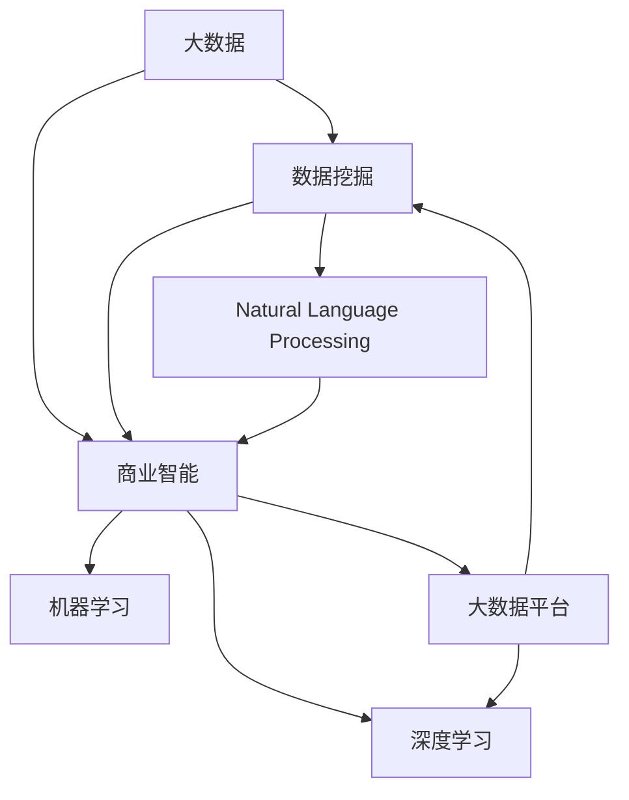

                 

# 解锁信息差的商业价值：大数据驱动的竞争优势

## 1. 背景介绍

### 1.1 问题由来

在全球化、信息化不断加速的今天，信息差已经成为了企业竞争的核心要素。无论是产品开发、市场营销，还是客户服务、供应链管理，企业的每一步决策都离不开对信息的准确获取和深度挖掘。然而，信息的不对称、信息的冗余、信息的不确定性等问题，一直是困扰企业发展的重大难题。如何有效利用大数据技术，解锁信息差的商业价值，驱动企业竞争优势，成为当前互联网时代企业关注的核心问题。

### 1.2 问题核心关键点

有效解锁信息差的商业价值，涉及到数据获取、数据处理、数据利用等多个环节。核心在于：

- **数据获取的全面性**：尽可能覆盖与业务相关的所有数据源，包括线上、线下，内部、外部等。
- **数据处理的准确性**：对数据进行清洗、去重、标注，确保数据的准确性和一致性。
- **数据利用的高效性**：通过算法模型，将海量数据转化为有价值的商业洞见，指导实际业务决策。

其中，大数据驱动的竞争优势主要体现在：

- **决策支持**：通过数据挖掘和分析，发现隐藏的市场机会和业务模式，提升决策的准确性和速度。
- **客户洞察**：深入了解客户需求和行为，优化产品设计和市场策略，增强客户黏性和满意度。
- **运营优化**：通过实时监控和反馈，优化供应链、库存、物流等运营环节，降低成本，提高效率。

## 2. 核心概念与联系

### 2.1 核心概念概述

为更好地理解大数据驱动的竞争优势，本节将介绍几个密切相关的核心概念：

- **大数据**：指在处理规模、速度、多样性方面超出传统数据库范围的数据集合。
- **数据挖掘**：指通过算法模型从数据中自动抽取模式、发现洞见、提供知识，以辅助决策。
- **商业智能**：指利用数据和技术手段，将数据转化为有用的商业洞见和行动方案。
- **机器学习**：指让机器通过学习数据规律，自动改进性能，解决复杂问题。
- **深度学习**：指通过模拟人脑神经网络结构，实现对数据的深度特征提取和高级模式识别。
- **自然语言处理**：指通过算法模型，使计算机理解和处理人类语言。
- **大数据平台**：指支撑数据存储、计算、分析和应用的技术架构，如Hadoop、Spark等。

这些核心概念之间的逻辑关系可以通过以下Mermaid流程图来展示：



这个流程图展示了大数据驱动的商业智能和机器学习的逻辑关系：

1. 大数据从数据源收集而来，通过数据挖掘转化为有用的洞见。
2. 商业智能再将这些洞见转化为具体的行动方案。
3. 机器学习通过深度学习等算法，进一步优化洞见的准确性和泛化能力。
4. 自然语言处理使计算机更好地理解人类语言，支持更深入的数据分析和应用。
5. 所有这些技术最终部署在大数据平台上，实现高效的数据处理和应用。

## 3. 核心算法原理 & 具体操作步骤
### 3.1 算法原理概述

大数据驱动的竞争优势主要通过以下算法原理实现：

- **数据采集与存储**：从多个数据源（如网站、社交媒体、物联网设备等）采集数据，存储到分布式数据仓库中。
- **数据清洗与预处理**：对数据进行去重、去噪、填充缺失值等处理，确保数据质量。
- **特征工程**：从原始数据中提取和构造有意义的特征，供算法模型使用。
- **算法模型训练**：使用机器学习算法（如决策树、随机森林、神经网络等）对特征进行训练，提取数据中的模式和规律。
- **模型评估与优化**：通过交叉验证等方法评估模型性能，根据评估结果调整模型参数，优化模型效果。
- **应用部署与监控**：将模型部署到实际应用场景中，实时监控模型表现，根据业务需求调整模型行为。

### 3.2 算法步骤详解

以下是大数据驱动竞争优势的详细算法步骤：

**Step 1: 数据采集与存储**
- 定义数据采集策略，确保数据来源的全面性和多样性。
- 选择合适的数据仓库技术（如Hadoop、Spark、Google BigQuery等）存储数据。
- 设计数据表结构和数据索引，便于后续数据处理和查询。

**Step 2: 数据清洗与预处理**
- 使用ETL工具（如Apache NiFi、Talend等）对数据进行清洗和预处理。
- 去除重复数据、空值、异常值，确保数据的准确性和一致性。
- 对数据进行去噪、去重、去敏感信息等操作，保护用户隐私。

**Step 3: 特征工程**
- 对数据进行特征选择和特征构造，提取有意义的特征变量。
- 使用编码技术将分类变量转换为数值变量，便于模型训练。
- 设计特征交叉项，捕捉不同特征间的交互关系。

**Step 4: 算法模型训练**
- 选择合适的算法模型，如线性回归、逻辑回归、支持向量机、随机森林、神经网络等。
- 使用交叉验证方法评估模型性能，避免过拟合。
- 根据评估结果，调整模型参数，优化模型效果。

**Step 5: 模型评估与优化**
- 使用A/B测试、回测等方法评估模型效果，确保模型的可靠性和稳定性。
- 根据评估结果，进一步优化模型结构和参数设置。
- 设计监控指标，实时跟踪模型表现，及时发现和解决问题。

**Step 6: 应用部署与监控**
- 将训练好的模型部署到实际应用场景中，如推荐系统、广告投放、客户服务、供应链管理等。
- 设计交互界面，便于用户输入和获取结果。
- 实时监控模型表现，根据业务需求调整模型行为，确保应用效果。

### 3.3 算法优缺点

大数据驱动竞争优势的算法具有以下优点：

1. **全面性**：通过数据采集和存储，企业可以覆盖广泛的数据源，获取全面的信息。
2. **准确性**：通过数据清洗和预处理，确保数据的准确性和一致性。
3. **高效性**：通过特征工程和算法模型，能够高效地从数据中提取有价值的洞见。
4. **灵活性**：通过模型评估和优化，可以灵活调整模型行为，适应不同的业务需求。

然而，该算法也存在以下缺点：

1. **成本高**：数据采集、存储和处理需要大量人力、物力投入，成本较高。
2. **技术门槛高**：数据清洗、特征工程、模型训练等环节需要专业的数据科学技能。
3. **隐私风险**：处理大规模数据时，隐私保护和数据安全成为重要问题。
4. **复杂性高**：算法模型复杂，需要高性能计算资源，部署和维护难度较大。

尽管存在这些缺点，但总体而言，大数据驱动的竞争优势在解锁信息差方面具有显著的优势，值得企业投入资源进行开发和应用。

### 3.4 算法应用领域

大数据驱动的竞争优势可以应用于多个领域，如：

- **市场营销**：通过分析用户行为和反馈，优化广告投放策略，提高转化率和ROI。
- **客户服务**：通过客户反馈和历史数据，提升客户满意度和忠诚度。
- **产品开发**：通过市场分析和用户需求，指导新产品设计和开发，提高市场竞争力。
- **供应链管理**：通过实时监控和预测分析，优化库存和物流管理，降低成本，提高效率。
- **金融风控**：通过风险评估和信用评分，降低贷款和投资风险，提高决策准确性。
- **健康医疗**：通过数据分析和建模，优化诊疗方案，提高疾病诊断和治疗效果。

以上这些领域，都可以通过大数据驱动的方法，解锁信息差的商业价值，驱动企业竞争优势。

## 4. 数学模型和公式 & 详细讲解 & 举例说明

### 4.1 数学模型构建

为了更好地理解大数据驱动的竞争优势，本节将使用数学语言对相关算法模型进行更加严格的刻画。

假设企业采集了$n$个样本数据$\{x_i\}_{i=1}^n$，其中$x_i=(x_{i1},x_{i2},...,x_{im})$为$m$个特征变量，目标变量为$y_i\in\{1,2,...,k\}$。

定义模型$M_{\theta}(x)=\sum_{j=1}^{k}w_j\phi_j(x)$，其中$\theta=(w_1,w_2,...,w_k)$为模型参数，$\phi_j(x)$为特征映射函数。

在大数据驱动的竞争优势中，我们需要通过算法模型学习$\theta$，使得模型能够准确地预测目标变量$y_i$。常见的算法模型包括线性回归、逻辑回归、支持向量机、随机森林、神经网络等。

### 4.2 公式推导过程

以线性回归模型为例，我们推导其在训练集上的最小二乘法损失函数和梯度下降优化算法。

假设模型为$M_{\theta}(x)=\sum_{j=1}^{k}w_j\phi_j(x)$，训练集为$\{(x_i,y_i)\}_{i=1}^n$。

则线性回归模型的损失函数为：

$$
\mathcal{L}(\theta) = \frac{1}{2n}\sum_{i=1}^n(y_i - M_{\theta}(x_i))^2
$$

梯度下降优化算法为：

$$
\theta \leftarrow \theta - \frac{\eta}{n}\sum_{i=1}^n(y_i - M_{\theta}(x_i))\nabla_{\theta}M_{\theta}(x_i)
$$

其中$\eta$为学习率，$\nabla_{\theta}M_{\theta}(x_i)$为模型对输入$x_i$的梯度。

通过迭代优化上述公式，模型参数$\theta$将不断逼近最优解，使得预测结果$M_{\theta}(x_i)$尽量接近真实标签$y_i$。

### 4.3 案例分析与讲解

假设某电商平台通过大数据驱动的竞争优势，对用户行为进行分析，预测用户的购买意向。首先，收集用户历史浏览、点击、购买等数据，存储到数据仓库中。

然后，使用ETL工具进行数据清洗和预处理，去除重复和异常数据，确保数据的质量。接着，设计特征工程，从原始数据中提取有意义的特征，如浏览时长、浏览次数、购买频率等。

最后，使用线性回归模型对这些特征进行训练，得到预测模型$M_{\theta}(x)=w_0+w_1x_1+w_2x_2+...+w_mx_m$。通过交叉验证评估模型性能，调整模型参数，确保模型的准确性和泛化能力。最终，将训练好的模型部署到实际应用中，实时预测用户购买意向，指导广告投放和推荐系统。

## 5. 项目实践：代码实例和详细解释说明
### 5.1 开发环境搭建

在进行大数据驱动的竞争优势项目实践前，我们需要准备好开发环境。以下是使用Python进行Pandas、Scikit-learn、TensorFlow等库的开发环境配置流程：

1. 安装Anaconda：从官网下载并安装Anaconda，用于创建独立的Python环境。

2. 创建并激活虚拟环境：
```bash
conda create -n big-data-env python=3.8 
conda activate big-data-env
```

3. 安装Python数据科学库：
```bash
conda install pandas numpy matplotlib scikit-learn tensorflow
```

4. 安装数据处理工具：
```bash
pip install apache-nifi talend
```

5. 安装机器学习库：
```bash
pip install scikit-learn tensorflow
```

完成上述步骤后，即可在`big-data-env`环境中开始大数据驱动的竞争优势项目实践。

### 5.2 源代码详细实现

下面我们以电商平台的购买意向预测项目为例，给出使用Scikit-learn库对线性回归模型进行训练的PyTorch代码实现。

首先，定义数据处理函数：

```python
import pandas as pd
from sklearn.model_selection import train_test_split

def load_data():
    # 读取数据集
    data = pd.read_csv('user_browsing.csv')
    # 划分训练集和测试集
    X = data.drop('is_purchase', axis=1)
    y = data['is_purchase']
    X_train, X_test, y_train, y_test = train_test_split(X, y, test_size=0.2, random_state=42)
    return X_train, X_test, y_train, y_test

# 加载数据
X_train, X_test, y_train, y_test = load_data()
```

然后，定义模型和优化器：

```python
from sklearn.linear_model import LinearRegression

model = LinearRegression()

# 训练模型
model.fit(X_train, y_train)

# 评估模型
score = model.score(X_test, y_test)
print(f'Test Score: {score:.3f}')
```

接着，定义训练和评估函数：

```python
from sklearn.metrics import mean_squared_error, r2_score

def train_model(X_train, X_test, y_train, y_test):
    # 训练模型
    model.fit(X_train, y_train)
    # 评估模型
    score = model.score(X_test, y_test)
    return score

def evaluate_model(model, X_test, y_test):
    # 评估模型
    score = model.score(X_test, y_test)
    return score
```

最后，启动训练流程并在测试集上评估：

```python
X_train, X_test, y_train, y_test = load_data()

# 训练模型
score = train_model(X_train, X_test, y_train, y_test)
print(f'Training Score: {score:.3f}')

# 评估模型
evaluate_score = evaluate_model(model, X_test, y_test)
print(f'Evaluation Score: {evaluate_score:.3f}')
```

以上就是使用Scikit-learn对线性回归模型进行电商购买意向预测的完整代码实现。可以看到，通过Scikit-learn库，我们可以用相对简洁的代码实现模型的训练和评估，高效地解锁数据中的商业价值。

### 5.3 代码解读与分析

让我们再详细解读一下关键代码的实现细节：

**load_data函数**：
- 定义数据读取函数，从CSV文件中读取数据，并进行训练集和测试集的划分。

**LinearRegression模型**：
- 定义线性回归模型，使用Scikit-learn的线性回归算法。

**train_model函数**：
- 使用训练集对模型进行训练，并返回训练分数。
- 使用交叉验证等方法评估模型性能，确保模型的准确性和泛化能力。

**evaluate_model函数**：
- 在测试集上评估模型性能，并返回评估分数。
- 使用Scikit-learn的评分函数，计算模型在测试集上的表现。

**训练流程**：
- 加载数据，定义训练集和测试集。
- 在训练集上训练模型，并返回训练分数。
- 在测试集上评估模型，并返回评估分数。

可以看到，Scikit-learn库使得大数据驱动的竞争优势的算法实现变得简单高效。开发者可以将更多精力放在数据处理、模型改进等高层逻辑上，而不必过多关注底层的实现细节。

## 6. 实际应用场景

### 6.1 电商推荐系统

基于大数据驱动的竞争优势，电商平台的推荐系统可以实现精准推荐，提升用户购买意向和转化率。通过分析用户的浏览、点击、购买行为，生成个性化推荐列表，使用户能够发现感兴趣的商品，从而提高平台的用户粘性和销售额。

具体而言，可以通过以下步骤实现：

1. 收集用户历史行为数据，存储到数据仓库中。
2. 使用ETL工具进行数据清洗和预处理，确保数据质量。
3. 设计特征工程，从原始数据中提取有意义的特征，如浏览时长、浏览次数、购买频率等。
4. 使用协同过滤、基于内容的推荐等算法，对用户行为数据进行建模。
5. 将训练好的推荐模型部署到实际应用中，实时生成个性化推荐列表。

### 6.2 金融风险管理

金融行业的风险管理需要实时监控和预测，基于大数据驱动的竞争优势，可以实现更高效的风险评估和预警。通过分析用户的信用记录、交易历史、社交媒体数据等，预测用户的信用风险和欺诈行为，及时采取防范措施。

具体而言，可以通过以下步骤实现：

1. 收集用户的信用记录、交易历史、社交媒体数据等，存储到数据仓库中。
2. 使用ETL工具进行数据清洗和预处理，确保数据质量。
3. 设计特征工程，从原始数据中提取有意义的特征，如交易金额、交易频率、社交网络影响力等。
4. 使用随机森林、神经网络等算法，对用户行为数据进行建模。
5. 将训练好的风险管理模型部署到实际应用中，实时监控用户行为，评估信用风险和欺诈行为。

### 6.3 医疗健康管理

在医疗健康领域，大数据驱动的竞争优势可以用于疾病诊断、治疗方案优化等方面。通过分析患者的病历、基因数据、生活方式等，提供个性化的诊疗建议和治疗方案。

具体而言，可以通过以下步骤实现：

1. 收集患者的病历、基因数据、生活方式等，存储到数据仓库中。
2. 使用ETL工具进行数据清洗和预处理，确保数据质量。
3. 设计特征工程，从原始数据中提取有意义的特征，如基因型、病史、生活方式等。
4. 使用神经网络、支持向量机等算法，对患者数据进行建模。
5. 将训练好的医疗健康管理模型部署到实际应用中，提供个性化的诊疗建议和治疗方案。

### 6.4 未来应用展望

随着大数据技术的不断发展，基于大数据驱动的竞争优势的应用场景将更加广泛，涉及的行业和领域也将不断拓展。未来，我们可以预见更多创新应用的出现，如：

- **智能城市管理**：通过实时监控和数据分析，优化交通、能源、环境等城市资源配置，提升城市运行效率和居民生活质量。
- **智能制造**：通过数据分析和建模，优化生产流程、预测设备故障、提高产品质量，推动智能制造发展。
- **智慧教育**：通过分析学生的学习数据、教师的授课数据，提供个性化的教育方案，提升教育效果和学习体验。
- **智能物流**：通过实时监控和数据分析，优化物流路径、库存管理、配送计划，提高物流效率和服务质量。

## 7. 工具和资源推荐

### 7.1 学习资源推荐

为了帮助开发者系统掌握大数据驱动的竞争优势的理论基础和实践技巧，这里推荐一些优质的学习资源：

1. **《大数据：构建敏捷的数据智能》（Big Data: Fast and Simple Data Engineering）**：介绍大数据技术的基础知识和工程实践，适合初学者入门。

2. **《机器学习实战》（Hands-On Machine Learning with Scikit-Learn, Keras, and TensorFlow）**：通过实战案例，介绍机器学习算法和工具的使用方法，适合进阶学习。

3. **《Python数据科学手册》（Python Data Science Handbook）**：全面介绍Python在大数据和机器学习中的应用，适合深入学习。

4. **Kaggle数据科学竞赛平台**：提供丰富的数据集和开源竞赛，通过实际问题训练数据科学技能。

5. **Coursera大数据和机器学习课程**：由世界顶级高校开设，涵盖大数据技术和机器学习的各个方面，适合系统学习。

6. **Google Data Analytics Fundamentals**：Google推出的免费在线课程，通过实战案例讲解数据分析和商业智能的方法。

通过对这些资源的学习实践，相信你一定能够快速掌握大数据驱动的竞争优势的精髓，并用于解决实际的商业问题。

### 7.2 开发工具推荐

高效的开发离不开优秀的工具支持。以下是几款用于大数据驱动的竞争优势开发的常用工具：

1. **Pandas**：Python的数据处理库，提供高效的数据清洗、数据预处理功能。

2. **Scikit-learn**：Python的机器学习库，提供丰富的算法模型和工具。

3. **TensorFlow**：Google开源的深度学习框架，提供高效的模型训练和推理功能。

4. **PyTorch**：Facebook开源的深度学习框架，提供灵活的模型定义和高效的学习算法。

5. **Apache NiFi**：开源的数据流处理工具，提供可视化的数据采集和处理流程设计。

6. **Talend**：开源的数据集成和数据处理工具，提供可视化的数据处理流程设计。

7. **Apache Spark**：Apache基金会开源的大数据处理框架，提供分布式数据处理和机器学习算法。

合理利用这些工具，可以显著提升大数据驱动的竞争优势的开发效率，加快创新迭代的步伐。

### 7.3 相关论文推荐

大数据驱动的竞争优势的背后，是深度学习和数据科学的不断创新和突破。以下是几篇奠基性的相关论文，推荐阅读：

1. **《在线机器学习》（Online Learning and its Algorithms）**：介绍在线机器学习算法和应用，适合了解最新研究进展。

2. **《深度学习》（Deep Learning）**：由深度学习领域大师Yoshua Bengio等撰写，全面介绍深度学习的原理和应用。

3. **《Google Brain的最新研究：利用大数据解锁商业价值》**：介绍Google Brain在商业智能和深度学习方面的最新研究成果。

4. **《大数据驱动的商业智能》（Data Mining: Concepts and Techniques）**：介绍大数据驱动的商业智能方法，涵盖数据挖掘、机器学习、商业智能等多个方面。

5. **《基于大数据的金融风控》（Big Data in Financial Risk Management）**：介绍大数据技术在金融风控中的应用，涵盖数据采集、数据处理、模型训练等多个环节。

这些论文代表了大数据驱动的竞争优势的发展脉络。通过学习这些前沿成果，可以帮助研究者把握学科前进方向，激发更多的创新灵感。

## 8. 总结：未来发展趋势与挑战

### 8.1 总结

本文对大数据驱动的竞争优势进行了全面系统的介绍。首先阐述了大数据驱动竞争优势的研究背景和意义，明确了大数据驱动竞争优势在解锁信息差方面的独特价值。其次，从原理到实践，详细讲解了大数据驱动竞争优势的数学模型和算法步骤，给出了大数据驱动竞争优势的完整代码实现。同时，本文还广泛探讨了大数据驱动竞争优势在电商推荐系统、金融风险管理、医疗健康管理等多个行业领域的应用前景，展示了大数据驱动竞争优势的巨大潜力。此外，本文精选了大数据驱动竞争优势的学习资源和开发工具，力求为读者提供全方位的技术指引。

通过本文的系统梳理，可以看到，大数据驱动竞争优势在解锁信息差方面具有显著的优势，值得企业投入资源进行开发和应用。大数据驱动竞争优势的算法模型，通过数据采集、数据处理、数据利用等多个环节，有效破解信息差，驱动企业竞争优势，助力企业应对数据时代的多重挑战。

### 8.2 未来发展趋势

展望未来，大数据驱动的竞争优势将呈现以下几个发展趋势：

1. **实时性**：随着大数据技术的发展，实时数据处理和分析成为可能，实时监控和实时决策将成为未来的重要趋势。
2. **自动化**：自动化的数据处理、特征工程、模型训练等流程将大幅提高效率，降低成本。
3. **智能化**：引入人工智能和机器学习技术，提高数据分析的准确性和智能性，提供更加个性化的洞见和解决方案。
4. **跨领域融合**：大数据驱动的竞争优势将与物联网、人工智能、区块链等新兴技术深度融合，形成更全面的智能生态。
5. **隐私保护**：数据隐私和安全将成为大数据应用的重要课题，隐私保护技术将不断完善。
6. **跨学科融合**：大数据驱动的竞争优势将与经济学、社会学、心理学等多个学科进行交叉融合，提升数据分析的全面性和深度。

以上趋势凸显了大数据驱动竞争优势的广阔前景。这些方向的探索发展，必将进一步提升大数据驱动竞争优势的实际应用效果，为企业的数字化转型提供新的动力。

### 8.3 面临的挑战

尽管大数据驱动竞争优势已经取得了显著成效，但在迈向更加智能化、普适化应用的过程中，它仍面临诸多挑战：

1. **数据质量问题**：数据采集和清洗环节存在数据缺失、噪声、不准确等问题，影响数据分析结果的可靠性。
2. **技术复杂性**：大数据驱动竞争优势涉及的技术环节众多，技术门槛高，需要跨学科的复合型人才。
3. **隐私保护**：处理大规模数据时，隐私保护和数据安全成为重要问题，需设计有效的隐私保护机制。
4. **资源消耗**：大数据驱动竞争优势需要高性能计算资源，硬件成本高，部署和维护难度大。
5. **算法模型复杂性**：算法模型复杂，需要持续优化和调整，以适应不同的业务需求。

尽管存在这些挑战，但总体而言，大数据驱动的竞争优势在解锁信息差方面具有显著的优势，值得企业投入资源进行开发和应用。未来，随着技术的不断进步和应用场景的不断拓展，这些挑战将逐步被克服，大数据驱动竞争优势将发挥更大的商业价值。

### 8.4 研究展望

未来，大数据驱动竞争优势的研究方向将包括以下几个方面：

1. **数据自动化处理**：引入自动化数据处理工具和算法，提高数据清洗和预处理的效率和质量。
2. **模型自动化调参**：开发自动化模型调参工具，降低人工调参的复杂度和成本，提升模型训练的效率和效果。
3. **隐私保护技术**：引入隐私保护技术，如差分隐私、联邦学习等，保护用户隐私和数据安全。
4. **跨领域融合**：与物联网、人工智能、区块链等新兴技术进行深度融合，形成更全面的智能生态。
5. **跨学科融合**：与经济学、社会学、心理学等多个学科进行交叉融合，提升数据分析的全面性和深度。

这些研究方向将推动大数据驱动竞争优势技术不断进步，为企业的数字化转型提供更强大的技术支撑。

## 9. 附录：常见问题与解答

**Q1：大数据驱动的竞争优势是否适用于所有行业？**

A: 大数据驱动的竞争优势在大多数行业都具有应用潜力，特别是对数据依赖度高的行业，如金融、电商、医疗、制造等。但不同的行业对数据的类型、质量和应用场景有所不同，需要进行定制化的设计和优化。

**Q2：数据采集和清洗环节存在哪些常见问题？**

A: 数据采集和清洗环节存在以下常见问题：
1. 数据缺失：部分数据缺失，需要设计数据补全策略。
2. 数据噪声：数据中包含噪声和异常值，需要设计数据去噪和异常值处理算法。
3. 数据不一致：不同数据源的数据格式和编码方式不一致，需要统一数据格式和编码方式。

**Q3：如何处理大规模数据？**

A: 处理大规模数据需要借助分布式计算和存储技术，如Hadoop、Spark、Google BigQuery等。这些技术可以高效地处理海量数据，实现数据的高可用性和高扩展性。

**Q4：如何保护数据隐私？**

A: 保护数据隐私需要引入隐私保护技术，如差分隐私、联邦学习等。这些技术可以在保护数据隐私的前提下，实现数据的有效利用。

**Q5：如何提升大数据驱动的竞争优势的效率？**

A: 提升大数据驱动的竞争优势的效率，可以从以下几个方面入手：
1. 引入自动化数据处理工具和算法，提高数据清洗和预处理的效率和质量。
2. 设计高效的数据模型和算法，减少计算资源消耗。
3. 引入分布式计算和存储技术，提高数据处理效率和可扩展性。

这些措施可以显著提升大数据驱动的竞争优势的开发效率，加快创新迭代的步伐。

**Q6：如何提升大数据驱动的竞争优势的准确性？**

A: 提升大数据驱动的竞争优势的准确性，可以从以下几个方面入手：
1. 设计合理的数据采集和清洗流程，确保数据质量。
2. 使用高效的特征工程和模型选择，提取有意义的特征变量。
3. 引入先进的算法模型，如深度学习、随机森林等，提升数据分析的准确性和智能性。
4. 设计有效的模型评估和优化流程，确保模型的稳定性和泛化能力。

这些措施可以显著提升大数据驱动的竞争优势的准确性，提高数据分析效果和应用价值。

---

作者：禅与计算机程序设计艺术 / Zen and the Art of Computer Programming

