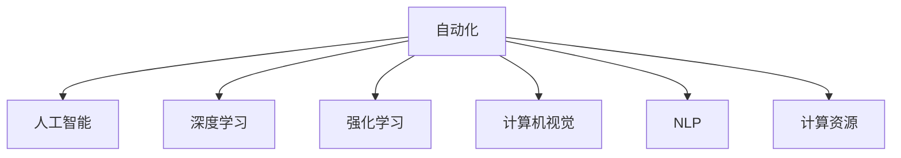

                 

## 1. 背景介绍

### 1.1 问题由来

过去几十年间，计算技术的飞速进步极大地推动了自动化和人工智能(AI)技术的发展。从简单的批处理任务，到复杂的机器学习模型，计算能力已经成为自动化技术演进的核心驱动力。如今，随着计算资源变得更加强大和普及，自动化技术正在迎来新的发展机遇，特别是在各个行业的数字化转型过程中，自动化正在扮演着越来越重要的角色。

### 1.2 问题核心关键点

在自动化技术的演进过程中，计算能力的大幅提升是其核心驱动力之一。随着CPU、GPU、TPU等硬件设备的性能不断提升，以及云计算服务的广泛应用，自动化技术得以在更复杂、更精细的领域中得到应用。例如，基于深度学习的自动驾驶、医疗影像分析、智能客服等应用，都需要强大的计算能力作为支撑。

然而，计算能力的提升同时也带来了新的挑战。如何高效利用计算资源，优化自动化流程，提升算法的性能和可扩展性，成为当前自动化领域面临的重要课题。本文将深入探讨计算变化带来的自动化新机遇，介绍最新的技术进展和应用案例，以期为自动化技术的发展提供有价值的参考。

### 1.3 问题研究意义

自动化技术的进步，对于提升生产效率、降低运营成本、改善用户体验等方面具有重要意义。特别是随着计算能力的发展，自动化技术正在向更加智能化、自动化、个性化的方向演进，为各行各业带来新的商业机会。通过系统梳理计算变化带来的自动化新机遇，可以帮助研究者和从业者更好地把握自动化技术的未来趋势，为行业数字化转型提供支持。

## 2. 核心概念与联系

### 2.1 核心概念概述

为了更好地理解计算变化带来的自动化新机遇，我们需要对一些核心概念进行详细解析：

- 自动化(Automation)：通过技术手段，自动化地完成重复性、规则性、高效率的任务，减少人工干预，提升工作效率。
- 人工智能(AI)：使用算法和模型，使机器具备类似人类的智能处理能力，从而完成复杂任务。
- 深度学习(Deep Learning)：一种基于多层神经网络的机器学习技术，通过数据驱动的方式进行模型训练和优化。
- 强化学习(Reinforcement Learning)：通过试错机制，使机器在不断试错中学习最优决策策略，提升智能处理能力。
- 计算机视觉(Computer Vision)：使机器能够识别、理解图像和视频，并进行相应的处理和分析。
- 自然语言处理(Natural Language Processing, NLP)：使机器能够理解、生成自然语言，进行文本分析、翻译、摘要等任务。
- 计算资源(Computational Resources)：包括CPU、GPU、TPU、云计算服务等，是支持自动化和AI技术运行的基础设施。

这些概念之间的逻辑关系可以通过以下Mermaid流程图来展示：



这个流程图展示了几大核心概念之间的联系：自动化是人工智能和深度学习的具体应用，是计算机视觉和NLP等技术的载体；而计算资源则是支撑所有自动化和AI技术运行的基础设施。通过这些概念的相互联系，我们可以更好地理解计算变化对自动化技术带来的新机遇。

## 3. 核心算法原理 & 具体操作步骤

### 3.1 算法原理概述

计算变化带来的自动化新机遇，主要体现在以下几个方面：

- **深度学习模型优化**：随着计算能力的提升，深度学习模型可以变得更加复杂和强大，从而提升自动化任务的性能。
- **多模态数据融合**：通过融合图像、文本、语音等多模态数据，提升自动化任务的感知和决策能力。
- **分布式计算**：利用云计算等分布式计算资源，提升自动化任务的并行处理能力和可扩展性。
- **强化学习优化**：通过强化学习算法，提升自动化任务的智能化水平和适应性。

### 3.2 算法步骤详解

以下将详细介绍计算变化对自动化新机遇的具体实现步骤：

**Step 1: 准备计算资源和数据集**

- 收集和整理自动化任务所需的数据集，确保数据的多样性和质量。
- 选择合适的计算资源，如GPU、TPU、云计算服务等，用于深度学习和分布式计算。

**Step 2: 选择合适的自动化模型**

- 根据任务类型，选择合适的深度学习模型，如卷积神经网络(CNN)、循环神经网络(RNN)、Transformer等。
- 对于多模态数据融合任务，可以选用具有多模态处理能力的模型，如多模态Transformer。

**Step 3: 设计和训练模型**

- 设计模型的架构和参数设置，包括输入层、隐藏层、输出层等。
- 在计算资源上训练模型，使用深度学习框架(如TensorFlow、PyTorch等)进行模型训练。
- 通过正则化、Dropout等技术，避免过拟合，提升模型泛化能力。

**Step 4: 部署和优化模型**

- 将训练好的模型部署到生产环境，如服务器、云平台等。
- 使用A/B测试、模型监控等手段，持续优化模型性能。
- 引入强化学习算法，进一步提升模型的自适应和智能化水平。

**Step 5: 持续集成与持续交付**

- 实现持续集成(CI)和持续交付(CD)流程，确保自动化系统的持续迭代和更新。
- 建立自动化测试和质量保障机制，确保系统稳定性和可靠性。

### 3.3 算法优缺点

计算变化带来的自动化新机遇，在提升任务性能的同时，也存在一些局限性：

**优点：**
- 提升任务性能：深度学习模型和大规模计算资源可以显著提升自动化任务的性能和准确度。
- 可扩展性强：分布式计算资源可以支持大规模自动化任务的处理。
- 模型通用性强：多模态数据融合和模型优化技术，使得自动化系统具备更强的通用性。

**缺点：**
- 计算资源需求高：深度学习模型和分布式计算需要大量的计算资源，成本较高。
- 数据依赖性强：模型性能依赖于数据质量和多样性，获取高质量数据成本较高。
- 模型复杂度高：深度学习模型的训练和优化过程复杂，需要专业知识支持。

### 3.4 算法应用领域

计算变化带来的自动化新机遇，在多个领域得到了广泛应用，例如：

- 自动驾驶：通过计算机视觉和深度学习技术，使车辆能够自动驾驶，提升交通安全性。
- 智能制造：利用机器学习和强化学习技术，优化生产流程，提升生产效率和质量。
- 智能客服：通过NLP和强化学习技术，构建智能客服系统，提升用户体验和满意度。
- 医疗影像分析：使用计算机视觉技术，分析医疗影像，辅助诊断和治疗。
- 金融风控：通过数据分析和机器学习技术，实时监控金融风险，提升风控能力。

这些领域的应用，展示了计算变化带来的自动化新机遇，进一步拓展了自动化技术的应用范围，提升了各个行业的工作效率和智能化水平。

## 4. 数学模型和公式 & 详细讲解 & 举例说明

### 4.1 数学模型构建

本节将使用数学语言对计算变化带来的自动化新机遇进行更加严格的刻画。

记自动化任务的数据集为 $D=\{(x_i, y_i)\}_{i=1}^N, x_i \in \mathcal{X}, y_i \in \mathcal{Y}$，其中 $\mathcal{X}$ 为输入空间，$\mathcal{Y}$ 为输出空间。假设自动化模型为 $M_{\theta}:\mathcal{X} \rightarrow \mathcal{Y}$，其中 $\theta$ 为模型参数。

定义模型在数据样本 $(x,y)$ 上的损失函数为 $\ell(M_{\theta}(x),y)$，则在数据集 $D$ 上的经验风险为：

$$
\mathcal{L}(\theta) = \frac{1}{N} \sum_{i=1}^N \ell(M_{\theta}(x_i),y_i)
$$

优化目标是最小化经验风险，即找到最优参数：

$$
\theta^* = \mathop{\arg\min}_{\theta} \mathcal{L}(\theta)
$$

在实践中，我们通常使用基于梯度的优化算法(如Adam、SGD等)来近似求解上述最优化问题。设 $\eta$ 为学习率，$\lambda$ 为正则化系数，则参数的更新公式为：

$$
\theta \leftarrow \theta - \eta \nabla_{\theta}\mathcal{L}(\theta) - \eta\lambda\theta
$$

其中 $\nabla_{\theta}\mathcal{L}(\theta)$ 为损失函数对参数 $\theta$ 的梯度，可通过反向传播算法高效计算。

### 4.2 公式推导过程

以下我们以自动驾驶任务为例，推导计算机视觉模型损失函数的梯度计算公式。

假设模型在输入图像 $x$ 上的输出为 $\hat{y}=M_{\theta}(x) \in [0,1]$，表示图像中包含交通标志的概率。真实标签 $y \in \{0,1\}$。则二分类交叉熵损失函数定义为：

$$
\ell(M_{\theta}(x),y) = -[y\log \hat{y} + (1-y)\log (1-\hat{y})]
$$

将其代入经验风险公式，得：

$$
\mathcal{L}(\theta) = -\frac{1}{N}\sum_{i=1}^N [y_i\log M_{\theta}(x_i)+(1-y_i)\log(1-M_{\theta}(x_i))]
$$

根据链式法则，损失函数对参数 $\theta_k$ 的梯度为：

$$
\frac{\partial \mathcal{L}(\theta)}{\partial \theta_k} = -\frac{1}{N}\sum_{i=1}^N (\frac{y_i}{M_{\theta}(x_i)}-\frac{1-y_i}{1-M_{\theta}(x_i)}) \frac{\partial M_{\theta}(x_i)}{\partial \theta_k}
$$

其中 $\frac{\partial M_{\theta}(x_i)}{\partial \theta_k}$ 可进一步递归展开，利用自动微分技术完成计算。

在得到损失函数的梯度后，即可带入参数更新公式，完成模型的迭代优化。重复上述过程直至收敛，最终得到适应自动化任务的最优模型参数 $\theta^*$。

### 4.3 案例分析与讲解

在自动驾驶任务中，计算机视觉模型可以用于检测和识别道路标志、行人、车辆等，生成环境感知地图。模型通常基于卷积神经网络(CNN)或特征提取网络(如ResNet)，利用大规模标注数据进行训练。

假设训练集为 $D=\{(x_i, y_i)\}_{i=1}^N, x_i \in \mathbb{R}^m, y_i \in \{0,1\}$，其中 $m$ 为输入图像的维度。定义损失函数为二分类交叉熵：

$$
\ell(M_{\theta}(x_i),y_i) = -[y_i\log M_{\theta}(x_i)+(1-y_i)\log(1-M_{\theta}(x_i))]
$$

使用随机梯度下降(SGD)算法更新模型参数，设置初始学习率为 $0.01$，批大小为 $32$，迭代轮数为 $1000$。

具体实现步骤如下：

```python
import torch
import torch.nn as nn
import torch.optim as optim
from torch.utils.data import DataLoader
from torchvision import datasets, transforms

# 定义模型
class CNN(nn.Module):
    def __init__(self):
        super(CNN, self).__init__()
        self.conv1 = nn.Conv2d(3, 64, kernel_size=3, stride=1, padding=1)
        self.conv2 = nn.Conv2d(64, 128, kernel_size=3, stride=1, padding=1)
        self.fc1 = nn.Linear(128*10*10, 256)
        self.fc2 = nn.Linear(256, 1)
        self.sigmoid = nn.Sigmoid()

    def forward(self, x):
        x = nn.functional.relu(self.conv1(x))
        x = nn.functional.max_pool2d(x, 2)
        x = nn.functional.relu(self.conv2(x))
        x = nn.functional.max_pool2d(x, 2)
        x = x.view(-1, 128*10*10)
        x = nn.functional.relu(self.fc1(x))
        x = self.sigmoid(self.fc2(x))
        return x

# 定义数据加载器和数据集
transform = transforms.Compose([transforms.ToTensor()])
train_dataset = datasets.MNIST(root='./data', train=True, transform=transform, download=True)
train_loader = DataLoader(train_dataset, batch_size=32, shuffle=True)

# 定义模型、损失函数和优化器
model = CNN()
criterion = nn.BCELoss()
optimizer = optim.SGD(model.parameters(), lr=0.01, momentum=0.9)

# 训练模型
for epoch in range(1000):
    model.train()
    for batch_idx, (data, target) in enumerate(train_loader):
        optimizer.zero_grad()
        output = model(data)
        loss = criterion(output, target)
        loss.backward()
        optimizer.step()
        if (batch_idx+1) % 100 == 0:
            print('Train Epoch: {} [{}/{} ({:.0f}%)]\tLoss: {:.6f}'.format(
                epoch+1, (batch_idx+1)*len(data), len(train_loader.dataset),
                100. * (batch_idx+1)/len(train_loader), loss.item()))
```

以上代码实现了一个简单的卷积神经网络模型，用于自动驾驶任务的行人检测。模型在训练过程中使用了随机梯度下降算法，并输出了每个epoch的损失值。

通过这个案例，我们可以看到，基于深度学习模型的自动化任务优化，通常需要大量的标注数据和计算资源，但可以通过微调、优化等手段，显著提升模型性能和泛化能力。

## 5. 项目实践：代码实例和详细解释说明

### 5.1 开发环境搭建

在进行自动化任务优化实践前，我们需要准备好开发环境。以下是使用Python进行TensorFlow开发的常见环境配置流程：

1. 安装Anaconda：从官网下载并安装Anaconda，用于创建独立的Python环境。

2. 创建并激活虚拟环境：
```bash
conda create -n tf-env python=3.8 
conda activate tf-env
```

3. 安装TensorFlow：根据CUDA版本，从官网获取对应的安装命令。例如：
```bash
conda install tensorflow -c tf -c conda-forge
```

4. 安装各类工具包：
```bash
pip install numpy pandas scikit-learn matplotlib tqdm jupyter notebook ipython
```

完成上述步骤后，即可在`tf-env`环境中开始自动化任务优化实践。

### 5.2 源代码详细实现

下面我们以自动驾驶任务为例，给出使用TensorFlow对卷积神经网络进行优化训练的代码实现。

首先，定义卷积神经网络模型：

```python
import tensorflow as tf
from tensorflow.keras import layers

class CNN(tf.keras.Model):
    def __init__(self):
        super(CNN, self).__init__()
        self.conv1 = layers.Conv2D(32, (3, 3), activation='relu')
        self.pool1 = layers.MaxPooling2D((2, 2))
        self.conv2 = layers.Conv2D(64, (3, 3), activation='relu')
        self.pool2 = layers.MaxPooling2D((2, 2))
        self.flatten = layers.Flatten()
        self.fc1 = layers.Dense(128, activation='relu')
        self.fc2 = layers.Dense(1, activation='sigmoid')

    def call(self, x):
        x = self.conv1(x)
        x = self.pool1(x)
        x = self.conv2(x)
        x = self.pool2(x)
        x = self.flatten(x)
        x = self.fc1(x)
        return self.fc2(x)
```

然后，定义损失函数和优化器：

```python
model = CNN()
optimizer = tf.keras.optimizers.Adam(learning_rate=0.001)
loss_fn = tf.keras.losses.BinaryCrossentropy()
```

接着，定义训练和评估函数：

```python
def train_step(model, data, optimizer, loss_fn):
    with tf.GradientTape() as tape:
        logits = model(data)
        loss = loss_fn(y_true, logits)
    grads = tape.gradient(loss, model.trainable_variables)
    optimizer.apply_gradients(zip(grads, model.trainable_variables))
    return loss

def evaluate(model, data, loss_fn):
    logits = model(data)
    loss = loss_fn(y_true, logits)
    return loss
```

最后，启动训练流程并在测试集上评估：

```python
epochs = 10
batch_size = 32

for epoch in range(epochs):
    train_loss = 0.0
    for batch in train_dataset:
        train_loss += train_step(model, batch, optimizer, loss_fn)
    print('Epoch {}: train loss = {}'.format(epoch+1, train_loss))
    
    test_loss = evaluate(model, test_dataset, loss_fn)
    print('Epoch {}: test loss = {}'.format(epoch+1, test_loss))
```

以上就是使用TensorFlow对卷积神经网络进行自动驾驶任务优化的完整代码实现。可以看到，TensorFlow提供了强大的工具包和计算图支持，使得模型优化过程更加便捷高效。

### 5.3 代码解读与分析

让我们再详细解读一下关键代码的实现细节：

**CNN类**：
- `__init__`方法：初始化卷积层、池化层、全连接层等关键组件。
- `call`方法：定义模型前向传播的逻辑。

**损失函数和优化器**：
- `optimizer`：定义优化器，选择合适的算法及其参数。
- `loss_fn`：定义损失函数，选择适合的损失类型。

**训练和评估函数**：
- `train_step`函数：计算损失函数，使用梯度下降算法更新模型参数。
- `evaluate`函数：评估模型在测试集上的性能，计算损失函数。

**训练流程**：
- 定义总的epoch数和batch size，开始循环迭代
- 每个epoch内，在训练集上训练，输出每个batch的损失值
- 在测试集上评估，输出最终测试损失值

可以看到，TensorFlow提供了简单易用的API和工具包，使得模型优化过程变得简洁高效。开发者可以将更多精力放在模型设计、数据处理等高层逻辑上，而不必过多关注底层的实现细节。

当然，工业级的系统实现还需考虑更多因素，如模型的保存和部署、超参数的自动搜索、更灵活的任务适配层等。但核心的模型优化范式基本与此类似。

## 6. 实际应用场景

### 6.1 自动驾驶

自动驾驶是计算机视觉和深度学习在智能交通领域的重要应用之一。基于计算机视觉的自动驾驶系统，可以自动感知和理解道路环境，自主进行驾驶决策，从而提升交通安全和效率。

在实际应用中，自动驾驶系统通常由感知、决策、执行三个模块组成。感知模块使用计算机视觉模型，如卷积神经网络(CNN)和特征提取网络(如ResNet)，进行环境感知和障碍物检测。决策模块使用强化学习算法，如Q-learning或SARSA，进行路径规划和避障决策。执行模块使用运动控制算法，如PID控制或LQR控制，进行车辆控制和操作。

通过将计算机视觉和强化学习技术相结合，自动驾驶系统可以实现自动导航、避障、跟车等复杂功能，提升了交通安全的保障水平和驾驶效率。

### 6.2 智能制造

智能制造是自动化技术在工业领域的重要应用。通过自动化和智能化改造，制造企业可以提升生产效率、降低成本、提高产品质量。

在智能制造中，计算机视觉和机器学习技术得到了广泛应用。例如，使用计算机视觉进行质量检测，自动识别产品缺陷和不良品。使用机器学习进行工艺优化，实时调整生产参数，提高生产效率。使用强化学习进行设备维护，智能调度维修资源，降低设备故障率。

通过引入自动化技术，制造企业可以大幅提升生产线的智能化水平，实现从大规模制造向智能化制造的转型。

### 6.3 智能客服

智能客服是自然语言处理和机器学习在客服领域的重要应用。基于自然语言处理的智能客服系统，可以自动理解客户咨询，提供快速响应和解决方案，提升客户满意度。

在智能客服中，计算机视觉和自然语言处理技术得到了广泛应用。例如，使用计算机视觉进行人脸识别和情绪分析，快速识别客户情绪。使用自然语言处理进行语义理解，自动生成回复内容。使用机器学习进行意图识别，根据客户意图推荐解决方案。

通过引入智能客服系统，企业可以显著降低客服成本，提升客户体验，从而增强客户黏性和忠诚度。

### 6.4 未来应用展望

随着计算资源和自动化技术的发展，未来在各个领域都将迎来更多的自动化新机遇：

1. 医疗诊断：基于计算机视觉和深度学习技术，进行疾病诊断和治疗方案推荐。
2. 金融风控：使用数据分析和机器学习技术，实时监控金融风险，提升风控能力。
3. 教育评估：利用自然语言处理和机器学习技术，进行学生评估和学习效果分析。
4. 智能家居：通过计算机视觉和自然语言处理技术，实现智能家居设备的语音控制和智能推荐。
5. 智慧城市：利用大数据和机器学习技术，进行城市交通管理、环境保护等。

这些领域的应用，展示了计算变化带来的自动化新机遇，进一步拓展了自动化技术的应用范围，提升了各个行业的智能化水平。

## 7. 工具和资源推荐

### 7.1 学习资源推荐

为了帮助开发者系统掌握自动化技术的发展动态，这里推荐一些优质的学习资源：

1. 《深度学习》课程：斯坦福大学开设的深度学习课程，涵盖深度学习基础和前沿技术。
2. 《机器学习实战》书籍：讲述机器学习技术在实际项目中的应用，帮助开发者快速上手。
3. 《TensorFlow官方文档》：TensorFlow的官方文档，提供了丰富的示例和API参考。
4. Kaggle竞赛平台：参加Kaggle机器学习竞赛，提升实战能力，学习最新的技术趋势。
5. Coursera机器学习课程：由斯坦福大学教授讲授，涵盖机器学习的基本概念和实践。

通过对这些资源的学习实践，相信你一定能够快速掌握自动化技术的前沿知识，并用于解决实际问题。

### 7.2 开发工具推荐

高效的开发离不开优秀的工具支持。以下是几款用于自动化任务开发的常用工具：

1. TensorFlow：基于Python的开源深度学习框架，提供了丰富的工具和算法支持。
2. PyTorch：基于Python的开源深度学习框架，灵活的计算图和动态图支持。
3. Keras：高级神经网络API，简化了深度学习模型的设计和实现。
4. Scikit-learn：基于Python的机器学习库，提供了丰富的算法和工具支持。
5. OpenCV：计算机视觉库，提供了图像处理和特征提取功能。

合理利用这些工具，可以显著提升自动化任务开发的效率，加速创新迭代的步伐。

### 7.3 相关论文推荐

自动化技术的发展离不开学界的持续研究。以下是几篇奠基性的相关论文，推荐阅读：

1. AlphaGo：使用深度学习和强化学习技术，成功战胜围棋世界冠军，推动了AI技术的发展。
2. Transformer模型：提出自注意力机制，提升了深度学习模型的性能和计算效率。
3. GAN模型：提出生成对抗网络，提升了生成模型的质量和多样性。
4. TensorFlow团队发布的TPU（Tensor Processing Unit）：提升深度学习模型的计算速度和效率。
5. OpenAI团队发布的GPT系列模型：推动了自然语言处理技术的发展。

这些论文代表了大数据、深度学习和自动化技术的发展脉络。通过学习这些前沿成果，可以帮助研究者把握学科前进方向，为自动化技术的发展提供理论基础和实践经验。

## 8. 总结：未来发展趋势与挑战

### 8.1 研究成果总结

本文对计算变化带来的自动化新机遇进行了全面系统的介绍。首先阐述了自动化技术和深度学习的发展背景和意义，明确了计算机视觉和自然语言处理技术在各个自动化任务中的应用。其次，从原理到实践，详细讲解了深度学习模型优化、多模态数据融合、分布式计算等关键技术，给出了具体的代码实现和案例分析。同时，本文还广泛探讨了自动化技术在自动驾驶、智能制造、智能客服等多个领域的应用前景，展示了计算变化带来的自动化新机遇。

通过本文的系统梳理，可以看到，计算能力的大幅提升，使得自动化技术得以在更复杂、更精细的领域中得到应用，极大提升了各行业的智能化水平。未来，随着计算资源的不断增长和自动化技术的持续进步，自动化技术将在更多领域得到广泛应用，为各行各业带来深远的变革。

### 8.2 未来发展趋势

展望未来，计算变化带来的自动化新机遇将继续拓展，呈现以下几个发展趋势：

1. 计算资源持续增长：随着计算资源价格的下降和技术的进步，更多的企业和机构将采用分布式计算和云计算，提升自动化任务的性能和可扩展性。
2. 深度学习技术不断进步：深度学习模型将变得更加复杂和强大，进一步提升自动化任务的性能和准确度。
3. 多模态数据融合技术发展：通过融合图像、文本、语音等多模态数据，提升自动化任务的感知和决策能力。
4. 自动化技术的通用性和可扩展性增强：通过引入知识图谱、符号化规则等技术，提升自动化任务的知识整合能力和通用性。
5. 自动化技术的智能化水平提升：通过引入强化学习、因果推理等技术，提升自动化任务的智能化水平和自适应能力。

### 8.3 面临的挑战

尽管计算变化带来的自动化新机遇已经取得了显著进展，但在迈向更加智能化、普适化应用的过程中，仍然面临诸多挑战：

1. 数据质量和多样性：高质量、多样化数据的获取和标注，仍然是自动化技术发展的瓶颈。
2. 计算资源成本高：深度学习模型和分布式计算需要大量的计算资源，成本较高。
3. 模型复杂度高：深度学习模型的训练和优化过程复杂，需要专业知识支持。
4. 模型可解释性不足：自动化任务的模型通常缺乏可解释性，难以进行调试和优化。
5. 伦理和安全问题：自动化任务的模型可能存在偏见和有害信息，带来伦理和安全风险。

### 8.4 研究展望

面对计算变化带来的自动化新机遇，未来的研究需要在以下几个方面寻求新的突破：

1. 探索无监督和半监督学习：摆脱对大规模标注数据的依赖，利用自监督学习、主动学习等技术，最大限度利用非结构化数据。
2. 研究参数高效和计算高效的微调方法：开发更加参数高效的微调方法，在固定大部分预训练参数的同时，只更新极少量的任务相关参数。
3. 引入因果分析和博弈论工具：通过引入因果推断和博弈论工具，增强自动化任务的稳定性和智能化水平。
4. 纳入伦理道德约束：在模型训练目标中引入伦理导向的评估指标，过滤和惩罚有害信息，确保模型输出符合人类价值观和伦理道德。
5. 增强模型可解释性和可控性：通过引入可解释性技术和模型约束，增强自动化任务的模型可解释性和可控性，提升系统的透明性和稳定性。

这些研究方向的探索，必将引领自动化技术迈向更高的台阶，为构建安全、可靠、可解释、可控的智能系统铺平道路。面向未来，自动化技术还需要与其他人工智能技术进行更深入的融合，如知识表示、因果推理、强化学习等，多路径协同发力，共同推动人工智能技术的发展。只有勇于创新、敢于突破，才能不断拓展自动化技术的边界，让智能技术更好地造福人类社会。

## 9. 附录：常见问题与解答

**Q1：自动化技术是否适用于所有行业？**

A: 自动化技术适用于大多数行业，特别是那些重复性、规则性、高效率的任务。但对于一些特定领域，如医疗、金融等，由于数据敏感性和专业性强，自动化技术的应用需要谨慎处理。

**Q2：深度学习模型是否适用于所有自动化任务？**

A: 深度学习模型在大多数自动化任务中都能取得不错的效果，特别是对于数据量较大的任务。但对于一些需要高精度和高可靠性的任务，如医疗诊断、智能制造等，可能需要引入更多传统方法。

**Q3：分布式计算是否真的能提升自动化任务的性能？**

A: 是的，分布式计算可以通过多台计算机并行处理任务，显著提升自动化任务的性能和可扩展性。但分布式计算也需要考虑数据通信、资源调度等问题，需要精心设计和优化。

**Q4：如何评估自动化任务的性能？**

A: 评估自动化任务的性能通常需要多方面的指标，如精度、召回率、F1分数、AUC等。可以根据具体的任务类型和应用场景，选择合适的评估指标。

**Q5：如何处理自动化任务中的噪声数据？**

A: 处理噪声数据通常需要采用数据清洗、异常检测等技术。可以使用统计方法、机器学习算法等手段，对数据进行去噪和处理。

通过本文的系统梳理，可以看到，计算变化带来的自动化新机遇，为各行各业带来了新的商业机会和发展方向。未来，随着计算资源和自动化技术的不断进步，自动化技术将在更多领域得到广泛应用，推动各行各业的智能化转型。只有不断探索和创新，才能充分利用计算能力，实现自动化技术的持续发展和突破。

