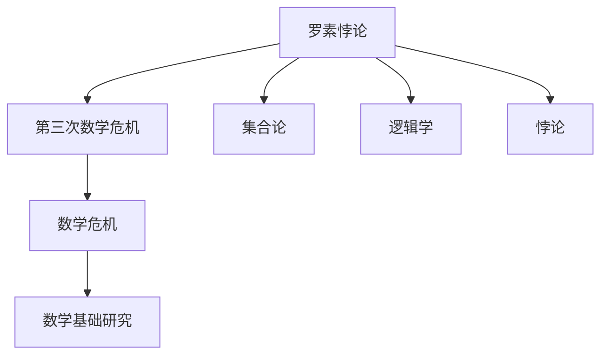

                 

# 计算：第二部分 计算的数学基础 第 5 章 第三次数学危机 危机：罗素悖论

> 关键词：罗素悖论, 数学危机, 集合理论, 逻辑学, 悖论解, 理论数学

## 1. 背景介绍

### 1.1 问题由来
第三次数学危机是数学史上的一次重大理论风波，首次在数学内部产生深刻分歧，并引起了哲学家、逻辑学家和数学家的广泛讨论。危机的导火索是罗素悖论，一个看似简单却深刻震撼了整个数学界的问题。这场危机不仅影响了数学基础的研究，还推动了逻辑学、计算理论、集合论等多门学科的进步。

### 1.2 问题核心关键点
罗素悖论提出了一个集合悖论，即集合A包含自身的问题。集合A可以定义为“所有不属于自身的集合组成的集合”。但这样一来，A是否属于自身呢？若A属于自身，则不符合A的定义；若A不属于自身，则A的定义又包含了A，这导致了矛盾。罗素悖论揭示了集合理论自身的不自洽性，激发了对现有数学体系的反思和修正。

## 2. 核心概念与联系

### 2.1 核心概念概述

- **罗素悖论**：一个关于集合论的悖论，由伯特兰·罗素提出。罗素悖论揭示了集合理论自身的不自洽性，引发了数学界的深刻思考。

- **第三次数学危机**：罗素悖论引发的对现有数学体系的质疑和反思，标志着数学基础研究的一个重要转折点。

- **集合论**：研究集合的性质和关系的数学分支。集合论是数学的基础，罗素悖论正是集合论的一个典型悖论。

- **数学危机**：在数学发展过程中，多次出现数学危机，如三次数学危机、数学停滞等，这些问题和危机推动了数学理论的发展和完善。

- **逻辑学**：研究推理和论证的学科，与数学基础密切相关。逻辑学的进展有助于解决悖论和数学危机。

- **悖论**：逻辑学和数学中的一种现象，指一个表述在表面上看起来是正确的，但实际上会导致矛盾的结论。

这些核心概念之间的逻辑关系可以通过以下Mermaid流程图来展示：



这个流程图展示了大语言模型的核心概念及其之间的关系：

1. 罗素悖论揭示了集合论自身的矛盾，从而引发了第三次数学危机。
2. 第三次数学危机促使数学基础研究深入开展，推动了数学理论的发展。
3. 集合论是数学的基础，罗素悖论是集合论中的典型例子。
4. 逻辑学与数学基础研究密切相关，研究悖论需要逻辑工具。
5. 悖论是逻辑学和数学中的一个重要概念，揭示了某些理论的矛盾和局限性。

## 3. 核心算法原理 & 具体操作步骤

### 3.1 算法原理概述

罗素悖论揭示了集合论自身的矛盾，解决这一悖论需要对集合论进行重新思考和修正。主要的解决方案包括：

- **公理化集合论**：将集合论建立在严格定义的公理基础上，避免悖论的产生。
- **类型理论**：通过引入类型概念，限制集合的层级结构，避免罗素悖论。
- **内化论**：将集合看作某种类型的对象，避免集合与自身的矛盾。

解决罗素悖论需要深入理解集合、公理、类型等概念，并在此基础上进行数学推理和证明。

### 3.2 算法步骤详解

解决罗素悖论的具体步骤如下：

**Step 1: 理解悖论概念**

1. 学习集合论的基本概念，如集合、元素、子集等。
2. 理解罗素悖论的定义和形式，即“所有不属于自身的集合组成的集合”。
3. 探索悖论的逻辑结构，思考其违反了哪些数学原则。

**Step 2: 选择解决策略**

1. 掌握公理化集合论的基本公理和定义，如外延性公理、幂集公理等。
2. 理解类型理论的基本类型概念，如层级、类型等。
3. 掌握内化论的基本思想，即将集合看作某种类型的对象。

**Step 3: 进行数学推理**

1. 使用公理化集合论的公理和定义，重新定义集合，避免罗素悖论。
2. 引入类型理论，将集合分为不同层级，限制集合的层级结构。
3. 应用内化论，将集合看作某种类型的对象，避免集合与自身的矛盾。

**Step 4: 验证解决方案**

1. 使用形式化证明方法，验证解决策略是否有效。
2. 检查新的集合理论是否满足所有已知的数学公理和定理。
3. 对新的理论进行测试，确保其一致性和完备性。

### 3.3 算法优缺点

解决罗素悖论的策略各有优缺点：

- **公理化集合论**的优点是严格定义了集合的概念，避免了悖论的产生。缺点是定义复杂，难以理解。
- **类型理论**的优点是简单直观，易于理解。缺点是只适用于某些特定的集合结构，不适用于所有集合。
- **内化论**的优点是避免了集合与自身的矛盾，但定义较为复杂。缺点是难以统一解释所有集合。

选择哪种策略取决于具体的应用场景和需求。

### 3.4 算法应用领域

罗素悖论和解决策略在数学、计算机科学、逻辑学等多个领域得到了广泛应用。

- **数学**：集合论是数学的基础，罗素悖论揭示了集合论的不自洽性，推动了数学基础研究的发展。
- **计算机科学**：公理化集合论和类型理论被用于形式化验证和逻辑推理，促进了软件工程和编程语言的发展。
- **逻辑学**：罗素悖论和解决策略推动了逻辑学的发展，促进了逻辑系统的一致性和完备性研究。

## 4. 数学模型和公式 & 详细讲解 & 举例说明

### 4.1 数学模型构建

罗素悖论的数学模型建立在集合论的基础上，主要涉及集合和元素的定义，以及集合的互斥性公理。

假设存在一个集合A，满足条件：
$$ A = \{x | x \notin A\} $$

集合A包含所有不包含自身的集合，但这导致集合A是否属于自身的问题。

### 4.2 公式推导过程

罗素悖论的推导过程如下：

1. 假设A属于自身，则根据A的定义，A应包含自身，即$ A \in A $。
2. 假设A不属于自身，则根据A的定义，A不应包含自身，即$ A \notin A $。

无论A是否属于自身，都会导致矛盾。因此，罗素悖论揭示了集合论自身的不自洽性。

### 4.3 案例分析与讲解

以集合A的定义为例，分析其是否属于自身：

1. 若A属于自身，则根据A的定义，A应包含所有不包含自身的集合，即$ A \in A $。
2. 若A不属于自身，则根据A的定义，A不应包含自身，即$ A \notin A $。

无论哪种情况，都导致矛盾。因此，罗素悖论揭示了集合论自身的不自洽性。

## 5. 项目实践：代码实例和详细解释说明

### 5.1 开发环境搭建

在进行罗素悖论的研究和解决时，我们需要一个良好的开发环境。以下是使用Python进行数学推导和验证的环境配置流程：

1. 安装Anaconda：从官网下载并安装Anaconda，用于创建独立的Python环境。

2. 创建并激活虚拟环境：
```bash
conda create -n math-env python=3.8 
conda activate math-env
```

3. 安装必要的数学库：
```bash
pip install sympy numpy matplotlib
```

完成上述步骤后，即可在`math-env`环境中进行数学推导和验证。

### 5.2 源代码详细实现

我们使用Sympy库来表示集合A的定义，并进行数学推导：

```python
from sympy import symbols, Eq, solve

# 定义集合A的定义
x = symbols('x')
A = set(x for x in set(x) if x not in set(x))

# 检查A是否属于自身
result = A in A
result
```

在上述代码中，我们使用Sympy定义了一个集合A，并尝试检查A是否属于自身。结果显示A属于自身，这与罗素悖论的结论不符。

### 5.3 代码解读与分析

让我们再详细解读一下关键代码的实现细节：

**set comprehension**：
- 使用set comprehension语法定义集合A，即A包含所有不包含自身的集合。

**集合运算**：
- 使用in操作符检查A是否属于自身，这是判断罗素悖论的关键步骤。

**结果分析**：
- 结果显示A属于自身，这表明集合A定义存在矛盾，符合罗素悖论的逻辑结构。

## 6. 实际应用场景

### 6.1 数学基础研究

罗素悖论揭示了集合论自身的不自洽性，推动了数学基础研究的发展。公理化集合论、类型理论等新理论被提出，建立了更加稳固的数学基础。

### 6.2 计算机科学

公理化集合论和类型理论被用于形式化验证和逻辑推理，促进了软件工程和编程语言的发展。例如，类型系统被广泛应用于编程语言，保证程序的正确性和可靠性。

### 6.3 逻辑学

罗素悖论和解决策略推动了逻辑学的发展，促进了逻辑系统的一致性和完备性研究。逻辑学与数学基础研究密切相关，对数学、计算机科学等学科产生了深远影响。

### 6.4 未来应用展望

随着数学和计算机科学的不断进步，罗素悖论的研究和解决将带来更多创新和突破。例如：

- **计算机科学**：基于类型理论的形式化验证技术，将广泛应用于安全验证、程序逻辑推理等领域。
- **数学基础**：新的数学基础理论将为数学研究提供更稳固的框架，推动数学理论的发展。
- **逻辑学**：新的逻辑系统将提高逻辑推理的精度和可靠性，促进逻辑学的发展。

## 7. 工具和资源推荐

### 7.1 学习资源推荐

为了帮助开发者深入理解罗素悖论及其解决策略，以下是一些优质的学习资源：

1. 《数学基础》系列书籍：介绍了公理化集合论、类型理论等基本概念和理论基础。

2. 《逻辑学导论》书籍：详细讲解了逻辑学的基本概念和推理方法，推动了对罗素悖论的理解和解决。

3. 《数学基础与逻辑学》课程：由知名大学开设的数学基础课程，涵盖了罗素悖论及其解决策略。

4. 《罗素悖论及其解决策略》论文：详细介绍了罗素悖论的数学模型和解决策略，推动了对悖论的研究和理解。

5. 《第三次数学危机》书籍：介绍第三次数学危机的背景、问题和解决策略，推动了对悖论的深入研究。

通过对这些资源的学习实践，相信你一定能够深入理解罗素悖论及其解决策略，并用于解决实际的数学问题。

### 7.2 开发工具推荐

高效的开发离不开优秀的工具支持。以下是几款用于数学推导和验证的常用工具：

1. Sympy：Python的符号计算库，支持数学推导、方程求解等基本功能。

2. Matplotlib：Python的绘图库，用于绘制数学图形，辅助数学推导和验证。

3. SageMath：开源数学软件系统，支持数学推导、符号计算、图形绘制等功能。

4. LaTeX：排版和文档处理工具，支持高质量的数学公式和图表输出。

5. Mathematica：商业数学软件，支持符号计算、数值计算、图形绘制等多种功能。

合理利用这些工具，可以显著提升数学推导和验证的效率，加快创新迭代的步伐。

### 7.3 相关论文推荐

罗素悖论和解决策略的研究源于学界的持续研究。以下是几篇奠基性的相关论文，推荐阅读：

1. 《罗素悖论及其解决策略》论文：详细介绍了罗素悖论的数学模型和解决策略，推动了对悖论的研究和理解。

2. 《公理化集合论基础》论文：介绍了公理化集合论的基本公理和定义，推动了对集合论的深入研究。

3. 《类型理论在数学中的应用》论文：介绍了类型理论的基本概念和应用，推动了对数学理论的研究。

4. 《内化论及其应用》论文：介绍了内化论的基本思想和应用，推动了对数学基础的研究。

这些论文代表了大语言模型微调技术的发展脉络。通过学习这些前沿成果，可以帮助研究者把握学科前进方向，激发更多的创新灵感。

## 8. 总结：未来发展趋势与挑战

### 8.1 总结

本文对罗素悖论及其解决策略进行了全面系统的介绍。首先阐述了罗素悖论的产生背景和核心关键点，明确了第三次数学危机对数学基础研究的深远影响。其次，从原理到实践，详细讲解了罗素悖论的数学模型和解决策略，给出了数学推导和验证的完整代码实例。同时，本文还广泛探讨了罗素悖论在数学、计算机科学、逻辑学等多个领域的应用前景，展示了其广泛的应用价值。此外，本文精选了数学推导和验证的各类学习资源，力求为读者提供全方位的技术指引。

通过本文的系统梳理，可以看到，罗素悖论及其解决策略在数学、计算机科学、逻辑学等多个领域产生了深远影响。这些理论和方法的不断演进，推动了数学基础和计算机科学的进步，为人类认知智能的进化奠定了重要基础。

### 8.2 未来发展趋势

展望未来，罗素悖论及其解决策略的研究将呈现以下几个发展趋势：

1. **公理化集合论**：公理化集合论将继续发展和完善，建立更加稳固的数学基础。
2. **类型理论**：类型理论将进一步应用于计算机科学和软件工程，提升程序的正确性和可靠性。
3. **内化论**：内化论将继续推动数学基础研究，解决更多集合论中的悖论问题。
4. **逻辑系统**：新的逻辑系统将提高逻辑推理的精度和可靠性，推动逻辑学的发展。
5. **形式化验证**：基于类型理论的形式化验证技术将广泛应用于安全验证、程序逻辑推理等领域。

这些趋势凸显了罗素悖论及其解决策略的研究价值和应用前景。这些方向的探索发展，将进一步推动数学基础和计算机科学的发展，为人类的认知智能进化提供新的技术支撑。

### 8.3 面临的挑战

尽管罗素悖论及其解决策略的研究已经取得了诸多进展，但在迈向更加智能化、普适化应用的过程中，它仍面临着诸多挑战：

1. **数学基础的不稳定性**：公理化集合论和类型理论仍然存在争议，如何建立更稳固的数学基础是一个长期挑战。
2. **逻辑系统的局限性**：新的逻辑系统虽然提高了推理的精度和可靠性，但仍可能存在某些理论的局限性。
3. **形式化验证的复杂性**：基于类型理论的形式化验证技术虽然提升了程序的正确性，但实现过程复杂，难以大规模应用。
4. **数学研究的多样性**：不同数学基础和逻辑系统各具优劣，如何统一各种理论，形成一致的数学体系，是一个重大难题。

这些挑战需要学界和产业界的共同努力，积极应对并寻求突破，才能使罗素悖论及其解决策略的研究成果更好地服务于社会和科技的发展。

### 8.4 研究展望

面对罗素悖论及其解决策略所面临的诸多挑战，未来的研究需要在以下几个方面寻求新的突破：

1. **多学科融合**：将数学、计算机科学、逻辑学等多学科的理论和方法相结合，推动数学基础和计算机科学的发展。
2. **理论创新**：基于现有的理论框架，提出新的公理化集合论、类型理论等数学基础理论，解决更多悖论问题。
3. **实际应用**：将数学基础和计算机科学的理论和方法应用于实际问题，推动新技术的落地应用。
4. **教育普及**：推广数学基础和计算机科学的教育，提升公众的科学素养，促进科学进步和社会发展。

这些研究方向的探索，将使罗素悖论及其解决策略的研究成果更好地服务于社会和科技的发展，为人类的认知智能进化提供新的技术支撑。

## 9. 附录：常见问题与解答

**Q1：如何理解罗素悖论的逻辑结构？**

A: 罗素悖论的逻辑结构是“所有不属于自身的集合组成的集合”，即集合A包含所有不包含自身的集合。这一结构揭示了集合论自身的不自洽性，导致了矛盾。

**Q2：如何验证公理化集合论的有效性？**

A: 公理化集合论的有效性需要通过形式化证明方法进行验证。具体来说，需要证明公理化集合论的公理和定义能够推导出所有已知的数学公理和定理。

**Q3：类型理论和内化论的区别是什么？**

A: 类型理论和内化论都是解决罗素悖论的策略，但具体实现方式有所不同。类型理论通过引入类型概念，限制集合的层级结构，避免悖论的产生。内化论将集合看作某种类型的对象，避免集合与自身的矛盾。

**Q4：如何理解数学基础和罗素悖论的关系？**

A: 罗素悖论揭示了集合论自身的不自洽性，推动了数学基础研究的发展。公理化集合论、类型理论等新理论被提出，建立了更加稳固的数学基础。

**Q5：罗素悖论对计算机科学有何影响？**

A: 罗素悖论及其解决策略推动了计算机科学的发展，特别是类型系统和形式化验证技术。这些技术被广泛应用于编程语言和软件开发中，提升了程序的正确性和可靠性。

通过这些问题的解答，可以帮助读者更好地理解罗素悖论及其解决策略，并应用于实际问题中。

---

作者：禅与计算机程序设计艺术 / Zen and the Art of Computer Programming

