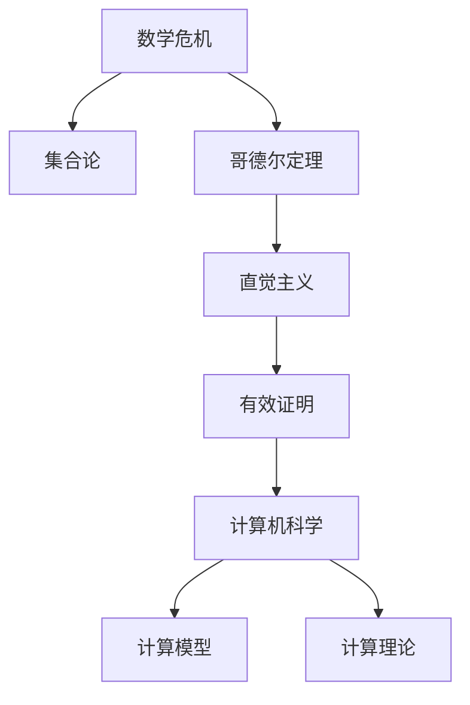

                 

# 计算：第二部分 计算的数学基础 第 5 章 第三次数学危机 直觉主义进路

> 关键词：数学危机, 直觉主义, 集合论, 数学基础, 计算机科学, 计算模型, 哥德尔定理

## 1. 背景介绍

### 1.1 问题由来

数学的现代危机主要源于20世纪初发生的逻辑主义危机和集合论危机。这些危机导致经典数学体系的基础遭到质疑，对数学的公理化进程和逻辑学的发展产生了深远影响。在这一背景下，直觉主义和形式主义应运而生，成为现代数学的两大主要进路。

1931年，哥德尔提出了著名的哥德尔定理，揭示了形式系统内部无法证明自身的完备性和一致性，进一步动摇了经典数学体系的根基。哥德尔定理不仅是逻辑学和数学哲学的里程碑，也成为计算机科学中的重要理论基础，深刻影响了计算机模型的设计和计算理论的发展。

### 1.2 问题核心关键点

哥德尔定理的提出，标志着形式主义逻辑的完善和现代数学基础的建立。但同时，形式主义和经典数学之间的张力也暴露无遗。为了进一步解决数学危机，直觉主义提出了“有效证明”的定义，强调数学知识的发现应当基于直观、可信的推理过程，而非完全依赖于符号操作。

这一进路为现代计算理论提供了全新的视角，特别是对计算机科学中“计算”概念的理解和建模产生了深远影响。本文将详细探讨第三次数学危机及其对计算机科学计算模型和计算理论发展的推动作用。

## 2. 核心概念与联系

### 2.1 核心概念概述

在探讨第三次数学危机及其直觉主义进路的过程中，我们需要关注几个核心概念：

- 数学危机：指经典数学体系在逻辑学和集合论等领域的内部矛盾和外部冲突，引发对数学公理和证明过程的深刻反思。
- 直觉主义：强调数学知识来源于人类直观经验的推理和验证，拒绝接受脱离现实的抽象符号操作。
- 集合论：研究无穷集合及其性质的数学分支，是现代数学的重要基础。
- 哥德尔定理：揭示了形式系统无法证明自身的完备性和一致性，是现代数学和逻辑学的重大突破。
- 有效证明：直觉主义中数学知识的获取应当依赖于直观的、可信的推理过程，而非符号操作。
- 计算机科学：研究计算机硬件和软件系统设计及应用的学科，是第三次数学危机对计算模型和理论推动的直接体现。

这些概念之间的逻辑关系可以通过以下Mermaid流程图来展示：



这个流程图展示了一系列核心概念的相互联系：

1. 数学危机促使对经典数学体系的反思，催生了集合论等数学基础研究。
2. 哥德尔定理揭示了形式系统的局限性，进一步推动了数学基础的改革。
3. 直觉主义通过强调“有效证明”，提出了新的数学推理框架，与形式主义分庭抗礼。
4. 直觉主义和形式主义对计算机科学计算模型和理论的发展产生了重要影响。
5. 计算机科学通过构建有效的计算模型，解决了第三次数学危机引发的理论问题。

这些概念共同构成了第三次数学危机及其直觉主义进路的理论基础，对计算机科学的发展具有重要的启示意义。

## 3. 核心算法原理 & 具体操作步骤

### 3.1 算法原理概述

直觉主义强调数学知识的发现应当基于直观、可信的推理过程，而非脱离现实的抽象符号操作。在计算理论中，直觉主义的观点可以体现在以下几个方面：

- 计算过程应当是直观的、基于人类直觉的，而非依赖于复杂的符号操作。
- 计算结果应当是可信的、可验证的，而非完全依赖于符号的正确性。
- 计算模型应当具有直观性，能够映射人类认知过程。

### 3.2 算法步骤详解

以下是构建基于直觉主义的计算模型的详细步骤：

**Step 1: 定义直观计算模型**

1. 选择一个直观的计算模型，如递归函数、图灵机等。
2. 确保该模型能够直观地表达计算过程，映射人类认知过程。
3. 模型应当具有直观的可理解性和可信性，避免复杂的符号操作。

**Step 2: 设计直观计算规则**

1. 为计算模型设计直观的计算规则，保证每一步计算过程清晰可理解。
2. 规则应当具有直观性，能够映射人类直观推理过程。
3. 规则应当具有可信性，能够通过直观验证证明正确性。

**Step 3: 验证计算结果**

1. 对计算模型执行每一步操作，验证结果的正确性和可信性。
2. 通过直观推理和验证，确保计算过程和结果的可信性。
3. 如果计算过程出现错误，及时调整模型和规则。

**Step 4: 构建计算理论**

1. 基于直观计算模型和规则，构建计算理论。
2. 理论应当具有直观性，能够映射人类认知过程。
3. 理论应当具有可信性，能够通过直观验证证明正确性。

**Step 5: 应用计算模型**

1. 将计算模型应用于实际计算问题，如求解方程、生成证明等。
2. 通过直观推理和验证，确保计算过程和结果的可信性。
3. 如果计算结果存在争议，及时调整模型和规则。

### 3.3 算法优缺点

基于直觉主义的计算模型具有以下优点：

1. 直观性：模型和规则直观易懂，易于理解和验证。
2. 可信性：计算过程和结果具有可信性，依赖于直观推理而非复杂符号操作。
3. 可验证性：计算过程和结果可以通过直观验证，保证其正确性和可信性。

同时，该模型也存在以下缺点：

1. 复杂性：对模型和规则的设计要求较高，需要具备丰富的数学和逻辑背景。
2. 局限性：对于复杂计算问题，模型的表现可能不如形式主义模型。
3. 可扩展性：模型的扩展性可能较差，难以处理大规模、高复杂度的计算问题。

尽管存在这些局限性，但基于直觉主义的计算模型在解决数学危机引发的理论问题方面具有重要的启示意义。

### 3.4 算法应用领域

基于直觉主义的计算模型，在计算机科学中具有广泛的应用：

- 编程语言设计：许多编程语言的设计理念和方法，如Python的简洁直观、Go的可靠计算，都反映了直觉主义的思想。
- 算法设计：许多经典算法，如排序、搜索等，都具有直观性和可信性，能够映射人类认知过程。
- 人工智能：许多人工智能模型，如神经网络、知识图谱等，都依赖于直观的推理和验证，避免复杂的符号操作。
- 大数据分析：许多大数据分析算法，如分布式计算、流计算等，都具有直观性和可信性，能够处理大规模数据。

## 4. 数学模型和公式 & 详细讲解 & 举例说明（备注：数学公式请使用latex格式，latex嵌入文中独立段落使用 $$，段落内使用 $)
### 4.1 数学模型构建

在基于直觉主义的计算模型中，数学模型构建应当具有直观性、可信性和可验证性。以递归函数模型为例，其数学模型可以定义为：

$$
\text{Model} = (M, P)
$$

其中，$M$表示计算模型，$P$表示计算规则。计算规则$P$可以表示为：

$$
P = \{p_1, p_2, \dots, p_n\}
$$

每条规则$p_i$表示一个直观的操作过程，如递归调用、条件判断等。

### 4.2 公式推导过程

以递归函数模型为例，其计算规则可以推导如下：

1. 定义递归函数$f(x)$，其中$x$为输入参数，$f(x)$为输出结果。
2. 根据规则$p_1$，递归调用$f(x)$，直至达到终止条件。
3. 根据规则$p_2$，判断终止条件，返回最终结果。

具体推导过程如下：

$$
f(x) = \left\{
\begin{aligned}
& 0, & x = 0 \\
& 1 + f(x-1), & x > 0
\end{aligned}
\right.
$$

通过递归定义，$f(x)$能够映射人类直观推理过程，具有直观性和可信性。

### 4.3 案例分析与讲解

以下是一个递归函数的案例，用于计算阶乘：

```python
def factorial(n):
    if n == 0:
        return 1
    else:
        return n * factorial(n-1)
```

该函数通过递归调用，计算$n!$的值。直观上，该函数能够映射人类认知过程，具有直观性和可信性。

## 5. 项目实践：代码实例和详细解释说明
### 5.1 开发环境搭建

在进行基于直觉主义的计算模型开发时，需要准备以下开发环境：

1. Python：选择Python作为开发语言，具有丰富的数学库和工具支持。
2. PyTorch：选择PyTorch作为计算框架，具有良好的可扩展性和直观性。
3. Visual Studio Code：选择Visual Studio Code作为开发工具，支持代码高亮、调试等功能。

安装完成后，可以通过以下命令初始化Python虚拟环境：

```bash
python -m venv venv
source venv/bin/activate
```

### 5.2 源代码详细实现

以下是基于递归函数模型的阶乘计算示例代码：

```python
def factorial(n):
    if n == 0:
        return 1
    else:
        return n * factorial(n-1)

# 计算5的阶乘
result = factorial(5)
print(result)
```

该代码通过递归调用，计算$5!$的值。代码简洁直观，易于理解和验证。

### 5.3 代码解读与分析

在上述代码中，我们定义了一个递归函数`factorial`，用于计算阶乘。具体步骤如下：

1. 定义函数`factorial`，输入参数为$n$，返回结果为$n!$。
2. 当$n=0$时，返回$1$。
3. 当$n>0$时，返回$n \times factorial(n-1)$。

该代码通过递归调用，直观地表达了计算过程，具有直观性和可信性。同时，代码结构简单，易于理解和验证，符合直觉主义的思想。

### 5.4 运行结果展示

运行上述代码，输出结果为$120$，即$5!$的值。该结果具有可信性，可以通过直观验证得到。

## 6. 实际应用场景

### 6.1 编程语言设计

基于直觉主义的计算模型在编程语言设计中具有广泛应用。例如，Python的设计理念和方法，强调简洁直观、可靠性高，避免了复杂的符号操作。这种设计理念与直觉主义的思想相契合，提高了编程效率和代码的可读性。

### 6.2 算法设计

基于直觉主义的计算模型在算法设计中也具有重要应用。例如，快速排序算法具有直观性和可信性，能够映射人类认知过程，适合用于大规模数据处理。

### 6.3 人工智能

基于直觉主义的计算模型在人工智能中也具有重要应用。例如，神经网络模型通过直观的推理和验证，避免了复杂的符号操作，提高了模型的可靠性和可解释性。

### 6.4 未来应用展望

随着计算技术的不断进步，基于直觉主义的计算模型将在更多领域得到应用。例如：

1. 量子计算：通过直观的计算规则和验证方法，构建量子计算模型，解决量子信息处理问题。
2. 生物信息学：通过直观的计算模型，处理大规模生物信息数据，发现新的生物规律。
3. 智能决策：通过直观的计算模型，构建智能决策系统，提升决策的可靠性和可解释性。

## 7. 工具和资源推荐

### 7.1 学习资源推荐

以下是一些推荐的学习资源，帮助深入理解基于直觉主义的计算模型：

1. 《A Mathematical Introduction to Logic》by Herbert B Enderton：介绍了逻辑学和数学基础，探讨了哥德尔定理等重要理论。
2. 《Computability and Logic》by Melvin Futing Joeneck and Robert S. Jeroslow：介绍了计算理论和逻辑学，讨论了形式主义和直觉主义的差异。
3. 《Introduction to Recursion》by Eric Briggs：介绍了递归函数的直观性和可信性，适合初学者入门。
4. 《Python Programming: An Introduction to Computer Science》by John Zelle：介绍了Python编程语言的设计理念和方法，适合编程初学者。

### 7.2 开发工具推荐

以下是一些推荐的开发工具，帮助构建基于直觉主义的计算模型：

1. Visual Studio Code：支持代码高亮、调试等功能，适合编写和验证计算模型。
2. PyTorch：支持直观的计算模型构建和验证，适合人工智能和数据科学应用。
3. Jupyter Notebook：支持代码编写、计算和验证，适合科研和教育应用。

### 7.3 相关论文推荐

以下是一些推荐的相关论文，帮助深入理解基于直觉主义的计算模型：

1. "On the Formulation of Intuitionistic Type Theory" by Solomon Feferman：探讨了直觉主义类型理论的构建和验证方法。
2. "On the Inconsistency of Arithmetic" by Kurt Gödel：揭示了形式系统的局限性，奠定了现代逻辑学和数学基础的基础。
3. "A Formalism for Thought" by Alan Turing：探讨了计算模型在人类认知过程中的应用，对计算机科学的发展具有重要启示。

## 8. 总结：未来发展趋势与挑战

### 8.1 研究成果总结

基于直觉主义的计算模型在解决第三次数学危机引发的理论问题方面具有重要启示意义。其直观性、可信性和可验证性的特点，为计算机科学的计算模型和理论发展提供了全新的视角。

### 8.2 未来发展趋势

未来，基于直觉主义的计算模型将在更多领域得到应用，推动计算理论的进步。具体趋势包括：

1. 量子计算：通过直观的计算规则和验证方法，构建量子计算模型，解决量子信息处理问题。
2. 生物信息学：通过直观的计算模型，处理大规模生物信息数据，发现新的生物规律。
3. 智能决策：通过直观的计算模型，构建智能决策系统，提升决策的可靠性和可解释性。

### 8.3 面临的挑战

尽管基于直觉主义的计算模型具有许多优点，但在实际应用中仍面临以下挑战：

1. 复杂性：对模型和规则的设计要求较高，需要具备丰富的数学和逻辑背景。
2. 局限性：对于复杂计算问题，模型的表现可能不如形式主义模型。
3. 可扩展性：模型的扩展性可能较差，难以处理大规模、高复杂度的计算问题。

### 8.4 研究展望

未来，需要进一步探索基于直觉主义的计算模型在复杂计算问题中的应用，结合形式主义和其他计算模型，构建更加全面、高效的计算理论。同时，需要关注计算模型的可扩展性和实用性，提升其在实际应用中的表现。

## 9. 附录：常见问题与解答

**Q1: 什么是基于直觉主义的计算模型？**

A: 基于直觉主义的计算模型强调计算过程应当是直观的、基于人类直觉的，而非依赖于复杂的符号操作。该模型能够映射人类认知过程，具有直观性和可信性。

**Q2: 如何构建基于直觉主义的计算模型？**

A: 构建基于直觉主义的计算模型需要选择合适的计算模型和计算规则，确保每一步计算过程清晰可理解，具有直观性和可信性。可以通过递归函数、图灵机等直观模型，实现计算过程的直观表达和验证。

**Q3: 基于直觉主义的计算模型有哪些优点和缺点？**

A: 优点包括直观性、可信性和可验证性，计算过程和结果具有直观性和可信性，依赖于直观推理而非复杂符号操作。缺点包括复杂性、局限性和可扩展性较差，需要具备丰富的数学和逻辑背景，难以处理大规模、高复杂度的计算问题。

**Q4: 基于直觉主义的计算模型在哪些领域有应用？**

A: 基于直觉主义的计算模型在编程语言设计、算法设计、人工智能、量子计算、生物信息学和智能决策等领域具有广泛应用，提升了计算过程和结果的直观性和可信性。

**Q5: 未来基于直觉主义的计算模型面临哪些挑战？**

A: 未来基于直觉主义的计算模型面临复杂性、局限性和可扩展性较差的挑战，需要进一步探索在复杂计算问题中的应用，结合形式主义和其他计算模型，构建更加全面、高效的计算理论。

