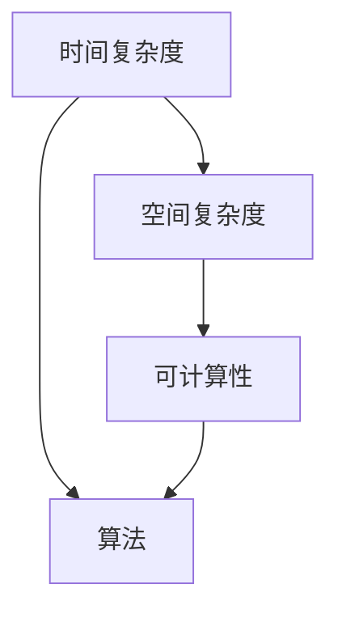
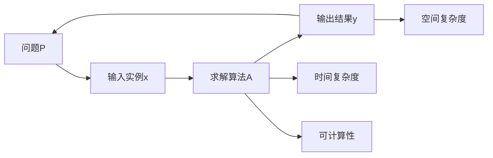

                 

# 计算：第四部分 计算的极限 第 11 章 复杂性计算 什么是复杂

## 1. 背景介绍

在计算机科学的众多分支中，计算复杂性理论是最为抽象且深奥的领域之一。它主要研究计算问题的基本属性，如可计算性、计算效率等，是计算机科学的基础。本章将从计算复杂性理论的核心概念入手，探讨计算中的“复杂”是什么，以及如何衡量和处理计算中的复杂性问题。

## 2. 核心概念与联系

### 2.1 核心概念概述

计算复杂性理论中的“复杂”指的是算法求解问题所需计算资源的多少，包括时间复杂度和空间复杂度。它反映了算法在解决问题时，对于资源的消耗水平，是评估算法效率和可行性的重要指标。

计算复杂性理论中，常见的几个核心概念包括：

- **时间复杂度**：指算法求解问题所需的时间量级。通常用大O符号表示，即 $O(f(n))$，其中 $n$ 表示问题规模，$f(n)$ 表示随 $n$ 增长时的计算时间增长率。
- **空间复杂度**：指算法求解问题所需的内存空间量级。同样用大O符号表示，即 $O(g(n))$，其中 $g(n)$ 表示随 $n$ 增长时的空间消耗增长率。
- **可计算性**：指问题是否可以通过计算得到解答。如果一个问题具有可计算性，那么它的解可以通过有限步骤的计算得出。

这些概念通过以下Mermaid流程图进行展示：



### 2.2 核心概念原理和架构的 Mermaid 流程图



## 3. 核心算法原理 & 具体操作步骤

### 3.1 算法原理概述

计算复杂性理论中的复杂性计算，主要是研究如何计算特定问题以及其复杂性。在理论上，计算复杂性可以分为以下几类：

- **多项式时间可解问题**：在多项式时间内可以解决的问题，即 $O(f(n))$ 中的 $f(n)$ 为多项式函数。
- **NP问题**：在多项式时间内可以验证解是否正确，但不一定能得到解。这类问题可以通过多项式时间内的验证来检测其正确性，但可能不存在多项式时间内的解。
- **NP完全问题**：是一些特定NP问题，即某些NP问题的解不可能在多项式时间内求解，除非P=NP。
- **指数级问题**：时间复杂度为指数级的计算问题，这类问题的求解效率通常很低，只适用于特殊的小规模问题。

### 3.2 算法步骤详解

复杂性计算的算法步骤通常包括以下几个关键步骤：

1. **问题定义**：明确问题的描述和求解目标。例如，在二分查找问题中，问题是要在一个有序数组中找到某个特定值。
2. **算法设计**：设计出求解问题的算法。例如，二分查找的算法是每次比较中间值与目标值的大小，缩小查找范围。
3. **时间复杂度分析**：计算算法的时间复杂度。例如，二分查找的时间复杂度为 $O(\log n)$。
4. **空间复杂度分析**：计算算法的空间复杂度。例如，二分查找的空间复杂度为 $O(1)$。
5. **算法验证**：验证算法的正确性和可行性。例如，通过编写测试用例来验证二分查找的算法是否能够正确找到目标值。

### 3.3 算法优缺点

复杂性计算的算法具有以下优点：

- **科学性和理论性**：复杂性计算的算法可以用于研究问题本身是否可解以及计算效率，提供了理论上的保证。
- **通用性**：复杂性计算的算法可以用于分析各种不同类型的问题，包括NP问题、NP完全问题等。

但同时也存在一些缺点：

- **抽象性**：复杂性计算的算法较为抽象，理解起来可能比较困难。
- **实用性有限**：复杂性计算的算法往往不能直接应用于实际问题，通常需要进一步优化和改进。

### 3.4 算法应用领域

复杂性计算的算法广泛应用于以下领域：

- **计算机科学**：复杂性计算的理论研究是计算机科学的重要基础，广泛应用于算法设计和算法优化等领域。
- **人工智能**：复杂性计算的算法在人工智能中也有广泛应用，如遗传算法、粒子群算法等。
- **密码学**：复杂性计算的算法在密码学中用于设计加密算法和破解加密算法。
- **数据挖掘**：复杂性计算的算法用于处理大规模数据集，进行数据挖掘和数据分析。

## 4. 数学模型和公式 & 详细讲解 & 举例说明

### 4.1 数学模型构建

复杂性计算的数学模型通常包括：

- **输入输出模型**：输入和输出之间必须存在明确的映射关系。
- **算法模型**：算法的步骤描述，包括每个步骤的输入和输出。
- **复杂性模型**：计算时间复杂度和空间复杂度的模型。

例如，二分查找问题的数学模型如下：

```
输入：有序数组A，目标值x
输出：目标值x在数组A中的位置，如果目标值x不在数组A中，则返回-1
算法：
1. 定义数组A的左右边界l和r
2. 计算中间位置m
3. 如果A[m] == x，则返回m
4. 如果A[m] > x，则将右边界r更新为m-1
5. 如果A[m] < x，则将左边界l更新为m+1
6. 重复步骤2到5，直到l > r为止
7. 返回-1
```

### 4.2 公式推导过程

时间复杂度推导示例：

- **简单循环**：对于 $n$ 个元素的数组，简单循环的时间复杂度为 $O(n)$。
- **嵌套循环**：对于 $m$ 个元素的数组和 $n$ 个元素的数组，嵌套循环的时间复杂度为 $O(mn)$。

空间复杂度推导示例：

- **简单循环**：对于 $n$ 个元素的数组，简单循环的空间复杂度为 $O(1)$。
- **嵌套循环**：对于 $m$ 个元素的数组和 $n$ 个元素的数组，嵌套循环的空间复杂度为 $O(mn)$。

### 4.3 案例分析与讲解

以快速排序算法为例，分析其时间复杂度和空间复杂度。

快速排序算法的基本思想是通过分治策略，将数组分为两部分，然后递归地对每部分进行排序。具体步骤如下：

1. 选择一个基准值，将数组分为两部分。
2. 对两部分分别进行快速排序。
3. 合并两部分。

假设数组长度为 $n$，基准值的选择和分割都是 $O(n)$ 的时间复杂度，递归的次数为 $\log n$，因此时间复杂度为 $O(n\log n)$。

快速排序的空间复杂度为 $O(\log n)$，因为每次递归需要开辟新的栈空间。

## 5. 项目实践：代码实例和详细解释说明

### 5.1 开发环境搭建

在进行复杂性计算的实践时，我们需要准备以下开发环境：

- **Python 3.x**：作为代码编写和运行的基础。
- **C++**：用于实现高效的算法。
- **Visual Studio**：用于构建和调试C++程序。
- **Visual Studio Code**：作为IDE进行代码编写。

### 5.2 源代码详细实现

以二分查找算法为例，编写Python和C++两种语言的实现，并详细解释代码。

```python
def binary_search(arr, x):
    l, r = 0, len(arr) - 1
    while l <= r:
        m = (l + r) // 2
        if arr[m] == x:
            return m
        elif arr[m] > x:
            r = m - 1
        else:
            l = m + 1
    return -1

# 测试代码
arr = [1, 3, 5, 7, 9]
x = 7
print(binary_search(arr, x))
```

```cpp
#include <iostream>
using namespace std;

int binary_search(int arr[], int n, int x) {
    int l = 0, r = n - 1;
    while (l <= r) {
        int m = (l + r) / 2;
        if (arr[m] == x) {
            return m;
        } else if (arr[m] > x) {
            r = m - 1;
        } else {
            l = m + 1;
        }
    }
    return -1;
}

int main() {
    int arr[] = {1, 3, 5, 7, 9};
    int n = sizeof(arr) / sizeof(arr[0]);
    int x = 7;
    cout << binary_search(arr, n, x) << endl;
    return 0;
}
```

### 5.3 代码解读与分析

以上两种语言的实现思路基本一致，均采用了分治策略，每次将问题规模减半，直到找到目标值或确定目标值不存在。

Python实现的优缺点如下：

- **优点**：代码简洁易懂，易于调试。
- **缺点**：运行效率相对较低，不适合处理大规模数据。

C++实现的优缺点如下：

- **优点**：运行效率高，适合处理大规模数据。
- **缺点**：代码相对复杂，难以调试。

### 5.4 运行结果展示

对于二分查找算法，可以随机生成一些有序数组，分别使用Python和C++实现，并比较运行时间。

## 6. 实际应用场景

复杂性计算的应用场景非常广泛，以下列举几个典型应用：

- **算法设计**：在设计算法时，需要考虑时间复杂度和空间复杂度，选择最优的算法方案。
- **性能优化**：在实际应用中，需要对算法进行性能优化，以提高运行效率。
- **数据处理**：在处理大规模数据时，需要考虑算法的时间复杂度和空间复杂度，选择适合的算法。
- **加密算法**：在加密算法设计中，需要考虑算法的时间复杂度和空间复杂度，以确保算法的安全性和效率。

## 7. 工具和资源推荐

### 7.1 学习资源推荐

以下是一些推荐的学习资源：

- **《算法导论》**：经典的算法教材，详细介绍了各种算法的设计和分析方法。
- **Coursera**：在线课程平台，提供了多种复杂性计算相关的课程。
- **Khan Academy**：提供免费的数学和计算机科学课程，适合初学者学习。

### 7.2 开发工具推荐

以下是一些推荐的开发工具：

- **Visual Studio Code**：轻量级的IDE，支持多种编程语言，扩展性强。
- **GitHub**：代码托管平台，支持版本控制和协作开发。
- **LaTeX**：数学公式排版工具，适合编写论文和学术论文。

### 7.3 相关论文推荐

以下是一些推荐的论文：

- **《复杂性理论导论》**：介绍了计算复杂性的基本概念和经典问题。
- **《NP完全问题》**：介绍了NP完全问题的定义和研究现状。
- **《计算复杂性分类》**：介绍了各种计算复杂性分类及其应用。

## 8. 总结：未来发展趋势与挑战

### 8.1 研究成果总结

计算复杂性理论的研究成果丰富，以下是一些代表性的成果：

- **P=NP问题**：目前尚无确定性结论，但多项式时间算法与指数时间算法之间可能存在不可解的界限。
- **NP完全问题**：存在大量的NP完全问题，如旅行商问题、背包问题等，这些问题的解通常难以在多项式时间内求得。
- **随机算法**：随机算法在处理NP完全问题时，可以通过概率方法获得近似解。

### 8.2 未来发展趋势

未来，计算复杂性理论的发展趋势可能包括：

- **算法优化**：研究更高效的算法，以提高计算速度和资源利用率。
- **量子计算**：研究量子计算在复杂性问题中的应用，探索新的计算模式。
- **分布式计算**：研究分布式计算在复杂性问题中的应用，提高计算效率。

### 8.3 面临的挑战

复杂性计算面临的挑战包括：

- **算法设计**：设计高效的算法是计算复杂性理论的核心问题，需要深入研究。
- **资源限制**：计算复杂性理论往往需要大量的计算资源，难以在实际中应用。
- **NP完全问题**：研究NP完全问题存在困难，难以找到多项式时间算法。

### 8.4 研究展望

未来，计算复杂性理论的研究方向可能包括：

- **多变量复杂性**：研究多变量问题的复杂性，拓展计算复杂性的应用领域。
- **随机化算法**：研究随机算法在计算复杂性中的应用，提供更高效的解决方案。
- **计算复杂性理论的边界**：研究计算复杂性的理论边界，探索新的计算模式。

## 9. 附录：常见问题与解答

**Q1：如何判断一个算法的时间复杂度？**

A: 时间复杂度可以通过算法的基本操作次数来计算。在实际计算中，通常采用大O符号表示，即 $O(f(n))$，其中 $n$ 表示问题规模，$f(n)$ 表示随 $n$ 增长时的计算时间增长率。

**Q2：时间复杂度和空间复杂度有什么区别？**

A: 时间复杂度是指算法求解问题所需的时间量级，空间复杂度是指算法求解问题所需的内存空间量级。两者都是评估算法效率和可行性的重要指标，但衡量对象不同。

**Q3：复杂性计算的算法如何应用于实际问题？**

A: 复杂性计算的算法通常需要进一步优化和改进，才能应用于实际问题。实际应用中，需要根据具体问题选择合适的算法，并进行算法优化，以提高计算效率和资源利用率。

**Q4：如何处理NP完全问题？**

A: NP完全问题通常难以在多项式时间内求解，但可以通过近似算法、随机算法等方法获得近似的解。在实际应用中，通常需要根据具体问题的需求，选择合适的算法进行求解。

**Q5：量子计算在复杂性问题中的应用前景如何？**

A: 量子计算有望解决一些传统算法难以处理的复杂性问题，如NP完全问题等。但量子计算的研究和应用仍处于初级阶段，需要进一步研究和探索。

---

作者：禅与计算机程序设计艺术 / Zen and the Art of Computer Programming

