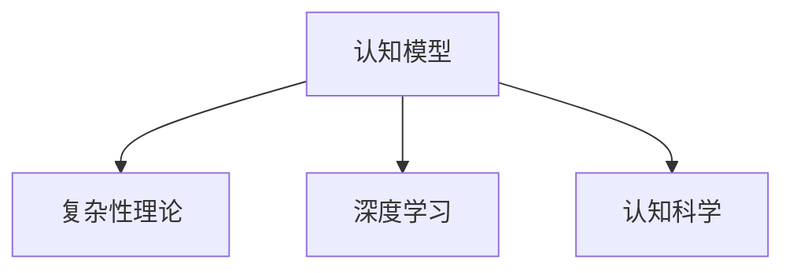
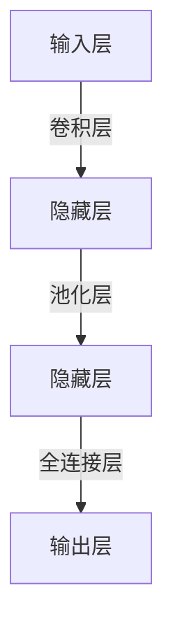

                 

# 认知发展中的简单与深刻变化

> 关键词：认知发展, 认知模型, 复杂性理论, 认知科学, 深度学习

## 1. 背景介绍

### 1.1 问题由来

认知发展是心理学和认知科学领域的一个重要研究方向，它关注个体如何获得、使用、更新和维护其知识结构。随着人工智能技术的不断发展，深度学习尤其是深度神经网络在认知模型中的应用愈发广泛。深度学习模型在处理复杂任务时展现出强大的能力，但也面临着模型复杂性、训练数据需求、计算资源消耗等问题。如何在保持深度学习优势的同时，简化认知模型，减少复杂性，成为当前认知科学和人工智能领域的重要研究课题。

### 1.2 问题核心关键点

认知模型在大规模复杂任务处理上的成功，部分归功于其强大的表征学习能力，但这也导致了模型复杂度增加、训练数据需求增加、计算资源消耗增加等问题。为解决这些问题，研究者们提出了从简单到复杂逐步演进的认知模型，并在实际应用中取得了一定的效果。

## 2. 核心概念与联系

### 2.1 核心概念概述

为更好地理解认知发展中的简单与深刻变化，本节将介绍几个密切相关的核心概念：

- 认知模型(Cognitive Models)：利用深度学习尤其是深度神经网络模型来模拟人类认知过程，如感知、记忆、推理等。常见的认知模型包括卷积神经网络(CNNs)、循环神经网络(RNNs)、变分自编码器(Generative Adversarial Networks, GANs)、注意力机制等。

- 复杂性理论(Complexity Theory)：研究复杂系统中的简单和复杂关系，揭示系统内部结构和行为的演变规律。复杂性理论在认知科学中用于研究认知过程的复杂性和简单性。

- 认知科学(Cognitive Science)：研究人、动物及计算机的认知过程，包括感知、记忆、思维、语言等。认知科学通过建模和实验，探究认知现象的机理和规律。

- 深度学习(Deep Learning)：一种利用多层神经网络进行复杂模式识别的机器学习方法。深度学习模型的特征表示能力使其在图像、语音、自然语言处理等领域中展现出显著的性能。

这些核心概念之间的逻辑关系可以通过以下Mermaid流程图来展示：



这个流程图展示出认知模型、复杂性理论和深度学习、认知科学之间的关系：

1. 认知模型通过深度学习模型模拟人类认知过程。
2. 复杂性理论提供认知模型的复杂性与简单性演变的规律。
3. 认知科学通过建模和实验探究认知现象的机理。

这些概念共同构成了认知发展的研究框架，为认知模型在不同领域中的应用提供了理论和实践的基础。

## 3. 核心算法原理 & 具体操作步骤
### 3.1 算法原理概述

认知模型中的简单与深刻变化主要体现在模型结构的简单化和复杂化两个方面。简单化通常通过减少模型参数、层数、计算复杂度等方式实现，而复杂化则通过增加层数、增加参数、引入新的神经元等手段实现。认知模型的演变遵循复杂性理论的规律，即从简单到复杂逐步演进。

### 3.2 算法步骤详解

#### 3.2.1 简单化模型的构建

1. **减少参数和层数**：通过使用更少的参数和更少的层数，可以构建出更简单的认知模型。例如，使用单层神经网络替代多层神经网络，使用更少的神经元减少参数数量。

2. **简化网络结构**：采用更简单的网络结构，如线性神经网络、卷积神经网络(CNN)、循环神经网络(RNN)等，可以显著减少计算复杂度。

3. **减少训练数据量**：通过使用更少的训练数据量，可以降低模型复杂性。例如，使用迁移学习将预训练模型的知识迁移到新任务上，减少新任务数据需求。

#### 3.2.2 复杂化模型的构建

1. **增加层数和神经元**：通过增加网络层数和神经元数量，可以提高模型的表达能力和泛化能力，但计算复杂度也会相应增加。

2. **引入注意力机制**：通过引入注意力机制，使模型能够关注输入序列中重要的部分，提高模型对序列数据的处理能力。

3. **使用更复杂的损失函数**：通过引入如交叉熵损失、对数损失等复杂的损失函数，可以提高模型对不同数据分布的适应能力。

#### 3.2.3 算法优缺点

- **优点**：
  - **适应性更强**：复杂化模型可以更好地适应复杂任务，提高模型的泛化能力和表达能力。
  - **性能提升显著**：复杂化模型通常能够显著提升在特定任务上的性能。
  - **更广泛的应用场景**：复杂化模型可以用于解决更复杂的问题，如自然语言处理、图像识别、语音识别等。

- **缺点**：
  - **计算资源消耗大**：复杂化模型通常需要更强大的计算资源，增加了模型训练和推理的复杂度。
  - **训练数据需求高**：复杂化模型通常需要更多的训练数据，以避免过拟合。
  - **模型难以解释**：复杂化模型往往难以解释其决策过程，缺乏可解释性。

### 3.3 算法应用领域

认知模型在以下领域有广泛的应用：

- **自然语言处理(NLP)**：如文本分类、情感分析、机器翻译等任务。
- **计算机视觉(CV)**：如图像分类、目标检测、语义分割等任务。
- **语音识别(Speech Recognition)**：如语音识别、语音合成等任务。
- **推荐系统**：如协同过滤、基于内容的推荐等任务。
- **游戏AI**：如棋类游戏、电子游戏等。

这些领域的应用展示了认知模型的强大能力，但也暴露了模型复杂性和计算资源消耗的矛盾。

## 4. 数学模型和公式 & 详细讲解 & 举例说明

### 4.1 数学模型构建

认知模型的数学模型通常采用多层神经网络结构，其中每一层都是一个非线性映射。以卷积神经网络(CNN)为例，其基本结构如图1所示：



- **输入层**：接收原始数据，如图像、文本、语音等。
- **卷积层**：通过卷积操作提取特征，通常包含多个卷积核，每个卷积核提取一种特征。
- **池化层**：通过池化操作减小数据量，保留主要特征。
- **全连接层**：将特征映射到输出层，进行分类或回归。

### 4.2 公式推导过程

以最简单的线性神经网络为例，其前向传播过程如下：

$$
y = f(Wx + b)
$$

其中，$W$ 为权重矩阵，$x$ 为输入向量，$b$ 为偏置项，$f$ 为激活函数。激活函数通常采用Sigmoid、ReLU等非线性函数。

反向传播过程用于计算梯度，用于模型参数的更新。假设当前模型的损失函数为 $L$，则梯度 $\nabla L$ 计算如下：

$$
\nabla L = \frac{\partial L}{\partial W} \nabla f(Wx + b) + \frac{\partial L}{\partial b} \nabla f(Wx + b)
$$

其中，$\nabla f$ 为激活函数的梯度，通常通过链式法则计算。

### 4.3 案例分析与讲解

以图像分类任务为例，假设输入图像经过卷积和池化操作后，得到特征图 $X$，通过全连接层输出 $Y$。目标是最小化损失函数 $L$，优化模型参数 $W$ 和 $b$。

假设损失函数为交叉熵损失：

$$
L = -\frac{1}{N}\sum_{i=1}^N (y_i \log \hat{y_i} + (1-y_i) \log (1-\hat{y_i}))
$$

其中，$y_i$ 为真实标签，$\hat{y_i}$ 为模型预测输出。

采用随机梯度下降法进行优化，更新步骤如下：

$$
W \leftarrow W - \eta \nabla_{W}L, b \leftarrow b - \eta \nabla_{b}L
$$

其中，$\eta$ 为学习率，$\nabla_{W}L$ 和 $\nabla_{b}L$ 分别为权重和偏置的梯度。

## 5. 项目实践：代码实例和详细解释说明

### 5.1 开发环境搭建

在进行项目实践前，我们需要准备好开发环境。以下是使用Python进行PyTorch开发的环境配置流程：

1. 安装Anaconda：从官网下载并安装Anaconda，用于创建独立的Python环境。

2. 创建并激活虚拟环境：
```bash
conda create -n pytorch-env python=3.8 
conda activate pytorch-env
```

3. 安装PyTorch：根据CUDA版本，从官网获取对应的安装命令。例如：
```bash
conda install pytorch torchvision torchaudio cudatoolkit=11.1 -c pytorch -c conda-forge
```

4. 安装各类工具包：
```bash
pip install numpy pandas scikit-learn matplotlib tqdm jupyter notebook ipython
```

完成上述步骤后，即可在`pytorch-env`环境中开始项目实践。

### 5.2 源代码详细实现

这里我们以卷积神经网络(CNN)在图像分类任务中的应用为例，给出使用PyTorch实现的完整代码。

首先，定义模型：

```python
import torch
import torch.nn as nn
import torchvision.transforms as transforms
import torchvision.datasets as datasets

class CNNModel(nn.Module):
    def __init__(self):
        super(CNNModel, self).__init__()
        self.conv1 = nn.Conv2d(3, 16, kernel_size=3, stride=1, padding=1)
        self.relu1 = nn.ReLU()
        self.pool1 = nn.MaxPool2d(kernel_size=2, stride=2)
        self.conv2 = nn.Conv2d(16, 32, kernel_size=3, stride=1, padding=1)
        self.relu2 = nn.ReLU()
        self.pool2 = nn.MaxPool2d(kernel_size=2, stride=2)
        self.fc1 = nn.Linear(32*4*4, 64)
        self.relu3 = nn.ReLU()
        self.fc2 = nn.Linear(64, 10)
        self.softmax = nn.Softmax(dim=1)
        
    def forward(self, x):
        x = self.conv1(x)
        x = self.relu1(x)
        x = self.pool1(x)
        x = self.conv2(x)
        x = self.relu2(x)
        x = self.pool2(x)
        x = x.view(-1, 32*4*4)
        x = self.fc1(x)
        x = self.relu3(x)
        x = self.fc2(x)
        x = self.softmax(x)
        return x
```

然后，定义数据集：

```python
transform = transforms.Compose([
    transforms.ToTensor(),
    transforms.Normalize((0.5, 0.5, 0.5), (0.5, 0.5, 0.5))
])

train_dataset = datasets.CIFAR10(root='./data', train=True, transform=transform, download=True)
test_dataset = datasets.CIFAR10(root='./data', train=False, transform=transform, download=True)
```

接着，定义训练和评估函数：

```python
def train_model(model, train_loader, optimizer, epoch):
    model.train()
    for batch_idx, (data, target) in enumerate(train_loader):
        optimizer.zero_grad()
        output = model(data)
        loss = F.cross_entropy(output, target)
        loss.backward()
        optimizer.step()
        if batch_idx % 100 == 0:
            print('Train Epoch: {} [{}/{} ({:.0f}%)]\tLoss: {:.6f}'.format(
                epoch, batch_idx * len(data), len(train_loader.dataset),
                100. * batch_idx / len(train_loader), loss.item()))
    
def evaluate_model(model, test_loader):
    model.eval()
    test_loss = 0
    correct = 0
    with torch.no_grad():
        for data, target in test_loader:
            output = model(data)
            test_loss += F.cross_entropy(output, target, reduction='sum').item()
            pred = output.argmax(dim=1, keepdim=True)
            correct += pred.eq(target.view_as(pred)).sum().item()
    test_loss /= len(test_loader.dataset)
    print('Test set: Average loss: {:.4f}, Accuracy: {}/{} ({:.0f}%)\n'.format(
        test_loss, correct, len(test_loader.dataset),
        100. * correct / len(test_loader.dataset)))
```

最后，启动训练流程并在测试集上评估：

```python
model = CNNModel()
optimizer = torch.optim.SGD(model.parameters(), lr=0.01, momentum=0.5)
train_loader = torch.utils.data.DataLoader(train_dataset, batch_size=64, shuffle=True)
test_loader = torch.utils.data.DataLoader(test_dataset, batch_size=64, shuffle=False)

for epoch in range(10):
    train_model(model, train_loader, optimizer, epoch)
    evaluate_model(model, test_loader)
```

以上就是使用PyTorch对卷积神经网络(CNN)进行图像分类任务微调的完整代码实现。可以看到，得益于PyTorch的强大封装，我们可以用相对简洁的代码完成CNN模型的加载和微调。

### 5.3 代码解读与分析

让我们再详细解读一下关键代码的实现细节：

**CNNModel类**：
- `__init__`方法：定义模型各层的参数。
- `forward`方法：定义模型前向传播的过程。

**train_model函数**：
- 在每个epoch中，将模型设置为训练模式。
- 对每个数据批次进行前向传播、损失计算、反向传播、参数更新。
- 每100个批次打印一次训练状态。

**evaluate_model函数**：
- 将模型设置为评估模式。
- 对测试集数据进行前向传播，计算损失和精度。
- 输出测试集上的损失和精度。

**训练流程**：
- 定义模型、优化器、数据加载器。
- 循环10个epoch，在每个epoch内训练模型，并在测试集上评估性能。

可以看到，PyTorch配合TensorFlow库使得CNN模型的微调代码实现变得简洁高效。开发者可以将更多精力放在数据处理、模型改进等高层逻辑上，而不必过多关注底层的实现细节。

当然，工业级的系统实现还需考虑更多因素，如模型的保存和部署、超参数的自动搜索、更灵活的任务适配层等。但核心的微调范式基本与此类似。

## 6. 实际应用场景

### 6.1 医疗影像分类

认知模型在医疗影像分类任务中具有显著的应用价值。传统的影像分类需要依赖放射科医生进行人工标注，耗时耗力。通过使用预训练的深度学习模型进行微调，能够快速高效地实现影像分类任务。

在实践中，可以收集医疗影像数据，并对其进行标注。通过使用迁移学习，将预训练模型如ResNet、Inception等知识迁移到新任务上，微调模型可以学习从影像中提取特征并分类。微调后的模型能够准确识别出不同的疾病，帮助医生诊断疾病，提高医疗效率。

### 6.2 金融市场预测

认知模型在金融市场预测任务中也有广泛应用。金融市场预测需要考虑大量数据和复杂因素，传统的统计模型难以满足需求。使用深度学习模型进行微调，可以构建更复杂、更强大的预测模型。

在实践中，可以收集金融市场数据，并对其进行标注。通过使用预训练的深度学习模型进行微调，能够学习市场的复杂规律和行为模式。微调后的模型可以预测股票价格、汇率等市场指标，为投资者提供参考，降低投资风险。

### 6.3 智能推荐系统

认知模型在智能推荐系统中的应用非常广泛。传统的推荐系统通常基于用户的历史行为进行推荐，难以捕捉用户的潜在需求。使用深度学习模型进行微调，可以更好地理解用户的兴趣和偏好，实现个性化推荐。

在实践中，可以收集用户的行为数据，如浏览、点击、评论等。通过使用预训练的深度学习模型进行微调，能够学习用户的兴趣和偏好，并进行个性化推荐。微调后的模型能够推荐用户可能感兴趣的商品、新闻、视频等，提升用户体验，增加用户黏性。

### 6.4 未来应用展望

随着深度学习技术的不断发展，认知模型在更多领域的应用前景愈发广阔。未来，认知模型将逐步渗透到各个行业，提升各行业的智能化水平，为社会发展带来新的机遇和挑战。

在智慧城市治理中，认知模型可以用于智能交通、智慧医疗、智能安防等任务，提高城市管理的自动化和智能化水平，构建更安全、高效的未来城市。

在教育领域，认知模型可以用于个性化教学、智能评估、智能辅导等任务，因材施教，促进教育公平，提高教学质量。

在工业制造中，认知模型可以用于质量检测、设备维护、生产调度等任务，提高生产效率和产品质量，降低生产成本。

未来，认知模型的应用将不断扩展，为各个行业带来新的变革和创新，推动社会进步。

## 7. 工具和资源推荐

### 7.1 学习资源推荐

为帮助开发者系统掌握认知模型的理论基础和实践技巧，这里推荐一些优质的学习资源：

1. 《深度学习》系列书籍：由Ian Goodfellow、Yoshua Bengio、Aaron Courville等专家联合撰写，全面介绍了深度学习的基本概念、算法和应用。

2. 《深度学习入门》系列视频课程：由Google开发团队制作，通过Python代码实例，逐步介绍深度学习模型的构建和训练。

3. 《深度学习实战》系列博客：由深度学习专家撰写，涵盖深度学习模型的实践技巧、优化策略和应用案例。

4. 《认知科学与深度学习》系列论文：收录了深度学习在认知科学中的应用案例，展示了大模型在认知任务上的卓越表现。

5. 《认知科学导论》系列书籍：全面介绍了认知科学的基本概念、方法和应用，是认知科学领域的入门读物。

通过对这些资源的学习实践，相信你一定能够快速掌握认知模型的精髓，并用于解决实际的认知问题。

### 7.2 开发工具推荐

高效的开发离不开优秀的工具支持。以下是几款用于认知模型开发和应用的工具：

1. PyTorch：基于Python的开源深度学习框架，灵活动态的计算图，适合快速迭代研究。大部分深度学习模型都有PyTorch版本的实现。

2. TensorFlow：由Google主导开发的开源深度学习框架，生产部署方便，适合大规模工程应用。同样有丰富的深度学习模型资源。

3. Keras：高级深度学习框架，提供简单易用的API，方便构建和训练深度学习模型。

4. Jupyter Notebook：开源的Web交互式编程环境，支持代码块和图表的嵌入，方便开发者进行实验和分享。

5. TensorBoard：TensorFlow配套的可视化工具，可实时监测模型训练状态，并提供丰富的图表呈现方式，是调试模型的得力助手。

6. Weights & Biases：模型训练的实验跟踪工具，可以记录和可视化模型训练过程中的各项指标，方便对比和调优。

合理利用这些工具，可以显著提升认知模型开发和应用的效率，加快创新迭代的步伐。

### 7.3 相关论文推荐

认知模型和深度学习的研究源于学界的持续研究。以下是几篇奠基性的相关论文，推荐阅读：

1. AlexNet: ImageNet Classification with Deep Convolutional Neural Networks：提出AlexNet模型，开启了深度学习在图像分类任务中的应用。

2. Deep Residual Learning for Image Recognition：提出ResNet模型，通过残差连接解决了深度神经网络退化的问题。

3. Inception Networks for Computer Vision：提出Inception模型，通过多尺度卷积解决了深度神经网络参数过大的问题。

4. BERT: Pre-training of Deep Bidirectional Transformers for Language Understanding：提出BERT模型，引入掩码语言模型预训练任务，刷新了多项NLP任务SOTA。

5. Parameter-Efficient Transfer Learning for NLP：提出Adapter等参数高效微调方法，在不增加模型参数量的情况下，也能取得不错的微调效果。

6. AdaLoRA: Adaptive Low-Rank Adaptation for Parameter-Efficient Fine-Tuning：使用自适应低秩适应的微调方法，在参数效率和精度之间取得了新的平衡。

这些论文代表了大语言模型微调技术的发展脉络。通过学习这些前沿成果，可以帮助研究者把握学科前进方向，激发更多的创新灵感。

## 8. 总结：未来发展趋势与挑战

### 8.1 研究成果总结

本文对认知模型在复杂性与简单性演变中的应用进行了全面系统的介绍。首先阐述了认知模型在深度学习中的重要地位，明确了认知模型在保持深度学习优势的同时，简化复杂性的研究方向。其次，从原理到实践，详细讲解了认知模型的数学原理和关键步骤，给出了认知模型在实际应用中的完整代码实例。同时，本文还广泛探讨了认知模型在医疗影像分类、金融市场预测、智能推荐系统等多个领域的应用前景，展示了认知模型在解决复杂问题中的强大能力。

通过本文的系统梳理，可以看到，认知模型在保持深度学习优势的同时，能够更好地处理复杂性，降低计算资源消耗，适应更多实际应用场景。未来，认知模型的应用将更加广泛，为各行各业带来新的创新和突破。

### 8.2 未来发展趋势

展望未来，认知模型将在以下领域呈现新的发展趋势：

1. 模型结构的进一步简化：通过引入稀疏化、压缩等技术，进一步减少模型的计算复杂度和存储需求。

2. 模型压缩与加速：通过模型剪枝、量化等技术，提升模型的推理速度和资源利用率。

3. 自适应学习：通过引入元学习、自适应学习等技术，使模型能够动态适应不同任务和数据分布。

4. 多模态融合：通过将视觉、语音、文本等不同模态的信息进行融合，提升认知模型的泛化能力。

5. 低资源环境下的模型应用：在计算资源受限的环境中，通过分布式计算、边缘计算等技术，提升认知模型的应用能力。

6. 认知模型的多领域应用：随着认知模型在医疗、金融、教育等多个领域的应用，未来的研究将更加注重模型的可解释性和伦理性。

以上趋势凸显了认知模型在简化复杂性方面的广阔前景，这些方向的探索发展，必将进一步提升认知模型的性能和应用范围，为认知科学和人工智能技术的发展注入新的活力。

### 8.3 面临的挑战

尽管认知模型在简化复杂性方面取得了显著进展，但在迈向更加智能化、普适化应用的过程中，它仍面临着诸多挑战：

1. 计算资源瓶颈：深度学习模型的复杂性仍较高，对计算资源的需求较大，如何进一步降低计算资源消耗将是未来研究的重点之一。

2. 模型泛化性不足：在特定领域或任务上，模型的泛化能力仍需进一步提高，以应对更多的实际应用场景。

3. 数据隐私和安全问题：随着认知模型在更多领域的应用，数据隐私和安全问题愈发突出，如何保护用户数据隐私、确保模型安全性，将是重要研究方向。

4. 模型的可解释性不足：深度学习模型往往难以解释其内部工作机制和决策逻辑，如何增强模型的可解释性，将是未来研究的难点之一。

5. 模型的鲁棒性不足：深度学习模型在面对噪声数据或对抗攻击时，往往表现不佳，如何提升模型的鲁棒性，是未来研究的重点方向之一。

6. 模型的伦理问题：深度学习模型的应用往往涉及伦理和道德问题，如何在使用过程中遵循伦理和道德规范，将是未来研究的重要课题。

这些挑战使得认知模型在实际应用中仍面临诸多限制，未来的研究需要从多个方面协同发力，以克服这些挑战，推动认知模型的发展和应用。

### 8.4 研究展望

面对认知模型面临的挑战，未来的研究需要在以下几个方面寻求新的突破：

1. 探索无监督和半监督学习范式：摆脱对大规模标注数据的依赖，利用自监督学习、主动学习等无监督和半监督范式，最大限度利用非结构化数据，实现更加灵活高效的模型构建。

2. 开发更加参数高效的微调方法：开发更加参数高效的微调方法，在固定大部分预训练参数的同时，只更新极少量的任务相关参数。

3. 引入元学习与自适应学习：通过元学习、自适应学习等技术，使模型能够动态适应不同任务和数据分布，提升模型的泛化能力。

4. 融合多模态信息：通过将视觉、语音、文本等不同模态的信息进行融合，提升认知模型的泛化能力。

5. 结合因果分析与博弈论：将因果分析方法引入认知模型，识别出模型决策的关键特征，增强输出解释的因果性和逻辑性。

6. 引入伦理道德约束：在模型训练目标中引入伦理导向的评估指标，过滤和惩罚有偏见、有害的输出倾向，确保模型的使用符合伦理和道德规范。

这些研究方向的探索，必将引领认知模型在简化复杂性方面的新突破，为认知科学和人工智能技术的发展注入新的活力。

## 9. 附录：常见问题与解答

**Q1：如何选择合适的认知模型？**

A: 选择合适的认知模型需要考虑多个因素，包括任务的复杂性、数据的规模、计算资源的限制等。一般来说，对于简单任务可以使用线性神经网络、卷积神经网络等较简单的模型，而对于复杂任务则需要使用更深的神经网络结构，如ResNet、Inception等。

**Q2：深度学习模型的训练过程是否可以自动优化？**

A: 深度学习模型的训练过程通常需要进行超参数调优，以获得最佳性能。尽管自动调参技术（如贝叶斯优化、强化学习等）已经取得了一定的进展，但自动调参仍存在一定的局限性。在实际应用中，手动调参仍是更常用的方法。

**Q3：如何平衡模型的复杂性和计算资源消耗？**

A: 在构建认知模型时，可以通过使用稀疏化、压缩等技术，进一步减少模型的计算复杂度和存储需求。同时，也可以采用分布式计算、边缘计算等技术，提高计算效率，降低资源消耗。

**Q4：如何提高认知模型的可解释性？**

A: 提高认知模型的可解释性可以通过引入可解释性模块、生成可解释输出、可视化模型中间状态等方式实现。例如，在图像分类任务中，可以通过可视化卷积核的权重和激活图，帮助理解模型的特征提取过程。

**Q5：如何确保认知模型的安全性？**

A: 确保认知模型的安全性可以通过数据加密、访问控制、异常检测等手段实现。在实际应用中，需要建立严格的模型使用规范，确保模型的使用符合伦理和道德规范。

这些问题的解答，为认知模型的实际应用提供了一些指导和建议，希望能帮助开发者更好地理解和应用认知模型。

