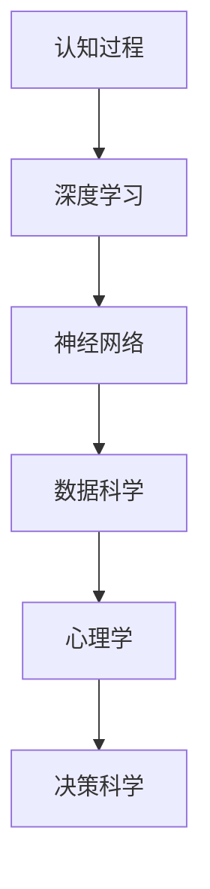

                 

# 认知过程中的深刻化演变

> 关键词：认知过程,深度学习,人工智能,神经网络,数据科学,心理学,决策科学

## 1. 背景介绍

认知过程是人类获取、处理、储存和应用信息的基本过程。在心理学领域，认知过程的研究已持续了数十年，涉及注意、记忆、语言、思维、决策等方面。然而，传统心理学方法难以处理大量的数据，使得该领域的知识发展相对缓慢。随着深度学习和大数据技术的兴起，认知过程的研究逐渐与数据科学结合，为认知心理学和人工智能领域的深度交叉研究提供了新的契机。

本文将从深度学习的视角出发，分析认知过程中的深刻化演变，包括神经网络模型的构建、深度学习的实际应用以及未来发展趋势。希望通过本文，读者能深入理解认知过程的神经科学基础，掌握深度学习在认知心理学中的应用，并对未来人工智能的发展有更清晰的认识。

## 2. 核心概念与联系

### 2.1 核心概念概述

- **认知过程**：指人类获取、处理、储存和应用信息的过程，涉及感觉、知觉、记忆、语言、思维、决策等环节。
- **深度学习**：基于人工神经网络的机器学习范式，通过逐层处理数据，学习抽象特征表示。
- **神经网络**：一种基于生物神经元网络的计算模型，用于模拟人类神经系统的工作机制。
- **数据科学**：利用数据、算法和工具，进行数据处理、分析和建模，从而得出有价值的信息。
- **心理学**：研究人类思维、情感、行为等心理现象的学科，与认知过程紧密相关。
- **决策科学**：涉及决策过程、风险评估、策略优化等，是认知心理学的重要应用领域。

### 2.2 核心概念原理和架构的 Mermaid 流程图(Mermaid 流程节点中不要有括号、逗号等特殊字符)



这个流程图展示了核心概念之间的联系：认知过程的研究通过深度学习和神经网络得到了新的数据科学工具，而心理学和决策科学又是认知过程应用的典型领域。

## 3. 核心算法原理 & 具体操作步骤

### 3.1 算法原理概述

深度学习算法基于人工神经网络，通过多层次的神经元进行信息处理。认知过程在深度学习中的模拟，主要依赖于人工神经网络的构建和优化，包括：

1. **神经元模型**：模拟生物神经元的功能，如线性激活、非线性激活等。
2. **层间连接**：神经元之间建立连接关系，构建复杂的神经网络结构，如卷积神经网络（CNN）、循环神经网络（RNN）等。
3. **损失函数**：定义网络输出的误差，通过最小化损失函数实现模型优化。
4. **优化算法**：如梯度下降算法，用于更新神经元权重和偏差，使得模型收敛。

### 3.2 算法步骤详解

#### 3.2.1 构建神经网络模型

深度学习中的神经网络模型由多个神经元层（Layer）组成，每个层都包含一组神经元。网络的结构可以通过不同的层和神经元配置实现，如：

1. **输入层**：接收原始数据，如图像像素值、声音波形等。
2. **隐藏层**：进行特征提取和数据处理，如卷积层、池化层等。
3. **输出层**：输出预测结果，如分类标签、回归值等。

#### 3.2.2 选择和配置神经元模型

神经元模型可以按照不同的激活函数、连接方式和层数进行配置。激活函数如Sigmoid、ReLU、Tanh等，连接方式如全连接、卷积连接、循环连接等，层数可以从几层到几十层甚至数百层。

#### 3.2.3 初始化权重和偏差

神经网络的每个神经元都有相应的权重和偏差，需要初始化为一个合理的数值。权重和偏差的初始化方式包括随机初始化、正态分布初始化、Xavier初始化等。

#### 3.2.4 训练神经网络模型

神经网络的训练过程通过反向传播算法进行。具体步骤如下：

1. **前向传播**：将输入数据逐层传递，通过神经元计算得到输出结果。
2. **损失函数计算**：计算输出结果与实际标签的误差，通常使用均方误差、交叉熵等。
3. **反向传播**：通过链式法则，计算损失函数对每个神经元权重的梯度，反向更新权重和偏差。
4. **优化算法迭代**：通过优化算法（如梯度下降）更新权重和偏差，逐步优化模型。

### 3.3 算法优缺点

#### 3.3.1 优点

深度学习算法在处理复杂问题时表现优异，具有以下优点：

1. **高精度**：神经网络具有强大的特征表示能力，能够学习到数据中的复杂模式。
2. **自适应性**：深度学习算法能够自动调整参数，适应不同任务。
3. **泛化能力**：深度学习算法在数据量充足的情况下，通常能够泛化到未见过的数据集。
4. **鲁棒性**：神经网络具有一定程度的噪声和异常值鲁棒性。

#### 3.3.2 缺点

深度学习算法也存在一些不足：

1. **训练时间长**：神经网络模型通常需要大量数据和计算资源进行训练，训练时间较长。
2. **过拟合风险**：深度学习模型容易过拟合训练数据，需要加入正则化等方法进行控制。
3. **可解释性差**：深度学习模型的决策过程往往难以解释，缺乏透明度。
4. **计算资源要求高**：深度学习模型需要高性能计算设备，如GPU等。

### 3.4 算法应用领域

深度学习算法已经在多个领域得到应用，包括但不限于：

1. **计算机视觉**：如图像识别、物体检测、人脸识别等。
2. **自然语言处理**：如文本分类、机器翻译、情感分析等。
3. **语音识别**：如语音转文本、语音识别等。
4. **推荐系统**：如电商推荐、新闻推荐等。
5. **智能控制**：如自动驾驶、机器人控制等。
6. **医学诊断**：如影像分析、病历分析等。

## 4. 数学模型和公式 & 详细讲解 & 举例说明

### 4.1 数学模型构建

深度学习模型的构建通常涉及以下几个步骤：

1. **定义神经网络结构**：确定神经元的数量、激活函数、层数等。
2. **定义损失函数**：选择适当的损失函数，如均方误差、交叉熵等。
3. **定义优化器**：选择适当的优化算法，如随机梯度下降、Adam等。

### 4.2 公式推导过程

以一个简单的二分类任务为例，神经网络模型的构建和训练过程如下：

假设输入数据为 $x$，输出为 $y$，神经网络结构如下：


其中，神经元激活函数为ReLU，权重矩阵为 $W$，偏置向量为 $b$。

神经元的输出 $z$ 为：

$$ z = f(xW + b) $$

其中 $f$ 为激活函数。

神经元的输出 $y$ 为：

$$ y = \sigma(z) $$

其中 $\sigma$ 为Sigmoid函数。

神经网络的损失函数为：

$$ L(y, \hat{y}) = -(y \log \hat{y} + (1-y) \log (1-\hat{y})) $$

神经网络的优化目标为：

$$ \min_{\theta} L(y, \hat{y}) $$

其中 $\theta$ 为神经网络的所有权重和偏差。

### 4.3 案例分析与讲解

以手写数字识别为例，该任务通常使用卷积神经网络（CNN）进行处理。

卷积神经网络由卷积层、池化层和全连接层组成，能够有效提取图像特征。具体步骤如下：

1. **卷积层**：通过卷积操作提取图像特征。
2. **池化层**：通过池化操作减少特征图尺寸。
3. **全连接层**：将特征图转换为类别标签。

通过反向传播算法，神经网络可以逐步优化模型参数，提高识别精度。

## 5. 项目实践：代码实例和详细解释说明

### 5.1 开发环境搭建

深度学习的开发环境搭建通常需要以下步骤：

1. **安装Python**：确保Python 3.x版本正确安装。
2. **安装TensorFlow或PyTorch**：选择一种深度学习框架进行开发，如TensorFlow、PyTorch等。
3. **安装NumPy和SciPy**：用于数据处理和数值计算。
4. **安装Pandas**：用于数据读写和处理。
5. **安装Scikit-learn**：用于机器学习算法实现。
6. **安装Jupyter Notebook**：用于编写和运行代码。

### 5.2 源代码详细实现

以下是一个简单的深度学习项目示例，用于手写数字识别。

```python
import tensorflow as tf
from tensorflow.keras import layers

# 定义模型
model = tf.keras.Sequential([
    layers.Conv2D(32, (3, 3), activation='relu', input_shape=(28, 28, 1)),
    layers.MaxPooling2D((2, 2)),
    layers.Flatten(),
    layers.Dense(64, activation='relu'),
    layers.Dense(10, activation='softmax')
])

# 编译模型
model.compile(optimizer='adam', loss='sparse_categorical_crossentropy', metrics=['accuracy'])

# 加载数据集
mnist = tf.keras.datasets.mnist
(x_train, y_train), (x_test, y_test) = mnist.load_data()

# 数据预处理
x_train = x_train / 255.0
x_test = x_test / 255.0

# 训练模型
model.fit(x_train.reshape(-1, 28, 28, 1), y_train, epochs=10, validation_data=(x_test.reshape(-1, 28, 28, 1), y_test))

# 评估模型
model.evaluate(x_test.reshape(-1, 28, 28, 1), y_test)
```

### 5.3 代码解读与分析

上述代码实现了一个简单的手写数字识别模型，主要步骤如下：

1. **定义模型**：使用Sequential模型定义卷积层、池化层和全连接层。
2. **编译模型**：指定优化器、损失函数和评价指标。
3. **加载数据集**：使用MNIST数据集，包含手写数字图片和标签。
4. **数据预处理**：将像素值归一化到0-1之间。
5. **训练模型**：使用Adam优化器和交叉熵损失函数，训练10个epoch。
6. **评估模型**：在测试集上评估模型性能。

## 6. 实际应用场景

### 6.1 智能决策系统

深度学习在智能决策系统中有着广泛的应用。智能决策系统能够基于大量历史数据，构建决策模型，自动生成最优决策方案。

在金融领域，智能决策系统可以用于股票市场预测、风险评估等任务。通过分析历史股票数据，模型能够学习到市场趋势、价格波动等因素，并预测未来市场走势。

在医疗领域，智能决策系统可以用于疾病预测、治疗方案推荐等任务。通过分析患者病历数据，模型能够识别出高风险患者，推荐最佳治疗方案。

### 6.2 智能客服系统

深度学习在智能客服系统中也有着广泛的应用。智能客服系统能够基于用户对话历史，自动生成回复，提供智能客服服务。

在电商领域，智能客服系统可以用于客户咨询、订单处理等任务。通过分析用户对话记录，模型能够理解用户意图，自动提供解决方案。

在银行业，智能客服系统可以用于客户咨询、账户管理等任务。通过分析用户对话记录，模型能够提供个性化服务，提升用户体验。

### 6.3 智能推荐系统

深度学习在智能推荐系统中也有着广泛的应用。智能推荐系统能够基于用户历史行为数据，推荐个性化的商品、新闻、视频等。

在电商领域，智能推荐系统可以用于商品推荐、用户画像分析等任务。通过分析用户购买历史、浏览记录，模型能够推荐相关商品，提升用户转化率。

在新闻领域，智能推荐系统可以用于新闻推荐、热点分析等任务。通过分析用户阅读历史、点击记录，模型能够推荐相关新闻，提升用户粘性。

### 6.4 未来应用展望

未来，深度学习在认知过程中的应用将更加广泛和深入。具体展望如下：

1. **多模态认知**：深度学习能够融合视觉、听觉、文本等多种模态信息，构建更加全面、复杂的认知模型。
2. **增强学习**：深度学习结合增强学习技术，能够自主学习最优决策策略，提升智能决策系统的性能。
3. **认知增强**：深度学习能够结合认知科学理论，提升人机交互的自然性和智能化水平，构建更加友好、高效的交互系统。
4. **多领域应用**：深度学习能够应用于更多领域，如教育、娱乐、交通等，提供更加智能、个性化服务。
5. **伦理与隐私**：深度学习在应用过程中需要考虑伦理和隐私问题，确保数据和模型的透明性和安全性。

## 7. 工具和资源推荐

### 7.1 学习资源推荐

深度学习的学习资源非常丰富，以下是一些推荐资源：

1. **Deep Learning Specialization**：Coursera提供的深度学习专项课程，由Andrew Ng教授主讲。
2. **Neural Networks and Deep Learning**：Michael Nielsen撰写的深度学习书籍，通俗易懂，适合初学者。
3. **Deep Learning**：Ian Goodfellow等人撰写的深度学习书籍，内容全面，适合进阶学习。
4. **PyTorch Tutorials**：PyTorch官方提供的教程，涵盖深度学习框架的使用和实践。
5. **TensorFlow Tutorials**：TensorFlow官方提供的教程，涵盖深度学习框架的使用和实践。

### 7.2 开发工具推荐

深度学习的开发工具也非常丰富，以下是一些推荐工具：

1. **Jupyter Notebook**：用于编写和运行代码，支持多平台，易于使用。
2. **TensorBoard**：TensorFlow配套的可视化工具，用于实时监测模型训练状态。
3. **Weights & Biases**：模型训练的实验跟踪工具，记录和可视化模型训练过程中的各项指标。
4. **GitHub**：代码托管平台，支持版本控制和团队协作。
5. **Google Colab**：免费的Jupyter Notebook环境，提供GPU/TPU算力。

### 7.3 相关论文推荐

以下是一些深度学习领域的重要论文，推荐阅读：

1. **ImageNet Classification with Deep Convolutional Neural Networks**：AlexNet论文，提出卷积神经网络（CNN），在ImageNet数据集上取得优异表现。
2. **Very Deep Convolutional Networks for Large-Scale Image Recognition**：Google提出的Inception网络，进一步提升了CNN的性能。
3. **Learning Phrase Representations using RNN Encoder–Decoder for Statistical Machine Translation**：Seq2Seq模型论文，提出循环神经网络（RNN）的编码器和解码器结构，实现机器翻译任务。
4. **A Neural Probabilistic Language Model**：Hinton等人提出的神经网络语言模型（NNLM），用于自然语言处理任务。
5. **Attention is All You Need**：Transformer论文，提出自注意力机制，提升NLP任务的性能。

## 8. 总结：未来发展趋势与挑战

### 8.1 总结

深度学习在认知过程中起到了重要作用，通过神经网络模型模拟认知过程，提高了认知心理学研究的效率和精度。深度学习在计算机视觉、自然语言处理、智能决策等领域得到了广泛应用，极大地推动了人工智能技术的发展。

未来，深度学习将继续与其他学科交叉融合，拓展其应用范围和深度，为认知过程的研究和应用带来更多可能性。

### 8.2 未来发展趋势

未来深度学习在认知过程中的发展趋势如下：

1. **多模态融合**：深度学习能够融合视觉、听觉、文本等多种模态信息，构建更加全面、复杂的认知模型。
2. **增强学习**：深度学习结合增强学习技术，能够自主学习最优决策策略，提升智能决策系统的性能。
3. **认知增强**：深度学习能够结合认知科学理论，提升人机交互的自然性和智能化水平，构建更加友好、高效的交互系统。
4. **伦理与隐私**：深度学习在应用过程中需要考虑伦理和隐私问题，确保数据和模型的透明性和安全性。

### 8.3 面临的挑战

尽管深度学习在认知过程中取得了显著进展，但也面临一些挑战：

1. **数据量要求高**：深度学习模型需要大量标注数据进行训练，获取高质量数据成本较高。
2. **模型复杂度高**：深度学习模型结构复杂，训练和推理耗时较长。
3. **可解释性差**：深度学习模型的决策过程难以解释，缺乏透明度。
4. **计算资源需求高**：深度学习模型需要高性能计算设备，如GPU等。
5. **鲁棒性不足**：深度学习模型在面对小样本和噪声数据时，泛化能力有限。

### 8.4 研究展望

未来的研究需要在以下几个方面进一步深入：

1. **数据采集与标注**：开发更高效的数据采集和标注方法，降低深度学习的训练成本。
2. **模型简化与优化**：研究更高效的模型结构和优化方法，提升深度学习模型的训练和推理速度。
3. **模型解释与可解释性**：开发更可解释的深度学习模型，提升模型的透明度和可信度。
4. **多领域应用**：将深度学习应用于更多领域，提升各领域的智能化水平。
5. **伦理与隐私保护**：结合伦理学和隐私保护技术，确保深度学习模型应用的安全性和公平性。

## 9. 附录：常见问题与解答

**Q1: 深度学习与认知过程有何关系？**

A: 深度学习通过模拟神经网络结构，能够模拟认知过程中的信息处理和决策过程，从而提升认知心理学研究的效率和精度。

**Q2: 深度学习在实际应用中存在哪些问题？**

A: 深度学习在实际应用中面临数据量要求高、模型复杂度高、可解释性差、计算资源需求高等问题，需要进行更多的研究和优化。

**Q3: 未来深度学习的发展方向有哪些？**

A: 未来深度学习的发展方向包括多模态融合、增强学习、认知增强、伦理与隐私保护等，将深度学习应用于更多领域，提升各领域的智能化水平。

**Q4: 如何提升深度学习模型的可解释性？**

A: 提升深度学习模型的可解释性，可以通过可视化技术、模型简化与优化、解释性模型等方法实现。

**Q5: 如何保护深度学习模型的隐私与安全？**

A: 保护深度学习模型的隐私与安全，可以通过数据匿名化、模型加密、访问控制等方法实现，确保数据和模型的透明性和安全性。

---

作者：禅与计算机程序设计艺术 / Zen and the Art of Computer Programming

