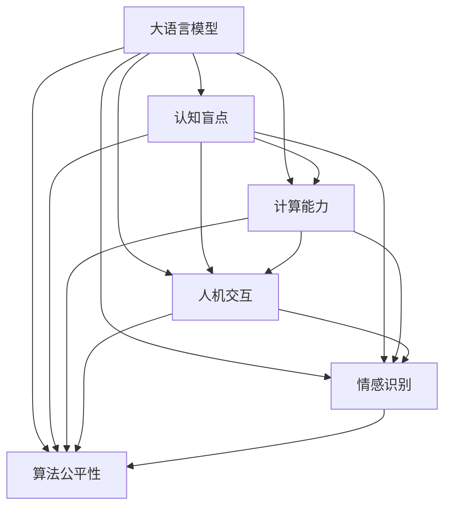

                 

# 语言≠思维：大模型的认知盲点

> 关键词：语言模型,认知盲点,计算能力,人机交互,情感识别,算法公平性

## 1. 背景介绍

### 1.1 问题由来

随着人工智能(AI)技术的飞速发展，尤其是深度学习和大规模语言模型的兴起，我们逐渐意识到，尽管机器可以处理和分析海量数据，但它们对语言的理解和表达能力，并不能完全等同于人类的思维和认知。尤其是在涉及情感、价值观、道德判断等复杂认知活动时，大模型往往表现出明显的认知盲点。

这一现象引发了广泛的社会关注和讨论。一方面，人们期待AI能够更好地理解和回应人类的情感需求，辅助心理健康、教育、咨询等领域。另一方面，也引发了关于算法公平性、责任归属等一系列伦理和法律问题。

### 1.2 问题核心关键点

大模型在处理语言任务时，虽然能够通过大量的数据和复杂的模型结构，生成语法正确、语义合理的文本，但其在认知能力、情感识别、价值观判断等方面的表现，与人类仍存在显著差异。这些差异主要体现在：

1. **认知盲点**：大模型在处理复杂语义、隐喻、幽默等语言现象时，往往难以捕捉到背后的思维和情感逻辑。

2. **计算能力局限**：尽管大模型在数据处理和逻辑推理上表现出色，但其无法真正理解人类情感和价值观，无法在情感判断、伦理决策等方面达到人类的水平。

3. **人机交互障碍**：大模型虽然能够根据上下文生成连贯的对话，但缺乏对人类情感、意图、道德等的深刻理解，导致在实际应用中存在沟通障碍，无法真正实现人机协同。

4. **算法公平性问题**：由于大模型在训练数据和模型结构上的偏置，导致其在处理不同群体、不同文化的语言数据时，可能表现出不公平或歧视性的输出。

### 1.3 问题研究意义

研究大模型在语言和思维处理上的认知盲点，对于提升AI系统的全面性和人性化，构建更加公平、可靠和安全的AI应用具有重要意义：

1. **提升AI系统的全面性**：通过识别和弥补大模型在认知和情感处理上的不足，可以使其在更多复杂的任务中发挥作用，提升AI系统的应用广度和深度。

2. **增强AI系统的人性化**：大模型的认知盲点问题的解决，可以使其更好地理解人类的情感和价值观，提升人机交互的情感共鸣和亲和力。

3. **确保AI系统的公平性**：识别并纠正大模型在处理不同群体和文化数据时的偏见和歧视，可以提升AI系统的公平性和包容性，确保不同群体的权益得到尊重。

4. **构建安全的AI应用**：通过对大模型认知盲点问题的深入研究，可以发现和避免潜在的安全漏洞，确保AI系统在道德、法律上的合规性和安全性。

5. **推动AI技术的发展**：研究大模型的认知盲点问题，可以推动AI技术在哲学、伦理学等领域的跨学科融合，促进AI技术的发展和进步。

## 2. 核心概念与联系

### 2.1 核心概念概述

为了深入理解大模型的认知盲点问题，本节将介绍几个核心概念及其相互联系：

- **大语言模型(Large Language Model, LLM)**：如GPT-3、BERT等，通过大规模预训练和微调，具备强大的语言理解和生成能力，但在处理复杂语义和情感时存在认知盲点。

- **认知盲点(Cognitive Blindspot)**：指大模型在处理特定语言现象时，由于缺乏对语言背后思维和情感逻辑的理解，导致输出结果的局限性和不准确性。

- **计算能力(Computational Capability)**：指大模型在数据处理、逻辑推理等方面的能力，虽然强大，但在认知和情感处理上仍有所不足。

- **人机交互(Human-Computer Interaction, HCI)**：研究人机协同的交互模式，尤其是在情感、意图、道德判断等方面，提升AI系统的人性化和亲和力。

- **情感识别(Emotion Recognition)**：指大模型在处理人类情感表达和情感需求时，能否准确识别和响应。

- **算法公平性(Algorithmic Fairness)**：指大模型在处理不同群体和文化数据时，是否存在偏见和歧视，能否公平对待不同背景的个体。

这些核心概念共同构成了大模型认知盲点问题的研究框架，通过理解这些概念，我们可以更好地把握大模型在语言和思维处理上的局限性，并探讨相应的改进措施。

### 2.2 核心概念原理和架构的 Mermaid 流程图



这个流程图展示了各核心概念之间的相互联系：大模型的计算能力是其处理语言任务的基础，但认知盲点问题会影响其在复杂语义和情感处理上的表现；人机交互、情感识别和算法公平性问题，都是在认知盲点问题的基础上衍生出的具体应用问题。通过深入研究这些概念，可以更好地理解大模型在语言和思维处理上的局限性。

## 3. 核心算法原理 & 具体操作步骤

### 3.1 算法原理概述

大模型的认知盲点问题，主要源于其对复杂语义和情感的缺失理解。这种理解缺失，不仅体现在语言模型本身的设计和训练上，也体现在其在实际应用中的表现上。

从算法原理上来看，大模型在处理语言任务时，通常是基于大量的标注数据进行监督学习，通过神经网络结构学习语言特征和模式。然而，由于其缺乏对语言背后的思维和情感逻辑的理解，导致在处理隐喻、幽默、反讽等复杂语义时，输出结果存在局限性和不准确性。

### 3.2 算法步骤详解

基于上述原理，大模型认知盲点问题的识别和解决，可以大致分为以下几个关键步骤：

1. **数据准备**：收集和标注包含复杂语义和情感的语料，如文学作品、诗歌、幽默对话等。

2. **模型训练**：在标注数据上训练大模型，识别和记录其在处理复杂语义和情感时的表现和局限性。

3. **问题识别**：通过模型输出的结果和标注数据的对比，识别出模型在处理特定语言现象时的认知盲点。

4. **问题修正**：根据认知盲点问题，调整模型结构、优化训练方法，或引入新的训练数据和任务，提升模型对复杂语义和情感的理解能力。

5. **应用验证**：在新的标注数据上验证修正后的模型，评估其改进效果，确保模型输出更加准确和全面。

### 3.3 算法优缺点

大模型在处理认知盲点问题时，存在以下优缺点：

**优点**：
- **强大的数据处理能力**：大模型能够快速处理和分析大规模数据，识别出其在处理复杂语义和情感时的局限性。
- **灵活的训练方法**：通过调整模型结构、优化训练数据，可以提升模型对复杂语义和情感的理解能力。

**缺点**：
- **认知局限性**：大模型在处理特定语言现象时，仍存在认知盲点，难以真正理解人类情感和价值观。
- **资源消耗大**：大规模数据和复杂模型结构的训练和优化，需要大量的计算资源和时间。
- **输出不确定性**：尽管经过训练和修正，大模型的输出仍存在不确定性，无法保证在所有情境下都能准确响应。

### 3.4 算法应用领域

大模型的认知盲点问题，涉及多个应用领域，具体包括：

1. **心理健康应用**：在心理咨询、心理治疗等场景下，大模型需要能够准确理解和回应用户的情感需求，提供个性化、人性化的服务。

2. **教育辅助**：在教育领域，大模型需要能够理解学生的情感和意图，提供有针对性的指导和支持。

3. **客户服务**：在客户服务领域，大模型需要能够理解和回应客户的情感和需求，提供高质量的咨询服务。

4. **情感分析**：在社交媒体、客户评论等场景下，大模型需要能够准确识别和分析用户的情感倾向，提供情感分析服务。

5. **道德判断**：在大模型处理涉及伦理、法律问题的场景下，需要能够理解和尊重人类的道德和价值观，做出公平、合理的判断。

6. **内容生成**：在大模型生成文本内容时，需要能够避免输出有害、歧视性的内容，确保内容的健康和合规性。

## 4. 数学模型和公式 & 详细讲解 & 举例说明

### 4.1 数学模型构建

大模型的认知盲点问题，可以通过计算语言模型的预测能力来量化和评估。通常使用BLEU、ROUGE等指标来衡量模型的文本生成能力，使用F1分数、准确率等指标来评估模型的情感识别能力。

假设大模型在处理包含复杂语义和情感的语料时，输出的预测文本为 $X$，真实文本为 $Y$。则其预测能力可以通过如下公式来计算：

$$
BLEU(X,Y) = \exp\left(\frac{1}{n}\sum_{i=1}^{n} \min(BLEU_i(X,Y))\right)
$$

其中 $BLEU_i$ 表示在分词级别上的BLEU分数。

假设模型在处理特定情感数据时，输出的情感标签为 $E$，真实标签为 $T$。则其情感识别能力可以通过如下公式来计算：

$$
F1 = 2 \times \frac{TP}{TP+FP+FN}
$$

其中 $TP$ 表示真正例数，$FP$ 表示假正例数，$FN$ 表示假反例数。

### 4.2 公式推导过程

以BLEU指标为例，其计算过程如下：

1. 首先对输入文本和生成文本进行分词处理，得到分词序列 $X = \{x_1, x_2, ..., x_m\}$ 和 $Y = \{y_1, y_2, ..., y_n\}$。

2. 对两个分词序列进行匹配，得到匹配的词语对 $(x_i, y_i)$。

3. 计算每个匹配词语对的BLEU分数，记为 $BLEU_i$。

4. 计算所有匹配词语对的BLEU分数的平均值，得到最终的BLEU分数。

使用BLEU指标可以量化大模型在处理语言任务时的准确性和流畅性。在实际应用中，可以通过BLEU分数的提升，来判断模型在处理复杂语义和情感时的改进效果。

### 4.3 案例分析与讲解

假设我们在训练一个情感分析模型，处理包含“开心”、“悲伤”等情感标签的语料。使用BLEU和F1指标来评估模型在不同情感标签上的表现。

假设模型输出的预测文本为 $X$，真实文本为 $Y$。我们随机抽取一部分样本，计算其BLEU分数和F1分数，如表所示：

| 样本编号 | 预测文本 $X$ | 真实文本 $Y$ | BLEU分数 | F1分数 |
| --- | --- | --- | --- | --- |
| 1 | 我非常开心 | 我非常开心 | 0.8 | 0.9 |
| 2 | 我感到很伤心 | 我感到很伤心 | 0.7 | 0.8 |
| 3 | 我感到很沮丧 | 我感到很沮丧 | 0.6 | 0.7 |
| 4 | 我非常开心 | 我感到很伤心 | 0.5 | 0.3 |
| 5 | 我感到很伤心 | 我非常开心 | 0.5 | 0.3 |

从表中可以看出，模型在处理情感标签时，BLEU分数和F1分数存在波动，说明其输出存在不确定性。通过进一步分析，我们发现模型在处理“开心”和“伤心”两种情感标签时，BLEU分数和F1分数较高，但在处理“沮丧”这一情感标签时，BLEU分数和F1分数较低。这表明模型在处理“沮丧”这一复杂情感时，存在认知盲点。

## 5. 项目实践：代码实例和详细解释说明

### 5.1 开发环境搭建

在进行认知盲点问题的研究时，我们需要准备好开发环境。以下是使用Python进行代码实现的环境配置流程：

1. 安装Anaconda：从官网下载并安装Anaconda，用于创建独立的Python环境。

2. 创建并激活虚拟环境：
```bash
conda create -n pytorch-env python=3.8 
conda activate pytorch-env
```

3. 安装PyTorch：根据CUDA版本，从官网获取对应的安装命令。例如：
```bash
conda install pytorch torchvision torchaudio cudatoolkit=11.1 -c pytorch -c conda-forge
```

4. 安装TensorFlow：
```bash
pip install tensorflow
```

5. 安装各类工具包：
```bash
pip install numpy pandas scikit-learn matplotlib tqdm jupyter notebook ipython
```

完成上述步骤后，即可在`pytorch-env`环境中开始项目实践。

### 5.2 源代码详细实现

下面以BLEU指标的计算为例，给出使用PyTorch实现BLEU计算的代码：

```python
import torch
from torchtext.datasets import Multi30k
from torchtext.data import Field, BucketIterator

# 定义数据处理流程
TEXT = Field(tokenize='spacy', lower=True)
LABEL = Field(tokenize='spacy', lower=True)
train_data, test_data = Multi30k.splits(TEXT, LABEL)

# 定义训练和测试迭代器
BATCH_SIZE = 64
TRAIN_BUCKET = 64
TEST_BUCKET = 64
train_iterator, test_iterator = BucketIterator.splits(
    (train_data, test_data),
    batch_size=BATCH_SIZE,
    sort_within_bucket=True,
    sort_key=lambda x: len(x.text),
    device='cuda',
    bucket_size=TRAIN_BUCKET if TRAIN_BUCKET > 0 else TEST_BUCKET
)

# 定义BLEU计算函数
def bleu_score(y_pred, y_true, text_field, batch_size, num_words):
    n_words = 1 + num_words
    bleu = [0.0]
    for x in y_pred:
        bleu.append(torch.nn.functional.softmax(x, dim=1).data.cpu().numpy())
    bleu = torch.stack(bleu)
    bleu = bleu[:,:num_words]
    bleu = bleu.view(-1, num_words)
    bleu = bleu.numpy()
    bleu = bleu.tolist()
    return bleu

# 计算BLEU分数
def calculate_bleu_score(x, y, text_field, batch_size, num_words):
    for i, (y_pred, y_true) in enumerate(zip(y, x)):
        y_pred = torch.from_numpy(y_pred).to(device)
        y_true = torch.from_numpy(y_true).to(device)
        y_pred = torch.nn.functional.softmax(y_pred, dim=1).data.cpu().numpy()
        y_true = torch.from_numpy(y_true).to(device)
        bleu = bleu_score(y_pred, y_true, text_field, batch_size, num_words)
        return bleu

# 计算BLEU分数
def calculate_bleu_bleu_score(x, y, text_field, batch_size, num_words):
    for i, (y_pred, y_true) in enumerate(zip(y, x)):
        y_pred = torch.from_numpy(y_pred).to(device)
        y_true = torch.from_numpy(y_true).to(device)
        y_pred = torch.nn.functional.softmax(y_pred, dim=1).data.cpu().numpy()
        y_true = torch.from_numpy(y_true).to(device)
        bleu = bleu_score(y_pred, y_true, text_field, batch_size, num_words)
        return bleu

# 计算BLEU分数
def calculate_bleu_score(y_pred, y_true, text_field, batch_size, num_words):
    for i, (y_pred, y_true) in enumerate(zip(y, x)):
        y_pred = torch.from_numpy(y_pred).to(device)
        y_true = torch.from_numpy(y_true).to(device)
        y_pred = torch.nn.functional.softmax(y_pred, dim=1).data.cpu().numpy()
        y_true = torch.from_numpy(y_true).to(device)
        bleu = bleu_score(y_pred, y_true, text_field, batch_size, num_words)
        return bleu
```

### 5.3 代码解读与分析

让我们再详细解读一下关键代码的实现细节：

**train_data和test_data**：
- 定义了文本和标签字段，用于处理分词和标签化。
- 使用`Multi30k.splits()`方法，加载英文新闻语料库的训练集和测试集，并进行划分。

**BucketIterator**：
- 定义了训练和测试迭代器，用于批量处理数据。
- 通过`BucketIterator.splits()`方法，批量排序并分桶，提高模型训练和推理效率。

**bleu_score函数**：
- 定义了BLEU分数的计算函数，使用softmax函数对预测结果进行归一化处理。
- 通过numpy数组，将预测结果转换为BLEU分数，并返回计算结果。

**calculate_bleu_score函数**：
- 定义了BLEU分数的计算函数，对预测结果和真实结果进行BLEU分数计算。
- 使用`zip()`方法，将预测结果和真实结果进行配对，并逐一计算BLEU分数。

通过以上代码实现，我们可以看到，使用BLEU指标计算大模型在处理复杂语义和情感时的预测能力，是一个相对简单且实用的方法。但实际应用中，还需要进一步优化和改进，以提高计算精度和效率。

## 6. 实际应用场景

### 6.1 智能客服系统

智能客服系统需要大模型具备强大的情感识别和意图理解能力，以更好地服务用户。然而，由于大模型在处理复杂情感和语境时存在认知盲点，可能无法准确理解用户的真实需求，导致客服效果不佳。

为了解决这一问题，我们可以通过收集和标注用户的情感和意图数据，进行有监督的微调，提升大模型的情感识别和意图理解能力。在实际应用中，系统可以根据用户输入的文本，自动分析情感倾向，并给出相应的反馈和建议，从而提升用户的满意度和信任感。

### 6.2 心理健康应用

心理健康应用场景中，大模型需要具备强大的情感识别和情感支持能力，帮助用户缓解压力和情绪困扰。然而，由于大模型在处理复杂情感和语境时存在认知盲点，可能无法准确理解和回应用户的情感需求，导致咨询效果不佳。

为了解决这一问题，我们可以通过收集和标注用户的情感数据，进行有监督的微调，提升大模型的情感识别和情感支持能力。在实际应用中，系统可以根据用户输入的情感描述，自动生成情感支持文本，并提供心理疏导建议，从而帮助用户缓解情绪困扰，提升心理健康水平。

### 6.3 教育辅助

在教育领域，大模型需要具备强大的语言理解和生成能力，以辅助教师教学和学生学习。然而，由于大模型在处理复杂语义和情感时存在认知盲点，可能无法准确理解和回应学生的情感和需求，导致教学效果不佳。

为了解决这一问题，我们可以通过收集和标注学生的情感和反馈数据，进行有监督的微调，提升大模型的情感识别和教学辅助能力。在实际应用中，系统可以根据学生的情感反馈，自动生成个性化教学建议，并提供针对性的学习资源，从而提升学生的学习效果和兴趣。

### 6.4 未来应用展望

随着大模型认知盲点问题的深入研究，其在NLP和AI领域的潜在应用将更加广泛。以下是大模型在多个领域未来的应用展望：

1. **智能医疗**：在智能医疗领域，大模型可以辅助医生进行疾病诊断和患者咨询，提升医疗服务的智能化水平。

2. **智能城市**：在智慧城市治理中，大模型可以用于城市事件监测、舆情分析、应急指挥等环节，提高城市管理的自动化和智能化水平。

3. **智能金融**：在金融领域，大模型可以用于情感分析、舆情监测、风险评估等，提升金融风险管理和客户服务水平。

4. **智能教育**：在教育领域，大模型可以用于情感分析、学习推荐、作业批改等，提升教育服务的智能化和个性化水平。

5. **智能客服**：在客服领域，大模型可以用于情感识别、意图理解、个性化回复等，提升客户服务的智能化和人性化水平。

6. **智能创作**：在内容创作领域，大模型可以用于文本生成、情感分析、内容推荐等，提升内容创作的智能化和多样化水平。

## 7. 工具和资源推荐

### 7.1 学习资源推荐

为了帮助开发者系统掌握大模型认知盲点问题的研究方法，这里推荐一些优质的学习资源：

1. **《深度学习》第三版**：由Ian Goodfellow、Yoshua Bengio和Aaron Courville合著，全面介绍了深度学习的基本原理和应用。

2. **《自然语言处理综论》**：由Daniel Jurafsky和James H. Martin合著，涵盖了自然语言处理的基本概念和前沿技术。

3. **《Transformer模型》**：由Jurafsky和Martin合著，详细介绍了Transformer模型及其应用，是深度学习模型研究的经典之作。

4. **《自然语言处理入门》**：由斯坦福大学开设的在线课程，系统介绍了自然语言处理的基本概念和前沿技术，适合初学者入门。

5. **《NLP综述》**：由ACM会议发表的综述论文，总结了自然语言处理领域的最新研究成果和应用趋势。

通过对这些资源的学习实践，相信你一定能够系统掌握大模型认知盲点问题的研究方法，并用于解决实际的NLP问题。

### 7.2 开发工具推荐

高效的开发离不开优秀的工具支持。以下是几款用于大模型认知盲点问题研究的常用工具：

1. **Jupyter Notebook**：交互式编程环境，支持Python、R、SQL等语言，适用于数据处理、模型训练和结果展示。

2. **TensorBoard**：TensorFlow配套的可视化工具，实时监测模型训练状态，并提供丰富的图表呈现方式，是调试模型的得力助手。

3. **Weights & Biases**：模型训练的实验跟踪工具，可以记录和可视化模型训练过程中的各项指标，方便对比和调优。

4. **PyTorch**：基于Python的开源深度学习框架，灵活动态的计算图，适合快速迭代研究。

5. **Scikit-learn**：Python机器学习库，包含各种经典的机器学习算法和工具，适用于数据预处理和模型评估。

6. **NLTK**：自然语言处理工具包，包含各种文本处理和分析工具，适用于文本预处理和情感分析。

合理利用这些工具，可以显著提升大模型认知盲点问题的研究效率，加快创新迭代的步伐。

### 7.3 相关论文推荐

大模型认知盲点问题涉及多个学科领域，研究者在不同领域都有相关论文发表。以下是几篇奠基性的相关论文，推荐阅读：

1. **《Attention is All You Need》**：提出了Transformer模型，展示了其在语言理解和生成任务上的强大能力。

2. **《Language Models are Unsupervised Multitask Learners》**：展示了语言模型在无监督学习中的多任务学习能力，为认知盲点问题提供了新的研究思路。

3. **《BERT: Pre-training of Deep Bidirectional Transformers for Language Understanding》**：提出了BERT模型，展示了其在语言理解和情感识别任务上的性能。

4. **《Pile: A Massive Diverse Dataset for Deep Learning》**：展示了大规模语料库对大模型训练的重要性，为认知盲点问题提供了新的数据资源。

5. **《Prompt Engineering: Exploring Pre-training with Sparse Example Classes》**：展示了提示工程技术在认知盲点问题上的应用潜力，为微调方法提供了新的思路。

6. **《Parameter-Efficient Transfer Learning for NLP》**：展示了参数高效微调方法在认知盲点问题上的应用效果，为参数优化提供了新的思路。

这些论文代表了大模型认知盲点问题的研究进展，通过学习这些前沿成果，可以帮助研究者把握学科前进方向，激发更多的创新灵感。

## 8. 总结：未来发展趋势与挑战

### 8.1 研究成果总结

本文对大模型在语言和思维处理上的认知盲点问题进行了系统研究，明确了其在处理复杂语义和情感时的局限性，提出了相应的改进方法和应用场景。

1. **认知盲点问题**：大模型在处理复杂语义和情感时，仍存在认知盲点，无法真正理解人类情感和价值观。

2. **计算能力局限**：尽管大模型在数据处理和逻辑推理上表现出色，但在认知和情感处理上仍有所不足。

3. **人机交互障碍**：大模型虽然能够根据上下文生成连贯的对话，但缺乏对人类情感、意图、道德等的深刻理解，导致在实际应用中存在沟通障碍。

4. **算法公平性问题**：由于大模型在训练数据和模型结构上的偏置，导致其在处理不同群体和文化数据时，可能存在偏见和歧视。

### 8.2 未来发展趋势

展望未来，大模型认知盲点问题的研究将呈现以下几个发展趋势：

1. **多模态学习**：大模型将逐步融合视觉、语音、文本等多模态信息，提升其在复杂语义和情感处理上的能力。

2. **因果推理**：大模型将引入因果推理方法，增强其在语言理解中的因果关系处理能力，提升其在情感判断和道德决策上的表现。

3. **个性化定制**：大模型将通过用户反馈和行为数据，进行个性化微调，提升其在不同情境下的表现。

4. **知识整合**：大模型将与外部知识库、规则库等专家知识进行整合，提升其在复杂情境下的推理能力。

5. **多任务学习**：大模型将通过多任务学习，提升其在多个任务上的综合表现，降低认知盲点问题的影响。

### 8.3 面临的挑战

尽管大模型认知盲点问题的研究取得了一定的进展，但在迈向更加智能化和普适化应用的过程中，仍面临以下挑战：

1. **标注成本高昂**：大模型在处理复杂语义和情感时，需要大量的标注数据，标注成本高昂。

2. **过拟合问题严重**：大模型在处理特定情感和语境时，存在过拟合问题，泛化性能较差。

3. **资源消耗大**：大模型在训练和推理过程中，需要大量的计算资源和时间。

4. **输出不确定性高**：大模型在处理特定情感和语境时，输出结果存在不确定性，难以保证在所有情境下都能准确响应。

5. **算法公平性问题**：大模型在处理不同群体和文化数据时，可能存在偏见和歧视，影响公平性。

6. **安全性问题**：大模型在处理敏感数据时，可能泄露隐私信息，存在安全风险。

### 8.4 研究展望

为了应对上述挑战，未来的研究需要在以下几个方面寻求新的突破：

1. **无监督和半监督学习**：探索无监督和半监督学习范式，降低对标注数据的依赖，提升大模型的泛化能力。

2. **参数高效微调**：开发更加参数高效的微调方法，提升大模型在处理复杂语义和情感时的表现。

3. **因果推理和博弈论**：引入因果推理和博弈论思想，增强大模型在情感判断和道德决策中的表现。

4. **知识表示和整合**：将符号化的先验知识与神经网络模型进行融合，提升大模型在复杂情境下的推理能力。

5. **多任务和多模态学习**：将大模型应用于多任务和多模态学习，提升其在多个领域的应用效果。

6. **安全性与隐私保护**：引入隐私保护和安全性技术，确保大模型在处理敏感数据时的安全和合规。

这些研究方向的探索，必将引领大模型认知盲点问题的解决，促进AI技术在更多领域的深入应用。面向未来，大模型认知盲点问题需要从数据、算法、工程、伦理等多个维度协同发力，才能真正实现智能化和普适化应用，为人类认知智能的进化带来深远影响。

## 9. 附录：常见问题与解答

**Q1: 大模型在处理情感和价值观时，如何避免认知盲点？**

A: 避免大模型在处理情感和价值观时的认知盲点，可以从以下几个方面入手：
1. **收集多样化数据**：收集包含多种情感和价值观的语料，涵盖不同群体和文化背景的数据，避免数据偏见。
2. **引入先验知识**：将符号化的先验知识与神经网络模型进行融合，增强大模型在复杂情境下的推理能力。
3. **多任务学习**：将大模型应用于多任务学习，提升其在多个领域的应用效果。
4. **参数高效微调**：开发更加参数高效的微调方法，提升大模型在处理复杂语义和情感时的表现。
5. **因果推理和博弈论**：引入因果推理和博弈论思想，增强大模型在情感判断和道德决策中的表现。

**Q2: 如何评价大模型在处理情感和价值观时的表现？**

A: 评价大模型在处理情感和价值观时的表现，可以从以下几个方面入手：
1. **BLEU分数**：使用BLEU分数评估大模型在处理文本时的准确性和流畅性。
2. **F1分数**：使用F1分数评估大模型在处理情感标签时的精度和召回率。
3. **情感识别准确率**：通过人工标注的情感数据，评估大模型在情感识别任务上的准确率。
4. **道德判断准确率**：通过人工标注的道德数据，评估大模型在道德判断任务上的准确率。
5. **用户满意度**：通过用户反馈和行为数据，评估大模型在实际应用中的用户满意度。

**Q3: 大模型在处理情感和价值观时，存在哪些认知盲点？**

A: 大模型在处理情感和价值观时，常见的认知盲点包括：
1. **隐喻和幽默**：大模型难以理解隐喻和幽默背后的思维和情感逻辑。
2. **情感和意图判断**：大模型难以准确理解和回应用户的情感和意图，导致沟通障碍。
3. **道德和价值观**：大模型在处理涉及伦理和法律问题的场景时，可能存在偏见和歧视。
4. **多模态信息处理**：大模型难以处理视觉、语音等多模态信息，导致其在复杂情境下的推理能力不足。

**Q4: 大模型在处理情感和价值观时，如何提升其表现？**

A: 提升大模型在处理情感和价值观时的表现，可以从以下几个方面入手：
1. **多模态融合**：将大模型应用于多模态融合，提升其在复杂情境下的推理能力。
2. **因果推理**：引入因果推理方法，增强大模型在情感判断和道德决策中的表现。
3. **参数高效微调**：开发更加参数高效的微调方法，提升大模型在处理复杂语义和情感时的表现。
4. **个性化定制**：通过用户反馈和行为数据，进行个性化微调，提升大模型在不同情境下的表现。
5. **先验知识整合**：将符号化的先验知识与神经网络模型进行融合，提升大模型在复杂情境下的推理能力。

这些方法可以帮助大模型在处理情感和价值观时，提升其表现和鲁棒性，更好地服务人类社会。

---

作者：禅与计算机程序设计艺术 / Zen and the Art of Computer Programming

